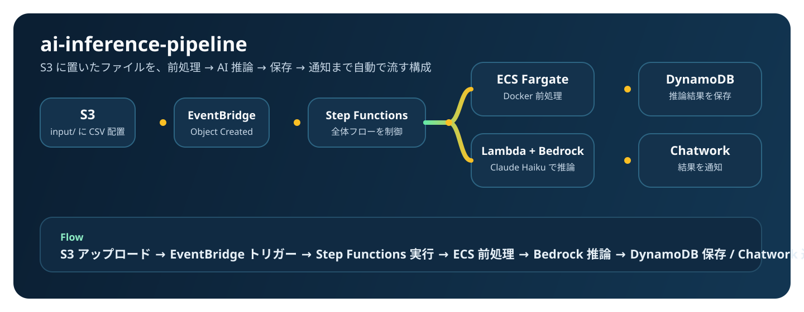

# ai-inference-pipeline

S3トリガー → Step Functions → ECS Fargate（Docker前処理）→ Lambda × Bedrock（AI推論）→ DynamoDB → Chatwork通知
のAI推論パイプライン。全リソースTerraform管理。



---

## このハンズオンで得られること

### 構築するもの
ファイルをS3に置くだけで**自動的にAI分析が走り、結果がChatworkに届く**イベント駆動型パイプライン。

```
S3にCSVを置く → 自動で前処理 → Claude Haiku が分析 → Chatworkに結果通知
（〜5分でE2E完走）
```

### 身につくスキル

| カテゴリ | 具体的に学べること |
|---|---|
| **IaC** | Terraform のモジュール分割・依存関係管理・循環参照の解決パターン |
| **コンテナ** | arm64 向け Docker ビルド・ECR プッシュ・ECS Fargate Spot の設定 |
| **サーバーレス** | Lambda（Python 3.12 / Powertools）・Step Functions の Retry/Catch 設計 |
| **生成AI** | Amazon Bedrock の InvokeModel API・プロンプト設計・IAM によるモデルロック |
| **ネットワーク** | NAT Gateway 不使用設計・VPC Endpoint（Gateway型/Interface型）の使い分け |
| **セキュリティ** | IAM 最小権限の実践・SSM Parameter Store によるシークレット管理 |
| **コスト設計** | Fargate Spot・Graviton2（arm64）・DynamoDB PAY_PER_REQUEST による最適化 |
| **可観測性** | CloudWatch Logs 構造化ログ・X-Ray トレーシング・Step Functions 実行履歴 |

### ポートフォリオとして示せること
- 複数の AWS サービスを組み合わせたエンドツーエンドの設計力
- コストとセキュリティを意識した現場レベルの実装
- ADR（Architecture Decision Record）による設計判断の言語化

---

## アーキテクチャ

```
S3 (input/)
  → EventBridge（Object Created）
  → Step Functions（aip-dev-inference-pipeline）
      ├─ ECS Fargate（前処理コンテナ / Docker / arm64 / Spot）
      ├─ Lambda（invoke_bedrock / Bedrock Claude Haiku 推論）
      └─ Lambda（notify_chatwork / Chatwork 通知）
  → DynamoDB（aip-dev-results / 結果永続化）
```

詳細は [ARCHITECTURE.md](ARCHITECTURE.md) を参照。

---

## 技術スタック

| レイヤー | 技術 | 備考 |
|---|---|---|
| IaC | Terraform >= 1.6.0 | モジュール分割・環境分離 |
| コンテナ | Docker (linux/arm64) + ECS Fargate Spot | Graviton2 で約20%コスト削減 |
| AI推論 | Amazon Bedrock (Claude 3 Haiku) | IAM でモデルID固定 |
| ワークフロー | AWS Step Functions (STANDARD) | Retry/Catch・ECS 完了同期待機 |
| Lambda | Python 3.12 / arm64 / Lambda Powertools | 構造化ログ・X-Ray 内蔵 |
| DB | DynamoDB (PAY_PER_REQUEST) | TTL 7日・GSI で status クエリ |
| 通知 | Chatwork API | SSM で Token 管理 |
| ネットワーク | VPC Endpoints のみ（NAT Gateway 不使用） | Gateway型: 無料 / Interface型: ~$7/月 |

---

## コスト設計

| 決定 | 削減効果 | 理由 |
|---|---|---|
| NAT Gateway 不使用 | **▲ ~$32/月** | VPC Endpoint で代替 |
| Fargate Spot 優先（80%） | **▲ 最大70%** | 前処理はリトライ可能な冪等処理 |
| arm64（Graviton2）統一 | **▲ 約20%** | ECS・Lambda 両方で適用 |
| DynamoDB PAY_PER_REQUEST | 無駄なキャパシティゼロ | アクセス量が予測不能な開発用途 |
| Bedrock Haiku | **▲ ~60% vs Sonnet** | 要約・分類タスクは Haiku で十分 |

**月額概算（dev・低負荷時）**: $13〜21/月

---

## 前提条件

### 必要なツール

```bash
# バージョン確認コマンド
terraform version        # >= 1.6.0
aws --version            # AWS CLI v2
docker buildx version    # arm64 ビルド対応
python3 --version        # >= 3.10（スクリプト実行用）
```

### AWS の準備

| 項目 | 確認方法 |
|---|---|
| AWS CLI 認証設定済み | `aws sts get-caller-identity` でアカウントIDが返ること |
| Amazon Bedrock の Claude 3 Haiku が有効 | [Bedrockコンソール](https://ap-northeast-1.console.aws.amazon.com/bedrock/home?region=ap-northeast-1#/modelaccess) でモデルアクセスを申請済みであること |
| 既存 VPC（プライベートサブネット付き） | VPC ID・サブネット ID・VPC CIDR を手元に用意 |

> **Bedrock のモデルアクセス申請**（初回のみ）
> Bedrock コンソール → 「モデルアクセス」→「アクセスを管理」→ Claude 3 Haiku にチェック → 保存

### Docker の arm64 ビルド環境

```bash
# QEMU エミュレータのセットアップ（Mac/Linux）
docker run --privileged --rm tonistiigi/binfmt --install all

# buildx ビルダー作成（初回のみ）
docker buildx create --name multiarch --use
docker buildx inspect --bootstrap
```

---

## ハンズオン実行手順

### 全体の流れ

```
Phase 1: Terraform 基盤（VPC Endpoints / S3 / DynamoDB / ECR / IAM）
   ↓
Phase 2: Docker コンテナ（前処理）+ ECR ビルド＆プッシュ
   ↓
Phase 3: Lambda 関数（Bedrock 推論 / Chatwork 通知）
   ↓
Phase 4: Step Functions ステートマシン
   ↓
Phase 5: EventBridge + E2E テスト
   ↓
Phase 6: ADR 作成・口頭説明チェック（ドキュメント）
```

---

### Step 0: リポジトリのクローンと初期設定

```bash
# リポジトリクローン
git clone <your-repo-url>
cd ai-inference-pipeline

# Python 仮想環境のセットアップ（補助スクリプト用）
python3 -m venv .venv
source .venv/bin/activate
pip install boto3
```

---

### Step 1: terraform.tfvars を編集する

```bash
vim terraform/environments/dev/terraform.tfvars
```

以下の4箇所を自分の環境に合わせて書き換える:

```hcl
aws_region         = "ap-northeast-1"
env                = "dev"
aws_account_id     = "123456789012"          # ← aws sts get-caller-identity で確認
vpc_id             = "vpc-0123456789abcdef0" # ← 既存 VPC の ID
private_subnet_ids = [                       # ← プライベートサブネット（2AZ 推奨）
  "subnet-0123456789abcdef0",
  "subnet-0fedcba9876543210"
]
vpc_cidr           = "10.0.0.0/16"          # ← VPC の CIDR（変更した場合のみ修正）
chatwork_room_id   = "123456789"            # ← 通知先の Chatwork ルーム ID
```

> **VPC ID の確認方法**
> ```bash
> aws ec2 describe-vpcs --query 'Vpcs[*].[VpcId,CidrBlock,Tags[?Key==`Name`].Value|[0]]' --output table
> ```

> **プライベートサブネット ID の確認方法**
> ```bash
> aws ec2 describe-subnets \
>   --filters "Name=vpc-id,Values=YOUR_VPC_ID" \
>   --query 'Subnets[*].[SubnetId,AvailabilityZone,CidrBlock,Tags[?Key==`Name`].Value|[0]]' \
>   --output table
> ```

---

### Phase 1: 基盤インフラの構築

VPC Endpoints・S3・DynamoDB・ECR・IAM を Terraform で作成する。

```bash
cd terraform/environments/dev

# 初期化（プロバイダーのダウンロード）
terraform init

# 構文チェック
terraform validate

# 作成されるリソースの確認（必ず実行して内容を確認する）
terraform plan

# 適用（ユーザー自身が実行する）
terraform apply
```

**作成される主なリソース**:

| リソース | 名前 |
|---|---|
| S3 バケット（入力） | `aip-dev-input-{account_id}` |
| S3 バケット（出力） | `aip-dev-output-{account_id}` |
| DynamoDB テーブル | `aip-dev-results` |
| ECR リポジトリ | `aip/dev/preprocessor` |
| VPC Endpoints | S3・DynamoDB・ECR・Bedrock 等 13個 |
| IAM ロール | ECS・Lambda・Step Functions・EventBridge 用 |

**所要時間**: 約 5〜10 分（VPC Endpoint の Interface 型は起動に時間がかかる）

**完了確認**:
```bash
terraform output
# ecr_repository_url, input_bucket_name, output_bucket_name 等が表示されればOK
```

---

### Phase 2: Docker コンテナのビルドと ECR プッシュ

前処理コンテナ（arm64）をビルドして ECR にプッシュする。

```bash
# プロジェクトルートに戻る
cd ../../..  # ai-inference-pipeline/ 直下

# ECR へのログインとビルド＆プッシュ（スクリプト実行）
bash scripts/build_and_push.sh
```

スクリプトが行うこと:
1. `terraform output` から ECR の URL を自動取得
2. `aws ecr get-login-password` で ECR に認証
3. `docker buildx build --platform linux/arm64` でビルド
4. ECR へ `:latest` タグでプッシュ

**完了確認**:
```bash
ECR_URL=$(cd terraform/environments/dev && terraform output -raw ecr_repository_url)
aws ecr list-images --repository-name aip/dev/preprocessor
# imageTag: latest が表示されればOK
```

---

### Phase 3: Lambda 関数のデプロイ

Bedrock 推論・Chatwork 通知の Lambda を Terraform でデプロイする。

```bash
cd terraform/environments/dev

terraform plan   # 追加されるリソースを確認
terraform apply
```

**作成される主なリソース**:

| リソース | 名前 |
|---|---|
| Lambda 関数 | `aip-dev-invoke-bedrock` |
| Lambda 関数 | `aip-dev-notify-chatwork` |
| Lambda セキュリティグループ | `aip-dev-lambda-sg` |
| CloudWatch ロググループ | `/aws/lambda/aip-dev-invoke-bedrock` 等 |

**Chatwork トークンの登録**（初回のみ）:
```bash
# Chatwork API トークンを SSM に登録する
aws ssm put-parameter \
  --name "/aip/dev/chatwork/token" \
  --type "SecureString" \
  --value "YOUR_CHATWORK_API_TOKEN" \
  --region ap-northeast-1

# 登録確認（値は表示されない）
aws ssm describe-parameters --filters "Key=Name,Values=/aip/dev/chatwork/token"
```

> Chatwork API トークンは [Chatwork API ドキュメント](https://developer.chatwork.com/) の「APIトークン」から発行できる。

**Lambda の動作確認（単体テスト）**:
```bash
# Bedrock Lambda を直接呼び出してテスト
aws lambda invoke \
  --function-name aip-dev-invoke-bedrock \
  --payload '{"job_id":"test-001","output_key":"processed/test.json"}' \
  --region ap-northeast-1 \
  /tmp/lambda_response.json
cat /tmp/lambda_response.json
```

---

### Phase 4: Step Functions のデプロイ

ワークフローのステートマシンを Terraform でデプロイする。

```bash
cd terraform/environments/dev

terraform plan
terraform apply
```

**作成される主なリソース**:

| リソース | 名前 |
|---|---|
| Step Functions ステートマシン | `aip-dev-inference-pipeline` |
| CloudWatch ロググループ | `/aip/dev/step-functions` |

**ステートマシンの動作確認（手動実行）**:
```bash
# テスト用のファイルを S3 に配置
bash scripts/upload_test_data.sh

# 出力された S3 キーを使って Step Functions を手動実行
SFN_ARN=$(cd terraform/environments/dev && terraform output -raw state_machine_arn)
INPUT_BUCKET=$(cd terraform/environments/dev && terraform output -raw input_bucket_name)

aws stepfunctions start-execution \
  --state-machine-arn "$SFN_ARN" \
  --input "{\"input_bucket\": \"$INPUT_BUCKET\", \"s3_key\": \"input/test_YYYYMMDD_HHMMSS.csv\"}" \
  --region ap-northeast-1
```

**実行状況の確認**:
```bash
# コンソールで確認（推奨）
# https://ap-northeast-1.console.aws.amazon.com/states/home#/statemachines

# CLI で確認
aws stepfunctions list-executions \
  --state-machine-arn "$SFN_ARN" \
  --region ap-northeast-1
```

---

### Phase 5: EventBridge の接続と E2E テスト

S3 アップロードからパイプライン全体が自動で動くようにする。

```bash
cd terraform/environments/dev

terraform plan   # EventBridge ルールと IAM ロールが追加されることを確認
terraform apply
```

**作成される主なリソース**:

| リソース | 名前 |
|---|---|
| EventBridge ルール | `aip-dev-s3-input-trigger` |
| IAM ロール（EventBridge→SFN用） | `aip-dev-eventbridge-role` |

**E2E テストの実行**:

```bash
# 自動 E2E テストスクリプト（約 5 分かかる）
bash scripts/e2e_test.sh
```

スクリプトが行うこと:
1. テスト用 CSV を生成して S3（`input/`）にアップロード
2. 15 秒待機（EventBridge の配信遅延を考慮）
3. Step Functions の実行完了を最大 5 分間ポーリング
4. DynamoDB にレコードが書き込まれたか確認
5. E2E 実行時間を計測・表示

**全体の最終確認**:
```bash
echo "=== S3バケット ==="
aws s3 ls | grep aip-dev

echo "=== DynamoDB テーブル ==="
aws dynamodb list-tables \
  --query 'TableNames[?contains(@, `aip-dev`)]' --output table

echo "=== ECS クラスター ==="
aws ecs list-clusters \
  --query 'clusterArns[?contains(@, `aip-dev`)]' --output table

echo "=== Step Functions ==="
aws stepfunctions list-state-machines \
  --query 'stateMachines[?contains(name, `aip-dev`)].name' --output table

echo "=== Lambda 関数 ==="
aws lambda list-functions \
  --query 'Functions[?contains(FunctionName, `aip-dev`)].FunctionName' --output table

echo "=== ECR リポジトリ ==="
aws ecr describe-repositories \
  --query 'repositories[?contains(repositoryName, `aip`)].repositoryName' --output table
```

---

### Phase 6: ドキュメントと振り返り

ADR（アーキテクチャ決定記録）を自分の言葉で記述する。

- [`docs/adr/001-use-step-functions.md`](docs/adr/001-use-step-functions.md) — なぜ Step Functions か
- [`docs/adr/002-vpc-endpoints-over-nat-gateway.md`](docs/adr/002-vpc-endpoints-over-nat-gateway.md) — なぜ NAT Gateway を使わないか
- [`docs/adr/003-bedrock-model-haiku.md`](docs/adr/003-bedrock-model-haiku.md) — なぜ Claude Haiku か

各 ADR の「決定の根拠」「検討した代替案」「結果と振り返り」セクションを**自分の言葉で**記述する（AI 生成禁止）。

**口頭説明チェック（面接想定）**:

以下の質問にメモなしで 1〜2 分で答えられるか確認する:

- 「Step Functions を使った理由を教えてください」
- 「NAT Gateway を使わない設計にした理由は？」
- 「ECS タスクロールとタスク実行ロールの違いは？」
- 「Bedrock のスロットリングが発生した場合、どう対処しますか？」
- 「このシステムの月額コストを概算できますか？」

---

## 計測値（実測後に記入）

| 指標 | 値 |
|---|---|
| E2E 実行時間（S3アップロード → Chatwork通知） | - |
| ECS 前処理時間 | - |
| Bedrock 推論レイテンシ | - |
| Fargate Spot 採用率（実測） | - |

---

## トラブルシューティング

### `terraform apply` が VPC Endpoint で止まる

Interface 型の VPC Endpoint は起動に 2〜5 分かかる。タイムアウトせずに待つ。

### ECS タスクが `STOPPED` になる

```bash
# タスクの停止理由を確認
aws ecs describe-tasks \
  --cluster aip-dev-cluster \
  --tasks TASK_ARN \
  --query 'tasks[0].stoppedReason'

# コンテナのログを確認
aws logs get-log-events \
  --log-group-name /aip/dev/ecs/preprocessor \
  --log-stream-name 'ecs/preprocessor/TASK_ID'
```

よくある原因:
- ECR イメージが未プッシュ → `bash scripts/build_and_push.sh` を実行
- VPC Endpoint のセキュリティグループが 443 を許可していない → SG ルールを確認
- arm64 ビルドを忘れて x86_64 をプッシュした → `--platform linux/arm64` でリビルド

### Bedrock の `AccessDeniedException`

```bash
# Bedrock のモデルアクセスが有効か確認
aws bedrock list-foundation-models \
  --region ap-northeast-1 \
  --query 'modelSummaries[?modelId==`anthropic.claude-3-haiku-20240307-v1:0`]'
```

表示されない場合は Bedrock コンソールからモデルアクセスを申請する。

### Step Functions が即座に `FAILED` になる

```bash
# 実行の詳細を確認（エラーの "cause" フィールドを見る）
aws stepfunctions describe-execution \
  --execution-arn EXECUTION_ARN \
  --query '[status, stopDate, error, cause]'
```

Step Functions コンソールの「イベント」タブで各ステートの入出力を確認するのが最速。

### Chatwork 通知が来ない

```bash
# Lambda のログを確認
aws logs tail /aws/lambda/aip-dev-notify-chatwork --follow

# SSM のトークンが登録されているか確認
aws ssm get-parameter \
  --name "/aip/dev/chatwork/token" \
  --with-decryption \
  --query 'Parameter.Value'
```

---

## クリーンアップ（ハンズオン終了後）

**VPC Endpoint の Interface 型は起動中に課金が発生する。**
ハンズオン終了後は必ず削除すること。

```bash
bash scripts/cleanup.sh
```

スクリプトが行うこと:
1. ECR のイメージを削除（Terraform destroy の前に必要）
2. SSM パラメータ（Chatwork Token）を削除
3. `terraform destroy` で全リソースを削除

手動で削除する場合:
```bash
cd terraform/environments/dev
terraform destroy
```

---

## ADR 一覧

| ADR | 内容 |
|---|---|
| [001: Step Functions 採用](docs/adr/001-use-step-functions.md) | Lambda 連鎖・SQS との比較 |
| [002: VPC Endpoint 採用](docs/adr/002-vpc-endpoints-over-nat-gateway.md) | NAT Gateway 不使用の判断根拠 |
| [003: Claude Haiku 採用](docs/adr/003-bedrock-model-haiku.md) | Opus・Sonnet との比較 |

## 関連ドキュメント

- [ARCHITECTURE.md](ARCHITECTURE.md) — 全コンポーネントの詳細・データフロー・ARN パターン
