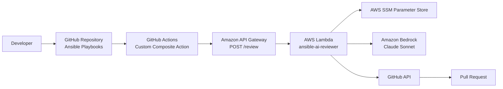
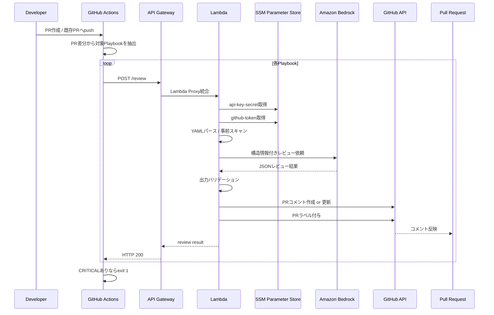
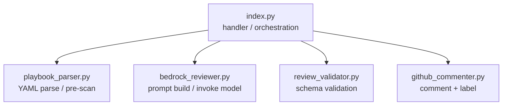
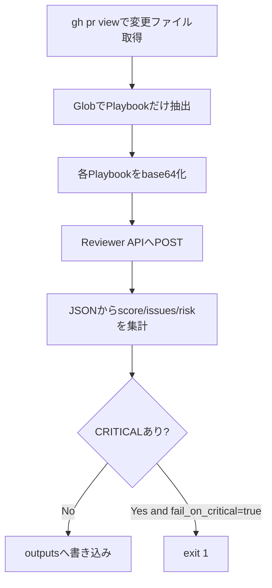
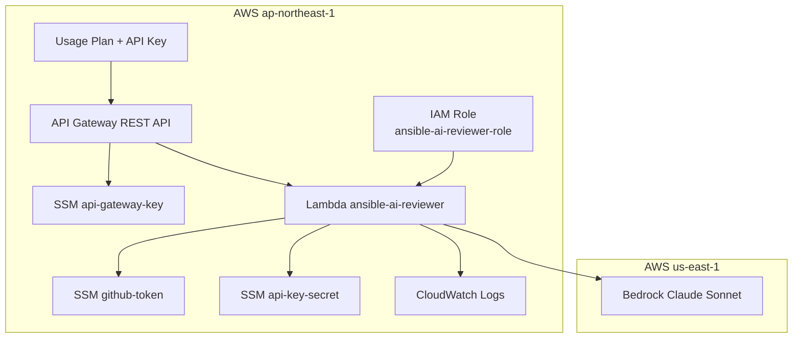
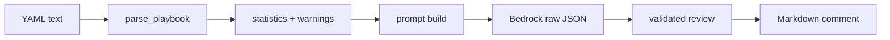
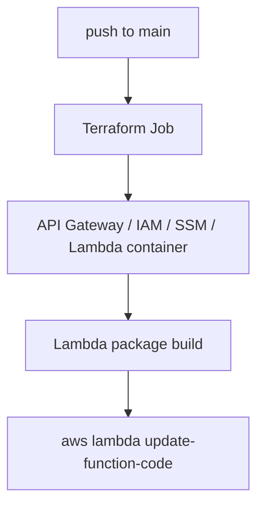

# ARCHITECTURE

## 1. このドキュメントの目的

この `ARCHITECTURE.md` は、`ansible-playbook-ai-reviewer` を初見の人でも短時間で理解できるように作った「完全理解用」ドキュメントです。

README は導入と使い方に寄せていますが、この文書では次をまとめて扱います。

- システム全体の役割
- 実行時のデータフロー
- Lambda 内部の責務分割
- Terraform によるインフラ構成
- GitHub Actions との連携方法
- 認証・権限・秘密情報の扱い
- デプロイと運用の流れ
- 現状コードベースで注意すべき実装差分

このプロジェクトの一言要約は次の通りです。

> GitHub Pull Request 上の Ansible Playbook を、GitHub Actions から AWS 上の Reviewer API に送り、Amazon Bedrock で品質レビューし、その結果を PR コメントとして返すサーバーレスレビュー基盤。

---

## 2. 全体像

### 2.1 システムコンテキスト



### 2.2 何を自動化しているか

この仕組みが自動化しているのは、単純な「Lint」ではなく、Playbook の構造理解を伴うレビューです。

- 変更された Playbook を PR 単位で収集する
- API 経由で Playbook を Reviewer に送る
- Lambda 内で YAML を構造化し、危険パターンを事前検出する
- Bedrock に「構造情報 + 生 YAML」を渡してレビューさせる
- 出力 JSON を厳密に検証する
- PR コメントを作成または更新する
- リスクレベルに応じて PR ラベルを付与する
- CRITICAL 問題があれば GitHub Actions を fail させる

---

## 3. 典型的な実行シーケンス



### 3.1 成功時の最終成果物

最終的にユーザーが目にする成果物は 3 つです。

- PR コメント
- PR ラベル
- GitHub Actions の pass / fail 結果

つまり、このシステムの本質は「レビュー UI を別に持たず、GitHub PR そのものをレビュー画面として使う」点にあります。

---

## 4. ディレクトリ構成と責務

```text
ansible-playbook-ai-reviewer/
├── README.md
├── ARCHITECTURE.md              # この文書
├── docs/
│   ├── architecture.md          # 補助的な詳細資料
│   ├── review_criteria.md
│   └── runbook.md
├── lambda/playbook_reviewer/    # 実行ロジック本体
├── terraform/                   # AWSインフラ定義
├── github_actions/ansible-ai-review/
│   ├── action.yml               # 再利用可能なComposite Action
│   └── README.md
├── .github/workflows/           # このリポジトリ自身のCI/CD
└── examples/                    # good / bad Playbookサンプル
```

### 4.1 大きなレイヤー分割

| レイヤー | 役割 |
|---|---|
| `github_actions/ansible-ai-review` | 他リポジトリから使う再利用 Action |
| `lambda/playbook_reviewer` | Playbook 解析・Bedrock 呼び出し・PR 反映 |
| `terraform/` | API Gateway / Lambda / IAM / SSM の定義 |
| `.github/workflows` | このリポジトリ自身のデプロイとサンプル運用 |
| `docs/`, `examples/` | 利用者向け説明とデモ資産 |

---

## 5. Lambda アプリケーション設計

Lambda の実装は 1 ファイル集中ではなく、責務ごとに分割されています。



### 5.1 `index.py`

役割は API の入口です。個別ロジックを全部持たず、オーケストレーションに徹しています。

主な責務:

- API Gateway の `event.body` を JSON として解釈
- 必須フィールドチェック
- `api_secret` の検証
- GitHub Token の取得
- Playbook パースの呼び出し
- Bedrock レビューの呼び出し
- 出力バリデーション
- PR コメント投稿
- PR ラベル付与
- API Gateway 互換レスポンス返却

この分離により、`index.py` は「制御フロー」、他のモジュールは「専門処理」という読みやすい構造になっています。

### 5.2 `playbook_parser.py`

このモジュールは LLM に丸投げしないための前処理層です。

主な処理:

- YAML の `safe_load`
- Playbook が list 形式であることの確認
- play / task / handler / vars / roles の構造化
- 使用モジュールや task 数などの統計化
- 危険パターンの事前スキャン

返却データの要点:

- `plays`
- `statistics`
- `pre_scan_warnings`
- `parse_errors`

#### 事前スキャンの意味

このスキャンは最終判定を下す仕組みではなく、Bedrock への補助コンテキストです。つまり、

- deterministic に見つかる問題は先に拾う
- その結果をプロンプトに入れて、LLM の見落としを減らす

という二段構えになっています。

検出対象の例:

- `shell` / `command` / `raw` の多用
- `no_log` 不足
- ハードコード秘密情報の疑い
- `ignore_errors` 多用
- `with_items` 使用

### 5.3 `bedrock_reviewer.py`

このモジュールはレビュー品質を左右する中核です。

主な責務:

- Bedrock 用システムプロンプト保持
- Playbook 統計情報と生 YAML からユーザープロンプトを組み立て
- `bedrock-runtime` クライアントでモデル実行
- 返却テキストから JSON を抽出

特徴:

- `temperature = 0`
- `max_tokens = 4096`
- 返答形式を JSON のみに強制
- Markdown code fence 混入に対する軽い防御あり

設計意図は、創造性より再現性と機械可読性を優先することです。

### 5.4 `review_validator.py`

LLM の出力は信用しすぎない、という設計を形にしたモジュールです。

検証している要素:

- `overall_score` が数値かつ 0-100
- `issues` が list
- 各 issue に妥当な `severity`
- 各 issue に `category` と `description`
- `summary` が文字列
- `recommendations` が list

この層の存在により、PR コメント投稿前に不正データを遮断できます。

### 5.5 `github_commenter.py`

このモジュールは GitHub PR をレビュー画面として成立させる役割を持ちます。

主な処理:

- 既存レビューコメントの検索
- 既存コメントの更新 or 新規コメント作成
- Markdown テーブル形式への整形
- リスクレベルに応じたラベル付与

特に重要なのは `REVIEW_MARKER` による更新設計です。

```html
<!-- ansible-ai-reviewer -->
```

これをコメント本文に埋め込むことで、同じ PR への再レビュー時にスパム的にコメントが増えず、常に最新レビューへ上書きできます。

---

## 6. リクエストとレスポンスの設計

### 6.1 Lambda が期待する入力

`index.py` が期待している必須フィールドは次です。

| フィールド | 意味 |
|---|---|
| `playbook_content` | Playbook 本文 |
| `playbook_filename` | 表示用ファイル名 |
| `github_repo_owner` | GitHub owner |
| `github_repo_name` | GitHub repo 名 |
| `pr_number` | PR 番号 |
| `api_secret` | 第2認証シークレット |

### 6.2 Lambda の出力

成功時は概ね次の形です。

| フィールド | 意味 |
|---|---|
| `status` | `success` / `error` |
| `overall_score` | 総合点 |
| `risk_level` | HIGH / MEDIUM / LOW |
| `issues_count` | 問題数 |
| `comment_url` | 投稿したコメントURL |
| `message` | 要約メッセージ |

### 6.3 エラー設計

| ステータス | 代表ケース |
|---|---|
| `400` | JSON 不正、必須フィールド不足 |
| `403` | `api_secret` 不一致 |
| `500` | SSM 取得失敗、Bedrock 失敗、GitHub 投稿失敗、出力バリデーション失敗 |

---

## 7. GitHub Actions 側の設計

### 7.1 役割分担

このプロジェクトでは GitHub Actions が 2 系統あります。

| 種類 | ファイル | 用途 |
|---|---|---|
| レビュー実行用 | `github_actions/ansible-ai-review/action.yml` | 他リポジトリから使う Composite Action |
| 自己デプロイ用 | `.github/workflows/deploy.yml` | このリポジトリ自身の Terraform / Lambda 配備 |

### 7.2 Composite Action の流れ



### 7.3 なぜ Composite Action にしているか

理由は再利用性です。

- 各 Ansible 管理リポジトリに同じ shell スクリプトをコピペしなくてよい
- 入力パラメータだけで利用できる
- 失敗条件や出力形式を統一できる

### 7.4 PR ブロックの責任分界

重要なのは、CRITICAL 判定そのものは Lambda 側のレビュー結果ですが、最終的に CI を fail にする責任は GitHub Action 側にあります。

つまり役割分担は次です。

- Lambda: レビューして結果を返す
- GitHub Action: その結果を CI 成否に反映する

---

## 8. Terraform / AWS インフラ設計

### 8.1 構成図



### 8.2 ルートモジュールの責務

`terraform/main.tf` は環境全体の配線を担当しています。

含まれるもの:

- AWS provider
- 共通タグ
- Lambda 実行 IAM ロール
- SSM パラメータ
- `reviewer_lambda` モジュール呼び出し
- `api_gateway` モジュール呼び出し
- API Key 値の SSM 保存

### 8.3 `modules/reviewer_lambda`

このモジュールは Lambda 本体とロググループを管理します。

現在の実装上のポイント:

- Terraform では placeholder ZIP を作る
- 実コードの配備は `.github/workflows/deploy.yml` が担当する

つまり Lambda のコード配備は完全 Terraform 管理ではなく、次のハイブリッドです。

1. Terraform で関数コンテナを作る
2. GitHub Actions で Python 依存込み ZIP を上書き配備する

この方式の利点:

- Terraform に巨大 ZIP を持ち込まない
- Python 依存解決とインフラ作成を分離できる

欠点:

- 「Terraform state 上のコード」と「実際に動くコード」が一致しない期間が生まれる

### 8.4 `modules/api_gateway`

このモジュールは REST API を最小構成で提供します。

含まれるもの:

- REST API
- `/review` リソース
- `POST` メソッド
- Lambda Proxy 統合
- deployment / stage
- API Key
- Usage Plan
- Usage Plan Key
- Lambda invoke permission

### 8.5 スロットリングとクォータ

現状は以下です。

- rate limit: `10 req/sec`
- burst limit: `20`
- quota: `1000 / month`

これはエンタープライズ用途というより、ポートフォリオ兼小規模チーム利用を想定した安全側の初期値です。

---

## 9. IAM とセキュリティ設計

### 9.1 Lambda 実行ロール

付与権限はかなり絞られています。

| 権限 | 用途 |
|---|---|
| `bedrock:InvokeModel` | Claude Sonnet 呼び出し |
| `ssm:GetParameter` | `github-token`, `api-key-secret` 取得 |
| `logs:*` の一部 | CloudWatch Logs 出力 |

### 9.2 最小権限のポイント

Bedrock は `*` ではなくモデル ARN に限定されています。

```text
arn:aws:bedrock:us-east-1::foundation-model/anthropic.claude-sonnet-4-20250514-v1:0
```

SSM も `/ansible-ai-reviewer/*` 配下に限定されています。

### 9.3 二重認証

このシステムは API Gateway の API Key だけに頼っていません。

認証レイヤー:

1. API Gateway の `x-api-key`
2. Lambda 内で照合する `api_secret`

意味:

- API Key は利用制限・流量制御に向く
- `api_secret` は漏洩時の二次防御になる

### 9.4 Playbook 非永続化

Playbook 本文は S3 や DB に保存されません。レビュー処理は Lambda 実行メモリ内で完結します。

この判断は次のリスクを下げます。

- 構成情報の長期保管
- インシデント時の情報漏えい面積
- データ保持ポリシーの複雑化

### 9.5 秘密情報の保管先

| 情報 | 保存先 |
|---|---|
| GitHub API Token | SSM SecureString |
| API 追加認証シークレット | SSM SecureString |
| API Gateway API Key 値 | SSM SecureString |

---

## 10. データの流れ

### 10.1 送信されるデータ

リクエストに含まれる中心データは Playbook 本文です。GitHub Action 側では Base64 化していますが、Lambda 側 `index.py` は現状プレーン文字列前提のため、本来は「Action と Lambda で契約を一致させる」必要があります。

### 10.2 Lambda 内の変換



### 10.3 出力の二系統

レビュー結果は 2 方向に使われます。

- API レスポンスとして Action に返る
- GitHub PR コメントとして人間に返る

機械向けと人間向けの両方を同じレビュー結果から派生させているのが、この設計のきれいな点です。

---

## 11. デプロイと変更反映

### 11.1 デプロイ経路



### 11.2 `deploy.yml` の責務

このワークフローは 2 段構成です。

- `terraform` job
  - `fmt`
  - `init`
  - `validate`
  - `plan`
  - `main` では `apply`
- `deploy-lambda` job
  - Python 依存解決
  - ZIP 化
  - `update-function-code`
  - `publish-version`

### 11.3 OIDC 採用

AWS 認証は `aws-actions/configure-aws-credentials` と OIDC を使っています。長期アクセスキーを置かないため、運用上かなり健全です。

---

## 12. 可観測性

現状の可観測性はシンプルですが必要最低限あります。

- CloudWatch Logs
- Lambda Powertools `Logger`
- Lambda Powertools `Tracer`

期待できること:

- 失敗箇所の切り分け
- `api_secret` 認証失敗や Bedrock 呼び出し失敗の把握
- PR 単位のレビュー完了ログ

今後の拡張候補:

- Metrics の追加
- 構造化ログ項目の標準化
- API Gateway access log

---

## 13. 設計上の強み

### 13.1 責務分離が明確

Parser、Reviewer、Validator、Commenter に分かれており、変更時の影響範囲を追いやすいです。

### 13.2 LLM を安全側で使っている

LLM は判定補助に使いながら、入力前の事前スキャンと出力後のバリデーションで挟み込んでいます。

### 13.3 GitHub PR をそのまま UX にしている

利用者は新しい画面を覚える必要がなく、既存レビュー文化にそのまま乗せられます。

### 13.4 サーバーレスで小さく始められる

月数十〜数百回のレビューであれば、コストと運用負荷をかなり低く抑えられます。

---

## 14. 現状コードベースでの注意点

この章は重要です。ここでは「理想仕様」ではなく、現状実装を読んだうえでのズレやリスクを整理します。

### 14.1 Action と Lambda のリクエスト契約が一致していない

`action.yml` が送っている JSON:

- `playbook_path`
- `repo_owner`
- `repo_name`
- `github_token`

`index.py` が必須としている JSON:

- `playbook_filename`
- `github_repo_owner`
- `github_repo_name`
- `api_secret`

つまり現状のままだと、そのままでは 400 エラーになる可能性が高いです。

さらに Action は `api_secret` を body ではなく `X-Api-Secret` ヘッダに入れており、Lambda 側はヘッダを見ていません。

### 14.2 `playbook_content` のエンコード前提が一致していない

Action 側は Playbook を Base64 化して送っていますが、`parse_playbook()` は YAML 生文字列を期待しています。Lambda 側に Base64 デコード処理はありません。

### 14.3 Action 側のレスポンス期待形式が Lambda と一致していない

Action は `jq '.issues | length'` を読みにいきますが、`index.py` の成功レスポンスは `issues_count` を返しており、`issues` 配列そのものは返していません。

### 14.4 `deploy.yml` は Terraform 実行ポリシーとズレる

このリポジトリのローカル指示では `terraform apply` はユーザー実行が原則ですが、GitHub Actions の `deploy.yml` では `main` push 時に自動 `terraform apply -auto-approve` します。

運用ポリシーとしてどう扱うかは、今後整理対象です。

### 14.5 Terraform モジュール構成は良いが、Lambda コード管理は分離型

これは欠点ではなくトレードオフです。ただし、インフラ変更とコード変更の追跡が別レーンになるため、障害調査時は「Terraform state」と「最後に配備された ZIP」の両方を見る必要があります。

---

## 15. 今後の改善候補

優先度順に並べると次が有力です。

1. Action と Lambda のリクエスト/レスポンス契約を統一する
2. Base64 を使うなら Lambda で明示的に decode する
3. API Gateway access log を有効化する
4. `review_validator.py` で `category` の妥当値検証も有効にする
5. Lambda を Terraform 単独デプロイに寄せるか、現行ハイブリッド方式を ADR 化する
6. マルチファイル PR のレビュー集約コメント設計を改善する

---

## 16. どこから読むと理解しやすいか

新しく入る人には次の順番がおすすめです。

1. `README.md`
2. `github_actions/ansible-ai-review/action.yml`
3. `lambda/playbook_reviewer/index.py`
4. `playbook_parser.py` と `bedrock_reviewer.py`
5. `github_commenter.py`
6. `terraform/main.tf`
7. `terraform/modules/*`

「利用者視点 → 実行フロー → インフラ視点」の順に追うと理解しやすいです。

---

## 17. まとめ

このプロジェクトは、Ansible Playbook のレビューを GitHub PR フローに自然に埋め込むための、サーバーレス AI レビュー基盤です。

アーキテクチャ上の核は次の 3 点です。

- GitHub Actions を入口にすること
- Lambda 内で「構造化前処理 → LLM → バリデーション」を分離していること
- 結果を GitHub PR コメントへ戻し、CI の fail 条件にも反映していること

一方で、現状コードには Action と Lambda 間の入出力契約に不一致があり、ここは実運用前に必ず揃えるべきポイントです。逆に言えば、その契約を整えればこの構成はかなり筋がよく、小コストで拡張しやすい Reviewer 基盤になっています。
