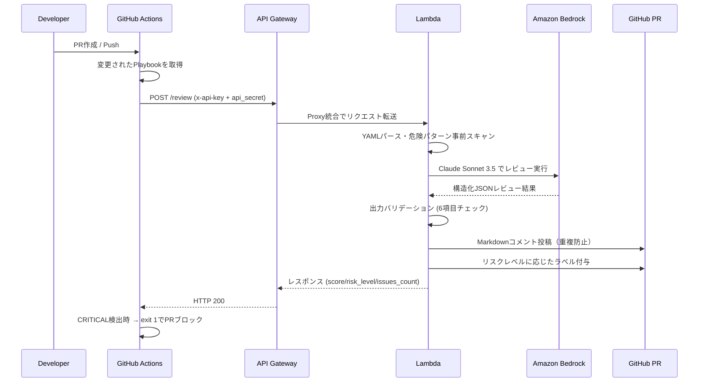

# Ansible Playbook AI Reviewer

> GitHub Actions × Amazon Bedrock でAnsible Playbookを自動AIレビュー。
> CRITICALな問題を検出してPRをブロック、具体的な改善提案をコメントで提供する。

---

## デモ

```
📋 Ansible Playbook AI Review: site.yml
━━━━━━━━━━━━━━━━━━━━━━━━━━━━━━━━━━━━━━
総合スコア: 42/100  🔴 HIGH RISK

🚨 CRITICAL (2件)
  • パスワードがハードコードされています (L.18: db_password: "Secret!")
    → ansible-vault で暗号化し {{ vault_db_password }} で参照してください
  • no_log 未設定の認証情報タスク (L.35: configure database)
    → no_log: true を追加してください

⚠️ HIGH (3件) / 📌 MEDIUM (4件) / 💡 LOW (2件)
[詳細は以下に展開...]
```

*このようなMarkdownコメントがPRに自動投稿されます。CRITICALが検出されるとPRがブロックされます。*

---

## アーキテクチャ



---

## 機能

| 機能 | 説明 |
|---|---|
| ✅ 6カテゴリ自動レビュー | セキュリティ・冪等性・エラーハンドリング・パフォーマンス・可読性・ベストプラクティス |
| ✅ 重大度別問題検出 | CRITICAL / HIGH / MEDIUM / LOW の4段階 |
| ✅ 具体的な改善提案 | 問題箇所の行番号・改善コードサンプル付きコメント |
| ✅ PRブロック | CRITICAL検出時にワークフローをfailさせてマージを阻止 |
| ✅ カスタムGitHub Action | 1行で既存ワークフローに組み込み可能 |
| ✅ 重複コメント防止 | 同一PRへの再実行は既存コメントを更新 |

---

## レビュー観点

| カテゴリ | チェック内容 |
|---|---|
| **セキュリティ** | ハードコード認証情報、no_log未設定、become乱用、777パーミッション |
| **冪等性** | changed_when未設定のshell/command、fileモジュールの不適切使用 |
| **エラーハンドリング** | ignore_errors乱用、failed_when未設定、block/rescue/always活用 |
| **パフォーマンス** | 不要なgather_facts、非効率なループ、with_items（非推奨） |
| **可読性** | 不明確なタスク名、変数命名規則、コメント不足 |
| **ベストプラクティス** | FQCNモジュール名、タグ未設定、handlersの活用 |

詳細は [docs/review_criteria.md](docs/review_criteria.md) を参照。

---

## クイックスタート

### 前提条件

- Terraform >= 1.9
- AWS CLI（`ap-northeast-1` へのアクセス権）
- GitHub Actions OIDC設定（AWSへのキーレス認証）
- Amazon Bedrock `us-east-1` で Claude Sonnet 3.5 が有効化済み

### 1. インフラデプロイ

```bash
cd terraform/environments/dev
cp terraform.tfvars.example terraform.tfvars
# terraform.tfvars を編集してプロジェクト設定を入力

terraform init
terraform plan
terraform apply
```

デプロイ後、以下のOutputが表示されます:

```
api_endpoint = "https://xxxxxx.execute-api.ap-northeast-1.amazonaws.com/prod"
api_key_id   = "xxxxxxxxxx"
```

### 2. SSMパラメータへのSecretsを設定

```bash
# GitHubトークン（repo + pull_requests スコープが必要）
aws ssm put-parameter \
  --name "/ansible-ai-reviewer/github-token" \
  --value "ghp_xxxxxxxxxxxx" \
  --type SecureString \
  --region ap-northeast-1

# API追加認証シークレット（任意のランダム文字列）
aws ssm put-parameter \
  --name "/ansible-ai-reviewer/api-key-secret" \
  --value "$(openssl rand -hex 32)" \
  --type SecureString \
  --region ap-northeast-1
```

### 3. GitHub Secretsの設定

レビュー対象リポジトリの `Settings → Secrets and variables → Actions` に追加:

| Secret名 | 値 |
|---|---|
| `AI_REVIEWER_API_ENDPOINT` | Terraformの `api_endpoint` output |
| `AI_REVIEWER_API_KEY` | AWS ConsoleのAPI Gatewayキー |
| `AI_REVIEWER_API_SECRET` | SSMに設定した `api-key-secret` の値 |

### 4. ワークフローをコピー

```bash
cp .github/workflows/example_ansible_review.yml /path/to/your-repo/.github/workflows/
```

または、カスタムActionとして使用:

```yaml
# .github/workflows/ansible-review.yml
- uses: your-org/ansible-playbook-ai-reviewer/github_actions/ansible-ai-review@main
  with:
    api_endpoint: ${{ secrets.AI_REVIEWER_API_ENDPOINT }}
    api_key: ${{ secrets.AI_REVIEWER_API_KEY }}
    api_secret: ${{ secrets.AI_REVIEWER_API_SECRET }}
    fail_on_critical: 'true'
```

---

## 動作確認（サンプルPlaybookでテスト）

```bash
# 意図的に問題を含むPlaybookでレビューAPIを手動呼び出し
curl -X POST "$AI_REVIEWER_API_ENDPOINT/review" \
  -H "Content-Type: application/json" \
  -H "x-api-key: $AI_REVIEWER_API_KEY" \
  -d "{
    \"playbook_content\": \"$(base64 -w 0 examples/sample_playbook_bad.yml)\",
    \"playbook_filename\": \"sample_playbook_bad.yml\",
    \"github_repo_owner\": \"your-org\",
    \"github_repo_name\": \"your-repo\",
    \"pr_number\": 1,
    \"api_secret\": \"$AI_REVIEWER_API_SECRET\"
  }" | jq .
```

期待されるレスポンス:

```json
{
  "status": "success",
  "overall_score": 35,
  "risk_level": "CRITICAL",
  "issues_count": 9,
  "comment_url": "https://github.com/your-org/your-repo/pull/1#issuecomment-...",
  "message": "レビュー完了: 9件の問題を検出しました（スコア: 35/100）"
}
```

---

## 使用技術

| レイヤー | 技術 |
|---|---|
| **CI/CD** | GitHub Actions（カスタムComposite Action） |
| **IaC** | Terraform >= 1.9（モジュール化構成） |
| **コンピュート** | AWS Lambda（Python 3.12, arm64） |
| **AI/ML** | Amazon Bedrock（Claude Sonnet 3.5, us-east-1） |
| **API** | Amazon API Gateway（REST API, Lambda Proxy統合） |
| **Secrets管理** | AWS SSM Parameter Store（SecureString） |
| **認証** | API Gatewayキー + api_secret二重認証、GitHub Actions OIDC |
| **可観測性** | AWS Lambda Powertools（Logger + Tracer）、CloudWatch Logs |

---

## コスト見積もり

| リソース | 条件 | 月額概算 |
|---|---|---|
| Lambda | 月50回実行 × 30秒 × 512MB | ~$0.05 |
| API Gateway | 月50リクエスト | ~$0.02 |
| Bedrock（Claude Sonnet 3.5） | 月50回 × 平均2,000トークン | ~$1.50 |
| SSM Parameter Store | SecureString 2パラメータ | ~$0.02 |
| **合計** | | **~$2.00/月** |

---

## 設計の工夫

### なぜAPI GatewayにAPIキー + api_secretの二重認証を使うか

API Gatewayのx-api-keyはレート制限・使用量追跡に特化している。しかしキーの漏洩に備えてLambda内でSSMから取得した`api-key-secret`と照合する第二の認証層を追加した。これにより、たとえAPI Gatewayキーが漏洩しても不正呼び出しを防止できる。

### なぜLambda Function URLではなくAPI Gatewayを使うか

API GatewayはAPIキー管理・使用量プラン・WAFとのネイティブ統合・詳細なアクセスログが標準で利用できる。Function URLはシンプルだがこれらの機能を自前実装する必要があり、ポートフォリオとして「エンタープライズ水準のAPI設計」を示すためにAPI Gatewayを採用した。

### なぜPlaybookを永続化しないか（プライバシー設計）

Playbookにはサーバー構成・IPアドレス・変数名など機密情報が含まれる可能性がある。レビュー処理はLambdaのメモリ上のみで完結し、S3・DBへの永続化は一切行わない。これにより、インフラ情報の意図しない漏洩リスクを排除している。

### AI出力バリデーション6項目の設計意図

BedrockのLLM出力は確定的でなく、フォーマット崩れが起きうる。`review_validator.py`で`overall_score`の数値範囲・`issues`のリスト形式・各issueの必須フィールド（severity/category/description）・`summary`の文字列型・`recommendations`のリスト形式を厳密にチェックすることで、バリデーション失敗を500エラーとして返しPRへの不正コメント投稿を防いでいる。

---

## ドキュメント

| ドキュメント | 内容 |
|---|---|
| [docs/architecture.md](docs/architecture.md) | システム構成・セキュリティ設計・拡張性 |
| [docs/review_criteria.md](docs/review_criteria.md) | 全6カテゴリのレビュー観点（good/bad例付き） |
| [docs/runbook.md](docs/runbook.md) | セットアップ・トラブルシューティング・運用手順 |

---

## ライセンス

MIT
