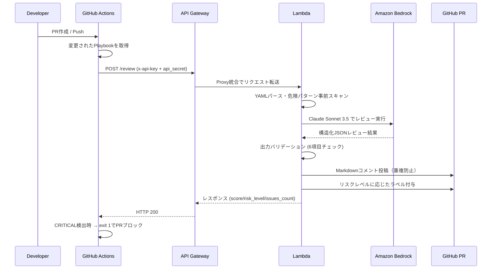

# Ansible Playbook AI Reviewer

> GitHub Actions × Amazon Bedrock でAnsible Playbookを自動AIレビュー。
> CRITICALな問題を検出してPRをブロック、具体的な改善提案をコメントで提供する。

---

## このハンズオンで得られること

このハンズオンを最後まで実施すると、次の内容を一通り体験できます。

- GitHub Actions と Amazon Bedrock を組み合わせた AI レビュー基盤の構築
- Terraform を使った API Gateway / Lambda / IAM / SSM のサーバーレス構成のデプロイ
- Ansible Playbook を PR 上で自動レビューし、コメントとラベルでフィードバックする仕組みの実装
- API Key と追加 secret を組み合わせたシンプルな二重認証の設計
- Bedrock を使ったレビュー処理を GitHub の開発フローへ組み込む実践パターン

この README の手順を終えるころには、「Ansible Playbook の AI レビューを GitHub PR に返す仕組み」を自分の AWS 環境で動かせる状態になります。

---

## デモ

```
📋 Ansible Playbook AI Review: site.yml
━━━━━━━━━━━━━━━━━━━━━━━━━━━━━━━━━━━━━━
総合スコア: 42/100  🔴 HIGH RISK

🚨 CRITICAL (2件)
  • パスワードがハードコードされています (L.18: db_password: "Secret!")
    → ansible-vault で暗号化し {{ vault_db_password }} で参照してください
  • no_log 未設定の認証情報タスク (L.35: configure database)
    → no_log: true を追加してください

⚠️ HIGH (3件) / 📌 MEDIUM (4件) / 💡 LOW (2件)
[詳細は以下に展開...]
```

*このようなMarkdownコメントがPRに自動投稿されます。CRITICALが検出されるとPRがブロックされます。*

---

## アーキテクチャ



---

## 機能

| 機能 | 説明 |
|---|---|
| ✅ 6カテゴリ自動レビュー | セキュリティ・冪等性・エラーハンドリング・パフォーマンス・可読性・ベストプラクティス |
| ✅ 重大度別問題検出 | CRITICAL / HIGH / MEDIUM / LOW の4段階 |
| ✅ 具体的な改善提案 | 問題箇所の行番号・改善コードサンプル付きコメント |
| ✅ PRブロック | CRITICAL検出時にワークフローをfailさせてマージを阻止 |
| ✅ カスタムGitHub Action | 1行で既存ワークフローに組み込み可能 |
| ✅ 重複コメント防止 | 同一PRへの再実行は既存コメントを更新 |

---

## レビュー観点

| カテゴリ | チェック内容 |
|---|---|
| **セキュリティ** | ハードコード認証情報、no_log未設定、become乱用、777パーミッション |
| **冪等性** | changed_when未設定のshell/command、fileモジュールの不適切使用 |
| **エラーハンドリング** | ignore_errors乱用、failed_when未設定、block/rescue/always活用 |
| **パフォーマンス** | 不要なgather_facts、非効率なループ、with_items（非推奨） |
| **可読性** | 不明確なタスク名、変数命名規則、コメント不足 |
| **ベストプラクティス** | FQCNモジュール名、タグ未設定、handlersの活用 |

詳細は [docs/review_criteria.md](docs/review_criteria.md) を参照。

---

## ハンズオン

このリポジトリは「AWS 上に Reviewer API を構築する側」のプロジェクトです。実際に試すときは、次の 2 つを順番に進めます。

1. このリポジトリを使って Reviewer API をデプロイする
2. Ansible Playbook を持つ別リポジトリから、その API を呼び出す

### 前提条件

- Terraform >= 1.9
- AWS CLI 設定済み
- GitHub アカウントとレビュー対象リポジトリ
- `us-east-1` で Amazon Bedrock の Claude Sonnet が有効化済み
- GitHub Actions から AWS へ接続するための OIDC ロールを作成できる権限

### ハンズオン全体像

1. AWS 側の前提を整える
2. Terraform で API Gateway / Lambda / IAM / SSM を作る
3. GitHub Token と API secret を SSM に登録する
4. Lambda の実コードをデプロイする
5. レビュー対象リポジトリに GitHub Secrets と workflow を設定する
6. API 単体テストを行う
7. PR を作ってレビュー結果を確認する

---

## Step 0. リポジトリを準備する

```bash
git clone https://github.com/your-org/ansible-playbook-ai-reviewer.git
cd ansible-playbook-ai-reviewer

python3 -m venv .venv
source .venv/bin/activate
```

Terraform を実行する作業ディレクトリは `terraform/environments/dev` です。

---

## Step 1. AWS 側の前提を整える

### 1-1. Bedrock モデルアクセスを有効化する

AWS Console で `us-east-1` を開き、Amazon Bedrock の Model access から Claude Sonnet を有効化してください。

このプロジェクトでは次のリージョン構成です。

- Lambda / API Gateway / SSM / IAM: `ap-northeast-1`
- Bedrock: `us-east-1`

### 1-2. GitHub Actions 用 OIDC ロールを用意する

このリポジトリの `.github/workflows/deploy.yml` は OIDC 前提です。少なくとも次を扱えるロールを GitHub Actions から引き受けられるようにしておくと、後のデプロイがスムーズです。

- Terraform に必要な作成・更新権限
- Lambda 更新権限
- API Gateway 管理権限
- SSM パラメータの読み書き権限
- IAM ロール作成権限

後で GitHub Secrets に `AWS_ROLE_ARN` として登録します。

---

## Step 2. Terraform でインフラを作成する

### 2-1. 環境ディレクトリへ移動する

```bash
cd terraform/environments/dev
```

### 2-2. `terraform.tfvars` を確認する

このリポジトリには [terraform.tfvars](/home/takuya/terraform-lab/ansible-playbook-ai-reviewer/terraform/environments/dev/terraform.tfvars) が含まれています。まず次の値を確認してください。

- `environment`
- `aws_region`
- `bedrock_region`
- `lambda_timeout`
- `lambda_memory`
- `api_gateway_stage`
- `github_token_ssm_path`

### 2-3. 初期化と Plan

```bash
terraform init
terraform plan
```

### 2-4. Apply

```bash
terraform apply
```

作成される主なリソース:

- Lambda `ansible-ai-reviewer`
- API Gateway `ansible-ai-reviewer-api`
- IAM Role `ansible-ai-reviewer-role`
- SSM パラメータ
  - `/ansible-ai-reviewer/github-token`
  - `/ansible-ai-reviewer/api-key-secret`
  - `/ansible-ai-reviewer/api-gateway-key`

Apply 後に次の output を控えてください。

```text
api_endpoint         = "https://xxxxxxxx.execute-api.ap-northeast-1.amazonaws.com/v1/review"
lambda_function_name = "ansible-ai-reviewer"
```

`api_endpoint` はすでに `/review` を含んだ完全 URL です。

---

## Step 3. SSM に秘密情報を登録する

Terraform で SSM パラメータの箱は作られますが、値は `PLACEHOLDER` のままです。ここで本物の値に更新します。

### 3-1. GitHub Token を登録する

PR コメント投稿とラベル操作ができる GitHub Token を用意し、SSM に登録します。

```bash
aws ssm put-parameter \
  --name "/ansible-ai-reviewer/github-token" \
  --value "ghp_xxxxxxxxxxxxxxxxxxxx" \
  --type SecureString \
  --overwrite \
  --region ap-northeast-1
```

### 3-2. API 追加認証用 secret を登録する

```bash
export AI_REVIEWER_API_SECRET="$(openssl rand -hex 32)"

aws ssm put-parameter \
  --name "/ansible-ai-reviewer/api-key-secret" \
  --value "$AI_REVIEWER_API_SECRET" \
  --type SecureString \
  --overwrite \
  --region ap-northeast-1
```

### 3-3. API Gateway Key の値を確認する

```bash
aws ssm get-parameter \
  --name "/ansible-ai-reviewer/api-gateway-key" \
  --with-decryption \
  --region ap-northeast-1 \
  --query 'Parameter.Value' \
  --output text
```

この値はあとで `AI_REVIEWER_API_KEY` として GitHub Secrets に登録します。

---

## Step 4. Lambda の実コードをデプロイする

Terraform で作られる Lambda は最初 placeholder ZIP です。レビューを実際に動かすには Python コードをデプロイする必要があります。

### 方法A. GitHub Actions でデプロイする

このリポジトリの GitHub Secrets に `AWS_ROLE_ARN` を登録し、`main` に push すると `.github/workflows/deploy.yml` が実行されます。

必要な GitHub Secret:

| Secret名 | 用途 |
|---|---|
| `AWS_ROLE_ARN` | GitHub Actions から AWS に OIDC で接続するため |

### 方法B. 手元から手動デプロイする

```bash
cd /path/to/ansible-playbook-ai-reviewer
source .venv/bin/activate
rm -f lambda_package.zip
rm -rf lambda/playbook_reviewer/package
mkdir -p lambda/playbook_reviewer/package

.venv/bin/pip install -r lambda/playbook_reviewer/requirements.txt \
  -t lambda/playbook_reviewer/package \
  --platform manylinux2014_aarch64 \
  --only-binary=:all:

cp lambda/playbook_reviewer/*.py lambda/playbook_reviewer/package/

cd lambda/playbook_reviewer/package
zip -r ../../../lambda_package.zip .

cd ../../..
aws lambda update-function-code \
  --function-name ansible-ai-reviewer \
  --zip-file fileb://lambda_package.zip \
  --region ap-northeast-1
```

反映待ち:

```bash
aws lambda wait function-updated \
  --function-name ansible-ai-reviewer \
  --region ap-northeast-1
```

---

## Step 5. レビュー対象リポジトリに GitHub Secrets を登録する

ここからは、Ansible Playbook を持つ側のリポジトリで作業します。

`Settings → Secrets and variables → Actions` に次を追加してください。

| Secret名 | 値 |
|---|---|
| `AI_REVIEWER_API_ENDPOINT` | Terraform output の `api_endpoint` |
| `AI_REVIEWER_API_KEY` | `/ansible-ai-reviewer/api-gateway-key` の値 |
| `AI_REVIEWER_API_SECRET` | `/ansible-ai-reviewer/api-key-secret` に登録した値 |

---

## Step 6. レビュー workflow を設定する

### 6-1. サンプル workflow を配置する

このリポジトリの [example_ansible_review.yml](/home/takuya/terraform-lab/ansible-playbook-ai-reviewer/.github/workflows/example_ansible_review.yml) をベースに、レビュー対象リポジトリの `.github/workflows/` に配置します。

### 6-2. 最小構成の例

```yaml
name: Ansible Playbook AI Review

on:
  pull_request:
    branches: [main]
    paths:
      - '**.yml'
      - '**.yaml'

permissions:
  contents: read
  pull-requests: write

jobs:
  ai-review:
    runs-on: ubuntu-latest
    steps:
      - uses: actions/checkout@v4

      - name: Ansible Playbook AI Review
        id: ai-review
        uses: your-org/ansible-playbook-ai-reviewer/github_actions/ansible-ai-review@main
        with:
          api_endpoint: ${{ secrets.AI_REVIEWER_API_ENDPOINT }}
          api_key: ${{ secrets.AI_REVIEWER_API_KEY }}
          api_secret: ${{ secrets.AI_REVIEWER_API_SECRET }}
          github_token: ${{ secrets.GITHUB_TOKEN }}
          playbook_paths: 'playbooks/**/*.yml,roles/**/*.yml'
          fail_on_critical: 'true'
```

---

## Step 7. API 単体テストを行う

GitHub Actions に入る前に API 単体で疎通確認しておくと、切り分けが楽です。

### 7-1. 環境変数を入れる

```bash
export AI_REVIEWER_API_ENDPOINT="https://xxxxxxxx.execute-api.ap-northeast-1.amazonaws.com/v1/review"
export AI_REVIEWER_API_KEY="$(aws ssm get-parameter \
  --name "/ansible-ai-reviewer/api-gateway-key" \
  --with-decryption \
  --region ap-northeast-1 \
  --query 'Parameter.Value' \
  --output text)"
export AI_REVIEWER_API_SECRET="$(aws ssm get-parameter \
  --name "/ansible-ai-reviewer/api-key-secret" \
  --with-decryption \
  --region ap-northeast-1 \
  --query 'Parameter.Value' \
  --output text)"
```

### 7-2. サンプル Playbook で呼び出す

```bash
curl -X POST "$AI_REVIEWER_API_ENDPOINT" \
  -H "Content-Type: application/json" \
  -H "x-api-key: $AI_REVIEWER_API_KEY" \
  -d "{
    \"playbook_content\": \"$(python3 - <<'PY'
from pathlib import Path
import json
print(json.dumps(Path('examples/sample_playbook_bad.yml').read_text())[1:-1])
PY
)\",
    \"playbook_filename\": \"sample_playbook_bad.yml\",
    \"github_repo_owner\": \"your-org\",
    \"github_repo_name\": \"your-repo\",
    \"pr_number\": 1,
    \"api_secret\": \"$AI_REVIEWER_API_SECRET\"
  }" | jq .
```

期待されるレスポンス例:

```json
{
  "status": "success",
  "overall_score": 35,
  "risk_level": "HIGH",
  "issues_count": 9,
  "comment_url": "https://github.com/your-org/your-repo/pull/1#issuecomment-...",
  "message": "レビュー完了: 9件の問題を検出しました（スコア: 35/100）"
}
```

---

## Step 8. PR ベースで動作確認する

### 8-1. テスト用 Playbook を作る

[sample_playbook_bad.yml](/home/takuya/terraform-lab/ansible-playbook-ai-reviewer/examples/sample_playbook_bad.yml) を参考に、レビュー対象リポジトリへ問題を含む Playbook を追加します。

### 8-2. PR を作成する

PR 作成後、workflow が正常に動けば次を確認できます。

- PR コメントにレビュー結果が投稿される
- `ai-review:*` ラベルが付与される
- CRITICAL 問題がある場合は workflow が fail する

### 8-3. 再実行してコメント更新を確認する

同じ PR に追加 commit を push すると、新しいコメントが増えるのではなく既存レビューコメントが更新されます。

---

## ハンズオンで詰まりやすいポイント

| 症状 | 確認ポイント |
|---|---|
| `403 Forbidden` | `AI_REVIEWER_API_SECRET` と SSM の secret 値が一致しているか |
| `500` エラー | Lambda が placeholder のままで実コード未配備ではないか |
| GitHub にコメントされない | GitHub Token の権限、owner/repo/PR番号が正しいか |
| Bedrock 呼び出し失敗 | `us-east-1` で Claude Sonnet の access が有効か |
| CI でだけ失敗する | workflow の `permissions.pull-requests: write` があるか |

詳細なトラブルシュートは [docs/runbook.md](docs/runbook.md) を参照してください。

---

## 使用技術

| レイヤー | 技術 |
|---|---|
| **CI/CD** | GitHub Actions（カスタムComposite Action） |
| **IaC** | Terraform >= 1.9（モジュール化構成） |
| **コンピュート** | AWS Lambda（Python 3.12, arm64） |
| **AI/ML** | Amazon Bedrock（Claude Sonnet 3.5, us-east-1） |
| **API** | Amazon API Gateway（REST API, Lambda Proxy統合） |
| **Secrets管理** | AWS SSM Parameter Store（SecureString） |
| **認証** | API Gatewayキー + api_secret二重認証、GitHub Actions OIDC |
| **可観測性** | AWS Lambda Powertools（Logger + Tracer）、CloudWatch Logs |

---

## コスト見積もり

| リソース | 条件 | 月額概算 |
|---|---|---|
| Lambda | 月50回実行 × 30秒 × 512MB | ~$0.05 |
| API Gateway | 月50リクエスト | ~$0.02 |
| Bedrock（Claude Sonnet 3.5） | 月50回 × 平均2,000トークン | ~$1.50 |
| SSM Parameter Store | SecureString 2パラメータ | ~$0.02 |
| **合計** | | **~$2.00/月** |

---

## 設計の工夫

### なぜAPI GatewayにAPIキー + api_secretの二重認証を使うか

API Gatewayのx-api-keyはレート制限・使用量追跡に特化している。しかしキーの漏洩に備えてLambda内でSSMから取得した`api-key-secret`と照合する第二の認証層を追加した。これにより、たとえAPI Gatewayキーが漏洩しても不正呼び出しを防止できる。

### なぜLambda Function URLではなくAPI Gatewayを使うか

API GatewayはAPIキー管理・使用量プラン・WAFとのネイティブ統合・詳細なアクセスログが標準で利用できる。Function URLはシンプルだがこれらの機能を自前実装する必要があり、ポートフォリオとして「エンタープライズ水準のAPI設計」を示すためにAPI Gatewayを採用した。

### なぜPlaybookを永続化しないか（プライバシー設計）

Playbookにはサーバー構成・IPアドレス・変数名など機密情報が含まれる可能性がある。レビュー処理はLambdaのメモリ上のみで完結し、S3・DBへの永続化は一切行わない。これにより、インフラ情報の意図しない漏洩リスクを排除している。

### AI出力バリデーション6項目の設計意図

BedrockのLLM出力は確定的でなく、フォーマット崩れが起きうる。`review_validator.py`で`overall_score`の数値範囲・`issues`のリスト形式・各issueの必須フィールド（severity/category/description）・`summary`の文字列型・`recommendations`のリスト形式を厳密にチェックすることで、バリデーション失敗を500エラーとして返しPRへの不正コメント投稿を防いでいる。

---

## ドキュメント

| ドキュメント | 内容 |
|---|---|
| [docs/architecture.md](docs/architecture.md) | システム構成・セキュリティ設計・拡張性 |
| [docs/review_criteria.md](docs/review_criteria.md) | 全6カテゴリのレビュー観点（good/bad例付き） |
| [docs/runbook.md](docs/runbook.md) | セットアップ・トラブルシューティング・運用手順 |

---

## ライセンス

MIT
