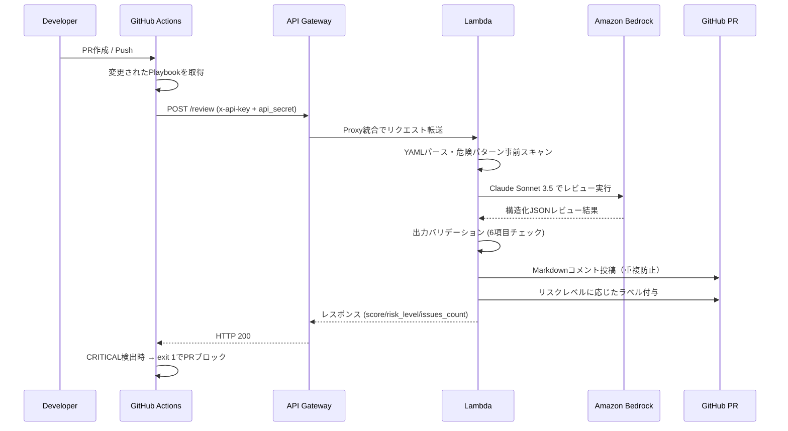

# Ansible Playbook AI Reviewer

> GitHub Actions × Amazon Bedrock でAnsible Playbookを自動AIレビュー。
> CRITICALな問題を検出してPRをブロック、具体的な改善提案をコメントで提供する。

---

## このハンズオンで得られること

このハンズオンを最後まで実施すると、次の内容を一通り体験できます。

- GitHub Actions と Amazon Bedrock を組み合わせた AI レビュー基盤の構築
- Terraform を使った API Gateway / Lambda / IAM / SSM のサーバーレス構成のデプロイ
- Ansible Playbook を PR 上で自動レビューし、コメントとラベルでフィードバックする仕組みの実装
- API Key と追加 secret を組み合わせたシンプルな二重認証の設計
- Bedrock を使ったレビュー処理を GitHub の開発フローへ組み込む実践パターン

この README の手順を終えるころには、「Ansible Playbook の AI レビューを GitHub PR に返す仕組み」を自分の AWS 環境で動かせる状態になります。

---

## デモ

```
📋 Ansible Playbook AI Review: site.yml
━━━━━━━━━━━━━━━━━━━━━━━━━━━━━━━━━━━━━━
総合スコア: 42/100  🔴 HIGH RISK

🚨 CRITICAL (2件)
  • パスワードがハードコードされています (L.18: db_password: "Secret!")
    → ansible-vault で暗号化し {{ vault_db_password }} で参照してください
  • no_log 未設定の認証情報タスク (L.35: configure database)
    → no_log: true を追加してください

⚠️ HIGH (3件) / 📌 MEDIUM (4件) / 💡 LOW (2件)
[詳細は以下に展開...]
```

*このようなMarkdownコメントがPRに自動投稿されます。CRITICALが検出されるとPRがブロックされます。*

---

## アーキテクチャ


```mermaid
sequenceDiagram
    participant Dev as Developer
    participant GH as GitHub Actions
    participant APIGW as API Gateway
    participant Lambda as Lambda
    participant Bedrock as Amazon Bedrock
    participant PR as GitHub PR

    Dev->>GH: PR作成 / Push
    GH->>GH: 変更されたPlaybookを取得
    GH->>APIGW: POST /review (x-api-key + api_secret)
    APIGW->>Lambda: Proxy統合でリクエスト転送
    Lambda->>Lambda: YAMLパース・危険パターン事前スキャン
    Lambda->>Bedrock: Claude Sonnet 3.5 でレビュー実行
    Bedrock-->>Lambda: 構造化JSONレビュー結果
    Lambda->>Lambda: 出力バリデーション (6項目チェック)
    Lambda->>PR: Markdownコメント投稿（重複防止）
    Lambda->>PR: リスクレベルに応じたラベル付与
    Lambda-->>APIGW: レスポンス (score/risk_level/issues_count)
    APIGW-->>GH: HTTP 200
    GH->>GH: CRITICAL検出時 → exit 1でPRブロック
```

---

## 機能

| 機能 | 説明 |
|---|---|
| ✅ 6カテゴリ自動レビュー | セキュリティ・冪等性・エラーハンドリング・パフォーマンス・可読性・ベストプラクティス |
| ✅ 重大度別問題検出 | CRITICAL / HIGH / MEDIUM / LOW の4段階 |
| ✅ 具体的な改善提案 | 問題箇所の行番号・改善コードサンプル付きコメント |
| ✅ PRブロック | CRITICAL検出時にワークフローをfailさせてマージを阻止 |
| ✅ カスタムGitHub Action | 1行で既存ワークフローに組み込み可能 |
| ✅ 重複コメント防止 | 同一PRへの再実行は既存コメントを更新 |

---

## レビュー観点

| カテゴリ | チェック内容 |
|---|---|
| **セキュリティ** | ハードコード認証情報、no_log未設定、become乱用、777パーミッション |
| **冪等性** | changed_when未設定のshell/command、fileモジュールの不適切使用 |
| **エラーハンドリング** | ignore_errors乱用、failed_when未設定、block/rescue/always活用 |
| **パフォーマンス** | 不要なgather_facts、非効率なループ、with_items（非推奨） |
| **可読性** | 不明確なタスク名、変数命名規則、コメント不足 |
| **ベストプラクティス** | FQCNモジュール名、タグ未設定、handlersの活用 |

詳細は [docs/review_criteria.md](docs/review_criteria.md) を参照。

---

## ハンズオン

このリポジトリは「AWS 上に Reviewer API を構築する側」のプロジェクトです。実際に試すときは、次の 2 つを順番に進めます。

1. このリポジトリを使って Reviewer API をデプロイする
2. Ansible Playbook を持つ別リポジトリから、その API を呼び出す

### 前提条件

- Terraform >= 1.9
- AWS CLI 設定済み
- GitHub アカウントとレビュー対象リポジトリ
- `us-east-1` で Amazon Bedrock の Claude Sonnet が有効化済み
- GitHub Actions から AWS へ接続するための OIDC ロールを作成できる権限

### ハンズオン全体像

1. AWS 側の前提を整える
2. Terraform で API Gateway / Lambda / IAM / SSM を作る
3. GitHub Token と API secret を SSM に登録する
4. Lambda の実コードをデプロイする
5. レビュー対象リポジトリに GitHub Secrets と workflow を設定する
6. API 単体テストを行う
7. PR を作ってレビュー結果を確認する

---

## Step 0. リポジトリを準備する

```bash
git clone https://github.com/your-org/ansible-playbook-ai-reviewer.git
cd ansible-playbook-ai-reviewer

python3 -m venv .venv
source .venv/bin/activate
```

Terraform を実行する作業ディレクトリは `terraform/environments/dev` です。

---

## Step 1. AWS 側の前提を整える

### 1-0. Terraform backend（state 用 S3 バケット）を作る

`terraform/environments/dev/main.tf` の backend は、次のバケットが存在することを前提にしています。先に作成しないと `terraform init` が `NoSuchBucket` で失敗します。

```bash
aws s3api create-bucket \
  --bucket terraform-state-ansible-ai-reviewer \
  --region ap-northeast-1 \
  --create-bucket-configuration LocationConstraint=ap-northeast-1

aws s3api put-bucket-versioning \
  --bucket terraform-state-ansible-ai-reviewer \
  --versioning-configuration Status=Enabled

aws s3api put-public-access-block \
  --bucket terraform-state-ansible-ai-reviewer \
  --public-access-block-configuration \
  BlockPublicAcls=true,IgnorePublicAcls=true,BlockPublicPolicy=true,RestrictPublicBuckets=true
```

- ロックは S3 ネイティブロック（`use_lockfile = true`）を使うため、DynamoDB テーブルは不要です。Terraform `>= 1.10` が必要です。
- S3 のバケット名はグローバルで一意です。`BucketAlreadyExists` になった場合は名前を変え、`main.tf` の backend も合わせて直してください。

### 1-1. Bedrock モデルの利用準備を確認する

Bedrock の Model access ページは廃止され、サーバーレス基盤モデルは初回呼び出し時に自動で有効になります。画面での有効化操作は不要です。

ただし Anthropic モデルは、アカウントで初めて使うときに用途情報の提出が必要な場合があります。初回のレビュー実行が `AccessDeniedException` などで拒否された場合は、`us-east-1` の Bedrock コンソール Playground で Claude Sonnet を一度実行し、案内に従って提出してください。

このプロジェクトでは次のリージョン構成です。

- Lambda / API Gateway / SSM / IAM: `ap-northeast-1`
- Bedrock: `us-east-1`

### 1-2. GitHub Actions 用 OIDC ロールを用意する

モノレポ直下の `.github/workflows/ansible-ai-reviewer-deploy.yml` は OIDC 前提です。このロールは `terraform/bootstrap/` で Terraform 管理します（作成手順は Step 4 の方法A）。

ここで手作業は不要ですが、AWS アカウントに GitHub の OIDC プロバイダが既にあるかだけ、先に確認しておくと後がスムーズです。

```bash
aws iam list-open-id-connect-providers
```

---

## Step 2. Terraform でインフラを作成する

### 2-1. 環境ディレクトリへ移動する

```bash
cd terraform/environments/dev
```

### 2-2. `terraform.tfvars` を確認する

このリポジトリには [terraform.tfvars](/home/takuya/terraform-lab/ansible-playbook-ai-reviewer/terraform/environments/dev/terraform.tfvars) が含まれています。まず次の値を確認してください。

- `environment`
- `aws_region`
- `bedrock_region`
- `lambda_timeout`
- `lambda_memory`
- `api_gateway_stage`
- `github_token_ssm_path`

### 2-3. 初期化と Plan

```bash
terraform init
terraform plan
```

### 2-4. Apply

```bash
terraform apply
```

作成される主なリソース:

- Lambda `ansible-ai-reviewer`
- API Gateway `ansible-ai-reviewer-api`
- IAM Role `ansible-ai-reviewer-role`
- SSM パラメータ
  - `/ansible-ai-reviewer/github-token`
  - `/ansible-ai-reviewer/api-key-secret`
  - `/ansible-ai-reviewer/api-gateway-key`

Apply 後に次の output を控えてください。

```text
api_endpoint         = "https://xxxxxxxx.execute-api.ap-northeast-1.amazonaws.com/v1/review"
lambda_function_name = "ansible-ai-reviewer"
```

`api_endpoint` はすでに `/review` を含んだ完全 URL です。

---

## Step 3. SSM に秘密情報を登録する

Terraform で SSM パラメータの箱は作られますが、値は `PLACEHOLDER` のままです。ここで本物の値に更新します。

### 3-1. GitHub Token を登録する

PR コメント投稿とラベル操作ができる GitHub Token を用意し、SSM に登録します。

**Token の取得**（Fine-grained token を推奨）

1. GitHub 右上のアイコン → **Settings** → 左下の **Developer settings**
2. **Personal access tokens** → **Fine-grained tokens** → **Generate new token**
3. 次のとおり設定する
   - **Repository access**: レビュー対象のリポジトリのみ（Only select repositories）
   - **Permissions**（Repository）:
     - **Pull requests**: Read and write（PR コメント・ラベル操作）
     - **Issues**: Read and write（ラベルは Issues API 経由）
     - **Contents**: Read-only（Playbook の取得が必要な場合）
   - **Expiration**: 30〜90 日程度
4. **Generate token** を押し、表示されたトークンをその場で控える（再表示されません）

Fine-grained token は `github_pat_...`、Classic token は `ghp_...` で始まります。Classic は `repo` スコープで全リポジトリに触れてしまうため、最小権限の観点では Fine-grained を使ってください。

**SSM への登録**

トークンをコマンドラインに直接書くと、シェル履歴に平文で残ります。入力を画面に表示せず、変数経由で渡してください。

```bash
# 入力は画面に表示されない。ペーストして Enter
read -rs GITHUB_TOKEN

aws ssm put-parameter \
  --name "/ansible-ai-reviewer/github-token" \
  --value "$GITHUB_TOKEN" \
  --type SecureString \
  --overwrite \
  --region ap-northeast-1

# 登録後は変数を消す
unset GITHUB_TOKEN
```

履歴に残るのは `"$GITHUB_TOKEN"` という変数名だけで、トークン本体は残りません。トークンはチャットやコード、`terraform.tfvars` に書かないでください。

**トークンを入力する場所**

1. `read -rs GITHUB_TOKEN` を実行して Enter を押す
2. カーソルが点滅するだけの待機状態になる（何も表示されないが、止まっているわけではない）
3. ここで取得したトークン（`github_pat_...`）をペーストする。`-s` により入力は画面に出ない
4. もう一度 Enter を押す。これでシェル変数 `GITHUB_TOKEN` にトークンが入る
5. 続けて `aws ssm put-parameter ... --value "$GITHUB_TOKEN"` を実行する
6. 最後に `unset GITHUB_TOKEN` で変数を消す

- 手順 1〜6 は同じターミナルのタブで続けて実行すること（タブを分けると変数が引き継がれない）。
- ペーストできたか不安なときは、手順 4 のあとに `echo ${#GITHUB_TOKEN}` を実行する。文字数だけが表示され、中身は出ない。

**コンソールから入力する場合**

AWS コンソールの Systems Manager → Parameter Store で `/ansible-ai-reviewer/github-token` を開き、**Edit** から値を直接入力してもよい。Terraform が作成した値は `PLACEHOLDER` のままなので、タイプを `SecureString` のまま、値だけをトークンに置き換える。

### 3-2. API 追加認証用 secret を登録する

```bash
export AI_REVIEWER_API_SECRET="$(openssl rand -hex 32)"

aws ssm put-parameter \
  --name "/ansible-ai-reviewer/api-key-secret" \
  --value "$AI_REVIEWER_API_SECRET" \
  --type SecureString \
  --overwrite \
  --region ap-northeast-1
```

### 3-3. API Gateway Key の値を確認する

```bash
aws ssm get-parameter \
  --name "/ansible-ai-reviewer/api-gateway-key" \
  --with-decryption \
  --region ap-northeast-1 \
  --query 'Parameter.Value' \
  --output text
```

この値はあとで `AI_REVIEWER_API_KEY` として GitHub Secrets に登録します。

---

## Step 4. Lambda の実コードをデプロイする

Terraform で作られる Lambda は最初 placeholder ZIP です。レビューを実際に動かすには Python コードをデプロイする必要があります。

### 方法A. GitHub Actions でデプロイする

モノレポ直下の `.github/workflows/ansible-ai-reviewer-deploy.yml` が、Lambda のパッケージングとデプロイを自動で行います。アクセスキーは使わず、GitHub Actions が OIDC で AWS の IAM ロールを引き受けます。

#### 仕組み

| トリガー | 動くジョブ |
|---|---|
| PR（`ansible-playbook-ai-reviewer/terraform/**` または `lambda/**` の変更） | `terraform`: fmt / init / validate / **plan**。結果を PR にコメント |
| `main` への push（同じパスの変更） | `terraform`: fmt / init / validate → `deploy-lambda`: ZIP 作成 → `update-function-code` → バージョン発行 |
| 手動（Actions タブ → Run workflow、ブランチは `main`） | push と同じ（`terraform` → `deploy-lambda`） |

> このワークフローは `terraform apply` を実行しません。インフラの作成・変更は、このリポジトリの運用ポリシーどおり、手元でユーザー自身が `terraform apply` します。CI がするのは、PR での `plan` と Lambda コードのデプロイだけです。

#### 前提

- Step 2 の `terraform apply` が完了し、Lambda 関数 `ansible-ai-reviewer` が存在すること（ワークフローは関数を作らず、コードを更新するだけです）
- 1-0 の state 用 S3 バケットが存在すること（ワークフローの `terraform init` と、下の bootstrap が使います）
- このリポジトリ（`tk-21/terraform-lab`）の GitHub Actions が有効であること

#### A-1. OIDC ロールを Terraform で作る（`terraform/bootstrap/`）

GitHub Actions が AWS に接続するための IAM ロールは、[terraform/bootstrap/](terraform/bootstrap/) で管理します。

`environments/dev` と別の state（`.../bootstrap/terraform.tfstate`）にしているのは、CI が引き受けるロールを CI が plan する同じスタックに入れると、「ロールが無いと plan できない」という鶏卵問題になるためです。

作成されるもの:

| リソース | 内容 |
|---|---|
| IAM ロール `ansible-ai-reviewer-github-actions` | 信頼ポリシーは `main` ブランチ（push・手動実行）と PR のみ許可。fork などは許可しない |
| `ReadOnlyAccess`（マネージドポリシー） | `terraform plan` の読み取り用 |
| インラインポリシー | Lambda `ansible-ai-reviewer` の `UpdateFunctionCode` / `PublishVersion`、state バケットの読み書きのみ |
| OIDC プロバイダ（任意） | アカウントに無い場合だけ作成（`create_oidc_provider = true`） |

GitHub の OIDC プロバイダはアカウントに 1 つしか登録できません。他のプロジェクトで作成済みかを先に確認します。

```bash
aws iam list-open-id-connect-providers
```

- 出力に `token.actions.githubusercontent.com` を含む ARN がある → 既存を参照します（既定）
- 無い → 下の `plan` / `apply` に `-var="create_oidc_provider=true"` を付けます

実行します（`apply` はユーザー自身が行います）。

```bash
cd terraform/bootstrap
terraform init
terraform plan  -var="github_owner=<GitHubのユーザー名または組織名>"
terraform apply -var="github_owner=<GitHubのユーザー名または組織名>"
```

- リポジトリ名の既定値は `terraform-lab` です。違う場合は `-var="github_repo=<リポジトリ名>"` を付けます。
- 変数の一覧は [terraform/bootstrap/variables.tf](terraform/bootstrap/variables.tf) を参照してください。

#### A-2. GitHub Secret に `AWS_ROLE_ARN` を登録する

ロールの ARN を確認します（`terraform/bootstrap` ディレクトリで実行）。

```bash
terraform output -raw role_arn
```

GitHub のリポジトリ画面で次の順に操作します。

1. **Settings** → **Secrets and variables** → **Actions**
2. **New repository secret**
3. Name に `AWS_ROLE_ARN`、Secret に上で確認した ARN を入力して **Add secret**

| Secret名 | 用途 |
|---|---|
| `AWS_ROLE_ARN` | GitHub Actions から AWS に OIDC で接続するため |

ARN はアクセスキーのような秘密情報ではありませんが、ワークフローは `secrets.AWS_ROLE_ARN` を参照するため、Secret として登録します。

#### A-3. ワークフローを実行する

次のどちらかで実行します。

- **手動実行**: GitHub の **Actions** タブ → `ansible-ai-reviewer Deploy` → **Run workflow** → ブランチに `main` を選ぶ。初回の疎通確認とデプロイに向いています
- **push で実行**: `ansible-playbook-ai-reviewer/lambda/`（または `terraform/`）配下を変更する PR を出し（PR では plan だけが走ります）、`main` にマージする

> ワークフローファイルがまだ `main` に無い場合、Actions タブには表示されません。先にワークフローを `main` にマージしてください。

#### A-4. 動作を確認する

1. **Actions** タブで `terraform` と `Deploy Lambda` の両ジョブが成功していること
2. `Deploy Lambda` の最後のステップに `Lambda デプロイ完了: version N` と出ていること
3. 手元で、コードが更新されたことを確認する

```bash
aws lambda get-function \
  --function-name ansible-ai-reviewer \
  --region ap-northeast-1 \
  --query 'Configuration.[LastModified,CodeSize,LastUpdateStatus]'
```

`CodeSize` が placeholder（数百バイト）より大きく、`LastUpdateStatus` が `Successful` であれば成功です。

#### つまずきやすい点

| 症状 | 原因と対処 |
|---|---|
| `Could not assume role with OIDC` / `Not authorized to perform sts:AssumeRoleWithWebIdentity` | 信頼ポリシーの `sub` が実行元と一致していない。許可しているのは `main` ブランチと PR のみ。bootstrap の `github_owner` / `github_repo` の値も確認 |
| `Credentials could not be loaded` | `AWS_ROLE_ARN` Secret が未登録、または名前の typo。Secrets はリポジトリ単位なので、fork では使えない |
| `terraform init` で `NoSuchBucket` | 1-0 の S3 バケットが未作成、または backend のバケット名が違う |
| `terraform plan`（PR）で `AccessDenied` | `ReadOnlyAccess` で読めないサービスをスタックが使っている。必要な読み取り権限を `bootstrap/main.tf` に追加する |
| `ResourceNotFoundException: Function not found` | Step 2 の `terraform apply` が未実施。先に Lambda を作る |
| ワークフローが起動しない | 変更したファイルが `paths:` の対象外。`ansible-playbook-ai-reviewer/terraform/**` または `lambda/**` を変更したか確認 |
| PR のコメントが `AccessDenied` | ワークフローの `permissions.pull-requests: write` を確認 |

### 方法B. 手元から手動デプロイする

```bash
cd /path/to/ansible-playbook-ai-reviewer
source .venv/bin/activate
rm -f lambda_package.zip
rm -rf lambda/playbook_reviewer/package
mkdir -p lambda/playbook_reviewer/package

.venv/bin/pip install -r lambda/playbook_reviewer/requirements.txt \
  -t lambda/playbook_reviewer/package \
  --platform manylinux2014_aarch64 \
  --only-binary=:all:

cp lambda/playbook_reviewer/*.py lambda/playbook_reviewer/package/

cd lambda/playbook_reviewer/package
zip -r ../../../lambda_package.zip .

cd ../../..
aws lambda update-function-code \
  --function-name ansible-ai-reviewer \
  --zip-file fileb://lambda_package.zip \
  --region ap-northeast-1
```

反映待ち:

```bash
aws lambda wait function-updated \
  --function-name ansible-ai-reviewer \
  --region ap-northeast-1
```

---

## Step 5. レビュー対象リポジトリに GitHub Secrets を登録する

ここからは、Ansible Playbook を持つ側のリポジトリで作業します。

`Settings → Secrets and variables → Actions` に次を追加してください。

| Secret名 | 値 |
|---|---|
| `AI_REVIEWER_API_ENDPOINT` | Terraform output の `api_endpoint` |
| `AI_REVIEWER_API_KEY` | `/ansible-ai-reviewer/api-gateway-key` の値 |
| `AI_REVIEWER_API_SECRET` | `/ansible-ai-reviewer/api-key-secret` に登録した値 |

---

## Step 6. レビュー workflow を設定する

### 6-1. サンプル workflow を配置する

このリポジトリの [example_ansible_review.yml](examples/workflows/example_ansible_review.yml) をベースに、レビュー対象リポジトリの `.github/workflows/` に配置します。

### 6-2. 最小構成の例

```yaml
name: Ansible Playbook AI Review

on:
  pull_request:
    branches: [main]
    paths:
      - '**.yml'
      - '**.yaml'

permissions:
  contents: read
  pull-requests: write

jobs:
  ai-review:
    runs-on: ubuntu-latest
    steps:
      - uses: actions/checkout@v4

      - name: Ansible Playbook AI Review
        id: ai-review
        uses: your-org/ansible-playbook-ai-reviewer/github_actions/ansible-ai-review@main
        with:
          api_endpoint: ${{ secrets.AI_REVIEWER_API_ENDPOINT }}
          api_key: ${{ secrets.AI_REVIEWER_API_KEY }}
          api_secret: ${{ secrets.AI_REVIEWER_API_SECRET }}
          github_token: ${{ secrets.GITHUB_TOKEN }}
          playbook_paths: 'playbooks/**/*.yml,roles/**/*.yml'
          fail_on_critical: 'true'
```

---

## Step 7. API 単体テストを行う

GitHub Actions に入る前に API 単体で疎通確認しておくと、切り分けが楽です。

### 7-1. 環境変数を入れる

```bash
export AI_REVIEWER_API_ENDPOINT="https://xxxxxxxx.execute-api.ap-northeast-1.amazonaws.com/v1/review"
export AI_REVIEWER_API_KEY="$(aws ssm get-parameter \
  --name "/ansible-ai-reviewer/api-gateway-key" \
  --with-decryption \
  --region ap-northeast-1 \
  --query 'Parameter.Value' \
  --output text)"
export AI_REVIEWER_API_SECRET="$(aws ssm get-parameter \
  --name "/ansible-ai-reviewer/api-key-secret" \
  --with-decryption \
  --region ap-northeast-1 \
  --query 'Parameter.Value' \
  --output text)"
```

### 7-2. サンプル Playbook で呼び出す

```bash
curl -X POST "$AI_REVIEWER_API_ENDPOINT" \
  -H "Content-Type: application/json" \
  -H "x-api-key: $AI_REVIEWER_API_KEY" \
  -d "{
    \"playbook_content\": \"$(python3 - <<'PY'
from pathlib import Path
import json
print(json.dumps(Path('examples/sample_playbook_bad.yml').read_text())[1:-1])
PY
)\",
    \"playbook_filename\": \"sample_playbook_bad.yml\",
    \"github_repo_owner\": \"your-org\",
    \"github_repo_name\": \"your-repo\",
    \"pr_number\": 1,
    \"api_secret\": \"$AI_REVIEWER_API_SECRET\"
  }" | jq .
```

期待されるレスポンス例:

```json
{
  "status": "success",
  "overall_score": 35,
  "risk_level": "HIGH",
  "issues_count": 9,
  "comment_url": "https://github.com/your-org/your-repo/pull/1#issuecomment-...",
  "message": "レビュー完了: 9件の問題を検出しました（スコア: 35/100）"
}
```

---

## Step 8. PR ベースで動作確認する

### 8-1. テスト用 Playbook を作る

[sample_playbook_bad.yml](/home/takuya/terraform-lab/ansible-playbook-ai-reviewer/examples/sample_playbook_bad.yml) を参考に、レビュー対象リポジトリへ問題を含む Playbook を追加します。

### 8-2. PR を作成する

PR 作成後、workflow が正常に動けば次を確認できます。

- PR コメントにレビュー結果が投稿される
- `ai-review:*` ラベルが付与される
- CRITICAL 問題がある場合は workflow が fail する

### 8-3. 再実行してコメント更新を確認する

同じ PR に追加 commit を push すると、新しいコメントが増えるのではなく既存レビューコメントが更新されます。

---

## ハンズオンで詰まりやすいポイント

| 症状 | 確認ポイント |
|---|---|
| `403 Forbidden` | `AI_REVIEWER_API_SECRET` と SSM の secret 値が一致しているか |
| `500` エラー | Lambda が placeholder のままで実コード未配備ではないか |
| GitHub にコメントされない | GitHub Token の権限、owner/repo/PR番号が正しいか |
| Bedrock 呼び出し失敗 | `us-east-1` で Claude Sonnet の利用準備（1-1 参照）が済んでいるか |
| CI でだけ失敗する | workflow の `permissions.pull-requests: write` があるか |

運用手順やより詳しい構成は [ARCHITECTURE.md](ARCHITECTURE.md) を参照してください。

---

## 使用技術

| レイヤー | 技術 |
|---|---|
| **CI/CD** | GitHub Actions（カスタムComposite Action） |
| **IaC** | Terraform >= 1.9（モジュール化構成） |
| **コンピュート** | AWS Lambda（Python 3.12, arm64） |
| **AI/ML** | Amazon Bedrock（Claude Sonnet 3.5, us-east-1） |
| **API** | Amazon API Gateway（REST API, Lambda Proxy統合） |
| **Secrets管理** | AWS SSM Parameter Store（SecureString） |
| **認証** | API Gatewayキー + api_secret二重認証、GitHub Actions OIDC |
| **可観測性** | AWS Lambda Powertools（Logger + Tracer）、CloudWatch Logs |

---

## コスト見積もり

| リソース | 条件 | 月額概算 |
|---|---|---|
| Lambda | 月50回実行 × 30秒 × 512MB | ~$0.05 |
| API Gateway | 月50リクエスト | ~$0.02 |
| Bedrock（Claude Sonnet 3.5） | 月50回 × 平均2,000トークン | ~$1.50 |
| SSM Parameter Store | SecureString 2パラメータ | ~$0.02 |
| **合計** | | **~$2.00/月** |

---

## 設計の工夫

### なぜAPI GatewayにAPIキー + api_secretの二重認証を使うか

API Gatewayのx-api-keyはレート制限・使用量追跡に特化している。しかしキーの漏洩に備えてLambda内でSSMから取得した`api-key-secret`と照合する第二の認証層を追加した。これにより、たとえAPI Gatewayキーが漏洩しても不正呼び出しを防止できる。

### なぜLambda Function URLではなくAPI Gatewayを使うか

API GatewayはAPIキー管理・使用量プラン・WAFとのネイティブ統合・詳細なアクセスログが標準で利用できる。Function URLはシンプルだがこれらの機能を自前実装する必要があり、ポートフォリオとして「エンタープライズ水準のAPI設計」を示すためにAPI Gatewayを採用した。

### なぜPlaybookを永続化しないか（プライバシー設計）

Playbookにはサーバー構成・IPアドレス・変数名など機密情報が含まれる可能性がある。レビュー処理はLambdaのメモリ上のみで完結し、S3・DBへの永続化は一切行わない。これにより、インフラ情報の意図しない漏洩リスクを排除している。

### AI出力バリデーション6項目の設計意図

BedrockのLLM出力は確定的でなく、フォーマット崩れが起きうる。`review_validator.py`で`overall_score`の数値範囲・`issues`のリスト形式・各issueの必須フィールド（severity/category/description）・`summary`の文字列型・`recommendations`のリスト形式を厳密にチェックすることで、バリデーション失敗を500エラーとして返しPRへの不正コメント投稿を防いでいる。

---

## ドキュメント

| ドキュメント | 内容 |
|---|---|
| [ARCHITECTURE.md](ARCHITECTURE.md) | システム構成・セキュリティ設計・拡張性 |
| [docs/review_criteria.md](docs/review_criteria.md) | 全6カテゴリのレビュー観点（good/bad例付き） |

---

## ライセンス

MIT
