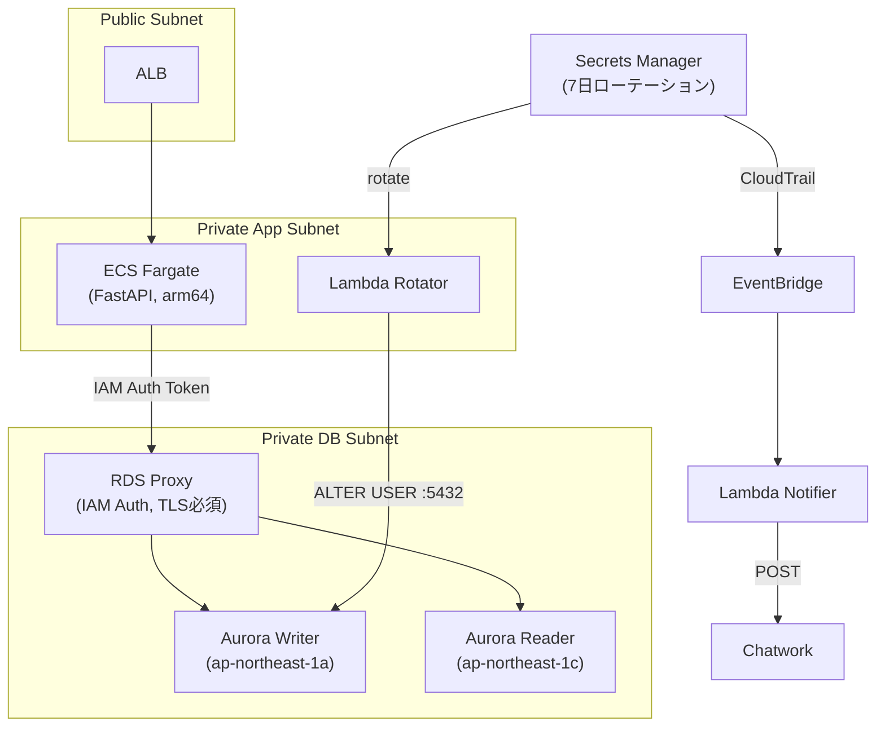

# aurora-rds-proxy-lab

Aurora Serverless v2 + RDS Proxy + Secrets Manager 自動ローテーションのハンズオン。
ECS Fargate アプリから RDS Proxy 経由で Aurora PostgreSQL に接続し、
接続管理・パスワードローテーション・フェイルオーバーの運用設計を体得する。

---

## このハンズオンで得られること

### 技術スキル

| 習得項目 | 詳細 |
|---------|------|
| **RDB 運用設計** | DynamoDB 中心のポートフォリオに RDB 運用設計を追加できる |
| **RDS Proxy の接続管理** | ECS の起動・停止による接続スパイクを Proxy で吸収する設計を実装できる |
| **IAM 認証によるパスワードレス接続** | アプリコード・環境変数に DB パスワードを一切持たない構成を実装できる |
| **Secrets Manager 自動ローテーション** | 7 日ごとのパスワード自動更新を、接続断なしで実現する仕組みを理解できる |
| **Aurora フェイルオーバーの透過化** | Writer/Reader 切替をアプリから隠蔽する RDS Proxy の動作を定量的に計測できる |
| **VPC Endpoint のみのネットワーク設計** | NAT Gateway なしで Private Subnet から AWS サービスに接続するセキュアな設計ができる |
| **Terraform モジュール設計** | 5 層（ネットワーク / DB / Proxy / ローテーション / アプリ）のモジュール分割を実践できる |

### 面接で話せる定量的な成果

このハンズオンを完走すると、以下の数値を自分の言葉で語れるようになる:

- フェイルオーバー中のアプリエラー率（RDS Proxy あり vs なし）
- ローテーション中の接続断件数（期待値: **0 件**）
- 50 並列リクエスト時の Aurora 接続数（Proxy による接続プール抑制効果）
- NAT Gateway 廃止によるコスト削減額（~$65/月）

---

## アーキテクチャ



詳細なアーキテクチャ解説は [docs/ARCHITECTURE.md](docs/ARCHITECTURE.md) を参照。

---

## 主要技術スタック

| レイヤー | 技術 |
|---------|------|
| DB | Aurora Serverless v2 (PostgreSQL 15, 0.5〜4 ACU) |
| 接続管理 | RDS Proxy (IAM 認証, TLS 必須, Connection Pooling) |
| 認証情報管理 | Secrets Manager (7 日ローテーション) |
| アプリ | ECS Fargate (arm64 / FARGATE_SPOT, FastAPI + psycopg3) |
| IaC | Terraform (S3 + DynamoDB state, モジュール構成) |
| CI/CD | GitHub Actions (OIDC 認証, アクセスキー不使用) |
| ネットワーク | VPC Endpoint のみ (NAT Gateway 廃止) |

---

## 前提条件

### 必須ツール

```bash
# バージョン確認
aws --version          # AWS CLI v2 以上
terraform --version    # v1.5.0 以上
docker --version       # Docker Desktop (arm64 ビルド用)
psql --version         # PostgreSQL クライアント (setup-db-user.sh で使用)

# AWS 認証確認
aws sts get-caller-identity
# 期待: {UserId, Account, Arn} が表示されること
```

### AWS 環境

- **リージョン**: `ap-northeast-1` (東京) 固定
- **IAM 権限**: AdministratorAccess 相当（学習目的）
- **GitHub リポジトリ**: OIDC デプロイ用（Phase 5 で必要）
- **Chatwork API トークン**: ローテーション通知用（Phase 4 で必要）

---

## ハンズオン実行手順

### Phase 1 — 基盤構築（VPC・Terraform State）

**目標**: Terraform の State バックエンドと、全リソースが稼働するネットワーク基盤を構築する。

#### Step 1-1: プロジェクトのクローン

```bash
git clone <このリポジトリのURL>
cd aurora-rds-proxy-lab
```

#### Step 1-2: Terraform Bootstrap（State バックエンド）

最初だけ State 管理用の S3 バケットと DynamoDB テーブルをローカル State で作成する。

```bash
cd terraform/bootstrap
terraform init
terraform apply
# 作成されるリソース:
#   - S3 バケット: arpl-tfstate-<ACCOUNT_ID>  (バージョニング・暗号化有効)
#   - DynamoDB テーブル: arpl-tflock          (State ロック用)

# バケット名を控えておく
terraform output tfstate_bucket
```

#### Step 1-3: environments/dev の初期化

`terraform/environments/dev/backend.tf` の `bucket` を Step 1-2 で控えたバケット名に書き換える。

```bash
cd ../environments/dev

# backend.tf の bucket 名を確認・修正してから init
terraform init

# フォーマット・検証
terraform fmt -recursive
terraform validate

# ネットワークモジュールのみ apply
terraform apply -target=module.networking
```

#### Step 1-4: 検証

```bash
# VPC と 6 サブネットの確認
aws ec2 describe-vpcs \
  --filters "Name=tag:Name,Values=arpl-vpc" \
  --query 'Vpcs[0].{ID:VpcId,CIDR:CidrBlock}' \
  --output json

# VPC Endpoint が 7 本すべて "available" であることを確認
aws ec2 describe-vpc-endpoints \
  --filters "Name=vpc-id,Values=$(terraform output -raw vpc_id)" \
  --query 'VpcEndpoints[].{Service:ServiceName,State:State}' \
  --output table
```

**完了チェック**:
- [ ] VPC (10.0.0.0/16) と 6 サブネット（Public×2 / App×2 / DB×2）が存在する
- [ ] VPC Endpoint 7 本がすべて `available`
- [ ] `terraform validate` がエラーなし

---

### Phase 2 — Aurora Serverless v2 構築

**目標**: Writer + Reader の 2 AZ 構成で Aurora PostgreSQL 15 を起動し、カスタムパラメータグループで接続ログを有効化する。

#### Step 2-1: Aurora モジュールの apply

```bash
cd terraform/environments/dev
terraform apply -target=module.aurora
# Aurora 起動には 5〜10 分かかる
```

#### Step 2-2: 検証

```bash
# クラスター状態確認 (Status が "available" になるまで待つ)
aws rds describe-db-clusters \
  --db-cluster-identifier arpl-aurora-cluster \
  --query 'DBClusters[0].{Status:Status,Engine:Engine,EngineVersion:EngineVersion}' \
  --output json

# Writer / Reader インスタンスの配置 AZ 確認
aws rds describe-db-instances \
  --filters "Name=db-cluster-id,Values=arpl-aurora-cluster" \
  --query 'DBInstances[*].{ID:DBInstanceIdentifier,Class:DBInstanceClass,AZ:AvailabilityZone,Status:DBInstanceStatus}' \
  --output table

# SSM にエンドポイントが登録されているか確認
aws ssm get-parameter --name /arpl/aurora/endpoint --query Parameter.Value --output text
```

**完了チェック**:
- [ ] Writer (1a) と Reader (1c) が `available`
- [ ] `/arpl/aurora/endpoint` が SSM に保存されている
- [ ] `manage_master_user_password = true` によりマスターシークレットが Secrets Manager に作成されている

---

### Phase 3 — RDS Proxy + IAM 認証

**目標**: Aurora の前段に RDS Proxy を配置し、ECS タスクがパスワードを持たずに IAM 認証トークンで接続できる構成にする。

#### Step 3-1: RDS Proxy モジュールの apply

```bash
cd terraform/environments/dev
terraform apply -target=module.rds_proxy
# Proxy の作成・登録に 5 分程度かかる
```

#### Step 3-2: 検証

```bash
# Proxy 状態確認
aws rds describe-db-proxies \
  --db-proxy-name arpl-rds-proxy \
  --query 'DBProxies[0].{Status:Status,Endpoint:Endpoint,RequireTLS:RequireTLS}' \
  --output json

# Target Group が "available" になるまで待つ（接続確立に最大 2 分かかる）
aws rds describe-db-proxy-targets \
  --db-proxy-name arpl-rds-proxy \
  --query 'Targets[*].{Endpoint:Endpoint,Port:Port,State:TargetHealth.State}' \
  --output table

# SSM にプロキシエンドポイントが登録されているか確認
aws ssm get-parameter --name /arpl/rds-proxy/endpoint --query Parameter.Value --output text
aws ssm get-parameter --name /arpl/rds-proxy/reader-endpoint --query Parameter.Value --output text
```

**完了チェック**:
- [ ] Proxy の Status が `available`
- [ ] Target Group の State が `available`
- [ ] Writer / Reader エンドポイントが SSM `/arpl/rds-proxy/*` に保存されている

---

### Phase 4 — Secrets Manager ローテーション

**目標**: アプリ用 DB ユーザーを作成し、7 日ごとの自動ローテーションを設定する。ローテーション完了を Chatwork に通知する。

#### Step 4-1: Chatwork トークンを SSM に登録

```bash
# Chatwork API トークンを SecureString で保存
aws ssm put-parameter \
  --name /arpl/chatwork/token \
  --value "YOUR_CHATWORK_API_TOKEN" \
  --type SecureString \
  --overwrite

# Chatwork ルーム ID を保存
aws ssm put-parameter \
  --name /arpl/chatwork/room-id \
  --value "YOUR_ROOM_ID" \
  --type String \
  --overwrite
```

#### Step 4-2: Secrets / ローテーション Lambda の apply

```bash
cd terraform/environments/dev
terraform apply -target=module.rotation
```

#### Step 4-3: アプリ用 DB ユーザーの作成

Proxy 経由でマスターユーザーとして接続し、`appuser` を作成する。
このスクリプトは Phase 3 の Proxy が稼働していないと実行できない。

```bash
bash scripts/setup-db-user.sh
# 内部処理:
#   1. SSM から Proxy エンドポイント・DB 名を取得
#   2. Secrets Manager からマスターパスワードを取得
#   3. psql で CREATE USER appuser + GRANT を実行
```

#### Step 4-4: 初回ローテーションの実行と確認

```bash
# 即時ローテーションをトリガー（検証目的）
aws secretsmanager rotate-secret \
  --secret-id arpl/db/appuser \
  --rotate-immediately \
  --region ap-northeast-1

# ローテーション状態を確認（InProgress → null に変わるまで待つ）
aws secretsmanager describe-secret \
  --secret-id arpl/db/appuser \
  --query '{Enabled:RotationEnabled,LastRotated:LastRotatedDate,NextRotation:NextRotationDate}' \
  --output json

# Lambda のログでエラーがないか確認
aws logs tail /aws/lambda/arpl-secret-rotator --since 5m --region ap-northeast-1
```

**完了チェック**:
- [ ] `arpl/db/appuser` シークレットが Secrets Manager に存在し、ローテーション有効
- [ ] Lambda ログにエラーなし
- [ ] Chatwork に「ローテーション完了」通知が届いている

---

### Phase 5 — ECS Fargate アプリ + ALB

**目標**: FastAPI アプリを arm64 イメージでビルドして ECR にプッシュし、ECS Fargate でデプロイする。RDS Proxy への IAM 認証接続を確認する。

#### Step 5-1: ECR リポジトリの作成（先行 apply）

```bash
cd terraform/environments/dev
terraform apply -target=module.ecs_app -target=module.ecs_app.aws_ecr_repository.app
# ECR リポジトリ URL を取得
ECR_URL=$(terraform output -raw ecr_repo_url)
echo "ECR: $ECR_URL"
```

#### Step 5-2: arm64 イメージのビルドとプッシュ

```bash
# ECR にログイン
aws ecr get-login-password --region ap-northeast-1 | \
  docker login --username AWS --password-stdin $ECR_URL

# arm64 向けにビルドしてプッシュ
# (Apple Silicon Mac の場合は --platform linux/arm64 を指定)
docker buildx build \
  --platform linux/arm64 \
  --push \
  -t $ECR_URL:latest \
  app/
```

> **x86_64 マシンで作業している場合**: `docker buildx` の cross-compile が必要。
> `docker buildx create --use` を実行してから上記コマンドを実行する。

#### Step 5-3: ECS サービスの起動

```bash
cd terraform/environments/dev
terraform apply -target=module.ecs_app
# ECS タスクが RUNNING になるまで 2〜3 分かかる
```

#### Step 5-4: 動作確認

```bash
# ALB DNS 名を取得
ALB_DNS=$(terraform output -raw alb_dns_name)
echo "ALB: http://$ALB_DNS"

# ヘルスチェック (DB 接続含む)
curl http://$ALB_DNS/health
# 期待: {"status": "healthy", "db": "connected"}

# アイテム一覧
curl http://$ALB_DNS/items
# 期待: [] (初回は空)

# アイテム作成
curl -X POST http://$ALB_DNS/items \
  -H 'Content-Type: application/json' \
  -d '{"name": "hello-aurora"}'
# 期待: {"id": 1, "name": "hello-aurora", "created_at": "..."}

# ECS タスクが DB パスワードを持っていないことを確認
aws ecs describe-task-definition \
  --task-definition arpl-app \
  --query 'taskDefinition.containerDefinitions[0].environment' \
  --output table
# 期待: PROXY_ENDPOINT_PARAM, DB_NAME_PARAM, DB_USER のみ (パスワードなし)
```

#### Step 5-5: GitHub Actions OIDC の設定（任意）

```bash
# GitHub Secrets に設定する値
terraform output github_actions_role_arn
# → OIDC_ROLE_ARN として GitHub Secrets に登録

# .github/workflows/deploy.yml を有効化して push するとデプロイが走る
```

**完了チェック**:
- [ ] ECS サービスが `RUNNING` (タスク数 2)
- [ ] `/health` が `{"status": "healthy", "db": "connected"}` を返す
- [ ] `/items` で GET / POST が動作する
- [ ] タスク定義にパスワードが含まれていない
- [ ] CloudWatch Logs `/ecs/arpl-app` にログが出力されている

---

### Phase 6 — フェイルオーバー・ローテーション検証

**目標**: RDS Proxy の効果を定量的に計測し、面接で話せる数値を記録する。

#### Step 6-1: フェイルオーバーテスト

ALB へのリクエストを監視しながら Aurora フェイルオーバーを実行し、エラー率を計測する。

```bash
bash scripts/failover-test.sh
```

スクリプトが行うこと:
1. `http://$ALB_DNS/health` に 2 秒間隔でポーリング開始
2. 10 秒後に `aws rds failover-db-cluster` を実行
3. フェイルオーバー完了後 30 秒間ポーリングを継続
4. 成功数・エラー数・エラー率を集計

```bash
# フェイルオーバー後に Writer/Reader の AZ が入れ替わったことを確認
aws rds describe-db-cluster \
  --db-cluster-identifier arpl-aurora-cluster \
  --query 'DBCluster.DBClusterMembers[*].{InstanceID:DBInstanceIdentifier,IsWriter:IsClusterWriter}' \
  --output table
```

#### Step 6-2: ローテーション中の接続断テスト

ALB へのリクエストを監視しながらローテーションを実行し、接続断がないことを証明する。

```bash
bash scripts/verify-rotation.sh
# 期待: エラー数 0 件
# 仕組み: RDS Proxy が AWSCURRENT と AWSPENDING の両パスワードを一時受け入れる
```

#### Step 6-3: 接続プール負荷テスト

50 並列リクエストを送り、Aurora 側の接続数が max_connections を超えないことを確認する。

```bash
bash scripts/load-test.sh
# Aurora 接続数が CloudWatch で確認できる
# 期待: Proxy の接続プール管理により Aurora への直接接続数が抑制される
```

#### Step 6-4: 計測結果の記録

`docs/runbook/failover.md` と `docs/runbook/rotation-verify.md` の `XX 秒` プレースホルダーに
実測値を記入する。この数値が面接での STAR 回答の「Result」になる。

**完了チェック**:
- [ ] フェイルオーバーのエラー率が記録されている
- [ ] ローテーション中のエラー数が 0 件
- [ ] 負荷テスト時の Aurora 接続数が max_connections 以内
- [ ] `docs/runbook/failover.md` に自分の言葉で考察を記述した

---

## 検証結果

### フェイルオーバー (Step 6-1)

| 指標 | 計測値 |
|------|--------|
| フェイルオーバー所要時間 | XX 秒 |
| エラー率 | X.X% (X 件 / Y 件) |
| エンドポイント変更 | 不要 (Proxy が透過化) |

> RDS Proxy がエンドポイントを固定するため、アプリは Aurora の Writer/Reader 切替を意識しない。

### ローテーション中の接続断 (Step 6-2)

| 指標 | 計測値 |
|------|--------|
| ローテーション所要時間 | XX 秒 |
| 接続エラー数 | 0 件 |

> RDS Proxy が `AWSCURRENT` と `AWSPENDING` の両パスワードを一時受け入れるため、ゼロダウンタイムで切替が完了する。

### 負荷テスト (Step 6-3)

| 指標 | 計測値 |
|------|--------|
| 同時リクエスト数 | 50 |
| 総リクエスト数 | 200 |
| Aurora 接続数最大値 | XX (max_connections 以内) |

> Proxy が接続プールを管理するため、アプリの同時接続数が増えても Aurora 側の接続数は抑制される。

---

## クリーンアップ

**重要**: Aurora には削除保護がかかっているため、先に解除が必要。

```bash
# Step 1: Aurora 削除保護を解除
aws rds modify-db-cluster \
  --db-cluster-identifier arpl-aurora-cluster \
  --no-deletion-protection \
  --apply-immediately \
  --region ap-northeast-1

# 反映を待つ
sleep 30

# Step 2: アプリ層から順番に destroy（依存関係の逆順）
cd terraform/environments/dev
terraform destroy -target=module.ecs_app
terraform destroy -target=module.rotation
terraform destroy -target=module.rds_proxy
terraform destroy -target=module.aurora
terraform destroy -target=module.networking
terraform destroy  # 残余リソースの掃除

# Step 3: Bootstrap の削除（S3 バケットを空にしてから）
BUCKET=$(cd terraform/bootstrap && terraform output -raw tfstate_bucket)
aws s3 rm s3://$BUCKET --recursive
cd terraform/bootstrap && terraform destroy
```

> **VPC Endpoint は 7 本あるため destroy に数分かかる。** エラーが出た場合は再度 `terraform destroy` を実行する。

---

## コスト設計（月額見積）

| リソース | 概算 |
|---------|------|
| Aurora Serverless v2 (0.5 ACU idle) | ~$43/月 |
| RDS Proxy | ~$11/月 |
| ECS Fargate FARGATE_SPOT (arm64) | ~$5/月 |
| VPC Endpoint (7 本) | ~$50/月 |
| NAT Gateway | $0（廃止） |
| **合計** | **~$109/月** |

> **Note**: VPC Endpoint 7 本で ~$50/月 かかるため月額 $30 目標を超過。
> 本番相当のセキュリティ（NAT Gateway 廃止）を優先した設計上のトレードオフ。
> コスト削減が必要な場合は VPC Endpoint を secretsmanager/ecr/logs の最小 3 本（~$21/月）に絞ることを検討。

---

## ディレクトリ構造

```
aurora-rds-proxy-lab/
├── app/                        # FastAPI アプリ (psycopg3 + IAM Auth)
│   ├── Dockerfile
│   ├── requirements.txt
│   ├── main.py
│   ├── db/
│   │   ├── connection.py       # IAM 認証トークン生成・接続管理
│   │   └── queries.py          # CRUD クエリ
│   └── api/
│       ├── health.py           # GET /health
│       └── items.py            # GET /items, POST /items
├── lambda/
│   ├── rotator/                # Secrets Manager ローテーション Lambda
│   └── notifier/               # Chatwork 通知 Lambda
├── scripts/
│   ├── setup-db-user.sh        # appuser 作成・権限付与
│   ├── package-lambda.sh       # Lambda 依存パッケージのビルド (arm64)
│   ├── failover-test.sh        # フェイルオーバー計測
│   ├── verify-rotation.sh      # ローテーション接続断計測
│   └── load-test.sh            # 接続プール負荷テスト
├── terraform/
│   ├── bootstrap/              # S3 state バケット + DynamoDB lock
│   ├── modules/
│   │   ├── networking/         # VPC / Subnet / SG / VPC Endpoint
│   │   ├── aurora/             # Cluster / Instance / Parameter Group
│   │   ├── rds-proxy/          # Proxy / Target Group / IAM / Reader Endpoint
│   │   ├── rotation/           # Secret / Lambda Rotator / EventBridge / Notifier
│   │   └── ecs-app/            # ECR / ECS Cluster / Task / Service / ALB / OIDC
│   └── environments/dev/
│       ├── main.tf
│       ├── variables.tf
│       ├── outputs.tf
│       ├── backend.tf
│       └── terraform.tfvars
└── docs/
    ├── ARCHITECTURE.md         # 設計詳細・フロー図・トレードオフ解説
    ├── adr/                    # Architecture Decision Records
    └── runbook/
        ├── failover.md         # フェイルオーバー検証結果
        └── rotation-verify.md  # ローテーション検証結果
```

---

## 関連ドキュメント

| ドキュメント | 内容 |
|------------|------|
| [docs/ARCHITECTURE.md](docs/ARCHITECTURE.md) | 全体設計・Mermaid フロー図・設計トレードオフ |
| [docs/adr/001-aurora-serverless-v2.md](docs/adr/001-aurora-serverless-v2.md) | Aurora Serverless v2 採用の決定記録 |
| [docs/adr/002-rds-proxy-iam-auth.md](docs/adr/002-rds-proxy-iam-auth.md) | IAM 認証方式の決定記録 |
| [docs/adr/003-secrets-rotation-strategy.md](docs/adr/003-secrets-rotation-strategy.md) | ローテーション戦略の決定記録 |
| [docs/adr/004-vpc-endpoint-only.md](docs/adr/004-vpc-endpoint-only.md) | VPC Endpoint 専用構成の決定記録 |
| [docs/runbook/failover.md](docs/runbook/failover.md) | フェイルオーバー検証結果と考察 |
| [docs/runbook/rotation-verify.md](docs/runbook/rotation-verify.md) | ローテーション検証結果とトラブルシューティング |
