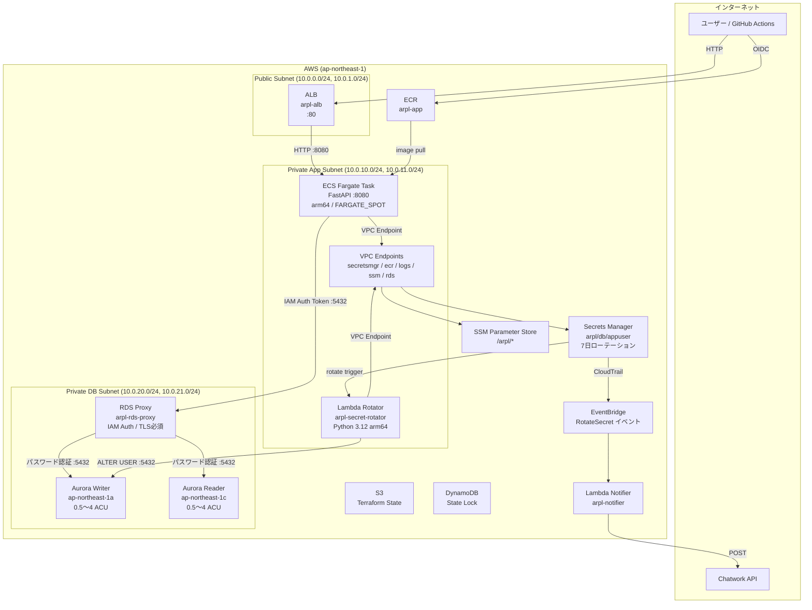
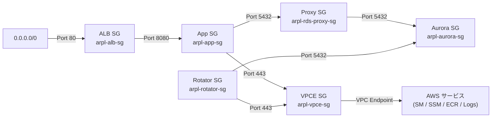
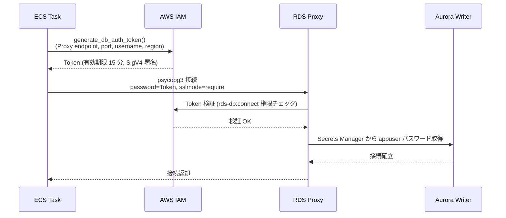
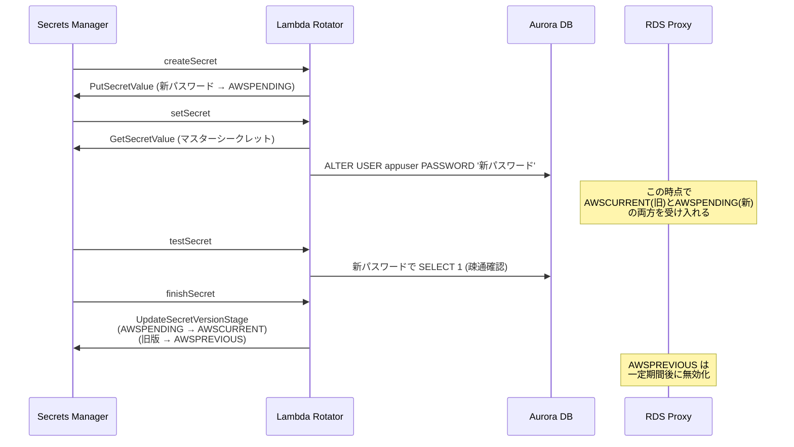
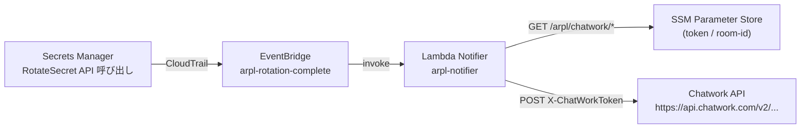
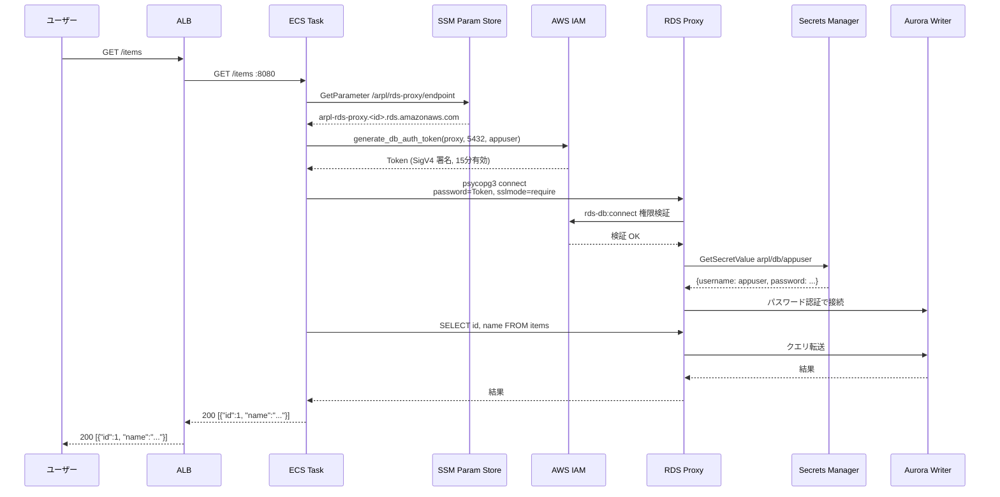
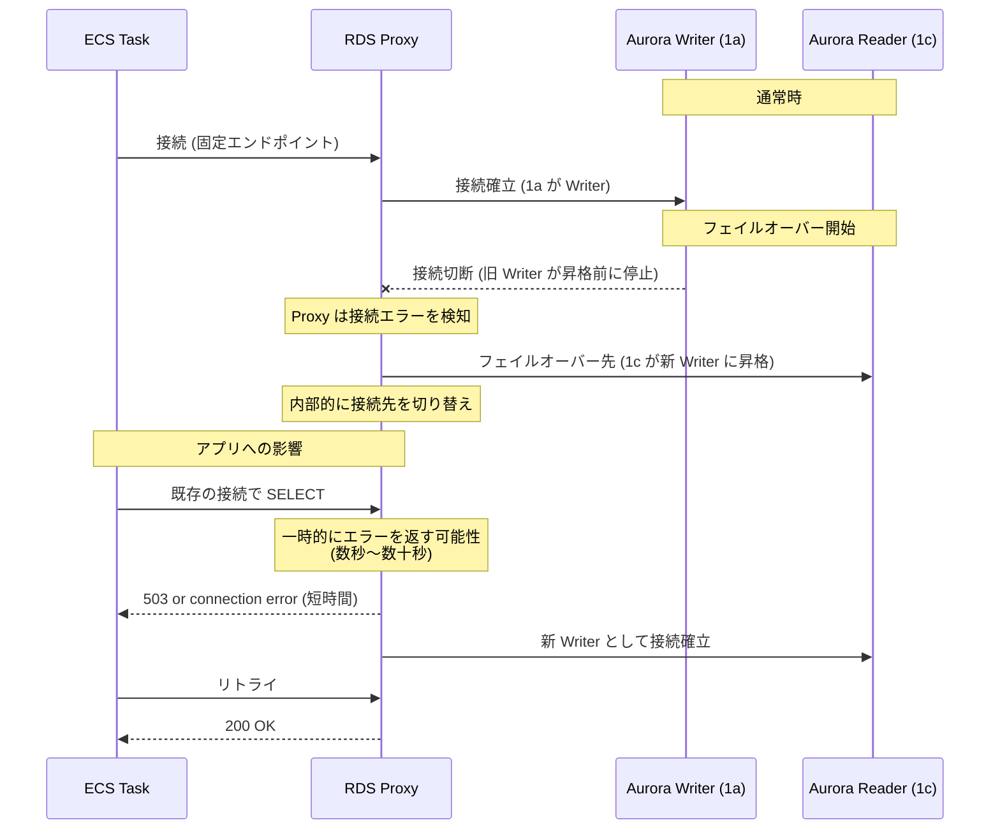

# ARCHITECTURE.md — aurora-rds-proxy-lab

Aurora Serverless v2 + RDS Proxy + Secrets Manager 自動ローテーションの全体設計ドキュメント。
「なぜこの構成なのか」の設計判断と「各コンポーネントがどう連携するか」の動作フローを記述する。

---

## 目次

1. [全体アーキテクチャ](#1-全体アーキテクチャ)
2. [ネットワーク設計](#2-ネットワーク設計)
3. [Aurora Serverless v2](#3-aurora-serverless-v2)
4. [RDS Proxy](#4-rds-proxy)
5. [Secrets Manager ローテーション](#5-secrets-manager-ローテーション)
6. [ECS Fargate アプリケーション](#6-ecs-fargate-アプリケーション)
7. [IAM 設計](#7-iam-設計)
8. [リクエストフロー詳細](#8-リクエストフロー詳細)
9. [フェイルオーバーの動作原理](#9-フェイルオーバーの動作原理)
10. [ローテーションの動作原理](#10-ローテーションの動作原理)
11. [Terraform 構成管理](#11-terraform-構成管理)
12. [コスト設計](#12-コスト設計)
13. [設計上のトレードオフ](#13-設計上のトレードオフ)

---

## 1. 全体アーキテクチャ



---

## 2. ネットワーク設計

### サブネット構成

```
VPC: 10.0.0.0/16 (ap-northeast-1)
│
├── Public Subnet (ALB 専用)
│   ├── 10.0.0.0/24  ap-northeast-1a
│   └── 10.0.1.0/24  ap-northeast-1c
│
├── Private App Subnet (ECS / Lambda)
│   ├── 10.0.10.0/24  ap-northeast-1a
│   └── 10.0.11.0/24  ap-northeast-1c
│
└── Private DB Subnet (Aurora / RDS Proxy)
    ├── 10.0.20.0/24  ap-northeast-1a
    └── 10.0.21.0/24  ap-northeast-1c
```

**3 層に分けた理由**: ALB（パブリック）・アプリ（プライベート）・DB（プライベート）を分離することで、
各層のセキュリティグループルールを最小化できる。DB サブネットはアプリサブネットからしか到達できない。

### セキュリティグループ通信マトリクス



各セキュリティグループの詳細:

| SG 名 | Inbound | Outbound |
|-------|---------|----------|
| `arpl-alb-sg` | 0.0.0.0/0 → :80 | すべて許可 |
| `arpl-app-sg` | ALB SG → :8080 | Proxy SG → :5432 / VPCE SG → :443 |
| `arpl-rds-proxy-sg` | App SG → :5432 | Aurora SG → :5432 |
| `arpl-aurora-sg` | Proxy SG → :5432 / Rotator SG → :5432 | すべて許可 |
| `arpl-vpce-sg` | VPC CIDR → :443 | すべて許可 |
| `arpl-rotator-sg` | なし | Aurora SG → :5432 / VPCE SG → :443 |

### VPC Endpoint 構成（NAT Gateway を使わない理由）

NAT Gateway は ~$65/月 かかる上、すべてのトラフィックがインターネット経由になる。
代わりに VPC Endpoint（Interface）を使うことで、Private Subnet からでも AWS サービスに直接接続できる。

| Endpoint | サービス | 用途 |
|----------|---------|------|
| `secretsmanager` | Secrets Manager | ローテーション Lambda / RDS Proxy |
| `ecr.api` | ECR API | イメージメタデータ取得 |
| `ecr.dkr` | ECR Docker Registry | コンテナイメージ pull |
| `logs` | CloudWatch Logs | ECS / Lambda ログ送信 |
| `ssm` | SSM Parameter Store | Proxy エンドポイント・DB 名取得 |
| `rds` | RDS API | フェイルオーバー API |
| `monitoring` | CloudWatch Metrics | Aurora メトリクス送信 |

S3 への通信（ECR イメージレイヤー）は Gateway Endpoint 経由（無料）で対応。

---

## 3. Aurora Serverless v2

### クラスター構成

```
arpl-aurora-cluster (aurora-postgresql 15.4)
│
├── arpl-aurora-writer  [ap-northeast-1a]  db.serverless  0.5〜4 ACU
│   └── Writer エンドポイント（読み書き両方）
│
└── arpl-aurora-reader  [ap-northeast-1c]  db.serverless  0.5〜4 ACU
    └── Reader エンドポイント（読み取り専用）

Subnet Group: Private DB Subnet (10.0.20.0/24, 10.0.21.0/24)
```

### ACU スケーリングの仕組み

Aurora Serverless v2 は「Provisioned インスタンスのように常駐しながら、負荷に応じて ACU を動的に変更する」モデル。

```
負荷低 ──────── 0.5 ACU (~0.5 GB RAM) ← 最小 (Idle コスト最小化)
               ↕ 数秒以内にスケール
負荷高 ──────── 4 ACU (~8 GB RAM)   ← ハンズオン上限
```

- **v1 との違い**: v1 は Pause/Resume があり再起動に数十秒かかった。v2 はインスタンスが常駐しているため、スケールアップのレイテンシが数秒以下。
- **min_capacity = 0.5** の根拠: dev 環境での Idle 時コストを最小化。本番では 1 ACU 以上を推奨（Cold start レイテンシ対策）。

### カスタムパラメータグループ

```
arpl-aurora-pg15-params (aurora-postgresql15)
├── log_connections = 1          ← 接続ログ（RDS Proxy との接続数確認用）
├── log_disconnections = 1       ← 切断ログ（フェイルオーバー後の再接続確認用）
└── log_min_duration_statement = 1000  ← 1秒以上のスロークエリを記録
```

### 認証情報管理

マスターユーザー (`dbadmin`) のパスワードは `manage_master_user_password = true` により AWS が管理。
Secrets Manager に自動保存され、ローテーション Lambda からのみ参照できる。
Terraform コードにパスワードが現れない設計。

---

## 4. RDS Proxy

RDS Proxy がこのアーキテクチャの中核。3 つの問題を解決する。

### 解決する問題

| 問題 | RDS Proxy の解決策 |
|------|-------------------|
| ECS タスク増減のたびに接続が張り直される | 接続プールを Proxy が管理し、Aurora 側の接続数を抑制 |
| フェイルオーバー時にアプリがエンドポイント変更に対応できない | Proxy エンドポイントが固定のため、アプリは変更不要 |
| パスワードローテーション中の接続断 | Proxy が新旧両パスワードを一時的に受け入れる |

### Proxy の構成詳細

```
arpl-rds-proxy
├── 認証方式: SECRETS (Secrets Manager 連携)
├── IAM 認証: REQUIRED (トークンなしの接続を拒否)
├── TLS: require_tls = true (平文接続を拒否)
└── アイドルタイムアウト: 1800 秒

エンドポイント:
├── Writer:  arpl-rds-proxy.<id>.ap-northeast-1.rds.amazonaws.com:5432
│           → SSM /arpl/rds-proxy/endpoint に保存
└── Reader:  arpl-rds-proxy-reader.<id>.ap-northeast-1.rds.amazonaws.com:5432
            → SSM /arpl/rds-proxy/reader-endpoint に保存
```

### 接続プール設定

```
Target Group:
├── connection_borrow_timeout = 120 秒   ← 接続取得待ちタイムアウト
├── max_connections_percent = 100        ← Aurora max_connections の 100% まで使用
└── max_idle_connections_percent = 50    ← Idle 接続は 50% まで保持（コスト vs 速度）
```

**max_connections_percent = 100 の意味**: Aurora Serverless v2 は ACU に比例して `max_connections` が変動する。
0.5 ACU では約 75 接続、4 ACU では約 600 接続が上限となる。Proxy はこの上限まで接続を張れる。

### IAM 認証トークンのフロー



**なぜトークンを毎回生成するか**: トークンは 15 分で失効するため、新しい接続を開くたびに `generate_db_auth_token()` を呼ぶ。
接続プールの再利用時は既存トークンを使い続けるが、接続が閉じて再オープンするタイミングで再生成される。

---

## 5. Secrets Manager ローテーション

### シークレット構成

```
arpl/db/appuser  (ローテーション対象)
{
  "engine":   "postgres",
  "host":     "<Aurora Writer エンドポイント>",
  "username": "appuser",
  "password": "...",
  "dbname":   "appdb",
  "port":     5432
}
ローテーション間隔: 7 日 (rate(7 days))

マスターシークレット  (AWS 管理 / ローテーション Lambda が参照)
{
  "username": "dbadmin",
  "password": "..."
}
```

### 4 ステップローテーションの詳細



**接続断がない理由の詳細**:
`setSecret` でパスワードを変更してから `finishSecret` で AWSCURRENT が更新されるまでの間、
RDS Proxy は `AWSCURRENT`（旧パスワード）と `AWSPENDING`（新パスワード）の **両方** を試みる。
そのため既存の接続はそのまま維持され、新しい接続は新パスワードで確立される。

### ローテーション Lambda の実装

```
arpl-secret-rotator
├── Runtime: Python 3.12 (arm64)
├── VPC: Private App Subnet (rotator SG)
├── タイムアウト: 60 秒
└── 環境変数:
    ├── MASTER_SECRET_ARN = <Aurora マスターシークレット ARN>
    ├── AURORA_ENDPOINT_PARAM = /arpl/aurora/endpoint
    └── DB_NAME_PARAM = /arpl/rds/db-name
```

**VPC 内に Lambda を置く理由**: Aurora は Private DB Subnet に配置されているため、
外部からは到達できない。Lambda が Aurora に直接 `ALTER USER` を実行するために VPC 内に配置する。
Secrets Manager / SSM への通信は VPC Endpoint 経由。

### 通知フロー（Chatwork）



**Lambda Notifier を VPC 外に置く理由**: Chatwork API はインターネット上のサービスのため、VPC Endpoint では到達できない。
NAT Gateway 廃止の構成では VPC 内 Lambda からはインターネットに出られないため、VPC 外に配置する。

---

## 6. ECS Fargate アプリケーション

### コンテナ構成

```
arpl-cluster
└── arpl-app-service (希望タスク数: 2)
    ├── キャパシティ: FARGATE_SPOT (80%) + FARGATE (20%, base=1)
    └── タスク定義: arpl-app
        ├── CPU: 256 (0.25 vCPU)
        ├── メモリ: 512 MB
        ├── アーキテクチャ: arm64 (Graviton2)
        └── コンテナ:
            ├── イメージ: ECR arpl-app:latest
            ├── ポート: 8080
            └── ログ: /ecs/arpl-app (CloudWatch Logs, 7日保持)
```

**FARGATE_SPOT を使う理由**: 開発環境ではコスト削減が最優先。Spot 中断が発生しても、
最低 1 タスク (FARGATE, base=1) が維持されるため `/health` エンドポイントは生き続ける。

### FastAPI アプリケーション構成

```
app/
├── main.py            ← FastAPI エントリポイント、lifespan でテーブル初期化
├── db/
│   ├── connection.py  ← IAM Auth トークン生成・psycopg3 接続管理
│   └── queries.py     ← CRUD クエリ (ensure_table / list_items / create_item)
└── api/
    ├── health.py      ← GET /health (DB 疎通確認)
    └── items.py       ← GET /items / POST /items
```

### IAM 認証トークン生成の実装

```python
# db/connection.py の要点
def get_connection():
    # SSM から Proxy エンドポイントを取得
    proxy_endpoint = ssm.get_parameter(Name="/arpl/rds-proxy/endpoint")

    # IAM Auth トークン生成 (接続ごとに再生成、有効期限 15 分)
    token = boto3.client("rds").generate_db_auth_token(
        DBHostname=proxy_endpoint,
        Port=5432,
        DBUsername="appuser",
        Region="ap-northeast-1"
    )

    # psycopg3 で接続 (sslmode=require は RDS Proxy 要件)
    return psycopg.connect(
        host=proxy_endpoint,
        port=5432,
        dbname=db_name,
        user="appuser",
        password=token,    # トークンをパスワードとして渡す
        sslmode="require"
    )
```

**設計のポイント**: 接続文字列にパスワードを含めない。環境変数でも Proxy エンドポイントのみを渡し、
認証トークンはコード内でその場で生成する。これによりパスワードが一切コード・設定ファイルに現れない。

### ALB と ECS の接続

```
ALB (arpl-alb)
└── Listener :80 → Target Group arpl-app-tg
    ├── タイプ: IP (Fargate は ENI に直接ルーティング)
    ├── ヘルスチェック: GET /health (30秒間隔 / 5秒タイムアウト)
    └── 登録: ECS サービスが自動登録・解除
```

---

## 7. IAM 設計

### ロール一覧と権限スコープ

```mermaid
graph TD
    subgraph "ECS タスク"
        ExecRole["arpl-ecs-exec-role\n(Task Execution Role)"]
        TaskRole["arpl-ecs-task-role\n(Task Role)"]
    end

    subgraph "Lambda"
        RotRole["arpl-rotator-lambda-role"]
        NotifRole["arpl-notifier-lambda-role"]
    end

    subgraph "RDS"
        ProxyRole["arpl-rds-proxy-role"]
        MonRole["arpl-rds-monitoring-role"]
    end

    subgraph "CI/CD"
        GHRole["arpl-github-actions-role\n(OIDC)"]
    end

    ExecRole -->|AmazonECSTaskExecutionRolePolicy| ECR["ECR pull\nCloudWatch Logs"]
    TaskRole -->|rds-db:connect| ProxyARN["RDS Proxy Resource ID\n(arpl-rds-proxy/*)"]
    TaskRole -->|ssm:GetParameter| SSMArpl["/arpl/* パラメータ"]

    RotRole -->|secretsmanager:Get/Put/Update| AppSecret["arpl/db/appuser"]
    RotRole -->|secretsmanager:GetSecretValue| MasterSecret["マスターシークレット"]
    RotRole -->|ssm:GetParameter| AuroraEndpoint["/arpl/aurora/endpoint\n/arpl/rds/db-name"]

    ProxyRole -->|secretsmanager:GetSecretValue| AllArplSecrets["arpl/* シークレット"]

    NotifRole -->|ssm:GetParameter| ChatworkParams["/arpl/chatwork/*"]

    GHRole -->|ecr:Push| ECRRepo["arpl-app リポジトリ"]
    GHRole -->|ecs:UpdateService| ECSService["arpl-app-service"]
```



### 最小権限設計の徹底点

1. **ECS タスクロールは RDS Proxy の Resource ID を指定**
   - `arn:aws:rds-db:ap-northeast-1:<ACCOUNT_ID>:dbuser:arpl-rds-proxy/*`
   - Proxy ARN ではなく Resource ID を使う（IAM 認証の仕様）

2. **ローテーション Lambda は操作対象シークレットを明示**
   - `arpl/db/appuser` ARN を直接指定。`arpl/*` のようなワイルドカードは使わない

3. **GitHub Actions は iam:PassRole のスコープを限定**
   - ECS Task Execution Role と Task Role の ARN のみ Pass 可能

---

## 8. リクエストフロー詳細

### エンドユーザーのリクエスト (GET /items)



---

## 9. フェイルオーバーの動作原理

### なぜ RDS Proxy でフェイルオーバーが透過されるか



**エンドポイントが変わらない理由**:
アプリが接続するのは `arpl-rds-proxy.<id>.rds.amazonaws.com` という Proxy の固定 DNS 名。
Aurora Writer の IP が変わっても Proxy が内部で吸収するため、アプリはエンドポイントを変更する必要がない。

**完全にエラーがなくならない理由**:
Proxy 自身も Aurora との接続が切れるため、フェイルオーバー中の数秒間は新 Writer への接続が確立するまで
一時的にエラーが発生しうる。RDS Proxy があれば「30〜60 秒のダウン」が「数秒のエラー」に短縮される。

---

## 10. ローテーションの動作原理

### なぜ接続断がないか（タイムライン）

```
T+0s:  Secrets Manager が Lambda Rotator を呼び出す

T+5s:  createSecret
       └─ 新パスワード生成 → AWSPENDING に保存
          (この時点で AWSCURRENT は旧パスワード)

T+15s: setSecret
       └─ Aurora: ALTER USER appuser PASSWORD '新パスワード'
          Aurora は新パスワードのみ受け付けるが...
          RDS Proxy は AWSCURRENT と AWSPENDING を両方試みる
          ┌──────────────────────────────────────────────┐
          │ 既存接続: Proxy が旧パスワード(AWSCURRENT)で  │
          │           接続維持 → アプリへの影響なし       │
          │ 新規接続: Proxy が新パスワード(AWSPENDING)で  │
          │           接続確立                           │
          └──────────────────────────────────────────────┘

T+25s: testSecret
       └─ 新パスワードで SELECT 1 確認

T+35s: finishSecret
       └─ AWSPENDING → AWSCURRENT に昇格
          旧バージョン → AWSPREVIOUS に降格

T+60s: ローテーション完了
       └─ EventBridge → Lambda Notifier → Chatwork 通知
```

---

## 11. Terraform 構成管理

### モジュール構成

```
terraform/
├── bootstrap/                ← Phase 1: State 管理基盤
│   ├── main.tf               ← S3 バケット + DynamoDB テーブル
│   └── outputs.tf
│
├── modules/
│   ├── networking/           ← VPC / Subnet / SG / VPC Endpoint
│   ├── aurora/               ← クラスター / インスタンス / パラメータグループ
│   ├── rds-proxy/            ← Proxy / Target Group / IAM / Reader Endpoint
│   ├── rotation/             ← Secret / Lambda Rotator / EventBridge / Notifier
│   └── ecs-app/              ← ECR / ECS Cluster / Task / Service / ALB / OIDC
│
└── environments/dev/
    ├── main.tf               ← モジュール呼び出し・モジュール間の値渡し
    ├── variables.tf
    ├── outputs.tf            ← alb_dns_name 等
    ├── backend.tf            ← S3 + DynamoDB バックエンド
    └── terraform.tfvars      ← prefix=arpl / region / vpc_cidr のみ
```

### State 管理

```
S3 バケット: arpl-tfstate-<ACCOUNT_ID>
├── バージョニング: 有効
├── 暗号化: SSE-S3 (AES256)
├── パブリックアクセス: 完全ブロック
└── prevent_destroy = true

DynamoDB: arpl-tflock
├── Hash Key: LockID
├── 課金: PAY_PER_REQUEST
└── 用途: 並列 terraform apply を防ぐ排他制御
```

### Apply の依存順序

```
1. bootstrap     ← S3/DynamoDB を先に手動 apply
2. networking    ← VPC/SG/Endpoint
3. aurora        ← DB クラスター (networking に依存)
4. rds-proxy     ← Proxy (aurora に依存)
5. rotation      ← Lambda / Secret (aurora, rds-proxy に依存)
6. ecs-app       ← ECS / ALB (networking, rds-proxy に依存)
```

---

## 12. コスト設計

| リソース | 月額概算 | 備考 |
|---------|---------|------|
| Aurora Serverless v2 | ~$43 | 0.5 ACU × 24h × 30日 × $0.12/ACU-hr |
| RDS Proxy | ~$11 | db.t3.micro 換算 ~$0.015/hr |
| ECS Fargate SPOT (arm64) | ~$5 | 2 タスク × 0.25vCPU × 0.512GB × SPOT 価格 |
| VPC Endpoint (7 本) | ~$50 | Interface Endpoint ~$7.3/本/月 |
| NAT Gateway | $0 | 廃止 (VPC Endpoint に代替) |
| **合計** | **~$109** | |

> **$30 目標との乖離について**: VPC Endpoint 7 本で ~$50 かかるため目標超過。
> セキュリティ（Private Subnet からの外部通信を完全に遮断）を優先したトレードオフ。
> コスト削減する場合は secretsmanager / ecr.api / ecr.dkr の最小 3 本（~$22/月）に絞ることを検討。

---

## 13. 設計上のトレードオフ

| 設計判断 | 採用案 | 却下案 | 理由 |
|---------|-------|-------|------|
| DB 接続認証 | IAM 認証トークン | Secrets Manager パスワード直接 | アプリコードからパスワードを排除。トークンは 15 分で自動失効 |
| ネットワーク出口 | VPC Endpoint のみ | NAT Gateway | NAT は ~$65/月。VPC Endpoint はセキュリティ強化にもなる |
| コンピュート アーキテクチャ | arm64 (Graviton2) | x86_64 | 同スペックで約 20% コスト削減 |
| Aurora バージョン | Serverless v2 | Serverless v1 / Provisioned | v1 は Pause/Resume でコールドスタートが遅い。v2 は常駐しつつ ACU で柔軟にスケール |
| ローテーション方式 | Lambda Rotator (4 step) | 手動ローテーション | 7 日自動ローテーションで人的ミスを排除 |
| ECS 起動タイプ | FARGATE_SPOT + FARGATE 混在 | FARGATE のみ | SPOT は約 70% 安価。base=1 で最低 1 タスクのオンデマンドを保証 |
| Chatwork 通知 Lambda | VPC 外配置 | VPC 内配置 | Chatwork は外部 API のため VPC 内からはアクセス不可（NAT Gateway なし） |

---

## 参考: ADR 一覧

| ADR | タイトル | 主要決定 |
|-----|---------|---------|
| [001](adr/001-aurora-serverless-v2.md) | Aurora Serverless v2 採用 | min_capacity=0.5 ACU で Idle コスト最小化 |
| [002](adr/002-rds-proxy-iam-auth.md) | RDS Proxy IAM 認証 | パスワードレス接続、トークン 15 分有効期限 |
| [003](adr/003-secrets-rotation-strategy.md) | Secrets Manager 自動ローテーション | 7 日 / Lambda 4 ステップ / ゼロダウンタイム |
| [004](adr/004-vpc-endpoint-only.md) | VPC Endpoint のみ（NAT Gateway 廃止） | セキュリティ強化 + ~$65/月 削減 |
