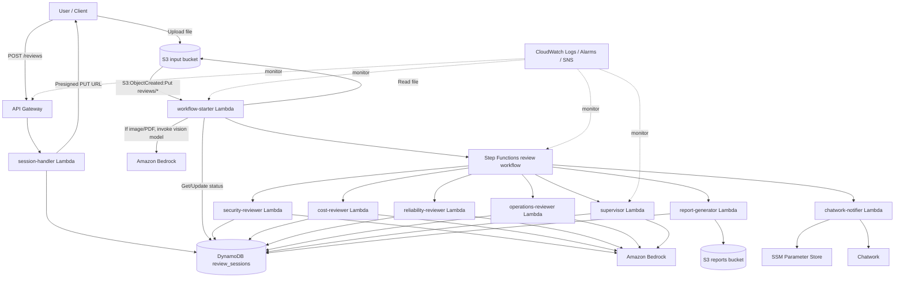
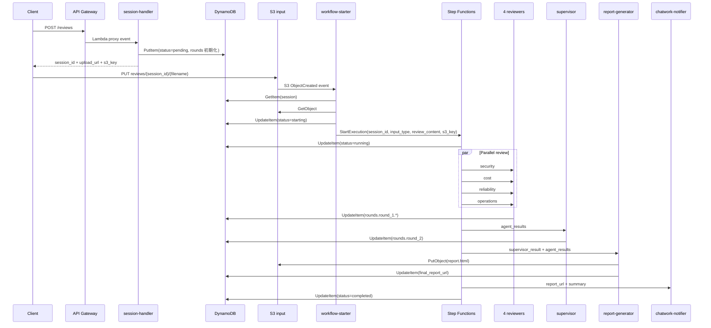
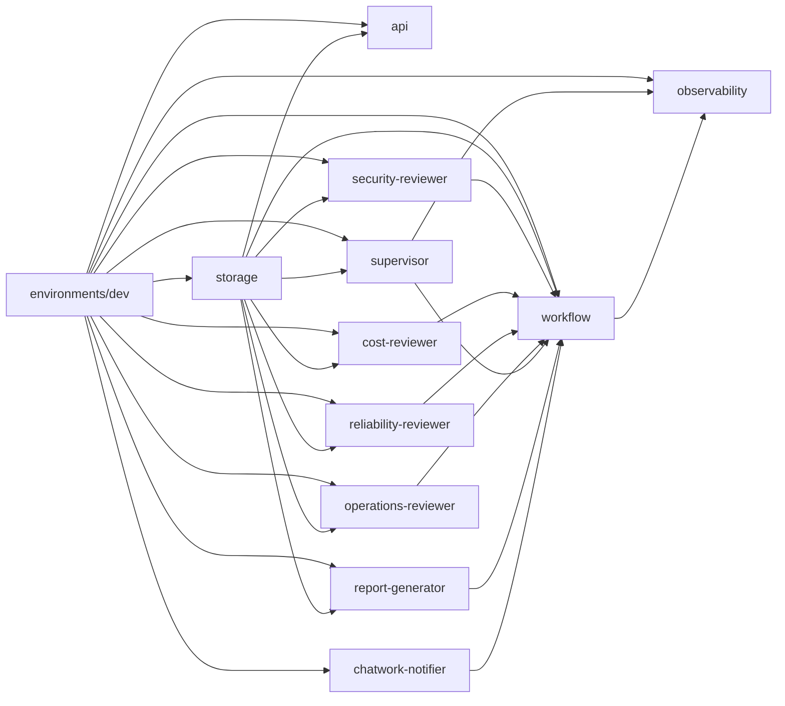
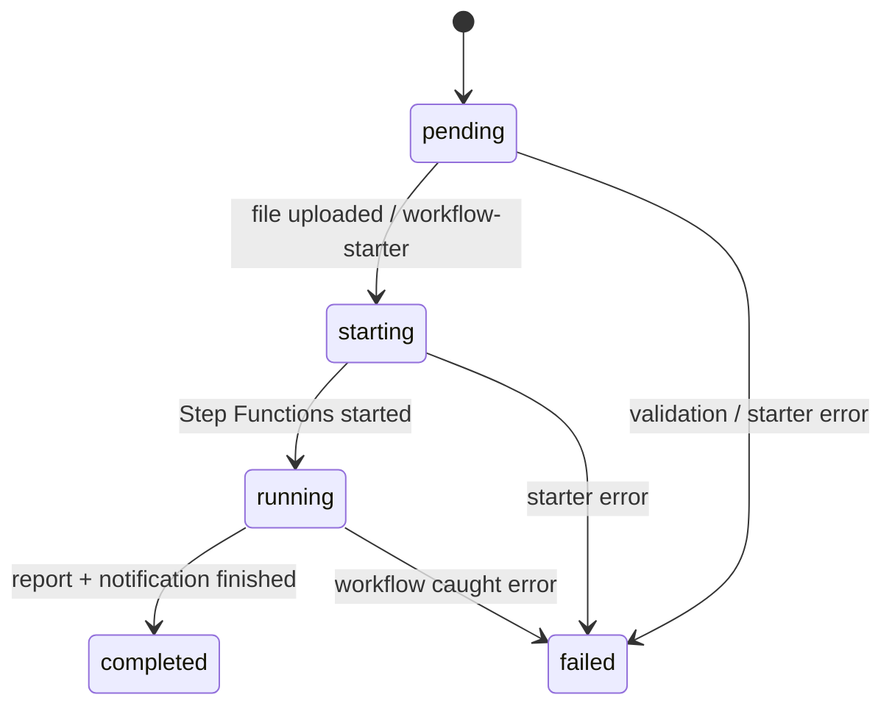

# ARCHITECTURE

## このドキュメントの目的

`aws-infra-review-ai` の全体像を、Terraform 構成・実行フロー・各モジュール責務・データ構造・運用観点まで含めて理解できるように整理したドキュメントです。  
README が「使い方中心」なのに対して、この文書は「どう組み立てられていて、内部で何が起きるか」を説明します。

---

## 1. 一言でいうと

このプロジェクトは、Terraform コードまたは AWS アーキテクチャ図を受け取り、4 つの専門 AI レビュアーが並列で評価し、その結果を supervisor が統合して HTML レポートと通知まで出す、AWS 上のマルチエージェントレビュー基盤です。

中核となる実行経路は次の通りです。

1. API Gateway がレビューセッションを作る
2. クライアントは S3 署名付き URL にファイルをアップロードする
3. S3 PUT をトリガーに `workflow-starter` Lambda が起動する
4. `workflow-starter` が Step Functions を開始する
5. 4 つの reviewer Lambda が並列実行される
6. `supervisor` が結果を統合する
7. `report-generator` が HTML レポートを S3 に保存する
8. `chatwork-notifier` が通知する
9. DynamoDB にレビュー状態と結果が蓄積される

---

## 2. 全体アーキテクチャ



---

## 3. 実行シーケンス

### 3.1 Terraform コードレビュー時



### 3.2 アーキテクチャ図レビュー時の違い

Terraform コードレビューと大枠は同じですが、`workflow-starter` の中で前処理が 1 段増えます。

1. 画像または PDF を S3 から取得
2. Bedrock Vision / Document API で図をテキスト説明に変換
3. reviewer 群にはその説明テキストを渡す

つまり reviewer Lambda は画像ネイティブ対応ではなく、`workflow-starter` が図をテキスト化して吸収しています。

---

## 4. ディレクトリと責務

```text
aws-infra-review-ai/
├── environments/dev/          # dev 環境の組み立て。全 module を配線する
├── modules/storage/           # S3 input, S3 reports, DynamoDB review_sessions
├── modules/api/               # API Gateway + session-handler Lambda
├── modules/workflow/          # S3 trigger + workflow-starter + Step Functions
├── modules/agents/
│   ├── security-reviewer/
│   ├── cost-reviewer/
│   ├── reliability-reviewer/
│   ├── operations-reviewer/
│   └── supervisor/
├── modules/report-generator/  # HTML レポート生成と保存
├── modules/chatwork-notifier/ # Chatwork 通知
├── modules/observability/     # CloudWatch Alarms + SNS
└── .github/workflows/         # GitHub Actions による Terraform CI/CD
```

### 4.1 `environments/dev`

このプロジェクトの composition root です。  
各 module の依存関係をここで接続しています。

主な依存は次の通りです。

- `storage` が最上流
- `api` は input bucket と review table を使う
- 4 reviewer と `supervisor` は review table を使う
- `workflow` は input bucket / review table / 各 Lambda ARN を使う
- `report-generator` は review table と reports bucket を使う
- `chatwork-notifier` は SSM パスと room ID を使う
- `observability` は Step Functions 名と Lambda 名を使う

---

## 5. Terraform モジュール詳細

### 5.1 `modules/storage`

永続化レイヤです。3 つのストアを持ちます。

| リソース | 用途 | 実装上の特徴 |
|---|---|---|
| input S3 bucket | レビュー対象ファイルの受け皿 | SSE-S3、有効な versioning、public access block |
| reports S3 bucket | HTML レポート保存 | SSE-S3、public access block、90 日ライフサイクル削除 |
| DynamoDB `review_sessions` | セッション状態とレビュー結果保存 | PAY_PER_REQUEST、PITR、TTL 365 日 |

この module が「ファイルの置き場」と「レビュー状態の正本」を提供しています。

### 5.2 `modules/api`

レビュー受付の公開 API です。

提供エンドポイント:

- `POST /reviews`
- `GET /reviews/{session_id}`

中では `session-handler` Lambda を Lambda proxy 統合で呼び出します。

`POST /reviews` の責務:

- `session_id` を発行
- `reviews/{session_id}/{filename}` 形式の S3 key を決める
- DynamoDB に `pending` 状態の初期レコードを作る
- S3 presigned PUT URL を返す

`GET /reviews/{session_id}` の責務:

- DynamoDB から現在状態を取得
- `completed` の場合のみスコア、summary、priority actions、report URL を返す

### 5.3 `modules/workflow`

イベント駆動の中核です。

構成要素:

- `workflow-starter` Lambda
- S3 bucket notification
- Step Functions state machine

`workflow-starter` の責務:

- S3 PUT イベントを受ける
- session を取得して重複起動を防ぐ
- ファイルを読み込む
- テキストならそのまま使う
- 画像/PDF なら Bedrock で説明文に変換する
- `starting` に更新してから Step Functions を起動する

Step Functions の責務:

- `running` へ遷移
- 4 reviewer を並列実行
- `supervisor` へ統合
- `report-generator` へ HTML 生成
- `chatwork-notifier` へ通知
- 最後に `completed` へ更新
- エラー時は `failed`

### 5.4 `modules/agents/*-reviewer`

4 reviewer は構造がほぼ共通です。

共通パターン:

- Lambda runtime は Python 3.12
- Bedrock `InvokeModel` 権限のみ付与
- review table に `rounds.round_1.<agent>` を保存
- Step Functions の payload に返す結果は findings を severity 順で最大 10 件に絞る

役割の違い:

| エージェント | 主観点 |
|---|---|
| `security-reviewer` | IAM 最小権限、暗号化、公開露出、Secrets |
| `cost-reviewer` | 過剰スペック、NAT Gateway、不要リソース、転送料 |
| `reliability-reviewer` | Multi-AZ、バックアップ、RPO/RTO、オートスケーリング |
| `operations-reviewer` | タグ、監視、ログ、デプロイ戦略、ドリフト検知 |

### 5.5 `modules/agents/supervisor`

4 reviewer のメタ審査役です。

担当:

- エージェント間のトレードオフ整理
- 優先対応アクション TOP 10 の抽出
- 加重平均での総合スコア作成
- エグゼクティブサマリー作成
- `rounds.round_2` への保存

重みは実装上こう定義されています。

- security: 35%
- cost: 20%
- reliability: 30%
- operations: 15%

### 5.6 `modules/report-generator`

レビュー結果の可視化担当です。

担当:

- HTML を 1 枚生成
- `reports/{session_id}/report.html` に保存
- 7 日有効の presigned GET URL を発行
- DynamoDB の `final_report_url` を更新

レポート内容:

- 総合スコア
- エージェント別スコア
- エグゼクティブサマリー
- 優先対応アクション
- トレードオフ
- エージェント別 findings 詳細

### 5.7 `modules/chatwork-notifier`

通知担当です。

担当:

- SSM Parameter Store から Chatwork token を取得
- supervisor の結果を Chatwork 記法に整形
- TOP 5 アクションとレポート URL を送る

重要な設計:

- 失敗してもワークフローを止めない
- `CHATWORK_ROOM_ID` 未設定時は `skipped`

### 5.8 `modules/observability`

最小限の異常検知を追加します。

作成するアラーム:

- Step Functions `ExecutionsFailed`
- Step Functions `ExecutionsTimedOut`
- `workflow-starter` Lambda Errors
- `supervisor` Lambda Errors

通知先は SNS トピックで、`alarm_email` がある場合のみ Email subscription も作成されます。

---

## 6. モジュール依存関係



読み方としては、`environments/dev` が全部を呼び出し、その中で `storage` が shared dependency として多くの module に渡される構造です。

---

## 7. セッションデータモデル

このシステムの状態管理は DynamoDB 1 テーブル中心です。

### 7.1 レコードイメージ

```json
{
  "session_id": "uuid",
  "input_type": "terraform",
  "created_at": "2026-05-06T12:34:56+00:00",
  "status": "completed",
  "s3_key": "reviews/uuid/main.tf",
  "rounds": {
    "round_1": {
      "security": { "findings": [], "score": 72, "summary": "..." },
      "cost": { "findings": [], "score": 85, "summary": "..." },
      "reliability": { "findings": [], "score": 60, "summary": "..." },
      "operations": { "findings": [], "score": 78, "summary": "..." }
    },
    "round_2": {
      "tradeoffs": [],
      "priority_actions": [],
      "overall_score": {
        "security": 72,
        "cost": 85,
        "reliability": 60,
        "operations": 78,
        "total": 72
      },
      "executive_summary": "..."
    }
  },
  "final_report_url": "https://...",
  "expires_at": 1790000000
}
```

### 7.2 ステータス遷移



状態の意味:

- `pending`: セッション作成済み、まだファイル未処理
- `starting`: `workflow-starter` が起動処理中
- `running`: Step Functions の主処理実行中
- `completed`: レポート作成まで完了
- `failed`: どこかで処理失敗

---

## 8. 各 Lambda の入出力

### 8.1 `session-handler`

入力:

- API Gateway proxy event

出力:

- `POST /reviews`: `session_id`, `upload_url`, `s3_key`, `status`
- `GET /reviews/{id}`: `status` と、完了時は `scores`, `executive_summary`, `priority_actions`, `final_report_url`

### 8.2 `workflow-starter`

入力:

- S3 `ObjectCreated:Put`

出力:

- Step Functions 実行入力:

```json
{
  "session_id": "uuid",
  "s3_key": "reviews/uuid/file.tf",
  "input_type": "terraform",
  "review_content": "..."
}
```

### 8.3 reviewer 4 種

入力:

```json
{
  "session_id": "uuid",
  "review_content": "...",
  "input_type": "terraform"
}
```

出力:

```json
{
  "agent": "security",
  "findings": [
    {
      "severity": "HIGH",
      "resource": "aws_iam_role.example",
      "issue": "...",
      "recommendation": "..."
    }
  ],
  "score": 72,
  "summary": "..."
}
```

### 8.4 `supervisor`

入力:

- 元の `review_content`
- 4 reviewer の `agent_results`

出力:

- `tradeoffs`
- `priority_actions`
- `overall_score`
- `executive_summary`

### 8.5 `report-generator`

入力:

- `session_id`
- `s3_key`
- `agent_results`
- `supervisor_result`

出力:

```json
{
  "report_url": "https://...",
  "report_s3_key": "reports/{session_id}/report.html"
}
```

### 8.6 `chatwork-notifier`

入力:

- `supervisor_result`
- `report_url`

出力:

- `sent`
- `skipped`
- `error`

---

## 9. Bedrock の使い方

このプロジェクトでは Bedrock を 2 系統で使っています。

### 9.1 reviewer / supervisor 用

用途:

- Terraform やアーキテクチャ説明文のレビュー
- JSON 形式の finding / score / summary を返す

特徴:

- reviewer ごとに専門プロンプトが分かれている
- supervisor は reviewer 結果を統合する別プロンプトを持つ

### 9.2 画像・PDF 前処理用

用途:

- アーキテクチャ図を説明テキストへ変換

特徴:

- 実行場所は `workflow-starter`
- 後段 reviewer は画像を意識しない
- 「図にないものは推測せず、図に記載なしと書く」という制約がある

この分離により、reviewer 群は「常にテキスト入力を受ける」シンプルな設計になっています。

---

## 10. セキュリティ設計

実装から読み取れる主な方針は次の通りです。

- Lambda IAM は役割ごとに分離
- Bedrock 権限は `InvokeModel` に限定
- S3 は public access block を有効化
- S3 は SSE-S3 で暗号化
- DynamoDB は SSE と PITR を有効化
- Chatwork token は環境変数に直書きせず SSM SecureString に保存
- GitHub Actions はアクセスキーではなく OIDC を使う

一方で、公開 API の認証は現在 `NONE` です。README にも学習用途前提の記述があり、本番利用では次の追加が必要です。

- Cognito または API Key / WAF の導入
- CORS 制限
- rate limiting / abuse 対策

---

## 11. 可観測性と運用

ログ:

- 各 Lambda は CloudWatch Logs に出力
- API Gateway もアクセスログを出力
- Step Functions は ERROR レベルで実行ログを CloudWatch Logs に出力
- API Gateway / Step Functions は X-Ray を有効化

アラーム:

- ワークフロー失敗
- ワークフロータイムアウト
- `workflow-starter` エラー
- `supervisor` エラー

運用上の意図:

- 「入口で起きた失敗」と「レビュー統合で起きた失敗」を最低限切り分けられる
- 通知失敗はレビュー失敗と切り分け、業務影響を限定する

---

## 12. GitHub Actions とデプロイモデル

`.github/workflows/terraform.yml` は OIDC 前提です。

PR 時:

- `terraform init`
- `terraform fmt -check`
- `terraform validate`
- `terraform plan`
- PR コメントに plan 結果を投稿

`main` push 時:

- plan 後に artifact 化した `tfplan` を使って apply

アーキテクチャとして重要なのは、ローカル開発と CI/CD で同じ Terraform 構造を使いながら、認証だけを OIDC に寄せている点です。

---

## 13. 実装上の設計判断

### 13.1 なぜファイルを API 経由で直接送らないのか

理由:

- Lambda ペイロード制限回避
- 大きめのファイルを安全に受け渡しできる
- upload 権限を時間制限付き URL で限定できる

### 13.2 なぜ Step Functions を使うのか

理由:

- 4 reviewer の並列実行が自然に表現できる
- supervisor や report-generation を後段に明確に接続できる
- 失敗時の状態管理をワークフローとして可視化しやすい

### 13.3 なぜ DynamoDB 1 テーブル中心なのか

理由:

- セッション単位アクセスが中心で PK だけで十分
- reviewer 結果を 1 レコードに集約しやすい
- Step Functions / API / Lambda 間で単純な共有状態を作れる

### 13.4 なぜ画像レビューを別 reviewer にしないのか

理由:

- Vision 前処理を `workflow-starter` で一元化できる
- reviewer の実装をテキスト専用で揃えられる
- プロンプト設計を reviewer の専門性に集中できる

---

## 14. 現在の制約と理解しておくべき点

実装を読む限り、現時点で把握しておくとよい制約は次の通りです。

- API は認証なし
- reviewer 結果は Step Functions ペイロード上限を意識して findings 最大 10 件に絞っている
- テキストレビュー入力は `workflow-starter` で 100KB までに制限している
- 画像/PDF は 3MB 制限
- Chatwork 通知は任意機能で、失敗しても completed 扱い
- Step Functions のログレベルは `ERROR` のみ

このため、「軽量で学習しやすい構成」を優先しつつ、本番運用向けの強化余地も残している構成といえます。

---

## 15. このプロジェクトを理解する最短ルート

はじめて読むなら、次の順で追うと理解しやすいです。

1. [`environments/dev/main.tf`](/home/takuya/terraform-lab/aws-infra-review-ai/environments/dev/main.tf)
2. [`modules/api/src/index.py`](/home/takuya/terraform-lab/aws-infra-review-ai/modules/api/src/index.py)
3. [`modules/workflow/main.tf`](/home/takuya/terraform-lab/aws-infra-review-ai/modules/workflow/main.tf)
4. [`modules/workflow/src/index.py`](/home/takuya/terraform-lab/aws-infra-review-ai/modules/workflow/src/index.py)
5. reviewer いずれか 1 つと [`modules/agents/supervisor/src/index.py`](/home/takuya/terraform-lab/aws-infra-review-ai/modules/agents/supervisor/src/index.py)
6. [`modules/report-generator/src/index.py`](/home/takuya/terraform-lab/aws-infra-review-ai/modules/report-generator/src/index.py)

この順だと、「入口 → 起動 → 並列処理 → 統合 → 出力」が自然につながります。

---

## 16. まとめ

このシステムの本質は、単なる Bedrock 呼び出し集ではなく、以下を Terraform で一体化している点にあります。

- セッション管理
- 非同期ファイル投入
- イベント駆動ワークフロー
- 並列専門レビュー
- 統合判断
- HTML レポート化
- 通知
- 監視

つまり `aws-infra-review-ai` は、AI レビューそのものよりも、「AI レビューを運用可能な AWS システムとしてどう成立させるか」を学べる構成になっています。
