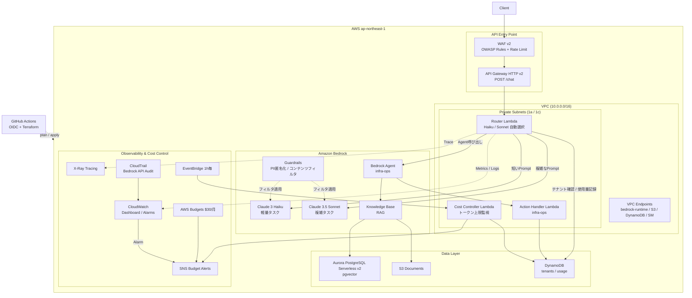

# AWS Bedrock AI Platform Sandbox

エンタープライズ相当のAI基盤をAWS個人環境で再現するTerraformプロジェクト。
マルチテナント・セキュア・可観測・コスト制御を全て実装する。

## このハンズオンで得られること

- **AWS上でAI基盤を組み立てる実践力**
  - Bedrock、API Gateway、Lambda、Aurora、S3を組み合わせた構成を一通り体験できる
- **Terraformで再現性高く構築する力**
  - 手動作業に頼らず、インフラをコードで安全に管理する流れを学べる
- **エンタープライズ設計の勘所**
  - マルチテナント、WAF、OIDC、監視、予算管理まで含めた設計判断を追体験できる
- **個人環境でのコスト最適化の考え方**
  - 月額制約の中で、どこにコストをかけてどこを削るかの実践感覚が身につく

## 目的と価値

**大企業のAIチームがやるような設計を、個人の$30/月で全部自分で作って、技術記事にする。**

### 技術的な価値

- **本番さながらの設計を個人で体験**できる
  - マルチテナント（テナントごとのトークン上限管理）
  - WAF付きAPI Gateway → LambdaルーターでモデルをHaiku/Sonnetに動的振り分け
  - RAG基盤（S3 + Aurora pgvector）でナレッジベース構築
  - X-Ray + CloudWatchで完全な可観測性
  - OIDC認証のCI/CD（アクセスキー不使用）
- **全部Terraformで管理** → 再現性100%、手動操作ゼロ

### コスト的な価値

- 月$30という制約の中でエンプラ設計を実現 → **コスト最適化の実践知識**が身につく

---

## 技術スタック

| カテゴリ | 採用技術 |
|---------|---------|
| IaC | Terraform >= 1.5.0 / AWS Provider ~> 5.0 |
| クラウド | AWS ap-northeast-1 |
| AI基盤 | Amazon Bedrock（Claude 3 Haiku / Sonnet） |
| 認証 | OIDC（アクセスキー禁止） |
| CI/CD | GitHub Actions |
| 言語 | Python 3.12（Lambda） |

---

## アーキテクチャ構成図



---

## ハンズオン実行手順

> **所要時間**: 初回デプロイまで約30分、全動作確認まで約60分
>
> **コスト目安**: デプロイ〜確認〜destroyで$2〜5程度（Aurora・VPC Endpointの時間課金）

---

### 前提条件

以下のツールとAWS環境が必要です。実行前に全て確認してください。

#### ツール確認

```bash
# Terraform（1.5.0 以上）
terraform version
# → Terraform v1.9.x などが表示されればOK

# AWS CLI（v2）
aws --version
# → aws-cli/2.x.x などが表示されればOK

# jq（JSONパース用）
jq --version
# → jq-1.x などが表示されればOK

# Python（Lambda動作確認用）
python3 --version
# → Python 3.12.x などが表示されればOK
```

インストールされていない場合:

```bash
# Terraform (公式: https://developer.hashicorp.com/terraform/install)
# macOS
brew tap hashicorp/tap && brew install hashicorp/tap/terraform

# AWS CLI v2 (公式: https://docs.aws.amazon.com/cli/latest/userguide/install-cliv2.html)
# Linux
curl "https://awscli.amazonaws.com/awscli-exe-linux-x86_64.zip" -o awscliv2.zip
unzip awscliv2.zip && sudo ./aws/install

# jq
# macOS: brew install jq
# Ubuntu: sudo apt-get install jq
```

#### AWS環境確認

```bash
# AWSの認証情報が正しく設定されているか確認
aws sts get-caller-identity
# → Account, Arn, UserId が表示されればOK

# 例: 以下のような出力が期待される
# {
#   "UserId": "AIDA...",
#   "Account": "123456789012",
#   "Arn": "arn:aws:iam::123456789012:user/your-name"
# }
```

> AWS CLI の認証情報が未設定の場合は `aws configure` を実行してください。

#### 必要なIAM権限

このプロジェクトをデプロイするIAMユーザー/ロールには以下の権限が必要です。

| AWSサービス | 必要な操作 |
|-----------|---------|
| EC2 / VPC | Full |
| Lambda | Full |
| IAM | CreateRole, AttachPolicy, PassRole |
| Bedrock | Full（Guardrails, Knowledge Base, Agent含む） |
| DynamoDB | Full |
| S3 | Full |
| API Gateway v2 | Full |
| WAF v2 | Full |
| CloudWatch | Full |
| CloudTrail | Full |
| SNS | Full |
| EventBridge | Full |
| Budgets | Full |
| RDS / Aurora | Full |
| Secrets Manager | Full |
| X-Ray | Full |

---

### Step 0: Bedrockモデルアクセスの有効化

**このステップを省略するとterraform applyが失敗します。** AWSコンソールから事前にモデルアクセスを有効化してください。

1. AWSコンソールにログイン
2. リージョンを **ap-northeast-1（東京）** に変更
3. `Amazon Bedrock` → `Model access` に移動
4. 以下のモデルにチェックを入れて「Request model access」をクリック

| モデル名 | 用途 |
|---------|------|
| Claude 3 Haiku | 軽量タスク用ルーター |
| Claude 3.5 Sonnet v2 | 複雑タスク・Agentモデル |
| Titan Text Embeddings V2 | Knowledge Base埋め込みモデル |

> アクセス承認は通常即時〜数分で完了します。「Access status」が「Access granted」になったことを確認してから次のステップに進んでください。

---

### Step 1: リポジトリのセットアップ

```bash
# リポジトリのクローン
git clone <your-repo-url>
cd bedrock-ai-platform-sandbox

# ディレクトリ構成の確認
ls -la
# → CLAUDE.md, README.md, environments/, modules/ が見えればOK
```

---

### Step 2: Terraform Stateバックエンドの作成

`backend.tf` が参照するS3バケットとDynamoDBテーブルは **Terraformより先に手動で作成** する必要があります。

```bash
# ── S3バケット作成 ──────────────────────────────────────────────

aws s3api create-bucket \
  --bucket tfstate-bedrock-ai-platform-sandbox \
  --region ap-northeast-1 \
  --create-bucket-configuration LocationConstraint=ap-northeast-1

# バージョニング有効化（誤操作からの復旧のため）
aws s3api put-bucket-versioning \
  --bucket tfstate-bedrock-ai-platform-sandbox \
  --versioning-configuration Status=Enabled

# サーバーサイド暗号化
aws s3api put-bucket-encryption \
  --bucket tfstate-bedrock-ai-platform-sandbox \
  --server-side-encryption-configuration \
  '{"Rules":[{"ApplyServerSideEncryptionByDefault":{"SSEAlgorithm":"AES256"}}]}'

# パブリックアクセスブロック
aws s3api put-public-access-block \
  --bucket tfstate-bedrock-ai-platform-sandbox \
  --public-access-block-configuration \
  "BlockPublicAcls=true,IgnorePublicAcls=true,BlockPublicPolicy=true,RestrictPublicBuckets=true"

# ── DynamoDBテーブル作成（ステートロック用）───────────────────

aws dynamodb create-table \
  --table-name tfstate-lock-bedrock-ai-platform \
  --attribute-definitions AttributeName=LockID,AttributeType=S \
  --key-schema AttributeName=LockID,KeyType=HASH \
  --billing-mode PAY_PER_REQUEST \
  --region ap-northeast-1

# 作成完了を確認
aws dynamodb describe-table \
  --table-name tfstate-lock-bedrock-ai-platform \
  --query "Table.TableStatus" \
  --region ap-northeast-1
# → "ACTIVE" が表示されればOK
```

---

### Step 3: 設定ファイルの編集

`environments/dev/terraform.tfvars` の `owner` を自分の名前（英数字・ハイフン）に変更します。

```bash
# 現在の設定を確認
cat environments/dev/terraform.tfvars
```

```hcl
# environments/dev/terraform.tfvars
aws_region  = "ap-northeast-1"
project     = "bedrock-ai-platform-sandbox"
environment = "dev"
owner       = "your-name"   # ← ここを変更（GitHubユーザー名など）
vpc_cidr    = "10.0.0.0/16"
```

> `owner` は全リソースの `Owner` タグに使われます。設定しないと `terraform plan` 時にエラーになります。

---

### Step 4: Terraform 初期化

```bash
cd environments/dev

# バックエンド初期化（S3/DynamoDBへの接続確認も兼ねる）
terraform init

# 期待する出力:
# Terraform has been successfully initialized!
# Backend "s3" 等のメッセージが出ればOK
```

> `Error: Failed to get existing workspaces` 等が出た場合はStep2のバックエンド作成が完了していません。

---

### Step 5: Plan（変更内容の確認）

```bash
terraform plan
```

初回実行では **150〜200リソース**の作成が表示されます。主要なリソースが含まれているか確認してください。

```
# planに含まれているか確認するリソース例
Plan: 150〜200 to add, 0 to change, 0 to destroy.

aws_vpc.main
aws_subnet.private[*]
aws_bedrock_guardrail.platform
aws_bedrockagent_knowledge_base.main
aws_rds_cluster.aurora
aws_lambda_function.router
aws_apigatewayv2_api.main
aws_wafv2_web_acl.main
aws_bedrockagent_agent.infra_ops
aws_cloudwatch_dashboard.main
...
```

> 不明なリソースが削除される予定になっている場合は apply を中止して確認してください。

---

### Step 6: Apply（デプロイ実行）

```bash
terraform apply
```

確認プロンプトに `yes` と入力します。

```
Do you want to perform these actions?
  Terraform will perform the actions described above.
  Only 'yes' will be accepted to approve.

  Enter a value: yes   ← ここに入力
```

#### 完了までの目安

| フェーズ | 所要時間 | 主なリソース |
|---------|---------|-----------|
| ネットワーク | 〜2分 | VPC, Subnet, NAT GW, VPC Endpoints |
| セキュリティ基盤 | 〜1分 | IAM, Guardrail, CloudTrail |
| Aurora 起動 | **5〜10分** | RDS Cluster, Instance |
| pgvectorスキーマ初期化 | 〜2分 | terraform_data (RDS Data API) |
| Lambda + API GW | 〜2分 | Lambda, API Gateway, WAF |
| Bedrock Agent | 〜3分 | Agent, Action Group, KB Association |
| 合計 | **約15〜20分** | |

> Aurora のみ起動が遅いです。`module.knowledge_base.aws_rds_cluster_instance.aurora` が完了するまで待ちます。

apply完了後、以降の手順で使う出力値を変数に格納します。

```bash
# 全出力値を確認
terraform output

# よく使う値を変数に入れておく（以降のStepで使用）
export CHAT_ENDPOINT=$(terraform output -raw chat_endpoint)
export KB_ID=$(terraform output -raw knowledge_base_id)
export KB_BUCKET=$(terraform output -raw kb_documents_bucket)
export AGENT_ID=$(terraform output -raw bedrock_agent_id)
export ROUTER_NAME=$(terraform output -raw router_lambda_name)
export COST_LAMBDA=$(terraform output -raw cost_controller_lambda_name)
export TENANT_TABLE=$(terraform output -raw tenant_table_name)
export USAGE_TABLE=$(terraform output -raw usage_table_name)
export DASHBOARD=$(terraform output -raw cloudwatch_dashboard_name)

# 確認
echo "Chat endpoint: $CHAT_ENDPOINT"
echo "Agent ID: $AGENT_ID"
echo "Dashboard: $DASHBOARD"
```

---

### Step 7: APIエンドポイントの動作確認

#### 7-1. ヘルスチェック（疎通確認）

```bash
curl -s -X POST "$CHAT_ENDPOINT" \
  -H "Content-Type: application/json" \
  -d '{"tenant_id":"default","prompt":"Hello"}' | jq .
```

期待するレスポンス:

```json
{
  "response": "Hello! How can I assist you today?",
  "model_used": "anthropic.claude-3-haiku-20240307-v1:0",
  "tenant_id": "default",
  "input_tokens": 10,
  "output_tokens": 15
}
```

#### 7-2. モデル自動選択の確認（Haiku → Sonnet ルーティング）

**シンプルなプロンプト → Haikuが選択される**:

```bash
curl -s -X POST "$CHAT_ENDPOINT" \
  -H "Content-Type: application/json" \
  -d '{"tenant_id":"default","prompt":"今日の天気は？"}' | jq .model_used

# 期待: "anthropic.claude-3-haiku-20240307-v1:0"
```

**複雑なプロンプト → Sonnetが選択される**:

```bash
curl -s -X POST "$CHAT_ENDPOINT" \
  -H "Content-Type: application/json" \
  -d '{"tenant_id":"default","prompt":"pgvector と OpenSearch Serverless のアーキテクチャ上のトレードオフを詳しく analyze して比較してください。"}' \
  | jq .model_used

# 期待: "anthropic.claude-3-5-sonnet-20241022-v2:0"
```

**複雑キーワードのみでもSonnet選択**:

```bash
curl -s -X POST "$CHAT_ENDPOINT" \
  -H "Content-Type: application/json" \
  -d '{"tenant_id":"default","prompt":"Terraformのベストプラクティスをexplainしてください"}' \
  | jq .model_used

# 期待: "anthropic.claude-3-5-sonnet-..." （"explain"がトリガー）
```

#### 7-3. テナント管理の確認

**存在しないテナント → 404エラー**:

```bash
curl -s -X POST "$CHAT_ENDPOINT" \
  -H "Content-Type: application/json" \
  -d '{"tenant_id":"nonexistent","prompt":"Hello"}' | jq .

# 期待:
# {
#   "error": "Tenant not found",
#   "statusCode": 404
# }
```

**x-tenant-idヘッダーでのテナント指定**:

```bash
curl -s -X POST "$CHAT_ENDPOINT" \
  -H "Content-Type: application/json" \
  -H "x-tenant-id: tenant-premium" \
  -d '{"prompt":"Hello"}' | jq .model_used

# 期待: Sonnet（tenant-premiumはpreferred_model=Sonnetで固定）
```

**DynamoDBの使用量記録を確認**:

```bash
# 今日の日付を取得
TODAY=$(date +%Y%m%d)

# 使用量テーブルを確認
aws dynamodb get-item \
  --table-name "$USAGE_TABLE" \
  --key "{\"tenant_id\":{\"S\":\"default\"},\"date\":{\"S\":\"$TODAY\"}}" \
  --region ap-northeast-1 | jq .

# 期待: total_tokens, input_tokens, output_tokens が加算されている
```

#### 7-4. WAFレートリミットの確認（任意）

```bash
# 短時間に大量リクエストを送信（1001リクエスト/5分超でブロックされることを確認）
# ※ 実際には下記を繰り返すと WAF が 403 を返す
for i in $(seq 1 5); do
  curl -s -o /dev/null -w "%{http_code}\n" \
    -X POST "$CHAT_ENDPOINT" \
    -H "Content-Type: application/json" \
    -d '{"prompt":"test"}'
done
# → 通常は 200 が返る（レートリミット超過時は 403）
```

---

### Step 8: Knowledge Baseの同期と確認

#### 8-1. ドキュメントのアップロード

```bash
# テスト用ドキュメントを作成してアップロード
mkdir -p /tmp/kb-docs

cat > /tmp/kb-docs/infra-overview.txt << 'EOF'
# インフラ概要

このシステムはAWS Bedrockを使用したマルチテナントAI基盤です。
VPC内のPrivate SubnetにLambdaを配置し、VPC Endpoint経由でBedrockにアクセスします。
コスト最適化のため、シンプルなタスクにはClaude Haiku、複雑なタスクにはClaude Sonnetを使用します。
EOF

cat > /tmp/kb-docs/cost-guide.txt << 'EOF'
# コスト管理ガイド

月次予算は$30に設定されています。
Aurora Serverless v2は最小0.5 ACUで稼働し、アイドル時はほぼ課金停止されます。
NAT Gatewayは1つのみ（コスト最適化）。
Interface VPC Endpointが最大のコスト要因（月約$14）です。
EOF

# S3にアップロード
aws s3 cp /tmp/kb-docs/ s3://${KB_BUCKET}/docs/ --recursive

# アップロード確認
aws s3 ls s3://${KB_BUCKET}/docs/
```

#### 8-2. Ingestion Job（同期）の実行

```bash
# Data Source IDを取得
DATA_SOURCE_ID=$(aws bedrock-agent list-data-sources \
  --knowledge-base-id $KB_ID \
  --query "dataSourceSummaries[0].dataSourceId" \
  --output text \
  --region ap-northeast-1)

echo "Data Source ID: $DATA_SOURCE_ID"

# Ingestion Jobを開始
JOB_ID=$(aws bedrock-agent start-ingestion-job \
  --knowledge-base-id $KB_ID \
  --data-source-id $DATA_SOURCE_ID \
  --region ap-northeast-1 \
  --query "ingestionJob.ingestionJobId" \
  --output text)

echo "Job ID: $JOB_ID"
```

#### 8-3. 同期完了の待機

```bash
# 完了するまでポーリング（通常1〜3分）
while true; do
  STATUS=$(aws bedrock-agent get-ingestion-job \
    --knowledge-base-id $KB_ID \
    --data-source-id $DATA_SOURCE_ID \
    --ingestion-job-id $JOB_ID \
    --region ap-northeast-1 \
    --query "ingestionJob.status" \
    --output text)
  echo "$(date): $STATUS"
  if [ "$STATUS" = "COMPLETE" ]; then break; fi
  if [ "$STATUS" = "FAILED" ]; then
    echo "Ingestion failed. Check the job details."
    break
  fi
  sleep 15
done
```

---

### Step 9: Bedrock Agentの動作確認

```bash
# ── インフラ状態確認（Action Group: getInfrastructureStatus）──

aws bedrock-agent-runtime invoke-agent \
  --agent-id $AGENT_ID \
  --agent-alias-id TSTALIASID \
  --session-id "test-session-$(date +%s)" \
  --input-text "現在のインフラコンポーネントの稼働状況を教えてください" \
  --region ap-northeast-1 \
  --cli-binary-format raw-in-base64-out \
  /tmp/agent_response.json

cat /tmp/agent_response.json | jq .
```

```bash
# ── コスト照会（Action Group: getCostSummary）──────────────────

aws bedrock-agent-runtime invoke-agent \
  --agent-id $AGENT_ID \
  --agent-alias-id TSTALIASID \
  --session-id "test-session-$(date +%s)" \
  --input-text "今月の各テナントのトークン使用量と推定コストを集計してください" \
  --region ap-northeast-1 \
  --cli-binary-format raw-in-base64-out \
  /tmp/agent_response.json

cat /tmp/agent_response.json | jq .
```

```bash
# ── RAGクエリ（Knowledge Base検索）──────────────────────────────
# （Step 8の同期完了後に実行）

aws bedrock-agent-runtime invoke-agent \
  --agent-id $AGENT_ID \
  --agent-alias-id TSTALIASID \
  --session-id "test-session-$(date +%s)" \
  --input-text "このシステムのコスト管理方針を教えてください" \
  --region ap-northeast-1 \
  --cli-binary-format raw-in-base64-out \
  /tmp/agent_response.json

# Knowledge Baseからの引用が含まれた回答が返ることを確認
cat /tmp/agent_response.json | jq .
```

---

### Step 10: Cost Controllerの手動実行

```bash
# Lambda を手動で呼び出し（通常はEventBridgeが1時間ごとに自動実行）
aws lambda invoke \
  --function-name $COST_LAMBDA \
  --region ap-northeast-1 \
  --cli-binary-format raw-in-base64-out \
  /tmp/cost_response.json

cat /tmp/cost_response.json | jq .

# CloudWatch Logsでアラートメッセージを確認
aws logs tail "/aws/lambda/${COST_LAMBDA}" \
  --follow \
  --format short \
  --region ap-northeast-1
# Ctrl+C で終了
```

期待するログ出力例:

```
[INFO] Checking 2 tenants for budget compliance
[INFO] Tenant default: 1234/100000 tokens used (1.2%) - OK
[INFO] Tenant tenant-premium: 500/500000 tokens used (0.1%) - OK
[INFO] Budget check complete
```

---

### Step 11: CloudWatchダッシュボードの確認

```bash
# ダッシュボードのURLを表示
echo "https://ap-northeast-1.console.aws.amazon.com/cloudwatch/home#dashboards:name=${DASHBOARD}"
```

ブラウザでURLを開き、以下を確認します。

| 確認項目 | 期待する状態 |
|---------|------------|
| API Gateway - Requests | Step7のテストリクエスト数が表示されている |
| API Gateway - Latency p50/p99 | 応答時間が表示されている |
| Router Lambda - Errors | 0（エラーなし） |
| Bedrock InvokeModel Calls | 呼び出し数が反映されている（CloudTrail経由で遅延あり） |
| DynamoDB - Tenant Table | Read/Write Capacity Unitsが表示されている |
| Alarm Status | 全アラームがOK（緑） |

> **注意**: CloudTrailベースのBedrockメトリクスは最大15分の遅延があります。

---

### Step 12: テナントの追加（オプション）

動作確認後、独自のテナントを追加できます。

```bash
# 新しいテナントを追加
aws dynamodb put-item \
  --table-name "$TENANT_TABLE" \
  --item '{
    "tenant_id":           {"S": "tenant-myapp"},
    "tier":                {"S": "standard"},
    "token_limit_daily":   {"N": "200000"},
    "token_limit_monthly": {"N": "4000000"},
    "guardrail_enabled":   {"BOOL": true},
    "created_at":          {"S": "'$(date -u +%Y-%m-%dT%H:%M:%SZ)'"}
  }' \
  --region ap-northeast-1

# 追加したテナントでリクエスト
curl -s -X POST "$CHAT_ENDPOINT" \
  -H "Content-Type: application/json" \
  -d '{"tenant_id":"tenant-myapp","prompt":"こんにちは"}' | jq .
```

---

### Step 13: GitHub Actions CI/CD セットアップ（オプション）

#### 13-1. GitHub OIDC Providerの作成

```bash
# 既存のプロバイダーを確認
aws iam list-open-id-connect-providers | jq .

# 存在しない場合は作成
aws iam create-open-id-connect-provider \
  --url https://token.actions.githubusercontent.com \
  --client-id-list sts.amazonaws.com \
  --thumbprint-list 6938fd4d98bab03faadb97b34396831e3780aea1
```

#### 13-2. IAMロールの作成

以下の信頼ポリシーでIAMロールを作成します。`<ACCOUNT_ID>` と `<GITHUB_ORG>/<REPO_NAME>` を実際の値に置き換えてください。

```bash
# 信頼ポリシーファイルを作成
cat > /tmp/trust-policy.json << 'EOF'
{
  "Version": "2012-10-17",
  "Statement": [{
    "Effect": "Allow",
    "Principal": {
      "Federated": "arn:aws:iam::<ACCOUNT_ID>:oidc-provider/token.actions.githubusercontent.com"
    },
    "Action": "sts:AssumeRoleWithWebIdentity",
    "Condition": {
      "StringEquals": {
        "token.actions.githubusercontent.com:aud": "sts.amazonaws.com"
      },
      "StringLike": {
        "token.actions.githubusercontent.com:sub": "repo:<GITHUB_ORG>/<REPO_NAME>:*"
      }
    }
  }]
}
EOF

# IAMロールを作成
aws iam create-role \
  --role-name github-actions-terraform \
  --assume-role-policy-document file:///tmp/trust-policy.json

# 必要なポリシーをアタッチ（本番では最小権限に絞ること）
aws iam attach-role-policy \
  --role-name github-actions-terraform \
  --policy-arn arn:aws:iam::aws:policy/AdministratorAccess

# ARNを確認（GitHubシークレットに設定する値）
aws iam get-role \
  --role-name github-actions-terraform \
  --query "Role.Arn" \
  --output text
```

#### 13-3. GitHubシークレットの設定

GitHubリポジトリの `Settings → Secrets and variables → Actions` で以下を設定します。

| Secret名 | 値 |
|---------|---|
| `AWS_ROLE_ARN` | Step13-2で確認したIAMロールのARN |
| `ALERT_EMAIL` | アラート通知先メールアドレス（任意） |

#### 13-4. CI/CDの動作確認

```bash
# テスト用ブランチを作成してPRを作成
git checkout -b test/cicd-check
echo "# CI/CD Test $(date)" >> README.md
git add README.md
git commit -m "test: GitHub Actions CI/CD動作確認"
git push origin test/cicd-check
# → GitHubでPRを作成するとterraform planの結果がPRコメントとして自動投稿される
```

PRに以下のようなコメントが投稿されれば成功です。

```
## Terraform Plan Result

...
Plan: 0 to add, 0 to change, 0 to destroy.
```

mainブランチにマージすると `terraform apply` が自動実行されます。

---

### Step 14: 後片付け（destroy）

**課金が継続するため、確認が終わったら必ずdestroyしてください。**

```bash
cd environments/dev

terraform destroy
```

確認プロンプトに `yes` と入力します。

```
Do you really want to destroy all resources?
  Enter a value: yes
```

> **所要時間**: 約10〜15分  
> **Aurora削除**には特に時間がかかります。

#### destroyで削除されないリソース（手動削除が必要）

```bash
# Terraform Stateバックエンド（Step2で手動作成したもの）
aws s3 rb s3://tfstate-bedrock-ai-platform-sandbox --force
aws dynamodb delete-table \
  --table-name tfstate-lock-bedrock-ai-platform \
  --region ap-northeast-1
```

---

### 統合テストチェックリスト

全てのステップが完了したら、以下を確認してください。

- [ ] `terraform validate` が通る
- [ ] `terraform apply` が完走する（Aurora初期化含む）
- [ ] `/chat` エンドポイントが **短いプロンプト** で Haiku を選択する
- [ ] `/chat` エンドポイントが **複雑なプロンプト / 複雑キーワード** で Sonnet を選択する
- [ ] **存在しないテナント**へのリクエストが 404 を返す
- [ ] DynamoDBの使用量テーブルにトークン数が **累積加算**されている
- [ ] Knowledge Base 同期ジョブが `COMPLETE` になる
- [ ] Bedrock Agent が Knowledge Base を参照して日本語で回答する
- [ ] Bedrock Agent の Action Group（`getCostSummary` 等）が応答する
- [ ] Cost Controller Lambda がエラーなく完了する
- [ ] CloudWatch ダッシュボードにメトリクスが表示されている
- [ ] Alarm Status が全て OK（緑）
- [ ] （オプション）GitHub Actions の PR plan コメントが自動投稿される
- [ ] `terraform destroy` が完走する

---

## トラブルシューティング

### Error: AccessDeniedException: You don't have access to the model

**原因**: Bedrockモデルのアクセスが有効化されていない。

**解決策**: [Step 0: Bedrockモデルアクセスの有効化](#step-0-bedrockモデルアクセスの有効化) を実行してください。

```bash
# 現在アクセスできるモデルを確認
aws bedrock list-foundation-models \
  --region ap-northeast-1 \
  --query "modelSummaries[?contains(modelId,'claude')].{ID:modelId,Access:modelLifecycle}" \
  | jq .
```

---

### Error: NoSuchBucket / Failed to get existing workspaces

**原因**: Terraform Stateバックエンド（S3バケット）が存在しない。

**解決策**: [Step 2: Terraform Stateバックエンドの作成](#step-2-terraform-stateバックエンドの作成) を実行してください。

---

### Error: aurora_init が失敗する（pgvector初期化エラー）

**原因**: Aurora がまだ起動中に RDS Data API を呼び出している。

**解決策**:

```bash
# Auroraの状態を確認
aws rds describe-db-clusters \
  --region ap-northeast-1 \
  --query "DBClusters[?contains(DBClusterIdentifier,'bedrock')].{ID:DBClusterIdentifier,Status:Status}" \
  | jq .

# Auroraが "available" になったら再実行
terraform apply -target=module.knowledge_base
```

---

### curl で Internal Server Error が返る

**原因**: Lambda のエラー。CloudWatch Logsを確認します。

```bash
# Router Lambdaのログを確認
aws logs tail "/aws/lambda/${ROUTER_NAME}" \
  --format short \
  --since 10m \
  --region ap-northeast-1
```

---

### Bedrock Agentが応答しない

**原因**: Agentの `PREPARE` が未完了の可能性。

```bash
# Agentのステータス確認
aws bedrock-agent get-agent \
  --agent-id $AGENT_ID \
  --region ap-northeast-1 \
  --query "agent.agentStatus" \
  | jq .

# NOT_PREPARED の場合は再準備
aws bedrock-agent prepare-agent \
  --agent-id $AGENT_ID \
  --region ap-northeast-1
```

---

### Ingestion Job が FAILED になる

**原因**: S3バケットのドキュメントが空、またはBedrockからS3へのアクセス権限の問題。

```bash
# JobのエラーメッセージをAPI経由で確認
aws bedrock-agent get-ingestion-job \
  --knowledge-base-id $KB_ID \
  --data-source-id $DATA_SOURCE_ID \
  --ingestion-job-id $JOB_ID \
  --region ap-northeast-1 | jq .
```

---

### terraform destroy が途中で止まる

**原因**: S3バケットにオブジェクトが残っていると削除できない。

```bash
# CloudTrailバケットのオブジェクトを削除
CT_BUCKET=$(aws cloudtrail describe-trails \
  --region ap-northeast-1 \
  --query "trailList[?contains(Name,'bedrock')].S3BucketName" \
  --output text)

aws s3 rm s3://${CT_BUCKET} --recursive

# destroyを再実行
terraform destroy
```

---

## ディレクトリ構成

```
bedrock-ai-platform-sandbox/
├── CLAUDE.md                        ← 設計書（Claude Code用）
├── README.md                        ← このファイル
├── ARCHITECTURE.md                  ← アーキテクチャ詳細ドキュメント
├── .github/
│   └── workflows/
│       └── terraform.yml            ← OIDC認証 + plan/apply
├── environments/
│   └── dev/
│       ├── versions.tf              ← terraform/provider設定
│       ├── backend.tf               ← S3 remote state
│       ├── main.tf                  ← 全モジュールの呼び出し
│       ├── variables.tf
│       ├── outputs.tf
│       └── terraform.tfvars
└── modules/
    ├── networking/                  ← VPC・サブネット・VPCエンドポイント     [Week1 ✅]
    ├── bedrock-foundation/          ← IAMロール・Guardrails・CloudTrail      [Week1 ✅]
    ├── knowledge-base/              ← RAG基盤（S3 + Aurora pgvector）        [Week2 ✅]
    ├── router-lambda/               ← インテリジェントルーター               [Week3 ✅]
    ├── multi-tenant/                ← テナント管理（DynamoDB）               [Week3 ✅]
    ├── cost-controller/             ← トークン上限制御・アラート             [Week4 ✅]
    ├── api-gateway/                 ← WAF付きAPI Gateway                     [Week4 ✅]
    ├── bedrock-agent/               ← Agentリソース・Action Groups           [Week5 ✅]
    └── observability/               ← X-Ray・CloudWatch・コストアラート      [Week6 ✅]
```

---

## 設計原則

1. **セキュリティ**: VPCエンドポイント必須、最小権限IAM、アクセスキー禁止
2. **コスト**: 月$30上限、テナントごとにトークン上限管理
3. **可観測性**: X-Ray必須、CloudWatchダッシュボード
4. **再現性**: 全リソースTerraform管理、手動操作禁止

---

## モジュール詳細

### Week1: networking + bedrock-foundation

#### module: networking

| リソース | 内容 |
|---------|------|
| `aws_vpc` | CIDR `10.0.0.0/16`、DNS解決有効 |
| `aws_subnet` (public×2) | `10.0.1.0/24`、`10.0.2.0/24`（AZ: 1a / 1c） |
| `aws_subnet` (private×2) | `10.0.11.0/24`、`10.0.12.0/24`（AZ: 1a / 1c） |
| `aws_internet_gateway` | パブリックサブネット用 |
| `aws_nat_gateway` | **1つのみ**（コスト最適化）、AZ1のパブリックサブネットに配置 |
| `aws_vpc_endpoint` S3 | Gateway型 |
| `aws_vpc_endpoint` DynamoDB | Gateway型 |
| `aws_vpc_endpoint` bedrock-runtime | Interface型、プライベートDNS有効 |
| `aws_vpc_endpoint` secretsmanager | Interface型 |

#### module: bedrock-foundation

| リソース | 内容 |
|---------|------|
| `aws_iam_role` bedrock_invoke | Lambda が AssumeRole、SourceAccount条件付き |
| `aws_bedrock_guardrail` | PII匿名化 + コンテンツフィルタ |
| `aws_cloudtrail` | Bedrock APIコール全件ログ、整合性検証有効 |

**Guardrail 設定**

| カテゴリ | 対象 | 入力 | 出力 |
|---------|------|------|------|
| PII匿名化 | EMAIL / PHONE / NAME / SSN / クレジットカード / IP | ANONYMIZE | ANONYMIZE |
| コンテンツフィルタ | SEXUAL / HATE | HIGH | HIGH |
| コンテンツフィルタ | VIOLENCE / INSULTS / MISCONDUCT | MEDIUM | MEDIUM |
| プロンプトインジェクション | PROMPT_ATTACK | HIGH | NONE |

---

### Week2: knowledge-base

RAG（Retrieval-Augmented Generation）基盤。S3に格納したドキュメントをチャンク分割・ベクトル化し、Aurora pgvector に保存する。

| リソース | 内容 |
|---------|------|
| `aws_s3_bucket` documents | ドキュメント格納、SSE-KMS暗号化、90日→IA移行 |
| `aws_rds_cluster` | Aurora PostgreSQL 16.4 Serverless v2、RDS Data API有効 |
| `aws_rds_cluster_instance` | `db.serverless`、min 0.5 ACU / max 4.0 ACU |
| `terraform_data` aurora_init | pgvector スキーマを RDS Data API 経由で自動初期化 |
| `aws_bedrockagent_knowledge_base` | Aurora pgvector ストレージ、Titan Embeddings V2 使用 |
| `aws_bedrockagent_data_source` | S3 チャンキング（512トークン / オーバーラップ10%） |

**Aurora pgvectorスキーマ（自動初期化）**

```sql
CREATE EXTENSION IF NOT EXISTS vector;
CREATE SCHEMA IF NOT EXISTS bedrock_integration;
CREATE TABLE IF NOT EXISTS bedrock_integration.bedrock_kb (
  id        uuid PRIMARY KEY,
  embedding vector(1024),    -- Titan Text Embeddings V2 の次元数
  chunks    text,
  metadata  json
);
CREATE INDEX IF NOT EXISTS bedrock_kb_embedding_idx
  ON bedrock_integration.bedrock_kb
  USING hnsw (embedding vector_cosine_ops);  -- 近似最近傍検索
```

---

### Week3: multi-tenant + router-lambda

#### module: multi-tenant

| リソース | 内容 |
|---------|------|
| `aws_dynamodb_table` tenants | テナント設定（tier / トークン上限 / モデル固定）、GSI: tier-index |
| `aws_dynamodb_table` usage | 日次トークン使用量集計、TTL 90日 |

初期データ:

| tenant_id | tier | daily | monthly |
|-----------|------|-------|---------|
| default | standard | 100,000 | 2,000,000 |
| tenant-premium | premium（Sonnet固定） | 500,000 | 10,000,000 |

#### module: router-lambda

**ルーティングロジック**

```
リクエスト受信
    ├─▶ preferred_model 設定あり → 固定モデルを使用
    ▼
日次トークン上限チェック
    ├─▶ 上限超過 → 429 Too Many Requests
    ▼
複雑度判定
    ├─▶ prompt > 1000文字 → Sonnet
    ├─▶ 複雑系キーワード検出 → Sonnet
    └─▶ それ以外 → Haiku（コスト最適化）
```

複雑系キーワード: `analyze / compare / explain / implement / design / architect / debug / optimize / refactor / summarize / translate / evaluate / review / generate code / write code / create a / step-by-step`

---

### Week4: cost-controller + api-gateway

#### module: cost-controller

| リソース | 内容 |
|---------|------|
| `aws_budgets_budget` | 月額 $30 上限、80% / 100% 到達で SNS 通知 |
| `aws_lambda_function` cost_controller | DynamoDB Scan → 上限超過テナントを検出 → SNS Publish |
| `aws_cloudwatch_event_rule` | 1時間ごとに Lambda をトリガー（EventBridge） |

#### module: api-gateway

| リソース | 内容 |
|---------|------|
| `aws_wafv2_web_acl` | OWASP 共通ルール + 既知悪意パターン + IP レートリミット（5分間/IP 1000件） |
| `aws_apigatewayv2_api` | HTTP API、CORS設定（`x-tenant-id` ヘッダー許可） |
| `aws_apigatewayv2_stage` | スロットリング（burst 100 / rate 50）、アクセスログ有効 |

---

### Week5: bedrock-agent

| リソース | 内容 |
|---------|------|
| `aws_bedrockagent_agent` | Claude Sonnet 3.5 v2、Guardrail設定済み、セッションTTL 600s |
| `aws_bedrockagent_agent_action_group` infra-ops | OpenAPI スキーマ定義 |
| `aws_bedrockagent_agent_knowledge_base_association` | Knowledge Base との紐付け（ENABLED） |

**Action Group: infra-ops のオペレーション**

| オペレーション | メソッド | パス | 説明 |
|------------|--------|-----|------|
| `getInfrastructureStatus` | GET | `/infrastructure/status` | サービス稼働状況を返す |
| `getCostSummary` | GET | `/costs/summary` | DynamoDBから月次トークン使用量を集計 |
| `acknowledgeAlert` | POST | `/alerts/acknowledge` | アラートを確認済みとして登録 |

---

### Week6: observability

| リソース | 内容 |
|---------|------|
| `aws_xray_group` | X-Ray Insights 有効 |
| `aws_cloudwatch_log_metric_filter` | CloudTrail から InvokeModel / InvokeModelWithResponseStream をカウント |
| `aws_cloudwatch_metric_alarm` × 3 | Lambda errors × 2 + API 5xx |
| `aws_cloudwatch_dashboard` | 21ウィジェット |

**CloudWatch Alarms**

| アラーム | 条件 | 通知先 |
|---------|------|-------|
| Router Lambda errors | エラー数 ≥ 5 / 5分 | SNS budget_alerts |
| Cost Controller errors | エラー数 ≥ 5 / 5分 | SNS budget_alerts |
| API Gateway 5xx | 5xxエラー数 ≥ 10 / 5分 | SNS budget_alerts |

---

## モジュール間の依存関係

```
networking
  └──▶ bedrock-foundation
         ├──▶ knowledge-base
         └──▶ bedrock-agent
  └──▶ api-gateway
         └──▶ router-lambda
                └──▶ multi-tenant
                       └──▶ cost-controller

全モジュール ──▶ observability
```

---

## タグ戦略

全リソースに以下のタグを付与（`provider default_tags` で自動適用）。

```hcl
Environment = "dev"
Project     = "bedrock-ai-platform-sandbox"
Owner       = "your-name"      # terraform.tfvars で変更
CostCenter  = "personal"
```

---

## コスト見積もり（dev環境・月額）

| リソース | 備考 | 概算/月 |
|---------|------|--------|
| NAT Gateway | 1つのみ（$0.062/h） | ~$4.5 |
| Interface VPC Endpoint | bedrock-runtime + secretsmanager × 2AZ | ~$14 |
| Aurora Serverless v2 | 0.5 ACU 最小（$0.12/ACU-h） | ~$2–5 |
| Aurora ストレージ | 10GB 想定（$0.11/GB-月） | ~$1 |
| S3（ドキュメント + CloudTrail） | 90日→IA移行 | ~$0.5 |
| CloudTrail | 管理イベント 1 trail 無料枠内 | $0 |
| Bedrock API | Titan Embeddings + Claude Haiku/Sonnet（使用量従量） | ~$3–8 |
| DynamoDB | PAY_PER_REQUEST | ~$0.1 |
| Lambda × 3 | 512MB以下 | ~$0 |
| WAF v2 | WebACL $5/月 + ルール $1/月 × 3 | ~$8 |
| API Gateway HTTP API | $1/100万リクエスト | ~$0.1 |
| CloudWatch | Dashboard $3/月、Alarms $0.10 × 3 | ~$3.3 |
| AWS Budgets | 最初の 2 budgets は無料 | $0 |
| **合計** | | **~$36–44** |

> Interface VPC Endpoint と WAF がコストの主因です。  
> 検証目的なら使用後すぐに `terraform destroy` することで$5以下に抑えられます。

---

## セキュリティチェックリスト

- [x] VPCエンドポイントで Bedrock をプライベート経路に強制
- [x] IAMロールは指定モデルARNのみ許可（ワイルドカード `*` 不使用）
- [x] Lambda AssumeRole に `aws:SourceAccount` 条件を付与
- [x] CloudTrail S3バケットはパブリックアクセス全ブロック + KMS暗号化
- [x] CloudTrail ログファイル整合性検証（`enable_log_file_validation = true`）
- [x] Aurora マスター認証情報は Secrets Manager で自動管理
- [x] Aurora ストレージ暗号化 + S3バケット SSE-KMS
- [x] Guardrails でプロンプトインジェクション対策（HIGH）+ PII匿名化
- [x] DynamoDB SSE + PITR 有効
- [x] Lambda IAM ポリシー：DynamoDB / Bedrock はARN指定のみ
- [x] GitHub Actions OIDC認証（アクセスキー不使用）
- [x] WAF v2（OWASP共通ルール・既知悪意パターン・IPレートリミット）
- [x] API Gateway スロットリング（burst 100 / rate 50 rps）

---

## 構築スケジュール

| Week | 対象モジュール | ステータス |
|------|--------------|----------|
| 1 | networking + bedrock-foundation | ✅ 完了 |
| 2 | knowledge-base | ✅ 完了 |
| 3 | router-lambda + multi-tenant | ✅ 完了 |
| 4 | cost-controller + api-gateway | ✅ 完了 |
| 5 | bedrock-agent | ✅ 完了 |
| 6 | observability | ✅ 完了 |
| 7 | GitHub Actions CI/CD | ✅ 完了 |
| 8 | 統合テスト + Zenn記事化 | 進行中 |
