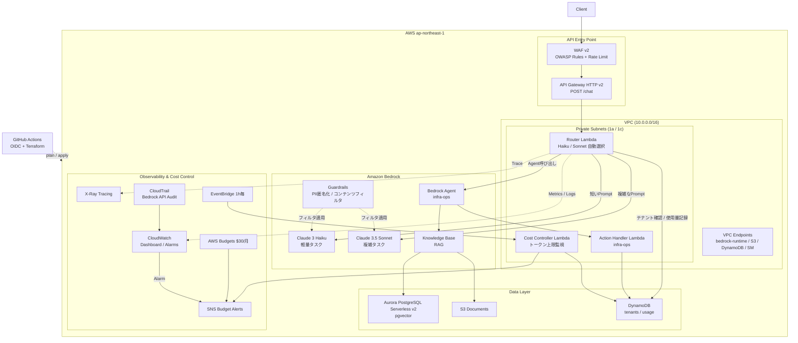

# AWS Bedrock AI Platform Sandbox

エンタープライズ相当のAI基盤をAWS個人環境で再現するTerraformプロジェクト。
マルチテナント・セキュア・可観測・コスト制御を全て実装する。

## 目的と価値

**大企業のAIチームがやるような設計を、個人の$30/月で全部自分で作って、技術記事にする。**

### 技術的な価値

- **本番さながらの設計を個人で体験**できる
  - マルチテナント（テナントごとのトークン上限管理）
  - WAF付きAPI Gateway → LambdaルーターでモデルをHaiku/Sonnetに動的振り分け
  - RAG基盤（S3 + Aurora pgvector）でナレッジベース構築
  - X-Ray + CloudWatchで完全な可観測性
  - OIDC認証のCI/CD（アクセスキー不使用）
- **全部Terraformで管理** → 再現性100%、手動操作ゼロ

### キャリア・発信的な価値

- Zenn記事化（Week8）が最終ゴール → 「個人でここまでできる」を証明する記事になる
- ポートフォリオとして採用・技術ブランディングに機能する

### コスト的な価値

- 月$30という制約の中でエンプラ設計を実現 → **コスト最適化の実践知識**が身につく

---

## 技術スタック

| カテゴリ | 採用技術 |
|---------|---------|
| IaC | Terraform >= 1.5.0 / AWS Provider ~> 5.0 |
| クラウド | AWS ap-northeast-1 |
| AI基盤 | Amazon Bedrock（Claude 3 Haiku / Sonnet） |
| 認証 | OIDC（アクセスキー禁止） |
| CI/CD | GitHub Actions |
| 言語 | Python 3.12（Lambda） |

---

## アーキテクチャ構成図



---

## ディレクトリ構成

```
bedrock-ai-platform-sandbox/
├── CLAUDE.md                        ← 設計書（Claude Code用）
├── README.md                        ← このファイル
├── .github/
│   └── workflows/
│       └── terraform.yml            ← OIDC認証 + plan/apply（Week7）
├── environments/
│   └── dev/
│       ├── versions.tf              ← terraform/provider設定
│       ├── backend.tf               ← S3 remote state
│       ├── main.tf                  ← 全モジュールの呼び出し
│       ├── variables.tf
│       ├── outputs.tf
│       └── terraform.tfvars
└── modules/
    ├── networking/                  ← VPC・サブネット・VPCエンドポイント     [Week1 ✅]
    ├── bedrock-foundation/          ← IAMロール・Guardrails・CloudTrail      [Week1 ✅]
    ├── knowledge-base/              ← RAG基盤（S3 + Aurora pgvector）        [Week2 ✅]
    ├── router-lambda/               ← インテリジェントルーター               [Week3 ✅]
    ├── multi-tenant/                ← テナント管理（DynamoDB）               [Week3 ✅]
    ├── cost-controller/             ← トークン上限制御・アラート             [Week4 ✅]
    ├── api-gateway/                 ← WAF付きAPI Gateway                     [Week4 ✅]
    ├── bedrock-agent/               ← Agentリソース・Action Groups           [Week5 ✅]
    └── observability/               ← X-Ray・CloudWatch・コストアラート      [Week6 ✅]
```

---

## 設計原則

1. **セキュリティ**: VPCエンドポイント必須、最小権限IAM、アクセスキー禁止
2. **コスト**: 月$30上限、テナントごとにトークン上限管理
3. **可観測性**: X-Ray必須、CloudWatchダッシュボード
4. **再現性**: 全リソースTerraform管理、手動操作禁止

---

## モジュール間の依存関係

```
networking
  └──▶ bedrock-foundation
         ├──▶ knowledge-base
         └──▶ bedrock-agent
  └──▶ api-gateway
         └──▶ router-lambda
                └──▶ multi-tenant
                       └──▶ cost-controller

全モジュール ──▶ observability
```

---

## クイックスタート

### 前提条件

- Terraform >= 1.5.0
- AWS CLI 設定済み（`aws configure` または OIDC）
- `terraform.tfvars` の `owner` を自分の名前に変更（GitHubユーザー名や自分の名前を入れる。リソースの `Owner` タグに使用される）

### Step 0: terraform.tfvars の設定

`environments/dev/terraform.tfvars` に `owner` を設定しておくと、plan/apply/destroy のたびに `-var` を指定しなくて済む。

```hcl
# environments/dev/terraform.tfvars
owner = "your-github-username"  # GitHubユーザー名や自分の名前（英数字・ハイフン）
```

> `owner` はリソースの `Owner` タグに使われる識別子。設定しないと `terraform plan` 時にエラーになる。

### Step 1: Terraform State バックエンドの作成

`backend.tf` が参照するS3バケットとDynamoDBテーブルは事前に手動作成が必要です。

```bash
# S3バケット作成（バージョニング有効化）
aws s3api create-bucket \
  --bucket tfstate-bedrock-ai-platform-sandbox \
  --region ap-northeast-1 \
  --create-bucket-configuration LocationConstraint=ap-northeast-1

aws s3api put-bucket-versioning \
  --bucket tfstate-bedrock-ai-platform-sandbox \
  --versioning-configuration Status=Enabled

aws s3api put-bucket-encryption \
  --bucket tfstate-bedrock-ai-platform-sandbox \
  --server-side-encryption-configuration \
  '{"Rules":[{"ApplyServerSideEncryptionByDefault":{"SSEAlgorithm":"AES256"}}]}'

# DynamoDBテーブル作成（ステートロック用）
aws dynamodb create-table \
  --table-name tfstate-lock-bedrock-ai-platform \
  --attribute-definitions AttributeName=LockID,AttributeType=S \
  --key-schema AttributeName=LockID,KeyType=HASH \
  --billing-mode PAY_PER_REQUEST \
  --region ap-northeast-1
```

### Step 2: デプロイ

```bash
cd environments/dev

# 初期化
terraform init

# 差分確認
terraform plan

# 適用
terraform apply
```

> **Week2以降の apply について**
> Aurora クラスターの起動には 5〜10 分かかります。`terraform_data.aurora_init` が
> RDS Data API 経由で pgvector スキーマを自動初期化するため、追加の手動操作は不要です。

### 削除

```bash
terraform destroy
```

---

## Week1 実装内容

### module: networking

| リソース | 内容 |
|---------|------|
| `aws_vpc` | CIDR `10.0.0.0/16`、DNS解決有効 |
| `aws_subnet` (public×2) | `10.0.1.0/24`、`10.0.2.0/24`（AZ: 1a / 1c） |
| `aws_subnet` (private×2) | `10.0.11.0/24`、`10.0.12.0/24`（AZ: 1a / 1c） |
| `aws_internet_gateway` | パブリックサブネット用 |
| `aws_nat_gateway` | **1つのみ**（コスト最適化）、AZ1のパブリックサブネットに配置 |
| `aws_vpc_endpoint` S3 | Gateway型、プライベートルートテーブルに追加 |
| `aws_vpc_endpoint` DynamoDB | Gateway型、プライベートルートテーブルに追加 |
| `aws_vpc_endpoint` bedrock-runtime | Interface型、プライベートDNS有効（インターネット経由禁止） |
| `aws_vpc_endpoint` secretsmanager | Interface型、プライベートDNS有効 |
| `aws_security_group` | VPCエンドポイント用、VPC内からの443番ポートのみ許可 |

**ネットワーク構成図**

```
Internet
    │
    ▼
Internet Gateway
    │
    ├── Public Subnet 1a (10.0.1.0/24)
    │       └── NAT Gateway ──▶ Private Subnet 1a (10.0.11.0/24)
    │                                  │
    └── Public Subnet 1c (10.0.2.0/24) │
                                       ▼
                            Private Subnet 1c (10.0.12.0/24)
                                       │
                            VPC Endpoints (S3, DynamoDB, Bedrock, SM)
```

### module: bedrock-foundation

| リソース | 内容 |
|---------|------|
| `aws_iam_role` bedrock_invoke | Lambda が AssumeRole、SourceAccount条件付き |
| `aws_iam_policy` bedrock_invoke | 指定モデルARNのみ InvokeModel 許可、Guardrail適用権限付き |
| `aws_bedrock_guardrail` | PII匿名化（EMAIL/PHONE/NAME/SSN/クレジットカード/IP）+ コンテンツフィルタ |
| `aws_cloudtrail` | Bedrock APIコール全件ログ、ログファイル整合性検証有効 |
| `aws_s3_bucket` cloudtrail | SSE-KMS暗号化、パブリックアクセス全ブロック、90日→IA移行、365日削除 |
| `aws_cloudwatch_log_group` | CloudTrail → CloudWatch Logs連携、90日保持 |

**Guardrail 設定詳細**

| カテゴリ | 対象 | 入力 | 出力 |
|---------|------|------|------|
| PII匿名化 | EMAIL / PHONE / NAME / SSN / クレジットカード / IP | ANONYMIZE | ANONYMIZE |
| コンテンツフィルタ | SEXUAL / HATE | HIGH | HIGH |
| コンテンツフィルタ | VIOLENCE / INSULTS / MISCONDUCT | MEDIUM | MEDIUM |
| プロンプトインジェクション | PROMPT_ATTACK | HIGH | NONE |

---

## Week2 実装内容

### module: knowledge-base

RAG（Retrieval-Augmented Generation）基盤。S3に格納したドキュメントをチャンク分割・ベクトル化し、Aurora pgvector に保存する。

**データフロー**

```
[ドキュメント]
     │
     ▼  S3 PutObject
aws_s3_bucket.documents
     │
     ▼  Bedrock Knowledge Base 同期（StartIngestionJob）
Titan Text Embeddings V2（1024次元）
     │
     ▼  ベクトル書き込み（RDS Data API）
Aurora PostgreSQL Serverless v2
└── bedrock_integration.bedrock_kb (pgvector HNSW インデックス)
     │
     ▼  RAG 検索（後続: router-lambda）
bedrock:RetrieveAndGenerate
```

| リソース | 内容 |
|---------|------|
| `aws_s3_bucket` documents | ドキュメント格納、SSE-KMS暗号化、90日→IA移行 |
| `aws_rds_cluster` | Aurora PostgreSQL 16.4 Serverless v2、RDS Data API有効 |
| `aws_rds_cluster_instance` | `db.serverless`、min 0.5 ACU / max 4.0 ACU |
| `terraform_data` aurora_init | `local-exec` で pgvector スキーマを RDS Data API 経由で自動初期化 |
| `aws_iam_role` bedrock_kb | Bedrock KB が S3・Aurora・Secrets Manager にアクセスするロール |
| `aws_bedrockagent_knowledge_base` | Aurora pgvector ストレージ、Titan Embeddings V2 使用 |
| `aws_bedrockagent_data_source` | S3 チャンキング設定（512トークン / オーバーラップ10%） |

**Aurora pgvector スキーマ（自動初期化）**

```sql
CREATE EXTENSION IF NOT EXISTS vector;

CREATE SCHEMA IF NOT EXISTS bedrock_integration;

CREATE TABLE IF NOT EXISTS bedrock_integration.bedrock_kb (
  id        uuid PRIMARY KEY,
  embedding vector(1024),    -- Titan Text Embeddings V2 の次元数
  chunks    text,
  metadata  json
);

CREATE INDEX IF NOT EXISTS bedrock_kb_embedding_idx
  ON bedrock_integration.bedrock_kb
  USING hnsw (embedding vector_cosine_ops);  -- 近似最近傍検索
```

**ドキュメントの同期方法**

```bash
# 1. ドキュメントを S3 にアップロード
aws s3 cp ./docs/ s3://<kb_documents_bucket>/ --recursive

# 2. Bedrock Knowledge Base の同期ジョブを開始
aws bedrock-agent start-ingestion-job \
  --knowledge-base-id <knowledge_base_id> \
  --data-source-id   <data_source_id> \
  --region ap-northeast-1

# 3. 同期完了を確認
aws bedrock-agent get-ingestion-job \
  --knowledge-base-id <knowledge_base_id> \
  --data-source-id   <data_source_id> \
  --ingestion-job-id <job_id> \
  --region ap-northeast-1
```

> `knowledge_base_id` と `data_source_id` は `terraform output` で確認できます。

---

## Week3 実装内容

### module: multi-tenant

テナント設定とトークン使用量を DynamoDB で管理する。router-lambda から参照され、Week4 の cost-controller が使用量集計に使用する。

| リソース | 内容 |
|---------|------|
| `aws_dynamodb_table` tenants | テナント設定（tier / トークン上限 / モデル固定）、GSI: tier-index |
| `aws_dynamodb_table` usage | 日次トークン使用量集計、TTL 90日（コスト最適化） |
| `aws_dynamodb_table_item` default_tenant | standard tier、日次上限 100,000 トークン |
| `aws_dynamodb_table_item` premium_tenant | premium tier、Sonnet 固定、日次上限 500,000 トークン |

**テナントスキーマ**

```json
{
  "tenant_id":           "string  (PK)",
  "tier":                "free | standard | premium  (GSI PK)",
  "token_limit_daily":   "number",
  "token_limit_monthly": "number",
  "preferred_model":     "string  (optional: モデル固定)",
  "guardrail_enabled":   "boolean",
  "created_at":          "ISO8601"
}
```

**使用量スキーマ**

```json
{
  "tenant_id":     "string  (PK)",
  "date":          "YYYYMMDD  (SK)",
  "total_tokens":  "number",
  "input_tokens":  "number",
  "output_tokens": "number",
  "last_model":    "string",
  "last_updated":  "ISO8601",
  "expires_at":    "number  (TTL: Unix epoch)"
}
```

**テナント管理 CLI**

```bash
# テナント追加
aws dynamodb put-item \
  --table-name <tenant_table_name> \
  --item '{
    "tenant_id":           {"S": "tenant-abc"},
    "tier":                {"S": "standard"},
    "token_limit_daily":   {"N": "200000"},
    "token_limit_monthly": {"N": "4000000"},
    "guardrail_enabled":   {"BOOL": true},
    "created_at":          {"S": "2026-03-18T00:00:00Z"}
  }'

# 当日の使用量確認
aws dynamodb get-item \
  --table-name <usage_table_name> \
  --key '{"tenant_id": {"S": "default"}, "date": {"S": "20260318"}}'
```

---

### module: router-lambda

プロンプトの複雑度を判定して Haiku / Sonnet を動的に選択する Lambda。
VPC 内プライベートサブネットに配置し、Bedrock VPC エンドポイント経由で呼び出す。

**ルーティングロジック**

```
リクエスト受信
    │
    ▼
テナント設定取得（DynamoDB GetItem）
    │
    ├─▶ preferred_model が設定されている → そのモデルを使用
    │
    ▼
日次トークン上限チェック（DynamoDB GetItem）
    │
    ├─▶ 上限超過 → 429 Too Many Requests
    │
    ▼
複雑度判定
    ├─▶ prompt > 1000文字        → Claude Sonnet
    ├─▶ 複雑系キーワード検出     → Claude Sonnet
    └─▶ それ以外                 → Claude Haiku（コスト最適化）
    │
    ▼
bedrock:InvokeModel（Guardrails 適用）
    │
    ▼
使用量記録（DynamoDB UpdateItem: ADD total_tokens）
    │
    ▼
レスポンス返却
```

**複雑系キーワード（Sonnet へルーティング）**

`analyze / compare / explain / implement / design / architect / debug / optimize / refactor / summarize / translate / evaluate / review / generate code / write code / create a / step-by-step`

| リソース | 内容 |
|---------|------|
| `aws_lambda_function` router | Python 3.12、512MB、タイムアウト30s、X-Ray Active |
| `data.archive_file` | `src/index.py` を ZIP パッケージング（`hashicorp/archive` プロバイダー） |
| `aws_iam_role` router_lambda | 最小権限：Bedrock 指定ARNのみ / DynamoDB 2テーブル限定 |
| `aws_security_group` router_lambda | Egress 443 to VPC CIDR のみ |
| `aws_cloudwatch_log_group` | JSON ログ形式、30日保持 |

**Lambda 呼び出しテスト**

```bash
# 直接呼び出し（シンプルなプロンプト → Haiku）
aws lambda invoke \
  --function-name <router_lambda_name> \
  --payload '{"tenant_id":"default","prompt":"Hello, who are you?"}' \
  --cli-binary-format raw-in-base64-out \
  response.json && cat response.json

# 複雑なプロンプト → Sonnet
aws lambda invoke \
  --function-name <router_lambda_name> \
  --payload '{"tenant_id":"default","prompt":"Please analyze the architecture and explain the trade-offs in detail."}' \
  --cli-binary-format raw-in-base64-out \
  response.json && cat response.json
```

---

## Week4 実装内容

### module: cost-controller

テナントごとのトークン使用量を定期監視し、上限超過時に SNS 経由でアラートを発行する Lambda。AWS Budgets で月額 $30 の上限管理も行う。

| リソース | 内容 |
|---------|------|
| `aws_sns_topic` budget_alerts | アラート通知用 SNS トピック（Budgets・Lambda が Publish 可） |
| `aws_sns_topic_subscription` email | `alert_email` 変数が設定されている場合のみ作成 |
| `aws_budgets_budget` monthly | 月額 $30 上限、80% / 100% 到達で SNS 通知 |
| `aws_lambda_function` cost_controller | DynamoDB Scan → 上限超過テナントを検出 → SNS Publish |
| `aws_cloudwatch_event_rule` cost_check | 1時間ごとに Lambda をトリガー（EventBridge） |

**環境変数**

| 変数名 | 値 |
|-------|---|
| `TENANT_TABLE` | DynamoDB テナントテーブル名 |
| `USAGE_TABLE` | DynamoDB 使用量テーブル名 |
| `ALERT_TOPIC_ARN` | SNS トピック ARN |
| `WARN_PERCENT` | 警告閾値（デフォルト 80%） |

---

### module: api-gateway

WAF v2 で保護された HTTP API Gateway v2。router-lambda と統合し、エンドポイントを公開する。

**エンドポイント**

```
POST https://<api_endpoint>/chat
```

**リクエスト形式**

```json
{
  "tenant_id": "default",
  "prompt": "Terraform の state 管理のベストプラクティスを教えてください。"
}
```

| リソース | 内容 |
|---------|------|
| `aws_wafv2_web_acl` | OWASP 共通ルール + 既知悪意パターン + IP レートリミット（5分間/IP） |
| `aws_apigatewayv2_api` | HTTP API、CORS設定（`x-tenant-id` ヘッダー許可） |
| `aws_apigatewayv2_integration` | router-lambda へのプロキシ統合（payload format 2.0） |
| `aws_apigatewayv2_route` | `POST /chat` ルート |
| `aws_apigatewayv2_stage` | `$default` ステージ、スロットリング（burst 100 / rate 50）、アクセスログ有効 |
| `aws_wafv2_web_acl_association` | WAF を API Gateway ステージに紐付け |

**curl テスト例**

```bash
ENDPOINT=$(terraform -chdir=environments/dev output -raw chat_endpoint)

curl -X POST "$ENDPOINT" \
  -H "Content-Type: application/json" \
  -H "x-tenant-id: default" \
  -d '{"tenant_id":"default","prompt":"Hello, what can you do?"}'
```

---

## Week5 実装内容

### module: bedrock-agent

インフラ運用専用の Bedrock Agent。Knowledge Base と連携した RAG Q&A と、Action Group 経由のインフラ操作（状態確認・コスト照会・アラート管理）を実現する。

**アーキテクチャ**

```
ユーザー
    │  InvokeAgent API
    ▼
aws_bedrockagent_agent (Claude Sonnet)
    ├── Guardrail 適用（PII匿名化・コンテンツフィルタ）
    ├── Knowledge Base 検索（RAG: pgvector）
    │       └── bedrock:Retrieve → Aurora pgvector
    └── Action Group: infra-ops
            └── Lambda (action_handler)
                    └── DynamoDB Scan（使用量集計）
```

**Action Group: infra-ops のオペレーション**

| オペレーション | HTTPメソッド | パス | 説明 |
|-------------|------------|-----|------|
| `getInfrastructureStatus` | GET | `/infrastructure/status` | インフラコンポーネントの稼働状況を返す |
| `getCostSummary` | GET | `/costs/summary` | DynamoDB から月次トークン使用量を集計して返す |
| `acknowledgeAlert` | POST | `/alerts/acknowledge` | アラートを確認済みとして登録する |

| リソース | 内容 |
|---------|------|
| `aws_iam_role` bedrock_agent | Bedrock サービスが AssumeRole（SourceAccount + ArnLike 条件） |
| `aws_iam_policy` bedrock_agent | InvokeModel / Retrieve / ApplyGuardrail の 3 権限のみ |
| `aws_bedrockagent_agent` | Claude Sonnet 3.5 v2、Guardrail 設定済み、セッション TTL 600s |
| `aws_bedrockagent_agent_action_group` infra-ops | OpenAPI スキーマ (`schema/infra_ops.json`) 定義 |
| `aws_bedrockagent_agent_knowledge_base_association` | Knowledge Base との紐付け（ENABLED） |
| `aws_lambda_function` action_handler | Python 3.12、256MB、X-Ray Active |

**Agent 呼び出し例**

```bash
AGENT_ID=$(terraform -chdir=environments/dev output -raw bedrock_agent_id)

aws bedrock-agent-runtime invoke-agent \
  --agent-id "$AGENT_ID" \
  --agent-alias-id TSTALIASID \
  --session-id "session-001" \
  --input-text "今月の各テナントのトークン使用量を教えてください" \
  --region ap-northeast-1 \
  output.json

cat output.json
```

---

## Week6 実装内容

### module: observability

X-Ray トレーシング、CloudWatch カスタムメトリクス・アラーム・ダッシュボードを一括管理する。

**ダッシュボード構成（4行 × 24列）**

| 行 | ウィジェット | 内容 |
|---|------------|------|
| 1 | API Gateway - Requests & Errors | Count / 4xx / 5xx（Sum, 5分） |
| 1 | API Gateway - Latency p50/p99 | ms |
| 1 | Bedrock InvokeModel Calls | カスタムメトリクス（CloudTrail 経由） |
| 2 | Router Lambda - Invocations & Errors | Throttles 含む |
| 2 | Router Lambda - Duration p50/p99 | ms |
| 2 | Cost Controller Lambda | Invocations / Errors |
| 3 | DynamoDB - Tenant Table | Read/Write CU |
| 3 | DynamoDB - Usage Table | Read/Write CU |
| 4 | Alarm Status | 全アラームのステータス一覧 |

**CloudWatch Alarms**

| アラーム | 条件 | 通知先 |
|---------|------|-------|
| Router Lambda errors | エラー数 ≥ 5 / 5分 | SNS budget_alerts |
| Cost Controller Lambda errors | エラー数 ≥ 5 / 5分 | SNS budget_alerts |
| API Gateway 5xx | 5xxエラー数 ≥ 10 / 5分 | SNS budget_alerts |

| リソース | 内容 |
|---------|------|
| `aws_xray_group` lambdas | X-Ray Insights 有効、Lambda トレース集約 |
| `aws_cloudwatch_log_metric_filter` | CloudTrail から `InvokeModel` / `InvokeModelWithResponseStream` をカウント抽出 |
| `aws_cloudwatch_metric_alarm` × 3 | Lambda errors × 2 + API 5xx、OK時も SNS 通知 |
| `aws_cloudwatch_dashboard` | 21ウィジェット、全リージョン対応 |

**ダッシュボードへのアクセス**

```bash
DASHBOARD=$(terraform -chdir=environments/dev output -raw cloudwatch_dashboard_name)
echo "https://ap-northeast-1.console.aws.amazon.com/cloudwatch/home#dashboards:name=${DASHBOARD}"
```

---

## Week7 実装内容

### GitHub Actions CI/CD

OIDC 認証を使用した Terraform 自動 plan / apply パイプライン。アクセスキーは一切使用しない。

**ワークフロー動作**

| トリガー | 動作 |
|--------|------|
| PR 作成・更新 | fmt check → validate → plan → PR へコメント自動投稿 |
| `main` ブランチへの push | fmt check → validate → plan → **apply**（auto-approve） |

**セットアップ手順**

1. AWS で GitHub Actions 用 IAM ロールを作成（OIDC プロバイダー設定が必要）

```bash
# GitHub OIDC プロバイダーの確認（既に存在する場合はスキップ）
aws iam list-open-id-connect-providers

# 存在しない場合は作成
aws iam create-open-id-connect-provider \
  --url https://token.actions.githubusercontent.com \
  --client-id-list sts.amazonaws.com \
  --thumbprint-list 6938fd4d98bab03faadb97b34396831e3780aea1
```

2. IAM ロール（信頼ポリシー例）

```json
{
  "Version": "2012-10-17",
  "Statement": [{
    "Effect": "Allow",
    "Principal": {
      "Federated": "arn:aws:iam::<ACCOUNT_ID>:oidc-provider/token.actions.githubusercontent.com"
    },
    "Action": "sts:AssumeRoleWithWebIdentity",
    "Condition": {
      "StringEquals": {
        "token.actions.githubusercontent.com:aud": "sts.amazonaws.com"
      },
      "StringLike": {
        "token.actions.githubusercontent.com:sub": "repo:<GITHUB_ORG>/<REPO_NAME>:*"
      }
    }
  }]
}
```

3. GitHub リポジトリの Secrets を設定

| Secret 名 | 値 |
|----------|---|
| `AWS_ROLE_ARN` | 上記で作成した IAM ロールの ARN |
| `ALERT_EMAIL` | アラート通知先メールアドレス（任意） |

---

## タグ戦略

全リソースに以下のタグを付与（`provider default_tags` で自動適用）。

```hcl
Environment = "dev"
Project     = "bedrock-ai-platform-sandbox"
Owner       = "your-name"      # terraform.tfvars で変更
CostCenter  = "personal"
```

---

## コスト見積もり（dev環境・月額）

| リソース | 備考 | 概算/月 |
|---------|------|--------|
| NAT Gateway | 1つのみ（$0.062/h） | ~$4.5 |
| Interface VPC Endpoint | bedrock-runtime + secretsmanager × 2AZ | ~$14 |
| Aurora Serverless v2 | 0.5 ACU 最小（$0.12/ACU-h）、アイドル時は課金停止 | ~$2–5 |
| Aurora ストレージ | 10GB 想定（$0.11/GB-月） | ~$1 |
| S3（ドキュメント + CloudTrail） | 90日→IA移行 | ~$0.5 |
| CloudTrail | 管理イベント 1 trail 無料枠内 | $0 |
| Bedrock API | Titan Embeddings + Claude Haiku/Sonnet（使用量従量） | ~$3–8 |
| DynamoDB | PAY_PER_REQUEST、テナント数・使用量次第 | ~$0.1 |
| Lambda × 3 | router / cost-controller / action-handler、512MB 以下 | ~$0 |
| WAF v2 | WebACL $5/月 + ルール $1/月 × 3 + リクエスト $0.6/100万 | ~$8 |
| API Gateway HTTP API | $1/100万リクエスト（個人利用規模） | ~$0.1 |
| CloudWatch | Dashboard $3/月、Alarms $0.10 × 3 | ~$3.3 |
| AWS Budgets | 最初の 2 budgets は無料 | $0 |
| **合計（Week7時点）** | | **~$33–44** |

> **注意**: WAF の追加（Week4）により前週比 +$8 程度増加します。
> Aurora を未使用時に一時停止（`aws rds stop-db-cluster`）することで ~$2–5 削減できます。
> Interface VPC Endpoint と WAF がコストの主因です。

---

## セキュリティチェックリスト

- [x] VPCエンドポイントで Bedrock をプライベート経路に強制
- [x] IAMロールは指定モデルARNのみ許可（ワイルドカード `*` 不使用）
- [x] Lambda AssumeRole に `aws:SourceAccount` 条件を付与
- [x] Bedrock KB の AssumeRole に `aws:SourceAccount` + `ArnLike` 条件を付与
- [x] CloudTrail S3バケットはパブリックアクセス全ブロック
- [x] CloudTrail ログファイル整合性検証（`enable_log_file_validation = true`）
- [x] Aurora マスター認証情報は AWS Secrets Manager で自動管理（`manage_master_user_password = true`）
- [x] Aurora ストレージ暗号化有効（`storage_encrypted = true`）
- [x] S3ドキュメントバケットはパブリックアクセス全ブロック
- [x] S3バケットは SSE-KMS 暗号化 + Bucket Key（コスト削減）
- [x] Guardrails でプロンプトインジェクション対策（HIGH）
- [x] DynamoDB 暗号化有効（SSE）+ PITR 有効
- [x] Lambda IAM ポリシー：DynamoDB は 2 テーブルの ARN のみ指定
- [x] Lambda IAM ポリシー：Bedrock は指定 ARN のみ（ワイルドカードなし）
- [x] Lambda の CloudWatch Logs に JSON 形式 + 明示的ロググループ指定
- [x] GitHub Actions OIDC認証（アクセスキー不使用）
- [x] WAF v2（OWASP共通ルール・既知悪意パターン・IPレートリミット）
- [x] API Gateway スロットリング設定（burst 100 / rate 50 rps）
- [x] Bedrock Agent AssumeRole に SourceAccount + ArnLike 条件付与
- [x] Action Group Lambda を bedrock.amazonaws.com のみ許可（`agent/*` ワイルドカード限定）

---

## 構築スケジュール

| Week | 対象モジュール | ステータス |
|------|--------------|----------|
| 1 | networking + bedrock-foundation | ✅ 完了 |
| 2 | knowledge-base | ✅ 完了 |
| 3 | router-lambda + multi-tenant | ✅ 完了 |
| 4 | cost-controller + api-gateway | ✅ 完了 |
| 5 | bedrock-agent | ✅ 完了 |
| 6 | observability | ✅ 完了 |
| 7 | GitHub Actions CI/CD | ✅ 完了 |
| 8 | 統合テスト + Zenn記事化 | 進行中 |

---

## Week8 統合テスト手順

### 全体の流れ

```
Phase 1: ローカル検証（terraform validate / plan）
    │
    ▼
Phase 2: terraform apply（初回デプロイ）
    │
    ▼
Phase 3: 各モジュールの動作確認
    │
    ├── Knowledge Base 同期
    ├── API Gateway / router-lambda エンドポイントテスト
    ├── Bedrock Agent 動作確認
    ├── Cost Controller 手動実行
    └── CloudWatch ダッシュボード確認
    │
    ▼
Phase 4: GitHub Actions CI/CD 確認
    │
    ▼
Phase 5: コスト確認 → terraform destroy
```

---

### Phase 1: ローカル検証

```bash
cd environments/dev

terraform init
terraform fmt -check -recursive   # フォーマット確認
terraform validate                 # 構文チェック
terraform plan -var="owner=your-name"  # 差分を目視確認
```

> plan の出力で `No changes.` 以外が出る場合は、差分内容を確認してから apply に進む。

---

### Phase 2: terraform apply（初回デプロイ）

```bash
terraform apply -var="owner=your-name"
```

> Aurora クラスターの起動に **5〜10 分**かかります。
> `terraform_data.aurora_init` が RDS Data API 経由で pgvector スキーマを自動初期化するため、追加の手動作業は不要です。

apply 完了後、以降のテストで使用する値を取得しておく。

```bash
terraform output   # 全出力値を確認

# よく使う値を変数に入れておくと便利
CHAT_ENDPOINT=$(terraform output -raw chat_endpoint)
KB_ID=$(terraform output -raw knowledge_base_id)
AGENT_ID=$(terraform output -raw bedrock_agent_id)
ROUTER_NAME=$(terraform output -raw router_lambda_name)
DASHBOARD=$(terraform output -raw cloudwatch_dashboard_name)
```

---

### Phase 3: 各モジュールの動作確認

#### 3-1. Knowledge Base へのドキュメント投入・同期

```bash
# S3 バケット名を取得
KB_BUCKET=$(terraform output -raw kb_documents_bucket)

# Knowledge Base ドキュメントをアップロード（docs/kb/ 配下の 5 ファイル）
aws s3 sync ../../docs/kb/ s3://${KB_BUCKET}/docs/ --delete

# 同期ジョブを実行
DATA_SOURCE_ID=$(aws bedrock-agent list-data-sources \
  --knowledge-base-id $KB_ID \
  --query "dataSourceSummaries[0].dataSourceId" \
  --output text \
  --region ap-northeast-1)

aws bedrock-agent start-ingestion-job \
  --knowledge-base-id $KB_ID \
  --data-source-id $DATA_SOURCE_ID \
  --region ap-northeast-1

# 完了まで待機（COMPLETE になるまでポーリング）
aws bedrock-agent get-ingestion-job \
  --knowledge-base-id $KB_ID \
  --data-source-id $DATA_SOURCE_ID \
  --ingestion-job-id <job_id> \
  --region ap-northeast-1
```

#### 3-2. API Gateway + router-lambda エンドポイントテスト

Haiku ルーティング（短いプロンプト）:

```bash
curl -s -X POST "$CHAT_ENDPOINT" \
  -H "Content-Type: application/json" \
  -d '{"tenant_id":"default","prompt":"Hello, who are you?"}' | jq .

# 期待: model_used = "anthropic.claude-3-haiku-..."
```

Sonnet ルーティング（複雑なプロンプト）:

```bash
curl -s -X POST "$CHAT_ENDPOINT" \
  -H "Content-Type: application/json" \
  -d '{"tenant_id":"default","prompt":"Please analyze and explain the trade-offs of pgvector vs OpenSearch Serverless for RAG in detail."}' | jq .

# 期待: model_used = "anthropic.claude-3-5-sonnet-..."
```

トークン上限テスト（存在しないテナント）:

```bash
curl -s -X POST "$CHAT_ENDPOINT" \
  -H "Content-Type: application/json" \
  -d '{"tenant_id":"nonexistent","prompt":"Hello"}' | jq .

# 期待: 404 エラー（テナント未登録）
```

#### 3-3. Bedrock Agent 動作確認

```bash
# RAG 検索を含む質問（Knowledge Base 同期済みであること）
aws bedrock-agent-runtime invoke-agent \
  --agent-id $AGENT_ID \
  --agent-alias-id TSTALIASID \
  --session-id "test-session-001" \
  --input-text "インフラの稼働状況を教えてください" \
  --region ap-northeast-1 \
  --cli-binary-format raw-in-base64-out \
  agent_response.json && cat agent_response.json

# コスト照会（Action Group: getCostSummary）
aws bedrock-agent-runtime invoke-agent \
  --agent-id $AGENT_ID \
  --agent-alias-id TSTALIASID \
  --session-id "test-session-002" \
  --input-text "今月の各テナントのトークン使用量を集計してください" \
  --region ap-northeast-1 \
  --cli-binary-format raw-in-base64-out \
  agent_response.json && cat agent_response.json
```

#### 3-4. Cost Controller Lambda の手動実行

```bash
COST_LAMBDA=$(terraform output -raw cost_controller_lambda_name)

aws lambda invoke \
  --function-name $COST_LAMBDA \
  --region ap-northeast-1 \
  cost_response.json && cat cost_response.json

# CloudWatch Logs で詳細確認
aws logs tail "/aws/lambda/${COST_LAMBDA}" --follow --region ap-northeast-1
```

#### 3-5. CloudWatch ダッシュボード確認

```bash
echo "ダッシュボード URL:"
echo "https://ap-northeast-1.console.aws.amazon.com/cloudwatch/home#dashboards:name=${DASHBOARD}"
```

ブラウザで開いて以下を確認する:

| 確認項目 | 期待する状態 |
|---------|------------|
| API Gateway - Requests | テストリクエスト数が反映されている |
| Router Lambda - Errors | 0 または想定内の件数 |
| Bedrock - InvokeModel Calls | 呼び出し数が反映されている |
| Alarm Status | すべて OK（緑）|

---

### Phase 4: GitHub Actions CI/CD 確認

1. **OIDC IAM ロール作成**（未作成の場合、README の Week7 セクション参照）

2. **リポジトリの Secrets 設定**

   | Secret 名 | 設定値 |
   |----------|-------|
   | `AWS_ROLE_ARN` | 作成した IAM ロールの ARN |
   | `ALERT_EMAIL` | 通知先メールアドレス（任意） |

3. **テスト用 PR を作成**

   ```bash
   git checkout -b test/ci-check
   # 何か軽微な変更（コメント追記など）
   git add . && git commit -m "test: CI/CD 動作確認"
   git push origin test/ci-check
   # GitHub で PR を作成
   ```

   PR に Terraform Plan の結果がコメントされることを確認する。

4. **main にマージ** → GitHub Actions が `terraform apply` を自動実行することを確認する。

---

### Phase 5: コスト確認 → 後片付け

```bash
# AWS Cost Explorer で実費を確認（apply 翌日以降に反映）
# https://ap-northeast-1.console.aws.amazon.com/costmanagement/home

# 確認後は必ず destroy（Aurora・VPC Endpoint 等の固定費が継続するため）
terraform destroy -var="owner=your-name"
```

> **Aurora の自動再起動に注意**: 停止状態の Aurora は **7日後に AWS によって自動的に再起動**されます。
> 長期間使用しない場合は `terraform destroy` で Aurora リソースごと削除することを推奨します。

---

### 統合テスト チェックリスト

- [ ] `terraform validate` が通る
- [ ] `terraform apply` が完走する（Aurora 初期化含む）
- [ ] `/chat` エンドポイントが短いプロンプトで Haiku を選択する
- [ ] `/chat` エンドポイントが複雑なプロンプトで Sonnet を選択する
- [ ] Knowledge Base 同期ジョブが COMPLETE になる
- [ ] Bedrock Agent が Knowledge Base を参照して日本語で回答する
- [ ] Bedrock Agent の Action Group（getCostSummary 等）が応答する
- [ ] Cost Controller Lambda がエラーなく完了する
- [ ] CloudWatch ダッシュボードにメトリクスが表示される
- [ ] Alarm Status がすべて OK（緑）
- [ ] GitHub Actions の PR plan コメントが自動投稿される
- [ ] GitHub Actions の main apply が完走する
- [ ] `terraform destroy` が完走する

---

## コスト最適化ルール

- Aurora Serverless v2 最小ACU: 0.5
- Lambda メモリ: 512MB以下
- OpenSearch Serverless: **使用禁止**（pgvector代替）
- NAT Gateway: **1つのみ**
- モデル選定: 軽量タスクはHaiku、複雑タスクはSonnetを使い分ける
