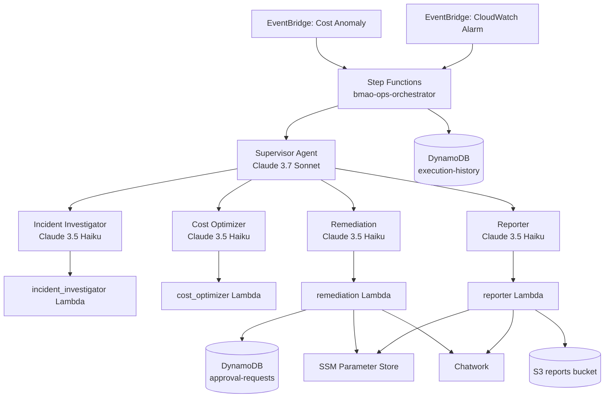

# ARCHITECTURE

## 1. このプロジェクトは何か

`bedrock-multi-agent-ops-autopilot` は、AWS運用イベントを起点に Amazon Bedrock の Supervisor Agent が複数の専門 Sub-agent に委譲し、調査・分析・修復・通知を進めることを目指したプロジェクトです。

リポジトリは大きく 2 層で構成されています。

- インフラ層: `terraform/`
- 実行ロジック層: `lambda/` `agents/` `stepfunctions/`

構想上は「EventBridge → Step Functions → Supervisor Agent → Sub-agent → Action Group Lambda → S3/DynamoDB/Chatwork」という流れです。  
ただし、現状コードはその全体像のうち「基盤」「Agent 定義」「Action Group Lambda」「Supervisor 呼び出しラッパー」までが主実装で、承認待ちループや完全な実行後処理はまだ限定的です。

## 2. 全体像

## 3. 実装の中心思想

### Multi-Agent Collaboration

- Supervisor は `anthropic.claude-3-7-sonnet-20250219-v1:0`
- 4 つの Sub-agent は `anthropic.claude-haiku-3-5-20241022-v1:0`
- Supervisor は Bedrock の `agent_collaboration = "SUPERVISOR"` を使い、Sub-agent へネイティブ委譲します

この設計は `docs/adr/ADR-001-multi-agent-pattern.md` にある通り、推論品質が必要なルーティング判断だけを Sonnet に寄せ、専門処理は Haiku に逃がしてコストを抑えるのが狙いです。

### Human-in-the-loop

Remediation は直接実行を許さず、以下の 3 関数を通して承認前提に設計されています。

- `create_approval_request`
- `check_approval_status`
- `execute_ssm_document`

思想としては安全寄りですが、Step Functions 側に承認待ち状態を扱うループや Wait State はまだありません。現状では承認制御の中心は Remediation Lambda 自身です。

### Guardrails

`terraform/modules/agents/main.tf` で `aws_bedrock_guardrail` を定義し、破壊的操作に関連するトピックを `DENY` しています。  
Supervisor と全 Sub-agent に同じ Guardrail が適用されます。

## 4. ディレクトリごとの役割

### `terraform/`

AWS リソースの定義本体です。ルート `main.tf` で以下 4 モジュールを組み合わせます。

- `foundation`
- `lambda`
- `agents`
- `stepfunctions`

### `lambda/`

Bedrock Agent の Action Group 実装です。各ディレクトリに `handler.py` と `requirements.txt` があり、Terraform が zip 化して Lambda にデプロイします。

### `agents/`

Bedrock Agent のプロンプトと API スキーマです。

- `instruction.txt`: Agent の役割と行動制約
- `openapi.yaml`: Action Group で Bedrock に見せる関数定義

### `stepfunctions/`

State Machine の ASL 定義です。現状は `ops_orchestrator.asl.json` が 1 つあります。

### `docs/`

軽量な設計資料群です。`docs/architecture.md` は概要版、`docs/runbook.md` は運用手順、`docs/adr/` は設計判断です。

### `tests/`

統合テストが中心です。AWS 実環境前提の E2E テストで、ローカル unit test は未整備です。

## 5. Terraform モジュール構成

### 5.1 foundation モジュール

責務:

- S3 レポートバケット作成
- DynamoDB テーブル作成
- SSM Parameter Store の初期値作成
- Supervisor 用 IAM ロール作成
- 共通ロググループ作成
- Cost Anomaly Monitor / Subscription 作成

主要リソース:

- S3: `bmao-reports-{account_id}`
- DynamoDB: `bmao-execution-history`
- DynamoDB: `bmao-approval-requests`
- SSM:
  - `/bmao/chatwork/room_id`
  - `/bmao/chatwork/api_token`
  - `/bmao/config/cost_threshold_usd`
- IAM:
  - `bmao-lambda-base-role`
  - `bmao-supervisor-agent-role`
- CloudWatch Logs:
  - Lambda 4 本分
  - Step Functions 1 本分

補足:

- `lambda_base_role_arn` は output されていますが、現行 `lambda` モジュールでは使われていません
- コスト閾値 SSM パラメータは作成されますが、EventBridge/CE 側は Terraform 変数ではなく固定値 `50` を使っています

### 5.2 lambda モジュール

責務:

- 4 つの Action Group Lambda を作成
- 各 Lambda 専用 IAM ロールを作成
- Bedrock Agent から Lambda を invoke できる permission を付与

デプロイ対象:

- `bmao-incident-investigator`
- `bmao-cost-optimizer`
- `bmao-remediation`
- `bmao-reporter`

特徴:

- Runtime: `python3.12`
- Architecture: `arm64`
- すべて X-Ray 有効
- すべて Powertools ベース

### 5.3 agents モジュール

責務:

- Guardrail 作成
- Sub-agent 用共通 IAM ロール作成
- 4 Sub-agent 作成
- Supervisor Agent 作成
- Supervisor から各 Sub-agent への collaborator 設定

Agent 構成:

| Agent | 役割 | Action Group |
|---|---|---|
| Supervisor | イベント判断と委譲 | なし |
| Incident Investigator | 障害調査 | incident-investigation-actions |
| Cost Optimizer | コスト分析 | cost-optimization-actions |
| Remediation | 承認付き修復 | remediation-actions |
| Reporter | レポート・通知 | reporting-actions |

### 5.4 stepfunctions モジュール

責務:

- Step Functions ステートマシン作成
- Step Functions 用 IAM ロール作成
- EventBridge から State Machine を起動する IAM ロール作成
- EventBridge ルール作成

現状のステートマシン責務は非常に絞られています。

1. 実行開始を DynamoDB に記録
2. Supervisor Agent を 1 回 invoke
3. 成功または失敗を DynamoDB に更新

つまり、ワークフローの主な知能は Step Functions ではなく Bedrock Supervisor 側に寄せられています。

## 6. 実行フロー

### 6.1 コスト異常フロー

1. AWS Cost Anomaly Detection が異常を検知
2. EventBridge ルール `bmao-cost-anomaly` がイベントを受ける
3. 入力を `event_type = "COST_ANOMALY"` 形式に変換して Step Functions を起動
4. Step Functions が `bmao-execution-history` に `RUNNING` を記録
5. Step Functions が Supervisor Agent を invoke
6. Supervisor が必要に応じて `Cost Optimizer`、`Remediation`、`Reporter` に委譲
7. Step Functions は Bedrock 呼び出しの成否だけを見て `SUCCEEDED` / `FAILED` を記録

### 6.2 障害調査フロー

1. CloudWatch Alarm が `ALARM` へ遷移
2. EventBridge ルール `bmao-cloudwatch-alarm` がイベントを受ける
3. Step Functions が `event_type = "CLOUDWATCH_ALARM"` に整形して起動
4. Supervisor が `Incident Investigator` を中心に調査を委譲
5. 必要なら `Remediation` と `Reporter` に進む

## 7. 各 Lambda の実装内容

### 7.1 incident_investigator

関数:

- `investigate_cloudwatch_alarms`
- `investigate_xray_traces`
- `check_config_compliance`

役割:

- Alarm 状態と関連メトリクス収集
- X-Ray のサービスグラフとエラートレース収集
- Config 非準拠状態の確認

性質:

- 調査専用で、変更系 API は持ちません

### 7.2 cost_optimizer

関数:

- `get_cost_anomalies`
- `get_rightsizing_recommendations`
- `get_unused_resources`

役割:

- Cost Explorer の異常取得
- EC2 rightsizing 推奨取得
- 未使用 EBS/EIP 検出

性質:

- 提案専用で、削除や変更はしません

### 7.3 remediation

関数:

- `create_approval_request`
- `check_approval_status`
- `execute_ssm_document`

役割:

- 承認リクエスト作成
- Chatwork 通知
- 承認済みのみ SSM Run Command 実行

性質:

- 破壊的権限は Terraform 側でも意図的に除外
- 実際に持つ変更系権限は `ssm:SendCommand` が中心

### 7.4 reporter

関数:

- `generate_html_report`
- `send_chatwork_notification`

役割:

- HTML レポート生成
- S3 保存
- Presigned URL 発行
- Chatwork 通知

性質:

- 最終的な「人向けの成果物」を作る層です

## 8. データ設計

### `bmao-execution-history`

用途:

- Step Functions 実行の開始・終了記録
- 将来的には Agent 実行全体の監査ログ基盤

キー:

- Partition key: `execution_id`
- Sort key: `timestamp`

GSI:

- `status-index`

現状の主利用者:

- Step Functions
- Remediation Lambda も書き込みを試みる設計

### `bmao-approval-requests`

用途:

- Remediation の人手承認管理

キー:

- Partition key: `request_id`

TTL:

- 24 時間

### S3 reports bucket

用途:

- Reporter による HTML レポート保存

保護:

- Public Access Block 有効
- Versioning 有効
- SSE-S3 有効
- 90 日で Glacier、365 日で削除

### SSM Parameter Store

現状の実装上の利用目的:

- Chatwork の room id
- Chatwork API token
- コスト閾値

## 9. セキュリティ設計

### IAM 分離

- Supervisor 用ロールと Sub-agent 用ロールが分離されています
- Lambda は 4 本とも専用ロールです
- Remediation からは `iam:*`、`ec2:TerminateInstances`、`rds:DeleteDBInstance` 相当を除外しています

### Guardrails

- 破壊的操作に関する言語指示を Bedrock Guardrail 側でブロック

### 承認

- 修復は Lambda 実装上 `approved` ステータス確認を必須化

## 10. CI / テスト / 運用補助

### CI

`.github/workflows/ci.yml` では以下を実施します。

- Terraform init
- Terraform validate
- Terraform fmt check
- `ruff check lambda/`

### 統合テスト

`tests/integration/test_e2e.py` は AWS 実環境に対して以下を試します。

- Cost Anomaly イベント投入
- CloudWatch Alarm イベント投入
- DynamoDB への実行履歴確認

このテストはローカルモックではなく、デプロイ済みリソース前提です。

### 運用スクリプト

- `scripts/verify_deploy.sh`: 主要リソース存在確認
- `scripts/check_execution.sh`: 実行履歴と S3 レポート確認

## 11. 現状実装とドキュメントのギャップ

このリポジトリを理解するうえで一番重要な部分です。現状コードには、構想資料と実装の差分がいくつかあります。

### 11.1 Step Functions は承認待ちオーケストレーションをまだ持たない

`docs/runbook.md` や `README.md` では承認フローがワークフロー全体に組み込まれているように読めますが、`stepfunctions/ops_orchestrator.asl.json` は以下のみです。

- 開始記録
- Supervisor invoke
- 成否記録

承認待ちの `Wait`、DynamoDB ポーリング、Reporter 強制通知などは未実装です。

### 11.2 Reporter Lambda が参照する SSM パラメータが Terraform にない

`lambda/reporter/handler.py` は `/bmao/s3/reports_bucket` を読みに行きますが、Terraform が作成しているのは以下だけです。

- `/bmao/chatwork/room_id`
- `/bmao/chatwork/api_token`
- `/bmao/config/cost_threshold_usd`

そのため、現状のままだと `generate_html_report` は SSM パラメータ不足で失敗する可能性があります。

### 11.3 Remediation の execution-history 書き込みはテーブルスキーマと合わない

`bmao-execution-history` は sort key `timestamp` が必須ですが、`lambda/remediation/handler.py` の `execute_ssm_document` は `timestamp` なしで `put_item` しています。  
このままでは DynamoDB 書き込み時に失敗する可能性があります。

### 11.4 承認ステータスの値に大小文字差がある

コードと資料で使われる値が統一されていません。

- Lambda 実装: `pending_approval` / `approved`
- `docs/runbook.md`: `APPROVED` / `REJECTED`

運用時に手動更新を誤ると、Remediation が承認済みと判定しない可能性があります。

### 11.5 コスト閾値は変数化されているが実際は固定値

ルート変数 `alert_threshold_cost_usd` は存在しますが、`foundation/eventbridge.tf` の CE subscription は `"50"` を直書きしています。  
設定の見た目と実際の反映先が一致していません。

### 11.6 `lambda_base_role_arn` と `chatwork_room_id` 変数は現状未使用

設計途中の名残と見られます。

### 11.7 README のディレクトリ説明に実態との差がある

- `agents/supervisor/openapi.yaml` は README 上は存在する前提ですが、実ファイルはありません
- README では Step Functions ファイル名が `ops_orchestrator.json` になっていますが、実体は `ops_orchestrator.asl.json` です

### 11.8 補助スクリプトの DynamoDB 参照が実テーブルキーと一致しない

`scripts/check_execution.sh` は `get-item` で `execution_id` だけを指定していますが、実テーブルは複合キーです。  
そのままでは想定通り動かない可能性があります。

## 12. このプロジェクトの現在地

現状は「Bedrock Multi-Agent Collaboration を Terraform と Lambda で一通り接続した PoC / ポートフォリオ実装」と捉えるのが最も正確です。

できていること:

- 基盤リソース作成
- Bedrock Agent / Sub-agent 定義
- Guardrail 適用
- Action Group Lambda 実装
- EventBridge から Step Functions 起動
- Step Functions から Supervisor invoke

まだ強化余地が大きいこと:

- 承認待ちを含む完全オーケストレーション
- Reporter 周辺の設定接続
- DynamoDB スキーマ整合
- 手動運用手順と実装の値の統一
- 単体テストとローカル検証性

## 13. 読む順番のおすすめ

このリポジトリを追うなら、次の順で読むと理解しやすいです。

1. `README.md`
2. `terraform/main.tf`
3. `terraform/modules/stepfunctions/main.tf`
4. `stepfunctions/ops_orchestrator.asl.json`
5. `terraform/modules/agents/main.tf` と `supervisor.tf`
6. `agents/*/instruction.txt`
7. `lambda/*/handler.py`
8. `docs/runbook.md`

## 14. まとめ

このプロジェクトの本質は「AWS 運用の判断を Supervisor Agent に寄せ、専門作業を Sub-agent と Lambda に分散する」ことです。  
インフラと実行ロジックの骨組みはすでに揃っており、特に Bedrock Agent Collaboration と Terraform の接続部分はこのリポジトリの中心価値です。  
一方で、運用フローの最終完成度を上げるには、承認ループ、Reporter の設定接続、DynamoDB スキーマ整合の 3 点が次の重要テーマです。
