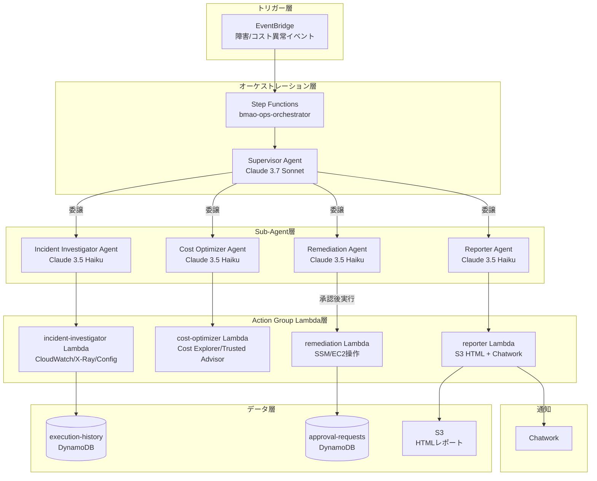

# 🤖 Bedrock Multi-Agent Ops Autopilot

> Amazon Bedrock Multi-Agent Collaborationで、AWS運用（障害対応・コスト最適化）を Supervisor Agentが自律的に判断・委譲・実行するシステム。

[\](https://www.terraform.io/)
[\](https://aws.amazon.com/)
[\](https://www.python.org/)
[\](./LICENSE)

---

## アーキテクチャ



---

## 技術スタック

| カテゴリ | 技術 | 用途 |
|---|---|---|
| AI/LLM | Amazon Bedrock Claude 3.7 Sonnet | Supervisor Agent（状況判断・委譲） |
| AI/LLM | Amazon Bedrock Claude 3.5 Haiku | Sub-agents（実行コスト削減） |
| オーケストレーション | AWS Step Functions | エージェント実行制御・無限ループ防止 |
| イベント駆動 | Amazon EventBridge | 障害・コスト異常の自動検知トリガー |
| イベント駆動 | AWS Cost Anomaly Detection | コストスパイク検知 |
| コンピュート | AWS Lambda (Python 3.12, arm64) | Action Group実行基盤 |
| データストア | Amazon DynamoDB | 実行履歴・承認リクエスト管理 |
| ストレージ | Amazon S3 | 調査レポート（HTML）保存 |
| IaC | Terraform >= 1.7 | インフラ定義・プロビジョニング |
| 通知 | Chatwork API | アラート・承認要求通知 |
| セキュリティ | Amazon Bedrock Guardrails | 破壊的操作のシステムレベルブロック |
| モニタリング | AWS Lambda Powertools | 構造化ログ・トレーシング・メトリクス |
| リージョン | ap-northeast-1 | 東京リージョン固定 |

---

## 主な特徴

- **Supervisor + Sub-agentパターン**: Supervisor（Claude 3.7 Sonnet）が状況を判断し、専門化されたSub-agent（Claude 3.5 Haiku）へ委譲。役割分離によりコンテキスト肥大化を防止
- **Human-in-the-loop**: Remediation Agentによる破壊的操作（EC2停止・RDSスナップショット等）は、DynamoDB承認テーブルへ書き込み → Chatwork通知 → 人間が承認するまで実行を保留
- **Bedrock Guardrailsによる多層防御**: EC2インスタンス削除・RDS削除等をシステムレベルでブロック。LLMの判断ミスによる誤操作を防止
- **コスト最適化設計**: Sub-agentにHaikuを採用することでSonnet比約20倍のコスト削減。Step Functionsの最大反復回数でBedrockの無限ループを防止。月額$20以内を目標
- **完全なイベント駆動**: EventBridgeによる障害検知・コスト異常検知から、調査→修復→レポート通知まで全自動で実行

---

## セットアップ

### 前提条件

- Terraform >= 1.7
- AWS CLI（ap-northeast-1リージョンに設定済み）
- Amazon Bedrockのモデルアクセス有効化（ap-northeast-1）
  - `anthropic.claude-3-7-sonnet-20250219-v1:0`
  - `anthropic.claude-3-5-haiku-20241022-v1:0`
- Chatworkアカウントとルーム（通知先）

### デプロイ手順

```bash
# リポジトリのクローン
git clone https://github.com/your-username/bedrock-multi-agent-ops-autopilot.git
cd bedrock-multi-agent-ops-autopilot

# Terraformの初期化と適用
cd terraform
terraform init
terraform plan -out=tfplan
terraform apply tfplan
```

### SSMパラメータ設定

デプロイ後、以下のSSM Parameter Storeの値を設定してください：

```bash
# Chatwork APIトークン
aws ssm put-parameter \
  --name "/bmao/chatwork/api_token" \
  --value "YOUR_CHATWORK_API_TOKEN" \
  --type "SecureString" \
  --region ap-northeast-1

# Chatwork ルームID
aws ssm put-parameter \
  --name "/bmao/chatwork/room_id" \
  --value "YOUR_CHATWORK_ROOM_ID" \
  --type "String" \
  --region ap-northeast-1
```

---

## 動作確認

### デプロイ確認

```bash
# Terraformアウトプット確認
cd terraform
terraform output

# Bedrock Agentの確認
aws bedrock-agent list-agents \
  --region ap-northeast-1 \
  --query 'agentSummaries[?contains(agentName, `bmao`)]'

# Step Functionsの確認
aws stepfunctions list-state-machines \
  --region ap-northeast-1 \
  --query 'stateMachines[?contains(name, `bmao`)]'
```

### 手動テスト（Step Functions）

```bash
# コスト最適化タスクのテスト実行
aws stepfunctions start-execution \
  --state-machine-arn $(terraform output -raw step_functions_arn) \
  --input '{
    "task_type": "cost_optimization",
    "trigger": "manual_test",
    "context": {
      "anomaly_amount": 50.0,
      "anomaly_service": "AmazonEC2"
    }
  }' \
  --region ap-northeast-1

# 障害調査タスクのテスト実行
aws stepfunctions start-execution \
  --state-machine-arn $(terraform output -raw step_functions_arn) \
  --input '{
    "task_type": "incident_investigation",
    "trigger": "manual_test",
    "context": {
      "alarm_name": "High-CPU-Utilization",
      "resource_id": "i-1234567890abcdef0"
    }
  }' \
  --region ap-northeast-1
```

---

## ディレクトリ構造

```
bedrock-multi-agent-ops-autopilot/
├── README.md
├── CLAUDE.md                        # AI開発ガイドライン
├── terraform/
│   ├── main.tf
│   ├── variables.tf
│   ├── outputs.tf
│   ├── locals.tf
│   └── modules/
│       ├── foundation/              # VPC, IAM, S3, DynamoDB
│       ├── agents/                  # Bedrock Agent定義・Guardrails
│       ├── lambda/                  # Action Group Lambda群
│       └── stepfunctions/           # Step Functionsオーケストレーター
├── lambda/
│   ├── incident_investigator/       # CloudWatch/X-Ray/Config調査
│   ├── cost_optimizer/              # Cost Explorer/Trusted Advisor分析
│   ├── remediation/                 # SSM/EC2/Lambda操作
│   └── reporter/                   # S3 HTMLレポート + Chatwork通知
├── agents/
│   ├── supervisor/
│   │   ├── instruction.txt          # Supervisor Agent指示プロンプト
│   │   └── openapi.yaml
│   ├── incident_investigator/
│   │   ├── instruction.txt
│   │   └── openapi.yaml
│   ├── cost_optimizer/
│   │   ├── instruction.txt
│   │   └── openapi.yaml
│   ├── remediation/
│   │   ├── instruction.txt
│   │   └── openapi.yaml
│   └── reporter/
│       ├── instruction.txt
│       └── openapi.yaml
├── docs/
│   ├── architecture.md              # Mermaidアーキテクチャ図
│   ├── runbook.md                   # 運用手順書
│   ├── zenn-article-draft.md        # Zenn技術記事下書き
│   └── adr/                         # Architecture Decision Records
│       └── ADR-001-multi-agent-pattern.md
├── stepfunctions/
│   └── ops_orchestrator.json        # State Machine定義
└── tests/
    ├── unit/
    └── integration/
```

---

## 設計の考え方

### Architecture Decision Records

主要な設計判断は `docs/adr/` にADR（Architecture Decision Record）として記録しています。

- **ADR-001**: マルチエージェントパターンの採用理由（単一エージェントの限界、役割分離のメリット）

### Human-in-the-loop

Remediation Agentが破壊的操作（EC2停止・RDSスナップショット取得・Lambda設定変更等）を実行する際は、**必ず人間の承認が必要**な設計にしています。

1. Remediation Agentが `approval-requests` DynamoDBテーブルに承認リクエストを書き込む
2. Reporter AgentがChatworkで承認依頼を通知
3. 人間がDynamoDBテーブルのステータスを `APPROVED` に更新
4. Step FunctionsのWait Stateが承認確認後、実行を再開

### Bedrock Guardrails

EC2インスタンス削除・RDS削除・IAMポリシー変更等の高リスク操作は、Bedrock Guardrailsによってシステムレベルでブロックされます。これにより、LLMの判断ミスによる意図しない破壊的操作を防止します。

---

## コスト設計

月額 **$20以内** を目標とした設計：

| 工夫 | 効果 |
|---|---|
| Sub-agentにClaude 3.5 Haikuを使用 | Sonnet比で約1/20のコスト |
| Supervisorは短いルーティング判断のみ | Sonnetのトークン消費を最小化 |
| Step Functionsで最大反復回数を設定 | 無限ループによるコスト爆発を防止 |
| EventBridgeで不要なトリガーをフィルタリング | 誤検知による無駄な実行を削減 |
| CloudWatch Logsの保持期間を14日に設定 | ストレージコストを削減 |

---

## ライセンス

MIT License - 詳細は [LICENSE](./LICENSE) を参照してください。
