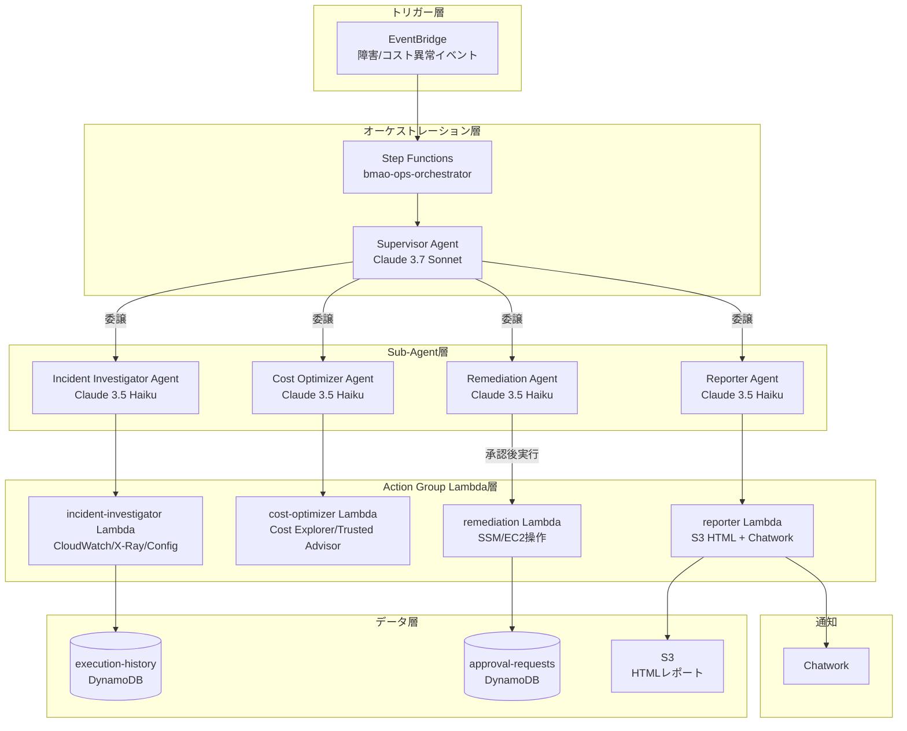

# 🤖 Bedrock Multi-Agent Ops Autopilot

> Amazon Bedrock Multi-Agent Collaborationで、AWS運用（障害対応・コスト最適化）を Supervisor Agentが自律的に判断・委譲・実行するシステム。

[\](https://www.terraform.io/)
[\](https://aws.amazon.com/)
[\](https://www.python.org/)
[\](./LICENSE)

## このハンズオンで得られること

このハンズオンを最後まで実施すると、次の内容を一通り体験できます。

- Amazon Bedrock Multi-Agent Collaboration を Terraform でデプロイする流れ
- Supervisor Agent と Sub-agent を組み合わせた運用自動化アーキテクチャの全体像
- Step Functions から Bedrock Agent を起動し、イベントを起点に処理を流す方法
- DynamoDB、S3、SSM Parameter Store、Lambda を組み合わせた周辺実装の確認ポイント
- Chatwork 通知、実行履歴、承認フローなど「運用で見るべき場所」の追い方

はじめて触る場合でも、README の手順どおりに進めれば「何を準備し、何を確認し、どこまで動けば成功か」が分かる構成にしています。

---

## アーキテクチャ



---

## 技術スタック

| カテゴリ | 技術 | 用途 |
|---|---|---|
| AI/LLM | Amazon Bedrock Claude 3.7 Sonnet | Supervisor Agent（状況判断・委譲） |
| AI/LLM | Amazon Bedrock Claude 3.5 Haiku | Sub-agents（実行コスト削減） |
| オーケストレーション | AWS Step Functions | エージェント実行制御・無限ループ防止 |
| イベント駆動 | Amazon EventBridge | 障害・コスト異常の自動検知トリガー |
| イベント駆動 | AWS Cost Anomaly Detection | コストスパイク検知 |
| コンピュート | AWS Lambda (Python 3.12, arm64) | Action Group実行基盤 |
| データストア | Amazon DynamoDB | 実行履歴・承認リクエスト管理 |
| ストレージ | Amazon S3 | 調査レポート（HTML）保存 |
| IaC | Terraform >= 1.7 | インフラ定義・プロビジョニング |
| 通知 | Chatwork API | アラート・承認要求通知 |
| セキュリティ | Amazon Bedrock Guardrails | 破壊的操作のシステムレベルブロック |
| モニタリング | AWS Lambda Powertools | 構造化ログ・トレーシング・メトリクス |
| リージョン | ap-northeast-1 | 東京リージョン固定 |

---

## 主な特徴

- **Supervisor + Sub-agentパターン**: Supervisor（Claude 3.7 Sonnet）が状況を判断し、専門化されたSub-agent（Claude 3.5 Haiku）へ委譲。役割分離によりコンテキスト肥大化を防止
- **Human-in-the-loop**: Remediation Agentによる破壊的操作（EC2停止・RDSスナップショット等）は、DynamoDB承認テーブルへ書き込み → Chatwork通知 → 人間が承認するまで実行を保留
- **Bedrock Guardrailsによる多層防御**: EC2インスタンス削除・RDS削除等をシステムレベルでブロック。LLMの判断ミスによる誤操作を防止
- **コスト最適化設計**: Sub-agentにHaikuを採用することでSonnet比約20倍のコスト削減。Step Functionsの最大反復回数でBedrockの無限ループを防止。月額$20以内を目標
- **完全なイベント駆動**: EventBridgeによる障害検知・コスト異常検知から、調査→修復→レポート通知まで全自動で実行

---

## ハンズオン

このハンズオンは、`ap-northeast-1` に Bedrock Multi-Agent Collaboration 構成をデプロイし、Step Functions から Supervisor Agent を起動して、イベント起点の実行フローを確認するための手順です。

「まず動かして全体像をつかむ」ことを目的に、準備、Plan、デプロイ後設定、動作確認、E2E テストまでを順番にまとめています。

### 0. このハンズオンのゴール

この README の手順を完了すると、少なくとも次の状態まで到達できます。

- Terraform で主要リソースを作成できる
- Step Functions から Supervisor Agent を起動できる
- `COST_ANOMALY` / `CLOUDWATCH_ALARM` イベントを手動投入して実行できる
- 実行結果を Step Functions、DynamoDB、CloudWatch Logs、S3、Chatwork で確認できる

### 1. 先に把握しておくこと

現状の実装は、構想上の完全自律運用フローより少し手前です。

- Step Functions は `Supervisor Agent を呼び出し、実行履歴を記録する` ところが中心です
- Remediation は Lambda 側で承認チェックを持っていますが、Step Functions に承認待ちループはまだありません
- Reporter Lambda は `/bmao/s3/reports_bucket` を SSM から参照するため、このパラメータは Terraform とは別に手動登録が必要です

実装ギャップの詳細は [ARCHITECTURE.md](./ARCHITECTURE.md) を参照してください。

### 2. 前提条件

作業を始める前に、次を満たしていることを確認してください。

- Terraform `>= 1.7`
- AWS CLI セットアップ済み
- 利用リージョンが `ap-northeast-1`
- Amazon Bedrock のモデルアクセス有効化済み
  - `anthropic.claude-3-7-sonnet-20250219-v1:0`
  - `anthropic.claude-haiku-3-5-20241022-v1:0`
- Chatwork の API Token と通知先 Room ID を取得済み
- AWS アカウントに以下の作成権限がある
  - Bedrock Agent / Guardrail
  - Lambda
  - Step Functions
  - EventBridge
  - DynamoDB
  - S3
  - SSM Parameter Store
  - IAM

### 3. 進め方の全体像

このハンズオンは、次の順番で進めると分かりやすいです。

1. リポジトリを取得する
2. Python venv と AWS 接続を確認する
3. Terraform を初期化して `plan` で差分を確認する
4. 内容を確認したうえで、ユーザー自身が `terraform apply` を実行する
5. SSM パラメータを実値に更新する
6. Step Functions を手動起動して結果を確認する
7. 必要に応じて E2E テストや承認フロー確認を行う

重要:

- `terraform apply` / `terraform destroy` は実際に AWS リソースを変更するため、必ずユーザー自身が実行してください
- README では実行コマンドを提示しますが、内容を確認したうえで進める前提です

### 4. リポジトリの取得

```bash
git clone https://github.com/your-username/bedrock-multi-agent-ops-autopilot.git
cd bedrock-multi-agent-ops-autopilot
```

### 5. Python venv の準備

このリポジトリでは Python を使う作業を `.venv` 前提で行います。まず仮想環境を作成し、有効化してください。

```bash
python3 -m venv .venv
source .venv/bin/activate
which python
```

`which python` の出力が `.venv/bin/python` を指していれば準備完了です。

補足:

- 現時点のリポジトリルートには `requirements.txt` はありません
- E2E テストを実行する段階で `boto3` や `pytest` が必要になった場合は、この `.venv` に追加でインストールします

### 6. AWS 接続確認

CLI が正しいアカウントとリージョンを向いていることを確認します。

```bash
aws sts get-caller-identity
aws configure get region
```

リージョンが `ap-northeast-1` でなければ、次で合わせてください。

```bash
aws configure set region ap-northeast-1
```

### 7. Terraform の事前確認

`terraform/` ディレクトリへ移動し、初期化と基本チェックを行います。

```bash
cd terraform
terraform init
terraform fmt -check -recursive
terraform validate
```

確認ポイント:

- backend の S3 設定はコメントアウトされているため、初回はローカル state で進みます
- `.terraform.lock.hcl` はすでに含まれています

### 8. `terraform plan` で作成内容を確認する

まずは差分確認だけを行い、何が作られるかを把握します。

```bash
terraform plan -var="environment=dev" -out=tfplan
```

主に作成されるもの:

- S3 レポートバケット
- DynamoDB テーブル 2 本
- Lambda 4 本
- Bedrock Guardrail
- Bedrock Agents
- Step Functions
- EventBridge ルール
- SSM パラメータの初期値

ここで、特に次を確認しておくと安心です。

- リージョンが `ap-northeast-1` になっていること
- 想定外の削除や更新が含まれていないこと
- `state_machine_arn` や `s3_reports_bucket_name` など、後続で使う output が定義されていること

### 9. `terraform apply` はユーザー自身で実行する

Plan の内容に問題がなければ、次のコマンドをユーザー自身で実行してください。

```bash
terraform apply tfplan
```

apply 完了後は、続けて output を確認します。

```bash
terraform output
terraform output -raw state_machine_arn
terraform output -raw s3_reports_bucket_name
terraform output -raw dynamodb_execution_history_table_name
terraform output -raw dynamodb_approval_requests_table_name
```

この時点で控えておくと便利な値:

- `state_machine_arn`
- `s3_reports_bucket_name`
- `dynamodb_execution_history_table_name`
- `dynamodb_approval_requests_table_name`

### 10. SSM パラメータを実値に更新する

Terraform で作成される SSM パラメータにはダミー値が入るため、実際に使う値へ更新します。

まず、レポート保存先の S3 バケット名を変数に入れます。

```bash
REPORTS_BUCKET=$(terraform output -raw s3_reports_bucket_name)
echo "$REPORTS_BUCKET"
```

次に、必要なパラメータを登録または上書きします。

```bash
aws ssm put-parameter \
  --name "/bmao/chatwork/api_token" \
  --value "YOUR_CHATWORK_API_TOKEN" \
  --type "SecureString" \
  --overwrite \
  --region ap-northeast-1

aws ssm put-parameter \
  --name "/bmao/chatwork/room_id" \
  --value "YOUR_CHATWORK_ROOM_ID" \
  --type "SecureString" \
  --overwrite \
  --region ap-northeast-1

aws ssm put-parameter \
  --name "/bmao/s3/reports_bucket" \
  --value "$REPORTS_BUCKET" \
  --type "String" \
  --overwrite \
  --region ap-northeast-1
```

補足:

- `/bmao/s3/reports_bucket` は `lambda/reporter/handler.py` が参照するため必須です
- `room_id` も SecureString でそろえておくと管理しやすくなります

### 11. デプロイ結果を確認する

まずは付属スクリプトで、主要リソースがそろっているかをまとめて確認します。

```bash
cd /home/takuya/terraform-lab/bedrock-multi-agent-ops-autopilot
./scripts/verify_deploy.sh
```

このスクリプトでは主に次を確認します。

- Lambda 関数 4 本の存在
- Bedrock Agents の一覧
- DynamoDB テーブル 2 本の存在
- Step Functions の ARN
- S3 レポートバケットの存在
- Chatwork 用 SSM パラメータの存在

個別に確認したい場合は、次のコマンドも使えます。

```bash
aws bedrock-agent list-agents \
  --region ap-northeast-1 \
  --query 'agentSummaries[?contains(agentName, `bmao`)]'

aws stepfunctions list-state-machines \
  --region ap-northeast-1 \
  --query 'stateMachines[?contains(name, `bmao`)]'

aws dynamodb list-tables \
  --region ap-northeast-1 \
  --query 'TableNames[?contains(@, `bmao`)]'
```

### 12. Step Functions を手動起動して動作確認する

まず State Machine ARN を変数に入れます。

```bash
cd /home/takuya/terraform-lab/bedrock-multi-agent-ops-autopilot/terraform
STATE_MACHINE_ARN=$(terraform output -raw state_machine_arn)
echo "$STATE_MACHINE_ARN"
```

重要:

- 現在の入力形式は `task_type` / `context` ではありません
- `event_type` と `event_detail` を含む JSON を渡してください

#### 12-1. コスト異常イベントをテストする

```bash
aws stepfunctions start-execution \
  --state-machine-arn "$STATE_MACHINE_ARN" \
  --name "manual-cost-$(date +%Y%m%d%H%M%S)" \
  --input '{
    "event_type": "COST_ANOMALY",
    "event_detail": {
      "anomaly_id": "manual-test-001",
      "total_impact_usd": "55.00"
    }
  }' \
  --region ap-northeast-1
```

#### 12-2. CloudWatch アラームイベントをテストする

```bash
aws stepfunctions start-execution \
  --state-machine-arn "$STATE_MACHINE_ARN" \
  --name "manual-alarm-$(date +%Y%m%d%H%M%S)" \
  --input '{
    "event_type": "CLOUDWATCH_ALARM",
    "event_detail": {
      "alarm_name": "test-high-cpu",
      "state": "ALARM",
      "reason": "CPU > 80% for 5 minutes"
    }
  }' \
  --region ap-northeast-1
```

### 13. 実行結果を確認する

Step Functions の直近実行を確認します。

```bash
aws stepfunctions list-executions \
  --state-machine-arn "$STATE_MACHINE_ARN" \
  --max-results 10 \
  --region ap-northeast-1
```

特定実行の詳細を見たい場合:

```bash
EXECUTION_ARN="<Step Functions の executionArn>"

aws stepfunctions describe-execution \
  --execution-arn "$EXECUTION_ARN" \
  --region ap-northeast-1
```

次に、DynamoDB に実行履歴が記録されていることを確認します。

```bash
aws dynamodb query \
  --table-name bmao-execution-history \
  --index-name status-index \
  --key-condition-expression "#s = :status" \
  --expression-attribute-names '{"#s": "status"}' \
  --expression-attribute-values '{":status": {"S": "SUCCEEDED"}}' \
  --region ap-northeast-1
```

ログ確認は次の順で見ると追いやすいです。

```bash
aws logs tail /aws/stepfunctions/bmao-ops-orchestrator \
  --follow \
  --region ap-northeast-1
```

必要に応じて Lambda 側も確認します。

```bash
aws logs tail /aws/lambda/bmao-cost-optimizer --follow --region ap-northeast-1
aws logs tail /aws/lambda/bmao-incident-investigator --follow --region ap-northeast-1
aws logs tail /aws/lambda/bmao-remediation --follow --region ap-northeast-1
aws logs tail /aws/lambda/bmao-reporter --follow --region ap-northeast-1
```

### 14. Reporter / Chatwork の確認

Reporter が実行されるケースでは、次を確認します。

- Chatwork に通知が届くこと
- S3 に HTML レポートが出力されること

S3 レポート確認:

```bash
aws s3 ls "s3://${REPORTS_BUCKET}/" \
  --recursive \
  --human-readable \
  --summarize \
  --region ap-northeast-1
```

### 15. 承認フローを試す場合

Remediation が承認リクエストを発行した場合は、DynamoDB `bmao-approval-requests` を確認します。

承認待ち一覧:

```bash
aws dynamodb scan \
  --table-name bmao-approval-requests \
  --filter-expression "#s = :pending" \
  --expression-attribute-names '{"#s": "status"}' \
  --expression-attribute-values '{":pending": {"S": "pending_approval"}}' \
  --region ap-northeast-1
```

承認:

```bash
REQUEST_ID="<request_idをここに入力>"

aws dynamodb update-item \
  --table-name bmao-approval-requests \
  --key "{\"request_id\": {\"S\": \"${REQUEST_ID}\"}}" \
  --update-expression "SET #s = :approved, approved_by = :approver, approved_at = :ts" \
  --expression-attribute-names '{"#s": "status"}' \
  --expression-attribute-values "{
    \":approved\": {\"S\": \"approved\"},
    \":approver\": {\"S\": \"$(whoami)\"},
    \":ts\": {\"S\": \"$(date -u +%Y-%m-%dT%H:%M:%SZ)\"}
  }" \
  --region ap-northeast-1
```

却下:

```bash
aws dynamodb update-item \
  --table-name bmao-approval-requests \
  --key "{\"request_id\": {\"S\": \"${REQUEST_ID}\"}}" \
  --update-expression "SET #s = :rejected" \
  --expression-attribute-names '{"#s": "status"}' \
  --expression-attribute-values '{":rejected": {"S": "rejected"}}' \
  --region ap-northeast-1
```

重要:

- Lambda 実装は `approved` / `rejected` / `pending_approval` の小文字値を期待します
- `APPROVED` のような大文字値にすると、承認済みと判定されません

### 16. E2E テストを実行する

デプロイ済み環境に対して統合テストを流す場合の例です。

```bash
cd /home/takuya/terraform-lab/bedrock-multi-agent-ops-autopilot
source .venv/bin/activate
pip install boto3 pytest
python tests/integration/test_e2e.py
```

注意:

- このテストはモックではなく AWS 実環境を利用します
- Bedrock Agent、Step Functions、DynamoDB が正しく作成済みである必要があります
- Python パッケージの追加インストールは、必ず `.venv` を有効化した状態で行ってください

### 17. 後片付け

不要になったら、次のコマンドをユーザー自身で実行して削除できます。

```bash
cd /home/takuya/terraform-lab/bedrock-multi-agent-ops-autopilot/terraform
terraform destroy -var="environment=dev"
```

S3 バケットにオブジェクトが残っていると `destroy` に失敗する場合があります。その場合は、先にバケット内を空にしてから再実行してください。

---

## ディレクトリ構造

```
bedrock-multi-agent-ops-autopilot/
├── README.md
├── CLAUDE.md                        # AI開発ガイドライン
├── terraform/
│   ├── main.tf
│   ├── variables.tf
│   ├── outputs.tf
│   ├── locals.tf
│   └── modules/
│       ├── foundation/              # IAM, S3, DynamoDB, SSM, EventBridge
│       ├── agents/                  # Bedrock Agent定義・Guardrails
│       ├── lambda/                  # Action Group Lambda群
│       └── stepfunctions/           # Step Functionsオーケストレーター
├── lambda/
│   ├── incident_investigator/       # CloudWatch/X-Ray/Config調査
│   ├── cost_optimizer/              # Cost Explorer/Trusted Advisor分析
│   ├── remediation/                 # SSM/EC2/Lambda操作
│   └── reporter/                   # S3 HTMLレポート + Chatwork通知
├── agents/
│   ├── supervisor/
│   │   └── instruction.txt          # Supervisor Agent指示プロンプト
│   ├── incident_investigator/
│   │   ├── instruction.txt
│   │   └── openapi.yaml
│   ├── cost_optimizer/
│   │   ├── instruction.txt
│   │   └── openapi.yaml
│   ├── remediation/
│   │   ├── instruction.txt
│   │   └── openapi.yaml
│   └── reporter/
│       ├── instruction.txt
│       └── openapi.yaml
├── docs/
│   ├── architecture.md              # Mermaidアーキテクチャ図
│   ├── runbook.md                   # 運用手順書
│   ├── zenn-article-draft.md        # Zenn技術記事下書き
│   └── adr/                         # Architecture Decision Records
│       └── ADR-001-multi-agent-pattern.md
├── stepfunctions/
│   └── ops_orchestrator.asl.json    # State Machine定義
└── tests/
    ├── unit/
    └── integration/
```

---

## 設計の考え方

### Architecture Decision Records

主要な設計判断は `docs/adr/` にADR（Architecture Decision Record）として記録しています。

- **ADR-001**: マルチエージェントパターンの採用理由（単一エージェントの限界、役割分離のメリット）

### Human-in-the-loop

Remediation Agentが破壊的操作（EC2停止・RDSスナップショット取得・Lambda設定変更等）を実行する際は、**必ず人間の承認が必要**な設計にしています。

1. Remediation Agentが `approval-requests` DynamoDBテーブルに承認リクエストを書き込む
2. Remediation LambdaがChatworkで承認依頼を通知
3. 人間がDynamoDBテーブルのステータスを `approved` に更新
4. 承認済みの場合のみ Remediation Lambda が SSM 実行を許可

### Bedrock Guardrails

EC2インスタンス削除・RDS削除・IAMポリシー変更等の高リスク操作は、Bedrock Guardrailsによってシステムレベルでブロックされます。これにより、LLMの判断ミスによる意図しない破壊的操作を防止します。

---

## コスト設計

月額 **$20以内** を目標とした設計：

| 工夫 | 効果 |
|---|---|
| Sub-agentにClaude 3.5 Haikuを使用 | Sonnet比で約1/20のコスト |
| Supervisorは短いルーティング判断のみ | Sonnetのトークン消費を最小化 |
| Step Functionsで最大反復回数を設定 | 無限ループによるコスト爆発を防止 |
| EventBridgeで不要なトリガーをフィルタリング | 誤検知による無駄な実行を削減 |
| CloudWatch Logsの保持期間を14日に設定 | ストレージコストを削減 |

---

## ライセンス

MIT License - 詳細は [LICENSE](./LICENSE) を参照してください。
