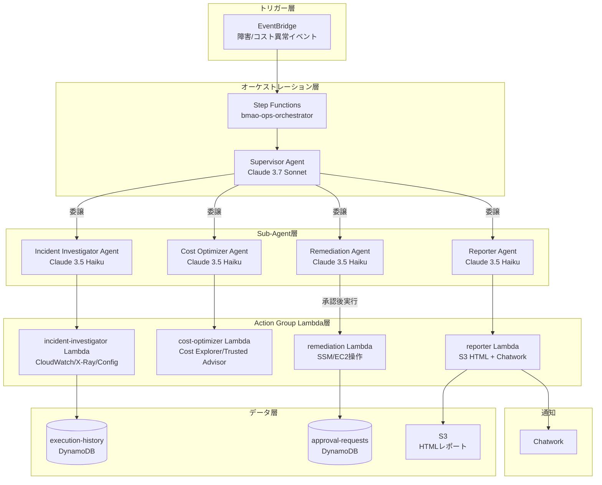

# アーキテクチャ概要

## システム構成図

## コンポーネント説明

| コンポーネント | モデル | 役割 |
|---|---|---|
| Supervisor Agent | Claude 3.7 Sonnet | 状況判断・Sub-agent委譲 |
| Incident Investigator | Claude 3.5 Haiku | CloudWatch/X-Ray調査 |
| Cost Optimizer | Claude 3.5 Haiku | コスト分析・最適化提案 |
| Remediation Agent | Claude 3.5 Haiku | SSM/EC2修復操作（承認後） |
| Reporter Agent | Claude 3.5 Haiku | HTMLレポート生成・Chatwork通知 |

## インフラ構成（Phase 1 基盤）

- **S3**: `bmao-reports-{account_id}` — HTMLレポート保存、Presigned URL配布
- **DynamoDB**: `bmao-execution-history` — Agent実行履歴管理
- **DynamoDB**: `bmao-approval-requests` — Human-in-the-loop承認フロー
- **SSM Parameter Store**: Chatwork認証情報・設定値の安全な管理
- **IAM**: Lambda共通ロール・Supervisor Agent専用ロール
- **CloudWatch Logs**: 全Lambda・Step Functionsのログ集約（14日保持）
