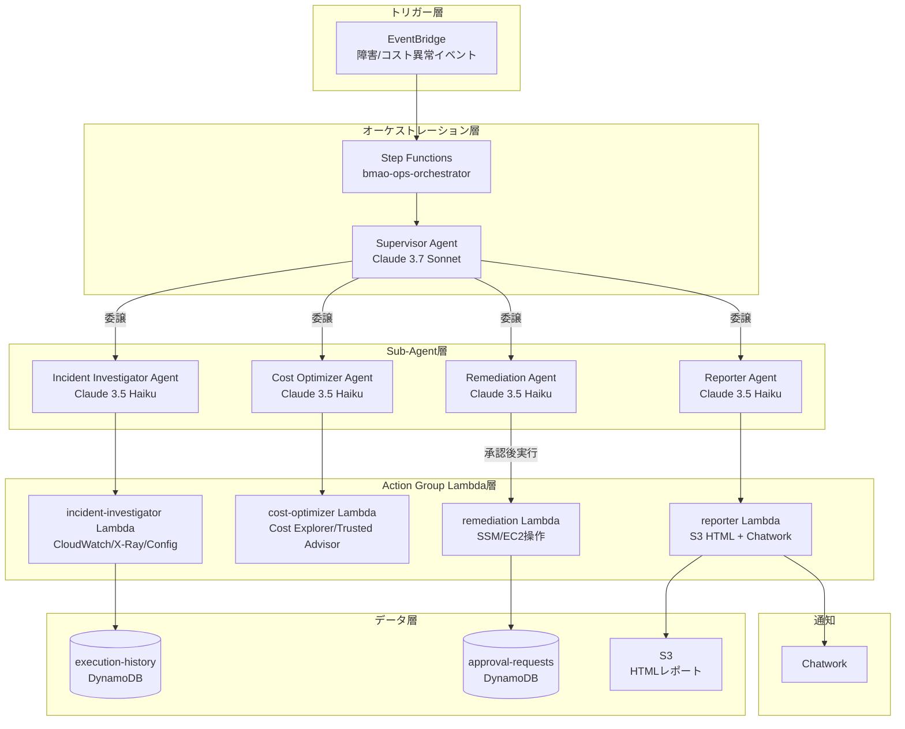

## はじめに

AWSのインフラ運用をしていると、深夜の障害アラート対応やコストスパイクの調査など、人間が手動で対応しなければならない定型的な作業が積み重なります。「このCloudWatchアラームが上がったらX-Rayでトレースを確認して、コストが急増したらCost Explorerで原因を調査して…」という手順は、ある程度パターン化できるにもかかわらず、毎回人間が介在しています。

そこで、**Amazon Bedrock Multi-Agent Collaboration**を使ってAWS運用タスクを自律化するシステムを構築しました。

### なぜマルチエージェントが必要か？

最初は「単一のBedrockエージェントで全部やればいいのでは？」と思っていましたが、すぐに壁にぶつかりました。

**単一エージェントの限界:**

- **コンテキスト長の問題**: CloudWatchログ・X-Rayトレース・Cost Explorerデータ・SSM実行結果を1つのエージェントに渡すと、コンテキストがすぐに肥大化する
- **役割の混在**: 「調査」「修復」「報告」が混在すると、プロンプト設計が複雑になり品質が落ちる
- **コスト**: すべてにClaude 3.7 Sonnetを使うと高コストになる

**マルチエージェントで解決:**

```
Supervisor（全体判断・委譲）
    ↓ 専門エージェントに分業
Incident Investigator（調査に特化）
Cost Optimizer（コスト分析に特化）
Remediation（修復操作に特化）
Reporter（報告に特化）
```

役割を分離することで、各エージェントのプロンプトがシンプルになり、品質・コスト・保守性が向上しました。

---

## システムアーキテクチャ



### Supervisor + Sub-agentパターンを選んだ理由

Bedrock Multi-Agent Collaborationには複数の構成パターンがありますが、本システムでは**Supervisor/Sub-agent**パターンを採用しました。

| パターン | 特徴 | 採用理由 |
|---|---|---|
| 単一エージェント | シンプル | コンテキスト肥大化の問題 |
| ピアツーピア | 柔軟 | 制御が難しく、ループリスクがある |
| **Supervisor/Sub-agent** | **中央集権的な制御** | **判断と実行を分離、コスト最適化** |

SupervisorにはClaude 3.7 Sonnet（高い推論能力）、Sub-agentsにはClaude 3.5 Haiku（高速・低コスト）を採用することで、品質とコストを両立させています。

---

## 実装のポイント

### 1. TerraformでのBedrock Agent Collaborator定義

Bedrock Multi-Agent CollaborationをTerraformで定義する際、`aws_bedrockagent_agent` と `aws_bedrockagent_agent_collaborator` リソースを組み合わせます。

```hcl
# Sub-agent (Incident Investigator) の定義
resource "aws_bedrockagent_agent" "incident_investigator" {
  agent_name              = "bmao-incident-investigator"
  agent_resource_role_arn = aws_iam_role.incident_investigator_agent_role.arn
  # Sub-agentはコスト削減のためHaikuを使用
  foundation_model        = "anthropic.claude-3-5-haiku-20241022-v1:0"
  description             = "CloudWatch/X-Ray/Configを調査し、障害の根本原因を特定するエージェント"

  instruction = file("${path.module}/../../agents/incident_investigator/instruction.txt")

  # セッション間のコンテキスト保持
  memory_configuration {
    enabled_memory_types = ["SESSION_SUMMARY"]
    storage_days         = 30
  }
}

# Supervisor Agentへの紐付け（Collaborator登録）
resource "aws_bedrockagent_agent_collaborator" "incident_investigator" {
  agent_id          = aws_bedrockagent_agent.supervisor.id
  agent_version     = "DRAFT"
  collaboration_instruction = "障害調査が必要な場合はこのエージェントに委譲する。CloudWatchアラーム名、リソースID、時刻範囲を必ず渡すこと。"
  relay_conversation_history = "TO_COLLABORATOR"

  agent_descriptor {
    # Collaborator AgentのAliasARNを指定
    alias_arn = aws_bedrockagent_agent_alias.incident_investigator.agent_alias_arn
  }
}

# Supervisor Agent（Claude 3.7 Sonnet）
resource "aws_bedrockagent_agent" "supervisor" {
  agent_name              = "bmao-supervisor"
  agent_resource_role_arn = aws_iam_role.supervisor_agent_role.arn
  # SupervisorはSonnetで高品質な判断を実施
  foundation_model        = "anthropic.claude-3-7-sonnet-20250219-v1:0"

  # マルチエージェント協調を有効化
  agent_collaboration = "SUPERVISOR"

  instruction = file("${path.module}/../../agents/supervisor/instruction.txt")

  # Guardrailsを適用（破壊的操作のブロック）
  guardrail_configuration {
    guardrail_identifier = aws_bedrock_guardrail.bmao_guardrail.guardrail_id
    guardrail_version    = aws_bedrock_guardrail_version.bmao_guardrail_version.version
  }
}
```

**ポイント:** `relay_conversation_history = "TO_COLLABORATOR"` を設定することで、Supervisorの会話コンテキストがSub-agentに引き継がれます。これにより、Sub-agentが「なぜ自分が呼ばれたか」を理解した上で処理できます。

### 2. Human-in-the-loop設計

修復操作（EC2インスタンス停止・RDSスナップショット取得等）は、人間の承認なしに実行されないよう設計しています。

**承認フロー:**

1. Remediation AgentのLambdaが `approval-requests` DynamoDBテーブルに書き込む
2. Reporter AgentがChatworkに承認依頼を通知
3. 人間がDynamoDBのステータスを `APPROVED` or `REJECTED` に更新
4. Step FunctionsのWait Stateがポーリングして承認を確認
5. 承認後に修復Lambdaを実行

```python
# lambda/remediation/handler.py（承認リクエスト書き込み部分）
import boto3
import json
import urllib.request
import urllib.parse
import os
from datetime import datetime, timezone, timedelta
from aws_lambda_powertools import Logger, Tracer

logger = Logger()
tracer = Tracer()

dynamodb = boto3.resource("dynamodb", region_name="ap-northeast-1")
ssm = boto3.client("ssm", region_name="ap-northeast-1")


@tracer.capture_method
def request_approval(operation: str, resource_id: str, details: dict) -> str:
    """
    破壊的操作の前に人間の承認を要求する。
    DynamoDBへの書き込みとChatwork通知を行う。
    """
    table = dynamodb.Table("bmao-approval-requests")
    approval_id = f"approval-{datetime.now(timezone.utc).strftime('%Y%m%d%H%M%S')}-{resource_id}"

    # 承認タイムアウト: 1時間
    ttl = int((datetime.now(timezone.utc) + timedelta(hours=1)).timestamp())

    # DynamoDBに承認リクエストを書き込む
    table.put_item(
        Item={
            "approval_id": approval_id,
            "status": "PENDING",
            "operation": operation,
            "resource_id": resource_id,
            "details": details,
            "requested_at": datetime.now(timezone.utc).isoformat(),
            "ttl": ttl,
        }
    )
    logger.info(f"承認リクエストを作成しました: {approval_id}")

    # SSMからChatwork認証情報を取得
    token_param = ssm.get_parameter(Name="/bmao/chatwork/token", WithDecryption=True)
    room_id_param = ssm.get_parameter(Name="/bmao/chatwork/room_id")
    chatwork_token = token_param["Parameter"]["Value"]
    room_id = room_id_param["Parameter"]["Value"]

    # Chatworkに承認依頼を通知
    # Chatwork APIはapplication/x-www-form-urlencodedを使用（JSONではない）
    message = (
        f"[info][title]🔴 修復操作の承認が必要です[/title]\n"
        f"操作: {operation}\n"
        f"対象リソース: {resource_id}\n"
        f"詳細: {json.dumps(details, ensure_ascii=False, indent=2)}\n\n"
        f"承認する場合は以下のコマンドを実行してください:\n"
        f"aws dynamodb update-item \\\n"
        f"  --table-name bmao-approval-requests \\\n"
        f"  --key '{{\"approval_id\": {{\"S\": \"{approval_id}\"}}}}' \\\n"
        f"  --update-expression 'SET #s = :approved' \\\n"
        f"  --expression-attribute-names '{{\"#s\": \"status\"}}' \\\n"
        f"  --expression-attribute-values '{{\":approved\": {{\"S\": \"APPROVED\"}}}}' \\\n"
        f"  --region ap-northeast-1\n"
        f"[/info]"
    )

    data = urllib.parse.urlencode({"body": message}).encode("utf-8")
    req = urllib.request.Request(
        f"https://api.chatwork.com/v2/rooms/{room_id}/messages",
        data=data,
        headers={
            "X-ChatWorkToken": chatwork_token,
            "Content-Type": "application/x-www-form-urlencoded",
        },
        method="POST",
    )
    with urllib.request.urlopen(req) as response:
        logger.info(f"Chatwork通知完了: {response.status}")

    return approval_id
```

### 3. Bedrock Guardrailsで安全を担保

LLMの判断ミスによる誤操作を防ぐため、Bedrock Guardrailsで高リスク操作をシステムレベルでブロックします。

```hcl
# Bedrock Guardrailsの定義
resource "aws_bedrock_guardrail" "bmao_guardrail" {
  name        = "bmao-ops-guardrail"
  description = "AWS運用自動化エージェントの安全ガード"

  # 禁止トピックの設定（破壊的操作のブロック）
  topic_policy_config {
    topics_config {
      name       = "ec2-instance-termination"
      definition = "EC2インスタンスの削除・終了操作"
      examples = [
        "EC2インスタンスを削除してください",
        "terminate-instances",
        "DeleteInstance",
      ]
      type = "DENY"
    }

    topics_config {
      name       = "rds-deletion"
      definition = "RDSインスタンスやクラスターの削除操作"
      examples = [
        "RDSインスタンスを削除してください",
        "delete-db-instance",
        "DeleteDBCluster",
      ]
      type = "DENY"
    }

    topics_config {
      name       = "iam-privilege-escalation"
      definition = "IAMポリシーの変更や管理者権限の付与"
      examples = [
        "AdministratorAccessを付与してください",
        "attach-role-policy",
      ]
      type = "DENY"
    }
  }

  # 機密情報のマスキング
  sensitive_information_policy_config {
    pii_entities_config {
      type   = "AWS_ACCESS_KEY"
      action = "BLOCK"
    }
    pii_entities_config {
      type   = "AWS_SECRET_KEY"
      action = "BLOCK"
    }
  }

  blocked_input_messaging  = "この操作はセキュリティポリシーにより許可されていません。承認フローを使用してください。"
  blocked_outputs_messaging = "出力にセキュリティ上の問題が検出されました。"
}
```

### 4. Step FunctionsとBedrockの統合

Step Functionsの組み込みBedrock統合（`arn:aws:states:::bedrock:invokeAgent`）を使うと、Lambda不要でBedrockエージェントを直接呼び出せます。ただし、Throttlingへの対策が重要です。

```json
{
  "InvokeSupervisorAgent": {
    "Type": "Task",
    "Resource": "arn:aws:states:::bedrock:invokeAgent",
    "Parameters": {
      "AgentId.$": "$.agent_id",
      "AgentAliasId.$": "$.agent_alias_id",
      "SessionId.$": "$.session_id",
      "InputText.$": "$.task_description"
    },
    "ResultPath": "$.agent_response",
    "Retry": [
      {
        "ErrorEquals": [
          "Bedrock.ThrottlingException",
          "Bedrock.ServiceQuotaExceededException"
        ],
        "IntervalSeconds": 5,
        "MaxAttempts": 3,
        "BackoffRate": 2.0,
        "JitterStrategy": "FULL"
      },
      {
        "ErrorEquals": [
          "Bedrock.BedrockException",
          "States.TaskFailed"
        ],
        "IntervalSeconds": 10,
        "MaxAttempts": 2,
        "BackoffRate": 1.5
      }
    ],
    "Catch": [
      {
        "ErrorEquals": ["States.ALL"],
        "Next": "HandleError",
        "ResultPath": "$.error"
      }
    ],
    "Next": "CheckApprovalRequired"
  },
  "WaitForApproval": {
    "Type": "Wait",
    "Seconds": 60,
    "Next": "CheckApprovalStatus"
  },
  "CheckApprovalStatus": {
    "Type": "Task",
    "Resource": "arn:aws:states:::dynamodb:getItem",
    "Parameters": {
      "TableName": "bmao-approval-requests",
      "Key": {
        "approval_id": {
          "S.$": "$.approval_id"
        }
      }
    },
    "ResultPath": "$.approval_result",
    "Next": "IsApproved"
  },
  "IsApproved": {
    "Type": "Choice",
    "Choices": [
      {
        "Variable": "$.approval_result.Item.status.S",
        "StringEquals": "APPROVED",
        "Next": "ExecuteRemediation"
      },
      {
        "Variable": "$.approval_result.Item.status.S",
        "StringEquals": "REJECTED",
        "Next": "ApprovalRejected"
      }
    ],
    "Default": "WaitForApproval"
  }
}
```

**Throttling対策のポイント:**
- `JitterStrategy: "FULL"` でリトライ間隔にランダム性を加え、同時リクエストの集中を防ぐ
- `BackoffRate: 2.0` で指数バックオフ
- ThrottlingとServiceQuotaExceededを別々に処理

---

## コスト設計

月額 **$20以内** を目標とした設計の詳細：

| コスト要因 | 工夫 | 見積もり |
|---|---|---|
| Bedrock Supervisor | Sonnetは短いルーティング判断のみ（〜500トークン/回） | ~$3/月 |
| Bedrock Sub-agents | Haikuを採用（Sonnet比で入力$0.25/$3.00/Mトークン） | ~$5/月 |
| Lambda実行 | arm64でx86比40%コスト削減 | ~$1/月 |
| Step Functions | Express Workflowで低コスト実行 | ~$1/月 |
| DynamoDB | オンデマンドモード（低頻度アクセス） | ~$1/月 |
| S3 + CloudWatch | レポート保存・ログ（14日保持） | ~$2/月 |
| **合計** | | **~$13/月** |

**無限ループ防止:**

```hcl
# Step FunctionsでBedrockへの最大呼び出し回数を制限
resource "aws_sfn_state_machine" "bmao_ops_orchestrator" {
  # ...
  # definition内でIteratorに最大回数を設定
}
```

EventBridgeのルールで、同一リソースに対するトリガーを**5分以内に1回**に制限することで、誤検知による連続実行も防いでいます。

---

## ハマったポイントと解決策

### 1. Bedrock Agent CollaboratorのARN形式

TerraformでCollaboratorを登録する際、`alias_arn` は `agent_alias_arn`（`arn:aws:bedrock:...:agent-alias/...`）を指定する必要があります。`agent_arn` を指定するとエラーになります。

```hcl
# NG: agent_arn を指定してしまうケース
agent_descriptor {
  alias_arn = aws_bedrockagent_agent.incident_investigator.agent_arn  # エラー
}

# OK: agent_alias_arn を指定
agent_descriptor {
  alias_arn = aws_bedrockagent_agent_alias.incident_investigator.agent_alias_arn
}
```

### 2. Chatwork APIはapplication/x-www-form-urlencoded

Chatwork APIはSlackのWebhookと異なり、**JSON形式ではなく `application/x-www-form-urlencoded`** でリクエストを送る必要があります。最初にJSONで実装してしまい、400エラーが返り続けました。

```python
# NG: JSON形式（400エラーになる）
data = json.dumps({"body": message}).encode("utf-8")
headers = {"Content-Type": "application/json"}

# OK: application/x-www-form-urlencoded
data = urllib.parse.urlencode({"body": message}).encode("utf-8")
headers = {"Content-Type": "application/x-www-form-urlencoded"}
```

### 3. Step Functions + Bedrockのスロットリング

Step Functionsから直接Bedrockを呼び出す場合、Bedrockのデフォルトクォータ（`InvokeAgent`: 10 RPS）に引っかかりやすいです。`JitterStrategy: "FULL"` のリトライ設定を必ず入れましょう。また、本番環境ではService Quotasから上限緩和申請することを推奨します。

### 4. DynamoDB承認テーブルの競合状態

Step FunctionsのWait StateがDynamoDBをポーリングする間に、複数のStep Functions実行が同じ承認IDを参照してしまう問題が発生しました。承認IDにセッションIDを含めることで一意性を確保しました。

```python
# セッションIDを含む一意な承認IDを生成
approval_id = f"approval-{session_id}-{operation}-{int(datetime.now().timestamp())}"
```

---

## まとめ

Amazon Bedrock Multi-Agent Collaborationを使って、以下を実現しました：

- **障害検知から調査・修復・報告まで**の自動化フロー
- **Human-in-the-loop**による破壊的操作の安全制御
- **Bedrock Guardrails**による多層防御
- **月額$20以内**のコスト効率的な設計

マルチエージェントパターンは、単一エージェントに比べて初期実装コストはかかりますが、各エージェントの責務が明確になることで、保守性・品質・コストのバランスが取りやすくなります。

**今後の拡張:**

- [ ] Auto Scaling対応エージェントの追加（CPU高騰時の自動スケールアウト）
- [ ] セキュリティ調査エージェント（GuardDuty/Security Hub連携）
- [ ] 複数AWSアカウント対応（Organizations経由のクロスアカウント実行）
- [ ] Bedrock Knowledge Basesとの統合（過去の障害対応ナレッジ活用）

コードはGitHubで公開しています。フィードバックお待ちしています！
