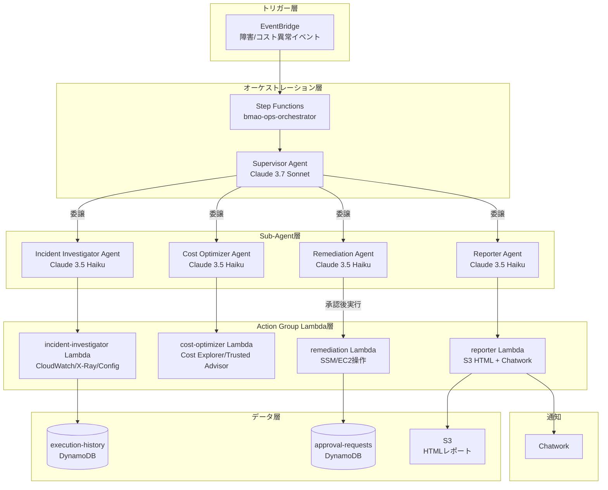

# ✅Phase 1: 基盤インフラ構築

## このフェーズで作成するもの

Bedrock Multi-Agent Ops Autopilotの基盤となるAWSリソースをTerraformで実装する。

---

## 前提確認

- プロジェクトルート: `bedrock-multi-agent-ops-autopilot/`
- CLAUDE.mdをすでに読み込んでいること
- リージョン: `ap-northeast-1`
- Terraformバージョン: >= 1.7

---

## タスク一覧

### 1. ディレクトリ構造の作成

CLAUDE.mdに記載のディレクトリ構造をすべて作成すること。
各ディレクトリに `.gitkeep` を配置（空ディレクトリ保持用）。

### 2. terraform/locals.tf の作成

以下を定義すること:

```hcl
locals {
  prefix      = "bmao"
  environment = var.environment
  region      = "ap-northeast-1"
  account_id  = data.aws_caller_identity.current.account_id

  common_tags = {
    Project     = "bedrock-multi-agent-ops-autopilot"
    Environment = var.environment
    ManagedBy   = "terraform"
    Owner       = "takuya"
  }
}
```

### 3. terraform/variables.tf の作成

以下の変数を定義:
- `environment`: string, default = "dev"
- `chatwork_room_id`: string, sensitive = true（SSM経由で管理）
- `alert_threshold_cost_usd`: number, default = 50（コスト異常検知の閾値）

### 4. terraform/modules/foundation/ の実装

以下のリソースをすべて実装すること:

#### S3バケット（レポート保存用）
- バケット名: `${local.prefix}-reports-${local.account_id}`
- パブリックアクセスブロック: すべて有効
- バージョニング: 有効
- ライフサイクル: 90日後にGlacierへ移行、365日後に削除
- SSE-S3暗号化
- 日本語コメント: 「HTMLレポートをPresigned URLで配布するためのバケット」

#### DynamoDBテーブル（実行履歴）
- テーブル名: `${local.prefix}-execution-history`
- パーティションキー: `execution_id` (S)
- ソートキー: `timestamp` (S)
- TTL属性: `ttl`（30日で自動削除）
- PAYモード（オンデマンド）
- GSI: `status-index`（status属性でクエリ可能）
- 日本語コメント: 「Agent実行履歴とHuman-in-the-loop承認状態を管理するテーブル」

#### DynamoDBテーブル（承認フロー）
- テーブル名: `${local.prefix}-approval-requests`
- パーティションキー: `request_id` (S)
- TTL属性: `ttl`（24時間で自動削除）
- PAYモード
- 日本語コメント: 「Remediationの実行前に人間承認を記録するテーブル。TTLで未承認リクエストを自動破棄」

#### SSM Parameter Store
以下のパラメータを作成（値はダミー、後から手動更新）:
- `/bmao/chatwork/room_id`: SecureString, value = "REPLACE_ME"
- `/bmao/chatwork/api_token`: SecureString, value = "REPLACE_ME"
- `/bmao/config/cost_threshold_usd`: String, value = "50"

#### IAM: Lambda共通実行ロールベース
- ロール名: `${local.prefix}-lambda-base-role`
- 信頼ポリシー: `lambda.amazonaws.com`
- アタッチするマネージドポリシー:
  - `AWSLambdaBasicExecutionRole`
  - `AWSXRayDaemonWriteAccess`
- インラインポリシー（最小権限）:
  - SSM: `GetParameter`, `GetParameters` on `/bmao/*`
  - DynamoDB: `PutItem`, `GetItem`, `UpdateItem`, `Query` on 上記2テーブル
  - S3: `PutObject`, `GetObject` on `${local.prefix}-reports-*`
  - 日本語コメント: 「全LambdaがChatwork通知・DynamoDB記録・S3レポート保存に必要な最小権限」

#### IAM: Bedrock Agent実行ロール（Supervisor用）
- ロール名: `${local.prefix}-supervisor-agent-role`
- 信頼ポリシー: `bedrock.amazonaws.com`
- インラインポリシー:
  - `bedrock:InvokeAgent` on `arn:aws:bedrock:ap-northeast-1:*:agent-alias/*`
  - `bedrock:InvokeModel` on Claude 3.7 SonnetのARN
  - 日本語コメント: 「SupervisorがSub-agentを呼び出すための権限。エージェントエイリアスARNを限定」

#### CloudWatch Logs ロググループ
以下を事前作成（保持期間14日）:
- `/aws/lambda/bmao-incident-investigator`
- `/aws/lambda/bmao-cost-optimizer`
- `/aws/lambda/bmao-remediation`
- `/aws/lambda/bmao-reporter`
- `/aws/stepfunctions/bmao-ops-orchestrator`

### 5. terraform/main.tf の作成

以下を含めること:
```hcl
terraform {
  required_version = ">= 1.7"
  required_providers {
    aws = {
      source  = "hashicorp/aws"
      version = ">= 5.0"
    }
  }
  # S3バックエンド（本番環境では有効化）
  # backend "s3" {
  #   bucket = "tfstate-bmao-{account_id}"
  #   key    = "bedrock-multi-agent-ops-autopilot/terraform.tfstate"
  #   region = "ap-northeast-1"
  # }
}

provider "aws" {
  region = "ap-northeast-1"
  default_tags {
    tags = local.common_tags
  }
}

data "aws_caller_identity" "current" {}
data "aws_region" "current" {}
```

### 6. terraform/outputs.tf の作成

以下をアウトプット:
- `s3_reports_bucket_name`
- `dynamodb_execution_history_table_name`
- `dynamodb_approval_requests_table_name`
- `lambda_base_role_arn`
- `supervisor_agent_role_arn`

### 7. docs/architecture.md の作成

以下のMermaidアーキテクチャ図を含むドキュメントを作成:



### 8. docs/adr/ADR-001-multi-agent-pattern.md の作成

以下の内容でADRを作成:

**タイトル**: Supervisor + Sub-agentパターンの採用

**ステータス**: Accepted

**コンテキスト**: AWS運用タスクは障害調査・コスト分析・修復・レポートと多岐にわたる。単一エージェントでは責務が大きくなりすぎ、プロンプトが複雑化する。

**決定**: Supervisor Agentが状況を判断し、専門Sub-agentに委譲するパターンを採用。

**理由**:
- 各Sub-agentのInstructionを専門化できる
- Sub-agentにHaikuを使うことでコスト削減
- 責務分離により個別のテスト・改善が容易

**トレードオフ**:
- Agent呼び出し回数が増えレイテンシが上がる
- 複数AgentのIAM管理が複雑になる

### 9. .gitignore の作成

Terraform標準の `.gitignore` を作成:
- `.terraform/`
- `*.tfstate`
- `*.tfstate.backup`
- `*.tfvars`（センシティブ値保護）
- `__pycache__/`
- `.env`

---

## 完了条件

- [ ] `terraform validate` が通ること
- [ ] `terraform plan` でエラーが出ないこと（実リソース作成不要）
- [ ] ディレクトリ構造がCLAUDE.mdと一致すること
- [ ] すべてのTerraformリソースに `tags = local.common_tags` が付与されていること
- [ ] IAMポリシーに最小権限原則が守られていること

---

## 実装後の確認コマンド

```bash
cd terraform
terraform init
terraform validate
terraform fmt -check
terraform plan -var="environment=dev"
```

---

## 次フェーズの予告

Phase 2では以下を実装する:
- Sub-agent 3種（Incident Investigator / Cost Optimizer / Remediation）のLambda Action Groups
- 各AgentのBedrock Agent定義とOpenAPI仕様
- Bedrock Guardrailsの設定（破壊的操作の制限）