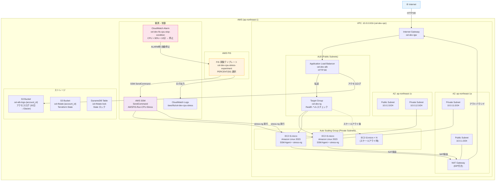
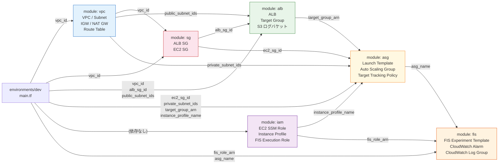

# ARCHITECTURE.md — chaos-engineering-lab 完全理解ドキュメント

## 目次

1. [プロジェクト全体像](#1-プロジェクト全体像)
2. [AWS インフラ構成図](#2-aws-インフラ構成図)
3. [ネットワーク設計](#3-ネットワーク設計)
4. [セキュリティ設計](#4-セキュリティ設計)
5. [Terraform モジュール設計](#5-terraform-モジュール設計)
6. [FIS 実験フロー](#6-fis-実験フロー)
7. [ASG スケーリング動作](#7-asg-スケーリング動作)
8. [IAM 権限設計](#8-iam-権限設計)
9. [リソース命名規則](#9-リソース命名規則)
10. [変数・出力値リファレンス](#10-変数出力値リファレンス)
11. [コスト設計](#11-コスト設計)
12. [多層安全弁設計](#12-多層安全弁設計)

---

## 1. プロジェクト全体像

AWS FIS (Fault Injection Simulator) を使って **EC2 に CPU ストレスを注入し、ASG が自動でスケールアウトすることを検証する** カオスエンジニアリング基盤。

```
┌─────────────────────────────────────────────────────────────────┐
│                      実験シナリオの全体像                         │
│                                                                   │
│  [ユーザー]                                                       │
│     │                                                             │
│     ▼                                                             │
│  run_experiment.sh                                                │
│     │ aws fis start-experiment                                    │
│     ▼                                                             │
│  [AWS FIS] ──SSM SendCommand──► [EC2 × N台（50%）]              │
│     │                                stress-ng CPU 100% / 5分   │
│     │                                    │                        │
│     │                               CPUUtilization上昇            │
│     │                                    │                        │
│     │                            [CloudWatch Alarm]               │
│     │                            CPUUtilization > 70%             │
│     │                                    │                        │
│     │                            [ASG Target Tracking]            │
│     │                            スケールアウト発動               │
│     │                                    │                        │
│     │                            新EC2インスタンス追加            │
│     │                                    │                        │
│     ◄── 実験完了 ──────────────────────────                      │
│  check_scaling.sh で結果確認                                      │
└─────────────────────────────────────────────────────────────────┘
```

### ポートフォリオ訴求ポイント

| 観点 | 内容 |
|------|------|
| **IaC 完全化** | FIS 実験テンプレートを `aws_fis_experiment_template` で Terraform 管理 |
| **agentless 注入** | SSH 不要・SSM SendCommand 経由で `AWSFIS-Run-CPU-Stress` を実行 |
| **安全設計** | 停止条件 + IAM 最小権限 + PERCENT(50) の多層安全弁 |
| **自動検証** | スクリプトで「実験前後のインスタンス数比較」を自動サマリー |
| **ADR 記録** | 設計判断（FIS 選定・Target Tracking 選定）をコードと同じリポジトリで管理 |

---

## 2. AWS インフラ構成図



---

## 3. ネットワーク設計

### CIDR 設計

```
VPC: 10.0.0.0/16  (65,534 アドレス)
│
├── パブリックサブネット（ALB・NAT GW 配置）
│   ├── 10.0.1.0/24  (ap-northeast-1a)  254 アドレス
│   └── 10.0.2.0/24  (ap-northeast-1c)  254 アドレス
│
└── プライベートサブネット（EC2/ASG 配置）
    ├── 10.0.11.0/24 (ap-northeast-1a)  254 アドレス
    └── 10.0.12.0/24 (ap-northeast-1c)  254 アドレス
```

### ルーティング設計

```
┌─────────────────────────────────────────────────────┐
│ パブリックルートテーブル (cel-dev-rtb-public)         │
│   0.0.0.0/0  → Internet Gateway (cel-dev-igw)       │
│   ↓ アタッチ先                                       │
│   Public Subnet (1a), Public Subnet (1c)             │
└─────────────────────────────────────────────────────┘

┌─────────────────────────────────────────────────────┐
│ プライベートルートテーブル (cel-dev-rtb-private)      │
│   0.0.0.0/0  → NAT Gateway (cel-dev-ngw)            │
│   ↓ アタッチ先                                       │
│   Private Subnet (1a), Private Subnet (1c)           │
│                                                       │
│ ※ EC2 → インターネット（SSM、yum、stress-ng DL）は   │
│   NAT GW 経由で行う。直接アクセスは不可。            │
└─────────────────────────────────────────────────────┘
```

### NAT Gateway の設計判断

NAT GW は `ap-northeast-1a` に **1 台のみ** 配置する。

- **理由**: 検証環境では冗長性よりコスト最優先。NAT GW を 2 AZ に配置すると月額 +$35。
- **トレードオフ**: `1c` の EC2 インスタンスが AZ 間通信を行うため、AZ 障害時にアウトバウンドが止まる。本番では 2 AZ 配置を推奨。

---

## 4. セキュリティ設計

### セキュリティグループ構成

```
Internet
   │ HTTP:80 (0.0.0.0/0)
   ▼
┌─────────────────────────┐
│ ALB SG (cel-dev-alb-sg) │
│  Ingress: 80/tcp ← Any  │
│  Egress:  All → Any     │
└──────────┬──────────────┘
           │ HTTP:80 (ALB SG からのみ)
           ▼
┌─────────────────────────┐
│ EC2 SG (cel-dev-ec2-sg) │
│  Ingress: 80/tcp  ← ALB SG のみ  │
│  Ingress: 443/tcp ← ALB SG のみ (将来の TLS 用) │
│  Egress:  All → Any (SSM/yum/stress-ng DL用)   │
└─────────────────────────┘
```

**ポイント**: EC2 への直接インターネットアクセスは禁止。SSH ポート (22) は開放しない。EC2 へのアクセスは SSM Session Manager 経由。

### IMDSv2 強制

Launch Template で `http_tokens = "required"` を設定し、IMDSv1 を無効化。

```
攻撃シナリオ (SSRF):
  悪意あるリクエスト → EC2 アプリ → http://169.254.169.254/
  
IMDSv2 があれば:
  1. PUT でセッショントークン取得が必要
  2. hop_limit = 1 でコンテナ内からのアクセスを防止
  → メタデータ漏洩を防ぐ
```

---

## 5. Terraform モジュール設計

### モジュール依存関係



### デプロイ順序と depends_on

```
Phase 1 ─────────────────────────────────────────────
  [vpc]     並列実行可能
  [sg]      depends_on: [vpc]
  [iam]     並列実行可能（vpc/sg と独立）

Phase 2 ─────────────────────────────────────────────
  [alb]     depends_on: [sg]
  [asg]     depends_on: [alb, iam]

Phase 3 ─────────────────────────────────────────────
  [fis]     depends_on: [asg, iam]
```

### モジュール別リソース一覧

#### `module: vpc`

| リソース | 名前 | 用途 |
|---------|------|------|
| `aws_vpc` | cel-dev-vpc | メイン VPC |
| `aws_internet_gateway` | cel-dev-igw | インターネット接続 |
| `aws_subnet` (×2) | cel-dev-public-{az} | ALB・NAT GW 配置 |
| `aws_subnet` (×2) | cel-dev-private-{az} | EC2/ASG 配置 |
| `aws_eip` | cel-dev-nat-eip | NAT GW 用静的 IP |
| `aws_nat_gateway` | cel-dev-ngw | プライベートサブネット → Internet |
| `aws_route_table` | cel-dev-rtb-public | パブリックルーティング |
| `aws_route_table` | cel-dev-rtb-private | プライベートルーティング |
| `aws_route_table_association` (×4) | — | サブネット↔ルートテーブル紐付け |

#### `module: sg`

| リソース | 名前 | 用途 |
|---------|------|------|
| `aws_security_group` | cel-dev-alb-sg | ALB: Internet → HTTP:80 |
| `aws_security_group` | cel-dev-ec2-sg | EC2: ALB SG → HTTP:80 のみ |

#### `module: alb`

| リソース | 名前 | 用途 |
|---------|------|------|
| `aws_s3_bucket` | cel-alb-logs-{account_id} | アクセスログ保管 |
| `aws_s3_bucket_public_access_block` | — | パブリックアクセスブロック |
| `aws_s3_bucket_server_side_encryption_configuration` | — | AES256 暗号化 |
| `aws_s3_bucket_lifecycle_configuration` | — | 30日→Glacier、90日→削除 |
| `aws_s3_bucket_policy` | — | ELBサービスアカウント (582318560864) の PutObject 許可 |
| `aws_lb` | cel-dev-alb | Application Load Balancer |
| `aws_lb_target_group` | cel-dev-tg | EC2 登録先、/health ヘルスチェック |
| `aws_lb_listener` | cel-dev-listener-http | HTTP:80 → Target Group |

#### `module: asg`

| リソース | 名前 | 用途 |
|---------|------|------|
| `data.aws_ami` | al2023 (最新) | Amazon Linux 2023 AMI 動的取得 |
| `aws_launch_template` | cel-dev-lt-* | EC2 起動設定（IMDSv2、UserData） |
| `aws_autoscaling_group` | cel-dev-asg | 2〜6台、ELB ヘルスチェック |
| `aws_autoscaling_policy` | cel-dev-target-tracking-policy | CPU 70% Target Tracking |

#### `module: iam`

| リソース | 名前 | 用途 |
|---------|------|------|
| `aws_iam_role` | cel-dev-ec2-ssm-role | EC2 が SSM/CW と通信するロール |
| `aws_iam_role_policy_attachment` | AmazonSSMManagedInstanceCore | SSM セッションマネージャー |
| `aws_iam_role_policy_attachment` | CloudWatchAgentServerPolicy | CloudWatch メトリクス送信 |
| `aws_iam_instance_profile` | cel-ec2-instance-profile | EC2 へのロールアタッチ |
| `aws_iam_role` | cel-fis-execution-role | FIS が SSM を実行するロール |
| `aws_iam_role_policy` | cel-fis-execution-policy | SSM SendCommand 等の最小権限 |

#### `module: fis`

| リソース | 名前 | 用途 |
|---------|------|------|
| `aws_cloudwatch_metric_alarm` | cel-dev-fis-cpu-stop-condition | CPU > 90% × 10分で FIS 自動停止 |
| `aws_cloudwatch_log_group` | /aws/fis/cel-dev-cpu-stress | FIS 実験ログ（30日保持） |
| `aws_fis_experiment_template` | cel-dev-cpu-stress-experiment | CPU ストレス実験テンプレート |

### UserData の内容（asg モジュール）

EC2 起動時に以下を自動インストール・設定する:

```bash
# userdata.sh.tpl で行われること（概要）
1. Amazon Linux 2023 パッケージ更新
2. stress-ng インストール（FIS が使用するストレスツール）
3. Nginx/Python 等で HTTP:80 の /health エンドポイントを起動
   → ALB ヘルスチェック (200 OK) を返す
4. SSM Agent 起動確認
```

---

## 6. FIS 実験フロー

### 実験タイムライン

```
時間軸
   │
 0秒 ── run_experiment.sh 起動
   │      └─ aws fis start-experiment → 実験 ID 取得
   │
 0秒 ── FIS 実験開始
   │      └─ ASG タグでフィルタリング（PERCENT(50) = インスタンスの50%）
   │      └─ SSM SendCommand → AWSFIS-Run-CPU-Stress ドキュメント送信
   │
10秒 ── stress-ng 開始
   │      └─ CPU 全コア 100% 負荷（全ワーカー起動）
   │      └─ CPUUtilization メトリクスが急上昇
   │
 2分 ── CloudWatch が CPU 上昇を検出
   │      └─ Target Tracking Alarm: CPU > 70% を確認
   │      └─ ASG: スケールアウト判断（必要インスタンス数を自動計算）
   │
 3分 ── 新 EC2 インスタンス起動
   │      └─ Launch Template で Amazon Linux 2023 起動
   │      └─ UserData で stress-ng, ヘルスエンドポイント設定
   │      └─ ALB Target Group にヘルシー登録
   │
 5分 ── stress-ng 自動終了（duration = PT5M）
   │      └─ FIS アクション完了
   │      └─ CPUUtilization が正常値に戻り始める
   │
 5分 ── FIS 実験 completed ステータス
   │
~15分 ── ASG Target Tracking がスケールイン開始
   │      └─ CPU < 70% を検出
   │      └─ 余剰インスタンスを段階的に終了
   │
 結果確認 ── run_experiment.sh がサマリー表示
              └─ 実験前後インスタンス数を比較
              └─ .last_experiment_id に実験 ID を保存
```

### FIS 実験テンプレートの構造

```hcl
aws_fis_experiment_template "cpu_stress" {
  │
  ├── stop_condition
  │     source: "aws:cloudwatch:alarm"
  │     value:  cel-dev-fis-cpu-stop-condition (ARN)
  │     → CPU 90% × 10分 で自動停止（安全弁 Layer 1）
  │
  ├── action "cpu-stress"
  │     action_id: "aws:ssm:send-command"
  │     documentArn: AWSFIS-Run-CPU-Stress
  │     documentParameters:
  │       CPU=0 (全コア), Workers=0 (コア数と同数)
  │       LoadPercent=100, DurationSeconds=300
  │     duration: "PT5M"  （安全弁 Layer 2）
  │     target: "asg-instances"
  │
  └── target "asg-instances"
        resource_type:  "aws:ec2:instance"
        selection_mode: "PERCENT(50)"  （安全弁 Layer 3）
        resource_tag:
          aws:autoscaling:groupName = cel-dev-asg
          Project = chaos-engineering-lab
```

### SSM SendCommand の動作

```
FIS ──(AssumeRole)──► cel-fis-execution-role
                              │
                              │ ssm:SendCommand
                              ▼
                        AWS Systems Manager
                              │
                              │ AWSFIS-Run-CPU-Stress ドキュメント送信
                              ▼
              EC2 (SSM Agent 受信) ────────────────────
              │                                        │
              │ stress-ng --cpu 0 --cpu-load 100       │
              │            --timeout 300s              │
              └────────────────────────────────────────┘
                EC2 側で stress-ng を直接実行（SSH 不要）
```

---

## 7. ASG スケーリング動作

### Target Tracking の仕組み

```
観測: ASGAverageCPUUtilization（全インスタンスの平均 CPU）
目標: 70%

スケールアウト条件:
  現在 CPU > 70% → AWS が「必要インスタンス数」を自動計算
  例: CPU 100%, 現在2台 → 必要台数 = ceil(2 × 100/70) = 3台

スケールイン条件:
  現在 CPU < 70% × (1 - 0.1) = 63% (デフォルトバッファ)
  ※ Target Tracking はスケールイン時に10%バッファを持つ
```

### スケーリング設定値

| パラメータ | 値 | 説明 |
|-----------|-----|------|
| `min_size` | 2 | 最小インスタンス数（常時稼働） |
| `desired_capacity` | 2 | 初期インスタンス数 |
| `max_size` | 6 | スケールアウト上限 |
| `target_value` | 70.0% | Target Tracking の CPU 目標値 |
| `health_check_type` | ELB | ALB ヘルスチェック連動 |
| `health_check_grace_period` | 120秒 | 新規インスタンスのウォームアップ期間 |

### スケールアウト後の状態遷移

```
ALB Target Group 登録フロー（新インスタンス）:

Launch ──► Pending ──► InService ──► (実験後) ──► Terminating ──► Terminated
              │              │
              │         ALB がヘルシーと判断
              │         /health → 200 OK
              │         (2回連続成功で登録)
              │
         health_check_grace_period 120秒の猶予
         （起動直後の誤検知を防ぐ）
```

---

## 8. IAM 権限設計

### 権限マトリクス

```
┌─────────────────────────────────────────────────────────────────┐
│                    EC2 インスタンスプロファイル                   │
│              cel-ec2-instance-profile                            │
│                                                                   │
│  ロール: cel-dev-ec2-ssm-role                                    │
│                                                                   │
│  ポリシー (管理ポリシー):                                         │
│  ① AmazonSSMManagedInstanceCore                                  │
│     ssm:UpdateInstanceInformation  → SSM に登録                 │
│     ssm:ListAssociations           → Association 確認            │
│     ssmmessages:*                  → Session Manager 通信        │
│     ec2messages:*                  → SSM エージェント通信        │
│                                                                   │
│  ② CloudWatchAgentServerPolicy                                   │
│     cloudwatch:PutMetricData       → カスタムメトリクス送信      │
│     logs:PutLogEvents              → アプリログ送信              │
└─────────────────────────────────────────────────────────────────┘

┌─────────────────────────────────────────────────────────────────┐
│                      FIS 実行ロール                               │
│              cel-fis-execution-role                              │
│                                                                   │
│  Assume: fis.amazonaws.com のみ                                  │
│                                                                   │
│  ポリシー (インラインポリシー):                                   │
│  ① SSM SendCommand                                               │
│     ssm:SendCommand        → EC2 に stress-ng コマンド送信      │
│     ssm:GetCommandInvocation → コマンド実行状態確認             │
│     ssm:ListCommands       → コマンド一覧                        │
│     ssm:CancelCommand      → FIS 停止時クリーンアップ            │
│     Resource: *                                                   │
│                                                                   │
│  ② EC2/ASG Describe                                              │
│     ec2:DescribeInstances                → ターゲット EC2 探索   │
│     autoscaling:DescribeAutoScalingGroups → ASG 状態確認         │
│     autoscaling:DescribeAutoScalingInstances                     │
│     Resource: *                                                   │
│                                                                   │
│  ③ CloudWatch Logs                                               │
│     logs:CreateLogGroup / CreateLogStream / PutLogEvents         │
│     logs:DescribeLogGroups                                        │
│     Resource: arn:aws:logs:ap-northeast-1:*:log-group:/aws/fis/* │
│     ※ FIS ログロググループに限定（最小権限）                     │
│                                                                   │
│  ④ CloudWatch Alarm                                              │
│     cloudwatch:DescribeAlarms → 停止条件アラーム監視             │
│     Resource: *                                                   │
└─────────────────────────────────────────────────────────────────┘
```

---

## 9. リソース命名規則

### パターン: `{prefix}-{env}-{service}` または `{prefix}-{service}`

| リソース | 名前 | IAM 64文字制限 |
|---------|------|---------------|
| VPC | `cel-dev-vpc` | — |
| IGW | `cel-dev-igw` | — |
| NAT GW | `cel-dev-ngw` | — |
| パブリックサブネット | `cel-dev-public-ap-northeast-1a` | — |
| プライベートサブネット | `cel-dev-private-ap-northeast-1a` | — |
| ALB SG | `cel-dev-alb-sg` | — |
| EC2 SG | `cel-dev-ec2-sg` | — |
| ALB | `cel-dev-alb` | — |
| Target Group | `cel-dev-tg` | — |
| Launch Template | `cel-dev-lt-*` | — |
| ASG | `cel-dev-asg` | — |
| EC2 インスタンス | `cel-dev-ec2` | — |
| EC2 SSM Role | `cel-dev-ec2-ssm-role` | 22文字 ✅ |
| Instance Profile | `cel-ec2-instance-profile` | 25文字 ✅ |
| FIS Execution Role | `cel-fis-execution-role` | 23文字 ✅ |
| FIS テンプレート | `cel-dev-cpu-stress-experiment` | — |
| CW Alarm (停止条件) | `cel-dev-fis-cpu-stop-condition` | — |
| CW Log Group | `/aws/fis/cel-dev-cpu-stress` | — |
| S3 (ALB ログ) | `cel-alb-logs-{account_id}` | — |
| S3 (State) | `cel-tfstate-{account_id}` | — |
| DynamoDB | `cel-tfstate-lock` | — |

**prefix が 5 文字以内に制限される理由**: IAM ロール名は AWS ハード制限 64 文字。`{prefix}-{env}-{service}-role` の形式で余裕を持たせるため、`variables.tf` で validation を設定。

---

## 10. 変数・出力値リファレンス

### environments/dev の変数

| 変数名 | デフォルト値 | 説明 |
|--------|------------|------|
| `project` | `"chaos-engineering-lab"` | プロジェクト名（タグ用） |
| `prefix` | `"cel"` | リソース名プレフィックス（5文字以内） |
| `env` | `"dev"` | 環境名 |
| `aws_region` | `"ap-northeast-1"` | AWS リージョン |
| `account_id` | `""` | AWS アカウント ID（S3バケット名に使用） |
| `vpc_cidr` | `"10.0.0.0/16"` | VPC CIDR |
| `public_subnet_cidrs` | `["10.0.1.0/24", "10.0.2.0/24"]` | パブリックサブネット |
| `private_subnet_cidrs` | `["10.0.11.0/24", "10.0.12.0/24"]` | プライベートサブネット |
| `availability_zones` | `["ap-northeast-1a", "ap-northeast-1c"]` | 使用 AZ |
| `asg_min_size` | `2` | ASG 最小インスタンス数 |
| `asg_max_size` | `6` | ASG 最大インスタンス数 |
| `asg_desired_capacity` | `2` | ASG 希望インスタンス数 |

### environments/dev の出力値

| 出力名 | 使用用途 |
|--------|---------|
| `vpc_id` | デバッグ・他リソース参照 |
| `public_subnet_ids` | ALB 配置確認 |
| `private_subnet_ids` | EC2 配置確認 |
| `alb_sg_id` | SG 確認 |
| `ec2_sg_id` | SG 確認 |
| `alb_dns_name` | `ALB_DNS` 環境変数 → スクリプトで使用 |
| `target_group_arn` | ALB Target Group ARN |
| `asg_name` | `ASG_NAME` 環境変数 → スクリプトで使用 |
| `asg_arn` | FIS ターゲット ARN 参照 |
| `alb_arn` | FIS 停止条件設定時に参照 |
| `fis_experiment_template_id` | `FIS_TEMPLATE_ID` 環境変数 → スクリプトで使用 |
| `fis_role_arn` | FIS ロール ARN 確認 |
| `stop_condition_alarm_arn` | CW アラーム ARN 確認 |

### モジュール間の値の受け渡し

```
vpc.vpc_id            ──► sg.vpc_id
                      ──► alb.vpc_id

vpc.public_subnet_ids ──► alb.public_subnet_ids
vpc.private_subnet_ids──► asg.private_subnet_ids

sg.alb_sg_id          ──► alb.alb_sg_id
sg.ec2_sg_id          ──► asg.ec2_sg_id

alb.target_group_arn  ──► asg.target_group_arn

iam.instance_profile_name ──► asg.instance_profile_name
iam.fis_role_arn           ──► fis.fis_role_arn

asg.asg_name          ──► fis.asg_name
```

---

## 11. コスト設計

### 月額コスト内訳（常時稼働時）

| リソース | 単価 | 数量 | 月額概算 |
|---------|------|------|---------|
| EC2 t3.micro | $0.0136/時 | 2台 常時 | ~$20 |
| ALB | $0.0243/時 + LCU | 1台 | ~$18 |
| NAT Gateway | $0.062/時 + データ転送 | 1台 | ~$45 |
| S3 (ALBログ) | $0.025/GB | 少量 | ~$1 |
| CloudWatch Logs | $0.76/GB | 少量 | ~$0 |
| FIS | 無料 | — | $0 |
| DynamoDB (lock) | オンデマンド | 少量 | ~$0 |
| **合計** | | | **~$84** |

> ⚠️ **NAT Gateway が最大コスト要因**（$45/月）。検証後は `terraform destroy` を推奨。

### 実験 1 回あたりの追加コスト

| 項目 | コスト | 備考 |
|------|--------|------|
| EC2 追加インスタンス（スケールアウト分） | ~$0.01 | 15分 × 2台 |
| SSM SendCommand | $0 | 無料枠内 |
| FIS 実験 | $0 | FIS 自体は無料 |
| **合計** | **~$0.05** | |

---

## 12. 多層安全弁設計

カオス実験の暴走を防ぐため、**4 層の安全弁**を設けている。

```
┌─────────────────────────────────────────────────────────────────┐
│                    多層安全弁 (Defense in Depth)                  │
├─────────────────────────────────────────────────────────────────┤
│                                                                   │
│  Layer 1: FIS 停止条件（CloudWatch Alarm）                       │
│  ─────────────────────────────────────────────────────────────  │
│  CPU > 90% が 10 分継続 → CW アラームが ALARM 状態               │
│  → FIS が実験を自動停止（stress-ng プロセスも終了）              │
│                                                                   │
│  設定箇所: fis モジュールの stop_condition                       │
│  Alarm:    cel-dev-fis-cpu-stop-condition                        │
│                                                                   │
│  Layer 2: FIS アクション duration（PT5M）                        │
│  ─────────────────────────────────────────────────────────────  │
│  stress-ng は最大 5 分（300秒）で自動終了                        │
│  停止条件に達しなくても必ず終了する                               │
│                                                                   │
│  設定箇所: fis モジュールの action.parameter "duration"          │
│                                                                   │
│  Layer 3: PERCENT(50) ターゲット選択                             │
│  ─────────────────────────────────────────────────────────────  │
│  ASG 内の 50% のインスタンスのみに注入                           │
│  → 残り 50% は正常稼働し、ALB がトラフィックを転送可能          │
│  → サービス完全停止を防止                                        │
│                                                                   │
│  設定箇所: fis モジュールの target.selection_mode                │
│                                                                   │
│  Layer 4: IAM 最小権限                                           │
│  ─────────────────────────────────────────────────────────────  │
│  FIS ロールは SSM SendCommand / Describe 系のみ許可              │
│  → EC2 停止・削除・IAM 変更は不可                                │
│  → FIS がインフラを破壊する操作を権限レベルで防止               │
│                                                                   │
│  設定箇所: iam モジュールの fis_execution ポリシー               │
│                                                                   │
└─────────────────────────────────────────────────────────────────┘

停止トリガーの優先順位:
  1. 停止条件 CW アラーム (CPU 90% × 10分)   ← 異常暴走の自動制御
  2. duration 経過 (5分)                       ← 正常シナリオの終了
  3. ユーザーによる手動停止                     ← 緊急時
     aws fis stop-experiment --id $EXPERIMENT_ID
```

### 安全弁が機能するシナリオ

```
シナリオ A: 正常実験
  stress-ng 開始 → CPU上昇 → ASGスケールアウト
  → 5分後 stress-ng 終了 (duration) → CPU低下 → スケールイン
  → FIS: completed

シナリオ B: CPU が下がらない場合（EC2 アプリのバグ等）
  stress-ng 終了後も CPU > 90% が続く
  → 10分後に CW Alarm が ALARM 状態
  → FIS: 実験を自動停止 (stopped)
  → 人間が原因調査

シナリオ C: 緊急手動停止
  実験中に問題を発見
  → aws fis stop-experiment で即時停止
  → stress-ng は SSM CancelCommand で終了
```

---

## 付録: Terraform State 管理

```
S3 バケット: cel-tfstate-{account_id}
  キー: chaos-engineering-lab/dev/terraform.tfstate
  暗号化: SSE (AES256)
  バージョニング: 有効

DynamoDB: cel-tfstate-lock
  LockID: chaos-engineering-lab/dev/terraform.tfstate-md5
  目的: 複数人が同時に terraform apply するのを防ぐ排他制御
```

**初期構築手順**:

```bash
# 1. S3 バケット作成（バージョニング有効）
aws s3 mb s3://cel-tfstate-${ACCOUNT_ID} --region ap-northeast-1
aws s3api put-bucket-versioning \
  --bucket cel-tfstate-${ACCOUNT_ID} \
  --versioning-configuration Status=Enabled

# 2. DynamoDB テーブル作成
aws dynamodb create-table \
  --table-name cel-tfstate-lock \
  --attribute-definitions AttributeName=LockID,AttributeType=S \
  --key-schema AttributeName=LockID,KeyType=HASH \
  --billing-mode PAY_PER_REQUEST \
  --region ap-northeast-1

# 3. versions.tf の "REPLACE_ME" を account_id に置換してから init
cd terraform/environments/dev
terraform init
```
