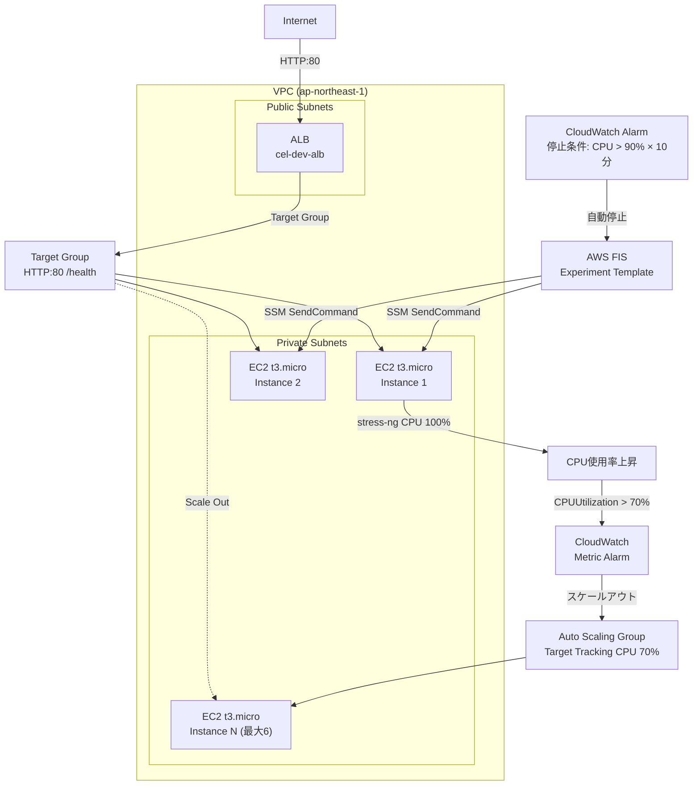

# chaos-engineering-lab 🔥

AWS FIS × Terraform で実現するカオスエンジニアリング基盤。
CPU ストレスを EC2 に注入し、ASG が自動スケールアウトすることを検証する。

**English summary**: Infrastructure-as-Code chaos engineering platform using AWS Fault Injection Simulator (FIS) and Terraform. Injects CPU stress into EC2 instances via SSM and validates Auto Scaling Group scale-out behavior automatically.

[](https://www.terraform.io/)
[](https://aws.amazon.com/fis/)
[](LICENSE)

---

## このハンズオンで得られること

このリポジトリを一通り動かすことで、以下の知識・スキルが身につく。

### AWS スキル

| スキル | 具体的な学習内容 |
|--------|----------------|
| **AWS FIS** | 実験テンプレートの設計・ターゲット選択・停止条件の設定方法 |
| **Auto Scaling** | Target Tracking ポリシーの動作原理・スケールアウト/インのタイムライン |
| **SSM** | SSH 不要の agentless コマンド実行（SendCommand）の仕組み |
| **ALB** | ターゲットグループ・ヘルスチェック・アクセスログの設定 |
| **CloudWatch** | メトリクスアラームを「停止条件」として FIS に連携する方法 |
| **IAM** | カオス実験に必要な最小権限の設計（FIS ロール・EC2 プロファイル） |
| **VPC** | パブリック/プライベートサブネット・NAT GW を使ったセキュアな構成 |

### Terraform スキル

| スキル | 具体的な学習内容 |
|--------|----------------|
| **モジュール設計** | 6 モジュール分割と depends_on による明示的な依存管理 |
| **IaC 完全化** | FIS 実験テンプレートを含むすべてのリソースを Terraform で管理 |
| **S3 バックエンド** | tfstate の S3 管理 + DynamoDB ロックによる競合防止 |
| **動的 AMI 取得** | `data.aws_ami` で Amazon Linux 2023 の最新 AMI を自動取得 |

### カオスエンジニアリングの考え方

- **仮説駆動の実験**: 「CPU が上がればスケールアウトするはず」を検証として定義する思考
- **安全な実験設計**: 停止条件・影響範囲（50%）・最小権限による多層安全弁の組み方
- **観測可能性**: 実験前後のインスタンス数比較・CloudWatch メトリクス・FIS ログの読み方
- **ADR による設計記録**: ツール選定・ポリシー選定の判断根拠をコードと同じリポジトリで管理

---

## ポートフォリオポイント

- **FIS 実験テンプレートの完全 IaC 化**: `aws_fis_experiment_template` で実験シナリオをバージョン管理
- **SSM agentless カオス注入**: SSH 不要、`AWSFIS-Run-CPU-Stress` マネージドドキュメントで安全注入
- **多層安全弁設計**: CloudWatch アラーム停止条件 + IAM 最小権限 + FIS 対象フィルタ（50%）
- **Target Tracking との連動**: CPU 70% 閾値で ASG スケールアウト → FIS 終了後スケールインまで自動検証
- **ADR による設計判断の記録**: ツール選定・ポリシー選定の根拠をコードと同じリポジトリで管理

---

## アーキテクチャ



詳細なアーキテクチャ解説は [ARCHITECTURE.md](ARCHITECTURE.md) を参照。

---

## ディレクトリ構造

```
chaos-engineering-lab/
├── terraform/
│   ├── environments/
│   │   └── dev/
│   │       ├── main.tf          # 6 モジュールの呼び出し
│   │       ├── variables.tf     # 環境変数定義
│   │       ├── outputs.tf       # 外部参照用 output
│   │       ├── versions.tf      # Terraform/AWS プロバイダーバージョン・S3 バックエンド
│   │       └── terraform.tfvars # account_id など環境固有値
│   └── modules/
│       ├── vpc/                 # VPC / サブネット / IGW / NAT GW
│       ├── sg/                  # ALB 用・EC2 用セキュリティグループ
│       ├── alb/                 # ALB / Target Group / アクセスログ S3
│       ├── asg/                 # Launch Template / ASG / Target Tracking Policy
│       ├── iam/                 # FIS 実行ロール / EC2 インスタンスプロファイル
│       └── fis/                 # FIS 実験テンプレート / CW アラーム / Log Group
├── scripts/
│   ├── run_experiment.sh        # FIS 実験起動 + 結果サマリー
│   └── check_scaling.sh         # ASG スケールアウト状態リアルタイム監視
├── docs/
│   ├── adrs/
│   │   ├── 001-use-fis-over-thirdparty.md   # FIS 採用理由
│   │   └── 002-asg-target-tracking.md        # Target Tracking 採用理由
│   └── screenshots/             # FIS ダッシュボードのスクリーンショット配置場所
├── runbooks/
│   └── cpu-stress-experiment.md # 実験手順書（詳細版）
├── ARCHITECTURE.md              # 完全理解ドキュメント
└── README.md                    # このファイル
```

---

## ハンズオン実行手順

### 前提条件の確認

作業を始める前に、以下がインストール済みであることを確認する。

```bash
# Terraform (>= 1.9.0)
terraform version
# → Terraform v1.9.x 以上が表示されること

# AWS CLI (>= 2.x)
aws --version
# → aws-cli/2.x.x 以上が表示されること

# jq (check_scaling.sh で使用)
jq --version
# → jq-1.x が表示されること

# AWS 認証確認
aws sts get-caller-identity
# → Account, UserId, Arn が表示されること（エラーなら aws configure を実行）
```

### IAM 権限の確認

実行ユーザーに以下のサービスへのアクセス権限が必要。

| サービス | 必要な理由 |
|---------|-----------|
| EC2, VPC | インスタンス・ネットワーク構築 |
| Elastic Load Balancing | ALB 構築 |
| Auto Scaling | ASG・スケーリングポリシー構築 |
| IAM | ロール・ポリシー・インスタンスプロファイル作成 |
| S3 | アクセスログバケット・tfstate バケット操作 |
| DynamoDB | tfstate ロックテーブル操作 |
| FIS | 実験テンプレート作成 |
| CloudWatch | アラーム・ロググループ作成 |
| SSM | SendCommand 権限（FIS 経由） |

> 開発環境での検証であれば `AdministratorAccess` が最も手軽。本番環境では最小権限ポリシーを別途作成すること。

---

### Step 1: リポジトリのクローン

```bash
git clone <このリポジトリの URL>
cd chaos-engineering-lab
```

---

### Step 2: AWS アカウント ID の確認

後続の手順で使用するため、AWS アカウント ID を環境変数に設定しておく。

```bash
export AWS_ACCOUNT_ID=$(aws sts get-caller-identity --query Account --output text)
echo "Account ID: $AWS_ACCOUNT_ID"
# → Account ID: 123456789012 のように表示されること
```

---

### Step 3: Terraform State 用バックエンドの事前構築

Terraform の状態ファイル (tfstate) を保管する S3 バケットと、ロック用の DynamoDB テーブルを作成する。

> **なぜ必要か**: `terraform apply` を複数人・複数端末から同時に実行したときの競合を防ぐため。

```bash
# S3 バケット作成
aws s3 mb s3://cel-tfstate-${AWS_ACCOUNT_ID} --region ap-northeast-1

# バージョニング有効化（誤った apply の復元に備える）
aws s3api put-bucket-versioning \
  --bucket cel-tfstate-${AWS_ACCOUNT_ID} \
  --versioning-configuration Status=Enabled

# パブリックアクセスをブロック（tfstate は機密情報を含むため）
aws s3api put-public-access-block \
  --bucket cel-tfstate-${AWS_ACCOUNT_ID} \
  --public-access-block-configuration \
    "BlockPublicAcls=true,IgnorePublicAcls=true,BlockPublicPolicy=true,RestrictPublicBuckets=true"

# DynamoDB テーブル作成（ステートロック用）
aws dynamodb create-table \
  --table-name cel-tfstate-lock \
  --attribute-definitions AttributeName=LockID,AttributeType=S \
  --key-schema AttributeName=LockID,KeyType=HASH \
  --billing-mode PAY_PER_REQUEST \
  --region ap-northeast-1

echo "✅ バックエンド構築完了"
```

**作成後の確認**:

```bash
aws s3 ls | grep cel-tfstate
# → 2026-xx-xx xx:xx:xx cel-tfstate-123456789012

aws dynamodb describe-table --table-name cel-tfstate-lock --region ap-northeast-1 \
  --query 'Table.TableStatus' --output text
# → ACTIVE
```

---

### Step 4: versions.tf のバックエンド設定を更新

`terraform/environments/dev/versions.tf` の `REPLACE_ME` を実際の AWS アカウント ID に置換する。

```bash
# REPLACE_ME を実際のアカウント ID に置換
sed -i "s/REPLACE_ME/${AWS_ACCOUNT_ID}/g" terraform/environments/dev/versions.tf

# 置換結果を確認
grep "bucket" terraform/environments/dev/versions.tf
# → bucket = "cel-tfstate-123456789012" のように表示されること
```

---

### Step 5: terraform.tfvars の設定

```bash
# terraform/environments/dev/terraform.tfvars を確認・編集
cat terraform/environments/dev/terraform.tfvars
```

`account_id` が空の場合は設定する。

```bash
# terraform.tfvars に account_id を設定
cat > terraform/environments/dev/terraform.tfvars << EOF
account_id = "${AWS_ACCOUNT_ID}"
EOF

cat terraform/environments/dev/terraform.tfvars
# → account_id = "123456789012"
```

---

### Step 6: Terraform 初期化

```bash
cd terraform/environments/dev

terraform init
```

成功すると以下のような出力が表示される。

```
Initializing the backend...
Successfully configured the backend "s3"!

Initializing provider plugins...
- Finding hashicorp/aws versions matching ">= 5.0.0"...
- Installing hashicorp/aws v5.x.x...

Terraform has been successfully initialized!
```

> エラーが出た場合: S3 バケット名が正しいか・AWS 認証が有効かを確認する。

---

### Step 7: 実行計画の確認（terraform plan）

```bash
terraform plan -out=tfplan
```

以下のリソースが作成計画に含まれていることを確認する。

| 確認ポイント | リソース名 |
|------------|-----------|
| VPC | `cel-dev-vpc` |
| ALB | `cel-dev-alb` |
| ASG | `cel-dev-asg` |
| FIS テンプレート | `cel-dev-cpu-stress-experiment` |
| FIS 停止条件 | `cel-dev-fis-cpu-stop-condition` |

```bash
# 作成予定のリソース数を確認
terraform plan -out=tfplan 2>&1 | tail -5
# → Plan: xx to add, 0 to change, 0 to destroy.
```

---

### Step 8: インフラのデプロイ（terraform apply）

> ⚠️ 以下のコマンドは **ユーザー自身が実行**する。実行後 AWS に課金が発生する。

```bash
terraform apply tfplan
```

デプロイには **約 5〜8 分** かかる（NAT GW の作成が最も時間がかかる）。

成功すると以下のような出力が表示される。

```
Apply complete! Resources: xx added, 0 changed, 0 destroyed.

Outputs:

alb_dns_name               = "cel-dev-alb-xxxxxxxxx.ap-northeast-1.elb.amazonaws.com"
asg_name                   = "cel-dev-asg"
fis_experiment_template_id = "EXTxxxxxxxxxxxxxxxxx"
vpc_id                     = "vpc-xxxxxxxxxxxxxxxxx"
...
```

---

### Step 9: デプロイ結果の確認

ALB が正常に起動し、EC2 インスタンスがヘルシーになっていることを確認する。

```bash
# ALB の DNS 名を取得
ALB_DNS=$(terraform output -raw alb_dns_name)
echo "ALB DNS: $ALB_DNS"

# ALB 経由でヘルスチェックエンドポイントにアクセス
# ※ EC2 起動直後は 1〜2 分待ってから実行する
curl -f "http://$ALB_DNS/health"
# → {"status": "ok"} または 200 OK が返ること
```

ASG のインスタンス状態を確認する。

```bash
ASG_NAME=$(terraform output -raw asg_name)

aws autoscaling describe-auto-scaling-groups \
  --auto-scaling-group-names "$ASG_NAME" \
  --region ap-northeast-1 \
  --query 'AutoScalingGroups[0].Instances[*].{ID:InstanceId,State:LifecycleState,Health:HealthStatus}' \
  --output table
```

期待する出力:

```
----------------------------------------------
|    DescribeAutoScalingGroups               |
+--------------------+----------+------------+
|         ID         |  Health  |   State    |
+--------------------+----------+------------+
|  i-xxxxxxxxxxxxxxxxx|  Healthy |  InService |
|  i-xxxxxxxxxxxxxxxxx|  Healthy |  InService |
+--------------------+----------+------------+
```

> 両インスタンスが `InService / Healthy` になるまで待つ（最大 3 分）。

---

### Step 10: 実験用環境変数のセット

プロジェクトルートに戻り、スクリプトが必要とする環境変数を設定する。

```bash
# プロジェクトルートに移動
cd ../../..
# → chaos-engineering-lab/ 直下にいることを確認
pwd

# terraform output から環境変数を取得
export FIS_TEMPLATE_ID=$(cd terraform/environments/dev && terraform output -raw fis_experiment_template_id)
export ASG_NAME=$(cd terraform/environments/dev && terraform output -raw asg_name)
export ALB_DNS=$(cd terraform/environments/dev && terraform output -raw alb_dns_name)

# 確認
echo "FIS_TEMPLATE_ID : $FIS_TEMPLATE_ID"
echo "ASG_NAME        : $ASG_NAME"
echo "ALB_DNS         : $ALB_DNS"
```

期待する出力:

```
FIS_TEMPLATE_ID : EXTxxxxxxxxxxxxxxxxx
ASG_NAME        : cel-dev-asg
ALB_DNS         : cel-dev-alb-xxxxxxxxx.ap-northeast-1.elb.amazonaws.com
```

---

### Step 11: ドライランで設定確認

実験を起動する前に、設定に問題がないことをドライランで確認する。

```bash
./scripts/run_experiment.sh --dry-run
```

期待する出力:

```
================================================
 カオスエンジニアリング実験: CPU ストレス
 テンプレート ID: EXTxxxxxxxxxxxxxxxxx
 対象 ASG    : cel-dev-asg
 ALB DNS     : cel-dev-alb-xxx.ap-northeast-1.elb.amazonaws.com
================================================

[DRY RUN] 実験は起動しません。設定確認のみ完了。

ALB ヘルスチェック確認:
[OK] ALB 応答確認
```

> `[ERROR] 環境変数が未設定です` と出た場合は Step 10 を再実行する。

---

### Step 12: スケーリング監視を別ターミナルで起動

**新しいターミナルを開いて**、リアルタイム監視スクリプトを起動する。

```bash
# 新しいターミナルで実行
cd /path/to/chaos-engineering-lab

export ASG_NAME=$(cd terraform/environments/dev && terraform output -raw asg_name)

# 30 秒ごとに ASG 状態を自動更新
watch -n 30 ./scripts/check_scaling.sh
```

`watch` が使えない環境（macOS 標準等）では:

```bash
while true; do
  ./scripts/check_scaling.sh
  echo "--- 30秒後に更新 ---"
  sleep 30
done
```

実験開始前の表示例:

```
=== ASG スケーリング状態: 2026-05-11 12:00:00 ===
    ASG 名: cel-dev-asg

  [容量]
  最小 / 希望 / 最大: 2 / 2 / 6
  実際のインスタンス数: 2

  [インスタンス詳細]
  - i-xxxxxxxxx | InService | Healthy
  - i-xxxxxxxxx | InService | Healthy

  [CPU 使用率（直近 5 分の平均）]
  CPUUtilization (ASG 平均): 5.2%
```

---

### Step 13: FIS 実験を起動

元のターミナルに戻り、実験を起動する。

```bash
./scripts/run_experiment.sh
```

スクリプトは以下を自動実行する:

1. 実験前インスタンス数を記録
2. ALB ヘルスチェックを確認
3. `aws fis start-experiment` で実験を起動
4. 30 秒ごとに FIS ステータスをポーリング（最大 15 分）
5. 実験後インスタンス数と比較して結果をサマリー表示

実験起動直後の出力例:

```
================================================
 カオスエンジニアリング実験: CPU ストレス
 テンプレート ID: EXTxxxxxxxxxxxxxxxxx
 対象 ASG    : cel-dev-asg
 ALB DNS     : cel-dev-alb-xxx.ap-northeast-1.elb.amazonaws.com
================================================

[INFO] 実験前の状態確認...
[INFO] 実験前インスタンス数: 2
[INFO] ALB 応答: OK

[INFO] FIS 実験を起動中...
[INFO] 実験 ID: EXPxxxxxxxxxxxxxxxxx

[INFO] 実験の完了を待機中（最大 900秒）...
[INFO] 12:01:30 ステータス: running (経過: 0秒)
[INFO] 12:02:00 ステータス: running (経過: 30秒)
...
```

---

### Step 14: 実験中の観察ポイント

監視ターミナルで以下の変化を確認する。

**〜2 分後: CPU 使用率が上昇**

```
[CPU 使用率（直近 5 分の平均）]
CPUUtilization (ASG 平均): 78.4%   ← 70% を超えたらスケールアウト開始
```

**〜3 分後: スケールアウト発動**

```
[容量]
最小 / 希望 / 最大: 2 / 4 / 6     ← DesiredCapacity が増加
実際のインスタンス数: 3             ← 新インスタンスが起動中

[インスタンス詳細]
- i-xxxxxxxxx | InService  | Healthy
- i-xxxxxxxxx | InService  | Healthy
- i-xxxxxxxxx | Pending    | Healthy    ← 起動中
```

**〜5 分後: FIS 実験終了・CPU 低下**

```
[INFO] 12:06:30 ステータス: completed (経過: 300秒)
```

```
[CPU 使用率（直近 5 分の平均）]
CPUUtilization (ASG 平均): 12.1%   ← stress-ng 終了後に低下
```

**〜15 分後: スケールイン（自動復元）**

```
[容量]
最小 / 希望 / 最大: 2 / 2 / 6     ← DesiredCapacity が元に戻る
実際のインスタンス数: 2             ← 余剰インスタンスが終了
```

---

### Step 15: 実験結果の確認

スクリプトが終了したら、結果サマリーを確認する。

**成功した場合の出力例**:

```
================================================
 実験結果サマリー
================================================
 実験 ID        : EXPxxxxxxxxxxxxxxxxx
 最終ステータス : completed
 実験前インスタンス数: 2
 実験後インスタンス数: 4
 [SUCCESS] スケールアウト成功！(2 -> 4 インスタンス)

 FIS ログ          : CloudWatch Logs /aws/fis/cel-dev-cpu-stress
 ALB エンドポイント: http://cel-dev-alb-xxx.ap-northeast-1.elb.amazonaws.com/health

 詳細確認コマンド:
   aws fis get-experiment --id EXPxxxxxxxxxxxxxxxxx --region ap-northeast-1
================================================
[INFO] 実験 ID を .last_experiment_id に保存しました
```

**FIS ログの確認**（CloudWatch Logs）:

```bash
export EXPERIMENT_ID=$(cat .last_experiment_id)

aws fis get-experiment \
  --id "$EXPERIMENT_ID" \
  --region ap-northeast-1 \
  --query 'experiment.{Status:state.status,Start:startTime,End:endTime}' \
  --output json
```

**スケーリングアクティビティの確認**:

```bash
aws autoscaling describe-scaling-activities \
  --auto-scaling-group-name "$ASG_NAME" \
  --max-records 10 \
  --region ap-northeast-1 \
  --query 'Activities[*].{Time:StartTime,Status:StatusCode,Cause:Cause}' \
  --output table
```

---

### Step 16: リソースの削除（コスト節約）

検証が完了したら、忘れずにリソースを削除する。

> ⚠️ 削除しないと NAT GW だけで約 $45/月 課金される。

```bash
cd terraform/environments/dev

terraform destroy
```

削除確認プロンプトが表示されたら `yes` を入力する。

```
Do you really want to destroy all resources?
  Terraform will destroy all your managed infrastructure, as shown above.
  There is no undo. Only 'yes' will be accepted to confirm.

  Enter a value: yes
```

削除後の確認:

```bash
# ASG が削除されていることを確認
aws autoscaling describe-auto-scaling-groups \
  --auto-scaling-group-names "cel-dev-asg" \
  --region ap-northeast-1 \
  --query 'AutoScalingGroups | length(@)' \
  --output text
# → 0

# ALB が削除されていることを確認
aws elbv2 describe-load-balancers \
  --names "cel-dev-alb" \
  --region ap-northeast-1 2>&1 | grep -c "LoadBalancerNotFound" \
  && echo "ALB 削除済み"
```

> **バックエンドリソース（S3・DynamoDB）は手動で削除**する。これらは Terraform 管理外のため `terraform destroy` では削除されない。

```bash
# tfstate バケットの削除（バージョン管理されている場合は --force が必要）
aws s3 rm s3://cel-tfstate-${AWS_ACCOUNT_ID} --recursive
aws s3 rb s3://cel-tfstate-${AWS_ACCOUNT_ID}

# DynamoDB テーブルの削除
aws dynamodb delete-table --table-name cel-tfstate-lock --region ap-northeast-1

echo "✅ バックエンドリソース削除完了"
```

---

## コスト見積もり

### 常時稼働時（月額）

| リソース | 月額概算 | 備考 |
|----------|---------|------|
| EC2 t3.micro × 2 | ~$20 | スケールアウト時は追加分も加算 |
| ALB | ~$18 | LCU コスト含む |
| NAT Gateway | ~$45 | **最大コスト要因** |
| S3 (ALB ログ) | ~$1 | 30日後 Glacier 移行 |
| CloudWatch Logs | ~$0 | 少量 |
| FIS・DynamoDB | $0 | 無料 |
| **合計** | **~$84** | |

### 実験 1 回あたりの追加コスト

| 項目 | コスト |
|------|--------|
| EC2 追加インスタンス（15分 × 2台） | ~$0.01 |
| FIS・SSM | $0 |
| **合計** | **~$0.05** |

> ⚠️ 検証完了後は必ず `terraform destroy` を実行すること。

---

## 安全設計（多層安全弁）

| レイヤー | 安全弁 | 効果 |
|---------|--------|------|
| **FIS 対象フィルタ** | ASG 内インスタンスの 50% のみ選択 | 全インスタンス同時障害を防止 |
| **FIS 停止条件** | CPUUtilization > 90% が 10 分継続で自動停止 | 暴走実験を自動制御 |
| **FIS duration** | stress-ng が 5 分で自動終了 | 停止条件未発動でも必ず終了 |
| **IAM 最小権限** | SSM SendCommand と Describe 系のみ | FIS ロールの過剰操作を防止 |

---

## トラブルシューティング

### ALB にアクセスできない

```bash
# EC2 が InService になるまで最大 3 分かかる
aws autoscaling describe-auto-scaling-groups \
  --auto-scaling-group-names "$ASG_NAME" \
  --region ap-northeast-1 \
  --query 'AutoScalingGroups[0].Instances[*].LifecycleState'
# → ["InService", "InService"] になるまで待つ
```

### FIS 実験が failed になる

```bash
export EXPERIMENT_ID=$(cat .last_experiment_id)

# 失敗理由を確認
aws fis get-experiment \
  --id "$EXPERIMENT_ID" \
  --region ap-northeast-1 \
  --query 'experiment.state.reason' \
  --output text

# SSM Agent の接続状態を確認
aws ssm describe-instance-information \
  --region ap-northeast-1 \
  --query 'InstanceInformationList[*].{ID:InstanceId,Status:PingStatus}'
```

### スケールアウトが確認できない

```bash
# CloudWatch メトリクスで実際の CPU 上昇を確認
START_TIME=$(date -u -d '15 minutes ago' +%Y-%m-%dT%H:%M:%SZ 2>/dev/null || date -u -v-15M +%Y-%m-%dT%H:%M:%SZ)
aws cloudwatch get-metric-statistics \
  --namespace AWS/EC2 \
  --metric-name CPUUtilization \
  --dimensions Name=AutoScalingGroupName,Value="$ASG_NAME" \
  --start-time "$START_TIME" \
  --end-time "$(date -u +%Y-%m-%dT%H:%M:%SZ)" \
  --period 60 \
  --statistics Average \
  --region ap-northeast-1 \
  --query 'sort_by(Datapoints, &Timestamp)[*].{Time:Timestamp,CPU:Average}' \
  --output table
```

詳細なトラブルシューティングは [runbooks/cpu-stress-experiment.md](runbooks/cpu-stress-experiment.md) を参照。

---

## 参考ドキュメント

| ドキュメント | 内容 |
|------------|------|
| [ARCHITECTURE.md](ARCHITECTURE.md) | モジュール設計・IAM 権限・ネットワーク・タイムラインの完全解説 |
| [runbooks/cpu-stress-experiment.md](runbooks/cpu-stress-experiment.md) | 実験の詳細手順書・ロールバック・トラブルシューティング |
| [docs/adrs/001-use-fis-over-thirdparty.md](docs/adrs/001-use-fis-over-thirdparty.md) | FIS を採用した設計判断の根拠 |
| [docs/adrs/002-asg-target-tracking.md](docs/adrs/002-asg-target-tracking.md) | Target Tracking を採用した設計判断の根拠 |

---

## 今後の拡張予定

- **ネットワーク遅延シナリオ**: `aws:network:latency` アクションで API レイテンシへの影響検証
- **RDS フェイルオーバーシナリオ**: `aws:rds:failover-db-cluster` でマルチ AZ フェイルオーバー検証
- **GitHub Actions CI**: FIS 実験を CI パイプラインに組み込み、デプロイ後の耐障害性を自動検証
- **Chatwork 通知**: 実験開始・終了・スケールアウト成功を Chatwork に自動通知
