# ARCHITECTURE.md — config-securityhub-auto-remediation

## 目次

1. [システム概要](#1-システム概要)
2. [アーキテクチャ全体図](#2-アーキテクチャ全体図)
3. [レイヤー構成の説明](#3-レイヤー構成の説明)
4. [フロー詳細](#4-フロー詳細)
   - [自動修復フロー (Config Rule起点)](#41-自動修復フロー-config-rule起点)
   - [手動修復フロー (Security Hub Custom Action起点)](#42-手動修復フロー-security-hub-custom-action起点)
   - [失敗フロー (DLQ起点)](#43-失敗フロー-dlq起点)
5. [リソース別修復設計](#5-リソース別修復設計)
6. [Lambda 実装詳細](#6-lambda-実装詳細)
7. [データモデル](#7-データモデル)
8. [ネットワーク設計](#8-ネットワーク設計)
9. [IAM 設計](#9-iam-設計)
10. [監視・アラート設計](#10-監視アラート設計)
11. [コスト設計](#11-コスト設計)
12. [Terraform モジュール構成](#12-terraform-モジュール構成)

---

## 1. システム概要

AWS Config Rules で検知したコンプライアンス違反を、EventBridge 経由で Lambda へルーティングし、**自動修復 → 監査ログ記録 → Chatwork 通知** までをフルサイクルで実行する基盤。

| 項目 | 値 |
|------|-----|
| リージョン | ap-northeast-1 (東京) |
| 対象リソース | S3 / IAM / EC2-SG / RDS |
| Config Rules 数 | 8 (マネージドルール) |
| Lambda 関数数 | 4 (リソース種別ごと) |
| トリガー種別 | 自動 (Config Rule) / 手動 (Security Hub Custom Action) |
| 修復ログ保管 | DynamoDB (90日 TTL) + S3 (90日後 Glacier → 365日後削除) |

### 設計の差別化ポイント

- **2 トリガーパスの統一**: Config Rule (自動) と Security Hub Custom Action (手動) を同一の Lambda 関数で処理。トリガー種別は `trigger_source` フィールドに記録される。
- **修復できないものを正直に設計**: RDS 暗号化のインプレース変更が AWS 仕様上不可能なため、「スナップショット取得 + 手動対応通知」に留め、無理な自動化をしない。
- **NAT Gateway ゼロ設計**: VPC Endpoints (Gateway × 2、Interface × 5) のみで AWS API 通信を完結。月約 $35 削減。
- **DLQ 二段構え**: EventBridge レベル (3回リトライ) + Lambda DLQ で修復イベントの取りこぼしを防止。

---

## 2. アーキテクチャ全体図

```mermaid
graph TB
    subgraph AWS["AWS Account (ap-northeast-1)"]

        subgraph detect["検知層"]
            direction LR
            CR[Config Recorder]
            CR -->|変更記録| R1[csar-s3-bucket-public-read-prohibited]
            CR -->|変更記録| R2[csar-s3-bucket-server-side-encryption-enabled]
            CR -->|定期評価 24h| R3[csar-iam-user-mfa-enabled]
            CR -->|変更記録| R4[csar-iam-user-no-policies-check]
            CR -->|変更記録| R5[csar-restricted-ssh]
            CR -->|変更記録| R6[csar-restricted-rdp]
            CR -->|変更記録| R7[csar-rds-storage-encrypted]
            CR -->|変更記録| R8[csar-rds-instance-public-access-check]
            R1 & R2 & R3 & R4 & R5 & R6 & R7 & R8 -->|Findings集約| SH[Security Hub]
        end

        subgraph manual["手動トリガー (Security Hub)"]
            SH -->|Custom Action| CA1["CSAR: S3自動修復\n(CSARRemediateS3)"]
            SH -->|Custom Action| CA2["CSAR: IAM自動修復\n(CSARRemediateIAM)"]
            SH -->|Custom Action| CA3["CSAR: SG自動修復\n(CSARRemediateSG)"]
            SH -->|Custom Action| CA4["CSAR: RDS修復通知\n(CSARRemediateRDS)"]
        end

        subgraph routing["ルーティング層 (EventBridge)"]
            EB_S3[csar-config-s3-noncompliant]
            EB_IAM[csar-config-iam-noncompliant]
            EB_SG[csar-config-sg-noncompliant]
            EB_RDS[csar-config-rds-noncompliant]
        end

        R1 & R2 -->|NON_COMPLIANT| EB_S3
        R3 & R4 -->|NON_COMPLIANT| EB_IAM
        R5 & R6 -->|NON_COMPLIANT| EB_SG
        R7 & R8 -->|NON_COMPLIANT| EB_RDS
        CA1 --> EB_S3
        CA2 --> EB_IAM
        CA3 --> EB_SG
        CA4 --> EB_RDS

        subgraph vpc["VPC (プライベートサブネット)"]
            subgraph lambda["修復層 (Lambda / Python 3.12 / arm64)"]
                LS3[csar-remediation-s3]
                LIAM[csar-remediation-iam]
                LSG[csar-remediation-ec2-sg]
                LRDS[csar-remediation-rds]
            end

            subgraph vpce["VPC Endpoints"]
                GW_S3[Gateway: S3]
                GW_DDB[Gateway: DynamoDB]
                IF_SSM[Interface: SSM]
                IF_LOGS[Interface: CloudWatch Logs]
                IF_CFG[Interface: Config]
                IF_SH[Interface: SecurityHub]
                IF_LMB[Interface: Lambda]
            end
        end

        EB_S3 -->|invoke| LS3
        EB_IAM -->|invoke| LIAM
        EB_SG -->|invoke| LSG
        EB_RDS -->|invoke| LRDS

        subgraph remediation_target["修復対象リソース"]
            S3R[S3バケット]
            IAMR[IAMユーザー]
            SGR[Security Group]
            RDSR[RDS DBインスタンス]
        end

        LS3 -->|Block Public Access / SSE設定| S3R
        LIAM -->|LoginProfile削除| IAMR
        LSG -->|RevokeIngress 0.0.0.0/0| SGR
        LRDS -->|PubliclyAccessible=false / Snapshot| RDSR

        subgraph audit["記録・通知層"]
            DDB[(DynamoDB\ncsar-remediation-log\nTTL: 90日)]
            S3A[(S3\ncsar-audit-logs\n90日→Glacier)]
            CW[Chatwork\nREST API]
            DLQ[SQS DLQ\ncsar-remediation-dlq]
        end

        LS3 & LIAM & LSG & LRDS -->|PutItem| DDB
        LS3 & LIAM & LSG & LRDS -->|PutObject| S3A
        LS3 & LIAM & LSG & LRDS -->|POST /messages| CW
        LS3 & LIAM & LSG & LRDS -->|3回リトライ後失敗| DLQ

        subgraph observe["可視化層"]
            DASH[CloudWatch Dashboard\nCSAR-AutoRemediation]
            ALARM[CloudWatch Alarms]
            SNS[SNS Topic\ncsar-alerts]
        end

        DDB & S3A & DLQ --> DASH
        DLQ -->|深度 ≥ 1| ALARM --> SNS

        LS3 & LIAM & LSG & LRDS --- vpce
    end

    SSM[(SSM Parameter Store\n/csar/chatwork/token\n/csar/chatwork/room_id)] -.->|GetParameter| IF_SSM
```



---

## 3. レイヤー構成の説明

### 検知層 — AWS Config Rules

Config Recorder が監視対象リソースの設定変更を記録し、8 つのマネージドルールが評価する。

| レイヤー | サービス | 役割 |
|---------|---------|------|
| 検知 | AWS Config Rules × 8 | 設定変更・定期評価でコンプライアンス違反を検出 |
| 集約 | Amazon Security Hub | Config Findings を一元管理。Custom Action のトリガーポイント |
| ルーティング | Amazon EventBridge | NON_COMPLIANT イベントをリソース種別ごとの Lambda へ振り分け |
| 修復 | AWS Lambda × 4 | Python 3.12 / arm64 / Lambda Powertools で修復ロジックを実行 |
| 記録 | Amazon DynamoDB | 修復ログを構造化データで保存 (TTL 90日) |
| 証跡 | Amazon S3 | 修復ログを JSON で長期保管 (90日後 Glacier → 365日後削除) |
| 通知 | Chatwork REST API | 修復結果 (成功 / 失敗 / 手動対応要) を即時通知 |
| 信頼性 | Amazon SQS (DLQ) | 修復失敗イベントを保全し、手動対応を可能にする |
| 可視化 | CloudWatch Dashboard | 修復件数・エラー率・DLQ 深度を一画面で確認 |

---

## 4. フロー詳細

### 4.1 自動修復フロー (Config Rule起点)

```
①  リソース変更
        ↓
②  Config Recorder が設定変更を記録
        ↓
③  Config Rule が評価 → NON_COMPLIANT
        ↓
④  EventBridge に "Config Rules Compliance Change" イベントが発行される
        イベント例:
        {
          "source": "aws.config",
          "detail-type": "Config Rules Compliance Change",
          "detail": {
            "configRuleName": "csar-s3-bucket-public-read-prohibited",
            "resourceId": "my-bucket-name",
            "resourceType": "AWS::S3::Bucket",
            "newEvaluationResult": { "complianceType": "NON_COMPLIANT" }
          }
        }
        ↓
⑤  EventBridge Rule がパターンマッチング
        - configRuleName でリソース種別を判定
        - complianceType = NON_COMPLIANT のみ通過
        ↓
⑥  Lambda 修復関数を invoke
        - EventBridge: 最大 3 回リトライ (1時間以内)
        - 失敗時: SQS DLQ へ転送
        ↓
⑦  Lambda が修復を実行
        ↓
⑧  修復結果を DynamoDB + S3 に記録
        ↓
⑨  Chatwork に通知
```

**評価タイミングの注意点:**
- S3 / EC2-SG / RDS / IAM(直接ポリシー): 変更ドリブン評価 → 違反後すぐに検知
- IAM MFA (`iam-user-mfa-enabled`): **定期評価 (24時間)** → 最大 24 時間後に検知

---

### 4.2 手動修復フロー (Security Hub Custom Action起点)

セキュリティ担当者が Security Hub の Findings 画面から直接修復をトリガーできる。

```
①  Security Hub コンソール
        → [Findings] 画面で対象 Finding にチェック
        → [アクション] ドロップダウンから Custom Action を選択
        例: "CSAR: S3自動修復"
        ↓
②  Security Hub が EventBridge に "Security Hub Findings - Custom Action" イベントを発行
        {
          "source": "aws.securityhub",
          "detail-type": "Security Hub Findings - Custom Action",
          "resources": ["arn:aws:securityhub:...:action/custom/CSARRemediateS3"],
          "detail": {
            "findings": [{ "Resources": [{ "Id": "arn:aws:s3:::my-bucket" }] }]
          }
        }
        ↓
③  EventBridge Rule が resources ARN でルーティング先を判定
        - CSARRemediateS3  → csar-remediation-s3
        - CSARRemediateIAM → csar-remediation-iam
        - CSARRemediateSG  → csar-remediation-ec2-sg
        - CSARRemediateRDS → csar-remediation-rds
        ↓
④  Lambda が finding から resourceId を抽出して修復
        S3 の場合: ARN "arn:aws:s3:::my-bucket" → バケット名 "my-bucket" を抽出
        IAM の場合: ARN "arn:aws:iam::123:user/alice" → "alice" を抽出
        RDS の場合: ARN "arn:aws:rds:region:123:db:my-db" → "my-db" を抽出
        ↓
⑤  trigger_source = "SECURITY_HUB_CUSTOM_ACTION" で DynamoDB に記録
```

**Config Rule との違い:**
| 比較項目 | Config Rule (自動) | Security Hub Custom Action (手動) |
|---------|------------------|----------------------------------|
| トリガー | 違反検知時に自動発火 | セキュリティ担当者が手動で実行 |
| detail-type | Config Rules Compliance Change | Security Hub Findings - Custom Action |
| resourceId 取得元 | `event.detail.resourceId` | `event.detail.findings[0].Resources[0].Id` (ARN を分解) |
| 用途 | リアルタイム自動修復 | 検討後の意図的な修復 / 自動修復が動かなかった場合の救済 |

---

### 4.3 失敗フロー (DLQ起点)

```
Lambda 修復が例外を raise (API エラー / 権限不足 / リソース不存在 など)
        ↓
EventBridge が同一イベントを最大 3 回再送 (1時間以内)
        ↓
3 回失敗後: EventBridge → SQS DLQ (csar-remediation-dlq) へ転送
        ↓
CloudWatch Alarm: ApproximateNumberOfMessagesVisible ≥ 1 で発火
        ↓
SNS Topic (csar-alerts) → メール / その他通知
        ↓
運用担当者が DLQ のメッセージを確認して手動対応
        aws sqs receive-message --queue-url <DLQ_URL>
```

**べき等性の考慮:**
DLQ からの手動再実行時も同一 Lambda を呼び出す。S3 Block Public Access の設定は冪等 (既に有効なら無害)。SG ルール削除も対象ルールが存在しなければ `NoSuchEntity` エラーを握り潰す設計になっている。

---

## 5. リソース別修復設計

### S3バケット

| Config Rule | 違反条件 | 修復アクション | ステータス |
|------------|---------|------------|---------|
| csar-s3-bucket-public-read-prohibited | PublicRead ACL が設定されている | `put_public_access_block` で全ブロック有効化 | SUCCESS |
| csar-s3-bucket-server-side-encryption-enabled | SSE が未設定 | `put_bucket_encryption` で AES256 強制設定 | SUCCESS |

```
違反バケット
    → PutBucketPublicAccessBlock (BlockPublicAcls, IgnorePublicAcls,
                                   BlockPublicPolicy, RestrictPublicBuckets = true)
    → PutEncryptionConfiguration (AES256)
```

**2 つのルールは同一 EventBridge Rule で受け取り、rule_name で分岐する。**

---

### IAMユーザー

| Config Rule | 違反条件 | 修復アクション | ステータス |
|------------|---------|------------|---------|
| csar-iam-user-mfa-enabled | MFA デバイス未設定 | LoginProfile (コンソールアクセス) を削除 | SUCCESS |
| csar-iam-user-no-policies-check | ユーザーに直接ポリシーがアタッチされている | Chatwork 警告通知のみ (自動修復なし) | MANUAL_REQUIRED |

**IAM MFA の修復フロー:**
```
① MFADevices をリスト → 0件 = 違反確定
② LoginProfile が存在するか確認
③ 存在すれば DeleteLoginProfile → コンソールログイン不可に
④ LoginProfile が存在しない場合: 既に無効化済みのため SUCCESS 扱い
```

**直接ポリシーが自動修復できない理由:**
どのポリシーを IAM グループに移管するか、またはそもそも削除するかは業務文脈に依存する。システムが判断できないため通知に留めた。

---

### EC2 セキュリティグループ

| Config Rule | 違反条件 | 修復アクション | ステータス |
|------------|---------|------------|---------|
| csar-restricted-ssh | 0.0.0.0/0 または ::/0 へのポート 22 インバウンドが存在 | 該当ルールのみ `revoke_security_group_ingress` で削除 | SUCCESS |
| csar-restricted-rdp | 0.0.0.0/0 または ::/0 へのポート 3389 インバウンドが存在 | 該当ルールのみ削除 | SUCCESS |

**削除対象の判定ロジック:**
```python
BLOCKED_PORTS = {22, 3389}

# 全インバウンドルールを走査
for rule in ingress_rules:
    # ポート範囲に対象ポートが含まれるか
    if from_port <= target_port <= to_port:
        # IPv4 または IPv6 の全開放ルールか
        if "0.0.0.0/0" in cidr_ranges or "::/0" in ipv6_ranges:
            → 削除対象
```

**SG 全体を削除せず、違反ルールのみを削除することで業務影響を最小化。**

---

### RDS DBインスタンス

| Config Rule | 違反条件 | 修復アクション | ステータス |
|------------|---------|------------|---------|
| csar-rds-instance-public-access-check | PubliclyAccessible = true | `modify_db_instance(PubliclyAccessible=False, ApplyImmediately=True)` | SUCCESS |
| csar-rds-storage-encrypted | StorageEncrypted = false | スナップショット取得 + Chatwork で手動対応を通知 | MANUAL_REQUIRED |

**RDS 暗号化が自動修復できない理由:**

AWS は稼働中の RDS インスタンスの暗号化をインプレースで変更する API を提供していない。
変更には「スナップショット取得 → 暗号化オプションを指定して新 DB を復元 → エンドポイント切り替え → 旧 DB 削除」という 4 ステップが必要で、エンドポイント切り替え時のダウンタイムが業務影響になる。
そのため Lambda では「スナップショット取得のみを自動実行し、以降の作業を手動対応として通知する」設計にした。

**スナップショット命名規則:**
```
csar-snap-{db_identifier[:20]}-{YYYYMMDDHHmm}
例: csar-snap-my-production-db-202501151030
```
255文字制限、英数字とハイフンのみという AWS の制約に準拠。

---

## 6. Lambda 実装詳細

### 共通設計

```
Lambda関数
├── Lambda Powertools
│   ├── Logger  → 構造化ログ (JSON) を CloudWatch Logs へ
│   ├── Tracer  → X-Ray トレーシング (AWS API コール単位で記録)
│   └── Metrics → EMF で CSAR namespace にカスタムメトリクスを送出
│       └── RemediationSuccess / RemediationFailed / RemediationManualRequired
│
├── デコレータスタック
│   @tracer.capture_lambda_handler
│   @logger.inject_lambda_context
│   @metrics.log_metrics(capture_cold_start_metric=True)
│
└── エラーハンドリング
    - 例外発生時は raise して EventBridge リトライを発動
    - DynamoDB / S3 / Chatwork の記録・通知失敗はベストエフォート
      (修復は完了しているため、記録失敗で例外を出す必要はない)
```

### Lambda Layer 構成

```
Lambda関数 (index.py)
    └── Layer 1: csar-shared-modules
    │       ├── /opt/python/audit_logger.py    ← DynamoDB + S3 への記録
    │       └── /opt/python/chatwork_notifier.py ← Chatwork 通知
    └── Layer 2: AWSLambdaPowertoolsPythonV3-python312-arm64 (公開 Layer)
```

### トリガー判別ロジック

```python
detail_type = event.get("detail-type", "")

if detail_type == "Config Rules Compliance Change":
    trigger_source = "CONFIG_RULE"
    resource_id = event["detail"]["resourceId"]
    rule_name   = event["detail"]["configRuleName"]
else:
    trigger_source = "SECURITY_HUB_CUSTOM_ACTION"
    resource_id = extract_from_arn(event["detail"]["findings"][0]["Resources"][0]["Id"])
    rule_name   = finding.get("GeneratorId", "SECURITY_HUB_CUSTOM_ACTION")
```

### 関数一覧

| 関数名 | タイムアウト | メモリ | 同時実行上限 |
|--------|---------|-------|-----------|
| csar-remediation-s3 | 300s | 256MB | 10 |
| csar-remediation-iam | 300s | 256MB | 10 |
| csar-remediation-ec2-sg | 300s | 256MB | 10 |
| csar-remediation-rds | 300s | 256MB | 10 |

同時実行数を 10 に制限している理由: Config Rule の再評価ループ (修復 → 評価 → 修復) による Lambda の暴走を防止するため。

---

## 7. データモデル

### DynamoDB テーブル: csar-remediation-log

```
PK: remediation_id  (String)  "csar-rem-YYYYMMDD-{uuid8}"
SK: timestamp       (String)  ISO8601 with JST offset
```

| 属性名 | 型 | 説明 | 例 |
|-------|---|-----|---|
| remediation_id | S | 修復ジョブの一意 ID | `csar-rem-20250115-a1b2c3d4` |
| timestamp | S | 修復実行時刻 (JST) | `2025-01-15T10:30:00+09:00` |
| resource_type | S | リソース種別 | `S3` / `IAM` / `EC2-SG` / `RDS` |
| resource_id | S | 対象リソースの識別子 | バケット名 / ユーザー名 / SG-ID / DB識別子 |
| rule_name | S | トリガーとなった Config Rule 名 | `csar-s3-bucket-public-read-prohibited` |
| violation_detail | S | 違反の詳細 (JSON 文字列) | EventBridge event.detail の JSON |
| remediation_action | S | 実行した修復の説明 | `Block Public Access を有効化` |
| status | S | 修復結果 | `SUCCESS` / `FAILED` / `MANUAL_REQUIRED` |
| trigger_source | S | 起動元 | `CONFIG_RULE` / `SECURITY_HUB_CUSTOM_ACTION` |
| aws_account_id | S | AWS アカウント ID | `123456789012` |
| region | S | リージョン | `ap-northeast-1` |
| ttl | N | TTL (エポック秒) | 90日後の Unix time |

**GSI (Global Secondary Index):**

| GSI 名 | Hash Key | Range Key | 用途 |
|--------|---------|---------|------|
| resource-type-index | resource_type | timestamp | リソース種別ごとの修復履歴検索 |
| status-index | status | timestamp | FAILED / MANUAL_REQUIRED 件数の集計 |

### S3 監査ログ: csar-audit-logs-{account_id}

```
s3://csar-audit-logs-{account_id}/
├── remediation-logs/
│   └── year=YYYY/month=MM/day=DD/
│       └── {remediation_id}.json      ← 修復ジョブ 1 件 = 1 ファイル
├── config-snapshots/                  ← Config Recorder のスナップショット
└── s3-access-logs/                    ← バケットアクセスログ (別バケットへ転送)
```

ライフサイクル:
- 0〜90日: S3 Standard (Intelligent-Tiering)
- 90日〜365日: Glacier に自動移行 (ストレージコスト最小化)
- 365日後: 自動削除

### SSM Parameter Store

| パス | 型 | 説明 |
|-----|---|-----|
| `/csar/chatwork/token` | SecureString | Chatwork API トークン |
| `/csar/chatwork/room_id` | SecureString | 通知先ルーム ID |

Lambda 起動時に SSM から取得し、グローバル変数にキャッシュ。同一実行コンテキストの再利用時は SSM を呼ばない。

---

## 8. ネットワーク設計

### 構成方針

Lambda は VPC のプライベートサブネットに配置し、**NAT Gateway を使わずに VPC Endpoints のみで AWS API に接続する。**

```
Internet
    × NAT Gateway (排除)

VPC (10.0.0.0/16)
    プライベートサブネット 1a (10.0.1.0/24)  ←── Lambda 関数
    プライベートサブネット 1c (10.0.2.0/24)  ←── Lambda 関数
        │
        ├── Gateway Endpoint: S3      → S3 監査ログ / S3 バケット修復
        ├── Gateway Endpoint: DynamoDB → DynamoDB 修復ログ書き込み
        ├── Interface Endpoint: SSM   → Chatwork トークン取得
        ├── Interface Endpoint: Logs  → CloudWatch Logs 書き込み
        ├── Interface Endpoint: Config → Config API アクセス
        ├── Interface Endpoint: SecurityHub → Security Hub API アクセス
        └── Interface Endpoint: Lambda → (将来の関数間通信用)
```

### VPC Endpoint の種別と選択理由

| Endpoint 種別 | 対象サービス | 理由 |
|------------|-----------|-----|
| Gateway | S3, DynamoDB | ルートテーブル自動更新・コストゼロ |
| Interface | SSM, Logs, Config, SecurityHub, Lambda | Gateway 型が対応していないサービス |

Gateway 型は ENI を作らないためコストが発生しない。Interface 型は 1 AZ あたり約 $7.5/月だが、NAT Gateway の $35/月+データ転送費と比較して大幅に安価。

### セキュリティグループ

```
Lambda SG (csar-sg-lambda-dev)
    EGRESS:  443/tcp → VPC CIDR (10.0.0.0/16)  ← Interface Endpoint への通信のみ許可
    INGRESS: なし

VPC Endpoint SG (csar-sg-vpce-dev)
    INGRESS: 443/tcp ← Lambda SG からのみ許可
    EGRESS:  なし (AWS マネージドエンドポイントへの通信は暗黙的に許可)
```

---

## 9. IAM 設計

### IAM ロール一覧

| ロール名 | プリンシパル | 用途 |
|--------|-----------|-----|
| csar-lambda-remediation-role | lambda.amazonaws.com | 修復 Lambda 4 関数で共有 |
| csar-config-service-role | config.amazonaws.com | Config Recorder / Rule の評価 |
| csar-eventbridge-invoke-role | events.amazonaws.com | EventBridge → Lambda invoke |

### Lambda 修復ロールの権限マップ

```
csar-lambda-remediation-role
    ├── AWSLambdaVPCAccessExecutionRole  (managed) ← ENI 作成・削除
    ├── AWSXRayDaemonWriteAccess         (managed) ← X-Ray トレース送信
    └── csar-lambda-remediation-policy (inline)
        ├── s3:PutBucketPublicAccessBlock, s3:PutEncryptionConfiguration
        │   s3:GetBucketPublicAccessBlock, s3:GetEncryptionConfiguration
        │   Resource: arn:aws:s3:::*
        │   ※ Config が検知した任意のバケットを修復するため * が必要
        │
        ├── iam:UpdateLoginProfile, iam:DeleteLoginProfile
        │   iam:ListMFADevices, iam:GetUser, iam:ListAttachedUserPolicies
        │   Resource: arn:aws:iam::*:user/*
        │
        ├── ec2:DescribeSecurityGroups (*), ec2:RevokeSecurityGroupIngress (*)
        │   ※ DescribeSecurityGroups は AWS 仕様上リソース指定不可
        │
        ├── rds:DescribeDBInstances, rds:ModifyDBInstance, rds:CreateDBSnapshot
        │   Resource: arn:aws:rds:ap-northeast-1:*:db:*
        │            arn:aws:rds:ap-northeast-1:*:snapshot:csar-snap-*
        │   ※ CreateDBSnapshot はスナップショット ARN への権限も必要
        │
        ├── dynamodb:PutItem, dynamodb:UpdateItem
        │   Resource: arn:aws:dynamodb:ap-northeast-1:*:table/csar-remediation-log
        │
        ├── s3:PutObject
        │   Resource: arn:aws:s3:::csar-audit-logs-*/remediation-logs/*
        │
        ├── ssm:GetParameter
        │   Resource: arn:aws:ssm:ap-northeast-1:*:parameter/csar/*
        │
        ├── sqs:SendMessage
        │   Resource: {DLQ ARN}
        │
        └── cloudwatch:PutMetricData (*)
            ※ PutMetricData は AWS 仕様上リソース指定不可
```

---

## 10. 監視・アラート設計

### CloudWatch Dashboard: CSAR-AutoRemediation

4 行 8 ウィジェット構成:

| 行 | ウィジェット | メトリクス |
|----|-----------|---------|
| 1 | 修復成功数 (24h) | CSAR/RemediationSuccess × 4関数 |
| 1 | 修復失敗数 (24h) | CSAR/RemediationFailed × 4関数 |
| 1 | 手動対応必要件数 | CSAR/RemediationManualRequired × 2関数 (IAM/RDS) |
| 2 | Lambda エラー率 (%) | `100 * Errors / (Errors + Invocations)` の計算式メトリクス |
| 2 | DLQ メッセージ数 | SQS/ApproximateNumberOfMessagesVisible (閾値 1 で赤線表示) |
| 3 | Lambda 実行時間 P99 | AWS/Lambda/Duration (タイムアウト 300s のラインを表示) |
| 3 | コールドスタート数 (日次) | CSAR/ColdStart × 4関数 |
| 4 | Config Rules 非準拠リソース数 | AWS/Config/NonCompliantRuleCount |

### CloudWatch Alarms

| アラーム名 | メトリクス | 閾値 | 通知先 |
|---------|---------|-----|------|
| csar-dlq-depth | SQS ApproximateNumberOfMessagesVisible | ≥ 1 | SNS: csar-alerts |
| csar-lambda-error-rate | (カスタム) Errors / Invocations | ≥ 10% | SNS: csar-alerts |

### カスタムメトリクス (EMF)

Lambda Powertools の `metrics.add_metric()` が CloudWatch EMF (Embedded Metric Format) で CSAR namespace に自動送出する。

```
Namespace: CSAR
Dimensions: service={s3-remediation | iam-remediation | sg-remediation | rds-remediation}

Metrics:
  RemediationSuccess      (Count) ← 修復成功時
  RemediationFailed       (Count) ← Lambda 例外時
  RemediationManualRequired (Count) ← 手動対応が必要と判断した時
  ColdStart               (Count) ← Lambda コールドスタート時 (Powertools 自動送出)
```

---

## 11. コスト設計

### 月次コスト試算 (100修復実行/月)

| サービス | 内訳 | 概算コスト |
|---------|-----|---------|
| AWS Config | 8ルール × 記録件数 | ~$2〜5 |
| Security Hub | Findings インジェスト | ~$1〜3 |
| Lambda (arm64 256MB) | 100回 × ~5s = 500s → 無料枠 (月100万秒) に吸収 | $0 |
| DynamoDB (PAY_PER_REQUEST) | 100 Put × $0.00000125/Put | $0.0001 |
| S3 (Intelligent-Tiering) | 100件 × 20KB = 2MB | $0.0001 |
| CloudWatch Dashboard | 1 Dashboard | $3.00 |
| Interface VPC Endpoints | 5エンドポイント × 2AZ × $0.014/h | ~$10 |
| **合計** | | **~$16〜21/月** |

### NAT Gateway 排除の効果

NAT Gateway を使った場合の試算:
- NAT Gateway 固定費: $0.062/h × 24h × 30日 = **~$45/月**
- データ転送費: ~$10/月
- 合計: **~$55/月**

VPC Endpoints 採用で **月約 $35〜40 の削減**。

### arm64 (Graviton2) 採用の効果

x86_64 対比で Lambda コスト約 20% 削減。100件/月では微差だが、数千件/月規模になると効果が大きくなる。

---

## 12. Terraform モジュール構成

```
terraform/
├── environments/
│   └── dev/
│       ├── main.tf       ← 6モジュールの呼び出し・locals (account_id, common_tags)
│       ├── variables.tf  ← environment / aws_region / vpc_cidr / subnet_cidrs
│       ├── outputs.tf    ← VPC / Lambda / Audit / Config / SecurityHub / Dashboard の ARN 出力
│       └── backend.tf    ← S3 バックエンド (csar-tfstate-{account_id})
│
└── modules/
    ├── networking/       ← VPC / Subnet / Route Table / SG / VPC Endpoints
    ├── audit/            ← S3監査バケット / DynamoDB / SQS DLQ / SSM Parameter
    ├── iam/              ← Lambda実行ロール / Configサービスロール / EventBridgeロール
    ├── remediation/      ← Lambda Layer / Lambda × 4 / Lambda Permission
    ├── config/           ← Config Recorder / Config Rules × 8 / EventBridge Rules
    ├── security_hub/     ← Security Hub Account / Custom Action × 4 / EventBridge Routes
    └── dashboard/        ← CloudWatch Dashboard / Alarms / SNS Topic
```

### モジュール依存関係

```
networking
    ↓ (VPC ID / Subnet IDs / SG ID)
audit ─────────────────────────────────┐
    ↓ (DynamoDB ARN / S3 Bucket / DLQ ARN)  │
iam ───────────────────────────────────│──┐
    ↓ (Lambda Role ARN / EB Role ARN)  │  │
remediation ───────────────────────────│──│──┐
    ↓ (Lambda ARN × 4)                 │  │  │
config ←───────────────────────────────┘  │  │
    ↓ (Lambda ARN × 4 / DLQ ARN)          │  │
security_hub ←─────────────────────────────┘  │
    ↓ (DLQ ARN / Lambda ARN)                  │
dashboard ←────────────────────────────────────┘
```

### 適用順序 (フェーズ分割)

| フェーズ | 適用モジュール | 理由 |
|---------|-----------|-----|
| Phase 1 | networking + audit + iam | 基盤リソース。Lambda が依存するため先行 |
| Phase 2 | remediation | Lambda 作成。ARN が確定してから config/securityhub に渡す |
| Phase 3 | config | EventBridge target に Lambda ARN を設定 |
| Phase 4 | security_hub | Custom Action → EventBridge → Lambda の配線 |
| Phase 5 | dashboard | 全リソース名が確定してからメトリクスを定義 |
