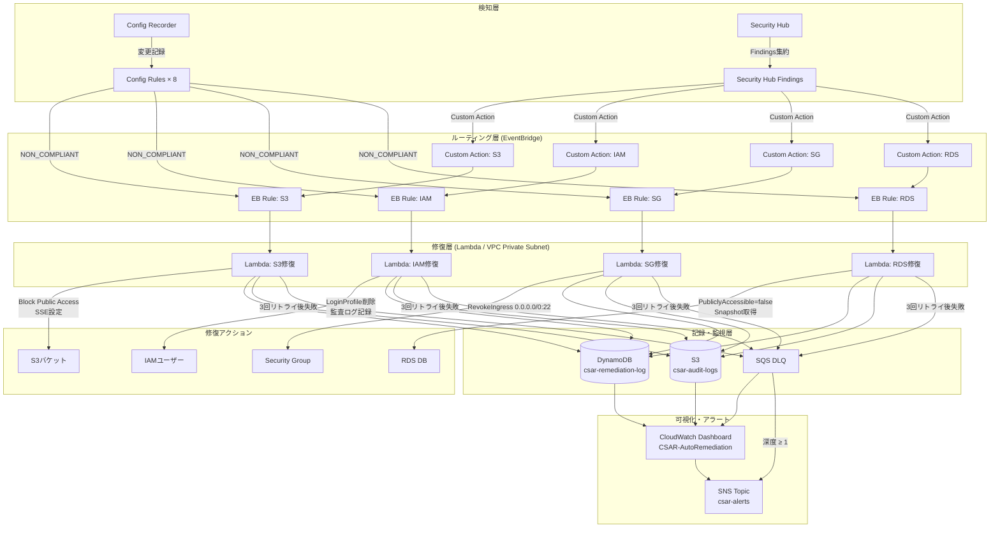

# CSAR アーキテクチャ図

## 全体フロー

## コスト構成 (月次概算)
| サービス | 想定コスト |
|---------|-----------|
| Config (8ルール × 記録) | ~$2-5 |
| Security Hub | ~$1-3 |
| Lambda (月100回以下) | 無料枠内 |
| DynamoDB (PAY_PER_REQUEST) | ~$1未満 |
| S3監査ログ (Intelligent-Tiering) | ~$1未満 |
| CloudWatch Dashboard | $3/Dashboard |
| **合計** | **$10-15/月** |

## EventBridge配線マトリクス

| Config Rule | EventBridge Rule | Lambda関数 |
|------------|-----------------|-----------|
| csar-s3-bucket-public-read-prohibited | csar-config-s3-noncompliant | csar-remediation-s3 |
| csar-s3-bucket-server-side-encryption-enabled | csar-config-s3-noncompliant | csar-remediation-s3 |
| csar-iam-user-mfa-enabled | csar-config-iam-noncompliant | csar-remediation-iam |
| csar-iam-user-no-policies-check | csar-config-iam-noncompliant | csar-remediation-iam |
| csar-restricted-ssh | csar-config-sg-noncompliant | csar-remediation-ec2-sg |
| csar-restricted-rdp | csar-config-sg-noncompliant | csar-remediation-ec2-sg |
| csar-rds-storage-encrypted | csar-config-rds-noncompliant | csar-remediation-rds |
| csar-rds-instance-public-access-check | csar-config-rds-noncompliant | csar-remediation-rds |
