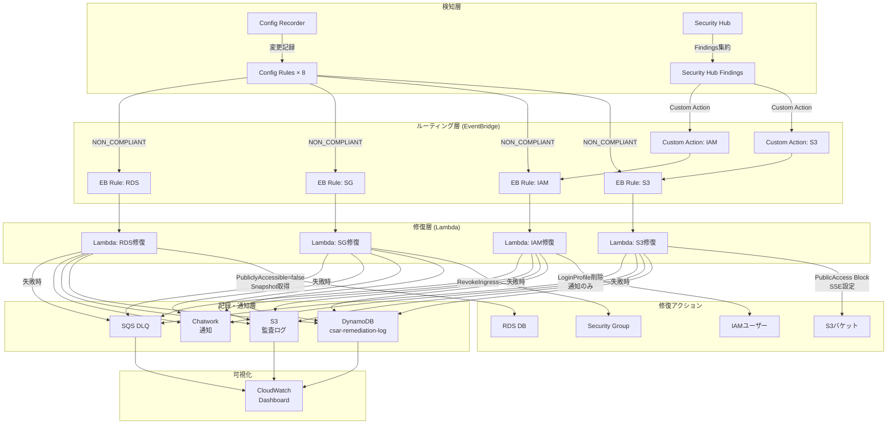

# Phase 5 — EventBridge配線完成 + CloudWatch Dashboard構築

## このフェーズの目的

Phase4でLambda ARNが確定したため、Phase2・Phase3のEventBridge TargetにARNを設定して配線を完成させる。
また CloudWatch Dashboard を構築し、修復実行状況を可視化する。

## 前提確認

```bash
# Phase4のLambda ARNを確認
cd terraform/environments/dev
terraform output -json | jq '{
  s3_arn: .s3_remediation_lambda_arn.value,
  iam_arn: .iam_remediation_lambda_arn.value,
  sg_arn: .sg_remediation_lambda_arn.value,
  rds_arn: .rds_remediation_lambda_arn.value
}'

# Lambda関数が存在すること
aws lambda list-functions --query "Functions[?contains(FunctionName,'csar')].{Name:FunctionName,State:State}"
```

## 作業内容

### 1. EventBridge配線の完成

`terraform/environments/dev/main.tf` の module "config" と module "security_hub" に
Phase4のLambda ARNを渡してapplyする。

```hcl
module "config" {
  source                      = "../../modules/config"
  config_service_role_arn     = module.iam.config_service_role_arn
  audit_bucket_name           = module.audit.audit_bucket_name
  dlq_arn                     = module.audit.dlq_arn
  eventbridge_invoke_role_arn = module.iam.eventbridge_invoke_role_arn

  # Phase4で確定したLambda ARNを設定
  s3_remediation_lambda_arn   = module.remediation.s3_remediation_lambda_arn
  iam_remediation_lambda_arn  = module.remediation.iam_remediation_lambda_arn
  sg_remediation_lambda_arn   = module.remediation.sg_remediation_lambda_arn
  rds_remediation_lambda_arn  = module.remediation.rds_remediation_lambda_arn
}

module "security_hub" {
  source                      = "../../modules/security_hub"
  dlq_arn                     = module.audit.dlq_arn

  # Phase4で確定したLambda ARNを設定
  s3_remediation_lambda_arn   = module.remediation.s3_remediation_lambda_arn
  iam_remediation_lambda_arn  = module.remediation.iam_remediation_lambda_arn
  sg_remediation_lambda_arn   = module.remediation.sg_remediation_lambda_arn
  rds_remediation_lambda_arn  = module.remediation.rds_remediation_lambda_arn
}
```

### 2. CloudWatch Dashboard

**ファイル**: `terraform/modules/dashboard/main.tf`

```hcl
resource "aws_cloudwatch_dashboard" "csar_main" {
  dashboard_name = "CSAR-AutoRemediation"

  dashboard_body = jsonencode({
    widgets = [
      # --- 行1: サマリー指標 ---
      {
        type   = "metric"
        x      = 0; y = 0; width = 8; height = 6
        properties = {
          title  = "修復実行数 (24時間)"
          view   = "timeSeries"
          stacked = false
          metrics = [
            ["CSAR", "RemediationSuccess", "service", "s3-remediation", { label = "S3 成功" }],
            ["CSAR", "RemediationSuccess", "service", "iam-remediation", { label = "IAM 成功" }],
            ["CSAR", "RemediationSuccess", "service", "sg-remediation", { label = "SG 成功" }],
            ["CSAR", "RemediationSuccess", "service", "rds-remediation", { label = "RDS 成功" }],
          ]
          period = 3600  # 1時間単位
          stat   = "Sum"
          region = "ap-northeast-1"
        }
      },
      {
        type   = "metric"
        x      = 8; y = 0; width = 8; height = 6
        properties = {
          title  = "修復失敗数 (24時間)"
          view   = "timeSeries"
          metrics = [
            ["CSAR", "RemediationFailed", "service", "s3-remediation", { label = "S3 失敗", color = "#d62728" }],
            ["CSAR", "RemediationFailed", "service", "iam-remediation", { label = "IAM 失敗", color = "#ff7f0e" }],
            ["CSAR", "RemediationFailed", "service", "sg-remediation", { label = "SG 失敗", color = "#e377c2" }],
            ["CSAR", "RemediationFailed", "service", "rds-remediation", { label = "RDS 失敗", color = "#8c564b" }],
          ]
          period = 3600
          stat   = "Sum"
          region = "ap-northeast-1"
        }
      },
      {
        type   = "metric"
        x      = 16; y = 0; width = 8; height = 6
        properties = {
          title  = "手動対応必要件数"
          view   = "timeSeries"
          metrics = [
            ["CSAR", "RemediationManualRequired", "service", "iam-remediation", { label = "IAM 手動対応" }],
            ["CSAR", "RemediationManualRequired", "service", "rds-remediation", { label = "RDS 手動対応" }],
          ]
          period = 3600
          stat   = "Sum"
          region = "ap-northeast-1"
        }
      },

      # --- 行2: Lambda エラー率 ---
      {
        type   = "metric"
        x      = 0; y = 6; width = 12; height = 6
        properties = {
          title  = "Lambda エラー率 (%)"
          view   = "timeSeries"
          metrics = [
            [{ expression = "m1/(m1+m2)*100", label = "S3修復エラー率" }],
            ["AWS/Lambda", "Errors", "FunctionName", "csar-s3-remediation", { id = "m1", visible = false }],
            ["AWS/Lambda", "Invocations", "FunctionName", "csar-s3-remediation", { id = "m2", visible = false }],
          ]
          period = 300
          stat   = "Sum"
          yAxis  = { left = { min = 0, max = 100 } }
          region = "ap-northeast-1"
        }
      },
      {
        type   = "metric"
        x      = 12; y = 6; width = 12; height = 6
        properties = {
          title  = "DLQ メッセージ数 (未処理)"
          view   = "timeSeries"
          metrics = [
            ["AWS/SQS", "ApproximateNumberOfMessagesVisible", "QueueName", "csar-remediation-dlq", { color = "#d62728" }],
          ]
          period = 300
          stat   = "Maximum"
          annotations = {
            horizontal = [{ value = 1, label = "要確認閾値", color = "#d62728" }]
          }
          region = "ap-northeast-1"
        }
      },

      # --- 行3: Lambda コールドスタート ---
      {
        type   = "metric"
        x      = 0; y = 12; width = 12; height = 6
        properties = {
          title  = "Lambda コールドスタート数"
          view   = "bar"
          metrics = [
            ["CSAR", "ColdStart", "service", "s3-remediation", { label = "S3" }],
            ["CSAR", "ColdStart", "service", "iam-remediation", { label = "IAM" }],
            ["CSAR", "ColdStart", "service", "sg-remediation", { label = "SG" }],
            ["CSAR", "ColdStart", "service", "rds-remediation", { label = "RDS" }],
          ]
          period = 86400  # 1日単位
          stat   = "Sum"
          region = "ap-northeast-1"
        }
      },
      {
        type   = "metric"
        x      = 12; y = 12; width = 12; height = 6
        properties = {
          title  = "Lambda 実行時間 (P99)"
          view   = "timeSeries"
          metrics = [
            ["AWS/Lambda", "Duration", "FunctionName", "csar-s3-remediation", { stat = "p99", label = "S3" }],
            ["AWS/Lambda", "Duration", "FunctionName", "csar-iam-remediation", { stat = "p99", label = "IAM" }],
            ["AWS/Lambda", "Duration", "FunctionName", "csar-sg-remediation", { stat = "p99", label = "SG" }],
            ["AWS/Lambda", "Duration", "FunctionName", "csar-rds-remediation", { stat = "p99", label = "RDS" }],
          ]
          period = 3600
          region = "ap-northeast-1"
        }
      },

      # --- 行4: Config Rules コンプライアンス ---
      {
        type   = "metric"
        x      = 0; y = 18; width = 24; height = 6
        properties = {
          title  = "Config Rules 非準拠リソース数 (過去7日)"
          view   = "timeSeries"
          metrics = [
            ["AWS/Config", "NonCompliantRuleCount", { label = "全ルール合計" }],
          ]
          period = 86400
          stat   = "Maximum"
          region = "ap-northeast-1"
        }
      },

      # --- テキストウィジェット: 運用メモ ---
      {
        type   = "text"
        x      = 0; y = 24; width = 24; height = 3
        properties = {
          markdown = <<-EOT
            ## CSAR 運用メモ
            - **DLQ に件数がある場合**: `aws sqs receive-message --queue-url {dlq_url}` でメッセージ内容を確認し手動対応
            - **手動対応必要 (RDS暗号化)**: スナップショットから暗号化済みDBを復元後、旧DBを削除する
            - **手動対応必要 (IAM直接ポリシー)**: IAMグループを作成してポリシーを移管する
            - **Config評価の手動トリガー**: `aws configservice start-config-rules-evaluation --config-rule-names {rule-name}`
          EOT
        }
      }
    ]
  })
}
```

### 3. CloudWatch アラーム

**ファイル**: `terraform/modules/dashboard/alarms.tf`

```hcl
# DLQメッセージ数アラーム (修復失敗の蓄積を検知)
resource "aws_cloudwatch_metric_alarm" "dlq_depth" {
  alarm_name          = "csar-dlq-messages-visible"
  alarm_description   = "修復DLQにメッセージが蓄積されています。手動確認が必要です。"
  comparison_operator = "GreaterThanOrEqualToThreshold"
  evaluation_periods  = 1
  metric_name         = "ApproximateNumberOfMessagesVisible"
  namespace           = "AWS/SQS"
  period              = 300
  statistic           = "Maximum"
  threshold           = 1
  treat_missing_data  = "notBreaching"

  dimensions = {
    QueueName = var.dlq_queue_name
  }

  # SNS Topicへの通知 (将来的にChatwork連携)
  alarm_actions = [aws_sns_topic.csar_alerts.arn]
  ok_actions    = [aws_sns_topic.csar_alerts.arn]
}

# Lambda エラー率アラーム (修復Lambdaの異常を検知)
resource "aws_cloudwatch_metric_alarm" "lambda_errors" {
  for_each = toset([
    "csar-s3-remediation",
    "csar-iam-remediation",
    "csar-sg-remediation",
    "csar-rds-remediation",
  ])

  alarm_name          = "csar-lambda-error-${each.key}"
  alarm_description   = "${each.key} のエラー率が高くなっています"
  comparison_operator = "GreaterThanOrEqualToThreshold"
  evaluation_periods  = 2
  metric_name         = "Errors"
  namespace           = "AWS/Lambda"
  period              = 300
  statistic           = "Sum"
  threshold           = 3  # 5分間に3回以上エラー
  treat_missing_data  = "notBreaching"

  dimensions = {
    FunctionName = each.key
  }

  alarm_actions = [aws_sns_topic.csar_alerts.arn]
}

# SNS Topic (アラーム集約用)
resource "aws_sns_topic" "csar_alerts" {
  name = "csar-alerts"
  # KMS暗号化
  kms_master_key_id = "alias/aws/sns"
}
```

### 4. ADR-004 テンプレート

`docs/adr/ADR-004-audit-storage.md`:
```markdown
# ADR-004: 監査ログをDynamoDBとS3の両方に書く設計

## ステータス
決定済み

## コンテキスト
修復ログの保管先として、DynamoDBのみ、S3のみ、または両方の3択があった。

## 検討した選択肢
- DynamoDBのみ
- S3のみ (JSON/Parquet形式)
- DynamoDB (オンライン参照用) + S3 (長期保管・コンプライアンス証跡用)

## 決定
DynamoDB + S3 の両方に書く。

## 決定理由
<!-- ⚠️ この欄はTakuya自身が記述してください。AI生成テキストの転用禁止 -->
<!-- 以下の観点を自分の言葉で説明してください:
  - DynamoDBで実現できてS3では難しいこと (クエリのパターン等)
  - S3で実現できてDynamoDBでは難しいこと (長期コスト、Glue/Athena連携等)
  - TTLをDynamoDBに設定してS3に長期保管する理由
  - 両方に書くことのデメリット (コスト・複雑性) と許容できる理由
-->

## 結果として生じるトレードオフ
- DynamoDBのwrite unitコストが発生するが、PAY_PER_REQUESTかつ低頻度なため許容範囲
- S3はGlacierに移行することで長期コストを抑える
```

### 5. アーキテクチャ図の完成

`docs/architecture.md`:

````markdown
# CSAR アーキテクチャ図

## 全体フロー



## コスト構成
- Config: $0.003/設定アイテム記録
- Security Hub: $0.001/Security Hub Finding記録
- Lambda: 月100回以下なら無料枠内
- DynamoDB: PAY_PER_REQUEST (修復1回あたり数円未満)
- S3: 90日後Glacier移行で長期コスト最小化
````

## 実行手順

```bash
cd terraform/environments/dev

# 1. EventBridge配線更新 (Lambda ARN追加)
terraform plan -out=tfplan
terraform apply tfplan

# 2. Dashboardの確認
aws cloudwatch get-dashboard --dashboard-name CSAR-AutoRemediation \
  --query "DashboardBody" | jq '.'

# 3. アラームの確認
aws cloudwatch describe-alarms \
  --alarm-name-prefix "csar" \
  --query "MetricAlarms[].{Name:AlarmName,State:StateValue}"

# 4. EventBridge配線の確認 (LambdaのARNがTargetに設定されているか)
for rule in s3 iam sg rds; do
  echo "=== csar-config-${rule}-noncompliant ==="
  aws events list-targets-by-rule \
    --rule "csar-config-${rule}-noncompliant" \
    --query "Targets[].{Id:Id,Arn:Arn}"
done
```

## 口頭説明チェック (Phase 5)

以下を見ずに説明できるか確認すること:

1. **CloudWatch EMFメトリクスの仕組み** — Lambda Powertoolsの `metrics.add_metric()` がどのようにCloudWatch カスタムメトリクスになるか？EMF (Embedded Metric Format) とは何か？

2. **EventBridge DLQ vs Lambda DLQ の違い** — EventBridgeレベルのDLQとLambda関数レベルのDLQはそれぞれどの失敗をキャッチするか？両方設定する意味は？

3. **CloudWatch DashboardをTerraformで管理する意義** — JSONをハードコードするデメリットと、IaC管理するメリットを説明できるか？

4. **SNS TopicをDashboardアラームの転送先にする理由** — Chatworkに直接通知しない理由と、SNSをハブにすることの拡張性は？

5. **DashboardのP99 Durationを監視する意図** — 平均値ではなくP99をみる理由と、修復Lambdaのタイムアウト設計(300秒)との関係は？