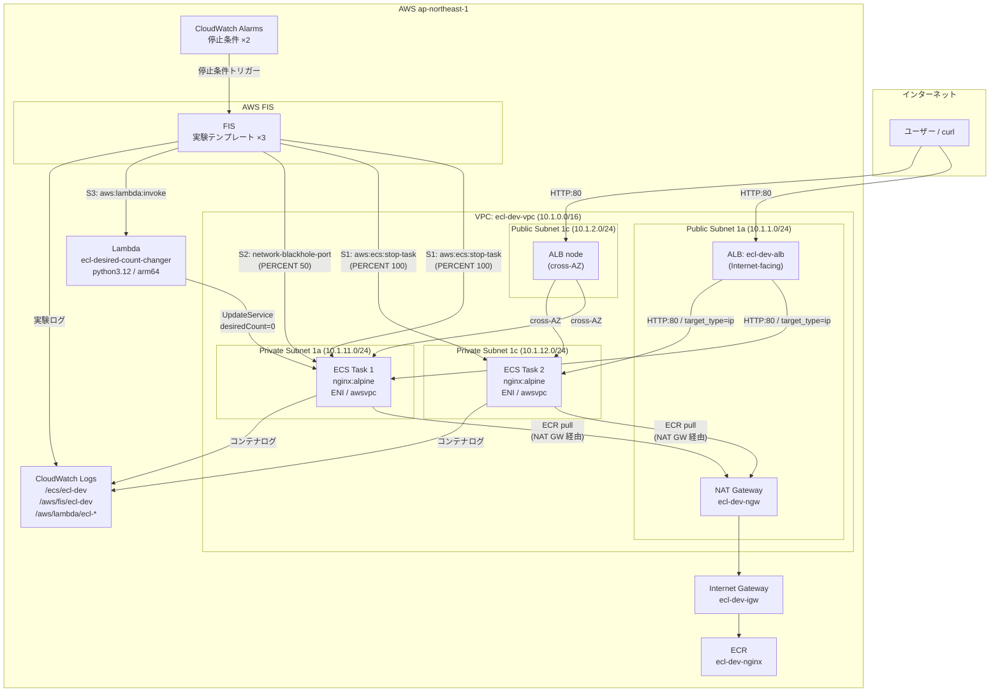
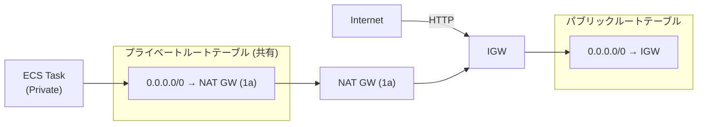
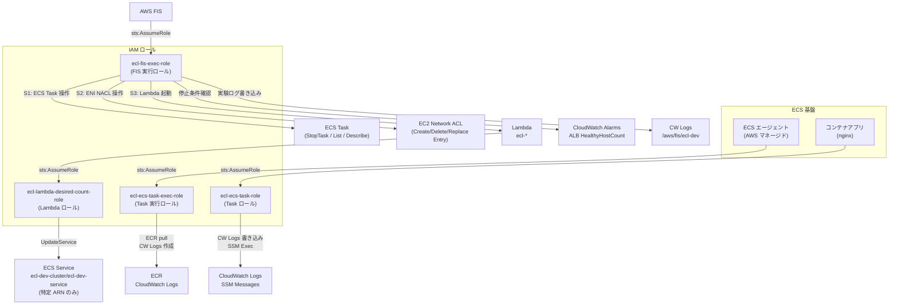
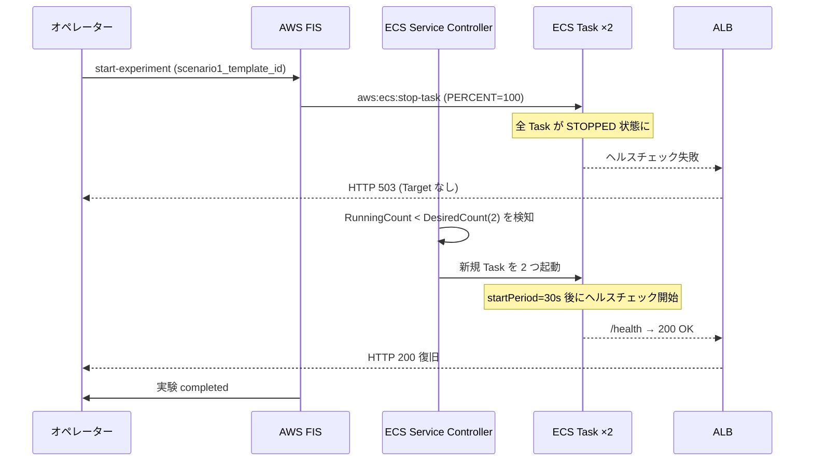
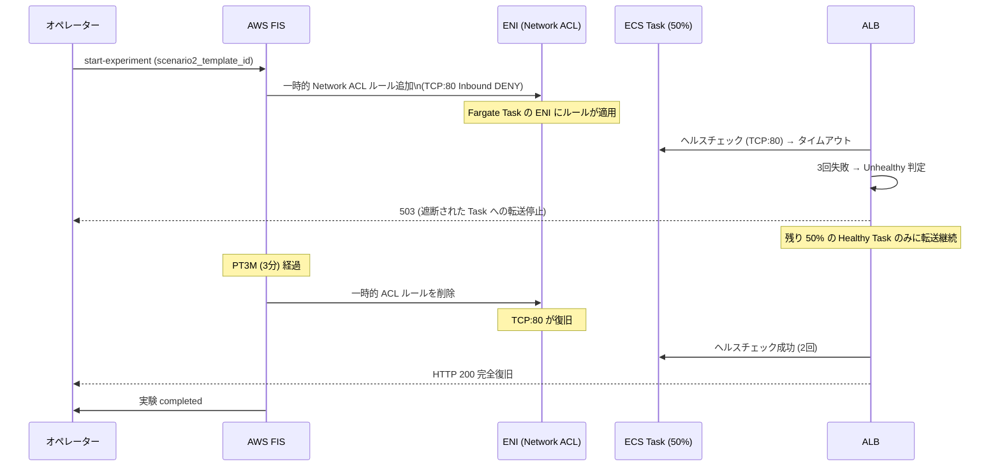
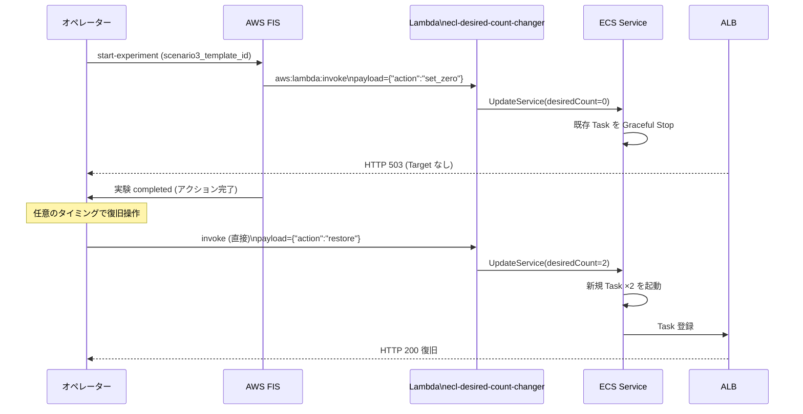
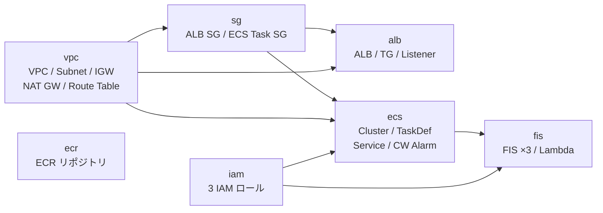
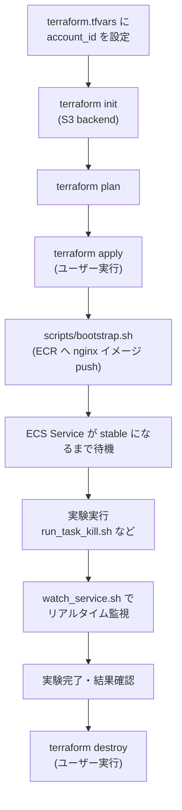

# ARCHITECTURE.md — ecs-chaos-lab 完全理解ガイド

> AWS FIS × ECS Fargate カオスエンジニアリング基盤の設計・構成・動作原理を網羅する。

---

## 目次

1. [プロジェクト全体像](#1-プロジェクト全体像)
2. [インフラ構成図（全体）](#2-インフラ構成図全体)
3. [ネットワーク設計](#3-ネットワーク設計)
4. [コンテナ基盤（ECS + ECR）](#4-コンテナ基盤ecs--ecr)
5. [ロードバランサー設計（ALB）](#5-ロードバランサー設計alb)
6. [IAM ロール設計](#6-iam-ロール設計)
7. [FIS 3シナリオの詳細](#7-fis-3シナリオの詳細)
8. [多層安全弁の設計](#8-多層安全弁の設計)
9. [Terraform モジュール構成](#9-terraform-モジュール構成)
10. [リソース命名規則とタグ戦略](#10-リソース命名規則とタグ戦略)
11. [コスト設計](#11-コスト設計)

---

## 1. プロジェクト全体像

### 何を検証するシステムか

ECS Fargate Service が**3種類の障害パターン**に対してどう振る舞うかを、
AWS FIS（Fault Injection Simulator）で再現可能な形で検証する。

| 障害パターン | FIS アクション | 検証内容 |
|-------------|---------------|---------|
| プロセス障害 | `aws:ecs:stop-task` | ECS Service Controller による Task 自動再起動速度 |
| ネットワーク障害 | `aws:ecs:task-network-blackhole-port` | ALB による Unhealthy Target の検知・切り離し速度 |
| 意図的スケールダウン | `aws:lambda:invoke` → ECS | DesiredCount=0 → 全停止 → 手動復旧の手順確立 |

### 設計の核心

```
"障害を意図的に起こし、回復することを事前に確認する"
```

- **FIS テンプレートを Terraform で IaC 化** → 実験の再現性・バージョン管理を確保
- **awsvpc ネットワークモード** → タスクごとに ENI が割り当てられ、FIS がタスクレベルで精密に動作
- **多層安全弁** → 実験が制御不能にならないよう CloudWatch アラームで自動停止

---

## 2. インフラ構成図（全体）



---

## 3. ネットワーク設計

### CIDR 割り当て

```
VPC: 10.1.0.0/16  (10.0.x.x は chaos-engineering-lab と競合回避のため 10.1.x.x を使用)
  ├── Public Subnet 1a:  10.1.1.0/24   ← ALB ノード + NAT GW
  ├── Public Subnet 1c:  10.1.2.0/24   ← ALB ノード (クロス AZ)
  ├── Private Subnet 1a: 10.1.11.0/24  ← ECS Task 配置
  └── Private Subnet 1c: 10.1.12.0/24  ← ECS Task 配置
```

### ルーティング



**NAT Gateway は 1a AZ のみ**（コスト削減: ~$35/月）。
1c のプライベートサブネットの Task も同じ NAT GW を経由する。

### セキュリティグループ

```
┌─────────────────────────────────────────────┐
│  ALB SG (ecl-dev-alb-sg)                   │
│  Inbound:  0.0.0.0/0 → TCP:80              │
│  Outbound: All (→ ECS Task SG)             │
└──────────────────────┬──────────────────────┘
                       │ Security Group 参照
┌──────────────────────▼──────────────────────┐
│  ECS Task SG (ecl-dev-ecs-task-sg)          │
│  Inbound:  ALB SG → TCP:80 のみ            │  ← 直接アクセス禁止
│  Outbound: All (ECR pull / CW Logs)        │
└─────────────────────────────────────────────┘
```

> ECS Task の Inbound は ALB SG の ID を参照して制限。
> FIS のネットワーク遮断はこの SG ルールとは別に、ENI レベルの **一時的 Network ACL** で実装される。

---

## 4. コンテナ基盤（ECS + ECR）

### ECR リポジトリ: `ecl-dev-nginx`

```
ecl-dev-nginx
├── image_tag_mutability: MUTABLE  (latest タグ上書き可)
├── scan_on_push: true             (プッシュ時に脆弱性スキャン)
├── lifecycle policy:
│     untagged イメージを 5 世代まで保持、超過分を自動削除
└── repository policy:
      同一アカウントの ECS Task のみ pull 許可
```

### コンテナ構成: `nginx:alpine`

```dockerfile
FROM nginx:alpine
# /health エンドポイント (200 OK "ok\n" を返す)
# / → /usr/share/nginx/html/index.html

EXPOSE 80
HEALTHCHECK --interval=10s --timeout=3s --retries=3 \
    CMD wget -qO- http://localhost/health || exit 1
```

`/health` は ALB ヘルスチェックとコンテナ内ヘルスチェックの両方が使用する。

### ECS クラスター: `ecl-dev-cluster`

```
ecl-dev-cluster
├── containerInsights: enabled  ← FIS 実験中の RunningTaskCount メトリクスを CloudWatch に送信
└── capacity_providers: FARGATE / FARGATE_SPOT
      default: FARGATE (weight=1)
```

### ECS タスク定義: `ecl-dev-task`

| 項目 | 値 | 理由 |
|------|-----|------|
| launch_type | FARGATE | EC2 管理不要。FIS awsvpc 前提 |
| network_mode | **awsvpc** | タスクごとに ENI → FIS がタスクレベルで遮断 |
| cpu | 256 (0.25 vCPU) | 最小スペック (nginx なので十分) |
| memory | 512 MB | 最小スペック |
| assign_public_ip | **false** | Private Subnet 配置 |
| execution_role | ecl-ecs-task-exec-role | ECR pull / CW Logs |
| task_role | ecl-ecs-task-role | アプリが使うロール (最小権限) |

### ECS サービス: `ecl-dev-service`

```
ecl-dev-service
├── desired_count: 2             ← 2 Task で冗長化
├── deployment_minimum_healthy_percent: 50   ← 1台生存中にローリング可
├── deployment_maximum_percent: 200
├── enable_execute_command: true ← ECS Exec でコンテナにアクセス可
└── lifecycle:
      ignore_changes = [desired_count]  ← FIS S3 で変更後に terraform apply が巻き戻さないよう保護
```

### ログ構成

```
/ecs/ecl-dev (CloudWatch Logs)
  └── nginx/{task-id}  ← コンテナの stdout/stderr

/aws/fis/ecl-dev (CloudWatch Logs)
  └── FIS 実験ごとのアクション実行ログ

/aws/lambda/ecl-desired-count-changer (CloudWatch Logs)
  └── Lambda の実行ログ
```

---

## 5. ロードバランサー設計（ALB）

```
Internet
  │ HTTP:80
  ▼
ALB: ecl-dev-alb  (public subnet ×2 / cross-AZ)
  │
  │ HTTP:80
  ▼
Target Group: ecl-dev-tg
  ├── target_type: ip       ← Fargate awsvpc モードに必須 ("instance" では TG 登録不可)
  ├── protocol: HTTP
  ├── port: 80
  └── health_check:
        path:                /health
        interval:            15 秒  ← FIS 実験中の変化を素早く検知
        timeout:             5 秒
        healthy_threshold:   2 回連続成功でHealthy
        unhealthy_threshold: 3 回連続失敗でUnhealthy
        matcher:             200
  │
  ├── Task 1 (10.1.11.x:80)
  └── Task 2 (10.1.12.x:80 または 10.1.11.x:80)
```

**ALB ヘルスチェックの時系列（シナリオ2 のタイムライン）**:

```
FIS 開始
  │
  ├── 0s:  Task の TCP:80 が NACL でブラックホール化
  ├── 15s: 1回目のヘルスチェックがタイムアウト (timeout=5s)
  ├── 30s: 2回目失敗
  ├── 45s: 3回目失敗 → UnhealthyCount++
  ├── ~45s: Target が Unhealthy に切り替わる
  ├── ~45s: ALB は Healthy な残り 50% の Task にのみ転送
  │
FIS 終了 (PT3M 後)
  │
  ├── 0s:  NACL ルールが削除、TCP:80 が復旧
  ├── 15s: 1回目のヘルスチェックが 200 を返す
  ├── 30s: 2回目成功 → Healthy に復帰
  └── ~30s: ALB が全 Target に転送を再開
```

---

## 6. IAM ロール設計

### ロール一覧と関係図



### 各ロールの権限詳細

#### `ecl-ecs-task-exec-role` — タスク起動時に ECS エージェントが使用

```
AmazonECSTaskExecutionRolePolicy (AWS マネージド)
  ├── ecr:GetAuthorizationToken
  ├── ecr:BatchCheckLayerAvailability
  ├── ecr:GetDownloadUrlForLayer
  ├── ecr:BatchGetImage
  ├── logs:CreateLogStream
  └── logs:PutLogEvents
```

#### `ecl-ecs-task-role` — コンテナアプリが使用

```
ecl-ecs-task-logs (インラインポリシー)
  ├── logs:CreateLogStream
  └── logs:PutLogEvents → /ecs/ecl-dev:* のみ

ecl-ecs-task-ssm (インラインポリシー)  ← ECS Exec 用
  ├── ssmmessages:CreateControlChannel
  ├── ssmmessages:CreateDataChannel
  ├── ssmmessages:OpenControlChannel
  └── ssmmessages:OpenDataChannel
```

#### `ecl-fis-exec-role` — FIS 実験実行時に使用

```
ecl-fis-exec-policy (インラインポリシー)
  ├── ECSTaskKill (S1)
  │     ecs:StopTask / DescribeTasks / ListTasks → Resource: *
  ├── NetworkDisruption (S2)
  │     ec2:DescribeNetworkInterfaces
  │     ec2:CreateNetworkAclEntry
  │     ec2:DeleteNetworkAclEntry
  │     ec2:DescribeNetworkAcls
  │     ec2:ReplaceNetworkAclEntry     → Resource: *
  ├── LambdaInvoke (S3)
  │     lambda:InvokeFunction → arn:aws:lambda:...:function:ecl-* のみ
  ├── StopConditionMonitoring
  │     cloudwatch:DescribeAlarms
  │     elasticloadbalancing:DescribeTargetHealth
  │     elasticloadbalancing:DescribeTargetGroups  → Resource: *
  └── FISLogs
        logs:CreateLogGroup / CreateLogStream / PutLogEvents / DescribeLogGroups
          → /aws/fis/* のみ
```

#### `ecl-lambda-desired-count-role` — Lambda が使用

```
ecl-lambda-desired-count-policy (インラインポリシー)
  ├── ecs:UpdateService
  └── ecs:DescribeServices
        → arn:aws:ecs:ap-northeast-1:{account}:service/ecl-dev-cluster/ecl-dev-service のみ

AWSLambdaBasicExecutionRole (マネージド)
  └── CW Logs 書き込み → /aws/lambda/ecl-desired-count-changer:*
```

> **Lambda リソースベースポリシー**: `fis.amazonaws.com` が実験テンプレート経由でのみ Invoke 可能。
> `source_arn: arn:aws:fis:...:experiment-template/*` で範囲を制限。

---

## 7. FIS 3シナリオの詳細

### シナリオ共通構造

```
FIS 実験テンプレート
├── role_arn:       ecl-fis-exec-role
├── stop_condition: CloudWatch アラーム（S3 のみ none）
├── action:         障害注入アクション
├── target:         対象 ECS Task（タグで絞り込み）
└── log_configuration: /aws/fis/ecl-dev
```

**タスクのターゲット指定方法**:
FIS は以下のタグで ECS Task を絞り込む。

```
aws:ecs:clusterName = ecl-dev-cluster
aws:ecs:serviceName = ecl-dev-service
```

---

### シナリオ1: Task 強制停止



| 項目 | 値 |
|------|-----|
| action_id | `aws:ecs:stop-task` |
| selection_mode | `PERCENT(100)` — 全 Task を停止 |
| stop_condition | `ecl-dev-fis-stop-running-task-low` |
| アラーム条件 | RunningTaskCount < 1 が **300 秒**継続 |
| 合格基準 | 実験後 **120 秒以内** に RunningCount = 2 |

---

### シナリオ2: ネットワーク遮断



| 項目 | 値 |
|------|-----|
| action_id | `aws:ecs:task-network-blackhole-port` |
| trafficType | `ingress` (ALB → Task 方向) |
| port / protocol | `80 / tcp` |
| duration | `PT3M` (3分) |
| selection_mode | `PERCENT(50)` — 半数のみ遮断（全断を防ぐ） |
| stop_condition | `ecl-dev-fis-stop-healthy-host-zero` |
| アラーム条件 | HealthyHostCount < 1 が **180 秒**継続 |
| 合格基準 | FIS 終了後 **60 秒以内** に HTTP 200 復旧 |

**なぜ PERCENT(50) か**:

```
PERCENT(100) → Task 2台すべて遮断 → ALB HealthyHostCount = 0 → 全断
PERCENT(50)  → Task 1台のみ遮断  → ALB HealthyHostCount = 1 → 部分断 + 自動復旧
```

---

### シナリオ3: DesiredCount=0



| 項目 | 値 |
|------|-----|
| action_id | `aws:lambda:invoke` |
| invocationType | `sync` (Lambda の結果を FIS ログに記録) |
| payload | `{"action": "set_zero"}` (Base64 エンコード済み) |
| stop_condition | **none** (意図的スケールダウンは危険でないため) |
| 合格基準 | restore 後 **180 秒以内** に RunningCount = 2 |

**Lambda の実装**:

```python
# desired_count_changer.py (arm64 / python3.12)
# 環境変数: CLUSTER_NAME, SERVICE_NAME, TARGET_COUNT=0, RESTORE_COUNT=2

def lambda_handler(event, context):
    action = event.get("action", "set_zero")
    desired = TARGET_COUNT if action == "set_zero" else RESTORE_COUNT
    ecs.update_service(cluster=CLUSTER_NAME, service=SERVICE_NAME,
                       desiredCount=desired, forceNewDeployment=False)
```

**なぜ FIS ネイティブアクションを使わないか**:
FIS には `aws:ecs:update-service-desired-count` に相当するネイティブアクションが存在しない。
Lambda を `aws:lambda:invoke` 経由で呼び出すことで、実験のトレーサビリティ（FIS ログへの記録）を確保しつつ実現する。

---

## 8. 多層安全弁の設計

カオス実験が「想定外の全断」や「実験後に戻せない状態」になるリスクを複数の層で防御する。

```
レイヤー1: FIS 停止条件 (CloudWatch アラーム)
    ├── S1: RunningTaskCount < 1 が 5分継続 → 実験を強制停止
    └── S2: HealthyHostCount < 1 が 3分継続 → 実験を強制停止
         ↓
レイヤー2: ネットワーク遮断率の制限
    └── S2 を PERCENT(50) に制限 → 常に最低 1 Task は Healthy を維持
         ↓
レイヤー3: IAM 最小権限
    ├── FIS ロール: 必要な操作のみに限定
    └── Lambda ロール: 特定サービスの ARN のみに制限
         ↓
レイヤー4: 実験 duration 制限
    └── S2: PT3M (3分) で自動終了 → 長時間断を防止
         ↓
レイヤー5: ECS Service 自動復旧 (プラットフォーム標準機能)
    └── desired_count=2 を維持しようと ECS Controller が Task を再起動
```

### CloudWatch アラーム詳細

```
ecl-dev-fis-stop-running-task-low (シナリオ1 停止条件)
  Namespace:  ECS/ContainerInsights
  Metric:     RunningTaskCount
  Dimensions: ClusterName=ecl-dev-cluster, ServiceName=ecl-dev-service
  Condition:  < 1 (Average)
  Period:     300 秒
  Evaluation: 1 period

ecl-dev-fis-stop-healthy-host-zero (シナリオ2 停止条件)
  Namespace:  AWS/ApplicationELB
  Metric:     HealthyHostCount
  Dimensions: TargetGroup={suffix}, LoadBalancer={suffix}
  Condition:  < 1 (Average)
  Period:     180 秒
  Evaluation: 1 period
```

---

## 9. Terraform モジュール構成

### ディレクトリ構造

```
terraform/
├── environments/
│   └── dev/
│       ├── main.tf       ← モジュール呼び出し・depends_on 定義
│       ├── variables.tf  ← 入力変数 (CIDR / CPU / Memory / etc.)
│       ├── outputs.tf    ← スクリプトが参照する terraform output
│       ├── locals.tf     ← common_tags, ecr_image_uri
│       ├── versions.tf   ← Terraform / AWS プロバイダーバージョン固定
│       └── terraform.tfvars ← prefix=ecl / env=dev / account_id
└── modules/
    ├── vpc/    # ネットワーク基盤
    ├── sg/     # セキュリティグループ
    ├── ecr/    # コンテナリポジトリ
    ├── alb/    # ロードバランサー
    ├── iam/    # 全 IAM ロール
    ├── ecs/    # クラスター / タスク定義 / サービス / CW アラーム
    └── fis/    # FIS テンプレート ×3 + Lambda
        └── lambda_src/
            └── desired_count_changer.py
```

### モジュール依存関係



### Terraform State

```
Backend: S3 (暗号化あり)
  bucket: ecl-tfstate-{account_id}
  key:    ecs-chaos-lab/dev/terraform.tfstate

Lock: DynamoDB
  table: ecl-tfstate-lock
  key:   LockID
```

### 主要 Outputs（スクリプトが参照）

| output 名 | 用途 |
|-----------|------|
| `scenario1_template_id` | `run_task_kill.sh` の TEMPLATE_ID |
| `scenario2_template_id` | `run_network_disruption.sh` の TEMPLATE_ID |
| `scenario3_template_id` | `run_desired_zero.sh` の TEMPLATE_ID |
| `cluster_name` | 全スクリプトの CLUSTER_NAME |
| `service_name` | 全スクリプトの SERVICE_NAME |
| `alb_dns_name` | ALB の動作確認 URL |
| `lambda_function_name` | `run_desired_zero.sh` restore の LAMBDA_NAME |

---

## 10. リソース命名規則とタグ戦略

### 命名規則

```
{prefix}-{env}-{resource}

prefix = "ecl"  (ecs-chaos-lab の略)
env    = "dev"

例:
  ecl-dev-vpc
  ecl-dev-alb
  ecl-dev-cluster
  ecl-dev-service
  ecl-dev-nginx      (ECR)
  ecl-fis-exec-role  (IAM ロールは env を含まない: 64文字制限対策)
```

### タグ戦略

```hcl
# provider "aws" の default_tags (versions.tf)
default_tags = {
  Project   = "ecs-chaos-lab"
  ManagedBy = "terraform"
}

# 各モジュールで追加
common_tags = {
  Env = "dev"
}

# リソース個別
Name = "ecl-dev-vpc"  # など
```

FIS の Task ターゲット選択にも ECS が自動付与するタグを使用:

```
aws:ecs:clusterName = ecl-dev-cluster
aws:ecs:serviceName = ecl-dev-service
```

---

## 11. コスト設計

### 月額概算

| リソース | スペック | 月額 |
|----------|---------|------|
| Fargate Task × 2 | 0.25 vCPU / 512 MB / 24h稼働 | ~$8 |
| ALB | 1 LCU 以下想定 | ~$20 |
| **NAT Gateway** | 1 AZ / トラフィック少量 | **~$35** |
| ECR ストレージ | < 1 GB | ~$0.10 |
| FIS 実験 | 従量 (実験回数による) | ~$1 |
| CloudWatch Logs | 少量 | ~$1 |
| **合計** | | **~$65** |

> NAT Gateway が最大コスト要因 (~54%)。検証後は `terraform destroy` 推奨。

### コスト削減設計の判断

| 判断 | 内容 |
|------|------|
| NAT GW 1AZ のみ | 2AZ にすると +$35/月。検証環境なので 1AZ で十分 |
| Fargate 最小スペック | 0.25 vCPU / 512 MB は nginx には十分 |
| ECR ライフサイクル | 古い untagged イメージを自動削除 |
| Lambda arm64 | x86_64 比でコスト約 20% 削減 |

---

## Appendix: セットアップフロー


