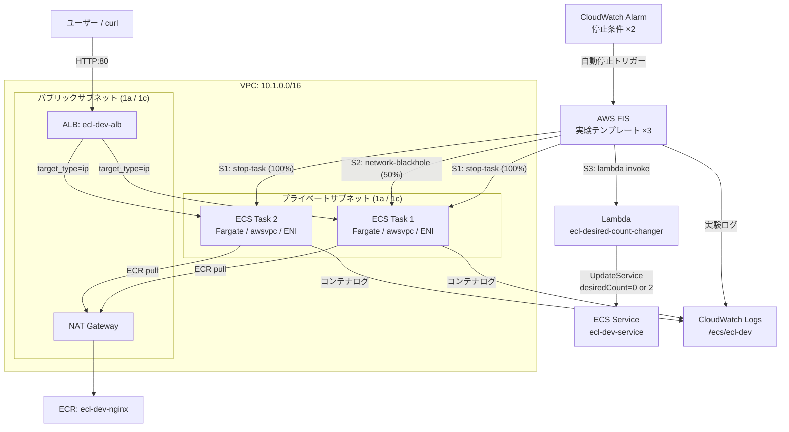

# ecs-chaos-lab

> AWS FIS × ECS Fargate による3シナリオ カオスエンジニアリング基盤

---

## このハンズオンで得られること

このハンズオンを完走すると、以下のスキルと知識が身につく。

### 技術スキル

| カテゴリ | 習得内容 |
|----------|---------|
| **AWS FIS** | ECS ネイティブアクション（`stop-task` / `task-network-blackhole-port`）の実行方法と停止条件の設定方法 |
| **ECS Fargate** | awsvpc ネットワークモードの仕組み、Service Controller による Task 自動再起動の動作 |
| **ALB** | ヘルスチェックによる Unhealthy Target の自動切り離しタイミングと挙動 |
| **Terraform** | マルチモジュール構成での IaC 設計、FIS 実験テンプレートの Terraform 化 |
| **Lambda** | FIS アクションとして Lambda を組み込むカスタム障害注入パターン |
| **IAM** | FIS / ECS / Lambda それぞれの最小権限ロール設計 |

### カオスエンジニアリングの実践知識

- **「壊して確かめる」**という考え方の体験：合格基準を定めてから実験し、数値で回復性を証明する
- **停止条件**（Stop Condition）による実験の安全な自動終了の設計
- **多層安全弁**の組み合わせ方（FIS 停止条件 × CloudWatch × IAM 最小権限 × 遮断率制限）
- 3種類の障害パターン（プロセス障害 / ネットワーク障害 / 意図的スケールダウン）の違いと観測方法

### ポートフォリオ訴求ポイント

- FIS + ECS の組み合わせは実務での採用事例が少なく、差別化しやすい領域
- **Infrastructure as Code で実験が再現可能**であることを示せる（`terraform apply` → 同じ環境が再現）
- 合格基準と実験結果が数値で記録されるため、レビューや説明に使いやすい

---

## アーキテクチャ



---

## シナリオ一覧

| # | シナリオ | FIS アクション | 観測ポイント | 合格基準 |
|---|----------|----------------|-------------|----------|
| 1 | Task 強制停止 | `aws:ecs:stop-task` | Service 自己回復速度 | 120 秒以内に RunningCount=2 |
| 2 | ネットワーク遮断 | `aws:ecs:task-network-blackhole-port` | ALB Unhealthy 切り離し | FIS 終了後 60 秒以内に HTTP 200 |
| 3 | DesiredCount=0 | `aws:lambda:invoke` | 手動復旧手順の確立 | restore 後 180 秒以内に RunningCount=2 |

---

## ハンズオン実行手順

### 前提条件

以下のツールがインストール済みであることを確認する。

```bash
aws --version      # AWS CLI v2 が必要 (v2.x.x)
terraform -version # >= 1.9.0
docker --version   # Docker Desktop または Docker Engine
jq --version       # JSON パーサー (jq-1.6 以上)
curl --version     # ヘルスチェック確認用
```

AWS 認証情報が設定済みであることを確認する。

```bash
aws sts get-caller-identity
# 出力例:
# {
#   "UserId": "AIDAXXXXXXXXXXXXXXXXX",
#   "Account": "123456789012",
#   "Arn": "arn:aws:iam::123456789012:user/your-user"
# }
```

必要な IAM 権限（最低限）:

```
AmazonECS_FullAccess
AmazonEC2FullAccess
AmazonVPCFullAccess
ElasticLoadBalancingFullAccess
AmazonECR_FullAccess
AWSFaultInjectionSimulatorFullAccess
IAMFullAccess
AWSLambda_FullAccess
AmazonS3FullAccess
AmazonDynamoDBFullAccess
CloudWatchFullAccess
```

---

### Step 1: リポジトリのクローン

```bash
git clone <this-repo>
cd ecs-chaos-lab
```

---

### Step 2: Terraform State 用リソースの事前作成

Terraform は状態ファイルを S3 に保存し、DynamoDB でロックを管理する。
**これらは Terraform 管理外のため、手動で一度だけ作成する。**

```bash
# アカウント ID を変数に設定
ACCOUNT_ID=$(aws sts get-caller-identity --query Account --output text)
REGION="ap-northeast-1"

# S3 バケットを作成（バケット名はグローバルで一意）
aws s3 mb "s3://ecl-tfstate-${ACCOUNT_ID}" --region ${REGION}

# バージョニングを有効化（State の誤上書き防止）
aws s3api put-bucket-versioning \
  --bucket "ecl-tfstate-${ACCOUNT_ID}" \
  --versioning-configuration Status=Enabled

# サーバーサイド暗号化を有効化
aws s3api put-bucket-encryption \
  --bucket "ecl-tfstate-${ACCOUNT_ID}" \
  --server-side-encryption-configuration \
  '{"Rules":[{"ApplyServerSideEncryptionByDefault":{"SSEAlgorithm":"AES256"}}]}'

# DynamoDB ロックテーブルを作成
aws dynamodb create-table \
  --table-name ecl-tfstate-lock \
  --attribute-definitions AttributeName=LockID,AttributeType=S \
  --key-schema AttributeName=LockID,KeyType=HASH \
  --billing-mode PAY_PER_REQUEST \
  --region ${REGION}

echo "✅ State リソース作成完了: s3://ecl-tfstate-${ACCOUNT_ID}"
```

---

### Step 3: Terraform 設定ファイルの編集

#### 3-1. S3 バックエンドのバケット名を更新

`terraform/environments/dev/versions.tf` の `REPLACE_ME` をアカウント ID に置換する。

```bash
ACCOUNT_ID=$(aws sts get-caller-identity --query Account --output text)

sed -i "s/ecl-tfstate-REPLACE_ME/ecl-tfstate-${ACCOUNT_ID}/" \
  terraform/environments/dev/versions.tf

# 確認
grep "bucket" terraform/environments/dev/versions.tf
# → bucket = "ecl-tfstate-123456789012"
```

#### 3-2. terraform.tfvars にアカウント ID を設定

```bash
ACCOUNT_ID=$(aws sts get-caller-identity --query Account --output text)

# terraform.tfvars を編集
cat terraform/environments/dev/terraform.tfvars
# → account_id = ""  の "" の中にアカウント ID を設定

sed -i "s/account_id = \"\"/account_id = \"${ACCOUNT_ID}\"/" \
  terraform/environments/dev/terraform.tfvars

# 確認
cat terraform/environments/dev/terraform.tfvars
# prefix     = "ecl"
# env        = "dev"
# aws_region = "ap-northeast-1"
# account_id = "123456789012"
```

---

### Step 4: Terraform 初期化

```bash
cd terraform/environments/dev
terraform init
```

成功すると以下のような出力が表示される。

```
Initializing the backend...
Successfully configured the backend "s3"!

Initializing modules...
- alb in ../../modules/alb
- ecr in ../../modules/ecr
- ecs in ../../modules/ecs
- fis in ../../modules/fis
- iam in ../../modules/iam
- sg in ../../modules/sg
- vpc in ../../modules/vpc

Terraform has been successfully initialized!
```

---

### Step 5: Terraform Plan で変更内容を確認

```bash
terraform plan
```

以下のリソースが作成されることを確認する（約 40 リソース）。

```
# 主要リソース
+ aws_vpc.main                             (ecl-dev-vpc)
+ aws_subnet.public[0,1]                   (パブリック ×2)
+ aws_subnet.private[0,1]                  (プライベート ×2)
+ aws_nat_gateway.main                     (NAT GW: ~$35/月)
+ aws_security_group.alb                   (ALB SG)
+ aws_security_group.ecs_task              (ECS Task SG)
+ aws_lb.main                              (ALB: ~$20/月)
+ aws_lb_target_group.main                 (TG: target_type=ip)
+ aws_ecr_repository.nginx                 (ecl-dev-nginx)
+ aws_iam_role.task_execution              (ECS Task 実行ロール)
+ aws_iam_role.task                        (ECS Task ロール)
+ aws_iam_role.fis_execution               (FIS 実行ロール)
+ aws_ecs_cluster.main                     (ecl-dev-cluster)
+ aws_ecs_task_definition.main             (ecl-dev-task)
+ aws_ecs_service.main                     (ecl-dev-service)
+ aws_cloudwatch_metric_alarm.running_task_count_low
+ aws_cloudwatch_metric_alarm.healthy_host_count_zero
+ aws_lambda_function.desired_count_changer
+ aws_fis_experiment_template.task_kill
+ aws_fis_experiment_template.network_disruption
+ aws_fis_experiment_template.desired_zero
...

Plan: 40 to add, 0 to change, 0 to destroy.
```

> **コスト注意**: NAT Gateway (~$35/月) と ALB (~$20/月) が主なコスト要因。
> 検証後は必ず `terraform destroy` を実行すること。

---

### Step 6: インフラのデプロイ

```bash
terraform apply
# "yes" と入力して実行
```

完了まで約 **5〜7 分**かかる。

```
Apply complete! Resources: 40 added, 0 changed, 0 destroyed.

Outputs:
alb_dns_name         = "ecl-dev-alb-xxxxxxxxxx.ap-northeast-1.elb.amazonaws.com"
cluster_name         = "ecl-dev-cluster"
lambda_function_name = "ecl-desired-count-changer"
scenario1_template_id = "EXT1234567890ABCDEF"
scenario2_template_id = "EXT0987654321FEDCBA"
scenario3_template_id = "EXTAABBCCDDEEFF0011"
service_name         = "ecl-dev-service"
...
```

ルートディレクトリに戻る。

```bash
cd ../../..  # ecs-chaos-lab/ に戻る
```

---

### Step 7: コンテナイメージを ECR にプッシュ

ECS Task は ECR のイメージを参照する。初回は `bootstrap.sh` でビルド＆プッシュする。

```bash
./scripts/bootstrap.sh
```

処理内容:
1. ECR に docker login
2. `app/` ディレクトリ内の Dockerfile をビルド（nginx:alpine ベース）
3. `ecl-dev-nginx:latest` タグで ECR にプッシュ

```
[INFO] ECR ログイン...
Login Succeeded
[INFO] イメージビルド...
[INFO] イメージタグ付け...
[INFO] ECR へのプッシュ...
[SUCCESS] プッシュ完了: 123456789012.dkr.ecr.ap-northeast-1.amazonaws.com/ecl-dev-nginx:latest
```

---

### Step 8: ECS Service の起動確認

ECS Service が stable 状態（RunningCount = DesiredCount = 2）になるまで待機する。

```bash
# ECS Service が stable になるまで待機（最大 10 分）
aws ecs wait services-stable \
  --cluster ecl-dev-cluster \
  --services ecl-dev-service \
  --region ap-northeast-1

echo "✅ ECS Service が stable になりました"
```

確認コマンドで RunningCount=2 を確認する。

```bash
aws ecs describe-services \
  --cluster ecl-dev-cluster \
  --services ecl-dev-service \
  --region ap-northeast-1 \
  --query 'services[0].{desired:desiredCount,running:runningCount,pending:pendingCount,status:status}'

# 期待する出力:
# {
#     "desired": 2,
#     "running": 2,
#     "pending": 0,
#     "status": "ACTIVE"
# }
```

---

### Step 9: ALB の動作確認

ALB DNS 名を取得して HTTP アクセスが成功することを確認する。

```bash
ALB_DNS=$(terraform -chdir=terraform/environments/dev output -raw alb_dns_name)

# ヘルスチェックエンドポイントを確認
curl http://${ALB_DNS}/health
# 期待する出力: ok

# HTTP ステータスコードを確認
curl -s -o /dev/null -w "%{http_code}" http://${ALB_DNS}/health
# 期待する出力: 200

# トップページを確認
curl http://${ALB_DNS}/
# 期待する出力: HTML コンテンツ
```

> `200` が返ってきたら実験準備完了。まだ返ってこない場合は数分待ってリトライ。

---

### Step 10: 環境変数の設定

全実験スクリプトで使用する環境変数を設定する。
**新しいターミナルセッションを開くたびに再実行が必要。**

```bash
# プロジェクトルート (ecs-chaos-lab/) から実行
export CLUSTER_NAME=$(terraform -chdir=terraform/environments/dev output -raw cluster_name)
export SERVICE_NAME=$(terraform -chdir=terraform/environments/dev output -raw service_name)
export ALB_DNS=$(terraform -chdir=terraform/environments/dev output -raw alb_dns_name)
export LAMBDA_FUNCTION_NAME=$(terraform -chdir=terraform/environments/dev output -raw lambda_function_name)
export SCENARIO1_TEMPLATE_ID=$(terraform -chdir=terraform/environments/dev output -raw scenario1_template_id)
export SCENARIO2_TEMPLATE_ID=$(terraform -chdir=terraform/environments/dev output -raw scenario2_template_id)
export SCENARIO3_TEMPLATE_ID=$(terraform -chdir=terraform/environments/dev output -raw scenario3_template_id)

# 確認
echo "Cluster:   ${CLUSTER_NAME}"
echo "Service:   ${SERVICE_NAME}"
echo "ALB:       ${ALB_DNS}"
echo "S1:        ${SCENARIO1_TEMPLATE_ID}"
echo "S2:        ${SCENARIO2_TEMPLATE_ID}"
echo "S3:        ${SCENARIO3_TEMPLATE_ID}"
```

> 環境変数が設定されていない場合、各スクリプトが自動的に `terraform output` から取得するため省略も可能。

---

### Step 11: シナリオ1 — Task 強制停止

**目的**: ECS Service Controller が Task 停止を検知し、自動的に新 Task を起動することを確認する。

#### 監視ターミナルを起動（別ターミナル推奨）

```bash
# ターミナルA: Service の状態をリアルタイム監視
./scripts/watch_service.sh
```

以下のような画面が 10 秒ごとに更新される。

```
=== ECS Service 監視: 2026-05-11 12:00:00 ===

  Status       : ACTIVE
  DesiredCount : 2
  RunningCount : 2
  PendingCount : 0

  ALB /health  : HTTP 200

  直近のイベント（上位5件）:
  [2026-05-11T12:00:00] (service ecl-dev-service) has reached a steady state.
```

#### 実験を実行（メインターミナル）

```bash
# ターミナルB: 実験実行
./scripts/run_task_kill.sh
```

実行中の出力例:

```
========================================
 シナリオ1: ECS Task 強制停止
 テンプレート: EXT1234567890ABCDEF
 クラスター: ecl-dev-cluster / ecl-dev-service
========================================
[INFO] 実験前 RunningCount: 2
[INFO] FIS 実験を起動...
[INFO] 実験 ID: EXP0987654321ABCDEF

[12:00:10] FIS: running | RunningCount: 0   ← Task が全停止
[12:00:30] FIS: running | RunningCount: 0
[12:00:50] FIS: completed | RunningCount: 1 ← Task が再起動し始める
[12:01:10] FIS: completed | RunningCount: 2 ← 完全復旧

[INFO] Service 復旧を待機中（最大 3 分）...

========================================
 実験結果サマリー
========================================
 実験 ID: EXP0987654321ABCDEF
 最終ステータス: completed
 実験前 RunningCount: 2
 実験後 RunningCount: 2
 復旧時間: 約 60 秒

 ✅ 合格: Service が 60 秒以内に RunningCount=2 に復旧
 ALB: http://ecl-dev-alb-xxx.elb.amazonaws.com/health
 FIS ログ: CloudWatch Logs /aws/fis/ecl-dev
========================================
```

#### 観察ポイント

- `watch_service.sh` で RunningCount が `0 → 1 → 2` と変化する様子を確認
- 実験中に `watch_service.sh` の「直近のイベント」に Task 停止・起動のログが流れる
- ALB ヘルスチェックが一時的に失敗し、復旧する

---

### Step 12: シナリオ2 — ネットワーク遮断

**目的**: FIS が ECS Task の ENI に一時的な Network ACL を追加し、ALB ヘルスチェックが失敗→ Unhealthy 切り離し→自動復旧する流れを確認する。

#### 監視ターミナルを準備（推奨: ターミナル2本）

```bash
# ターミナルA: Service 監視（継続中なら不要）
./scripts/watch_service.sh

# ターミナルB: ALB レスポンスをリアルタイム監視
watch -n 3 "curl -s -o /dev/null -w 'HTTP: %{http_code}\n' http://${ALB_DNS}/health"
```

#### 実験を実行（メインターミナル）

```bash
# ターミナルC: 実験実行
./scripts/run_network_disruption.sh
```

実行中の出力例:

```
========================================
 シナリオ2: ネットワーク遮断
 テンプレート: EXT0987654321FEDCBA
 クラスター: ecl-dev-cluster / ecl-dev-service
========================================
[INFO] 実験前 ALB HTTP: 200
[INFO] 実験前 RunningCount: 2
[INFO] FIS 実験を起動...
[INFO] 実験 ID: EXPABCDEF1234567890

[12:05:00] FIS: running | HTTP: 200 | RunningCount: 2
[12:05:15] FIS: running | HTTP: 200 | RunningCount: 2
[12:05:30] FIS: running | HTTP: 503 | RunningCount: 2  ← 遮断を検知
[12:05:45] FIS: running | HTTP: 503 | RunningCount: 2
[12:06:00] FIS: running | HTTP: 503 | RunningCount: 2
[12:08:00] FIS: completed | HTTP: 503 | RunningCount: 2 ← FIS 終了

[INFO] ALB が Healthy に戻るまで最大 2 分待機...
[12:08:15] HTTP: 503
[12:08:30] HTTP: 200  ← 復旧確認
✅ 復旧確認

 ✅ 合格: 遮断中に HTTP 503 を観測し、実験終了後に 200 に復旧
```

#### 観察ポイント

- FIS が開始してから HTTP 503 が出始めるまで **30〜60 秒**かかる
  （ALB ヘルスチェックが 3 回失敗するまで: interval=15s × 3回）
- `watch_service.sh` の RunningCount は **変化しない**（Task は生きているが通信できない状態）
- FIS 終了後の HTTP 200 復旧も **30 秒前後**かかる（ヘルスチェックが 2 回成功するまで）

---

### Step 13: シナリオ3 — DesiredCount=0 → 手動復旧

**目的**: Lambda を FIS アクションとして呼び出し、ECS Service を意図的にゼロスケールさせ、手動復旧手順を確立する。

> シナリオ1・2 と異なり、FIS 実験終了後も **自動では復旧しない**。
> 復旧は `run_desired_zero.sh restore` を明示的に実行する必要がある。

#### Step 13-1: DesiredCount を 0 に変更（全 Task 停止）

```bash
# ターミナルA: Service 監視（継続中なら不要）
./scripts/watch_service.sh

# ターミナルB: 実験実行（全 Task を停止）
./scripts/run_desired_zero.sh set_zero
```

出力例:

```
========================================
 シナリオ3: DesiredCount=0 (全 Task 停止)
 テンプレート: EXTAABBCCDDEEFF0011
 クラスター: ecl-dev-cluster / ecl-dev-service
========================================
[INFO] 実験前 RunningCount: 2
[INFO] FIS 実験開始: DesiredCount を 0 に変更...
[INFO] 実験 ID: EXPFEDCBA9876543210

[INFO] ECS Service を監視: ./scripts/watch_service.sh
[INFO] 復旧するには: ./scripts/run_desired_zero.sh restore
[INFO] 実験 ID を保存: export EXPERIMENT_ID=EXPFEDCBA9876543210
```

#### Step 13-2: 全 Task が停止・ALB が 503 を返すことを確認

`watch_service.sh` の画面で以下を確認する。

```
=== ECS Service 監視: 2026-05-11 12:10:30 ===

  Status       : ACTIVE
  DesiredCount : 0    ← Lambda が 0 に変更した
  RunningCount : 0    ← Task が全停止
  PendingCount : 0

  ALB /health  : HTTP 503  ← サービス断
```

ALB が 503 を返すことを手動でも確認する。

```bash
curl -I "http://${ALB_DNS}/health"
# HTTP/1.1 503 Service Unavailable  ← 期待する応答
```

#### Step 13-3: Service を復旧

```bash
./scripts/run_desired_zero.sh restore
```

出力例:

```
========================================
 シナリオ3: Service 復旧 (DesiredCount=2)
 Lambda: ecl-desired-count-changer
========================================
[INFO] Lambda を直接起動して DesiredCount を 2 に復元...
[INFO] Lambda レスポンス:
{
  "statusCode": 200,
  "body": "{\"action\": \"restore\", \"cluster\": \"ecl-dev-cluster\", \"service\": \"ecl-dev-service\", \"desiredCount\": 2}"
}
[INFO] Service の安定化を待機中（最大 5 分）...

========================================
 復旧結果
========================================
 RunningCount: 2
 ✅ 合格: Service が RunningCount=2 に復旧しました
 FIS ログ: CloudWatch Logs /aws/fis/ecl-dev
========================================
```

#### 観察ポイント

- FIS 実験完了後も `DesiredCount=0` のまま維持される（自動復旧しない）
- `run_desired_zero.sh restore` を実行して初めて復旧する（手動復旧手順の確立）
- `terraform apply` を再実行しても `lifecycle { ignore_changes = [desired_count] }` により Terraform が `desired_count` を上書きしないことを確認できる

---

### Step 14: 実験結果の確認（CloudWatch Logs）

FIS の実験ログを確認する。

```bash
# FIS 実験ログを表示
aws logs tail /aws/fis/ecl-dev \
  --follow \
  --since 1h \
  --region ap-northeast-1

# Lambda の実行ログを確認（シナリオ3）
aws logs tail /aws/lambda/ecl-desired-count-changer \
  --follow \
  --since 1h \
  --region ap-northeast-1

# ECS コンテナログを確認
aws logs tail /ecs/ecl-dev \
  --follow \
  --since 1h \
  --region ap-northeast-1
```

過去の実験一覧を確認する。

```bash
aws fis list-experiments \
  --region ap-northeast-1 \
  --query 'experiments[*].[id,state.status,creationTime]' \
  --output table
```

---

### Step 15: 後片付け（必須）

**NAT Gateway (~$35/月) と ALB (~$20/月) が課金され続けるため、検証後は必ず削除すること。**

```bash
# Step 1: terraform destroy を実行
cd terraform/environments/dev
terraform destroy
# "yes" と入力

# Step 2: State 用 S3 バケットを削除（任意）
ACCOUNT_ID=$(aws sts get-caller-identity --query Account --output text)
aws s3 rb "s3://ecl-tfstate-${ACCOUNT_ID}" --force

# Step 3: DynamoDB テーブルを削除（任意）
aws dynamodb delete-table \
  --table-name ecl-tfstate-lock \
  --region ap-northeast-1
```

> `terraform destroy` は完了まで約 5〜10 分かかる。
> ALB / NAT GW / ECS Service の削除順序は Terraform が自動で解決する。

---

## ディレクトリ構造

```
ecs-chaos-lab/
├── ARCHITECTURE.md               # インフラ詳細設計書（本ドキュメントの補足）
├── README.md                     # このファイル
├── app/
│   ├── Dockerfile                # nginx:alpine + /health エンドポイント
│   └── html/index.html
├── docs/adrs/                    # Architecture Decision Records
│   ├── 001-fargate-over-ec2.md   # Fargate 採用の意思決定
│   ├── 002-three-scenario-design.md
│   └── 003-network-disruption-mechanism.md
├── runbooks/                     # 各シナリオの詳細手順書
│   ├── scenario1-task-kill.md
│   ├── scenario2-network-disruption.md
│   └── scenario3-desired-zero.md
├── scripts/
│   ├── bootstrap.sh              # ECR イメージの初回プッシュ
│   ├── run_task_kill.sh          # シナリオ1 実行
│   ├── run_network_disruption.sh # シナリオ2 実行
│   ├── run_desired_zero.sh       # シナリオ3 実行（set_zero / restore）
│   └── watch_service.sh          # ECS Service リアルタイム監視
└── terraform/
    ├── environments/dev/
    │   ├── main.tf               # モジュール呼び出し
    │   ├── variables.tf          # 入力変数定義
    │   ├── outputs.tf            # スクリプトが参照する output
    │   ├── locals.tf             # 共通タグ / ECR URI
    │   ├── versions.tf           # Terraform / AWS プロバイダーバージョン + S3 backend
    │   └── terraform.tfvars      # account_id などの実行時設定
    └── modules/
        ├── vpc/   # VPC / Subnet / IGW / NAT GW / Route Table
        ├── sg/    # ALB SG / ECS Task SG
        ├── ecr/   # ECR リポジトリ + ライフサイクルポリシー
        ├── alb/   # ALB / Target Group (target_type=ip) / Listener
        ├── iam/   # FIS ロール / ECS Task 実行ロール / Task ロール
        ├── ecs/   # Cluster / Task Definition / Service / CW アラーム
        └── fis/   # FIS テンプレート ×3 + Lambda (desired-count-changer)
```

---

## 安全設計

実験が制御不能にならないよう、5 層の安全弁を設けている。

| レイヤー | 実装 | 効果 |
|----------|------|------|
| **FIS 停止条件** | CloudWatch アラーム × 2 | RunningCount=0 が 5分継続 / HealthyHostCount=0 が 3分継続で実験を自動停止 |
| **遮断率の制限** | PERCENT(50) | S2 で最低 1 Task は常に Healthy を維持、完全断を防止 |
| **実験 duration** | PT3M（3 分） | S2 のネットワーク遮断が長時間続くことを防止 |
| **IAM 最小権限** | リソース ARN 指定 | Lambda ロールは対象サービスの ARN のみ操作可能 |
| **Lambda 冪等性** | set_zero / restore 分離 | 誤操作時に `restore` で確実にロールバック可能 |

---

## コスト見積もり

| リソース | 月額概算 | 備考 |
|----------|---------|------|
| Fargate Task × 2 | ~$8 | 0.25 vCPU / 512 MB / 24h 稼働 |
| ALB | ~$20 | 最低料金 + LCU 料金 |
| **NAT Gateway** | **~$35** | **最大コスト要因** |
| ECR ストレージ | ~$0.10 | < 1 GB |
| FIS 実験（従量） | ~$1 | 実験回数による |
| CloudWatch Logs | ~$1 | ログ量による |
| **合計** | **~$65/月** | 検証後は必ず `terraform destroy` |

---

## 関連ドキュメント

| ドキュメント | 内容 |
|-------------|------|
| [ARCHITECTURE.md](ARCHITECTURE.md) | インフラ詳細設計・IAM 権限・シーケンス図 |
| [ADR-001: Fargate 採用](docs/adrs/001-fargate-over-ec2.md) | EC2 ではなく Fargate を選んだ理由 |
| [ADR-002: 3シナリオ設計](docs/adrs/002-three-scenario-design.md) | 3シナリオの選定根拠 |
| [ADR-003: ネットワーク遮断方式](docs/adrs/003-network-disruption-mechanism.md) | ENI レベルの遮断メカニズム |
| [Runbook: シナリオ1](runbooks/scenario1-task-kill.md) | 詳細手順・合否判定・トラブルシューティング |
| [Runbook: シナリオ2](runbooks/scenario2-network-disruption.md) | 詳細手順・合否判定・トラブルシューティング |
| [Runbook: シナリオ3](runbooks/scenario3-desired-zero.md) | 詳細手順・合否判定・トラブルシューティング |
