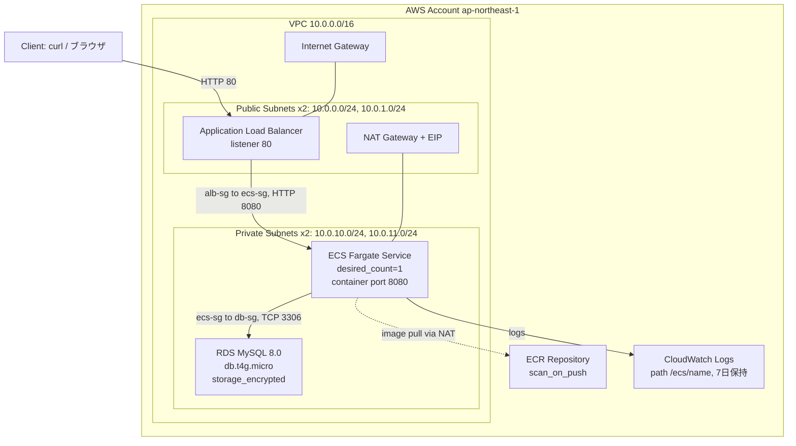
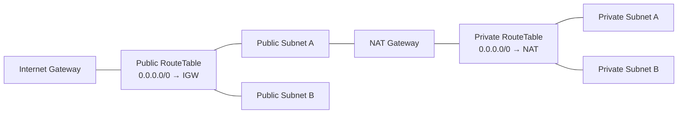
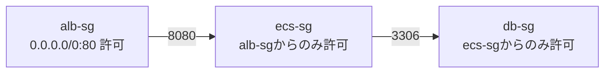
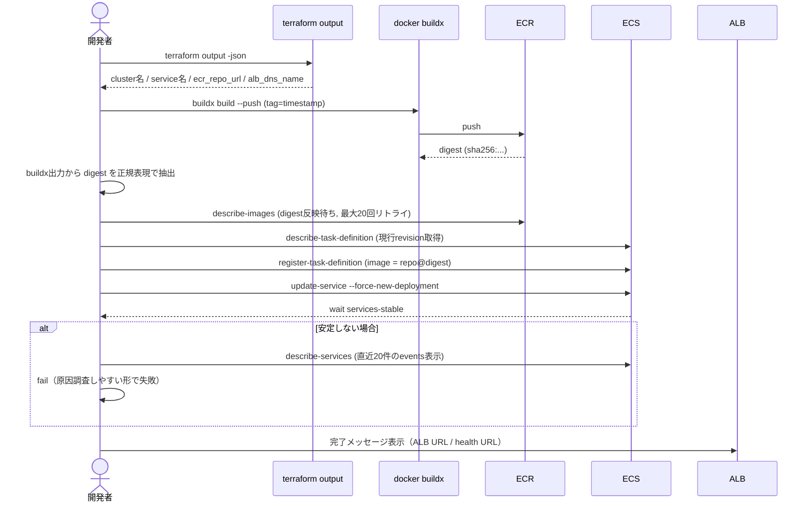
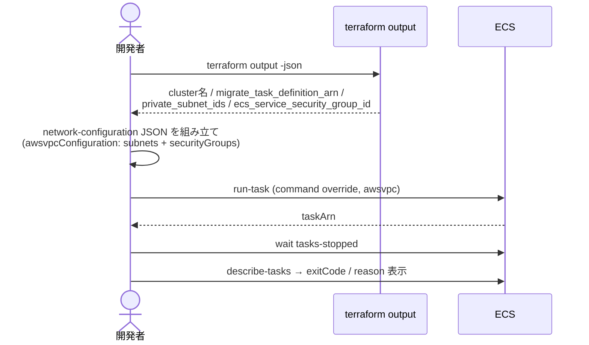

# ARCHITECTURE.md

このドキュメントは、本リポジトリ（ECS Fargate + ALB + RDS ハンズオン環境）の
**インフラ構成・アプリ構成・デプロイフロー・設計判断**を一枚で理解できるようにまとめたものです。

---

## 1. システム全体像



**責務分離の考え方（README にも明記されている設計方針）**

| レイヤ | 担当ツール | 理由 |
|---|---|---|
| AWS基盤（VPC/ALB/ECS/RDS/IAM） | Terraform | 再現性・差分管理・宣言的なインフラ管理 |
| アプリのビルド・配布・デプロイ | Ansible | build → push → deploy を柔軟に制御し、digest指定で安全に更新 |

Terraform にアプリのビルドをさせない＝ **IaCとデプロイの責務を分離** している点が本構成の核。

---

## 2. ディレクトリ構成と役割

```
ecs-fargate-alb-rds-ansible/
├── terraform/
│   ├── modules/
│   │   ├── network/   … VPC・Subnet・IGW・NAT・RouteTable
│   │   ├── alb/       … ALB・TargetGroup・Listener・SG
│   │   ├── ecs/       … ECS Cluster/Service/TaskDefinition・IAM・SG
│   │   ├── rds/       … RDS・DBSubnetGroup・SG
│   │   └── ecr/       … ECRリポジトリ・ライフサイクルポリシー
│   └── envs/dev/      … 上記モジュールを束ねる環境定義（唯一の環境）
├── ansible/
│   ├── playbooks/
│   │   ├── deploy.yml   … build → push → digest取得 → ECS更新
│   │   └── migrate.yml  … DBマイグレーション用 one-off タスク実行
│   └── group_vars/dev.yml
├── app/
│   ├── Dockerfile      … node:20-alpine ベース
│   └── src/             … Express製の最小サンプルアプリ
└── Makefile             … tf-init / tf-apply / deploy / migrate のショートカット
```

Terraformモジュールは「1リソース種別=1モジュール」で分割されており、`envs/dev/main.tf` が
各モジュールの出力を次のモジュールの入力に橋渡しする、標準的な構成になっている。

---

## 3. Terraform モジュール詳細

### 3.1 network モジュール

- VPC: `10.0.0.0/16`、DNSホスト名・DNSサポート有効
- Public Subnet ×2（AZ分散）: `10.0.0.0/24`, `10.0.1.0/24` → IGW経由でインターネットへ
- Private Subnet ×2（AZ分散）: `10.0.10.0/24`, `10.0.11.0/24` → NAT Gateway経由でインターネットへ
- NAT Gateway は **1つだけ**（コスト優先。可用性より月額コストを重視したハンズオン向けの判断）



### 3.2 alb モジュール

- SG: `80/tcp` を `0.0.0.0/0` から許可（インターネット公開の入口はここだけ）
- Target Group: プロトコル HTTP、`target_type = ip`（Fargate awsvpc モードのため必須）
  - ヘルスチェック: `path=/health`, `matcher=200-399`, `interval=15s`, `timeout=5s`, 閾値 2/3
- Listener: `80/tcp` → Target Group への forward のみ（HTTPS化は将来課題）

### 3.3 ecs モジュール

- CloudWatch Logs: `/ecs/<name>`、保持7日（コスト最小化）
- ECS SG: **ALBのSGからのみ** `container_port` を許可（ALB経由以外のアクセスを遮断）
- IAM: `task_execution` ロールは `ecs-tasks.amazonaws.com` からのみ Assume可能。
  マネージドポリシー `AmazonECSTaskExecutionRolePolicy`（ECR pull + CloudWatch Logs書き込み）のみ付与し、
  それ以上の権限は持たせていない（最小権限）
- TaskDefinition が **2つ**存在する点がこのリポジトリの特徴:
  - `app`: 通常のWebサービス用（`portMappings`・コンテナヘルスチェックあり）
  - `migrate`: DBマイグレーション用の one-off タスク（`command` を上書きして実行する前提。中身は placeholder）
- ECS Service: `desired_count=1`、Private Subnetに配置、`assign_public_ip=false`、ALBのTarget Groupに登録



### 3.4 rds モジュール

- MySQL 8.0 / `db.t4g.micro` / `gp3` 20GB / `storage_encrypted = true`
- `publicly_accessible = false`（Private Subnetからのみ到達可能）
- SG は ECSのSGからの `3306/tcp` のみ許可
- ハンズオン向けの割り切り: `backup_retention_period = 0`（自動バックアップ無効）、
  `deletion_protection = false`、`skip_final_snapshot = true`（すぐ壊して作り直せることを優先）

### 3.5 ecr モジュール

- `image_scanning_configuration.scan_on_push = true`（脆弱性スキャン自動実行）
- ライフサイクルポリシー: 直近30イメージのみ保持し古いものは自動削除（ストレージコスト抑制）

---

## 4. アプリケーション（app/）

Node.js（Express）の最小サンプル。

```js
GET /        → 200 "hello from ecs"
GET /health  → 200 "ok"   // ALB / ECS のヘルスチェックはここを見る
```

`Dockerfile` は `node:20-alpine` ベースで、`npm install --omit=dev` のみを行う軽量イメージ。
このアプリ自体に業務ロジックはなく、**インフラとデプロイフローを検証するためのダミー**という位置づけ。

---

## 5. デプロイフロー（Ansible）

### 5.1 通常デプロイ: `ansible/playbooks/deploy.yml`

このリポジトリの核心は「**タグではなく digest（sha256）で ECS にイメージを指定する**」こと。
タグは可変（同じタグを使い回すと指す実体が変わりうる）だが digest は不変なので、
「デプロイしたはずのイメージと実際に動いているイメージが違う」事故を構造的に防いでいる。



主なステップ:

1. Terraform outputs から必要な情報を取得（クラスタ名・ECR URL・ALB DNS を **ハードコードしない**）
2. `aws` / `docker` / `jq` の存在確認、AWSアカウント誤爆防止のための `sts get-caller-identity` 表示
3. `docker buildx` で ECR に push、出力ログから digest を抽出（複数パターンでフォールバック）
4. ECRに digest が反映されるまでリトライ確認（反映ラグ対策）
5. 現行 TaskDefinition を複製し、image だけ digest 版に差し替えて新 revision 登録
6. `update-service --force-new-deployment` → `wait services-stable`
7. 失敗時は ECS の events と desired/running/pending 数を自動表示してから fail する

### 5.2 マイグレーション実行: `ansible/playbooks/migrate.yml`

ECS Service とは別に、`migrate` という **one-off Task** を `run-task` で直接起動する。



Fargateの `awsvpc` ネットワークモードでは `run-task` 実行時に `--network-configuration` で
**サブネットとセキュリティグループを明示する必要がある**。この値は Terraform outputs
（`private_subnet_ids`, `ecs_service_security_group_id`）から取得し、ECS Serviceと同じ
Private Subnet / セキュリティグループでマイグレーションタスクを実行する。

---

## 6. セキュリティ設計のポイント

- インターネットからの入口は ALB の `80/tcp` のみ。ECS・RDSは Private Subnet に隔離
- セキュリティグループは **常に「上流のSGを参照」**（CIDR決め打ちにしない）
  `alb-sg → ecs-sg → db-sg` の一方向の許可チェーン
- IAMは ECS Task Execution Role に **ECR pull + Logs書き込みのマネージドポリシーのみ**を付与
  （タスク自体がAWS APIを呼ぶような追加権限は持たせていない）
- RDSは `storage_encrypted = true` で保存時暗号化、`publicly_accessible = false`
- ECRは `scan_on_push` でイメージの脆弱性スキャンを自動実行

---

## 7. 既知のトレードオフ（意図的な割り切り）

ポートフォリオ／ハンズオン用途として、コストと単純さを優先し、あえて本番グレードにしていない箇所:

| 項目 | 現状 | 本番なら |
|---|---|---|
| DBパスワード | `terraform.tfvars` 経由の変数（`sensitive=true`だがstateに平文で残る） | Secrets Manager / RDS管理パスワード（`manage_master_user_password`） |
| RDSバックアップ | `backup_retention_period = 0`（無効） | 7日以上保持 |
| RDS削除保護 | `deletion_protection = false` | `true` |
| NAT Gateway | 1つ（単一AZ） | AZごとに配置して可用性確保 |
| HTTPS | 未対応（HTTPのみ） | ACM証明書 + ALB HTTPS Listener |
| マルチAZ | `multi_az = false` | `true` |

これらは「壊しやすく・作り直しやすく・安く」学習するための判断であり、コード側にもその旨のコメントがある。

---

## 8. コスト目安

| リソース | 概算 |
|---|---|
| NAT Gateway | 起動時間課金 + データ処理料（最大のコスト要因） |
| ECS Fargate (256/512, ×1) | 起動時間課金 |
| RDS db.t4g.micro | 起動時間課金（バックアップ無効でストレージ費用のみ最小） |
| ALB | 起動時間課金 + LCU |
| ECR | 直近30イメージ保持のみ（ライフサイクルポリシーで自動削除） |

`terraform destroy`（ユーザー自身が実行）でNAT/ALB/RDSを止めればコストはほぼゼロにできる。

---

## 9. 実行コマンド早見表（Makefile）

```bash
make tf-init     # terraform init
make tf-apply    # terraform plan -out tfplan && terraform apply tfplan
make tf-destroy  # terraform destroy
make deploy      # ansible-playbook playbooks/deploy.yml（build→push→ECS更新）
make migrate     # ansible-playbook playbooks/migrate.yml（one-offタスク実行）
make output      # terraform output
```

`terraform apply` / `destroy` は本プロジェクトの方針上ユーザー自身が実行するコマンドであり、
Claude Code 側では実行しない（`terraform plan` までは読み取り専用として許可）。

---

## 10. 今後の発展余地

- HTTPS化（ACM + ALB HTTPS Listener + HTTP→HTTPSリダイレクト）
- RDSパスワードを Secrets Manager / RDS管理パスワードに移行（stateに平文を残さない）
- Blue/Green デプロイ（CodeDeploy連携）
- GitHub Actions によるCI/CD化（OIDC認証でAWSへアクセス）
- マルチAZ化（NAT Gateway・RDS）
