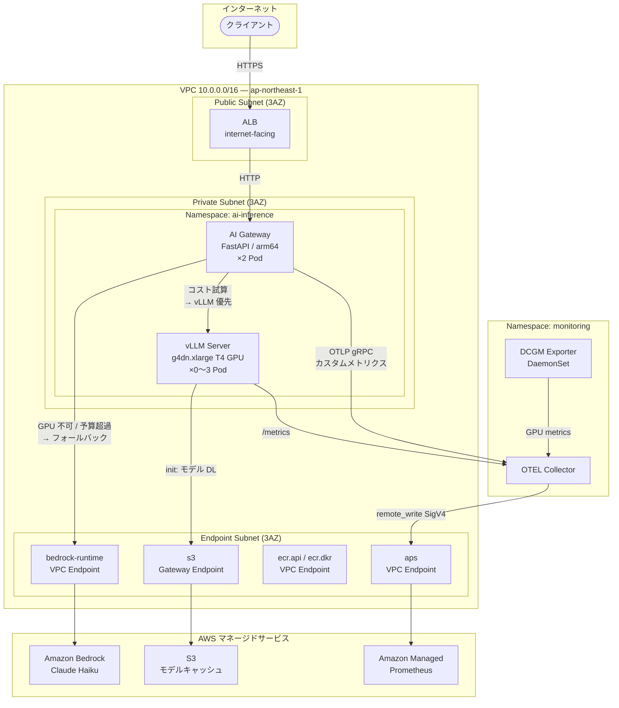
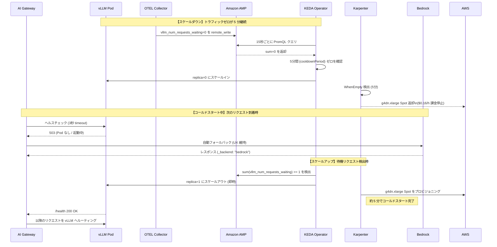
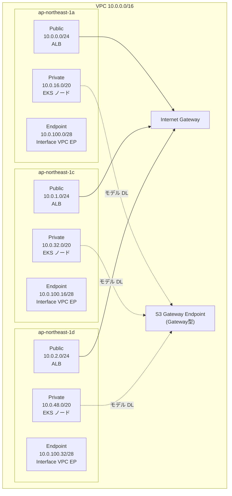
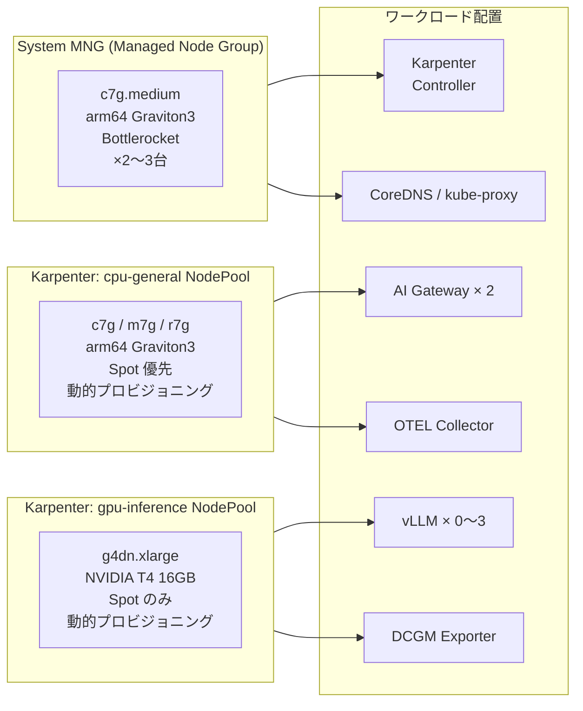
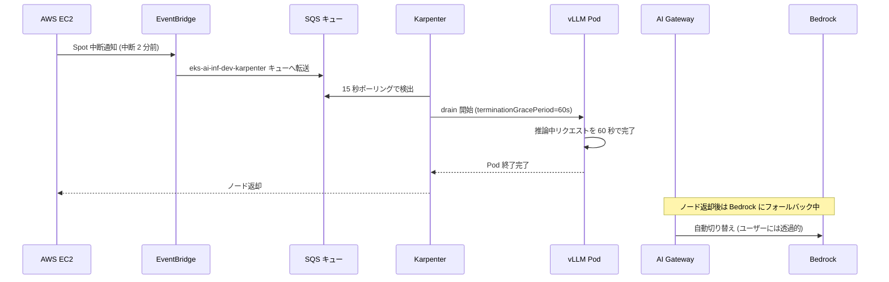
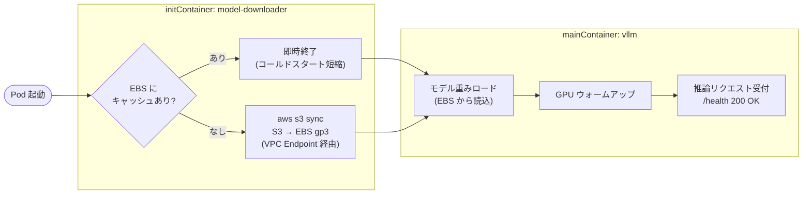
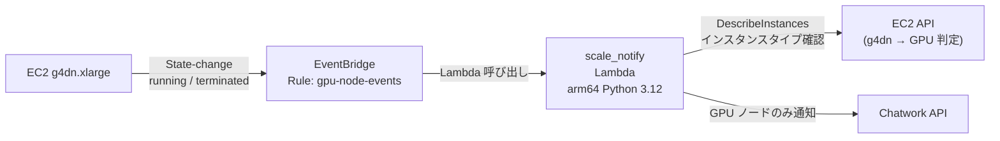
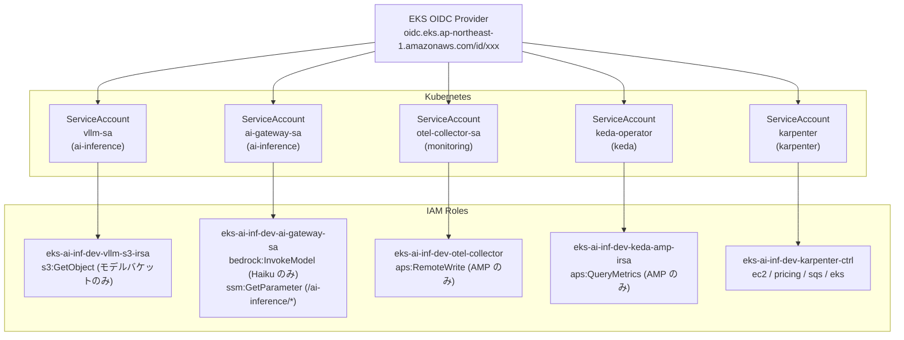
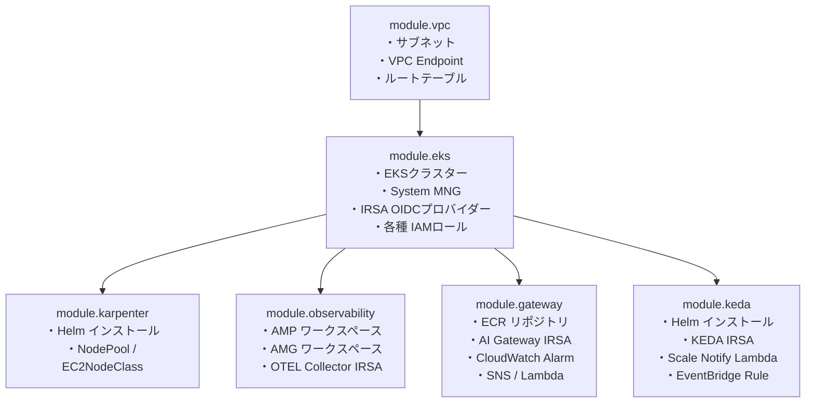

# ARCHITECTURE.md — EKS AI Inference Platform

> **本番グレードの AI 推論インフラ完全解説**
> vLLM + EKS + Karpenter でつくる「使った分だけ払う」GPU サービング基盤

---

## 目次

1. [プロジェクト概要](#1-プロジェクト概要)
2. [全体アーキテクチャ図](#2-全体アーキテクチャ図)
3. [ネットワーク構成 (VPC)](#3-ネットワーク構成-vpc)
4. [EKS クラスター構成](#4-eks-クラスター構成)
5. [Karpenter — GPU/CPU ノード自動管理](#5-karpenter--gpucpu-ノード自動管理)
6. [vLLM — GPU 推論サーバー](#6-vllm--gpu-推論サーバー)
7. [AI Gateway — コスト認識ルーター](#7-ai-gateway--コスト認識ルーター)
8. [可観測性スタック (DCGM + OTEL + AMP + AMG)](#8-可観測性スタック-dcgm--otel--amp--amg)
9. [KEDA — scale-to-zero スケーリング](#9-keda--scale-to-zero-スケーリング)
10. [Lambda 関数 — 通知・監視](#10-lambda-関数--通知監視)
11. [IAM / セキュリティ設計](#11-iam--セキュリティ設計)
12. [コスト設計](#12-コスト設計)
13. [デプロイフロー](#13-デプロイフロー)
14. [技術的深掘り — 面接で語れる設計判断](#14-技術的深掘り--面接で語れる設計判断)

---

## 1. プロジェクト概要

### 何を作ったか

| 項目 | 内容 |
|------|------|
| **目的** | GPU Spot インスタンスで OSS モデルをサービングし、アイドル時はゼロコストにする |
| **リージョン** | ap-northeast-1 (東京) |
| **インフラ管理** | Terraform (モジュール分割) |
| **コンテナ基盤** | Amazon EKS 1.30 |
| **推論エンジン** | vLLM v0.5.4 (Phi-3-mini-4k-instruct) |
| **フォールバック** | Amazon Bedrock (Claude Haiku) |
| **コスト効果** | scale-to-zero で GPU アイドル費用をゼロ化 |

### 解いた課題

```
課題: GPU インスタンスを常時稼働させると月 $115 (g4dn.xlarge on-demand) かかる
      しかし実際の推論需要は 1 日数時間に限られていた

解法:
  ① KEDA でキュー長ゼロを 5 分検出 → vLLM replica=0
  ② Karpenter の WhenEmpty 統合 → GPU Spot ノード自動返却
  ③ コールドスタート中は AI Gateway が Bedrock に自動フォールバック
     → ユーザー体験を損なわずにコストを最小化
```

---

## 2. 全体アーキテクチャ図

### リクエストフロー



### scale-to-zero の仕組み



---

## 3. ネットワーク構成 (VPC)

### サブネット設計



**設計ポイント: NAT Gateway ゼロ**

| 従来構成 | 本構成 |
|---------|--------|
| NAT Gateway × 3AZ = **$135+/月** | NAT Gateway = **$0** |
| インターネット経由でコンテナ pull | VPC Endpoint 経由でプライベート通信 |

### VPC Endpoint 一覧

| 種別 | サービス名 | 用途 | private_dns_enabled |
|------|-----------|------|---------------------|
| Gateway | `s3` | vLLM モデルキャッシュ DL / tfstate | — |
| Interface | `ecr.api` | コンテナイメージ認証 | true |
| Interface | `ecr.dkr` | イメージ Pull | true |
| Interface | `sts` | IRSA WebIdentity トークン交換 | true |
| Interface | `ec2` | Karpenter ノードプロビジョニング | true |
| Interface | `logs` | CloudWatch Logs (EKS・Lambda) | true |
| Interface | `ssm` | SSM Parameter Store (予算値・Chatwork token) | true |
| Interface | `ssmmessages` | SSM Session Manager (踏み台不要) | true |
| Interface | `elasticloadbalancing` | ALB 管理 | true |
| Interface | `aps` | OTEL Collector → AMP remote_write | true |
| Interface | `bedrock-runtime` | AI Gateway → Bedrock API | true |
| Interface | `eks` | EKS API (プライベートエンドポイント) | true |

> **⚠️ ハマりポイント**: `private_dns_enabled = true` の設定漏れで名前解決が失敗する。
> VPC Flow Logs で `REJECT` を確認してデバッグした。

---

## 4. EKS クラスター構成

### クラスター基本情報

| 項目 | 値 | 理由 |
|------|----|----|
| **クラスター名** | `eks-ai-inf-dev-cluster` | project + env で命名 |
| **K8s バージョン** | 1.30 | LTS サポート期間が長い |
| **API エンドポイント** | プライベートのみ | VPC 外からのアクセス完全遮断 |
| **ログ** | 全 5 種類を CloudWatch | 監査・トラブルシュート対応 |

### ノード構成



### EKS Add-ons

| Add-on | 用途 | IRSA |
|--------|------|------|
| `vpc-cni` | Pod ネットワーキング | — |
| `coredns` | DNS 解決 | — |
| `kube-proxy` | サービス通信 | — |
| `aws-ebs-csi-driver` | PVC (vLLM モデルキャッシュ用) | `eks-ai-inf-dev-ebs-csi-ctrl` |

---

## 5. Karpenter — GPU/CPU ノード自動管理

### 2 NodePool の設計比較

| | `cpu-general` | `gpu-inference` |
|--|--------------|-----------------|
| **アーキテクチャ** | arm64 (Graviton3) | amd64 (NVIDIA 必須) |
| **インスタンス** | c7g / m7g / r7g | g4dn.xlarge / g5.xlarge |
| **容量タイプ** | Spot → on-demand | Spot のみ |
| **GPU** | なし | NVIDIA T4 16GB |
| **Taint** | なし | `nvidia.com/gpu=true:NoSchedule` |
| **Consolidation** | WhenUnderutilized (30s) | WhenEmpty (5min) |
| **OS** | Bottlerocket | AL2 (NVIDIA ドライバ同梱) |
| **EBS** | 50Gi gp3 | 100Gi gp3 (モデルキャッシュ用) |

**GPU は `WhenEmpty` の理由**

```
WhenUnderutilized: 推論中 Pod の CPU が低いとノード削除される → vLLM 強制終了
WhenEmpty:         Pod が 0 台になるまでノードを削除しない → 安全
```

### Spot 中断 Graceful Drain フロー



### Karpenter Helm 設定

```yaml
バージョン:   0.37.0
Chart:        oci://public.ecr.aws/karpenter/karpenter
Namespace:    karpenter
IRSA:         eks-ai-inf-dev-karpenter-ctrl
```

---

## 6. vLLM — GPU 推論サーバー

### モデル・GPU 設定

| パラメータ | 値 | 意味 |
|-----------|----|----|
| **モデル** | `microsoft/Phi-3-mini-4k-instruct` | 軽量・推論最適化 OSS モデル |
| **GPU** | NVIDIA T4 16GB (g4dn.xlarge) | VRAM 16GB / Spot $0.16/h |
| **TENSOR_PARALLEL_SIZE** | 1 | T4 単枚構成のため並列度 1 |
| **GPU_MEMORY_UTILIZATION** | 0.90 | KVキャッシュプールに VRAM の 90% 割当 |
| **MAX_NUM_SEQS** | 32 | 同時処理シーケンス数 (バッチサイズ上限) |
| **MAX_MODEL_LEN** | 4096 | コンテキストウィンドウ (tokens) |

### PagedAttention の仕組み

```
【従来の KVキャッシュ問題】
  シーケンスごとに連続した VRAM 領域を予約
  → フラグメンテーション発生
  → GPU 使用率: 40〜60% 止まり

【PagedAttention (vLLM)】
  KVキャッシュを「ページ」単位で仮想メモリ的に管理
  → 不連続な VRAM を有効活用
  → GPU 使用率: 80〜90% を実現
  → バッチサイズ向上 → tokens/sec 向上

設定値の意味:
  GPU_MEMORY_UTILIZATION=0.90
  → T4 16GB × 0.90 = 14.4GB を KVキャッシュプール用に確保
  → Phi-3-mini の重み (~4GB) + 14.4GB のキャッシュ
  → MAX_NUM_SEQS=32 シーケンスを並列処理可能
```

### Pod 起動フロー (initContainer)



| ステージ | 所要時間 | 備考 |
|---------|---------|------|
| Karpenter ノードプロビジョニング | ~3 分 | g4dn.xlarge Spot 起動 |
| S3 → EBS モデル DL (初回) | ~2 分 | Phi-3-mini ~2.2GB |
| EBS キャッシュから読込 (2回目以降) | ~30 秒 | Retain ポリシーで PVC 保持 |
| GPU ウォームアップ | ~30 秒 | CUDA 初期化 |
| **合計 (初回)** | **~6 分** | Bedrock フォールバックでカバー |
| **合計 (2回目以降)** | **~4 分** | PVC が残っていれば DL スキップ |

### リソース要求

| リソース | request | limit | 理由 |
|---------|---------|-------|------|
| `nvidia.com/gpu` | 1 | 1 | T4 1 枚占有 |
| CPU | 2 | 4 | トークナイズ・デコード処理 |
| メモリ | 8Gi | 14Gi | モデル重み + バッファ |
| EBS PVC | — | 30Gi | Phi-3-mini (~2.2GB) + 作業領域 |
| `/dev/shm` | — | 4Gi | PagedAttention KVブロック共有 |

---

## 7. AI Gateway — コスト認識ルーター

### エンドポイント仕様

| Endpoint | Method | 説明 |
|---------|--------|------|
| `/health` | GET | ヘルスチェック (ALB / readinessProbe) |
| `/v1/chat/completions` | POST | OpenAI 互換 Chat Completions API |

**リクエスト/レスポンス**

```jsonc
// リクエスト (OpenAI 互換)
{
  "model": "auto",
  "messages": [{"role": "user", "content": "EKS とは?"}],
  "max_tokens": 512,
  "temperature": 0.7
}

// レスポンス (_backend フィールドで使用バックエンドを返却)
{
  "id": "chatcmpl-xxx",
  "model": "vllm",
  "choices": [{"message": {"content": "..."}, "finish_reason": "stop"}],
  "usage": {"prompt_tokens": 12, "completion_tokens": 256},
  "_backend": "vllm"  // または "bedrock"
}
```

### ルーティングロジック

```mermaid
flowchart TD
    REQ([リクエスト受信]) --> BUDGET{時間予算\n超過?}

    BUDGET -->|YES\n_hourly_cost >= SSM 値| BEDROCK_FORCED["Bedrock\n強制フォールバック\nreason: budget_exceeded"]

    BUDGET -->|NO| HEALTH{vLLM\n/health\n3秒以内?}

    HEALTH -->|NG\n503 / timeout| BEDROCK_UNAVAIL["Bedrock\nフォールバック\nreason: vllm_unavailable"]

    HEALTH -->|OK 200| COST{コスト比較\nvllm_cost vs\nbedrock_cost}

    COST -->|vLLM が安い\n(ほぼ常時)| VLLM["vLLM\nreason: cost_optimal"]
    COST -->|Bedrock が安い\n(超短いリクエスト)| BEDROCK_COST["Bedrock\nreason: cost_optimal"]
```

### コスト試算ロジック

```python
# vLLM コスト (時間課金)
GPU_SPOT_COST_PER_HOUR = 0.16          # g4dn.xlarge Spot 東京
VLLM_THROUGHPUT_TPS    = 50.0          # 実測値 (tokens/sec)

def estimate_vllm_cost(prompt_tokens, max_tokens):
    generated = max_tokens * 0.7        # 実測補正係数
    duration  = generated / 50.0       # 秒
    return (duration / 3600) * 0.16    # ≈ $0.00032 (100in + 512out の場合)

# Bedrock コスト (トークン課金)
BEDROCK_INPUT_PER_1M  = 0.80           # Claude Haiku 3.5 入力
BEDROCK_OUTPUT_PER_1M = 4.00           # Claude Haiku 3.5 出力

def estimate_bedrock_cost(prompt_tokens, max_tokens):
    return (prompt_tokens / 1e6) * 0.80 + (max_tokens / 1e6) * 4.00
    # ≈ $0.0024 (100in + 512out の場合)

# vLLM は Bedrock の約 7.5 倍安価
# → ほぼ全リクエストが vLLM にルーティングされる
```

### 予算管理

```
SSM Parameter: /ai-inference/hourly-budget-usd = "1.0"

動作:
  ① AI Gateway は 1 時間ウィンドウでコスト累積を追跡
  ② 累積コスト >= SSM 値 → Bedrock に強制切り替え
  ③ 時間リセット後 → vLLM に戻る
  ④ コスト超過時は CloudWatch Alarm → Chatwork 通知
```

### OTEL カスタムメトリクス

| メトリクス名 | 型 | ラベル | 用途 |
|------------|-----|--------|------|
| `inference_latency_seconds` | Histogram | backend, status | P95 レイテンシ監視 |
| `inference_tokens_per_second` | Histogram | backend | スループット計測 |
| `inference_cost_usd` | Histogram | backend | コスト可視化 |
| `inference_routing_total` | Counter | backend, reason | ルーティング比率 |

### デプロイ情報

| 項目 | 値 |
|------|-----|
| Namespace | `ai-inference` |
| replicas | 2 (固定・高可用性) |
| アーキテクチャ | arm64 (Graviton / CPU バウンド) |
| イメージ | ECR `eks-ai-inf-dev-ai-gateway:latest` |
| IRSA | `eks-ai-inf-dev-ai-gateway-sa` |

---

## 8. 可観測性スタック (DCGM + OTEL + AMP + AMG)

### メトリクス収集フロー

```mermaid
flowchart LR
    subgraph GPU["GPU ノード"]
        T4["NVIDIA T4"]
        DCGM["DCGM Exporter\nDaemonSet\n:9400/metrics"]
        T4 --> DCGM
    end

    subgraph vLLMPod["vLLM Pod"]
        VLLM_M["/metrics\nPrometheus 形式"]
    end

    subgraph GWPod["AI Gateway Pod"]
        GW_M["OTLP Push\ngRPC :4317\nカスタムメトリクス"]
    end

    subgraph Monitoring["Namespace: monitoring"]
        OTEL["OTEL Collector\narm64 / 1 replica\n:4317 gRPC\n:4318 HTTP"]
    end

    DCGM -->|15s scrape| OTEL
    VLLM_M -->|15s scrape| OTEL
    GW_M -->|Push 15s| OTEL

    OTEL -->|SigV4 署名\nremote_write| AMP["Amazon Managed\nPrometheus"]
    AMP -->|PromQL| AMG["Amazon Managed\nGrafana"]
    AMP -->|PromQL\n(ScaledObject trigger)| KEDA["KEDA Operator"]
```

### OTEL Collector パイプライン

```yaml
receivers:
  prometheus:             # Pull 型 — vLLM / DCGM
    scrape_interval: 15s
    target: Podアノテーション (prometheus.io/scrape=true)
  otlp:                   # Push 型 — AI Gateway カスタムメトリクス
    grpc: 0.0.0.0:4317
    http: 0.0.0.0:4318

processors:
  memory_limiter:         # OOM 防止 (512Mi / spike 128Mi)
  resource:               # cluster_name + environment タグ付与
  batch:                  # 10s / 1000件 バッチ → AMP 接続コスト削減

exporters:
  prometheusremotewrite:  # AMP remote_write (SigV4 認証)
```

### DCGM Exporter (GPU メトリクス)

```yaml
Image:     nvcr.io/nvidia/k8s/dcgm-exporter:3.3.5-3.4.0-ubuntu22.04
Port:      9400
配置:      GPU ノードのみ (DaemonSet + nodeSelector)
Toleration: nvidia.com/gpu (GPU Taint を許容)
```

| GPU メトリクス | 説明 |
|--------------|------|
| `DCGM_FI_DEV_GPU_UTIL` | GPU 使用率 (%) |
| `DCGM_FI_DEV_GPU_TEMP` | GPU 温度 (°C) |
| `DCGM_FI_DEV_FB_USED` | GPU メモリ使用量 (MB) |
| `DCGM_FI_DEV_POWER_USAGE` | GPU 電力消費 (W) |

### Amazon Managed Prometheus (AMP)

| 項目 | 値 |
|------|-----|
| Alias | `eks-ai-inf-dev-ai-inference` |
| 課金 | サーバーレス・オンデマンド |
| データ保持 | 150 日 (デフォルト) |
| 認証 | SigV4 (IRSA `eks-ai-inf-dev-otel-collector`) |
| スケーリング | 自動 (管理不要) |

### Amazon Managed Grafana (AMG) ダッシュボード

| パネル | クエリ例 | 用途 |
|-------|---------|------|
| GPU Utilization | `DCGM_FI_DEV_GPU_UTIL` | T4 使用率リアルタイム |
| Inference Throughput | `rate(inference_tokens_per_second_sum[5m])` | tokens/sec |
| Cost per 1M tokens | `sum(inference_cost_usd) / sum(tokens)` | コスト可視化 |
| Request Routing | `inference_routing_total by (backend)` | vLLM vs Bedrock 比率 |
| P99 Latency | `histogram_quantile(0.99, inference_latency_seconds)` | SLA 監視 |

---

## 9. KEDA — scale-to-zero スケーリング

### ScaledObject 設定

```yaml
# k8s/keda/scaled-object.yaml
apiVersion: keda.sh/v1alpha1
kind: ScaledObject
metadata:
  name: vllm-scaler
  namespace: ai-inference
spec:
  scaleTargetRef:
    name: vllm-server
  minReplicaCount: 0       # scale-to-zero 有効
  maxReplicaCount: 3       # GPU ノード最大 3 台
  pollingInterval: 15      # AMP ポーリング間隔 (秒)
  cooldownPeriod: 300      # スケールイン前のゼロ確認時間 (5分)
  triggers:
    - type: prometheus
      metadata:
        serverAddress: "https://aps-workspaces.ap-northeast-1.amazonaws.com/workspaces/{ID}"
        query: "sum(vllm_num_requests_waiting{namespace='ai-inference'})"
        threshold: "1"
        activationThreshold: "0"   # 待機 0 = アイドル判定
        authModes: "pod"           # IRSA / WebIdentity 使用
```

### スケールポリシーの詳細

```mermaid
gantt
    title scale-to-zero タイムライン
    dateFormat mm:ss
    section スケールダウン
    ゼロ負荷の確認 (cooldownPeriod=5min)    :0:00, 5:00
    replica=0 に変更                        :5:00, 5:05
    Karpenter WhenEmpty 検出 (5min)         :5:05, 10:05
    GPU ノード返却完了                       :10:05, 10:15

    section スケールアップ
    PromQL クエリ: waiting >= 1 検出        :0:00, 0:15
    replica=1 に即時変更                    :0:15, 0:20
    Karpenter ノードプロビジョニング          :0:20, 3:20
    initContainer (モデル DL / キャッシュ)   :3:20, 4:50
    vLLM ウォームアップ                      :4:50, 5:20
    推論リクエスト受付可能                    :5:20, 5:30
```

**スケールアップ/ダウン ポリシー**

```yaml
scaleUp:
  stabilizationWindowSeconds: 0    # 即時判定 (待機リクエストに素早く反応)
  policies:
    - type: Pods
      value: 1
      periodSeconds: 30            # 1 Pod / 30 秒で増加

scaleDown:
  stabilizationWindowSeconds: 300  # 5 分間ゼロ確認してからスケールイン
  policies:
    - type: Pods
      value: 1
      periodSeconds: 60            # 1 Pod / 60 秒で減少
```

### KEDA vs HPA の比較

| | HPA | KEDA |
|--|-----|------|
| トリガー | CPU / メモリ | 任意のメトリクス (AMP PromQL) |
| scale-to-zero | 不可 (min=1) | 可能 |
| 推論ワークロードとの適合性 | 低 (CPU が低くてもキューが溢れる) | 高 (待機リクエスト数を直接監視) |
| AMP 連携 | 不可 | SigV4 認証で直接クエリ |

---

## 10. Lambda 関数 — 通知・監視

### コスト通知フロー

```mermaid
flowchart LR
    OTEL["OTEL Collector"] -->|EMF\nカスタムメトリクス| CW["CloudWatch\nMetrics"]
    CW -->|threshold 超過\n(>$1.0/hour)| ALARM["CloudWatch Alarm\neks-ai-inf-dev-\ninference-hourly-cost-exceeded"]
    ALARM -->|ALARM / OK 状態変化| SNS["SNS Topic\neks-ai-inf-dev-cost-alert"]
    SNS -->|Lambda 呼び出し| LAMBDA["cost_alert\nLambda\narm64 Python 3.12"]
    LAMBDA -->|SSM SecureString\n/chatwork/token 取得| SSM_CW["SSM Parameter\nStore"]
    LAMBDA -->|REST API\nHTTPS POST| CW_API["Chatwork API"]
```

### scale-to-zero 通知フロー



### Lambda 共通設定

| 項目 | cost_alert | scale_notify |
|------|-----------|--------------|
| **Runtime** | Python 3.12 | Python 3.12 |
| **Architecture** | arm64 | arm64 |
| **Timeout** | 30 秒 | 30 秒 |
| **Memory** | 128 MB | 128 MB |
| **Reserved Concurrency** | 5 | 3 |
| **Powertools Layer** | ✅ arm64:7 | ✅ arm64:7 |
| **DLQ** | SQS (14 日) | SQS (14 日) |
| **X-Ray** | 有効 | 有効 |

### Chatwork 通知メッセージ例

```
【コスト超過アラート】
🚨 AI推論コストアラート
アラーム: eks-ai-inf-dev-inference-hourly-cost-exceeded
状態: ALARM → 時間あたりの推論コストが上限 ($1.0/h) を超えました
AI Gateway は自動的に Bedrock へのルーティングに切り替えています

【GPU ノード起動】
GPU Spot ノード起動 (g4dn.xlarge / i-xxxxx)
vLLM の初期化中 ... 約 5 分でリクエスト受付可能になります
コールドスタート中は Bedrock が自動的にカバーしています

【GPU ノード返却】
GPU Spot ノード返却 (g4dn.xlarge / i-xxxxx)
Karpenter がアイドルノードを返却しました (コスト最適化)
次のリクエスト到着時に自動で再プロビジョニングされます
```

---

## 11. IAM / セキュリティ設計

### IRSA (IAM Roles for Service Accounts) 構成



### IAM ロール一覧 (全 12 個)

| ロール名 (64文字以内) | 対象 | 主要権限 |
|---------------------|------|---------|
| `eks-ai-inf-dev-cluster-role` | EKS 制御プレーン | AmazonEKSClusterPolicy |
| `eks-ai-inf-dev-node-role` | System MNG ノード | Worker + CNI + ECR_ReadOnly + SSM |
| `eks-ai-inf-dev-karpenter-ctrl` | Karpenter コントローラー | EC2 制御 / pricing / SQS / iam:PassRole |
| `eks-ai-inf-dev-karpenter-node` | Karpenter 生成ノード | Worker + CNI + ECR_ReadOnly + SSM |
| `eks-ai-inf-dev-alb-ctrl` | AWS LB Controller | ELB / EC2 / ACM / WAF 制御 |
| `eks-ai-inf-dev-ebs-csi-ctrl` | EBS CSI | AmazonEBSCSIDriverPolicy |
| `eks-ai-inf-dev-vllm-s3-irsa` | vLLM Pod | s3:GetObject (モデルバケットのみ) |
| `eks-ai-inf-dev-otel-collector` | OTEL Collector | aps:RemoteWrite (AMP のみ) |
| `eks-ai-inf-dev-ai-gateway-sa` | AI Gateway Pod | bedrock:InvokeModel + ssm:GetParameter |
| `eks-ai-inf-dev-keda-amp-irsa` | KEDA Operator | aps:QueryMetrics (AMP のみ) |
| `eks-ai-inf-dev-cost-alert-lambda` | Cost Alert Lambda | ssm:GetParameter + kms:Decrypt + SQS |
| `eks-ai-inf-dev-scale-notify-lambda` | Scale Notify Lambda | ec2:DescribeInstances + ssm + SQS |

### セキュリティ制約 (全フェーズ共通)

| 制約 | 実装 |
|------|------|
| NAT Gateway 禁止 | VPC Endpoint のみ使用 (11 種類) |
| IAM ワイルドカード禁止 | 全ロールでリソース ARN を明示 ※1 |
| シークレットハードコード禁止 | SSM Parameter Store のみ |
| IAM ロール名 64 文字以内 | 最長ロール名 34 文字で遵守 |
| `count` 禁止 | `for_each` のみ使用 |
| OIDC 認証 | IRSA で静的キー不要 |

> ※1 **ワイルドカード例外**: Karpenter の `ec2:Describe*` / `pricing:GetProducts`、ALB Controller の `elasticloadbalancing:Describe*` は AWS API 仕様上リソース ARN 制限が不可能なため `resources = ["*"]` を使用。日本語コメントで根拠を明記済み。

### S3 モデルキャッシュバケット セキュリティ

```
バケット名: eks-ai-inf-dev-model-cache-{ACCOUNT_ID}

セキュリティ設定:
  ✅ パブリックアクセス完全ブロック
  ✅ バケットポリシー: VPC Endpoint 経由以外のアクセスを Deny
  ✅ SSE-KMS 暗号化 (鍵ローテーション有効)
  ✅ バージョニング有効 (誤削除保護)
  ✅ VPC Endpoint ID (aws:SourceVpce) で VPC 外アクセス遮断
```

### SSM Parameter Store

| パラメータ | 種別 | 値 | 用途 |
|-----------|------|----|----|
| `/ai-inference/hourly-budget-usd` | String | `"1.0"` | AI Gateway 予算上限 |
| `/chatwork/token` | SecureString | `{TOKEN}` | Chatwork API 認証 |
| `/chatwork/room-id` | String | `{ROOM_ID}` | 通知先ルーム |

---

## 12. コスト設計

### 月次コスト概算

| コンポーネント | 常時稼働 | scale-to-zero (8h/day) | 削減率 |
|--------------|---------|----------------------|--------|
| g4dn.xlarge Spot | ~$35/月 | ~$9/月 | **74%** |
| EKS クラスター (制御プレーン) | $73/月 | $73/月 | — |
| c7g.medium × 2 (System MNG) | ~$14/月 | ~$14/月 | — |
| VPC Endpoint (Interface × 11) | ~$88/月 | ~$88/月 | — |
| AMP + AMG | ~$5/月 | ~$5/月 | — |
| Lambda (2 関数) | < $1/月 | < $1/月 | — |
| NAT Gateway (従来比) | +$135/月 | **$0** | **100%** |
| **合計** | **~$350/月** | **~$190/月** | **~46%** |

> **最大の節約**: NAT Gateway ゼロ化で $135+/月削減、GPU scale-to-zero で $26+/月削減

### vLLM vs Bedrock コスト比較 (1 リクエストあたり)

| シナリオ | vLLM コスト | Bedrock コスト | 差額 |
|---------|------------|--------------|------|
| 短いリクエスト (100in + 100out) | ~$0.000089 | ~$0.00048 | **Bedrock の 5.4 倍安** |
| 標準リクエスト (100in + 512out) | ~$0.00032 | ~$0.0024 | **Bedrock の 7.5 倍安** |
| 長いリクエスト (500in + 2000out) | ~$0.0011 | ~$0.0084 | **Bedrock の 7.6 倍安** |

> **結論**: GPU が稼働している間はほぼ全ケースで vLLM が安価。
> GPU が起動していない時間帯のコストを scale-to-zero でゼロ化することがカギ。

---

## 13. デプロイフロー

### Terraform モジュール依存関係



### k8s マニフェスト デプロイ順序

```bash
# スクリプト: scripts/deploy-k8s.sh
# Terraform output からプレースホルダーを自動置換してから apply する

1. Namespace 作成
2. RBAC (ClusterRole / RoleBinding)
3. ServiceAccount (IRSA アノテーション付き)
4. ConfigMap / Secret
   └─ otel-cluster-config (クラスター名)
   └─ otel-amp-config (AMP remote_write URL)
5. StorageClass (gp3-encrypted)
6. NVIDIA Device Plugin DaemonSet
7. DCGM Exporter DaemonSet
8. OTEL Collector Deployment
9. vLLM PVC / Deployment / Service
10. AI Gateway Deployment / Service / Ingress
11. KEDA ScaledObject / ClusterTriggerAuthentication
```

### クリーンアップ (課金停止)

```bash
# 1. vLLM をスケールダウン (GPU Spot 費用を即座に停止)
kubectl scale deployment vllm-server -n ai-inference --replicas=0

# 2. GPU ノードが返却されたことを確認 (5〜10 分)
kubectl get nodes -l karpenter.k8s.aws/instance-gpu-manufacturer=nvidia

# 3. EKS インフラを破棄 (ポートフォリオ確認後)
terraform -chdir=terraform/environments/dev destroy -auto-approve
```

---

## 14. 技術的深掘り — 面接で語れる設計判断

### ADR-001: なぜ vLLM on EKS を選んだか

```
Option A: Amazon Bedrock のみ
  ✅ インフラ管理不要
  ❌ OSS モデル不可 / トークン課金でスループット制限あり

Option B: Amazon SageMaker Endpoints
  ✅ MLOps 統合 (モデルレジストリ・A/Bテスト)
  ❌ 常時稼働が前提 → 月 $115+ / scale-to-zero が困難

Option C: vLLM on EKS (採用)
  ✅ OpenAI 互換 API → クライアント変更ゼロ
  ✅ PagedAttention で GPU 効率最大化
  ✅ KEDA + Karpenter で scale-to-zero
  ✅ OSS モデルを自由に選択

採用理由:
  vLLM の GPU 効率化 + Karpenter の Spot 統合により
  Bedrock 比で約 7.5 倍のコスト削減を実現しつつ、
  Bedrock フォールバックで可用性を確保。
```

### ADR-002: なぜ Karpenter を選んだか

```
MNG (Managed Node Group) との比較:
  MNG: 事前にサイズを決定・scale-to-zero が困難
  Karpenter: オンデマンドプロビジョニング・複数インスタンスタイプ対応

GPU に Karpenter が特に有効な理由:
  g4dn.xlarge (T4) が Spot 枯渇時に g5.xlarge (A10G) に自動切り替え可能
  → 単一インスタンスタイプでは Spot 枯渇でスケールアウト失敗になる

WhenEmpty を選んだ理由:
  推論中に GPU ノードが削除されると vLLM が強制終了する
  WhenEmpty で「Pod が 0 台になるまで絶対に削除しない」を保証
```

### ADR-003: なぜ KEDA を選んだか

```
HPA の問題:
  推論ワークロードでは CPU 使用率が低くても
  キューに 1000 リクエスト積まれることがある
  → CPU/Memory ベースのスケーリングでは本質的な負荷を捉えられない

KEDA + AMP Prometheus の利点:
  vllm_num_requests_waiting (vLLM の内部キュー深さ) を直接トリガーにできる
  → 推論待ち行列の実態に基づいたスケーリング
  scale-to-zero がネイティブサポート (minReplicaCount: 0)
  AMP への SigV4 認証も IRSA で実現 (静的キー不要)
```

### コールドスタート問題と許容判断

```
問題: vLLM の scale-to-zero → 次リクエスト時に約 5 分のコールドスタート

許容した理由:
  ① AI Gateway が Bedrock に自動フォールバック
     → ユーザーはバックエンド切り替えを意識しない (OpenAI 互換レスポンス維持)
  ② _backend フィールドで利用バックエンドをレスポンスに含める
     → 計測・ロギング・可視化が可能
  ③ EBS PVC の Retain ポリシーで 2 回目以降は DL スキップ
     → 4 分程度に短縮

許容できないシナリオ:
  リアルタイム対話が必要で 5 分待てない場合は
  minReplicaCount: 1 に変更してウォーム待機させる
  (GPU 稼働費 $0.16/h は常時発生するトレードオフを許容)
```

---

## ディレクトリ構造

```
eks-ai-inference-platform/
├── ARCHITECTURE.md          # 本ドキュメント
├── CLAUDE.md                # プロジェクト制約・設計方針
├── phase1.md ~ phase6.md    # フェーズ別実装手順
│
├── terraform/
│   ├── environments/dev/
│   │   ├── main.tf          # モジュール呼び出し
│   │   ├── variables.tf
│   │   ├── terraform.tfvars
│   │   └── outputs.tf       # Terraform output 定義
│   └── modules/
│       ├── vpc/             # サブネット・VPC Endpoint
│       ├── eks/             # EKS クラスター・MNG・各種 IRSA
│       ├── karpenter/       # Helm + NodePool + EC2NodeClass
│       ├── observability/   # AMP + AMG + OTEL IRSA
│       ├── gateway/         # ECR + ALB + CloudWatch Alarm + Lambda
│       └── keda/            # Helm + KEDA IRSA + Scale Notify Lambda
│
├── k8s/
│   ├── karpenter/           # NodePool / EC2NodeClass YAML
│   ├── nvidia/              # NVIDIA Device Plugin DaemonSet
│   ├── vllm/                # PVC / Deployment / Service / StorageClass
│   ├── dcgm/                # DCGM Exporter DaemonSet
│   ├── otel/                # Collector Deployment / ConfigMap / RBAC
│   ├── keda/                # ScaledObject / ClusterTriggerAuthentication
│   └── gateway/             # Deployment / Service / Ingress / ServiceAccount
│
├── src/
│   ├── gateway/             # FastAPI AI Gateway (コスト認識ルーター)
│   ├── cost_lambda/         # CloudWatch Alarm → Chatwork 通知
│   ├── scale_notify_lambda/ # GPU ノード起動/返却 → Chatwork 通知
│   └── loadtest/            # Locust 負荷試験
│
├── docs/
│   ├── adr/                 # Architecture Decision Record (3本)
│   ├── interview-star-qa.md # STAR 形式面接 Q&A
│   └── zenn-outline.md      # Zenn 記事アウトライン
│
└── scripts/
    ├── deploy-k8s.sh        # k8s マニフェスト デプロイ (プレースホルダー置換)
    └── upload_model_to_s3.sh # Phi-3-mini モデルを S3 にアップロード
```

---

*最終更新: 2026-07-19 | フェーズ 1〜6 完了*
