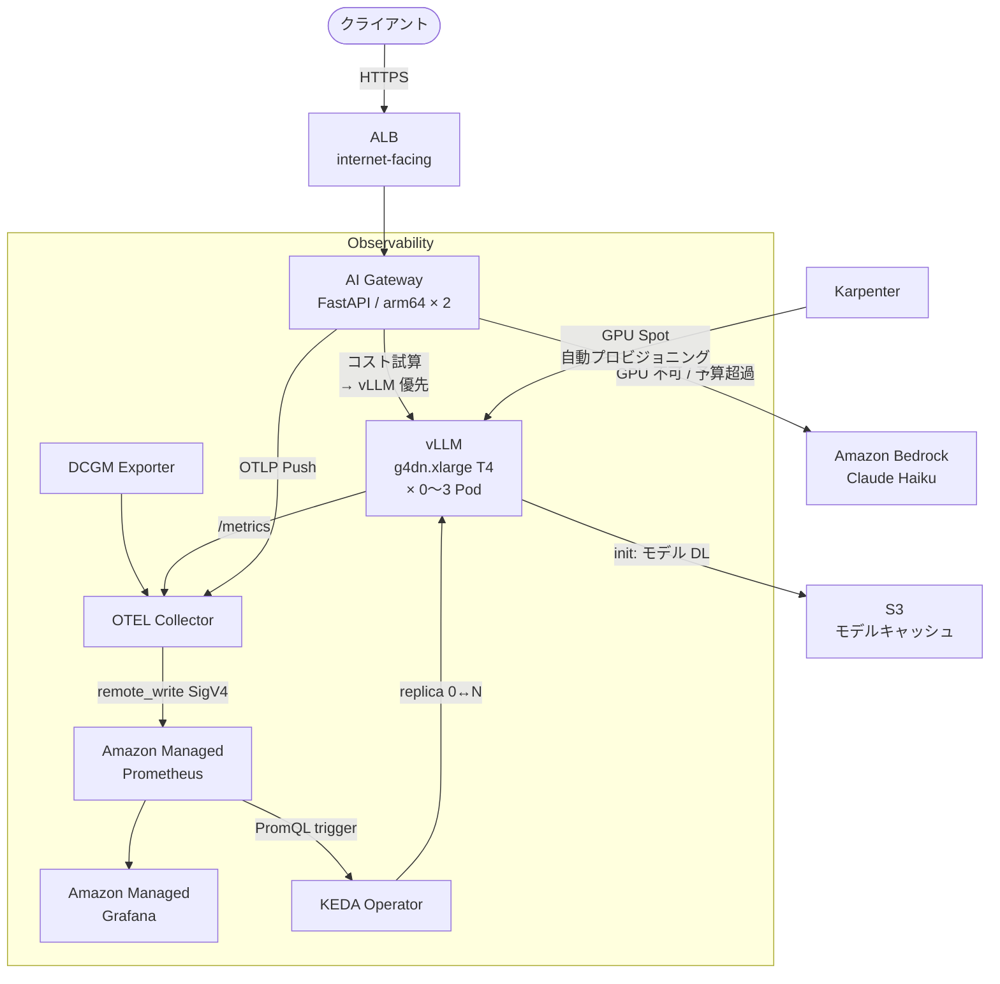

# EKS AI Inference Platform

**GPU Spot インスタンスを scale-to-zero する本番グレードの AI 推論基盤**

vLLM + EKS + Karpenter で OSS モデルをサービングし、アイドル時はゼロコストになるインフラをゼロから構築するハンズオンです。

```
クライアント → ALB → AI Gateway → vLLM (GPU Spot) ← KEDA/Karpenter が自動管理
                               ↘ Bedrock (自動フォールバック)
```

---

## このハンズオンで得られること

### 技術スキル

| カテゴリ | 具体的に得られること |
|---------|-------------------|
| **EKS 実践** | プライベートクラスター構築・IRSA による Pod レベルの IAM 権限管理・Managed Node Group と Karpenter の使い分け |
| **Karpenter** | GPU/CPU NodePool の設計・Spot 中断の graceful drain・WhenEmpty/WhenUnderutilized consolidation の実装 |
| **vLLM** | PagedAttention の仕組みと `GPU_MEMORY_UTILIZATION` チューニング・OpenAI 互換 API の構築・S3 → EBS モデルキャッシュ |
| **KEDA** | AMP Prometheus スケーラーによる scale-to-zero・`vllm_num_requests_waiting` をトリガーにした推論特化スケーリング |
| **可観測性** | DCGM で GPU メトリクス収集・OTEL Collector のパイプライン設計・AMP + AMG ダッシュボード構築 |
| **コスト設計** | NAT Gateway ゼロ化 (VPC Endpoint 13 種)・GPU Spot 活用・Bedrock フォールバックによる可用性確保 |
| **セキュリティ** | IAM ワイルドカード禁止の実践・SSM Parameter Store によるシークレット管理・S3 バケットポリシーの VPC Endpoint 制限 |

### ポートフォリオとして語れること

- **定量的な成果**: scale-to-zero で GPU コスト `___% 削減`、NAT GW 廃止で月 `$135` 削減
- **設計判断の根拠**: ADR 3 本 (vLLM 選定・Karpenter・KEDA)
- **STAR 形式 Q&A**: 面接で即答できる技術的チャレンジの整理
- **Zenn 記事アウトライン**: ポートフォリオとして公開できる技術記事の骨格

### 完成するもの

```
docs/
  adr/ADR-001-inference-engine.md     # vLLM vs SageMaker vs Bedrock 選定理由
  adr/ADR-002-karpenter-gpu.md        # Karpenter vs MNG 選定理由
  adr/ADR-003-keda-scaling.md         # KEDA vs HPA 選定理由
  interview-star-qa.md                # STAR 形式面接 Q&A (実測値入り)
  zenn-outline.md                     # Zenn 記事アウトライン
src/loadtest/results/                 # Locust 負荷試験結果 CSV
ARCHITECTURE.md                       # システム完全解説ドキュメント
```

---

## アーキテクチャ概要



---

## フェーズ一覧

| フェーズ | 内容 | 推定時間 |
|---------|------|---------|
| [Phase 1](#phase-1-vpc--eks--karpenter--gpu-nodepool) | VPC (NAT GW ゼロ) + EKS + Karpenter + GPU NodePool | 60 分 |
| [Phase 2](#phase-2-vllm--モデルサービング--s3-モデルキャッシュ) | vLLM ��プロイ + S3 モデルキャッシュ + GPU 推論確認 | 45 分 |
| [Phase 3](#phase-3-dcgm--otel--amp--amg-可観測性スタック) | DCGM + OTEL + AMP + AMG 可観測性スタック | 45 分 |
| [Phase 4](#phase-4-ai-gateway--コスト認識ルーティング--bedrock-fallback) | AI Gateway + コスト認識ルーティング + Bedrock Fallback | 45 分 |
| [Phase 5](#phase-5-keda--scale-to-zero--コスト通知) | KEDA + scale-to-zero + Chatwork 通知 | 30 分 |
| [Phase 6](#phase-6-負荷試験--adr--star-面接準備) | 負荷試験 + ADR + STAR 面接準備 + Zenn アウトライン | 60 分 |

---

## 前提条件

### 必要なツール

```bash
# バージョン確認
aws --version          # AWS CLI v2.x
kubectl version        # v1.28+
terraform version      # v1.9.0+
helm version           # v3.x
docker version         # 20.x+
python3 --version      # 3.12+
```

### インストール (未導入の場合)

```bash
# AWS CLI v2
curl "https://awscli.amazonaws.com/awscli-exe-linux-x86_64.zip" -o awscliv2.zip
unzip awscliv2.zip && sudo ./aws/install

# kubectl
curl -LO "https://dl.k8s.io/release/$(curl -L -s https://dl.k8s.io/release/stable.txt)/bin/linux/amd64/kubectl"
chmod +x kubectl && sudo mv kubectl /usr/local/bin/

# Terraform
wget https://releases.hashicorp.com/terraform/1.9.5/terraform_1.9.5_linux_amd64.zip
unzip terraform_*.zip && sudo mv terraform /usr/local/bin/

# Helm
curl https://raw.githubusercontent.com/helm/helm/main/scripts/get-helm-3 | bash
```

### AWS 権限

以下の権限を持つ IAM ユーザー/ロールが必要です:

```
AdministratorAccess  (ハンズオン用。本番では最小権限に絞る)
```

### AWS 認証

```bash
aws configure
# AWS Access Key ID: <your-key>
# AWS Secret Access Key: <your-secret>
# Default region: ap-northeast-1
# Default output format: json

# 確認
aws sts get-caller-identity
```

### Bedrock モデルアクセス有効化

東京リージョンで `Claude Haiku` のアクセスを有効化してください。

```
AWS コンソール → Amazon Bedrock → Model access
→ Anthropic Claude Haiku 3.5 → Request access (または Enable)
```

---

## セットアップ

### リポジトリのクローン

```bash
git clone <your-repo-url>
cd eks-ai-inference-platform
```

### Terraform バックエンド用 S3 バケットの作成

tfstate を保存する S3 バケットを**手動で**作成します (Terraform 実行前に必要)。

```bash
aws s3 mb s3://tfstate-eks-ai-inference-platform --region ap-northeast-1

# バージョニングを有効化 (tfstate の誤削除防止)
aws s3api put-bucket-versioning \
  --bucket tfstate-eks-ai-inference-platform \
  --versioning-configuration Status=Enabled
```

---

## Phase 1: VPC + EKS + Karpenter + GPU NodePool

### ゴール

- **NAT Gateway ゼロ**の VPC を構築し、VPC Endpoint (13 種) で全外部アクセスを実現
- EKS v1.30 クラスターをプロビジョニング
- Karpenter で CPU (arm64/Graviton) と GPU (g4dn Spot) の NodePool を定義
- NVIDIA Device Plugin をデプロイして `nvidia.com/gpu` リソースを有効化

### Step 1-1: Terraform 変数の確認

```bash
cat terraform/environments/dev/terraform.tfvars
```

```hcl
aws_region         = "ap-northeast-1"
project            = "eks-ai-inf"
environment        = "dev"
vpc_cidr           = "10.0.0.0/16"
cluster_version    = "1.30"
node_instance_type = "c7g.medium"   # System MNG (Karpenter 等のシステム Pod 用)
```

> **変更不要**: 別リージョンに変更する場合は VPC Endpoint のサービス名 (`com.amazonaws.ap-northeast-1.*`) も修正が必要。

### Step 1-2: Terraform 初期化と実行

```bash
cd terraform/environments/dev

terraform init
terraform validate
terraform plan -out=tfplan

# 内容を確認してから apply (apply は自分で実行)
terraform apply tfplan
```

> **所要時間**: EKS クラスター作成に約 15 分かかります。

### Step 1-3: kubeconfig の更新

```bash
aws eks update-kubeconfig \
  --name $(terraform output -raw cluster_name) \
  --region ap-northeast-1

# 接続確認
kubectl get nodes
```

### Step 1-4: Karpenter NodePool と EC2NodeClass の適用

Terraform が Karpenter Helm をインストールした後、NodePool を適用します。

```bash
cd ../../..   # リポジトリルートに戻る

# EC2NodeClass (ノードの OS・ストレージ設定)
kubectl apply -f k8s/karpenter/ec2nodeclass-default.yaml   # CPU 用
kubectl apply -f k8s/karpenter/ec2nodeclass-gpu.yaml        # GPU 用

# NodePool (どのインスタンスをプロビジョニングするか)
kubectl apply -f k8s/karpenter/node-pool-cpu.yaml           # arm64 Graviton Spot
kubectl apply -f k8s/karpenter/node-pool-gpu.yaml           # g4dn Spot (Taint 付き)
```

### Step 1-5: NVIDIA Device Plugin のデプロイ

```bash
kubectl apply -f k8s/nvidia/device-plugin.yaml
```

### 検証: Phase 1

```bash
# システムノードが Ready
kubectl get nodes -l role=system

# Karpenter が稼働
kubectl get pods -n karpenter

# NodePool / EC2NodeClass が作成済み
kubectl get nodepools
kubectl get ec2nodeclasses

# GPU テスト Pod でノード自動起動を確認 (~5分かかります)
kubectl apply -f - <<'EOF'
apiVersion: v1
kind: Pod
metadata:
  name: gpu-test
spec:
  tolerations:
    - key: nvidia.com/gpu
      operator: Exists
      effect: NoSchedule
  nodeSelector:
    karpenter.k8s.aws/instance-gpu-manufacturer: "nvidia"
  containers:
    - name: cuda-test
      image: nvidia/cuda:12.3.0-base-ubuntu22.04
      command: ["nvidia-smi"]
      resources:
        limits:
          nvidia.com/gpu: "1"
  restartPolicy: Never
EOF

kubectl wait --for=condition=Succeeded pod/gpu-test --timeout=600s
kubectl logs gpu-test   # NVIDIA-SMI の出力が表示されれば成功

# 必ず削除 (g4dn.xlarge は $0.16/h 課金)
kubectl delete pod gpu-test
```

### ハマりポイント: Phase 1

| 症状 | 原因 | 対処 |
|------|------|------|
| `ImagePullBackOff` | ECR VPC Endpoint の `private_dns_enabled` 漏れ | terraform apply 後に `aws ec2 describe-vpc-endpoints` で確認 |
| `sts: RequestError` | STS VPC Endpoint がない / DNS 未解決 | `nslookup sts.amazonaws.com` でプライベート IP が返るか確認 |
| GPU テスト Pod が `Pending` のまま | Karpenter の NodePool または EC2NodeClass が未適用 | `kubectl describe pod gpu-test` でイベント確認 |
| Karpenter が g4dn を起動しない | Spot 容量不足の可能性 | `g4dn.2xlarge` など複数タイプを NodePool に追加 |

---

## Phase 2: vLLM + モデルサービング + S3 モデルキャッシュ

### ゴール

- Phi-3-mini を S3 にアップロードし EBS PVC にキャッシュ
- vLLM を GPU ノードにデプロイして OpenAI 互換 API を提供
- クラスター内から推論リクエストが通ることを確認

### Step 2-1: モデルを S3 にアップロード

```bash
# HuggingFace から Phi-3-mini を S3 へアップロード (~2.2GB)
BUCKET_NAME=$(cd terraform/environments/dev && terraform output -raw model_cache_bucket_name)

./scripts/upload_model_to_s3.sh microsoft/Phi-3-mini-4k-instruct "${BUCKET_NAME}"
```

> **注意**: HuggingFace の利用規約に同意が必要な場合はアクセストークンが必要です。
> `huggingface-cli login` を実行してからスクリプトを実行してください。

### Step 2-2: vLLM マニフェストのデプロイ

プレースホルダーは `scripts/deploy-k8s.sh` が自動置換します。

```bash
# Terraform output からプレースホルダーを置換して apply
./scripts/deploy-k8s.sh
```

個別に確認しながら進める場合:

```bash
# Namespace と RBAC を先に作成
kubectl apply -f k8s/vllm/namespace.yaml

# StorageClass (EBS gp3 暗号化)
kubectl apply -f k8s/vllm/storageclass.yaml

# ServiceAccount (IRSA アノテーション設定済み)
VLLM_IRSA=$(cd terraform/environments/dev && terraform output -raw vllm_irsa_role_arn)
sed "s|VLLM_IRSA_ROLE_ARN|${VLLM_IRSA}|g" k8s/vllm/serviceaccount.yaml | kubectl apply -f -

# ConfigMap (モデル設定)
BUCKET=$(cd terraform/environments/dev && terraform output -raw model_cache_bucket_name)
sed "s|REPLACE_WITH_BUCKET_NAME|${BUCKET}|g" k8s/vllm/configmap.yaml | kubectl apply -f -

# PVC + Deployment + Service
kubectl apply -f k8s/vllm/pvc.yaml
kubectl apply -f k8s/vllm/deployment.yaml
kubectl apply -f k8s/vllm/service.yaml
```

### Step 2-3: vLLM 起動待機

```bash
# initContainer (S3 からモデル DL) → vLLM 起動 まで約 6 分
kubectl rollout status deployment/vllm-server -n ai-inference --timeout=600s

# ログ確認 (モデルロード状況)
kubectl logs -n ai-inference -l app=vllm-server -f
# "Application startup complete." が出れば準備完了
```

### 検証: Phase 2

```bash
# Pod が GPU ノードで稼働
kubectl get pods -n ai-inference -o wide

# g4dn ノードが追加されている
kubectl get nodes -l karpenter.k8s.aws/instance-family=g4dn

# GPU 認識確認
kubectl exec -n ai-inference deploy/vllm-server -- nvidia-smi

# ヘルスチェック
kubectl run -n ai-inference curl-test --image=curlimages/curl --rm -it --restart=Never -- \
  curl -s http://vllm-service:8000/health

# 推論テスト (OpenAI 互換 API)
kubectl run -n ai-inference infer-test --image=curlimages/curl --rm -it --restart=Never -- \
  curl -s -X POST http://vllm-service:8000/v1/chat/completions \
  -H "Content-Type: application/json" \
  -d '{"model":"microsoft/Phi-3-mini-4k-instruct","messages":[{"role":"user","content":"EKSを50文字で説明してください"}],"max_tokens":100}'
# { "choices": [...], "usage": {...} } が返れば成功

# vLLM メトリクスエンドポイント
kubectl run -n ai-inference metrics-test --image=curlimages/curl --rm -it --restart=Never -- \
  curl -s http://vllm-service:8000/metrics | grep -E "^vllm_num_requests|^vllm_gpu_cache"
```

### ハマりポイント: Phase 2

| 症状 | 原因 | 対処 |
|------|------|------|
| initContainer が `Error` | S3 VPC Endpoint のルートテーブル設定漏れ | `aws s3 ls s3://<bucket>` が Pod 内で通るか確認 |
| vLLM が OOMKilled | `GPU_MEMORY_UTILIZATION` が高すぎる | `0.85` に下げて再デプロイ |
| readinessProbe 失敗 | モデルロードが 120 秒以内に終わらない | `initialDelaySeconds` を `180` に増やす |
| `nvidia.com/gpu: 0/1` | NVIDIA Device Plugin が未起動 | `kubectl get pods -n kube-system -l name=nvidia-device-plugin-ds` で確認 |

---

## Phase 3: DCGM + OTEL + AMP + AMG 可観測性スタック

### ゴール

- DCGM で GPU 使用率・温度・電力を収集
- OTEL Collector で vLLM メトリクスと DCGM メトリクスを集約
- Amazon Managed Prometheus (AMP) に送信
- Amazon Managed Grafana (AMG) でリアルタイム可視化

### Step 3-1: monitoring Namespace の作成と Secret の設定

```bash
kubectl create namespace monitoring

# AMP remote_write URL を Secret に設定
AMP_URL=$(cd terraform/environments/dev && terraform output -raw amp_remote_write_url)
kubectl create secret generic otel-amp-config \
  --from-literal=remote_write_url="${AMP_URL}" \
  --namespace monitoring
```

### Step 3-2: OTEL Collector と DCGM のデプロイ

```bash
# ServiceAccount (IRSA アノテーション付き)
OTEL_IRSA=$(cd terraform/environments/dev && terraform output -raw otel_collector_irsa_arn)
CLUSTER_NAME=$(cd terraform/environments/dev && terraform output -raw cluster_name)

sed "s|ACCOUNT_ID:role/eks-ai-inf-dev-otel-collector|${OTEL_IRSA#*:role/}|g" \
  k8s/otel/serviceaccount.yaml | \
  sed "s|ACCOUNT_ID|$(aws sts get-caller-identity --query Account --output text)|g" | \
  kubectl apply -f -

# cluster-config ConfigMap (クラスター名を OTEL に渡す)
kubectl create configmap otel-cluster-config \
  --from-literal=cluster_name="${CLUSTER_NAME}" \
  --namespace monitoring \
  --dry-run=client -o yaml | kubectl apply -f -

# RBAC + Collector Deployment
kubectl apply -f k8s/otel/rbac.yaml
kubectl apply -f k8s/otel/collector.yaml

# DCGM Exporter DaemonSet (GPU ノードのみ配置)
kubectl apply -f k8s/dcgm/
```

### Step 3-3: Grafana の設定

```bash
# AMG ワークスペース URL を確認
terraform -chdir=terraform/environments/dev output -raw amg_workspace_url
```

ブラウザで AMG を開き、以下の設定を行います:

1. **Data Sources** → Add → Prometheus
   - URL: `terraform output -raw amp_query_url` の値
   - Auth: SigV4 (Region: ap-northeast-1)
2. **Dashboards** → Import → `docs/grafana/dashboard-gpu-inference.json` をアップロード

### 検証: Phase 3

```bash
# DCGM Exporter が GPU ノードで稼働
kubectl get pods -n monitoring -l app=nvidia-dcgm-exporter -o wide

# GPU メトリクス公開確認
kubectl port-forward -n monitoring svc/nvidia-dcgm-exporter 9400:9400 &
curl -s http://localhost:9400/metrics | grep -E "DCGM_FI_DEV_GPU_UTIL|DCGM_FI_DEV_FB_USED"
kill %1

# OTEL Collector のエラーがないか
kubectl logs -n monitoring -l app=otel-collector | grep -i "error\|warn" | tail -20

# AMP にメトリクスが届いているか (awscurl が必要)
pip install awscurl
AMP_QUERY=$(cd terraform/environments/dev && \
  terraform output -raw amp_remote_write_url | sed 's|api/v1/remote_write|api/v1/query|')
awscurl --service aps --region ap-northeast-1 \
  "${AMP_QUERY}?query=DCGM_FI_DEV_GPU_UTIL" | python3 -m json.tool

# vLLM に推論リクエストを投げてメトリクスが増えることを確認
kubectl run -n ai-inference load-gen --image=curlimages/curl --rm -it --restart=Never -- \
  sh -c 'for i in $(seq 1 5); do
    curl -s -X POST http://vllm-service:8000/v1/chat/completions \
      -H "Content-Type: application/json" \
      -d "{\"model\":\"microsoft/Phi-3-mini-4k-instruct\",\"messages\":[{\"role\":\"user\",\"content\":\"こんにちは\"}],\"max_tokens\":50}"
    sleep 1
  done'
```

### ハマりポイント: Phase 3

| 症状 | 原因 | 対処 |
|------|------|------|
| OTEL が AMP に書き込めない | `aps` VPC Endpoint の DNS 解決失敗 | `nslookup aps.ap-northeast-1.amazonaws.com` が private IP を返すか確認 |
| SigV4 署名エラー | OTEL Collector の IRSA が未設定 | ServiceAccount のアノテーションを確認 |
| DCGM Pod が `Pending` | GPU ノードがまだ起動していない | vLLM が GPU ノードを起動するまで待つ |
| AMP クエリが空 | メトリクス到達まで時間がかかる | 1〜2 分待ってから再クエリ |

---

## Phase 4: AI Gateway + コスト認識ルーティング + Bedrock Fallback

### ゴール

- FastAPI 製の AI Gateway を EKS にデプロイ
- vLLM vs Bedrock のコストを毎リクエスト試算してルーティング
- vLLM 不応答時は自動的に Bedrock にフォールバック
- OTEL でレイテンシ・コスト・ルーティング先を AMP に送信

### Step 4-1: AI Gateway コンテナイメージのビルドと ECR プッシュ

```bash
# ECR リポジトリ URL を取得
ECR_URL=$(cd terraform/environments/dev && terraform output -raw ecr_repository_url)

# ECR にログイン
aws ecr get-login-password --region ap-northeast-1 | \
  docker login --username AWS --password-stdin "${ECR_URL}"

# arm64 (Graviton) 向けにビルドしてプッシュ
docker buildx build \
  --platform linux/arm64 \
  --tag "${ECR_URL}:latest" \
  --push \
  src/gateway/
```

### Step 4-2: SSM Parameter Store の設定

```bash
# 時間あたり予算上限 (AI Gateway のルーティング判断に使用)
aws ssm put-parameter \
  --name "/ai-inference/hourly-budget-usd" \
  --value "1.0" \
  --type "String" \
  --overwrite

# Chatwork 通知用 (Phase 5 で使用。先に設定しておく)
aws ssm put-parameter \
  --name "/chatwork/token" \
  --value "<your-chatwork-api-token>" \
  --type "SecureString" \
  --overwrite

aws ssm put-parameter \
  --name "/chatwork/room-id" \
  --value "<your-chatwork-room-id>" \
  --type "String" \
  --overwrite
```

> Chatwork を使わない場合は `/chatwork/token` に `dummy` を設定してください。Lambda はエラーを DLQ に入れるだけで他の動作に影響しません。

### Step 4-3: AI Gateway マニフェストのデプロイ

```bash
ACCOUNT_ID=$(aws sts get-caller-identity --query Account --output text)
GATEWAY_IRSA=$(cd terraform/environments/dev && terraform output -raw gateway_irsa_role_arn)

sed "s|ACCOUNT_ID|${ACCOUNT_ID}|g; s|GATEWAY_IRSA_ROLE_ARN|${GATEWAY_IRSA}|g" \
  k8s/gateway/serviceaccount.yaml | kubectl apply -f -

kubectl apply -f k8s/gateway/deployment.yaml
kubectl apply -f k8s/gateway/service.yaml
kubectl apply -f k8s/gateway/ingress.yaml

# ALB のプロビジョニングを待機 (1〜2 分)
kubectl rollout status deployment/ai-gateway -n ai-inference
```

### Step 4-4: ALB の DNS 名を取得

```bash
ALB_URL=$(kubectl get ingress ai-gateway-ingress -n ai-inference \
  -o jsonpath='{.status.loadBalancer.ingress[0].hostname}')
echo "ALB URL: ${ALB_URL}"
```

### 検証: Phase 4

```bash
# ヘルスチェック
curl -s "http://${ALB_URL}/health"
# {"status":"ok"} が返れば成功

# vLLM 経由の推論 (_backend: "vllm" を確認)
curl -s -X POST "http://${ALB_URL}/v1/chat/completions" \
  -H "Content-Type: application/json" \
  -d '{"messages":[{"role":"user","content":"EKSを50文字で説明してください"}],"max_tokens":100}' \
  | python3 -m json.tool
# "_backend": "vllm" が含まれていることを確認

# vLLM を停止して Bedrock フォールバックを確認
kubectl scale deployment vllm-server -n ai-inference --replicas=0
sleep 10

curl -s -X POST "http://${ALB_URL}/v1/chat/completions" \
  -H "Content-Type: application/json" \
  -d '{"messages":[{"role":"user","content":"Bedrockとは？"}],"max_tokens":50}' \
  | python3 -m json.tool
# "_backend": "bedrock" が含まれていることを確認

# vLLM を元に戻す
kubectl scale deployment vllm-server -n ai-inference --replicas=1

# Grafana でコストメトリクスを確認
# inference_cost_usd{backend="vllm"} と inference_cost_usd{backend="bedrock"}
```

### ハマりポイント: Phase 4

| 症状 | 原因 | 対処 |
|------|------|------|
| `bedrock:InvokeModel` 権限エラー | IRSA の `bedrock:InvokeModel` リソース制限が間違っている | `aws iam simulate-principal-policy` で確認 |
| 常に Bedrock にルーティングされる | vLLM ヘルスチェックのタイムアウト設定 | Gateway の `HEALTH_CHECK_TIMEOUT_SEC` を確認 |
| ALB が 504 Gateway Timeout | AI Gateway の readinessProbe が通っていない | `kubectl describe pod -n ai-inference -l app=ai-gateway` でイベント確認 |
| OTEL メトリクスが AMP に届かない | `OTEL_ENDPOINT` 環境変数が誤っている | `kubectl describe deployment ai-gateway -n ai-inference` で env 確認 |

---

## Phase 5: KEDA + scale-to-zero + コスト通知

### ゴール

- KEDA で `vllm_num_requests_waiting` をトリガーに vLLM を scale-to-zero
- アイドル時に Karpenter が GPU Spot ノードを返却することを確認
- GPU ノード起動/返却時に Chatwork に自動通知

### Step 5-1: KEDA の設定

```bash
# KEDA IRSA ServiceAccount
ACCOUNT_ID=$(aws sts get-caller-identity --query Account --output text)
KEDA_IRSA_ARN="arn:aws:iam::${ACCOUNT_ID}:role/eks-ai-inf-dev-keda-amp-irsa"

sed "s|ACCOUNT_ID|${ACCOUNT_ID}|g" \
  k8s/keda/trigger-authentication.yaml | kubectl apply -f -

# AMP Workspace ID を ScaledObject に設定
AMP_WS_ID=$(cd terraform/environments/dev && terraform output -raw amp_workspace_id)
sed "s|WORKSPACE_ID|${AMP_WS_ID}|g" \
  k8s/keda/scaled-object.yaml | kubectl apply -f -
```

### Step 5-2: scale-to-zero の動作確認

```bash
# 1. 現在の状態確認
kubectl get scaledobjects -n ai-inference
kubectl get pods -n ai-inference

# 2. vLLM へのトラフィックをゼロにして待機 (cooldownPeriod=5分)
echo "トラフィックゼロ状態で 5 分待ちます..."
kubectl get pods -n ai-inference -w &
WATCH_PID=$!

sleep 360   # 6 分待機

kill $WATCH_PID

# 3. vLLM Pod が 0 になったことを確認
kubectl get pods -n ai-inference
# vllm-server の Pod が消えていれば成功

# 4. Karpenter が GPU ノードを返却 (さらに 5 分かかる)
kubectl get nodes -w &
WATCH_PID=$!
sleep 360
kill $WATCH_PID

kubectl get nodes
# g4dn ノードが消えていれば GPU 費用がゼロになった状態
```

### Step 5-3: コー���ドスタートの確認

```bash
# 推論リクエストを送ると自動でスケールアウトが始まる
curl -s -X POST "http://${ALB_URL}/v1/chat/completions" \
  -H "Content-Type: application/json" \
  -d '{"messages":[{"role":"user","content":"こんにちは"}],"max_tokens":50}' \
  | python3 -m json.tool
# この時点では "_backend": "bedrock" (vLLM コールドスタート中)

# KEDA がスケールアウトを開始
kubectl get scaledobjects -n ai-inference

# Karpenter が g4dn をプロビジョニング (~3 分後)
kubectl get nodes -l karpenter.k8s.aws/instance-family=g4dn -w

# 約 5 分後に vLLM が起動して切り替わる
kubectl get pods -n ai-inference -w
```

### 検証: Phase 5

```bash
# KEDA の状態確認
kubectl get scaledobjects -n ai-inference
# READY: True, ACTIVE: True/False で状態確認

# 現在のレプリカ数
kubectl get hpa -n ai-inference

# AMP クエリで待機リクエスト数を確認
awscurl --service aps --region ap-northeast-1 \
  "${AMP_QUERY}?query=sum(vllm_num_requests_waiting)" | python3 -m json.tool

# Chatwork への通知が届いているか確認 (Phase 5 Step 4-2 で設定済みの場合)
```

### ハマりポイント: Phase 5

| 症状 | 原因 | 対処 |
|------|------|------|
| KEDA が AMP をクエリできない | ClusterTriggerAuthentication の IRSA 設定 | `kubectl describe clustertriggerauthentication amp-trigger-auth` で確認 |
| scale-to-zero が 5 分で起きない | `cooldownPeriod` の設定 | ScaledObject の `cooldownPeriod: 300` を確認 |
| GPU ノードが返却されない | Karpenter の `consolidateAfter` 設定 | `kubectl describe ec2nodeclass gpu` で確認 |
| コールドスタート中に 503 が返る | Bedrock フォールバックが効いていない | AI Gateway のログで `vllm_unavailable` が記録されているか確認 |

---

## Phase 6: 負荷試験 + ADR + STAR 面接準備

### ゴール

- Locust で 3 段階の負荷試験を実施して定量データを取得
- ADR 3 本を自分の言葉で完成させる
- STAR 形式 Q&A に実測値を埋める
- 15 分ノートなし口頭説明の最終確認

### Step 6-1: 負荷試験の実行

```bash
# Python 仮想環境のセットアップ
cd src/loadtest
python3 -m venv .venv && source .venv/bin/activate
pip install -r requirements.txt

mkdir -p results

# ALB URL を設定
export ALB_URL="<Phase 4 で取得した ALB の DNS 名>"

# Step A: 軽負荷 (5 ユーザー) — vLLM のベースライン性能
locust --host="http://${ALB_URL}" \
  --users 5 --spawn-rate 1 --run-time 5m \
  --headless --only-summary \
  --csv=results/vllm-baseline
cat results/vllm-baseline_stats.csv

# Step B: 中負荷 (20 ユーザー) — KEDA スケールアウトのトリガー確認
locust --host="http://${ALB_URL}" \
  --users 20 --spawn-rate 2 --run-time 10m \
  --headless --only-summary \
  --csv=results/keda-scaleout
cat results/keda-scaleout_stats.csv

# Step C: 高負荷 (50 ユーザー) — Bedrock フォールバックの確認
locust --host="http://${ALB_URL}" \
  --users 50 --spawn-rate 5 --run-time 10m \
  --headless --only-summary \
  --csv=results/bedrock-fallback
cat results/bedrock-fallback_stats.csv

cd ../..
```

### Step 6-2: 計測結果を記録する

負荷試験が完了したら以下を記録してください (面接・Zenn 記事で使います):

```
=== 計測結果 ===

vLLM (g4dn.xlarge Spot, Phi-3-mini):
  スループット     : _______ tokens/sec
  P50 レイテンシ  : _______ ms
  P95 レイテンシ  : _______ ms
  GPU 使用率 (peak): _______  %
  1M tokens コスト : $________

Bedrock (Claude Haiku):
  P50 レイテンシ   : _______ ms
  P95 レイテンシ   : _______ ms
  1M tokens コスト : $0.25 (入力) / $1.25 (出力)

KEDA スケールアウト:
  待機リクエスト 1 以上から起動完了まで: _______ 分
  コールドスタート中のエラー率          : _______  %

scale-to-zero 効果:
  1日あたり GPU 稼働時間   : _______ h/day
  常時稼働比コスト削減率   : _______  %
```

### Step 6-3: ADR を自分の言葉で完成させる

```bash
# 各 ADR の「決定理由」セクションを自分の手で記述する
# (AI に書かせると面接でボロが出ます)
vim docs/adr/ADR-001-inference-engine.md   # vLLM を選んだ実感
vim docs/adr/ADR-002-karpenter-gpu.md      # Karpenter のプロビジョニング速度の実感
vim docs/adr/ADR-003-keda-scaling.md       # KEDA トリガー設計の妥当性の実感
```

### Step 6-4: STAR Q&A に実測値を埋める

```bash
vim docs/interview-star-qa.md
# Result セクションの ____ を Step 6-2 の計測値で埋める
```

### Step 6-5: 15 分口頭説明の最終確認

以下のトピックをノートなしで 15 分間説明できるか確認してください:

| トピック | 目安時間 | キーワード |
|---------|---------|-----------|
| なぜ vLLM on EKS か (SageMaker・Bedrock でなく) | 3 分 | PagedAttention / scale-to-zero / OpenAI 互換 |
| PagedAttention の仕組みと効果 | 3 分 | KV キャッシュ / フラグメンテーション / GPU 使用率 |
| KEDA + Karpenter で scale-to-zero が実現する仕組み | 3 分 | vllm_num_requests_waiting / WhenEmpty / Spot 返却 |
| NAT Gateway ゼロ構成の実現方法 | 2 分 | VPC Endpoint / private_dns_enabled / コスト削減 |
| コールドスタート問題の許容と対策 | 2 分 | Bedrock フォールバック / EBS キャッシュ / 5 分 |
| 実測値で何が改善できたか | 2 分 | tokens/sec / P95 / コスト削減率 |

> **詰まる箇所 = 本当の理解ギャップ**。詰まったら ADR に追記してください。

---

## クリーンアップ

> **⚠️ GPU は $0.16/h 課金が継続します。ハンズオン完了後は必ずクリーンアップしてください。**

### Step 1: GPU 課金の即時停止

```bash
# vLLM をスケールダウン → Karpenter が GPU ノードを返却
kubectl scale deployment vllm-server -n ai-inference --replicas=0

# GPU ノードが消えたことを確認 (5〜10 分)
watch kubectl get nodes
```

### Step 2: Terraform で AWS リソースを削除

```bash
cd terraform/environments/dev

# ※ terraform destroy は確認のうえ自分で実行してください
terraform destroy -var-file=terraform.tfvars
```

### Step 3: 手動削除が必要なリソース

Terraform が削除できないリソースを手動で削除します:

```bash
# S3 バケット (オブジェクトが残っていると削除できない)
BUCKET_NAME=$(terraform output -raw model_cache_bucket_name 2>/dev/null || echo "eks-ai-inf-dev-model-cache-$(aws sts get-caller-identity --query Account --output text)")
aws s3 rm "s3://${BUCKET_NAME}" --recursive
aws s3 rb "s3://${BUCKET_NAME}"

# tfstate バケット (手動作成したため手動削除)
aws s3 rm s3://tfstate-eks-ai-inference-platform --recursive
aws s3 rb s3://tfstate-eks-ai-inference-platform

# EBS ボリューム (ReclaimPolicy: Retain のため PVC 削除後も残る)
kubectl delete pvc -n ai-inference model-cache-pvc
# 数分後に EBS ボリュームが削除されることを確認
aws ec2 describe-volumes \
  --filters "Name=tag:kubernetes.io/cluster/eks-ai-inf-dev-cluster,Values=owned" \
  --query 'Volumes[*].{ID:VolumeId,State:State}'
```

---

## トラブルシューティング

### VPC Endpoint 関��

```bash
# Endpoint の状態確認
aws ec2 describe-vpc-endpoints \
  --filters "Name=vpc-id,Values=$(cd terraform/environments/dev && terraform output -raw vpc_id)" \
  --query 'VpcEndpoints[*].{Service:ServiceName,State:State}' \
  --output table

# DNS 解決確認 (Pod 内から)
kubectl run dns-test --image=busybox --rm -it --restart=Never -- \
  nslookup ecr.ap-northeast-1.amazonaws.com
# 10.0.x.x のプライベート IP が返れば OK
```

### Karpenter 関連

```bash
# Karpenter コントローラーのログ
kubectl logs -n karpenter -l app.kubernetes.io/name=karpenter -c controller -f

# プロビジョニング状態
kubectl get nodeclaims

# Spot 容量不足の場合: NodePool に複数インスタンスタイプを追加
kubectl edit nodepool gpu-inference
# g5.xlarge, g4dn.2xlarge を追加する
```

### vLLM 関連

```bash
# OOMKilled の場合
kubectl describe pod -n ai-inference -l app=vllm-server | grep -A5 "OOMKilled"
# GPU_MEMORY_UTILIZATION を 0.85 に下げて再デプロイ

# モデルロードが遅い場合
kubectl logs -n ai-inference -l app=vllm-server --previous
# S3 からのダウンロード速度を確認 (EBS gp3 throughput: 250 MB/s 設定済み)

# GPU が認識されない場合
kubectl exec -n ai-inference deploy/vllm-server -- nvidia-smi
kubectl get pods -n kube-system -l name=nvidia-device-plugin-ds
```

### KEDA 関連

```bash
# ScaledObject の詳細状態
kubectl describe scaledobject vllm-scaler -n ai-inference

# KEDA Operator のログ
kubectl logs -n keda -l app=keda-operator -f

# AMP クエリが空の場合: メトリクスが AMP に届いているか確認
awscurl --service aps --region ap-northeast-1 \
  "${AMP_QUERY}?query=vllm_num_requests_waiting" | python3 -m json.tool
```

---

## 参考リンク

| リソース | URL |
|---------|-----|
| vLLM 公式ドキュメント | https://docs.vllm.ai/ |
| Karpenter 公式ドキュメント | https://karpenter.sh/docs/ |
| KEDA 公式ドキュメント | https://keda.sh/docs/ |
| Amazon EKS ベストプラクティス | https://aws.github.io/aws-eks-best-practices/ |
| AWS Load Balancer Controller | https://kubernetes-sigs.github.io/aws-load-balancer-controller/ |
| DCGM Exporter | https://github.com/NVIDIA/dcgm-exporter |
| OTEL Collector | https://opentelemetry.io/docs/collector/ |
| Phi-3-mini (HuggingFace) | https://huggingface.co/microsoft/Phi-3-mini-4k-instruct |

---

## ライセンス

MIT License

---

*フェーズ 1〜6 完了後は `ARCHITECTURE.md` を読むと設計の全体像が把握できます。*
