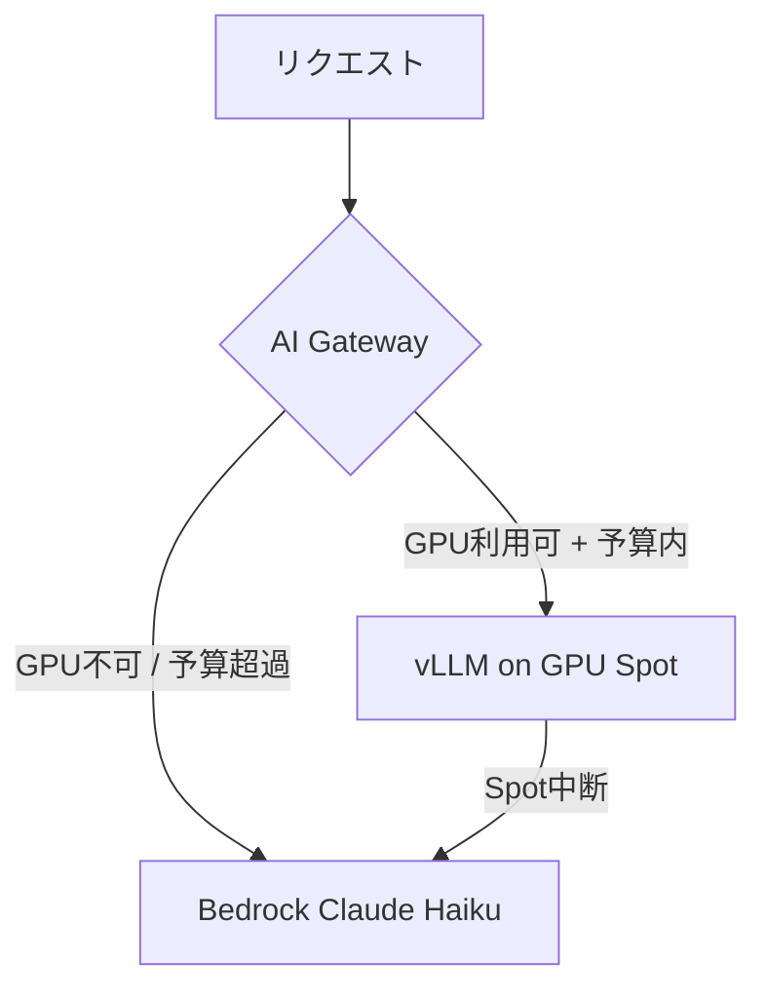

# ADR-001: 推論エンジンの選定 (vLLM vs SageMaker vs Bedrock)

## ステータス
承認済み

## コンテキスト
AI推論基盤を構築するにあたり、以下3つのオプションを検討した:

**Option A: Amazon Bedrock (マネージドAPI)**
- 完全マネージド。インフラ管理不要
- 従量課金: Claude Haiku $0.25/1M input tokens
- OSS モデルは使用不可

**Option B: Amazon SageMaker Endpoints**
- マネージドMLプラットフォーム
- モデルレジストリ・MLフロー管理が統合されている
- 最小課金: インスタンス常時稼働

**Option C: vLLM on EKS (セルフホスト)**
- OpenAI互換API。OSS/商用問わずあらゆるモデルを利用可能
- PagedAttentionによるKVキャッシュ最適化でGPU使用率最大化
- Karpenter + KEDA で scale-to-zero が可能

## 決定
Option C (vLLM on EKS) をメインとし、Option A (Bedrock) をフォールバックとするハイブリッド構成を採用した。

## 決定理由
<!-- ここはハンズオン後に自分の言葉で記述すること -->
<!-- 例: vLLMのPagedAttentionを実際に計測して何%のGPU効率向上を確認したか -->
<!-- scale-to-zeroによって実際にどの程度コストが削減できたか -->
<!-- Bedrockフォールバックが機能したシナリオでどう感じたか -->

## 結果
(負荷試験の結果数値をここに記載すること)

---

