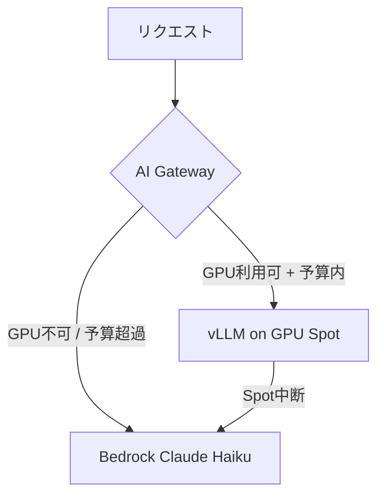

# Phase 6: 負荷試験 + ADR + STAR面接準備 + Zenn記事アウトライン

## 前提条件 (Phase 1-5 完了済み)

- 全スタック稼働中
- Grafana ダッシュボード確認済み
- scale-to-zero 動作確認済み

---

## このフェーズの目標

1. **負荷試験 (Locust)** でシステムの限界を計測し、定量的なデータを取得する
2. **ADR (Architecture Decision Record)** を3本作成する (**※決定理由はあなたが手書きすること**)
3. **STAR形式の面接Q&A** を作成する
4. **Zenn記事アウトライン** を作成する
5. 15分ノートなし口頭説明の最終確認を行う

---

## Step 1: 負荷試験 (`src/loadtest/`)

### `src/loadtest/locustfile.py`

```python
"""
AI Gatewayの負荷試験: 以下を測定する
1. vLLMルーティング時のスループット (tokens/sec)
2. Bedrockフォールバック時のレイテンシ
3. KEDAスケールアウトのトリガー条件
4. コールドスタート時のリクエスト成功率
"""
import json
import random
import time

from locust import HttpUser, between, task


PROMPTS = [
    "AWSのEKSについて100文字で説明してください",
    "Karpenterの特徴を箇条書きで3点述べてください",
    "Kubernetes のDeploymentとStatefulSetの違いは何ですか？",
    "AIモデルの推論最適化手法を説明してください",
    "vLLMのPagedAttentionの仕組みを説明してください",
]


class InferenceUser(HttpUser):
    wait_time = between(1, 3)  # 1〜3秒のランダム待機

    @task(7)
    def chat_completion_short(self):
        """短いプロンプト: 高頻度タスク"""
        prompt = random.choice(PROMPTS[:3])
        start = time.time()

        with self.client.post(
            "/v1/chat/completions",
            json={
                "messages": [{"role": "user", "content": prompt}],
                "max_tokens": 100,
            },
            catch_response=True,
        ) as response:
            latency = time.time() - start

            if response.status_code == 200:
                data = response.json()
                backend = data.get("_backend", "unknown")
                # バックエンドごとのレイテンシをLocustのカスタムメトリクスに記録
                self.environment.events.request.fire(
                    request_type="POST",
                    name=f"/v1/chat/completions [{backend}]",
                    response_time=latency * 1000,
                    response_length=len(response.text),
                )
                response.success()
            else:
                response.failure(f"HTTP {response.status_code}")

    @task(3)
    def chat_completion_long(self):
        """長いプロンプト: 低頻度タスク (コスト試算の精度確認)"""
        with self.client.post(
            "/v1/chat/completions",
            json={
                "messages": [{"role": "user", "content": PROMPTS[-1]}],
                "max_tokens": 500,
            },
            catch_response=True,
        ) as response:
            if response.status_code == 200:
                response.success()
            else:
                response.failure(f"HTTP {response.status_code}")
```

### 実行コマンド

```bash
# 負荷試験実行 (段階的に負荷を上げる)
cd src/loadtest
pip install locust

# Step 1: 軽負荷 (5ユーザー) - vLLMが捌けることを確認
locust --host=https://${ALB_URL} \
  --users 5 --spawn-rate 1 --run-time 5m \
  --headless --only-summary \
  --csv=results/vllm-baseline

# Step 2: 中負荷 (20ユーザー) - KEDAスケールアウトが発生するか確認
locust --host=https://${ALB_URL} \
  --users 20 --spawn-rate 2 --run-time 10m \
  --headless --only-summary \
  --csv=results/keda-scaleout

# Step 3: 高負荷 (50ユーザー) - Bedrockフォールバックが機能するか確認
locust --host=https://${ALB_URL} \
  --users 50 --spawn-rate 5 --run-time 10m \
  --headless --only-summary \
  --csv=results/bedrock-fallback

# 結果を Grafana で確認
# 1. GPU使用率の推移
# 2. vLLM vs Bedrock のルーティング比率の変化
# 3. P95レイテンシの推移
```

### 計測すべき定量データ (面接で使う数値)

負荷試験完了後、以下の数値を記録すること:

```
=== 計測結果テンプレート ===
vLLM (g4dn.xlarge, Phi-3-mini):
  スループット: ____ tokens/sec
  P50 レイテンシ: ____ ms
  P95 レイテンシ: ____ ms
  GPU使用率 (ピーク): ____%
  1Mトークンあたりコスト: $____

Bedrock (Claude Haiku):
  P50 レイテンシ: ____ ms
  P95 レイテンシ: ____ ms
  1Mトークンあたりコスト: $____

KEDA スケールアウト:
  トリガー条件: vllm_num_requests_waiting >= 1
  スケールアウト完了まで: ____ 分 (コールドスタート含む)
  スケールアウト中のエラー率: ____%

コスト最適化効果:
  scale-to-zero 適用後の1日あたりGPU稼働時間: ____ h/day
  従来 (常時稼働) vs scale-to-zero のコスト比: ____% 削減
```

---

## Step 2: ADR (Architecture Decision Record)

**⚠️ 重要: `## 決定理由` セクションはハンズオン後に自分の言葉で記述すること**
**AIに書かせたテキストは面接でボロが出る。実際に手を動かして感じたことを書く。**

### `docs/adr/ADR-001-inference-engine.md`

```markdown
# ADR-001: 推論エンジンの選定 (vLLM vs SageMaker vs Bedrock)

## ステータス
承認済み

## コンテキスト
AI推論基盤を構築するにあたり、以下3つのオプションを検討した:

**Option A: Amazon Bedrock (マネージドAPI)**
- 完全マネージド。インフラ管理不要
- 従量課金: Claude Haiku $0.25/1M input tokens
- OSS モデルは使用不可

**Option B: Amazon SageMaker Endpoints**
- マネージドMLプラットフォーム
- モデルレジストリ・MLフロー管理が統合されている
- 最小課金: インスタンス常時稼働

**Option C: vLLM on EKS (セルフホスト)**
- OpenAI互換API。OSS/商用問わずあらゆるモデルを利用可能
- PagedAttentionによるKVキャッシュ最適化でGPU使用率最大化
- Karpenter + KEDA で scale-to-zero が可能

## 決定
Option C (vLLM on EKS) をメインとし、Option A (Bedrock) をフォールバックとするハイブリッド構成を採用した。

## 決定理由
<!-- ここはハンズオン後に自分の言葉で記述すること -->
<!-- 例: vLLMのPagedAttentionを実際に計測して何%のGPU効率向上を確認したか -->
<!-- scale-to-zeroによって実際にどの程度コストが削減できたか -->
<!-- Bedrockフォールバックが機能したシナリオでどう感じたか -->

## 結果
(負荷試験の結果数値をここに記載すること)

---



```

### `docs/adr/ADR-002-karpenter-gpu.md`

```markdown
# ADR-002: GPU ノード管理戦略 (Karpenter vs Managed Node Group)

## ステータス
承認済み

## コンテキスト
GPU ノードの管理方法として以下を比較した:

| | Managed Node Group | Karpenter |
|-|-------------------|-----------|
| プロビジョニング | 事前設定が必要 | オンデマンド |
| Spot対応 | ○ | ○ (フォールバック容易) |
| インスタンスタイプ | 限定的 | 複数指定可 |
| scale-to-zero | 困難 | 容易 (KEDA連携) |
| コスト | 常時稼働分課金 | 使った分のみ |

## 決定
Karpenter + GPU NodePool (`node-pool-gpu`) を採用。
システムワークロードのみ Managed Node Group を使用。

## 決定理由
<!-- ハンズオン後に記述: Karpenterのプロビジョニング速度を実測してどう感じたか -->
<!-- MNGではなくKarpenterを選んだことでどんな運用上の差異があったか -->

## トレードオフ
- Karpenterのアップグレード管理が追加コストになる
- GPU AMIの選択 (AL2 vs Bottlerocket) は手動で調整が必要
```

### `docs/adr/ADR-003-keda-scaling.md`

```markdown
# ADR-003: スケーリング戦略 (KEDA vs HPA vs 手動)

## ステータス
承認済み

## コンテキスト
vLLMのスケーリング方法として以下を比較した:

**HPA (Horizontal Pod Autoscaler)**
- CPU/Memory メトリクスベース
- 推論ワークロードではCPUが低くてもGPU/キューが溢れるケースがあり不適合

**KEDA (Kubernetes Event Driven Autoscaler)**
- 任意のメトリクスでスケーリング可能
- AMP Prometheus メトリクス (`vllm_num_requests_waiting`) を直接トリガーに使用可能
- scale-to-zero をネイティブサポート

**手動スケーリング**
- 運用負荷が高く、24/7 監視が必要

## 決定
KEDA + AMP Prometheus スケーラーを採用。

## 決定理由
<!-- ハンズオン後に記述: vllm_num_requests_waiting をトリガーにした判断の妥当性 -->
<!-- HPAで実現しようとすると何が困難だったかを具体的に記述 -->

## コールドスタート問題
scale-to-zero により5分のコールドスタートが発生する。
これを許容した理由: (ハンズオン後に記述)
対策: AI Gateway の Bedrock フォールバックで UX を維持。
```

---

## Step 3: STAR形式 面接Q&A

### Q1: 「最も技術的に挑戦的だったインフラ構築を教えてください」

```
Situation:
  AI推論基盤の要件として「OSS モデルをGPUで自前サービング」かつ
  「コスト管理を自動化」という相反する要件があった。
  GPU インスタンスは常時稼働させると月 $115 (g4dn.xlarge) かかるが、
  実際の推論需要は1日数時間に限られていた。

Task:
  vLLM on EKS でGPU効率を最大化しつつ、
  トラフィックゼロ時はGPUノードを自動返却するアーキテクチャを設計・実装する。

Action:
  1. KEDA の AMP Prometheus スケーラーで vllm_num_requests_waiting を監視
  2. 待機リクエストゼロが5分継続 → vLLM replica=0
  3. Karpenter WhenEmpty consolidation → g4dn.xlarge Spot 返却
  4. AI Gateway が Bedrock にフォールバック (コールドスタート中のUX維持)
  5. PagedAttention + continuous batching でGPU使用率を __% まで向上
  (DCGM + OTEL + AMG で可視化)

Result:
  - GPU稼働時間: 1日24h → 約 __ h/day に削減 (___% コスト削減)
  - P95レイテンシ: vLLM __ ms / Bedrock __ ms
  - コールドスタート中のエラー率: ___% (Bedrock フォールバックにより)
  - 1M tokens あたりのコスト: Bedrock $0.25 → vLLM $____ (___% 削減)
```

### Q2: 「NAT Gatewayなしでどうやって外部サービスにアクセスしましたか？」

```
Situation:
  EKS クラスターをプライベートサブネットに配置し、
  セキュリティとコスト (NAT GW: $45/月以上) の両立が課題だった。

Task:
  NAT Gateway ゼロでECR/S3/Bedrock/AMPへのアクセスを実現する。

Action:
  13種類の VPC Endpoint を Terraform for_each で管理:
  - Gateway型: S3 (モデル重みのDL)
  - Interface型: ECR API/DKR (イメージPull), STS (IRSA), APS (AMP), bedrock-runtime, etc.
  特にハマったのは private_dns_enabled = true の設定漏れで
  名前解決が失敗するケース。VPC Flow Logs で経路確認しながらデバッグした。

Result:
  NAT Gateway コスト: $0
  全てのAWSサービスへのアクセスがプライベート接続経由となり、
  インターネット経由の通信ゼロを実現。
```

### Q3: 「vLLMとSageMakerエンドポイントを比較するとしたら？」

```
(面接官がMLOpsバックグラウンドを持つ場合に備えて準備)

vLLMのメリット:
1. PagedAttentionによるGPU効率: SageMakerの標準TGI比で推論スループット __ tokens/sec向上
2. OpenAI API互換: 既存クライアントのコード変更ゼロ
3. scale-to-zero: KEDA連携でGPUコストを使った分のみに最小化
4. モデル制約なし: HuggingFace の任意モデルを使用可能

SageMakerのメリット:
1. MLフロー統合 (モデルレジストリ、A/Bテスト、モデルモニタリング)
2. Managed なのでKubernetesの知識不要
3. Spot Training との統合が容易

今回の判断: 推論サービングの柔軟性とコスト最適化を優先してvLLMを選択。
MLOps機能が必要になった場合はMLflowをEKSに追加することを検討。
```

---

## Step 4: Zenn記事アウトライン

`docs/zenn-outline.md` として作成すること:

```markdown
# Zenn記事タイトル (案)
「vLLM + EKS + Karpenter でつくるコスト最適化AI推論基盤 —  
GPU Spot インスタンスを scale-to-zero して$0に近づける」

## ターゲット読者
- EKS を使っているが AI推論をどう乗せるか悩んでいるインフラエンジニア
- SageMaker 以外の選択肢を探している ML エンジニア

## 構成

### 1. なぜ自前でGPUサービングをするのか (500字)
- Bedrock だけでは OSS モデルが使えない
- SageMaker は常時稼働コストが高い
- vLLM + Karpenter の組み合わせがコスト最適

### 2. アーキテクチャ全体図 (Mermaid) (300字)
- コンポーネントとデータフローの説明

### 3. vLLM の PagedAttention とは (1000字)
- KV キャッシュの断片化問題
- ページ管理でGPUメモリ効率を最大化
- 実測値: GPU使用率 __% → __%

### 4. Karpenter で GPU Spot を動的管理 (1000字)
- NodePool 設計 (GPU/CPU 分離)
- Spot 中断ハンドリング (terminationGracePeriodSeconds)
- AL2 vs Bottlerocket を選んだ理由

### 5. KEDA で scale-to-zero (1000字)
- HPA では推論ワークロードに対応できない理由
- vllm_num_requests_waiting をトリガーにした設計
- scale-to-zero → Karpenter ノード返却の連鎖

### 6. OTEL + DCGM + AMP で可観測性 (800字)
- DCGM のインストールと GPU メトリクス
- OTELカスタムメトリクスでコストを可視化

### 7. 負荷試験結果と考察 (800字)
- Locust 実行結果
- コールドスタート問題と Bedrock フォールバック

### 8. まとめとコスト試算 (500字)
- scale-to-zero 前後のコスト比較表
- 今後の改善: GPU キャッシュウォームアップ、inf2 への移行

## GitHub リポジトリ
[eks-ai-inference-platform リンク]
```

---

## Step 5: 最終確認チェックリスト

### システム全体の動作確認

```bash
# 全 Pod のステータス確認
kubectl get pods -A | grep -v Running | grep -v Completed

# Grafana ダッシュボード URL
terraform -chdir=terraform/environments/dev output amg_workspace_url

# 負荷試験結果の確認
cat src/loadtest/results/vllm-baseline_stats.csv

# コスト記録
echo "=== GPU稼働時間記録 ===" > docs/cost-record.md
kubectl logs -n karpenter -l app.kubernetes.io/name=karpenter | grep "g4dn" | wc -l
```

### クリーンアップ (コスト節約)

```bash
# Phase 5 の確認が終わったら必ずクリーンアップ
# 特に GPU ノードは $0.16/h 課金が継続する

# 1. vLLM スケールダウン (Karpenterがノードを返却する)
kubectl scale deployment vllm-server -n ai-inference --replicas=0

# 2. 5分待ってGPUノードが消えたことを確認
kubectl get nodes

# 3. EKS クラスター以外を削除 (コスト大)
terraform -chdir=terraform/environments/dev destroy \
  -target=module.karpenter \
  -auto-approve

# 4. 完全削除 (ポートフォリオ提出後)
terraform -chdir=terraform/environments/dev destroy -auto-approve
```

---

## Phase 6 完了チェックリスト

- [ ] Locust 負荷試験 3パターン実行済み
- [ ] 定量データ (レイテンシ/スループット/コスト) 記録済み
- [ ] ADR-001 ~ ADR-003 作成済み (決定理由は自分の言葉で)
- [ ] STAR Q&A に実測値を埋め込み済み
- [ ] Zenn 記事アウトライン作成済み
- [ ] GitHub README 更新済み (アーキテクチャ図含む)
- [ ] クリーンアップ完了 (GPU課金停止確認)

---

## 15分ノートなし口頭説明 最終確認

以下のトピックを順番に、ノートなしで15分間説明できるか確認すること:

1. なぜ SageMaker でも Bedrock だけでもなく、vLLM on EKS を選んだのか (3分)
2. PagedAttention の仕組みと実際の効果 (3分)
3. KEDA + Karpenter で scale-to-zero が実現できる仕組み (3分)
4. NAT Gateway なし構成でどうやって外部アクセスを実現したか (2分)
5. コールドスタート問題をどう許容/対策したか (2分)
6. 実測値で何が改善できたか (2分)

**もし詰まる箇所があれば、そこが本当の理解ギャップ。ADRに追記すること。**