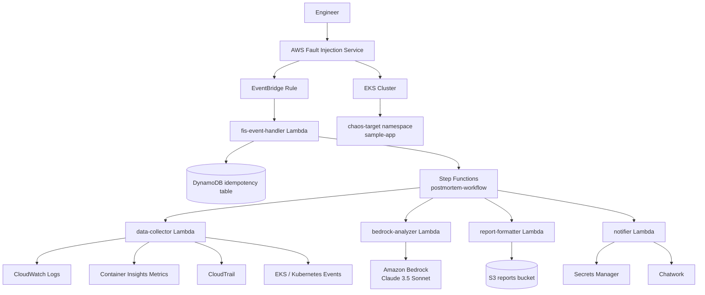
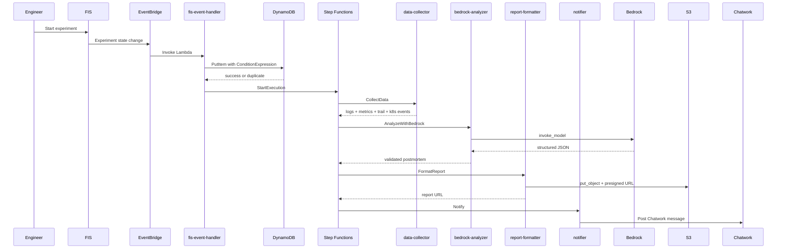
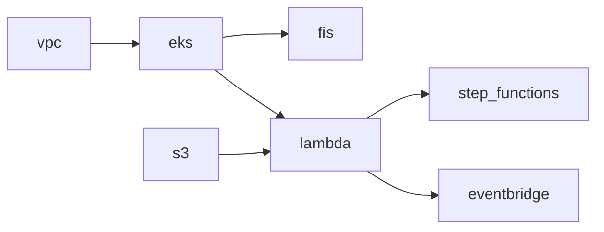

# eks-chaos-postmortem-generator Architecture

このドキュメントは、`eks-chaos-postmortem-generator` の全体像を「コードに沿って」理解するための詳細版です。README の要約ではなく、Terraform モジュール、Lambda 実装、Kubernetes マニフェスト、CI 設定まで含めて、どの責務がどこにあり、どのデータがどう流れるかを整理しています。

関連資料:

- 概要とハンズオン: `README.md`

## 1. ひとことで言うと

このプロジェクトは、Amazon EKS 上のワークロードに AWS Fault Injection Service（FIS）で意図的な障害を起こし、その実験結果を EventBridge と Step Functions で回収し、Amazon Bedrock で日本語ポストモーテムを生成し、HTML レポートとして S3 に保存して Chatwork に通知する自動化基盤です。

設計の中心は次の 3 点です。

1. Chaos Engineering を「実験実行」で終わらせず、レポート生成まで自動化すること
2. 障害データを CloudWatch / CloudTrail / Kubernetes Events から集めて、AI に渡せる形へ正規化すること
3. 実験対象を `chaos-target` と `ChaosTarget=true` に限定し、安全側に倒した構成にすること

## 2. システム全体像



## 3. エンドツーエンドの流れ

### 3.1 正常系シーケンス



### 3.2 失敗時の流れ

- `CollectData` / `AnalyzeWithBedrock` / `FormatReport` / `Notify` の各 Task には `Retry` と `Catch` が設定されています。
- 失敗すると `ErrorNotify` ステートへ分岐し、`notifier` Lambda がエラーメッセージを Chatwork に送ります。
- EventBridge から `fis-event-handler` への配信失敗時は SQS DLQ に退避されます。

## 4. リポジトリ構成

```text
.
├── terraform/
│   ├── environments/dev/        # 実際のデプロイエントリポイント
│   └── modules/
│       ├── vpc/
│       ├── eks/
│       ├── fis/
│       ├── s3/
│       ├── lambda/
│       ├── step_functions/
│       └── eventbridge/
├── lambda/
│   ├── fis-event-handler/
│   ├── data-collector/
│   ├── bedrock-analyzer/
│   ├── report-formatter/
│   └── notifier/
├── k8s/
│   ├── sample-app/
│   └── chaos-jobs/
├── docs/
└── .github/workflows/
```

理解の起点としては、`terraform/environments/dev/main.tf` をルートにして、そこから各モジュールの依存を追うのが最短です。

## 5. Terraform レイヤーの責務分解

### 5.1 実際のデプロイ単位

このプロジェクトには `terraform/main.tf` もありますが、運用上の主エントリポイントは `terraform/environments/dev/main.tf` です。ここで以下のモジュールを順に束ねています。

| モジュール | 役割 | 主な出力 |
|---|---|---|
| `vpc` | 2AZ の VPC、public/private subnet、IGW、NAT | `vpc_id`, `private_subnet_ids` |
| `eks` | EKS クラスター、2つの node group、OIDC、EBS CSI addon | `cluster_name`, `cluster_endpoint` |
| `fis` | 4つの実験テンプレート、StopCondition、ダッシュボード | 実験テンプレート ID 群 |
| `s3` | HTML レポート保存バケット | `bucket_name`, `bucket_arn` |
| `lambda` | 5つの Lambda、IAM、Logs、DynamoDB、Secrets Manager | 各 Lambda ARN |
| `step_functions` | ポストモーテム生成ワークフロー | `state_machine_arn` |
| `eventbridge` | FIS 完了イベントの捕捉と Lambda 起動 | Rule, Target, DLQ |

### 5.2 モジュール依存関係



ポイント:

- `lambda` モジュールは `step_functions_arn` を空文字でも動くように設計され、循環参照を避けています。
- `step_functions` は Lambda ARN を受け取って ASL を組み立てます。
- `eventbridge` は `fis-event-handler` だけを直接起動し、以降の制御は Step Functions に委譲します。

## 6. ネットワークと EKS 設計

### 6.1 VPC

`terraform/modules/vpc/` は以下を作成します。

- `10.0.0.0/16` の VPC
- `ap-northeast-1a` / `1c` に public subnet 2 本
- `ap-northeast-1a` / `1c` に private subnet 2 本
- IGW 1 つ
- NAT Gateway 1 つ

設計意図:

- EKS ノードは private subnet に配置
- NAT Gateway は 1AZ のみで、可用性よりコストを優先
- Subnet には `kubernetes.io/role/elb` などのタグが付与され、EKS と ALB が認識しやすい形になっています

### 6.2 EKS クラスター

`terraform/modules/eks/` は、クラスター本体だけでなく「障害を安全に注入するための境界」も作っています。

主要要素:

- EKS 1.30
- `baseline` node group
- `chaos` node group
- OIDC provider
- EBS CSI Driver addon と IRSA ロール

`baseline` と `chaos` の役割分離:

- `baseline`: `ChaosTarget=false`
- `chaos`: `ChaosTarget=true`, Kubernetes label `role=chaos-target`

この分離により、FIS の node termination 実験は `chaos` 側だけに向きます。

### 6.3 Kubernetes 側の対象ワークロード

`k8s/sample-app/deployment.yaml` は `chaos-target` namespace に 3 replica の NGINX を配置し、さらに `nodeSelector: role: chaos-target` で chaos node group に載せています。

これにより、

- Pod kill では自己修復
- Node termination では再スケジューリング
- CPU stress / network latency では劣化や回復

を観測しやすくしています。

## 7. Chaos Engineering レイヤー

### 7.1 FIS 実験テンプレート

`terraform/modules/fis/` は 4 種類の実験テンプレートを管理します。

| 実験 | 実体 | 対象 |
|---|---|---|
| `pod-kill` | `aws:eks:pod-delete` | `chaos-target` namespace の Pod |
| `node-termination` | `aws:eks:terminate-nodegroup-instances` | `ChaosTarget=true` の node group |
| `network-latency` | `aws:eks:inject-kubernetes-custom-resource` | EKS cluster 上で Job 実行 |
| `cpu-stress` | `aws:eks:inject-kubernetes-custom-resource` | EKS cluster 上で Job 実行 |

### 7.2 StopCondition

全実験に共通して、Container Insights の `node_cpu_utilization >= 90` を監視する CloudWatch Alarm が StopCondition として設定されています。

これは「障害注入が検証を超えて破壊に寄る」ことを避けるための安全装置です。

### 7.3 Custom Resource 型の実験

`network-latency` と `cpu-stress` は、ローカルの `k8s/chaos-jobs/*.yaml` とほぼ同じ発想で、FIS の `kubernetesSpec` に Job をインライン埋め込みしています。

要点:

- `network-latency` は `busybox` + `tc netem`
- `cpu-stress` は `alexeiled/stress-ng`
- どちらも 60 秒で終了
- `ttlSecondsAfterFinished = 60` により後片付けを自動化

## 8. イベント駆動オーケストレーション

### 8.1 EventBridge

`terraform/modules/eventbridge/` は FIS の終了イベントを拾います。

対象イベント:

- `completed`
- `failed`
- `stopped`

ここで重要なのは、成功だけでなく失敗した実験も分析対象にしている点です。Chaos Engineering では「失敗実験の振る舞い」自体が学習材料になるため、この判断は合理的です。

### 8.2 fis-event-handler Lambda

`lambda/fis-event-handler/main.py` の責務は 3 つです。

1. EventBridge イベントから `experiment_id` などを抽出する
2. DynamoDB に `ConditionExpression` 付きで記録し、冪等性を保証する
3. Step Functions を起動する

DynamoDB テーブルの役割:

- パーティションキーは `experiment_id`
- TTL は 7 日
- 同じ実験 ID の重複処理を防止

この Lambda は Step Functions ARN が未設定でも落ちず、ログだけ残して終了できます。つまり、パイプラインを段階的に構築する前提がコードに入っています。

## 9. Step Functions ワークフロー

`terraform/modules/step_functions/postmortem_workflow.asl.json` に、全体の制御フローが定義されています。

```text
CollectData
  -> AnalyzeWithBedrock
  -> FormatReport
  -> Notify
  -> Done

on error:
  -> ErrorNotify
  -> WorkflowFailed
```

各 Task の責務:

| State | 入力 | 出力 |
|---|---|---|
| `CollectData` | 実験メタ情報 | 収集済み観測データ |
| `AnalyzeWithBedrock` | 実験 + 観測データ | 構造化ポストモーテム JSON |
| `FormatReport` | ポストモーテム JSON | S3 key, presigned URL |
| `Notify` | レポート URL + 要約 | Chatwork 通知結果 |

設計上の特徴:

- すべての Task に `Retry` がある
- 失敗時は `Catch` で `ErrorNotify` に寄せる
- Step Functions 自身も CloudWatch Logs と X-Ray を有効化している

## 10. Lambda パイプライン詳細

### 10.1 data-collector

`lambda/data-collector/main.py` は、4 系統のデータを `ThreadPoolExecutor` で並列収集します。

収集ソース:

- CloudWatch Logs
- Container Insights metrics
- CloudTrail
- Kubernetes Warning Events

収集の工夫:

- 障害前後 5〜10 分に絞る
- CloudWatch Logs は最大 1,000 件
- Bedrock に渡す際はさらに件数を切り詰める
- Kubernetes には kubeconfig ではなく EKS Bearer Token を生成して接続する

この Lambda は、単なる raw log 取得ではなく、AI に渡す前段の「情報圧縮レイヤー」と見ると理解しやすいです。

### 10.2 bedrock-analyzer

`lambda/bedrock-analyzer/main.py` は、収集データから日本語ポストモーテム JSON を生成します。

モデル:

- `anthropic.claude-3-5-sonnet-20241022-v2:0`

出力仕様:

- `summary`
- `timeline`
- `root_cause`
- `impact`
- `prevention`
- `action_items`

重要な設計:

- system prompt で JSON 以外を禁止
- `temperature=0` で再現性重視
- `validate_postmortem()` で 6 項目と空配列チェックを実施

つまりこの Lambda は、AI 呼び出しそのものよりも「AI 出力を次工程で扱える形式に固定する」役割が大きいです。

### 10.3 report-formatter

`lambda/report-formatter/main.py` は、ポストモーテム JSON をスタンドアロン HTML に変換し、S3 に保存して presigned URL を返します。

特徴:

- 外部 CSS なし
- モバイル対応
- 7 日有効の presigned URL
- `reports/{experiment_type}/{experiment_id}/postmortem.html` に保存

この構成により、閲覧側は AWS コンソールに入らずともレポートを読めます。

### 10.4 notifier

`lambda/notifier/main.py` は、Secrets Manager から Chatwork 認証情報を取得して通知します。

特徴:

- `api_key` と `room_id` を 1 シークレットで管理
- Lambda ウォームスタート中はシークレットをキャッシュ
- 正常系とエラー系でメッセージテンプレートを分ける

## 11. データ契約

### 11.1 fis-event-handler から Step Functions へ

```json
{
  "experiment_id": "exp-123",
  "experiment_type": "pod-kill",
  "start_time": "2026-05-06T12:00:00Z",
  "end_time": "2026-05-06T12:01:00Z",
  "state": "completed"
}
```

### 11.2 data-collector の返却

```json
{
  "experiment_id": "exp-123",
  "experiment_type": "pod-kill",
  "duration_seconds": 60,
  "collected_data": {
    "cloudwatch_logs": [],
    "metrics_summary": {},
    "cloudtrail_events": [],
    "k8s_events": []
  }
}
```

### 11.3 bedrock-analyzer の返却

```json
{
  "experiment_id": "exp-123",
  "postmortem": {
    "summary": "...",
    "timeline": [],
    "root_cause": "...",
    "impact": {},
    "prevention": [],
    "action_items": []
  }
}
```

### 11.4 report-formatter の返却

```json
{
  "experiment_id": "exp-123",
  "report_s3_key": "reports/pod-kill/exp-123/postmortem.html",
  "presigned_url": "https://..."
}
```

## 12. セキュリティモデル

### 12.1 何を守っているか

- Chaos 実験が本番相当ノードへ飛ばないこと
- Lambda が不要な AWS API を叩けないこと
- Chatwork API キーがコードに埋まらないこと
- レポートが公開バケット化しないこと

### 12.2 具体策

| 項目 | 実装 |
|---|---|
| 実験対象の限定 | `ChaosTarget=true`、`chaos-target` namespace |
| Lambda 権限 | 関数ごとに個別 IAM policy |
| 秘密情報 | Secrets Manager |
| レポート公開 | S3 Public Access Block + presigned URL |
| 重複実行防止 | DynamoDB ConditionExpression |
| 追跡性 | CloudWatch Logs + X-Ray |

補足:

- `data-collector` は EKS API に対して一時 Bearer Token を生成します。
- `eks` モジュールでは OIDC provider を作成しており、IRSA の基盤はここにあります。

## 13. 可観測性

このプロジェクトは、単に障害を起こすだけでなく、その障害を観測する足場も Terraform で作っています。

用意されている主な観測ポイント:

- FIS 実験実行回数
- Pod 再起動回数
- ノード CPU 使用率
- Step Functions 成功 / 失敗数
- `bedrock-analyzer` の実行時間

これらは `terraform/modules/fis/main.tf` 内の CloudWatch Dashboard にまとめられています。

## 14. CI/CD と変更反映経路

`.github/workflows/` には 2 本の workflow があります。

- `terraform-plan.yml`
- `terraform-apply.yml`

流れ:

1. PR で `terraform/**` が変わると `plan`
2. 結果は PR コメントに投稿
3. `main` ブランチへ push されると `terraform apply -auto-approve`

認証は AWS アクセスキーではなく GitHub Actions OIDC です。

## 15. 実装上の注意点と現状ギャップ

この章は重要です。ここでは「目指している設計」ではなく、現在のコードを読んで見える注意点を書いています。

### 15.1 Lambda 依存パッケージの配布

Terraform の `lambda` モジュールは各 Lambda について `main.py` だけを zip 化しています。`requirements.txt` は各ディレクトリにありますが、現状の Terraform からは install や vendor 化が行われていません。

影響:

- `aws-lambda-powertools` は Layer で補える
- `boto3` は Lambda ランタイム同梱で動く
- ただし `data-collector` の `kubernetes` は現状パッケージに入らない

つまり、アーキテクチャ上は `data-collector` が Kubernetes Events まで取る想定ですが、デプロイ方法を追加しないと実環境では不足する可能性があります。

### 15.2 `experiment_type` 推定ロジック

`fis-event-handler` は `experimentTemplateId` の文字列に `pod-kill` などのキーワードが含まれる前提で `experiment_type` を推定しています。一方、FIS の template ID は通常は opaque な ID なので、実運用では `unknown` になる可能性があります。

このため、設計意図としては「実験種別を下流へ渡す」ですが、現在の実装だけでは十分に安定していません。

### 15.3 Chatwork メッセージの action item 表示

`bedrock-analyzer` の prompt は action item に `task` を要求していますが、`notifier` は `description` を読みに行っています。そのため、Chatwork 側ではアクションアイテム本文が空になる可能性があります。

### 15.4 自動 apply workflow

リポジトリには `terraform-apply.yml` があり、`main` への push で `terraform apply -auto-approve` を実行します。安全性を重視する組織では強めの自動化です。アーキテクチャ理解の観点では「変更の最終適用経路が GitHub Actions にある」点を把握しておく価値があります。

## 16. このプロジェクトを読むおすすめ順

初めて触る人は、次の順で読むと理解が早いです。

1. `README.md`
2. `terraform/environments/dev/main.tf`
3. `terraform/modules/eks/main.tf`
4. `terraform/modules/fis/main.tf`
5. `terraform/modules/lambda/main.tf`
6. `terraform/modules/step_functions/postmortem_workflow.asl.json`
7. `lambda/data-collector/main.py`
8. `lambda/bedrock-analyzer/main.py`
9. `lambda/report-formatter/main.py`
10. `lambda/notifier/main.py`

## 17. まとめ

このシステムの本質は、EKS 障害実験そのものよりも、その結果を即座に説明可能な知見へ変換するパイプラインにあります。

構造としては、

- EKS + FIS が障害の発生面
- EventBridge + Step Functions が制御面
- CloudWatch / CloudTrail / K8s Events が観測面
- Bedrock が解釈面
- S3 + Chatwork が共有面

を担当しており、これらが疎結合に連携することで、「実験して終わり」ではなく「実験から学習可能な成果物を残す」アーキテクチャになっています。
