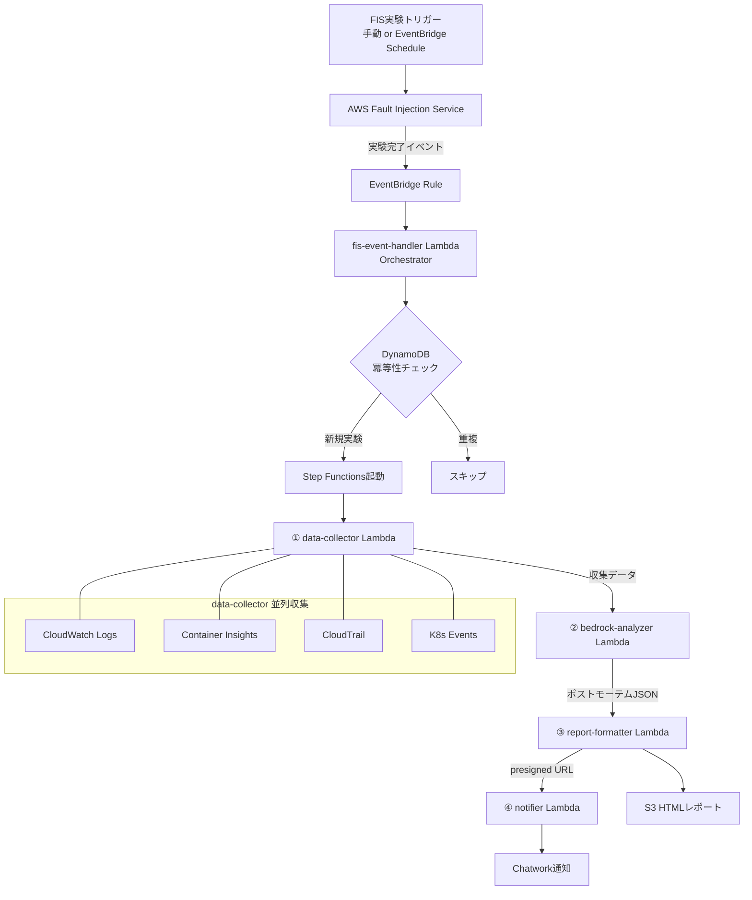

# eks-chaos-postmortem-generator アーキテクチャ

## 概要

AWS Fault Injection Service（FIS）でEKSクラスターに意図的な障害を注入し、
Amazon Bedrockが自動でポストモーテムドキュメントを生成するSREプラットフォーム。

**コンセプト**: 「障害を意図的に起こし、AIが人間より先にポストモーテムを書く」

---

## システム構成図



---

## コンポーネント説明

### FIS実験テンプレート

| 実験名 | FISアクション | 対象 | 期間 |
|---|---|---|---|
| pod-kill | aws:eks:pod-delete | namespace=chaos-target | 即時 |
| node-termination | aws:eks:terminate-nodegroup-instances | NodeGroup=chaos | 即時 |
| network-latency | aws:eks:inject-kubernetes-custom-resource | namespace=chaos-target | 60秒 |
| cpu-stress | aws:eks:inject-kubernetes-custom-resource | namespace=chaos-target | 60秒 |

全実験にStopConditionを設定（ノードCPU ≥ 90% で自動停止）。

### Step Functionsワークフロー

```
postmortem-workflow
├── CollectData       → data-collector Lambda（timeout: 300s）
├── AnalyzeWithBedrock → bedrock-analyzer Lambda（timeout: 120s）
├── FormatReport      → report-formatter Lambda（timeout: 60s）
└── Notify            → notifier Lambda（timeout: 30s）
```

各ステートにRetry/Catchを実装。失敗時はnotifier Lambdaにエラーモードで通知。

### Bedrock分析パイプライン

1. **入力**: data-collectorが収集した4ソースのデータを構造化JSON（上限8,000トークン）
2. **処理**: Claude Sonnet 3.5（`anthropic.claude-3-5-sonnet-20241022-v2:0`）でポストモーテム生成
3. **バリデーション**: 6項目チェック（全項目存在 + timeline/action_items が空でないこと）
4. **出力**: 構造化JSONポストモーテム

---

## データフロー

```
FIS実験完了
  → EventBridge（detail-type: "AWS FIS Experiment State Change"）
  → fis-event-handler（experiment_id 抽出 → DynamoDB 冪等性チェック）
  → Step Functions 起動（input: experiment_id, experiment_type, start_time, end_time）
  → data-collector（CWLogs/Metrics/CloudTrail/K8sEvents 並列収集）
  → bedrock-analyzer（Claude Sonnet 3.5 → 6項目ポストモーテムJSON）
  → report-formatter（HTML生成 → S3保存 → presigned URL生成）
  → notifier（Chatwork通知 with presigned URL）
```

---

## セキュリティ設計

### IRSA設計

Lambda関数はIRSA（IAM Roles for Service Accounts）を通じてAWSリソースにアクセスする。
アクセスキーのハードコードは禁止。GitHub ActionsもOIDC認証を使用。

### 最小権限IAM

| コンポーネント | 主な権限 |
|---|---|
| fis-event-handler | DynamoDB GetItem/PutItem, states:StartExecution |
| data-collector | logs:FilterLogEvents, cloudwatch:GetMetricData, cloudtrail:LookupEvents, eks:DescribeCluster |
| bedrock-analyzer | bedrock:InvokeModel（Claude Sonnet 3.5のみ） |
| report-formatter | s3:PutObject/GetObject（reportsバケットのみ） |
| notifier | secretsmanager:GetSecretValue（chatwork-api-keyのみ） |
| FIS実行ロール | eks:DeletePod, ec2:TerminateInstances（ChaosTarget=trueタグ付きのみ） |

禁止パターン:
- Lambda実行ロールへの `iam:PutRolePolicy` 付与
- `*` リソースへの広範な権限付与（X-Ray・CloudWatch以外）

### シークレット管理

| シークレット | 管理方法 | 用途 |
|---|---|---|
| Chatwork APIキー | Secrets Manager | notifier Lambda |
| GitHubトークン | OIDC認証 | GitHub Actions |

Secrets Manager シークレット名: `eks-chaos-postmortem/chatwork-api-key-{env}`
キー: `api_key`, `room_id`

---

## コスト設計（月次見積もり）

| サービス | 想定コスト | 備考 |
|---|---|---|
| EKS（クラスター料金） | ~$72 | 固定費 |
| EC2（Karpenterノード） | ~$30 | t3.medium×2 |
| Lambda（実行料金） | ~$1 | 実験10回/月想定 |
| Bedrock（Claude Sonnet） | ~$3 | 実験10回/月想定 |
| Step Functions | ~$1 | |
| S3・CloudWatch | ~$2 | |
| **合計** | **~$109/月** | |

> ⚠️ EKSは高コストのため、検証完了後はクラスターを停止すること（runbook.md参照）

---

## 制約・既知の問題

- **EKS Public Endpoint**: dev環境のみ許可。本番では禁止（プライベートエンドポイント必須）
- **Container Insights**: 別途 EKS アドオンのインストールが必要（`amazon-cloudwatch-observability`）
- **K8s Events収集**: IRSA設定とEKS ClusterRoleBindingが必要（terraform apply後に手動設定不要）
- **Bedrockリージョン**: ap-northeast-1（東京）でClaude Sonnet 3.5が利用可能なことを確認
- **FIS network-latency/cpu-stress**: Chaos Mesh等のオペレーターが不要（EKS標準機能で実現）
