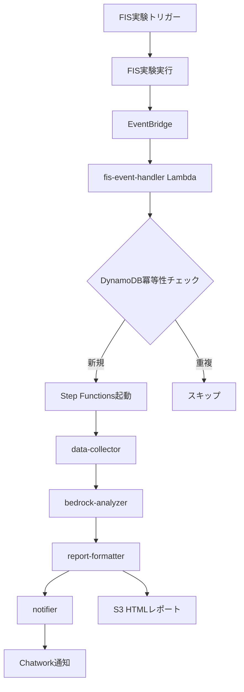

# ✅Phase 4: 通知・ドキュメント・最終仕上げ

## Phase 1〜3の実装サマリー（必ず読むこと）

**Phase 1完了**:
- VPC（10.0.0.0/16、ap-northeast-1a/1c）
- EKSクラスター（eks-chaos-postmortem-dev、Kubernetes 1.30）
- ノードグループ×2（baseline/chaos、ChaosTargetタグで区別）
- サンプルアプリ（chaos-targetネームスペース、nginx×3）
- GitHub Actions（OIDC認証）

**Phase 2完了**:
- FIS実験テンプレート×4（pod-kill/node-termination/network-latency/cpu-stress）
- EventBridgeルール（FIS実験完了イベント検知）
- Orchestrator Lambda（fis-event-handler）→ DynamoDB冪等性チェック → Step Functions起動
- DynamoDBテーブル（eks-chaos-postmortem-experiments-dev）

**Phase 3完了**:
- Step Functions（postmortem-workflow、4ステートのパイプライン）
- data-collector Lambda（CloudWatch Logs・Container Insights・CloudTrail・K8s Events収集）
- bedrock-analyzer Lambda（Claude Sonnet 3.5でポストモーテム生成・6項目バリデーション）
- report-formatter Lambda（HTMLレポート生成・S3保存・presigned URL）
- S3バケット（eks-chaos-postmortem-reports-{account_id}-dev）

## プロジェクト設計（必ず読むこと）

CLAUDE.mdを読み、命名規則・タグ戦略・通知先（Chatwork）・禁止パターンを確認すること。

---

## Phase 4で実装するもの

### 1. notifier Lambda（lambda/notifier/）

ポストモーテムレポートの完成をChatworkに通知する。

**main.py の実装**:

```python
# 設計意図:
# Step FunctionsからS3のpresigned URLとポストモーテムサマリーを受け取り、
# Chatwork APIで通知する。
# Chatwork APIキーはAWS Secrets Managerから取得する（ハードコード禁止）。
```

**Chatwork通知メッセージのフォーマット**:
```
[info][title]🔥 Chaos Engineering ポストモーテム完成[/title]
実験ID: EXP-xxxxx
実験種別: Pod Kill
実験時刻: 2026-04-18 10:00 〜 10:05 JST（5分間）

【概要】
Podの突然削除により、chaos-targetネームスペースの3PodがOOMKillされた。
Kubernetesの自己修復により2分以内に復旧を確認。

【根本原因】
メモリリミットの設定不足によるOOMKill

【アクションアイテム】
🔴 [high] リソースリクエスト・リミットの見直し（インフラチーム）
🟡 [medium] PodDisruptionBudgetの設定（プラットフォームチーム）

📄 ポストモーテムレポート（7日間有効）:
https://eks-chaos-postmortem-reports-xxxx.s3.ap-northeast-1.amazonaws.com/...
[/info]
```

**Secrets Manager設定**:
- シークレット名: `eks-chaos-postmortem/chatwork-api-key-dev`
- キー: `api_key`, `room_id`

**IAMロール権限**:
- `secretsmanager:GetSecretValue`（chatwork-api-keyのみ）
- X-Ray・Powertools

**requirements.txt**:
```
aws-lambda-powertools>=2.0.0
boto3>=1.34.0
requests>=2.31.0
```

**Secrets Managerリソース（terraform/modules/lambda/main.tf内）**:
```hcl
# ChatworkのAPIキーを安全に管理
# 実際の値はterraform apply後に手動でSecrets Managerコンソールから設定する
resource "aws_secretsmanager_secret" "chatwork_api_key" {
  name = "${var.project}/chatwork-api-key-${var.environment}"
  # 7日間のシークレット削除保護
  recovery_window_in_days = 7
}
```

---

### 2. ドキュメント整備

#### docs/architecture.md

以下のセクションを含む：

```markdown
# eks-chaos-postmortem-generator アーキテクチャ

## 概要
## システム構成図（Mermaidダイアグラム）
## コンポーネント説明
### FIS実験テンプレート
### Step Functionsワークフロー
### Bedrock分析パイプライン
## データフロー
## セキュリティ設計
### IRSA設計
### 最小権限IAM
### シークレット管理
## コスト設計（月次見積もり）
## 制約・既知の問題
```

**Mermaidダイアグラム**（必須）:


#### docs/runbook.md

以下のセクションを含む：

```markdown
# 運用ランブック

## 事前準備
### 1. Chatwork APIキーの設定
### 2. EKSクラスターへの接続確認
### 3. サンプルアプリのデプロイ

## FIS実験の実行手順
### Pod Kill実験
### Node Termination実験
### Network Latency実験
### CPU Stress実験

## ポストモーテムの確認
### Chatwork通知の確認
### S3レポートの確認
### Step Functions実行履歴の確認

## トラブルシューティング
### ポストモーテムが生成されない場合
### Bedrockバリデーションエラーの場合
### Chatwork通知が来ない場合

## コスト管理
### 検証完了後のクラスター停止手順
### 月次コスト確認方法

## クリーンアップ
### terraform destroyの手順
### 注意事項（S3バケットの手動削除）
```

#### README.md

```markdown
# eks-chaos-postmortem-generator

> Chaos Engineering × AI — 障害を意図的に起こし、AIが人間より先にポストモーテムを書く

## アーキテクチャ概要
## 使用技術スタック
## 前提条件
## セットアップ手順
## FIS実験の実行方法
## ポートフォリオとしてのポイント
## コスト
## ライセンス
```

---

### 3. CloudWatch Dashboard（terraform/modules/fis/内に追加）

実験の可視化ダッシュボード：
- ダッシュボード名: `eks-chaos-postmortem-chaos-dashboard-dev`
- ウィジェット:
  - FIS実験実行回数（カウント）
  - Pod再起動回数（Container Insights）
  - ノードCPU使用率（全ノード）
  - ポストモーテム生成成功率（Step Functions成功/失敗）
  - Bedrock呼び出しレイテンシ

---

### 4. 最終チェック・整合性確認

以下を全ファイルにわたって確認・修正する：

**命名整合性チェック**:
- [ ] 全リソース名が`eks-chaos-postmortem-`プレフィックスで統一されている
- [ ] Lambda関数名が`eks-chaos-postmortem-{function}-dev`形式になっている
- [ ] S3バケット名が`eks-chaos-postmortem-reports-{account_id}-dev`になっている

**タグ整合性チェック**:
- [ ] 全Terraformリソースに5タグが付与されている（Project/Environment/ManagedBy/Owner/CostCenter）

**セキュリティチェック**:
- [ ] アクセスキーのハードコードが存在しない
- [ ] `iam:PutRolePolicy`がLambda実行ロールに付与されていない
- [ ] S3バケットのパブリックアクセスがブロックされている
- [ ] FIS実験のStopConditionが全テンプレートに設定されている

**Python実装チェック**:
- [ ] 全LambdaにAWS Lambda Powertoolsが導入されている
- [ ] 全Lambdaにtry/exceptによるエラーハンドリングがある
- [ ] bedrock-analyzerの6項目バリデーションが実装されている
- [ ] 日本語インラインコメントが設計意図を説明している

**Terraform整合性チェック**:
- [ ] terraform/environments/dev/main.tf で全モジュールが呼び出されている
- [ ] モジュール間のoutputs/variablesが正しく接続されている
- [ ] DynamoDBテーブルのTTL設定がある

---

## 完了確認（Phase 4）

- [ ] lambda/notifier/main.py, requirements.txt
- [ ] terraform/modules/lambda/main.tf にSecrets Managerリソースが追加されている
- [ ] docs/architecture.md（Mermaidダイアグラム含む）
- [ ] docs/runbook.md
- [ ] README.md
- [ ] CloudWatch Dashboardが定義されている
- [ ] 全ファイルの命名・タグ・セキュリティチェック完了

## プロジェクト完成後の次のステップ

1. `terraform init && terraform plan` でエラーがないことを確認
2. Chatwork APIキーをSecrets Managerに手動設定
3. `terraform apply` でインフラ構築
4. `kubectl apply -f k8s/` でサンプルアプリをデプロイ
5. FIS実験を1つ実行してポストモーテム生成を確認
6. GitHubにpushしてZennの記事執筆開始 🚀