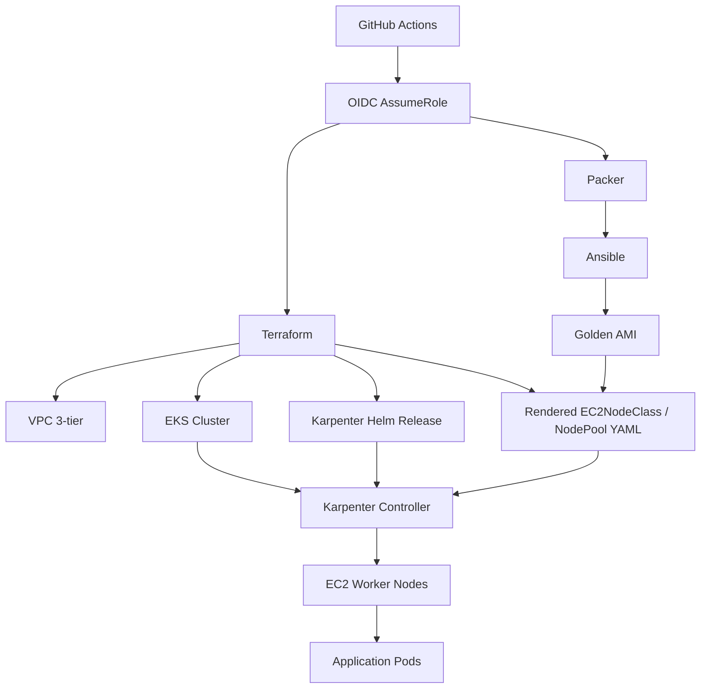
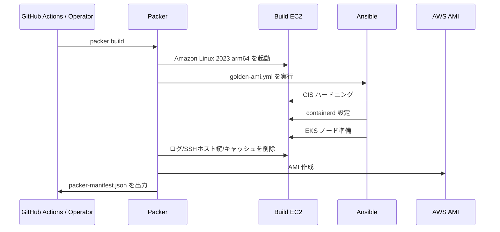
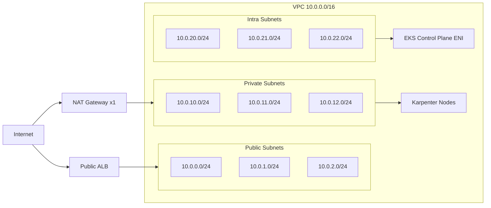
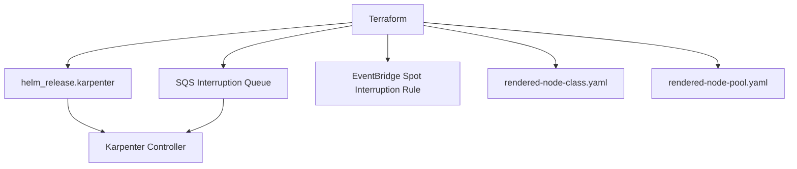
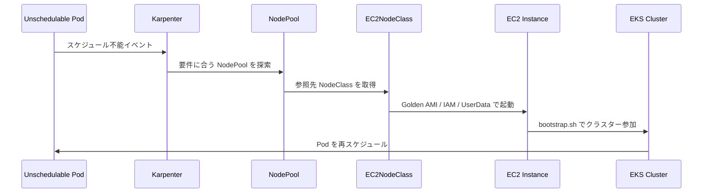
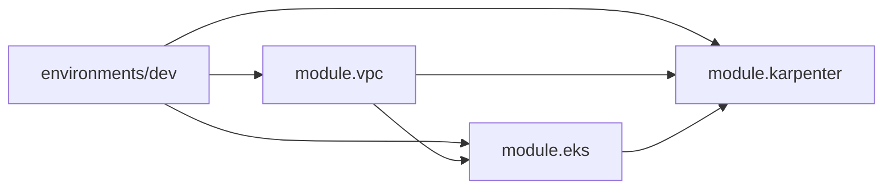

# ARCHITECTURE

## 1. このプロジェクトが解決すること

`eks-golden-node-pipeline` は、EKS ノードを「その場で設定する」のではなく、あらかじめハードニング済みの Golden AMI を作ってから Karpenter に使わせるためのパイプラインです。

このリポジトリは次の 4 層で構成されています。

1. `Ansible` でノード OS をハードニングする
2. `Packer` で Golden AMI をビルドする
3. `Terraform` で VPC / EKS / Karpenter を作る
4. `Karpenter` がその Golden AMI から EKS ノードを起動する

要するに、`node configuration as image` を徹底する構成です。

---

## 2. 全体像

この図で重要なのは、Terraform が直接ノードを作るのではなく、Terraform は Karpenter の準備までを行い、実際のノード起動は Karpenter が行う点です。

---

## 3. リポジトリ構造と責務

| パス | 役割 |
|---|---|
| `ansible/` | Golden AMI に焼き込む OS 設定を定義 |
| `packer/` | 一時 EC2 を起動し、Ansible を流して AMI を作る |
| `terraform/modules/vpc` | EKS 用の 3 層 VPC を作る |
| `terraform/modules/eks` | EKS 本体、IRSA、Karpenter 用ノード IAM を作る |
| `terraform/modules/karpenter` | Helm で Karpenter を入れ、NodeClass/NodePool YAML をレンダリングする |
| `terraform/environments/dev` | dev 環境のエントリーポイント |
| `.github/workflows/ami-build.yml` | Golden AMI ビルド CI |
| `.github/workflows/terraform.yml` | Terraform plan/apply CI |
| `docs/` | 既存の補助ドキュメント |

---

## 4. Golden AMI ビルドの中身

### 4.1 ビルドフロー

### 4.2 ベース AMI

Packer は `packer/golden-ami.pkr.hcl` で Amazon Linux 2023 の `arm64` 最新 AMI を動的に検索します。

- フィルタ: `al2023-ami-2023.*-kernel-*-arm64`
- オーナー: `137112412989`（Amazon 公式）
- リージョン: `ap-northeast-1`

これにより、毎回固定 AMI ID を埋め込まずに最新の AL2023 ベースを使います。

### 4.3 AMI に焼き込むもの

Ansible Playbook `ansible/playbooks/golden-ami.yml` は、次の 3 ロールを順番に実行します。

| ロール | 役割 | 具体例 |
|---|---|---|
| `cis-benchmark` | OS ハードニング | 不要 FS 無効化、SSH 強化、sysctl、auditd |
| `docker-runtime` | コンテナランタイム準備 | `containerd.io`、SystemdCgroup、有効化 |
| `eks-node-prep` | EKS ノード準備 | `amazon-eks-node-*`、aws-cli、SSM、kubelet 補助設定 |

### 4.4 ハードニングで特に重要な点

- SSH root ログイン禁止
- パスワード認証無効化
- `auditd` 有効化
- `net.ipv4.tcp_syncookies=1`
- `net.ipv4.ip_forward=1`

最後の `ip_forward=1` は、CIS と Kubernetes の両立で重要です。一般的なハードニングでは絞り込みたくなる設定ですが、EKS ノードとしては必要です。

### 4.5 EKS ノード向けの事前準備

Golden AMI には以下があらかじめ入ります。

- `containerd`
- `amazon-eks-node-<eks_version>`
- `aws-cli v2`
- `amazon-ssm-agent`
- `kubelet-config-additional.json`
- `/etc/eks-golden-ami-version`

このため、起動時のユーザーデータは比較的薄く保てます。

---

## 5. VPC / EKS / Karpenter の構成

### 5.1 VPC トポロジ

`terraform/modules/vpc` は `terraform-aws-modules/vpc/aws` を使い、3 種類のサブネットを作ります。

- `public_subnets`: ALB 用
- `private_subnets`: Karpenter ノード用
- `intra_subnets`: EKS Control Plane ENI 用

設計上の特徴:

- NAT Gateway は `single_nat_gateway = true`
- VPC Flow Logs 有効
- Karpenter 検出用に private subnet へ `karpenter.sh/discovery` タグを付与
- Internal / public LB 用の Kubernetes サブネットタグを付与

### 5.2 EKS 構成

`terraform/modules/eks` は `terraform-aws-modules/eks/aws` を使います。

主要ポイント:

- EKS version はデフォルト `1.30`
- Managed Node Group は作らない
- Control Plane endpoint は private/public 両方有効
- public endpoint CIDR は現状 `0.0.0.0/0`
- Add-on は `coredns`, `kube-proxy`, `vpc-cni`, `aws-ebs-csi-driver`

### 5.3 IRSA と IAM

EKS モジュール内では、少なくとも 3 つの IRSA を作ります。

| IRSA | 用途 |
|---|---|
| `vpc_cni_irsa` | VPC CNI |
| `ebs_csi_irsa` | EBS CSI Driver |
| `karpenter_irsa` | Karpenter Controller |

さらに、Karpenter が起動する EC2 ノード用に以下も作成します。

- `aws_iam_role.karpenter_node`
- `aws_iam_instance_profile.karpenter_node`

ノードロールには次の AWS managed policy を付与しています。

- `AmazonEKSWorkerNodePolicy`
- `AmazonEKS_CNI_Policy`
- `AmazonEC2ContainerRegistryReadOnly`
- `AmazonSSMManagedInstanceCore`

---

## 6. Karpenter と Golden AMI のつながり

### 6.1 制御プレーン

Karpenter モジュールは 3 種類のものを作っています。

1. Helm による Karpenter Controller のデプロイ
2. Spot 中断通知用 SQS + EventBridge
3. EC2NodeClass / NodePool の YAML レンダリング

### 6.2 AMI 解決ロジック

`terraform/modules/karpenter/main.tf` の AMI 解決ロジックは次の通りです。

1. `golden_ami_id` が指定されていればそれを使う
2. 未指定なら `golden-ami-eks-${eks_version}-*` で self-owned AMI を検索する
3. 見つかった最新 AMI を `resolved_ami_id` として使う

つまり CI/CD から明示的に AMI ID を流し込める一方で、手動運用時は「その EKS バージョン向けの最新 Golden AMI」を自動採用できます。

### 6.3 NodeClass / NodePool の意味

#### EC2NodeClass

`node-class.yaml` は次を定義します。

- 使用 AMI ID
- Instance Profile
- Subnet selector
- Security Group selector
- ブートストラップ用 userData
- root volume 設定
- IMDSv2 強制

特に重要なのは `amiSelectorTerms` で ID を直接指定している点です。これにより「どのノードがどの AMI から起動したか」が追跡しやすくなります。

#### NodePool

`node-pool.yaml` は次を定義します。

- `arm64` / `linux`
- instance category を `t`, `m`, `c`
- instance size を `medium`, `large`
- capacity type を `spot`, `on-demand`
- `expireAfter: 168h`
- `consolidationPolicy: WhenUnderutilized`

つまり、低コスト寄りの制約をかけつつ、7 日でノードを入れ替える設計です。

### 6.4 Pod からノード起動まで

---

## 7. Terraform モジュール依存関係

`dev/main.tf` では依存がきれいに一方向です。

- `vpc` がネットワークを提供
- `eks` が VPC の subnet / vpc_id を受ける
- `karpenter` が EKS 出力と private subnets を受ける

### 7.1 主な出力

| モジュール | 主な output | 使い道 |
|---|---|---|
| `vpc` | `vpc_id`, `private_subnet_ids`, `intra_subnet_ids` | EKS と Karpenter の入力 |
| `eks` | `cluster_name`, `cluster_endpoint`, `karpenter_irsa_arn`, `karpenter_node_instance_profile_name` | Karpenter モジュール入力 |
| `karpenter` | `resolved_ami_id`, `interruption_queue_name` | 実際に使われた AMI の可視化 |

---

## 8. GitHub Actions とデプロイ経路

### 8.1 `ami-build.yml`

AMI ビルド workflow は次の流れです。

1. `packer init`
2. `packer validate`
3. Ansible syntax check
4. OIDC で AWS AssumeRole
5. `packer build`
6. `packer-manifest.json` から `ami_id` 抽出

push トリガーは `ansible/**` と `packer/**` の変更時です。手動 `workflow_dispatch` もあります。

### 8.2 `terraform.yml`

Terraform workflow は次の流れです。

1. OIDC で AWS AssumeRole
2. `terraform init`
3. `terraform validate`
4. `terraform plan -out=tfplan`
5. PR のときは plan コメント投稿
6. `main` への push 時は `terraform apply tfplan`

ここは README の「plan して apply」という説明より一歩進んでいて、実装上は `main` push で apply まで自動化されています。

---

## 9. セキュリティ設計

このプロジェクトのセキュリティ方針は、主に次の 5 本柱です。

### 9.1 認証

- GitHub Actions は OIDC を使う
- 長期 Access Key を前提にしない

### 9.2 ノード OS

- Golden AMI に CIS ハードニングを事前適用
- SSH を強化
- auditd を有効化

### 9.3 ノード起動

- IMDSv2 を強制
- root volume を暗号化
- Golden AMI ID を固定的に追跡可能

### 9.4 IAM

- Karpenter Controller は IRSA
- Worker Node は専用 IAM Role + Instance Profile
- ECR / CNI / SSM など必要な managed policy のみ付与

### 9.5 監査性

- VPC Flow Logs 有効
- AMI タグでビルド由来を識別
- `/etc/eks-golden-ami-version` にビルド情報を書き込み

---

## 10. 運用ライフサイクル

### 10.1 AMI 更新

1. `ansible/` または `packer/` を更新
2. GitHub Actions で新しい Golden AMI をビルド
3. 新 AMI ID を Karpenter 側に反映
4. Karpenter が新ノードを起動
5. 古いノードは `expireAfter: 168h` や consolidation で徐々に退役

### 10.2 クラスタ更新

1. `eks_version` を更新
2. そのバージョン向け Golden AMI を再ビルド
3. Terraform / Karpenter 設定を追従

このプロジェクトでは、EKS バージョンと Golden AMI バージョンが密結合です。

---

## 11. 現状の理解で重要な注意点

このセクションは「理想」ではなく、現状コードを読んだ上での注意点です。

### 11.1 Terraform は Karpenter マニフェストを「生成」するだけ

`terraform/modules/karpenter` は `local_file` で次のファイルを出力します。

- `terraform/modules/karpenter/templates/rendered-node-class.yaml`
- `terraform/modules/karpenter/templates/rendered-node-pool.yaml`

しかし、この YAML は Terraform 内で Kubernetes API に apply していません。現状は別途 `kubectl apply` が必要です。

### 11.2 `terraform.yml` は main push で apply まで行う

ドキュメント上は手動 apply を想像しやすいですが、実装上は GitHub Actions が `terraform apply tfplan` を実行します。レビューゲートや運用ポリシーと整合するかは確認が必要です。

### 11.3 EKS public endpoint は広く開いている

`cluster_endpoint_public_access_cidrs = ["0.0.0.0/0"]` です。dev としては分かりやすい一方、本番相当では制限が必要です。

### 11.4 `private_subnet_ids` は Karpenter モジュールに渡しているが未使用

Karpenter モジュールの入力変数には `private_subnet_ids` がありますが、実装はタグセレクタで subnet を発見しており、その変数値自体は使用していません。

### 11.5 `terraform.tfvars` に未使用の `cluster_name` がある

`terraform/environments/dev/terraform.tfvars` に `cluster_name = "eks-golden-node-pipeline-dev"` がありますが、同名変数は定義されておらず、実際の cluster name は `locals` から構成されています。

---

## 12. このアーキテクチャの強み

- Golden AMI によってノードの中身をコードで再現できる
- Karpenter により Managed Node Group より柔軟なノード選択ができる
- arm64 + Spot を前提にコスト最適化へ寄せている
- OIDC / IRSA を中心に据え、長期クレデンシャル依存を減らしている
- VPC, EKS, Karpenter, AMI ビルドが役割ごとに分離されている

---

## 13. 改善余地

今後さらに強くするなら、優先度が高いのは次のあたりです。

1. Karpenter YAML を Terraform から直接 Kubernetes へ apply するか、明示的に GitOps 管理へ寄せる
2. `terraform.yml` の apply 条件を見直し、承認フローを明文化する
3. EKS public endpoint CIDR を制限する
4. `private_subnet_ids` や未使用変数など、設計途中の名残を整理する
5. Golden AMI のバージョン伝搬を `packer-manifest.json` 依存だけでなく、SSM Parameter Store 等で一元管理する

---

## 14. まとめ

このプロジェクトは、EKS ノード運用を「AWS 公式 AMI に後から設定する」方式ではなく、「事前に安全な AMI をビルドしてから Karpenter に使わせる」方式へ寄せた構成です。

アーキテクチャ上の本質は次の一文に集約できます。

> Ansible でノードの中身を定義し、Packer でイメージ化し、Terraform で土台を作り、Karpenter でそのイメージを実際のノードとして供給する。

そのため、理解の中心は Terraform 単体ではなく、`Ansible -> Packer -> AMI -> Terraform -> Karpenter -> EKS Node` の鎖全体にあります。
