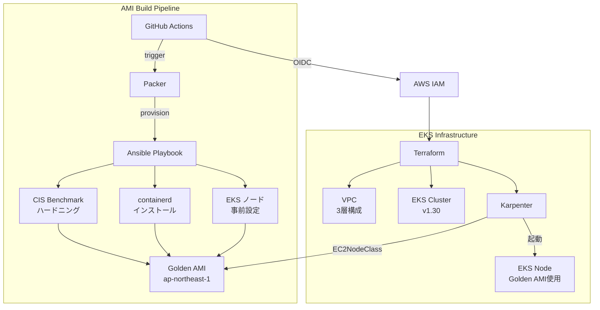

# eks-golden-node-pipeline

> Ansible + Packer で CIS Benchmark 適用済みの Golden AMI をビルドし、Karpenter × EKS に自動適用するフルパイプライン

[](https://github.com/tk-21/eks-golden-node-pipeline/actions/workflows/ami-build.yml)
[](https://github.com/tk-21/eks-golden-node-pipeline/actions/workflows/terraform.yml)

---

## このハンズオンで得られること

このハンズオンを最後まで実施すると、以下のスキルと知識が身につきます。

### インフラエンジニアリング

| 習得内容 | 具体的に学べること |
|---|---|
| **Golden AMI パターン** | 変更不可な安全なベースイメージを Packer + Ansible で量産する考え方と実装 |
| **CIS Benchmark 適用** | Linux サーバーの OS ハードニングを Ansible ロールとして自動化する方法 |
| **Karpenter によるノード管理** | NodePool / EC2NodeClass を使った EKS ノードの動的プロビジョニング |
| **Immutable Infrastructure** | AMI 差し替えでノードを入れ替える Blue/Green ローリング更新の考え方 |

### セキュリティ

| 習得内容 | 具体的に学べること |
|---|---|
| **OIDC 認証** | GitHub Actions から AWS を IAM Access Key なしで操作する仕組み |
| **IMDSv2 強制** | EC2 メタデータサービス v2 の設定方法とその重要性 |
| **最小権限 IAM** | Karpenter / IRSA の IAM ロールを最小権限で設計する方法 |

### DevOps / CI/CD

| 習得内容 | 具体的に学べること |
|---|---|
| **マルチステージ CI/CD** | AMI ビルドと Terraform apply を別ワークフローに分離する設計 |
| **Terraform S3 バックエンド** | チーム開発に必要な State 管理・ロックの仕組みを実際に構築する |
| **コスト最適化** | Spot インスタンス + arm64(Graviton) で EKS ノードコストを 40% 削減する方法 |

### ハンズオンの全体像

```
所要時間: 約 90〜120 分（AMI ビルド 25 分 + Terraform 20 分 + 確認 30 分）
費用目安: 数百円〜数ドル（手順通り後片付けすれば最小限）
難易度:   ★★★☆☆（AWS CLI / Terraform の基礎知識があれば OK）
```

---

## 概要

EKS のノード管理において「どの AMI を使うか」は、セキュリティ・安定性・コスト効率に直結します。このプロジェクトは以下を一気通貫で実現します：

- **セキュリティ強化**: Ansible で CIS Benchmark Level 1 を自動適用した Golden AMI を生成
- **Immutable インフラ**: AMI は変更せず、更新は再ビルド → Karpenter のノード入れ替えで対応
- **コスト最適化**: Karpenter の Spot インスタンス活用 + arm64(Graviton) で約 40% コスト削減
- **完全自動化**: GitHub Actions (OIDC) でビルドから EKS 適用まで自動化

## アーキテクチャ



## 技術スタック

| カテゴリ | ツール | バージョン |
|---|---|---|
| IaC | Terraform | >= 1.7 |
| AMI ビルド | Packer | >= 1.10 |
| 構成管理 | Ansible | >= 2.15 |
| コンテナ基盤 | EKS + Karpenter | 1.30 / v0.37 |
| CI/CD | GitHub Actions (OIDC) | - |
| ランタイム | containerd | 1.7.x |
| アーキテクチャ | arm64 (Graviton) | - |
| リージョン | ap-northeast-1 | - |

---

## ハンズオン

この章では、ローカル環境からこのプロジェクトを一通り実行し、Golden AMI をビルドして EKS + Karpenter でノード起動まで確認する手順を順番に説明します。

### このハンズオンで行うこと

1. ローカル作業環境を用意する（Step 0）
2. Terraform のバックエンドを準備する（Step 1）
3. GitHub Actions 用 OIDC ロールを設定する（Step 2）
4. VPC を bootstrap する（Step 3）
5. Golden AMI をビルドする（Step 4）
6. EKS / Karpenter 基盤を Terraform で構築する（Step 5）
7. kubeconfig を更新して Karpenter の起動を確認する（Step 6）
8. EC2NodeClass / NodePool を Kubernetes に適用する（Step 7）
9. テスト用 Pod を起動して Karpenter が Golden AMI ノードを使うことを確認する（Step 8〜9）
10. 後片付けをする（Step 10）

---

### 前提条件

以下がすべて揃っていることを確認してから進めてください。

#### AWS

- AWS アカウントを持っている
- `ap-northeast-1` リージョンを利用できる
- 作業用 IAM ユーザー / ロールに以下の権限がある
  - EC2, EKS, IAM, S3, DynamoDB, ECR, CloudFormation への ReadWrite
  - Packer が一時インスタンスを起動できる権限（`ec2:RunInstances` など）

#### ローカルツール

```bash
# バージョン確認コマンド
aws --version          # aws-cli/2.x
terraform version      # Terraform v1.7 以上
packer version         # Packer v1.16 以上
ansible --version      # ansible [core 2.15 以上]
kubectl version --client
jq --version
```

> **Tips**: ツールが未インストールの場合は以下を参照してください。
> - AWS CLI: https://docs.aws.amazon.com/cli/latest/userguide/getting-started-install.html
> - Terraform: https://developer.hashicorp.com/terraform/install
> - Packer: https://developer.hashicorp.com/packer/install
> - Ansible: プロジェクトの仮想環境に `ansible-core==2.15.13` をインストールします。システム Python への `pip install` は行いません。

#### GitHub（CI/CD を使う場合のみ）

- このリポジトリを fork またはクローンした GitHub リポジトリがある
- OIDC の設定ができる権限がある

---

### Step 0: リポジトリを取得してツールを確認する（所要時間: 5 分）

```bash
git clone https://github.com/tk-21/terraform-lab.git
cd terraform-lab/eks-golden-node-pipeline
```

ツールのバージョンをまとめて確認します。

```bash
aws --version
terraform version
packer version
ansible --version
kubectl version --client
jq --version
```

AWS へのアクセスを確認します。

```bash
aws sts get-caller-identity
```

期待する出力例：

```json
{
    "UserId": "AIDA...",
    "Account": "123456789012",
    "Arn": "arn:aws:iam::123456789012:user/your-user"
}
```

> **確認ポイント**
> - `Account` が作業対象の AWS アカウント ID と一致している
> - すべてのコマンドがエラーなく表示される

---

### Step 1: Terraform バックエンドを作成する（所要時間: 5 分）

このプロジェクトは Terraform の State を S3 で管理し、DynamoDB でロックします。
Terraform を実行する前にこれらを用意します。

#### 1-1. S3 バケットを作成する

```bash
aws s3api create-bucket \
  --bucket eks-golden-node-pipeline-tfstate \
  --region ap-northeast-1 \
  --create-bucket-configuration LocationConstraint=ap-northeast-1
```

バケットのバージョニングを有効にします（State ファイルの誤削除対策）。

```bash
aws s3api put-bucket-versioning \
  --bucket eks-golden-node-pipeline-tfstate \
  --versioning-configuration Status=Enabled
```

#### 1-2. DynamoDB テーブルを作成する

```bash
aws dynamodb create-table \
  --table-name eks-golden-node-pipeline-tflock \
  --attribute-definitions AttributeName=LockID,AttributeType=S \
  --key-schema AttributeName=LockID,KeyType=HASH \
  --billing-mode PAY_PER_REQUEST \
  --region ap-northeast-1
```

#### 1-3. 作成を確認する

```bash
aws s3api head-bucket --bucket eks-golden-node-pipeline-tfstate
aws dynamodb describe-table \
  --table-name eks-golden-node-pipeline-tflock \
  --query 'Table.TableStatus' \
  --output text
```

期待する出力:

```
ACTIVE
```

> **確認ポイント**
> - S3 バケット `eks-golden-node-pipeline-tfstate` が存在する
> - DynamoDB テーブル `eks-golden-node-pipeline-tflock` が `ACTIVE` になっている

---

### Step 2: GitHub Actions 用 OIDC を準備する（所要時間: 10〜15 分）

> **ローカルのみで実施する場合はスキップ可能です。**
> GitHub Actions を使わず、ローカルから Packer / Terraform を実行するだけであれば Step 3 に進んでください。

GitHub Actions から AMI ビルドや Terraform を実行するには、OIDC プロバイダーと IAM ロールが必要です。

#### 設計の考え方

```
GitHub Actions
    │
    │  (1) OIDC トークンを取得
    ▼
AWS STS AssumeRoleWithWebIdentity
    │
    │  (2) 一時クレデンシャルを取得
    ▼
IAM ロール（eks-golden-node-pipeline-github-actions-role）
    │
    │  (3) EC2 / EKS / Packer 操作
    ▼
AWS リソース
```

- 長期 Access Key を使わないため、キーの漏洩リスクがゼロ
- IAM ロールの trust policy の `sub` 条件でリポジトリを絞ることが重要

#### 2-1. OIDC プロバイダーを登録する

```bash
aws iam create-open-id-connect-provider \
  --url https://token.actions.githubusercontent.com \
  --client-id-list sts.amazonaws.com \
  --thumbprint-list 6938fd4d98bab03faadb97b34396831e3780aea1
```

すでに存在する場合は `EntityAlreadyExists` エラーが出ますが、そのまま進めて問題ありません。

#### 2-2. IAM ロールを作成する

以下の trust policy を `trust-policy.json` として保存してから実行します。`YOUR_ACCOUNT_ID` は 12 桁の AWS アカウント ID、`YOUR_REPO` は `OWNER/REPOSITORY` 形式の GitHub リポジトリ名です。

このプロジェクトが monorepo `https://github.com/tk-21/terraform-lab` 内にある場合、`YOUR_REPO` は `tk-21/terraform-lab` です。サブディレクトリ名の `eks-golden-node-pipeline` は含めません。

```json
{
  "Version": "2012-10-17",
  "Statement": [
    {
      "Effect": "Allow",
      "Principal": {
        "Federated": "arn:aws:iam::YOUR_ACCOUNT_ID:oidc-provider/token.actions.githubusercontent.com"
      },
      "Action": "sts:AssumeRoleWithWebIdentity",
      "Condition": {
        "StringLike": {
          "token.actions.githubusercontent.com:sub": "repo:YOUR_REPO:ref:refs/heads/main"
        },
        "StringEquals": {
          "token.actions.githubusercontent.com:aud": "sts.amazonaws.com"
        }
      }
    }
  ]
}
```

```bash
aws iam create-role \
  --role-name eks-golden-node-pipeline-github-actions-role \
  --assume-role-policy-document file://trust-policy.json
```

#### 2-3. Packer 用の permissions policy を追加する

Trust policy は「GitHub Actions がロールを引き受けられるか」を制御するだけです。Packer が AMI を検索・作成するための EC2 権限は、Role の **Permissions** に別途追加します。

IAM コンソールで `eks-golden-node-pipeline-github-actions-role` を開き、**Add permissions** → **Create inline policy** → **JSON** を選択し、次のポリシーを貼り付けます。Policy name は `PackerGoldenAmiBuild` とします。

```json
{
  "Version": "2012-10-17",
  "Statement": [
    {
      "Sid": "PackerAmazonEbsBuild",
      "Effect": "Allow",
      "Action": [
        "ec2:AttachVolume",
        "ec2:AuthorizeSecurityGroupIngress",
        "ec2:CopyImage",
        "ec2:CreateImage",
        "ec2:CreateKeyPair",
        "ec2:CreateSecurityGroup",
        "ec2:CreateSnapshot",
        "ec2:CreateTags",
        "ec2:CreateVolume",
        "ec2:DeleteKeyPair",
        "ec2:DeleteSecurityGroup",
        "ec2:DeleteSnapshot",
        "ec2:DeleteVolume",
        "ec2:DeregisterImage",
        "ec2:DescribeImageAttribute",
        "ec2:DescribeImages",
        "ec2:DescribeInstances",
        "ec2:DescribeInstanceStatus",
        "ec2:DescribeRegions",
        "ec2:DescribeSecurityGroups",
        "ec2:DescribeSnapshots",
        "ec2:DescribeSubnets",
        "ec2:DescribeTags",
        "ec2:DescribeVolumes",
        "ec2:DetachVolume",
        "ec2:GetPasswordData",
        "ec2:ModifyImageAttribute",
        "ec2:ModifyInstanceAttribute",
        "ec2:ModifySnapshotAttribute",
        "ec2:RegisterImage",
        "ec2:RunInstances",
        "ec2:StopInstances",
        "ec2:TerminateInstances"
      ],
      "Resource": "*"
    }
  ]
}
```

詳細なアクション一覧は [HashiCorp の Amazon plugin IAM 権限](https://developer.hashicorp.com/packer/integrations/hashicorp/amazon) を参照してください。テンプレートで既存の IAM Instance Profile や顧客管理 KMS キーを指定する場合は、追加の `iam:PassRole` または KMS 権限が必要になることがあります。

#### 2-4. GitHub Secrets を登録する

GitHub リポジトリの **Settings** → **Secrets and variables** → **Actions** で、次の Repository Secret を作成します。

| Name | 値 |
|---|---|
| `AWS_ACCOUNT_ID` | AWS アカウント ID（12 桁の数字のみ） |
| `PACKER_SUBNET_ID` | Packer ビルド用 public subnet の ID |

`AWS_ACCOUNT_ID` が未設定の場合、workflow が生成する Role ARN が不正になり、OIDC 認証が失敗します。

`PACKER_SUBNET_ID` には public subnet の `subnet-...` を設定します。GitHub-hosted Runner は VPC 外部にあるため、SSH communicator を使う現在の構成では private subnet を指定できません。

詳細は [docs/architecture.md](docs/architecture.md) を参照してください。

---

### Step 3: VPC を bootstrap する（所要時間: 10〜15 分）

Packer はビルド用 EC2 を起動するため、先に VPC と subnet が必要です。一方、通常の Terraform plan は Golden AMI を参照するため、AMI をまだ作成していない初回は 0 件検索で失敗します。

初回だけ VPC モジュールを対象指定して plan し、内容を確認します。

```bash
cd terraform/environments/dev
terraform init
terraform plan -target=module.vpc
```

> **注意**: `-target` の警告は想定どおりです。これは VPC を先行作成する bootstrap 用の一回限りの操作です。通常運用では使いません。

内容を確認した上で、VPC の apply はユーザー自身で実行してください。

```bash
terraform apply -target=module.vpc
cd ../../..
```

GitHub-hosted Runner から SSH communicator を使う場合、Packer のビルドインスタンスには到達可能な subnet が必要です。private subnet を使う場合は self-hosted Runner または SSM communicator を利用してください。public subnet を使う場合は、一時インスタンスの公開範囲を最小化してください。

#### Packer ビルド用 public subnet の ID を確認する

`vpc-...` ではなく、`subnet-...` で始まる **Subnet ID** を使います。VPC を作成した後、次のコマンドで public subnet を確認します。`YOUR_VPC_ID` は `terraform output vpc_id` の値に置き換えてください。

```bash
aws ec2 describe-subnets \
  --region ap-northeast-1 \
  --filters "Name=vpc-id,Values=YOUR_VPC_ID" \
  --query 'Subnets[?State==`available`].[SubnetId,AvailabilityZone,MapPublicIpOnLaunch,Tags[?Key==`Name`]|[0].Value]' \
  --output table
```

出力の `Name` に `public` を含む subnet を 1 つ選びます。AWS Console では **VPC** → **Subnets** から対象 subnet を開き、**Subnet ID** をコピーできます。さらに、その subnet の Route Table に Internet Gateway（`igw-...`）への `0.0.0.0/0` ルートがあることを確認してください。

`PACKER_SUBNET_ID` Secret に選んだ subnet を 1 つだけ登録します。`MapPublicIpOnLaunch` が `false` でも、Packer テンプレートの `associate_public_ip_address = true` により、一時ビルドインスタンスには public IPv4 が付与されます。さらに `ssh_interface = "public_ip"` により、GitHub-hosted Runner はその public IP へ SSH 接続します。

---

### Step 4: Golden AMI をビルドする（所要時間: 20〜30 分）

Golden AMI のビルドは 2 通りあります。どちらか一方を選んで実施してください。

#### 方法 A: GitHub Actions でビルドする（推奨）

Step 2 の OIDC 設定が完了している場合はこちらを使います。

workflow は monorepo のリポジトリ直下、`.github/workflows/ami-build.yml` に配置します。`eks-golden-node-pipeline/.github/workflows/` に置いても GitHub Actions には認識されません。

```bash
# ワークフローをトリガー
gh workflow run ami-build.yml -f eks_version=1.30

# ビルドの進行状況を確認
gh run list --workflow ami-build.yml
gh run watch  # リアルタイムログ
```

#### workflow が失敗した場合のログ確認

まず workflow の実行一覧を確認します。

```bash
gh run list --workflow ami-build.yml --limit 10
```

失敗した実行の ID を指定して、失敗したステップのログだけを表示します。

```bash
gh run view RUN_ID --log-failed
```

例:

```bash
gh run view 1234567890 --log-failed
```

実行中の workflow を監視する場合は、次を使います。

```bash
gh run watch RUN_ID
```

`RUN_ID` を省略して `gh run watch` を実行すると、対話形式で対象の実行を選択できます。

ワークフローが成功したら、AMI ID を GitHub Actions のサマリーまたは以下のコマンドで取得します。

```bash
# 最新の成功ビルドから AMI ID を取得
gh run list --workflow ami-build.yml --status success --limit 1 --json databaseId -q '.[0].databaseId' | \
  xargs gh run view --log | grep "ami-" | tail -1
```

#### 方法 B: ローカルから Packer を直接実行する

```bash
cd packer

# プラグインを初期化（初回のみ）
packer init golden-ami.pkr.hcl

# テンプレートの構文チェック
packer validate \
  -var "aws_region=ap-northeast-1" \
  -var "eks_version=1.30" \
  golden-ami.pkr.hcl
```

問題なければビルドを実行します。

```bash
packer build \
  -var "aws_region=ap-northeast-1" \
  -var "eks_version=1.30" \
  golden-ami.pkr.hcl
```

ビルドが成功すると `packer-manifest.json` が出力されます。AMI ID を取得します。

```bash
AMI_ID=$(jq -r '.builds[-1].artifact_id' packer-manifest.json | cut -d: -f2)
echo "AMI ID: ${AMI_ID}"
cd ..
```

出力例：

```
AMI ID: ami-0123456789abcdef0
```

> **確認ポイント**
> - EC2 コンソール → AMI 一覧に `golden-ami-eks-1.30-YYYYMMDD` という名前の AMI が表示される
> - `アーキテクチャ` が `arm64` になっている
> - `状態` が `available` になっている

EC2 コンソールを使わず CLI で確認する場合:

```bash
aws ec2 describe-images \
  --region ap-northeast-1 \
  --owners self \
  --filters "Name=name,Values=golden-ami-eks-1.30-*" \
  --query 'Images[*].{ImageId:ImageId,Name:Name,Architecture:Architecture,State:State}' \
  --output table
```

> **ビルドに失敗した場合**
> - Packer は失敗時に一時 EC2 インスタンスを自動で削除します
> - ログを確認して Ansible のエラーを特定してください
> - IAM 権限が不足している場合は Role の permissions policy に `ec2:DescribeImages`、`ec2:RunInstances`、`ec2:CreateImage` などが含まれているか確認してください
> - `No Subnets was found matching filters` と表示された場合は、Packer の `subnet_id` を明示指定するか、テンプレートの subnet filter に一致する subnet を用意してください
> - `/usr/lib/sftp-server: No such file or directory` と表示された場合は、Ansible provisioner の `sftp_command` を AL2023 の `/usr/libexec/openssh/sftp-server -e` に設定してください
> - `failed to transfer file` が続く場合は、Packer の Ansible provisioner に `use_proxy = false` を設定してください。GitHub-hosted Runner からビルドインスタンスの public IP へ直接 SSH 接続し、Packer の SFTP proxy を使いません。このプロジェクトでは設定済みです

---

### Step 5: Terraform で EKS 基盤を作る（所要時間: 20〜30 分）

`terraform/environments/dev` が dev 環境のエントリーポイントです。

#### 4-1. 初期化

```bash
cd terraform/environments/dev
terraform init
```

期待する出力（抜粋）：

```
Initializing the backend...
Successfully configured the backend "s3"!
Initializing modules...
Terraform has been successfully initialized!
```

#### 4-2. 構文チェックとフォーマット確認

```bash
terraform validate
terraform fmt -check -recursive
```

#### 4-3. Plan で変更内容を確認する

AMI ID を環境変数に設定しておくと便利です。

```bash
# Step 4 で取得した AMI ID を設定
export TF_VAR_golden_ami_id="ami-0123456789abcdef0"

terraform plan
```

> **Tips**
> - Golden AMI を作成する前は `golden_ami_id` を省略しないでください。AMI 検索が 0 件となり plan が失敗します
> - `golden_ami_id` を省略すると `golden-ami-eks-1.30-*` の最新 AMI を自動検索します
> - ハンズオンでは AMI ID を明示することを推奨します（どの AMI を使ったか明確になるため）
> - Plan で `60 to add, 0 to change, 0 to destroy` のように表示されれば正常です

#### 4-4. Apply する

```bash
terraform apply
```

確認プロンプトが表示されるので `yes` と入力します。

```
Do you want to perform these actions?
  Terraform will perform the actions described above.
  Only 'yes' will be accepted to approve.

  Enter a value: yes
```

Apply 完了まで **約 20〜30 分** かかります。

#### 4-5. 出力を確認する

```bash
terraform output
```

出力例：

```
cluster_endpoint           = "https://XXXX.gr7.ap-northeast-1.eks.amazonaws.com"
cluster_name               = "eks-golden-node-pipeline-dev"
resolved_golden_ami_id     = "ami-0123456789abcdef0"
vpc_id                     = "vpc-0123456789abcdef0"
```

> **確認ポイント**
> - `cluster_name` が `eks-golden-node-pipeline-dev` になっている
> - `resolved_golden_ami_id` が Step 4 でビルドした AMI ID と一致している

```bash
# 作業ディレクトリを戻す
cd ../../..
```

---

### Step 6: kubeconfig を更新して Karpenter を確認する（所要時間: 5 分）

EKS クラスターに接続できるよう kubeconfig を更新します。

```bash
aws eks update-kubeconfig \
  --name eks-golden-node-pipeline-dev \
  --region ap-northeast-1
```

接続できていることを確認します。

```bash
kubectl config current-context
kubectl get nodes
kubectl get pods -A
```

Karpenter の起動状況を確認します。

```bash
kubectl get ns karpenter
kubectl get pods -n karpenter
```

期待する出力例：

```
NAME                         READY   STATUS    RESTARTS   AGE
karpenter-xxxxxxxxxx-xxxxx   1/1     Running   0          5m
```

> **確認ポイント**
> - `karpenter` namespace が存在する
> - `karpenter` Pod が `1/1 Running` になっている
> - `Running` になっていない場合はログを確認: `kubectl logs -n karpenter -l app.kubernetes.io/name=karpenter`

---

### Step 7: EC2NodeClass / NodePool を適用する（所要時間: 5 分）

Karpenter がノードを起動するには、どの AMI を使うか（EC2NodeClass）と、どのような条件でノードを追加するか（NodePool）を Kubernetes に登録する必要があります。

Terraform がこれらの YAML をレンダリングしているので、それを apply します。

```bash
kubectl apply -f terraform/modules/karpenter/templates/rendered-node-class.yaml
kubectl apply -f terraform/modules/karpenter/templates/rendered-node-pool.yaml
```

適用結果を確認します。

```bash
kubectl get ec2nodeclass
kubectl get nodepool
```

期待する出力：

```
NAME                    READY   AGE
golden-ami-node-class   True    30s

NAME                    NODECLASS             NODES   READY   AGE
golden-ami-node-pool    golden-ami-node-class   0     True    30s
```

詳細を確認します。

```bash
kubectl describe ec2nodeclass golden-ami-node-class
kubectl describe nodepool golden-ami-node-pool
```

> **確認ポイント**
> - `golden-ami-node-class` が `READY=True` になっている
> - `golden-ami-node-pool` が `READY=True` になっている
> - `kubectl describe ec2nodeclass` の `amiSelectorTerms` に Golden AMI の ID が含まれている

---

### Step 8: テスト用 Pod でノード起動を確認する（所要時間: 5〜10 分）

Pod の需要がなければ Karpenter はノードを起動しません。動作確認用に軽い Deployment を作ります。

まず Deployment を作成します（replicas=0 から始めて段階的にスケールします）。

```bash
kubectl create deployment inflate \
  --image=public.ecr.aws/eks-distro/kubernetes/pause:3.2 \
  --replicas=0
```

Pod を 3 つに増やして、Karpenter の動作を観察します。

```bash
kubectl scale deployment inflate --replicas=3
```

別ターミナルでノードの起動を監視します（`-w` はウォッチモード）。

```bash
# ターミナル 1: Pod の状態を監視
kubectl get pods -w

# ターミナル 2: ノードの状態を監視
kubectl get nodes -w

# ターミナル 3: Karpenter の NodeClaim を監視
kubectl get nodeclaims -w
```

期待する流れ：

```
# Pod が Pending になる
inflate-xxxx   0/1   Pending   0   3s

# Karpenter が NodeClaim を作成する
nodeclaim-xxxx   NotLaunched   ...

# EC2 インスタンスが起動して EKS に参加する（3〜4 分）
NAME       STATUS   ROLES    AGE   VERSION
ip-10...   Ready    <none>   1m    v1.30.x

# Pod が Running になる
inflate-xxxx   1/1   Running   0   4m
```

> **確認ポイント**
> - Karpenter が `NodeClaim` を作成する
> - 新しい EC2 ノードが EKS クラスターに参加する（`kubectl get nodes` に表示される）
> - 3 つの Pod がすべて `Running` になる

---

### Step 9: 起動したノードが Golden AMI 由来か確認する（所要時間: 5 分）

#### 8-1. Kubernetes 側でノードのアーキテクチャを確認する

```bash
kubectl get nodes -o wide
kubectl describe node | grep -E "node.kubernetes.io/lifecycle|beta.kubernetes.io/arch|kubernetes.io/arch"
```

期待する出力（抜粋）：

```
kubernetes.io/arch=arm64
node.kubernetes.io/lifecycle=spot
```

#### 8-2. EC2 側で AMI ID を確認する

```bash
aws ec2 describe-instances \
  --region ap-northeast-1 \
  --filters "Name=tag:karpenter.sh/discovery,Values=eks-golden-node-pipeline-dev" \
            "Name=instance-state-name,Values=running" \
  --query 'Reservations[].Instances[].{InstanceId:InstanceId,ImageId:ImageId,State:State.Name,InstanceType:InstanceType,Arch:Architecture}' \
  --output table
```

期待する出力例：

```
-----------------------------------------------------------------------
|                        DescribeInstances                            |
+---------+-----------+----------------------+-------------+----------+
|  Arch   | ImageId   | InstanceId           | InstanceType| State    |
+---------+-----------+----------------------+-------------+----------+
|  arm64  | ami-0123. | i-0123456789abcdef0  | t4g.medium  | running  |
+---------+-----------+----------------------+-------------+----------+
```

#### 8-3. Golden AMI と一致することを確認する

```bash
# Terraform の出力と比較
cd terraform/environments/dev
terraform output resolved_golden_ami_id
cd ../../..
```

> **確認ポイント**
> - `ImageId` が `terraform output resolved_golden_ami_id` の値と **一致している**
> - `Arch` が `arm64` になっている
> - インスタンスが Spot で起動している（コスト最適化が機能している）

---

### Step 10: 後片付け（所要時間: 10〜15 分）

**費用の発生を防ぐため、ハンズオン完了後は必ず後片付けをしてください。**

#### 9-1. テスト用 Pod を削除する

```bash
kubectl delete deployment inflate
```

Karpenter が不要になったノードを自動で削除するまで待ちます（1〜2 分）。

```bash
kubectl get nodes -w  # ノードが削除されるのを確認
```

#### 9-2. NodePool / EC2NodeClass を削除する

```bash
kubectl delete -f terraform/modules/karpenter/templates/rendered-node-pool.yaml
kubectl delete -f terraform/modules/karpenter/templates/rendered-node-class.yaml
```

#### 9-3. Terraform リソースを削除する

```bash
cd terraform/environments/dev
terraform destroy
```

`yes` と入力して削除を実行します。完了まで **約 15〜20 分** かかります。

```bash
cd ../../..
```

> **注意**: EKS クラスター削除後も VPC や Karpenter が作成したネットワークリソースが残る場合があります。AWS コンソールで確認してください。

#### 9-4. AMI を削除する

```bash
# AMI の登録解除
aws ec2 deregister-image \
  --image-id ami-0123456789abcdef0 \
  --region ap-northeast-1
```

関連する EBS スナップショットも削除します。

```bash
# AMI に関連するスナップショットを確認
aws ec2 describe-snapshots \
  --region ap-northeast-1 \
  --owner-ids self \
  --filters "Name=description,Values=*golden-ami-eks-1.30*" \
  --query 'Snapshots[*].{SnapshotId:SnapshotId,Description:Description}' \
  --output table

# スナップショットを削除（SnapshotId を確認してから実行）
aws ec2 delete-snapshot --snapshot-id snap-0123456789abcdef0 --region ap-northeast-1
```

#### 9-5. Terraform バックエンドを削除する（完全にクリーンにする場合）

```bash
# S3 バケット内のファイルをすべて削除してからバケットを削除
aws s3 rm s3://eks-golden-node-pipeline-tfstate --recursive
aws s3api delete-bucket \
  --bucket eks-golden-node-pipeline-tfstate \
  --region ap-northeast-1

# DynamoDB テーブルを削除
aws dynamodb delete-table \
  --table-name eks-golden-node-pipeline-tflock \
  --region ap-northeast-1
```

---

## クイックスタート

急いで全体を試したい場合の最短手順です。

```bash
# 1. Golden AMI をビルド
cd packer
packer init golden-ami.pkr.hcl
packer build -var "eks_version=1.30" golden-ami.pkr.hcl

# 2. AMI ID を取得
AMI_ID=$(jq -r '.builds[-1].artifact_id' packer-manifest.json | cut -d: -f2)
echo "AMI_ID: ${AMI_ID}"
cd ..

# 3. Terraform 実行
cd terraform/environments/dev
terraform init
terraform apply -var "golden_ami_id=${AMI_ID}"
cd ../../..

# 4. kubeconfig 更新
aws eks update-kubeconfig --name eks-golden-node-pipeline-dev --region ap-northeast-1

# 5. Karpenter マニフェスト適用
kubectl apply -f terraform/modules/karpenter/templates/rendered-node-class.yaml
kubectl apply -f terraform/modules/karpenter/templates/rendered-node-pool.yaml
```

---

## コスト見積もり（dev 環境）

| リソース | 単価 | 月額目安 |
|---|---|---|
| EKS Control Plane | $0.10/h | ~$73 |
| EC2 t4g.medium (Spot) | ~$0.015/h | ~$11 |
| NAT Gateway | $0.062/h | ~$45 |
| その他 (S3, CloudWatch 等) | - | ~$5 |
| **合計** | | **~$134** |

> **コスト削減 Tips**: dev 環境は夜間にノードをゼロスケール、NAT Gateway を削減用 VPC エンドポイントで代替すると月額 $30〜$50 に抑えられます。

---

## ディレクトリ構成

```
eks-golden-node-pipeline/
├── ansible/          # CIS Benchmark + containerd + EKS 準備ロール
├── packer/           # Golden AMI ビルドテンプレート
├── terraform/
│   ├── environments/dev/  # dev 環境エントリーポイント
│   └── modules/
│       ├── vpc/      # 3層 VPC
│       ├── eks/      # EKS + IRSA
│       └── karpenter/ # Karpenter + EC2NodeClass
├── .github/workflows/
│   ├── ami-build.yml # AMI ビルドパイプライン
│   └── terraform.yml # Terraform plan/apply
└── docs/             # アーキテクチャ / ADR
```

## セキュリティ設計

- IAM Access Key を一切使用しない（GitHub Actions OIDC のみ）
- IMDSv2 強制（EC2 メタデータサービス v2）
- EBS 暗号化（KMS デフォルトキー）
- CIS Benchmark Level 1 適用済み AMI
- Karpenter ノードの IAM ロールは最小権限

## ライセンス

MIT
