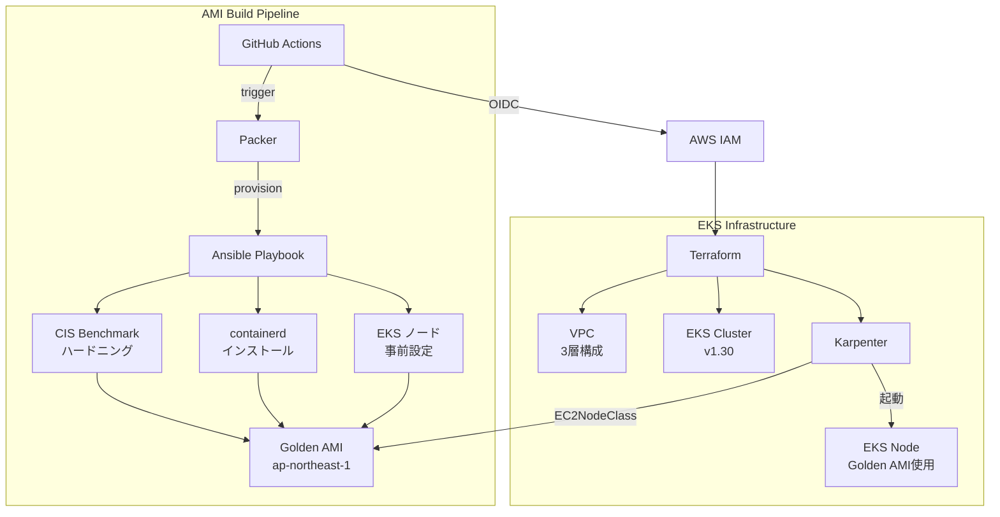

# eks-golden-node-pipeline

> Ansible + Packer で CIS Benchmark 適用済みの Golden AMI をビルドし、Karpenter × EKS に自動適用するフルパイプライン

[](https://github.com/tk-21/eks-golden-node-pipeline/actions/workflows/ami-build.yml)
[](https://github.com/tk-21/eks-golden-node-pipeline/actions/workflows/terraform.yml)

## 概要

EKS のノード管理において「どの AMI を使うか」は、セキュリティ・安定性・コスト効率に直結します。このプロジェクトは以下を一気通貫で実現します：

- **セキュリティ強化**: Ansible で CIS Benchmark Level 1 を自動適用した Golden AMI を生成
- **Immutable インフラ**: AMI は変更せず、更新は再ビルド → Karpenter のノード入れ替えで対応
- **コスト最適化**: Karpenter の Spot インスタンス活用 + arm64(Graviton) で約 40% コスト削減
- **完全自動化**: GitHub Actions (OIDC) でビルドから EKS 適用まで自動化

## アーキテクチャ



## 技術スタック

| カテゴリ | ツール | バージョン |
|---|---|---|
| IaC | Terraform | >= 1.7 |
| AMI ビルド | Packer | >= 1.10 |
| 構成管理 | Ansible | >= 2.15 |
| コンテナ基盤 | EKS + Karpenter | 1.30 / v0.37 |
| CI/CD | GitHub Actions (OIDC) | - |
| ランタイム | containerd | 1.7.x |
| アーキテクチャ | arm64 (Graviton) | - |
| リージョン | ap-northeast-1 | - |

## クイックスタート

### 前提条件

- AWS アカウントと CLI 設定済み
- Terraform, Packer, Ansible インストール済み
- GitHub リポジトリと OIDC 設定済み（[設定方法](docs/architecture.md#oidc-設定)）

### Step 1: Golden AMI ビルド

```bash
# GitHub Actions から手動トリガー
gh workflow run ami-build.yml -f eks_version=1.30

# または Packer 直接実行
cd packer
packer init golden-ami.pkr.hcl
packer build -var "eks_version=1.30" golden-ami.pkr.hcl
```

### Step 2: EKS インフラ構築

```bash
cd terraform/environments/dev

# 初期化
terraform init

# プレビュー
terraform plan

# 適用（AMI ID を指定）
terraform apply -var "golden_ami_id=ami-xxxxxxxxxx"
```

### Step 3: Karpenter マニフェスト適用

```bash
# kubeconfig 更新
aws eks update-kubeconfig --name eks-golden-node-pipeline-dev --region ap-northeast-1

# EC2NodeClass / NodePool 適用
kubectl apply -f terraform/modules/karpenter/templates/rendered-node-class.yaml
kubectl apply -f terraform/modules/karpenter/templates/rendered-node-pool.yaml

# ノードが起動することを確認
kubectl get nodes -w
```

## コスト見積もり（dev 環境）

| リソース | 単価 | 月額目安 |
|---|---|---|
| EKS Control Plane | $0.10/h | ~$73 |
| EC2 t4g.medium (Spot) | ~$0.015/h | ~$11 |
| NAT Gateway | $0.062/h | ~$45 |
| その他 (S3, CloudWatch 等) | - | ~$5 |
| **合計** | | **~$134** |

> **コスト削減 Tips**: dev 環境は夜間にノードをゼロスケール、NAT Gateway を削減用 VPC エンドポイントで代替すると月額 $30〜$50 に抑えられます。

## ディレクトリ構成

```
eks-golden-node-pipeline/
├── ansible/          # CIS Benchmark + containerd + EKS 準備ロール
├── packer/           # Golden AMI ビルドテンプレート
├── terraform/
│   ├── environments/dev/  # dev 環境エントリーポイント
│   └── modules/
│       ├── vpc/      # 3層 VPC
│       ├── eks/      # EKS + IRSA
│       └── karpenter/ # Karpenter + EC2NodeClass
├── .github/workflows/
│   ├── ami-build.yml # AMI ビルドパイプライン
│   └── terraform.yml # Terraform plan/apply
└── docs/             # アーキテクチャ / ADR
```

## セキュリティ設計

- IAM Access Key を一切使用しない（GitHub Actions OIDC のみ）
- IMDSv2 強制（EC2 メタデータサービス v2）
- EBS 暗号化（KMS デフォルトキー）
- CIS Benchmark Level 1 適用済み AMI
- Karpenter ノードの IAM ロールは最小権限

## ライセンス

MIT
