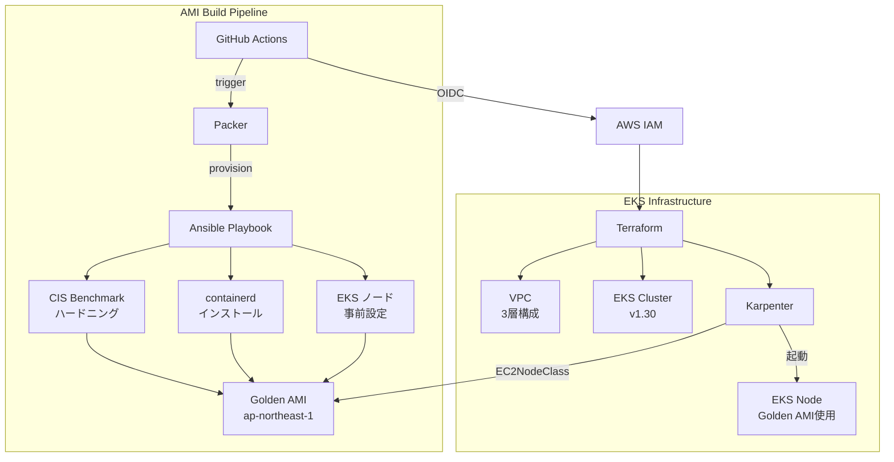

# eks-golden-node-pipeline

> Ansible + Packer で CIS Benchmark 適用済みの Golden AMI をビルドし、Karpenter × EKS に自動適用するフルパイプライン

[](https://github.com/tk-21/eks-golden-node-pipeline/actions/workflows/ami-build.yml)
[](https://github.com/tk-21/eks-golden-node-pipeline/actions/workflows/terraform.yml)

## 概要

EKS のノード管理において「どの AMI を使うか」は、セキュリティ・安定性・コスト効率に直結します。このプロジェクトは以下を一気通貫で実現します：

- **セキュリティ強化**: Ansible で CIS Benchmark Level 1 を自動適用した Golden AMI を生成
- **Immutable インフラ**: AMI は変更せず、更新は再ビルド → Karpenter のノード入れ替えで対応
- **コスト最適化**: Karpenter の Spot インスタンス活用 + arm64(Graviton) で約 40% コスト削減
- **完全自動化**: GitHub Actions (OIDC) でビルドから EKS 適用まで自動化

## アーキテクチャ



## 技術スタック

| カテゴリ | ツール | バージョン |
|---|---|---|
| IaC | Terraform | >= 1.7 |
| AMI ビルド | Packer | >= 1.10 |
| 構成管理 | Ansible | >= 2.15 |
| コンテナ基盤 | EKS + Karpenter | 1.30 / v0.37 |
| CI/CD | GitHub Actions (OIDC) | - |
| ランタイム | containerd | 1.7.x |
| アーキテクチャ | arm64 (Graviton) | - |
| リージョン | ap-northeast-1 | - |

## ハンズオン

この章では、ローカル環境からこのプロジェクトを一通り実行し、Golden AMI をビルドして EKS + Karpenter でノード起動まで確認する手順を順番に説明します。

### このハンズオンで行うこと

1. ローカル作業環境を用意する
2. Terraform のバックエンドと GitHub Actions 用 OIDC ロールを準備する
3. Golden AMI をビルドする
4. EKS / Karpenter 基盤を作る
5. EC2NodeClass / NodePool を適用する
6. テスト用 Pod を作って、Karpenter が Golden AMI ノードを起動することを確認する

### 前提条件

- AWS アカウントを持っている
- `ap-northeast-1` を利用できる
- AWS CLI の認証が済んでいる
- `terraform >= 1.7`
- `packer >= 1.10`
- `ansible >= 2.15`
- `kubectl`
- `jq`
- GitHub Actions で実行する場合は GitHub リポジトリと OIDC 設定が済んでいる

### Step 0: リポジトリを取得してツールを確認する

```bash
git clone https://github.com/tk-21/eks-golden-node-pipeline.git
cd eks-golden-node-pipeline

aws --version
terraform version
packer version
ansible --version
kubectl version --client
jq --version
```

期待する状態:

- すべてのコマンドがエラーなく表示される
- AWS CLI で対象アカウントにアクセスできる

確認用コマンド:

```bash
aws sts get-caller-identity
```

### Step 1: Terraform バックエンドを作成する

このプロジェクトは `terraform/environments/dev/versions.tf` で S3 backend を使います。先に S3 バケットと DynamoDB テーブルを用意します。

```bash
aws s3api create-bucket \
  --bucket eks-golden-node-pipeline-tfstate \
  --region ap-northeast-1 \
  --create-bucket-configuration LocationConstraint=ap-northeast-1

aws s3api put-bucket-versioning \
  --bucket eks-golden-node-pipeline-tfstate \
  --versioning-configuration Status=Enabled

aws dynamodb create-table \
  --table-name eks-golden-node-pipeline-tflock \
  --attribute-definitions AttributeName=LockID,AttributeType=S \
  --key-schema AttributeName=LockID,KeyType=HASH \
  --billing-mode PAY_PER_REQUEST \
  --region ap-northeast-1
```

確認ポイント:

- S3 バケット `eks-golden-node-pipeline-tfstate` が作成されている
- DynamoDB テーブル `eks-golden-node-pipeline-tflock` が作成されている

### Step 2: GitHub Actions 用 OIDC を準備する

GitHub Actions から AMI ビルドや Terraform を実行する場合は、OIDC プロバイダーと IAM ロールが必要です。詳細は [docs/architecture.md](docs/architecture.md) を参照してください。

最低限必要な考え方は次の通りです。

- GitHub Actions は `aws-actions/configure-aws-credentials@v4` で AssumeRole する
- 長期 Access Key は使わない
- IAM ロールの `sub` 条件は `repo:tk-21/eks-golden-node-pipeline:*` のように対象リポジトリへ絞る

### Step 3: Golden AMI をビルドする

Golden AMI のビルドは 2 通りあります。

- GitHub Actions で実行する
- ローカルから Packer を直接実行する

#### 3-1. GitHub Actions でビルドする場合

```bash
gh workflow run ami-build.yml -f eks_version=1.30
gh run list --workflow ami-build.yml
```

ワークフローが成功したら、GitHub Actions のサマリーかログから AMI ID を控えます。

#### 3-2. ローカルから Packer を直接実行する場合

```bash
cd packer
packer init golden-ami.pkr.hcl
packer validate -var "aws_region=ap-northeast-1" -var "eks_version=1.30" golden-ami.pkr.hcl
packer build -var "aws_region=ap-northeast-1" -var "eks_version=1.30" golden-ami.pkr.hcl
cd ..
```

ビルドが成功すると `packer/packer-manifest.json` が出力されます。

AMI ID の取得:

```bash
jq -r '.builds[-1].artifact_id' packer/packer-manifest.json | cut -d: -f2
```

取得例:

```text
ami-0123456789abcdef0
```

確認ポイント:

- EC2 コンソールの AMI 一覧に `golden-ami-eks-1.30-...` という名前の AMI がある
- `Architecture=arm64`
- `ManagedBy=packer`

### Step 4: Terraform で EKS 基盤を作る

`terraform/environments/dev` が dev 環境のエントリーポイントです。

```bash
cd terraform/environments/dev
terraform init
terraform validate
terraform plan -var "golden_ami_id=ami-0123456789abcdef0"
```

`plan` で問題がなければ、次に apply します。

```bash
terraform apply -var "golden_ami_id=ami-0123456789abcdef0"
```

確認ポイント:

- VPC
- EKS クラスター
- IRSA
- Karpenter Helm release
- `rendered-node-class.yaml`
- `rendered-node-pool.yaml`

補足:

- `golden_ami_id` を省略すると `golden-ami-eks-1.30-*` の最新 AMI を自動検索します
- ハンズオンでは、どの AMI を使ったかを明確にするため、AMI ID を明示指定するのがおすすめです
- GitHub Actions の `terraform.yml` は `main` への push で `terraform apply` まで実行する実装です。ローカルで試す場合は、まず手元で `plan` と `apply` を行う方が挙動を追いやすいです

出力確認:

```bash
terraform output
terraform output resolved_golden_ami_id
cd ../../..
```

### Step 5: kubeconfig を更新する

```bash
aws eks update-kubeconfig \
  --name eks-golden-node-pipeline-dev \
  --region ap-northeast-1

kubectl config current-context
kubectl get pods -A
```

確認ポイント:

- `karpenter` namespace が存在する
- `karpenter` Pod が `Running` になっている

```bash
kubectl get ns
kubectl get pods -n karpenter
```

### Step 6: EC2NodeClass / NodePool を適用する

Terraform は Karpenter 用 YAML をレンダリングしますが、現状は Kubernetes API へ自動 apply しません。ここは手動で適用します。

```bash
kubectl apply -f terraform/modules/karpenter/templates/rendered-node-class.yaml
kubectl apply -f terraform/modules/karpenter/templates/rendered-node-pool.yaml
```

適用結果の確認:

```bash
kubectl get ec2nodeclass
kubectl get nodepool
kubectl describe ec2nodeclass golden-ami-node-class
kubectl describe nodepool golden-ami-node-pool
```

確認ポイント:

- `golden-ami-node-class` が作成されている
- `golden-ami-node-pool` が作成されている
- `amiSelectorTerms` に Golden AMI の ID が入っている

### Step 7: テスト用 Pod でノード起動を確認する

まだ Pod を載せる需要がなければ、Karpenter はノードを起動しません。動作確認用に軽い Deployment を作ります。

```bash
kubectl create deployment inflate --image=public.ecr.aws/eks-distro/kubernetes/pause:3.2 --replicas=0
kubectl scale deployment inflate --replicas=3
kubectl get pods -w
```

別ターミナル、または続けて以下を実行します。

```bash
kubectl get nodeclaims
kubectl get nodes -w
```

確認ポイント:

- Karpenter が NodeClaim を作る
- 新しい EC2 ノードが EKS に参加する
- Pod が `Pending` から `Running` になる

### Step 8: 起動したノードが Golden AMI 由来か確認する

まず Kubernetes 側でノードを確認します。

```bash
kubectl get nodes -o wide
kubectl describe node | grep -E "node.kubernetes.io/lifecycle|beta.kubernetes.io/arch|kubernetes.io/arch"
```

次に、EC2 インスタンスと AMI ID を AWS 側で確認します。

```bash
aws ec2 describe-instances \
  --region ap-northeast-1 \
  --filters "Name=tag:karpenter.sh/discovery,Values=eks-golden-node-pipeline-dev" \
  --query 'Reservations[].Instances[].{InstanceId:InstanceId,ImageId:ImageId,State:State.Name,PrivateIp:PrivateIpAddress}' \
  --output table
```

比較ポイント:

- `ImageId` が `terraform output resolved_golden_ami_id` の値と一致する
- ノードが `arm64` で起動している
- Spot または on-demand のいずれかで起動している

### Step 9: 後片付け

テスト Pod を削除:

```bash
kubectl delete deployment inflate
```

NodePool / EC2NodeClass を削除:

```bash
kubectl delete -f terraform/modules/karpenter/templates/rendered-node-pool.yaml
kubectl delete -f terraform/modules/karpenter/templates/rendered-node-class.yaml
```

Terraform リソースを削除する場合:

```bash
cd terraform/environments/dev
terraform destroy -var "golden_ami_id=ami-0123456789abcdef0"
cd ../../..
```

AMI を削除する場合:

```bash
aws ec2 deregister-image --image-id ami-0123456789abcdef0 --region ap-northeast-1
```

不要スナップショットが残る場合は、関連 EBS snapshot の削除も忘れずに行ってください。

## クイックスタート

急いで全体を試したい場合の最短手順です。

```bash
# 1. Golden AMI をビルド
cd packer
packer init golden-ami.pkr.hcl
packer build -var "eks_version=1.30" golden-ami.pkr.hcl
cd ..

# 2. AMI ID を取得
AMI_ID=$(jq -r '.builds[-1].artifact_id' packer/packer-manifest.json | cut -d: -f2)
echo "${AMI_ID}"

# 3. Terraform 実行
cd terraform/environments/dev
terraform init
terraform apply -var "golden_ami_id=${AMI_ID}"
cd ../../..

# 4. kubeconfig 更新
aws eks update-kubeconfig --name eks-golden-node-pipeline-dev --region ap-northeast-1

# 5. Karpenter マニフェスト適用
kubectl apply -f terraform/modules/karpenter/templates/rendered-node-class.yaml
kubectl apply -f terraform/modules/karpenter/templates/rendered-node-pool.yaml
```

## コスト見積もり（dev 環境）

| リソース | 単価 | 月額目安 |
|---|---|---|
| EKS Control Plane | $0.10/h | ~$73 |
| EC2 t4g.medium (Spot) | ~$0.015/h | ~$11 |
| NAT Gateway | $0.062/h | ~$45 |
| その他 (S3, CloudWatch 等) | - | ~$5 |
| **合計** | | **~$134** |

> **コスト削減 Tips**: dev 環境は夜間にノードをゼロスケール、NAT Gateway を削減用 VPC エンドポイントで代替すると月額 $30〜$50 に抑えられます。

## ディレクトリ構成

```
eks-golden-node-pipeline/
├── ansible/          # CIS Benchmark + containerd + EKS 準備ロール
├── packer/           # Golden AMI ビルドテンプレート
├── terraform/
│   ├── environments/dev/  # dev 環境エントリーポイント
│   └── modules/
│       ├── vpc/      # 3層 VPC
│       ├── eks/      # EKS + IRSA
│       └── karpenter/ # Karpenter + EC2NodeClass
├── .github/workflows/
│   ├── ami-build.yml # AMI ビルドパイプライン
│   └── terraform.yml # Terraform plan/apply
└── docs/             # アーキテクチャ / ADR
```

## セキュリティ設計

- IAM Access Key を一切使用しない（GitHub Actions OIDC のみ）
- IMDSv2 強制（EC2 メタデータサービス v2）
- EBS 暗号化（KMS デフォルトキー）
- CIS Benchmark Level 1 適用済み AMI
- Karpenter ノードの IAM ロールは最小権限

## ライセンス

MIT
