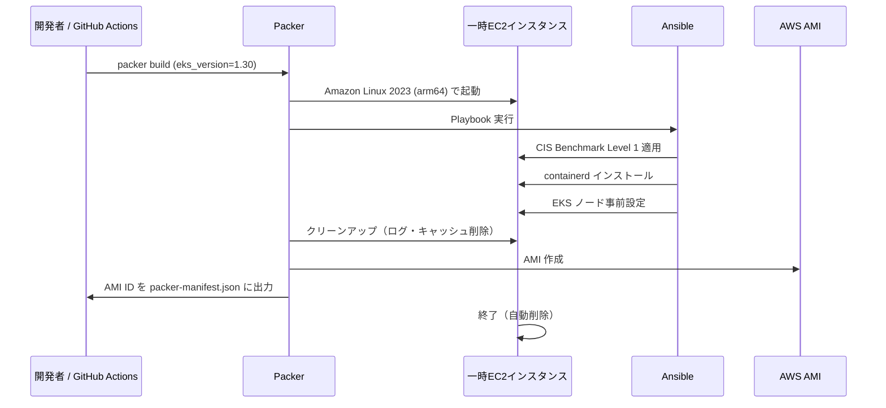
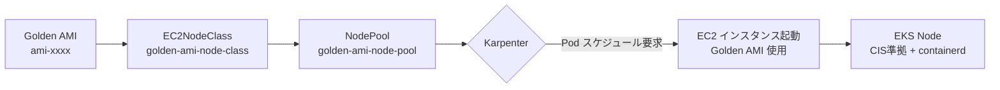

# アーキテクチャドキュメント

## Golden AMI ビルドフロー



## EKS × Karpenter × Golden AMI の関係



## OIDC 設定

GitHub Actions が AWS にアクセスするための OIDC 設定手順。

### IAM Identity Provider 作成

```bash
# OIDC プロバイダーを作成
aws iam create-open-id-connect-provider \
  --url https://token.actions.githubusercontent.com \
  --client-id-list sts.amazonaws.com \
  --thumbprint-list 6938fd4d98bab03faadb97b34396831e3780aea1
```

### GitHub Actions 用 IAM ロール

Terraform で以下のリソースを作成する（`terraform/environments/dev/` に追加）：

```hcl
resource "aws_iam_role" "github_actions" {
  name = "eks-golden-node-pipeline-github-actions-role"

  assume_role_policy = jsonencode({
    Version = "2012-10-17"
    Statement = [{
      Effect = "Allow"
      Principal = {
        Federated = "arn:aws:iam::${data.aws_caller_identity.current.account_id}:oidc-provider/token.actions.githubusercontent.com"
      }
      Action = "sts:AssumeRoleWithWebIdentity"
      Condition = {
        StringEquals = {
          "token.actions.githubusercontent.com:aud" = "sts.amazonaws.com"
        }
        StringLike = {
          # リポジトリを限定（セキュリティ上重要）
          "token.actions.githubusercontent.com:sub" = "repo:tk-21/eks-golden-node-pipeline:*"
        }
      }
    }]
  })
}
```

## Terraform S3 バックエンドのセットアップ

```bash
# S3 バケット作成（バージョニング有効・暗号化有効）
aws s3api create-bucket \
  --bucket eks-golden-node-pipeline-tfstate \
  --region ap-northeast-1 \
  --create-bucket-configuration LocationConstraint=ap-northeast-1

aws s3api put-bucket-versioning \
  --bucket eks-golden-node-pipeline-tfstate \
  --versioning-configuration Status=Enabled

# DynamoDB テーブル作成（ステートロック用）
aws dynamodb create-table \
  --table-name eks-golden-node-pipeline-tflock \
  --attribute-definitions AttributeName=LockID,AttributeType=S \
  --key-schema AttributeName=LockID,KeyType=HASH \
  --billing-mode PAY_PER_REQUEST \
  --region ap-northeast-1
```
