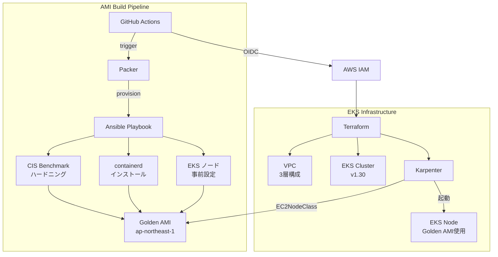
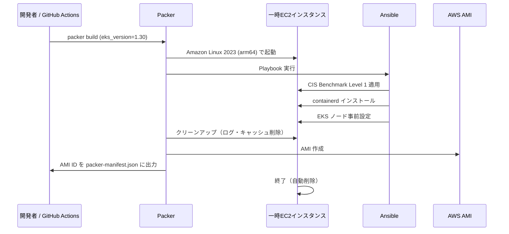
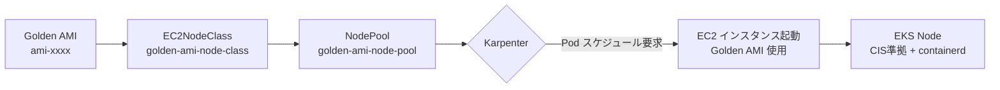

# ✅Phase 6: README / アーキテクチャドキュメント / ADR / Zenn 記事草稿

## 前フェーズの要約

Phase 1: ディレクトリ骨格・ベース設定ファイル
Phase 2: Ansible 3ロール（cis-benchmark / docker-runtime / eks-node-prep）
Phase 3: Packer Golden AMI テンプレート + GitHub Actions パイプライン
Phase 4: Terraform VPC / EKS モジュール
Phase 5: Karpenter モジュール + Golden AMI EC2NodeClass / NodePool

## このフェーズの目的

GitHub 公開・ポートフォリオ・Zenn 投稿に向けたドキュメントを整備する。
- README.md（構成説明・クイックスタート・コスト情報）
- docs/architecture.md（Mermaid アーキテクチャ図）
- docs/adr/ (Architecture Decision Record 2本)
- docs/zenn-article-draft.md（Zenn 投稿用記事草稿）

---

## タスク一覧

### 1. README.md

**ファイル: `README.md`**

```markdown
# eks-golden-node-pipeline

> Ansible + Packer で CIS Benchmark 適用済みの Golden AMI をビルドし、Karpenter × EKS に自動適用するフルパイプライン

[](https://github.com/YOUR_GITHUB_USERNAME/eks-golden-node-pipeline/actions/workflows/ami-build.yml)
[](https://github.com/YOUR_GITHUB_USERNAME/eks-golden-node-pipeline/actions/workflows/terraform.yml)

## 概要

EKS のノード管理において「どの AMI を使うか」は、セキュリティ・安定性・コスト効率に直結します。このプロジェクトは以下を一気通貫で実現します：

- **セキュリティ強化**: Ansible で CIS Benchmark Level 1 を自動適用した Golden AMI を生成
- **Immutable インフラ**: AMI は変更せず、更新は再ビルド → Karpenter のノード入れ替えで対応
- **コスト最適化**: Karpenter の Spot インスタンス活用 + arm64(Graviton) で約 40% コスト削減
- **完全自動化**: GitHub Actions (OIDC) でビルドから EKS 適用まで自動化

## アーキテクチャ



## 技術スタック

| カテゴリ | ツール | バージョン |
|---|---|---|
| IaC | Terraform | >= 1.7 |
| AMI ビルド | Packer | >= 1.10 |
| 構成管理 | Ansible | >= 2.15 |
| コンテナ基盤 | EKS + Karpenter | 1.30 / v0.37 |
| CI/CD | GitHub Actions (OIDC) | - |
| ランタイム | containerd | 1.7.x |
| アーキテクチャ | arm64 (Graviton) | - |
| リージョン | ap-northeast-1 | - |

## クイックスタート

### 前提条件

- AWS アカウントと CLI 設定済み
- Terraform, Packer, Ansible インストール済み
- GitHub リポジトリと OIDC 設定済み（[設定方法](docs/architecture.md#oidc-設定)）

### Step 1: Golden AMI ビルド

```bash
# GitHub Actions から手動トリガー
gh workflow run ami-build.yml -f eks_version=1.30

# または Packer 直接実行
cd packer
packer init golden-ami.pkr.hcl
packer build -var "eks_version=1.30" golden-ami.pkr.hcl
```

### Step 2: EKS インフラ構築

```bash
cd terraform/environments/dev

# 初期化
terraform init

# プレビュー
terraform plan

# 適用（AMI ID を指定）
terraform apply -var "golden_ami_id=ami-xxxxxxxxxx"
```

### Step 3: Karpenter マニフェスト適用

```bash
# kubeconfig 更新
aws eks update-kubeconfig --name eks-golden-node-pipeline-dev --region ap-northeast-1

# EC2NodeClass / NodePool 適用
kubectl apply -f terraform/modules/karpenter/templates/rendered-node-class.yaml
kubectl apply -f terraform/modules/karpenter/templates/rendered-node-pool.yaml

# ノードが起動することを確認
kubectl get nodes -w
```

## コスト見積もり（dev 環境）

| リソース | 単価 | 月額目安 |
|---|---|---|
| EKS Control Plane | $0.10/h | ~$73 |
| EC2 t4g.medium (Spot) | ~$0.015/h | ~$11 |
| NAT Gateway | $0.062/h | ~$45 |
| その他 (S3, CloudWatch 等) | - | ~$5 |
| **合計** | | **~$134** |

> **コスト削減 Tips**: dev 環境は夜間にノードをゼロスケール、NAT Gateway を削減用VPCエンドポイントで代替すると月額 $30〜$50 に抑えられます。

## ディレクトリ構成

```
eks-golden-node-pipeline/
├── ansible/          # CIS Benchmark + containerd + EKS 準備ロール
├── packer/           # Golden AMI ビルドテンプレート
├── terraform/
│   ├── environments/dev/  # dev 環境エントリーポイント
│   └── modules/
│       ├── vpc/      # 3層 VPC
│       ├── eks/      # EKS + IRSA
│       └── karpenter/ # Karpenter + EC2NodeClass
├── .github/workflows/
│   ├── ami-build.yml # AMI ビルドパイプライン
│   └── terraform.yml # Terraform plan/apply
└── docs/             # アーキテクチャ / ADR
```

## セキュリティ設計

- IAM Access Key を一切使用しない（GitHub Actions OIDC のみ）
- IMDSv2 強制（EC2 メタデータサービス v2）
- EBS 暗号化（KMS デフォルトキー）
- CIS Benchmark Level 1 適用済み AMI
- Karpenter ノードの IAM ロールは最小権限

## ライセンス

MIT
```

---

### 2. アーキテクチャドキュメント

**ファイル: `docs/architecture.md`**

```markdown
# アーキテクチャドキュメント

## Golden AMI ビルドフロー



## EKS × Karpenter × Golden AMI の関係



## OIDC 設定

GitHub Actions が AWS にアクセスするための OIDC 設定手順。

### IAM Identity Provider 作成

```bash
# OIDC プロバイダーを作成
aws iam create-open-id-connect-provider \
  --url https://token.actions.githubusercontent.com \
  --client-id-list sts.amazonaws.com \
  --thumbprint-list 6938fd4d98bab03faadb97b34396831e3780aea1
```

### GitHub Actions 用 IAM ロール

Terraform で以下のリソースを作成する（`terraform/environments/dev/` に追加）：

```hcl
resource "aws_iam_role" "github_actions" {
  name = "eks-golden-node-pipeline-github-actions-role"

  assume_role_policy = jsonencode({
    Version = "2012-10-17"
    Statement = [{
      Effect = "Allow"
      Principal = {
        Federated = "arn:aws:iam::${data.aws_caller_identity.current.account_id}:oidc-provider/token.actions.githubusercontent.com"
      }
      Action = "sts:AssumeRoleWithWebIdentity"
      Condition = {
        StringEquals = {
          "token.actions.githubusercontent.com:aud" = "sts.amazonaws.com"
        }
        StringLike = {
          # リポジトリを限定（セキュリティ上重要）
          "token.actions.githubusercontent.com:sub" = "repo:YOUR_GITHUB_USERNAME/eks-golden-node-pipeline:*"
        }
      }
    }]
  })
}
```

## Terraform S3 バックエンドのセットアップ

```bash
# S3 バケット作成（バージョニング有効・暗号化有効）
aws s3api create-bucket \
  --bucket eks-golden-node-pipeline-tfstate \
  --region ap-northeast-1 \
  --create-bucket-configuration LocationConstraint=ap-northeast-1

aws s3api put-bucket-versioning \
  --bucket eks-golden-node-pipeline-tfstate \
  --versioning-configuration Status=Enabled

# DynamoDB テーブル作成（ステートロック用）
aws dynamodb create-table \
  --table-name eks-golden-node-pipeline-tflock \
  --attribute-definitions AttributeName=LockID,AttributeType=S \
  --key-schema AttributeName=LockID,KeyType=HASH \
  --billing-mode PAY_PER_REQUEST \
  --region ap-northeast-1
```
```

---

### 3. ADR（Architecture Decision Record）

**ファイル: `docs/adr/001-golden-ami-strategy.md`**

```markdown
# ADR 001: Golden AMI 戦略

## ステータス

承認済み

## コンテキスト

EKS ノードの AMI 管理方法として以下の選択肢がある：

1. **EKS 最適化 AMI（AWS公式）をそのまま使用**
2. **Golden AMI を自前でビルド**
3. **Bottlerocket OS を使用**

## 決定

Golden AMI を Ansible + Packer で自前ビルドする（選択肢 2）。

## 理由

- **セキュリティ要件**: CIS Benchmark Level 1 を全ノードに強制適用したい
- **冪等性**: Ansible ロールにより、AMI の内容を宣言的に管理できる
- **監査**: どのソフトウェアがインストールされているかコードで追跡可能
- **ポートフォリオ差別化**: Ansible × Packer × Karpenter の統合は事例が少なく高付加価値

## トレードオフ

- AMI ビルドのパイプライン運用コストが発生する
- EKS バージョンアップ時に AMI 再ビルドが必要

## 代替案の却下理由

- **Bottlerocket**: カスタマイズの自由度が低く、Ansible で設定を管理できない
- **AWS公式AMIそのまま**: CIS Benchmark 非準拠、セキュリティ設定の追跡が困難
```

**ファイル: `docs/adr/002-karpenter-vs-managed-nodegroup.md`**

```markdown
# ADR 002: Karpenter vs Managed Node Group

## ステータス

承認済み

## コンテキスト

EKS のノードプロビジョニング方式として以下がある：

1. **Managed Node Group**
2. **Karpenter**
3. **Self-managed Node Group**

## 決定

Karpenter を採用する（選択肢 2）。

## 理由

- **Golden AMI との統合**: EC2NodeClass で AMI ID を直接指定できる
- **Spot 対応**: binpacking による効率的なスポットインスタンス活用
- **コスト削減**: Graviton(arm64) + Spot で Managed Node Group 比 最大 60% 削減
- **柔軟性**: CPU/メモリ要件に応じたインスタンスタイプの動的選択

## トレードオフ

- Karpenter 自体の運用が必要（Helm 管理）
- Managed Node Group より学習コストが高い

## 決定後の設計

- `expireAfter: 168h` でノードを 7 日ごとに入れ替え（最新 Golden AMI 適用を強制）
- `consolidationPolicy: WhenUnderutilized` でコスト最適化
```

---

### 4. Zenn 記事草稿

**ファイル: `docs/zenn-article-draft.md`**

```markdown
---
title: "Ansible × Packer × Karpenter で EKS の Golden AMI パイプラインを構築した"
emoji: "🛡️"
type: "tech"
topics: ["AWS", "EKS", "Ansible", "Terraform", "Karpenter"]
published: false
---

## はじめに

EKS のノード管理で「セキュリティ強化済みの AMI を全ノードに強制したい」という要件に直面したことはないでしょうか。

この記事では **Ansible + Packer で CIS Benchmark 適用済みの Golden AMI をビルドし、Karpenter EC2NodeClass に自動適用する**パイプラインを解説します。

GitHub リポジトリ: [eks-golden-node-pipeline](https://github.com/YOUR_GITHUB_USERNAME/eks-golden-node-pipeline)

## アーキテクチャ全体像

```
Ansible Playbook（CIS Benchmark + containerd + EKS準備）
    ↓
Packer → Golden AMI（ap-northeast-1）
    ↓
Terraform → EKS + Karpenter
    ↓
EC2NodeClass（AMI ID 直接指定）→ EKS Node 起動
```

## 1. Ansible でハードニングを自動化

### CIS Benchmark Level 1 の主要設定

CIS Benchmark は「安全なシステム設定のベストプラクティス集」です。主な適用内容：

- 不要なファイルシステムモジュールを無効化（cramfs, udf など）
- SSH ハードニング（root ログイン禁止、強い暗号のみ許可）
- カーネルパラメータの最適化（SYN Cookie、IPスプーフィング対策）
- auditd による特権操作の監査

```yaml
# CIS Benchmark: sysctl 設定例
- name: SYN Cookie 有効化（SYNフラッド対策）
  ansible.posix.sysctl:
    name: net.ipv4.tcp_syncookies
    value: "1"
    sysctl_set: true
```

### EKS ノードに特有の設定

EKS では CIS Benchmark の一部設定が Kubernetes の動作と競合します。例えば `net.ipv4.ip_forward` は EKS ノードで **必ず有効**にする必要があります。

```yaml
# EKSノードに必要なIPフォワード（CIS Benchmarkの例外設定）
- { key: "net.ipv4.ip_forward", value: "1" }
```

## 2. Packer で AMI をビルド

### Immutable AMI 原則

AMI は「一度ビルドしたら変更しない」が原則です。設定変更時は AMI を再ビルドし、Karpenter がノードを順次入れ替えます。

```hcl
# AMI名にタイムスタンプを含めることで、どのビルドかを追跡可能
locals {
  ami_name = "golden-ami-eks-${var.eks_version}-${formatdate("YYYYMMDD-hhmmss", timestamp())}"
}
```

### Data Source で最新ベース AMI を動的取得

```hcl
data "amazon-ami" "amazon_linux_2023" {
  filters = {
    name = "al2023-ami-2023.*-kernel-*-arm64"
  }
  most_recent = true
  owners      = ["137112412989"]  # Amazon公式
}
```

## 3. Karpenter で Golden AMI を強制適用

### EC2NodeClass: AMI ID の直接指定

`latest` タグや名前フィルタによる暗黙的な AMI 参照は禁止し、AMI ID を明示的に指定します。

```yaml
spec:
  amiSelectorTerms:
    - id: "ami-xxxxxxxxxx"  # Packer でビルドした Golden AMI ID
```

### NodePool: 7 日ごとにノードを入れ替え

`expireAfter: 168h` を設定することで、Karpenter が 7 日後に古いノードを安全に入れ替えます。これにより最新の Golden AMI が自動的に全ノードに適用されます。

```yaml
spec:
  template:
    spec:
      expireAfter: 168h  # 7日でノード入れ替え → 最新Golden AMI強制適用
```

## 4. GitHub Actions (OIDC) で全自動化

IAM Access Key を一切使わず、OIDC で一時クレデンシャルを取得します。

```yaml
- name: AWS OIDC 認証
  uses: aws-actions/configure-aws-credentials@v4
  with:
    role-to-assume: arn:aws:iam::${{ secrets.AWS_ACCOUNT_ID }}:role/github-actions-role
    aws-region: ap-northeast-1
```

## まとめ

| 課題 | 解決策 |
|---|---|
| EKS ノードのセキュリティ強化 | Ansible CIS Benchmark ロール |
| 設定の冪等性・追跡可能性 | Packer + Git管理 |
| 全ノードへの AMI 強制適用 | Karpenter EC2NodeClass + expireAfter |
| CI/CD のセキュリティ | GitHub Actions OIDC |

コード全体は GitHub で公開しています：
https://github.com/YOUR_GITHUB_USERNAME/eks-golden-node-pipeline
```

---

## 完了条件

- [ ] `README.md` が存在し、アーキテクチャ図・クイックスタート・コスト情報を含む
- [ ] `docs/architecture.md` が存在し、Mermaid 図・OIDC 設定・バックエンドセットアップを含む
- [ ] `docs/adr/001-golden-ami-strategy.md` が存在する
- [ ] `docs/adr/002-karpenter-vs-managed-nodegroup.md` が存在する
- [ ] `docs/zenn-article-draft.md` が存在する
- [ ] 全ファイルの `YOUR_GITHUB_USERNAME` を実際のユーザー名に置換する（ユーザーに確認）

## プロジェクト完成チェックリスト

全フェーズ完了後、GitHub 公開前に確認する：

- [ ] `find . -name "*.tf" | xargs terraform fmt` でフォーマット統一
- [ ] `.gitignore` に機密ファイルが含まれている
- [ ] `README.md` の YOUR_GITHUB_USERNAME が置換されている
- [ ] `packer validate` が通過する
- [ ] `ansible-playbook --syntax-check` が通過する
- [ ] GitHub Secrets に以下が設定されている:
  - `AWS_ACCOUNT_ID`
  - `CHATWORK_API_TOKEN`
  - `CHATWORK_ROOM_ID`
```