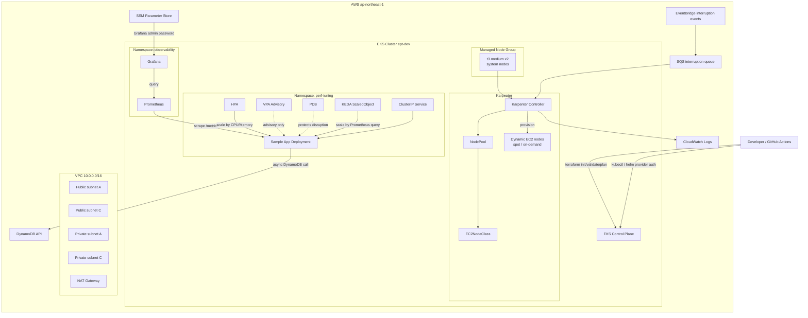
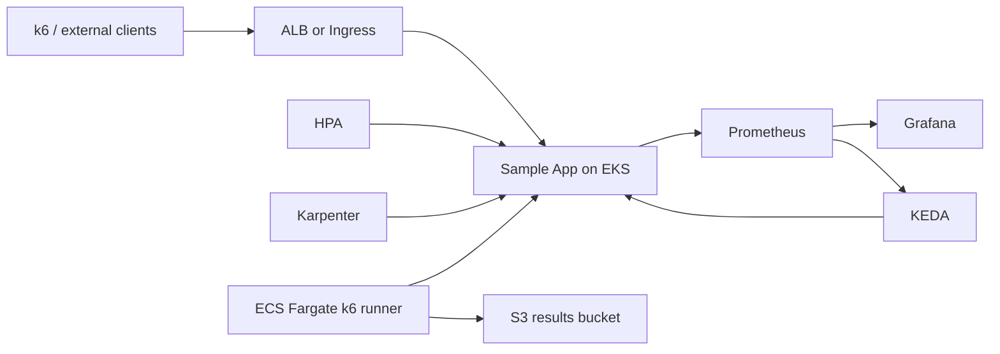
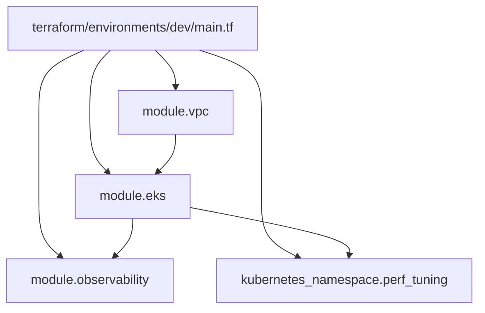
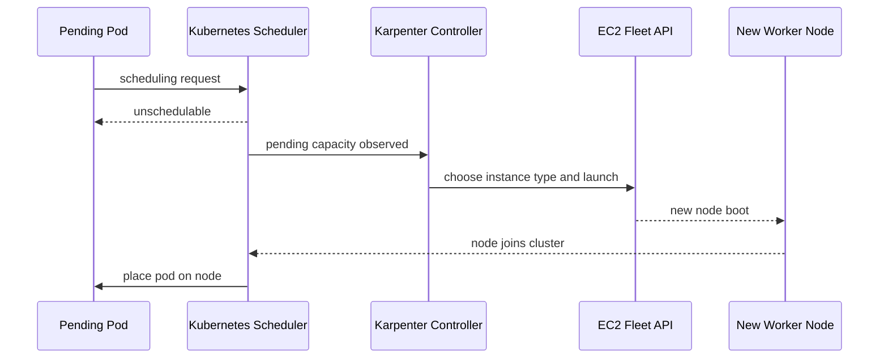
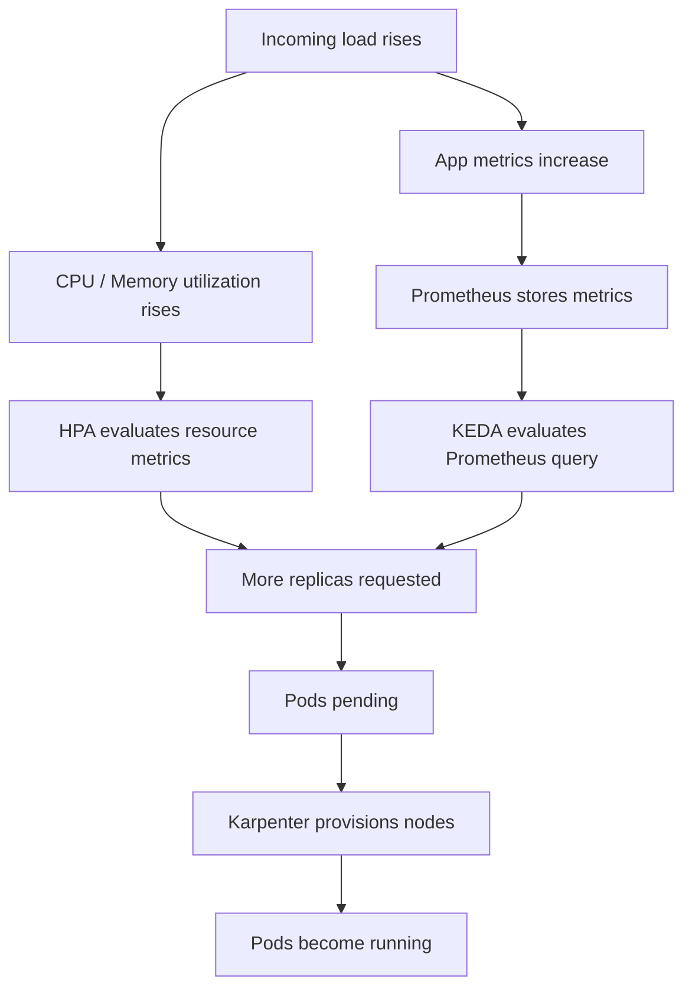
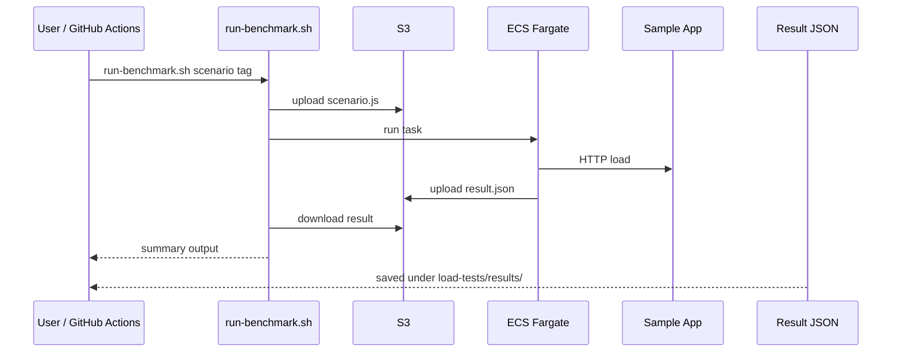

# EKS Performance Tuning Lab Architecture

このドキュメントは、このリポジトリを「何を検証するプロジェクトなのか」「どこまで実装されているのか」「各コンポーネントがどう連携するのか」という観点で、コードベース全体を読み解いた完全理解ガイドです。

## 1. このプロジェクトの要点

このプロジェクトは、Amazon EKS 上で意図的にボトルネックを持つアプリを動かし、可観測性、負荷試験、自動スケーリング、コード改善を通してパフォーマンス改善を定量的に示すための検証ラボです。

狙いは単なる EKS 構築ではなく、次の流れを再現することです。

1. Terraform で EKS と観測基盤を作る
2. FastAPI サンプルアプリに CPU・メモリ・I/O のボトルネックを仕込む
3. k6 で負荷をかける
4. Prometheus / Grafana で劣化要因を特定する
5. HPA / KEDA / Karpenter / アプリ改善で性能を上げる
6. Before / After を数値で比較する

## 2. 先に結論: 現在の実装状態

このリポジトリには「完成像」と「現在のコード」が混在しています。理解の起点として、まず現在地を整理します。

| 領域 | 状態 | 補足 |
|---|---|---|
| EKS クラスター基盤 | 実装済み | VPC、EKS、system node group、IRSA、Karpenter Helm あり |
| 観測基盤 | 実装済み | kube-prometheus-stack、Grafana、KEDA Helm あり |
| サンプルアプリ | 実装済み | FastAPI と Prometheus メトリクスあり |
| Kubernetes マニフェスト | 実装済み | Deployment、Service、PDB、HPA、VPA、KEDA、Karpenter NodePool 定義あり |
| 負荷試験スクリプト | 実装済み | k6 シナリオ 3 本あり |
| ECS/Fargate 負荷試験モジュール | 実装済み | `terraform/modules/load-test` に存在 |
| `dev` 環境への load-test 統合 | 未接続 | `terraform/environments/dev/main.tf` からは呼ばれていない |
| 外部公開入口(ALB/Ingress) | 未実装 | README では登場するが Terraform / k8s 上に Ingress 定義はない |
| README の完成像表現 | 一部先行 | 実装より理想構成が先に書かれている箇所あり |

つまりこのプロジェクトは、コアとなる「EKS + 観測 + スケーリング + アプリ + ベンチマーク部品」は揃っており、外部公開や環境統合の最終接着が残っている状態です。

## 3. 全体像

### 3.1 実装ベースの全体図



### 3.2 理想構成込みの完成イメージ

README や `phase*.md` では、次のような最終形が想定されています。



このうち、`ALB/Ingress` と `dev` 環境からの `load-test` モジュール呼び出しは、現時点ではコード上でまだ接続されていません。

## 4. リポジトリの読み方

| パス | 役割 |
|---|---|
| `terraform/environments/dev/` | 実際にデプロイする環境の入口 |
| `terraform/modules/eks/` | EKS クラスター、managed node group、IRSA、Karpenter |
| `terraform/modules/observability/` | Prometheus、Grafana、KEDA |
| `terraform/modules/load-test/` | ECS Fargate ベースの k6 実行基盤 |
| `k8s/sample-app/` | サンプルアプリ本体のデプロイ設定 |
| `k8s/hpa/`, `k8s/vpa/`, `k8s/keda/` | Pod スケーリング関連 |
| `k8s/karpenter/` | Karpenter のクラスタ内カスタムリソース |
| `load-tests/scenarios/` | k6 ベンチマークシナリオ |
| `scripts/` | ベンチマーク実行と比較レポート生成 |
| `docs/` | ADR、PromQL、結果記録、記事素材 |

## 5. Terraform アーキテクチャ

### 5.1 `terraform/environments/dev` が組み立てるもの

`terraform/environments/dev/main.tf` は、この環境のオーケストレーターです。ここで次の 3 層を組み立てています。

1. VPC
2. EKS モジュール
3. Observability モジュール

`perf-tuning` namespace もここで作成されます。



### 5.2 VPC 設計

VPC は `terraform-aws-modules/vpc/aws` を利用しています。

- CIDR: `10.0.0.0/16`
- AZ: `ap-northeast-1a`, `ap-northeast-1c`
- Private Subnet: `10.0.1.0/24`, `10.0.2.0/24`
- Public Subnet: `10.0.101.0/24`, `10.0.102.0/24`
- NAT Gateway: 1 台のみ

設計意図:

- ワーカーノードは private subnet に置く
- NAT はコスト抑制のため single 構成
- public subnet に `kubernetes.io/role/elb=1`
- private subnet に `kubernetes.io/role/internal-elb=1`
- private subnet に `karpenter.sh/discovery=<cluster_name>`

このタグにより、将来的な LoadBalancer / Karpenter の自動発見を成立させています。

### 5.3 EKS モジュール

`terraform/modules/eks/` は、クラスターのコントロールプレーンとノード周辺を担当します。

#### 主要リソース

- `aws_eks_cluster.this`
- `aws_eks_node_group.system`
- `aws_iam_openid_connect_provider.this`
- EKS addons
  - `vpc-cni`
  - `coredns`
  - `kube-proxy`
  - `aws-ebs-csi-driver`

#### 設計意図

- EKS 自体は AWS ネイティブリソースを直接記述している
- system node group は固定 2 台
- アプリ本番負荷に応じた追加ノードは Karpenter が担当
- OIDC provider を作り、IRSA を使える状態にする

### 5.4 Karpenter 設計

`terraform/modules/eks/karpenter.tf` は、このプロジェクトの重要ポイントです。

#### Karpenter が担う責務

- 追加ワーカーノードの自動調達
- Spot interruption の検知
- ノード整理によるコスト最適化

#### 構成要素

- Karpenter 用 node role
- Karpenter controller 用 IRSA role
- interruption 用 SQS queue
- EventBridge rule から SQS への通知
- Helm による Karpenter デプロイ

#### スケールの流れ



#### クラスタ内設定ファイル

`k8s/karpenter/nodepool.yaml` と `k8s/karpenter/ec2nodeclass.yaml` は、Terraform がインストールした Karpenter に対して、どんなノードを作るかを宣言するレイヤーです。

- capacity type: `spot`, `on-demand`
- instance types: `t3.medium`, `t3.large`, `t3a.medium`, `t3a.large`
- cluster limits: CPU 20, Memory 40Gi
- consolidation: `WhenUnderutilized`

重要なのは、Terraform が「Karpenter のコントローラを入れる」、YAML が「そのコントローラにどんなノードを作らせるか決める」という二段構えになっている点です。

## 6. 観測基盤アーキテクチャ

### 6.1 observability モジュール

`terraform/modules/observability/` は Helm ベースのモジュールです。

- `kube-prometheus-stack`
- `keda`
- Grafana 管理者パスワード用 SSM Parameter

### 6.2 Grafana 認証情報の扱い

Grafana のパスワードは Terraform で乱数生成し、SSM Parameter Store に `SecureString` として保存します。

流れ:

1. `random_password.grafana` で生成
2. `aws_ssm_parameter.grafana_password` に保存
3. `data.aws_ssm_parameter.grafana_password` で再読込
4. Helm `set_sensitive` で Grafana に注入

このため、パスワードをリポジトリにベタ書きせずに済みます。

### 6.3 Prometheus の収集対象

`values/prometheus-stack.yaml` から読み取れる監視設計は次のとおりです。

- retention: 7d がデフォルト、環境側から 15d 指定あり
- Prometheus PVC: 10Gi
- Alertmanager: 無効
- Node Exporter: 有効
- kube-state-metrics: 有効
- sample-app 向け `additionalServiceMonitors` あり

Prometheus は `perf-tuning` namespace の `app=sample-app` を持つ Service を探し、`metrics` ポートの `/metrics` を 15 秒おきに scrape します。

### 6.4 観測データフロー

```mermaid
graph LR
    APP[FastAPI sample-app]
    METRICS[/metrics]
    SVC[Service port: metrics]
    SM[ServiceMonitor]
    PROM[Prometheus]
    GRAF[Grafana dashboards]
    HPA[HPA metrics]
    KEDA[KEDA Prometheus trigger]

    APP --> METRICS
    METRICS --> SVC
    SVC --> SM
    SM --> PROM
    PROM --> GRAF
    PROM --> KEDA
```

## 7. サンプルアプリの設計

### 7.1 役割

`k8s/sample-app/app.py` の FastAPI アプリは、実サービスではなく「性能問題を観測しやすい実験対象」です。

### 7.2 エンドポイントごとの性質

| エンドポイント | 性質 | 何を再現するか |
|---|---|---|
| `/health` | 軽量 | Probe 用 |
| `/cpu-intensive` | CPU bound | CPU throttling の影響 |
| `/memory-pressure` | Memory pressure | メモリ増加と OOM リスク |
| `/db-latency` | I/O bound | 外部 API / DB 待ちの影響 |
| `/metrics` | 観測 | Prometheus scrape 用 |

### 7.3 ボトルネック実装

#### CPU

`_fib(35)` を再帰で計算するため、CPU を消費しやすいです。

#### Memory

`_memory_cache` に 1MB の文字列を積み増し続けるため、リクエストに応じてメモリ使用量が増えます。

#### I/O

`/db-latency` は `aioboto3` で DynamoDB クライアントを使います。AWS 呼び出しに失敗した場合も `asyncio.sleep(0.1)` で待ち時間を再現するため、ローカルや未接続環境でも I/O 遅延っぽい挙動を持ちます。

### 7.4 アプリ内メトリクス

アプリは独自に Prometheus メトリクスを出しています。

- `http_requests_total`
- `http_request_duration_seconds`
- `memory_cache_size_bytes`

`MetricsMiddleware` によって全リクエストの件数と時間が計測されるため、Grafana / KEDA の判断材料になります。

## 8. Kubernetes ワークロード設計

### 8.1 Deployment

`k8s/sample-app/deployment.yaml` から見える現在の設定:

- replicas: 1
- requests: CPU `500m`, Memory `256Mi`
- limits: CPU `2`, Memory `512Mi`
- readiness/liveness probe あり
- podAntiAffinity あり

ここで注意点が 2 つあります。

1. README や `docs/tuning-results.md` には「250m / 500m」など別の記録もある
2. Deployment では replicas=1 のままだが、HPA / KEDA マニフェスト側は minReplica=2 を想定している

つまり、Kubernetes YAML 群は「適用される組み合わせ」によって実際の状態が変わる設計です。

### 8.2 Service

`k8s/sample-app/service.yaml` は `ClusterIP` です。

- `http` port: 80 -> 8080
- `metrics` port: 9090 -> 8080

Prometheus の ServiceMonitor はこの `metrics` ポート名を利用します。

一方で、外部から直接アクセスするための Ingress / ALB Service はまだありません。README の ALB 図は構想レベルとして読むのが正確です。

### 8.3 PDB

`k8s/sample-app/pdb.yaml`:

- `minAvailable: 1`

Karpenter のノード整理や drain が起きても、最低 1 Pod は維持したいという可用性ポリシーです。

### 8.4 HPA

`k8s/hpa/sample-app-hpa.yaml`:

- `minReplicas: 2`
- `maxReplicas: 10`
- CPU 60%
- Memory 70%
- scale up は速く、scale down は慎重

これは「CPU/メモリが上がってから増やす」保守的で安定したスケーラです。

### 8.5 VPA

`k8s/vpa/sample-app-vpa.yaml`:

- `updateMode: Off`

自動反映ではなく、推奨値を見るためだけの Advisory モードです。これは `docs/adr/002-vpa-advisory-mode.md` と一致しています。

### 8.6 KEDA

`k8s/keda/sample-app-scaledobject.yaml`:

- Prometheus query をもとにスケール
- `pollingInterval: 15`
- `cooldownPeriod: 300`
- threshold: `100`

query は `sum(rate(http_requests_total{namespace="perf-tuning"}[1m]))` です。つまりリクエストレート上昇を見て、CPU が跳ねる前に増やしたい設計です。

### 8.7 スケーリング全体の意思決定



この設計で、

- HPA はリソース使用率に追従する
- KEDA はトラフィック増加に先回りする
- Karpenter は Pod を置くためのノードを増やす

という 3 段階のスケールチェーンが成立します。

## 9. 負荷試験アーキテクチャ

### 9.1 k6 シナリオ

`load-tests/scenarios/` には 3 段階の検証があります。

| ファイル | 目的 |
|---|---|
| `01_baseline.js` | 低負荷で基準値を記録 |
| `02_ramp_up.js` | 劣化し始める点を特定 |
| `03_stress.js` | 限界点と回復を観察 |

3 本とも次を共通で計測します。

- `cpu_endpoint_duration`
- `mem_endpoint_duration`
- `db_endpoint_duration`
- `error_rate`

### 9.2 ECS Fargate モジュール

`terraform/modules/load-test/` は次を作ります。

- S3 bucket
- ECS cluster
- ECS task definition
- CloudWatch log group
- IAM role

目的は「k6 を EKS 外の実行基盤から回して、結果を S3 に残す」ことです。

### 9.3 スクリプトの役割

`scripts/run-benchmark.sh` は以下を自動化します。

1. k6 シナリオを S3 へアップロード
2. ECS Fargate タスクを実行
3. 完了待機
4. S3 から結果 JSON をダウンロード
5. サマリー出力

`scripts/compare-results.sh` は、2 つの結果 JSON から p95 / p99 / avg / RPS を比較して Markdown レポートを作ります。

### 9.4 実行フロー



## 10. CI/CD と運用導線

### 10.1 Terraform Plan Workflow

`.github/workflows/tf-plan.yml` は、PR 時に以下を実行します。

- AWS OIDC 認証
- `terraform init`
- `terraform validate`
- `terraform plan`
- 結果を PR コメントへ投稿

このため、Terraform 変更はレビュー時に差分を共有しやすいです。

### 10.2 Benchmark Workflow

`.github/workflows/benchmark.yml` は、定期または手動でベンチマークを動かす構想です。

流れ:

1. AWS OIDC 認証
2. `kubectl` セットアップ
3. kubeconfig 更新
4. `scripts/run-benchmark.sh` 実行
5. 結果を Artifact としてアップロード

ただし、この workflow は `load-tests/results/*.json` を探しており、`run-benchmark.sh` の実際の保存先は `load-tests/results/<tag>/` です。ここは運用接着時に確認したいポイントです。

## 11. このプロジェクトで重要な設計判断

### 11.1 HPA + KEDA の併用

`docs/adr/001-hpa-keda-combination.md` の主旨は次です。

- HPA だけでは CPU 上昇後の反応になり遅い
- KEDA を使って Prometheus のリクエストレートで先行スケールする

つまり「安定したベースライン制御は HPA」「先読み的な増員は KEDA」という役割分担です。

### 11.2 VPA を Advisory に限定

`docs/adr/002-vpa-advisory-mode.md` の主旨は次です。

- Auto にすると Pod 再起動が性能試験のノイズになる
- なので推奨値だけ見て手動反映する

この判断は、このプロジェクトが「継続運用の完全自律化」より「原因と改善の説明可能性」を重視していることを示しています。

## 12. 性能改善ストーリー

`docs/tuning-results.md` と README に基づく、このプロジェクトの主張は次です。

### 改善前

- p95 latency: 3,850ms
- CPU throttling: 87%
- error rate: 14.3%
- throughput: 12.8 req/s

### 改善後

- p95 latency: 165ms
- CPU throttling: 4%
- error rate: 0%
- throughput: 89.4 req/s

### 改善要因

1. resources 調整
2. HPA + KEDA
3. 非同期 I/O
4. PDB + anti-affinity

このため、アーキテクチャの中心価値は「EKS を立てたこと」ではなく「性能ボトルネックを観測し、複数レイヤで改善したこと」にあります。

## 13. 現状のギャップと注意点

完全理解のため、コード読解上のギャップも明示しておきます。

### 13.1 ALB / Ingress がない

README や既存 `docs/architecture.md` では ALB が登場しますが、現行コードには次が見当たりません。

- Ingress
- AWS Load Balancer Controller
- Service type `LoadBalancer`

そのため、実際には現状の sample-app はクラスタ内向け `ClusterIP` サービスです。

### 13.2 load-test モジュールが `dev` に未統合

モジュール自体はあるものの、`terraform/environments/dev/main.tf` から呼ばれていません。よって、ECS/Fargate 負荷試験基盤は「部品として実装済み、環境への wiring は未完」です。

### 13.3 ドキュメントと YAML の数値差分

次の数値は資料間で差があります。

- Deployment の resource 値
- replica 数
- DB 最適化の説明

これは「フェーズ文書の設計値」と「現在の YAML」が完全同期していないためです。実態確認時は、最終的に適用する YAML を正としつつ、`docs/tuning-results.md` は説明素材として読むのが安全です。

### 13.4 `ec2nodeclass.yaml` の role 名は placeholder

コメントにもあるとおり、ここは Terraform / Helm との最終整合が必要です。

### 13.5 `.venv` は未作成

プロジェクト指示では Python venv を使う運用ですが、現時点でリポジトリ直下に `.venv` は存在しません。アプリコードや補助スクリプトを実行する際は、まず venv 作成が前提になります。

## 14. このプロジェクトを一文で言うと

「EKS 上で意図的に壊しやすい FastAPI ワークロードを動かし、Prometheus/Grafana で劣化原因を観測し、HPA・KEDA・Karpenter・コード改善で性能を回復させ、その効果を k6 の数値で示すための実験ラボ」です。

## 15. 参照順のおすすめ

初見の人には、次の順番で読むと理解しやすいです。

1. `README.md`
2. `ARCHITECTURE.md` このファイル
3. `terraform/environments/dev/main.tf`
4. `terraform/modules/eks/`
5. `terraform/modules/observability/`
6. `k8s/sample-app/app.py`
7. `k8s/hpa/`, `k8s/keda/`, `k8s/vpa/`
8. `load-tests/scenarios/`
9. `docs/tuning-results.md`
10. `docs/adr/`

## 16. 要約

このリポジトリの本質は、以下の 4 層がきれいに分かれていることです。

1. Infrastructure Layer
   VPC、EKS、IRSA、Karpenter、Prometheus、Grafana を Terraform で作る
2. Workload Layer
   ボトルネック付き FastAPI と、そのスケーリング設定を Kubernetes YAML で管理する
3. Experiment Layer
   k6 と比較スクリプトで負荷試験を回す
4. Learning Layer
   ADR、PromQL、結果記録、README で意思決定と改善成果を説明できるようにする

この 4 層が揃っているからこそ、単なる IaC サンプルではなく「性能改善を語れるポートフォリオ」になっています。
