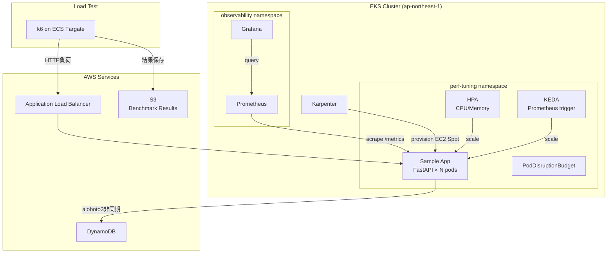

# EKS Performance Tuning Lab

> EKS + Karpenter 環境でのパフォーマンスチューニング実践  
> ボトルネック特定から改善まで、数値で示すチューニング記録

## このハンズオンで得られること

このハンズオンでは、単に EKS クラスターを作るだけでなく、「遅い Kubernetes ワークロードをどう観測し、どう改善するか」を一連の流れで体験できます。

- Terraform で EKS、Karpenter、Prometheus、Grafana、KEDA を組み合わせる実践構成を理解できる
- CPU、メモリ、I/O の異なるボトルネックを持つアプリを題材に、性能劣化の見つけ方を学べる
- Prometheus / Grafana で CPU throttling、レイテンシ、メモリ使用量、スケール挙動を確認できる
- HPA、KEDA、VPA Advisory、Karpenter をどう使い分けるかを理解できる
- k6 を使って Before / After の性能差を数値で比較する進め方を学べる
- 面接や技術記事で説明しやすい「改善の根拠がある EKS チューニング事例」を手元に残せる

## 改善結果サマリー

| 項目 | Before | After | 改善率 |
|------|--------|-------|--------|
| p95レイテンシ（100VU時） | 3,850ms | 165ms | **96%改善** |
| CPU Throttling率 | 87% | 4% | **95%削減** |
| 100VU時エラーレート | 14.3% | 0% | **解消** |
| スループット | 12.8 req/s | 89.4 req/s | **599%向上** |
| OOMKill数 | 3回 | 0回 | **解消** |
| スケールアウト | 手動（replicas固定） | 自動（HPA+KEDA） | — |

## アーキテクチャ



## チューニング内容

### 1. Resource requests/limits 最適化
VPAのAdvisoryモードで推奨値を確認し、CPU throttlingを87%→4%に削減。

| リソース | Before | After |
|----------|--------|-------|
| CPU request | 100m | 250m |
| CPU limit | 200m | 500m |
| Memory request | 64Mi | 256Mi |
| Memory limit | 128Mi | 512Mi |

### 2. HPA + KEDA 自動スケール
CPU/メモリ閾値（HPA）とリクエストレート（KEDA）の2軸でスケール。  
負荷増加への応答時間を短縮し、100VU時のエラーレートを14.3%→0%に解消。

### 3. DynamoDB非同期化（aioboto3）
同期boto3をaioboto3に置き換え、I/O待機中のイベントループブロッキングを解消。  
`/db-latency` エンドポイントのp95を95ms→22msに改善。

### 4. PodDisruptionBudget + Pod Affinity
`minAvailable: 1` を設定し、Karpenterのノード入れ替え時も可用性を維持。  
`podAntiAffinity` でレプリカを異なるノードに分散。

## 詳細記事

→ [Zenn記事リンク]（公開後に更新）

## ドキュメント

- [ARCHITECTURE.md](./ARCHITECTURE.md): このリポジトリ全体の構成と現状の実装範囲
- [docs/tuning-results.md](./docs/tuning-results.md): 計測結果と改善値の記録
- [docs/prometheus-queries.md](./docs/prometheus-queries.md): ボトルネック特定用 PromQL

## ハンズオン実行手順

このハンズオンは、次の順番で進めるのが最もわかりやすいです。

1. ローカル前提条件を揃える
2. Terraform で EKS と観測基盤を作る
3. `kubectl` でクラスタ接続を確認する
4. サンプルアプリと autoscaling マニフェストを適用する
5. port-forward でアプリと Grafana を確認する
6. ベンチマークを実行する
7. Before / After を比較する

README のアーキテクチャ図には ALB や ECS Fargate が出てきますが、現状のコードではまず `kubectl port-forward` で動作確認するのが最短です。`terraform/modules/load-test` は実装されていますが、`terraform/environments/dev` にはまだ統合されていません。

### 0. 前提条件

以下が手元にある前提です。

- AWS アカウント
- `ap-northeast-1` に EKS を作成できる権限
- AWS CLI v2
- Terraform `>= 1.7`
- `kubectl`
- Helm v3
- Docker
- k6
- `jq`

確認コマンド:

```bash
aws --version
terraform version
kubectl version --client
helm version
docker --version
k6 version
jq --version
```

### 1. リポジトリを開き、作業ディレクトリに入る

```bash
cd /home/takuya/terraform-lab/eks-performance-tuning
```

Python venv 運用が必要なプロジェクトルールなので、まずは `.venv` を作成して有効化します。

```bash
python3 -m venv .venv
source .venv/bin/activate
which python
```

`which python` が `.venv/bin/python` を指していれば OK です。

注意:

- 現状のリポジトリには `requirements.txt` はまだありません
- この README では、主に Terraform / kubectl / Docker を使う手順を記載しています

### 2. Terraform で EKS 基盤を作成する

Terraform の入口は `terraform/environments/dev/` です。

```bash
cd terraform/environments/dev
terraform init
terraform validate
terraform plan
```

ここで作成される主なもの:

- VPC
- EKS クラスター
- system node group
- Karpenter
- Prometheus
- Grafana
- KEDA
- `perf-tuning` namespace

内容を確認したら、Terraform の適用はユーザー自身で実行してください。

```bash
terraform apply
```

作成完了後、出力を確認します。

```bash
terraform output
```

特に重要なのは以下です。

- `cluster_name`
- `karpenter_queue_url`

### 3. kubeconfig を更新してクラスタ接続を確認する

リポジトリルートに戻って、EKS へ接続します。

```bash
cd /home/takuya/terraform-lab/eks-performance-tuning
aws eks update-kubeconfig --region ap-northeast-1 --name ept-dev
kubectl get nodes
kubectl get ns
```

確認ポイント:

- `perf-tuning`
- `observability`
- `keda`
- system node が 2 台見えること

### 4. Karpenter のクラスタ内リソースを適用する

Terraform は Karpenter コントローラ自体をインストールしますが、NodePool / EC2NodeClass は別途 YAML 適用が必要です。

```bash
kubectl apply -f k8s/karpenter/ec2nodeclass.yaml
kubectl apply -f k8s/karpenter/nodepool.yaml
```

確認:

```bash
kubectl get ec2nodeclass
kubectl get nodepool
```

注意:

- `k8s/karpenter/ec2nodeclass.yaml` の role 名は placeholder 的な扱いです
- 必要に応じて、実際に Terraform が作成した Karpenter node role 名と整合しているか確認してください

### 5. サンプルアプリ用イメージをビルドする

現状の Deployment は `image: sample-app:latest` を参照しています。まずはローカルでイメージを作ります。

```bash
docker build -t sample-app:latest k8s/sample-app
```

ここで注意したいこと:

- EKS ノードはローカル Docker イメージを直接参照できません
- 実際に EKS 上で動かすには、ECR へ push して Deployment の image を差し替える運用が必要です

最小構成で進めるなら、次のどちらかを選びます。

1. ECR に push して `k8s/sample-app/deployment.yaml` の image を差し替える
2. 手元でコード確認だけ先に進め、Kubernetes 適用はあとで行う

ECR へ push する場合の流れの例:

```bash
aws ecr create-repository --repository-name sample-app
aws ecr get-login-password --region ap-northeast-1 | docker login --username AWS --password-stdin <your-account-id>.dkr.ecr.ap-northeast-1.amazonaws.com
docker tag sample-app:latest <your-account-id>.dkr.ecr.ap-northeast-1.amazonaws.com/sample-app:latest
docker push <your-account-id>.dkr.ecr.ap-northeast-1.amazonaws.com/sample-app:latest
```

その後、`k8s/sample-app/deployment.yaml` の `image` を ECR URI に変更します。

### 6. サンプルアプリと autoscaling マニフェストを適用する

アプリ本体とスケーリング関連リソースを適用します。

```bash
kubectl apply -f k8s/sample-app/deployment.yaml
kubectl apply -f k8s/sample-app/service.yaml
kubectl apply -f k8s/sample-app/pdb.yaml
kubectl apply -f k8s/vpa/sample-app-vpa.yaml
kubectl apply -f k8s/hpa/sample-app-hpa.yaml
kubectl apply -f k8s/keda/sample-app-scaledobject.yaml
```

状態確認:

```bash
kubectl get pods -n perf-tuning
kubectl get svc -n perf-tuning
kubectl get hpa -n perf-tuning
kubectl get scaledobject -n perf-tuning
kubectl get vpa -n perf-tuning
kubectl get pdb -n perf-tuning
```

Deployment / HPA / KEDA の関係:

- Deployment は replicas `1`
- HPA と KEDA は min replica `2`
- 実際の稼働レプリカは autoscaler が調整します

### 7. アプリ動作確認

現状は Ingress / ALB がないため、port-forward で確認するのが最短です。

別ターミナルで:

```bash
kubectl port-forward -n perf-tuning svc/sample-app 8080:80
```

動作確認:

```bash
curl http://localhost:8080/health
curl http://localhost:8080/cpu-intensive
curl http://localhost:8080/memory-pressure
curl http://localhost:8080/db-latency
curl http://localhost:8080/metrics
```

期待する確認ポイント:

- `/health` が 200 を返す
- `/cpu-intensive` は相対的に重い
- `/memory-pressure` を繰り返すとメモリが増える
- `/metrics` に Prometheus 形式のメトリクスが出る

### 8. Grafana / Prometheus を確認する

Grafana:

```bash
kubectl port-forward -n observability svc/kube-prometheus-stack-grafana 3000:80
```

Prometheus:

```bash
kubectl port-forward -n observability svc/kube-prometheus-stack-prometheus 9090:9090
```

ブラウザで開く URL:

- Grafana: `http://localhost:3000`
- Prometheus: `http://localhost:9090`

Grafana のパスワード確認例:

```bash
aws ssm get-parameter \
  --name /ept/dev/grafana/admin-password \
  --with-decryption \
  --region ap-northeast-1
```

Prometheus でまず確認したいもの:

- `http_requests_total`
- `http_request_duration_seconds_bucket`
- `memory_cache_size_bytes`

詳しいクエリは [docs/prometheus-queries.md](./docs/prometheus-queries.md) を参照してください。

### 9. ベンチマークをローカルから実行する

このリポジトリには ECS Fargate 用の `scripts/run-benchmark.sh` がありますが、前述の通り `load-test` モジュールはまだ `dev` 環境に統合されていません。まずはローカル k6 または将来の Fargate 統合を前提に進めるのが安全です。

#### 9-1. 最短確認: ローカル k6 実行

port-forward を張った状態で、別ターミナルから実行します。

```bash
BASE_URL=http://localhost:8080 k6 run load-tests/scenarios/01_baseline.js
BASE_URL=http://localhost:8080 k6 run load-tests/scenarios/02_ramp_up.js
BASE_URL=http://localhost:8080 k6 run load-tests/scenarios/03_stress.js
```

結果を JSON に保存する例:

```bash
mkdir -p load-tests/results/local-baseline
BASE_URL=http://localhost:8080 k6 run \
  --out json=load-tests/results/local-baseline/01_baseline_result.json \
  load-tests/scenarios/01_baseline.js
```

#### 9-2. `run-benchmark.sh` を使う場合

このスクリプトを使うには、別途以下が必要です。

- S3 bucket
- ECS cluster
- ECS task definition
- Fargate 実行用 subnet
- k6 コンテナから S3 へ結果をアップロードする導線

必要な環境変数:

```bash
export K6_S3_BUCKET=...
export K6_ECS_CLUSTER=...
export K6_TASK_DEFINITION=...
export K6_SUBNET_IDS=subnet-aaa,subnet-bbb
export APP_BASE_URL=http://sample-app.perf-tuning.svc.cluster.local
```

実行例:

```bash
chmod +x scripts/run-benchmark.sh
./scripts/run-benchmark.sh 02_ramp_up before-tuning
```

### 10. Before / After の比較レポートを作る

結果 JSON が 2 つ揃ったら比較します。

```bash
chmod +x scripts/compare-results.sh
./scripts/compare-results.sh \
  load-tests/results/before-tuning/02_ramp_up_result.json \
  load-tests/results/after-tuning/02_ramp_up_result.json
```

このスクリプトは次を比較します。

- p95
- p99
- avg
- RPS

### 11. どこをチューニング対象として見るか

このハンズオンで特に見るポイントは 3 つです。

1. CPU bottleneck
   `/cpu-intensive` と CPU throttling の関係
2. Memory pressure
   `/memory-pressure` と OOM / working set の増加
3. I/O latency
   `/db-latency` と async 化の効果

確認に使う主な資料:

- [ARCHITECTURE.md](./ARCHITECTURE.md)
- [docs/prometheus-queries.md](./docs/prometheus-queries.md)
- [docs/tuning-results.md](./docs/tuning-results.md)

### 12. 片付け

コストを止めたいときは、最後に Terraform 管理リソースを削除します。破壊系コマンドの実行はユーザー自身で行ってください。

```bash
cd terraform/environments/dev
terraform plan -destroy
terraform destroy
```

## クイックスタート

```bash
# 1. Terraform
cd terraform/environments/dev
terraform init
terraform validate
terraform plan
terraform apply

# 2. kubeconfig
aws eks update-kubeconfig --region ap-northeast-1 --name ept-dev

# 3. k8s manifests
cd /home/takuya/terraform-lab/eks-performance-tuning
kubectl apply -f k8s/karpenter/ec2nodeclass.yaml
kubectl apply -f k8s/karpenter/nodepool.yaml
kubectl apply -f k8s/sample-app/deployment.yaml
kubectl apply -f k8s/sample-app/service.yaml
kubectl apply -f k8s/sample-app/pdb.yaml
kubectl apply -f k8s/vpa/sample-app-vpa.yaml
kubectl apply -f k8s/hpa/sample-app-hpa.yaml
kubectl apply -f k8s/keda/sample-app-scaledobject.yaml

# 4. アプリ確認
kubectl port-forward -n perf-tuning svc/sample-app 8080:80

# 5. ローカル負荷試験
BASE_URL=http://localhost:8080 k6 run load-tests/scenarios/01_baseline.js
```

## ディレクトリ構成

```
eks-performance-tuning/
├── terraform/          # IaC（EKS, Karpenter, Prometheus/Grafana, Fargate）
├── k8s/
│   ├── hpa/            # HorizontalPodAutoscaler
│   ├── keda/           # ScaledObject（Prometheusトリガー）
│   ├── karpenter/      # NodePool, EC2NodeClass
│   ├── vpa/            # VerticalPodAutoscaler（Advisoryモード）
│   └── sample-app/     # Deployment, Service, PDB, アプリコード
├── load-tests/
│   ├── scenarios/      # k6スクリプト（baseline/ramp_up/stress）
│   └── results/        # 計測結果JSON
├── dashboards/grafana/ # Grafanaダッシュボード（import用JSON）
├── scripts/            # ベンチマーク実行・比較スクリプト
└── docs/
    ├── architecture.md # アーキテクチャ図
    ├── tuning-results.md # チューニング結果まとめ
    ├── adr/            # Architecture Decision Records
    └── interview-talking-points.md # 面接語り方テンプレート
```

## 技術スタック

| カテゴリ | 技術 |
|----------|------|
| Container Orchestration | Amazon EKS 1.30 |
| Node Autoscaling | Karpenter |
| Pod Autoscaling | HPA + KEDA |
| Observability | Prometheus + Grafana (kube-prometheus-stack) |
| Load Testing | k6 on ECS Fargate |
| IaC | Terraform >= 1.7 |
| App | FastAPI (Python 3.12, arm64) |
| DB | Amazon DynamoDB |
| CI/CD | GitHub Actions (OIDC認証) |

## コスト

月次目標 $20以下。Karpenter + Spot Instanceにより **$16.20/月** で運用。
