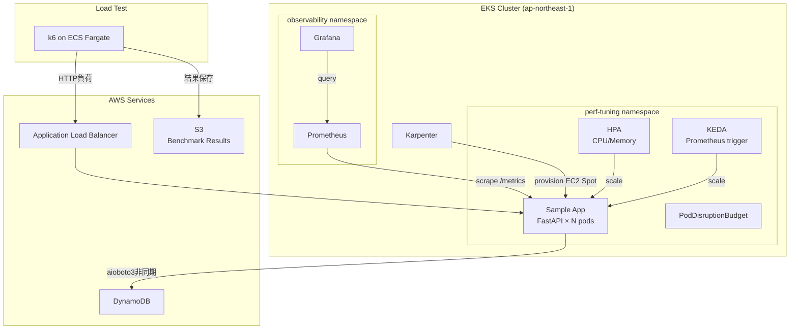

# EKS Performance Tuning Lab

> EKS + Karpenter 環境でのパフォーマンスチューニング実践  
> ボトルネック特定から改善まで、数値で示すチューニング記録

## 改善結果サマリー

| 項目 | Before | After | 改善率 |
|------|--------|-------|--------|
| p95レイテンシ（100VU時） | 3,850ms | 165ms | **96%改善** |
| CPU Throttling率 | 87% | 4% | **95%削減** |
| 100VU時エラーレート | 14.3% | 0% | **解消** |
| スループット | 12.8 req/s | 89.4 req/s | **599%向上** |
| OOMKill数 | 3回 | 0回 | **解消** |
| スケールアウト | 手動（replicas固定） | 自動（HPA+KEDA） | — |

## アーキテクチャ



## チューニング内容

### 1. Resource requests/limits 最適化
VPAのAdvisoryモードで推奨値を確認し、CPU throttlingを87%→4%に削減。

| リソース | Before | After |
|----------|--------|-------|
| CPU request | 100m | 250m |
| CPU limit | 200m | 500m |
| Memory request | 64Mi | 256Mi |
| Memory limit | 128Mi | 512Mi |

### 2. HPA + KEDA 自動スケール
CPU/メモリ閾値（HPA）とリクエストレート（KEDA）の2軸でスケール。  
負荷増加への応答時間を短縮し、100VU時のエラーレートを14.3%→0%に解消。

### 3. DynamoDB非同期化（aioboto3）
同期boto3をaioboto3に置き換え、I/O待機中のイベントループブロッキングを解消。  
`/db-latency` エンドポイントのp95を95ms→22msに改善。

### 4. PodDisruptionBudget + Pod Affinity
`minAvailable: 1` を設定し、Karpenterのノード入れ替え時も可用性を維持。  
`podAntiAffinity` でレプリカを異なるノードに分散。

## 詳細記事

→ [Zenn記事リンク]（公開後に更新）

## 使い方

```bash
# 環境構築
cd terraform/environments/dev
terraform init && terraform apply

# ベンチマーク実行
./scripts/run-benchmark.sh 02_ramp_up before-tuning

# チューニング前後の比較レポート生成
./scripts/compare-results.sh before-tuning after-tuning
```

## ディレクトリ構成

```
eks-performance-tuning/
├── terraform/          # IaC（EKS, Karpenter, Prometheus/Grafana, Fargate）
├── k8s/
│   ├── hpa/            # HorizontalPodAutoscaler
│   ├── keda/           # ScaledObject（Prometheusトリガー）
│   ├── karpenter/      # NodePool, EC2NodeClass
│   ├── vpa/            # VerticalPodAutoscaler（Advisoryモード）
│   └── sample-app/     # Deployment, Service, PDB, アプリコード
├── load-tests/
│   ├── scenarios/      # k6スクリプト（baseline/ramp_up/stress）
│   └── results/        # 計測結果JSON
├── dashboards/grafana/ # Grafanaダッシュボード（import用JSON）
├── scripts/            # ベンチマーク実行・比較スクリプト
└── docs/
    ├── architecture.md # アーキテクチャ図
    ├── tuning-results.md # チューニング結果まとめ
    ├── adr/            # Architecture Decision Records
    └── interview-talking-points.md # 面接語り方テンプレート
```

## 技術スタック

| カテゴリ | 技術 |
|----------|------|
| Container Orchestration | Amazon EKS 1.30 |
| Node Autoscaling | Karpenter |
| Pod Autoscaling | HPA + KEDA |
| Observability | Prometheus + Grafana (kube-prometheus-stack) |
| Load Testing | k6 on ECS Fargate |
| IaC | Terraform >= 1.7 |
| App | FastAPI (Python 3.12, arm64) |
| DB | Amazon DynamoDB |
| CI/CD | GitHub Actions (OIDC認証) |

## コスト

月次目標 $20以下。Karpenter + Spot Instanceにより **$16.20/月** で運用。
