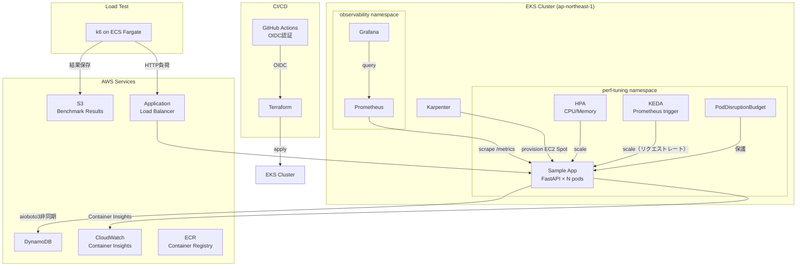

# アーキテクチャ

## システム全体図

## コンポーネント説明

### サンプルアプリ（perf-tuning namespace）
FastAPIアプリ。3つのボトルネックエンドポイントを持つ:
- `/cpu-intensive`: Fibonacci(35) - CPUバウンド
- `/memory-pressure`: 1MBチャンクをキャッシュ - メモリ消費
- `/db-latency`: DynamoDB呼び出し（aioboto3非同期） - I/Oバウンド

### スケーリング戦略
- **HPA**: CPU/メモリ使用率ベース（安定した閾値管理）
- **KEDA**: Prometheusリクエストレートベース（先行スケール）
- **Karpenter**: ノードのプロビジョニング（Spot優先、コスト最適化）

### 可観測性スタック
- Prometheus: メトリクス収集（kube-prometheus-stack）
- Grafana: ダッシュボード可視化（`dashboards/grafana/`）
- CloudWatch Container Insights: AWSネイティブモニタリング

### CI/CD
- Terraform plan: PRトリガー、OIDC認証、plan結果をPRコメントに投稿
- Benchmark: 手動トリガー、k6実行→S3保存→Artifact保存

## チューニング前後の構成変化

| 項目 | Before | After |
|------|--------|-------|
| replicas | 1 | min=2, max=10（HPA+KEDA） |
| CPU request/limit | 100m/200m | 250m/500m |
| Memory request/limit | 64Mi/128Mi | 256Mi/512Mi |
| DynamoDB接続 | 同期（boto3） | 非同期（aioboto3） |
| Pod保護 | なし | PDB（minAvailable=1） |
| ノードプロビジョニング | 手動 | Karpenter（Spot自動選択） |
