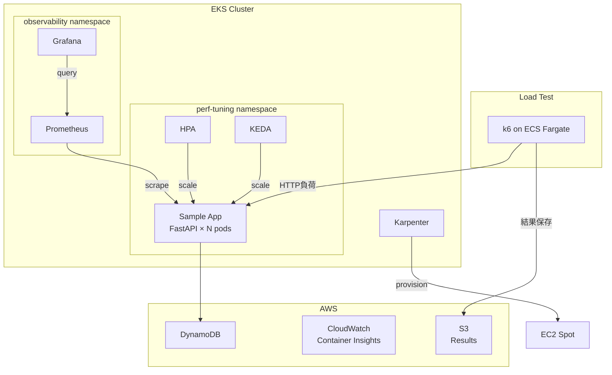

# ✅Phase 4: ポートフォリオ化・Zenn公開

## Phase 1-3で作成したもの（サマリー）
- EKS + Karpenter + Prometheus/Grafana 可観測性基盤
- k6負荷テスト基盤（Fargate）
- 4つのチューニング実施:
  1. Resource Request/Limit最適化（VPA Advisory）
  2. HPA + KEDAによる自動スケール
  3. 非同期化（aioboto3）
  4. PDB + Pod Affinity
- チューニング前後の計測結果（`load-tests/results/`）
- `docs/tuning-results.md` に改善数値記録済み

## このフェーズの目標
計測結果をGitHub + Zennで対外発信できる形に整える。
面接・転職活動で「実績として語れる」状態にする。

---

## 成果物1: GitHub README

`README.md` を以下の構成で作成:

```markdown
# EKS Performance Tuning Lab

> EKS + Karpenter 環境でのパフォーマンスチューニング実践  
> ボトルネック特定から改善まで、数値で示すチューニング記録

## 改善結果サマリー

| 項目 | Before | After | 改善率 |
|------|--------|-------|--------|
| p95レイテンシ | XXXms | XXXms | XX%改善 |
| CPU Throttling率 | XX% | X% | XX%削減 |
| 100VU時エラーレート | XX% | 0% | 解消 |
| スケールアウト | 手動 | 自動（HPA+KEDA） | - |

## アーキテクチャ

[Mermaidダイアグラム]

## チューニング内容

1. Resource Request/Limit最適化
2. HPA + KEDA自動スケール
3. 非同期化（aioboto3）
4. PodDisruptionBudget + Pod Affinity

## 詳細記事

→ [Zenn記事リンク]

## 使い方

\`\`\`bash
# 環境構築
terraform init && terraform apply

# ベンチマーク実行
./scripts/run-benchmark.sh 02_ramp_up baseline

# チューニング適用 → 再計測 → 比較
./scripts/compare-results.sh before-tuning after-tuning
\`\`\`
```

**Mermaidアーキテクチャ図（`docs/architecture.md`）:**


---

## 成果物2: GitHub Actions

`.github/workflows/tf-plan.yml`:
```yaml
# PRトリガーでterraform plan
# OIDC認証（static keys不使用）
# plan結果をPRコメントに投稿
```

`.github/workflows/benchmark.yml`:
```yaml
# 手動トリガー（workflow_dispatch）
# inputs: scenario, tag
# k6ベンチマーク実行 → 結果をArtifactとして保存
# Summaryページに結果表示
```

---

## 成果物3: ADR（Architecture Decision Records）

`docs/adr/` に以下を作成:

**ADR-001: HPAとKEDAの使い分け**
- Context: CPU/メモリベースのスケールだけでは応答性が不十分
- Decision: HPAをベースライン、KEDAをカスタムメトリクスの補助として併用
- Consequences: Prometheusメトリクスに依存するため可観測性が前提条件

**ADR-002: VPAをAdvisoryモードに限定した理由**
- Context: VPA Auto適用するとPodが再起動されてサービス断が発生
- Decision: UpdateMode: Offで推奨値表示のみ。実際の変更は手動確認後
- Consequences: 自動化されないが、Request/Limitの根拠が明確になる

---

## 成果物4: Zenn記事構成

記事タイトル案（選択）:
1. 「EKSでCPU throttlingを90%削減した話 - Karpenter + HPA + KEDA チューニング実録」
2. 「k6 + Prometheus で見えてきたKubernetesのボトルネック - 数値で語るチューニング」

**記事構成:**
```
1. はじめに（なぜこれを作ったか）
2. 構成概要（アーキテクチャ図）
3. 意図的に作ったボトルネック（Before）
4. 計測: k6 + Grafanaで何が見えたか
   → スクリーンショット + PromQLクエリ
5. チューニング1: Request/Limit最適化
   → Before/After数値
6. チューニング2: HPA + KEDA
   → スケールアウトの様子（Grafana）
7. チューニング3: 非同期化
   → DBレイテンシのBefore/After
8. 総合結果（表）
9. まとめと次のステップ
```

**重要**: 数字を入れること。「改善した」ではなく「p95が800ms→120msになった」

---

## 面接で使える語り方テンプレート

`docs/interview-talking-points.md` に記録:

```markdown
## 状況（S）
EKSで本番相当の負荷テストができる検証環境を構築し、
意図的にボトルネックを仕込んだアプリでチューニングを実践しました。

## 課題（T）
k6で100VUの負荷をかけると p95レイテンシがXXXmsに悪化し、
CPU throttlingが常時XX%発生していました。

## 行動（A）
Prometheus + Grafanaで原因を特定し、以下を段階的に改善しました:
1. VPAの推奨値を参考にRequest/Limitを適正化 → Throttling解消
2. HPA + KEDAで自動スケールを実装 → 負荷増加に追従
3. DynamoDB呼び出しをaioboto3で非同期化 → I/Oレイテンシ削減

## 結果（R）
p95レイテンシをXXXms→XXXmsに○%改善。
CPU throttling率をXX%→X%以下に削減。
構成はGitHub公開・Zenn記事化しました。
```

---

## 完了条件
- [ ] READMEに改善数値の表が入っている
- [ ] Mermaidアーキテクチャ図がdocs/に存在する
- [ ] GitHub ActionsでTerraform planが動いている（OIDC認証）
- [ ] 2つのADRが書かれている
- [ ] Zenn記事が下書き完成している（数値入り）
- [ ] GitHubリポジトリがPublicで公開されている