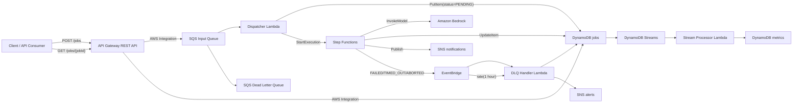
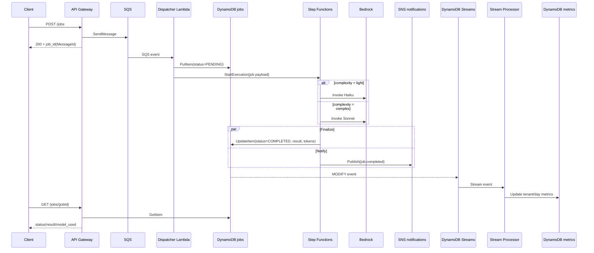
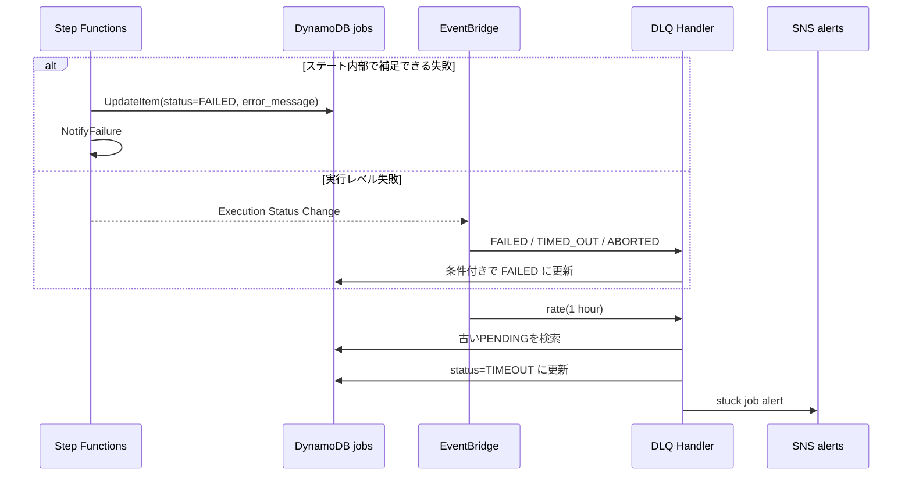
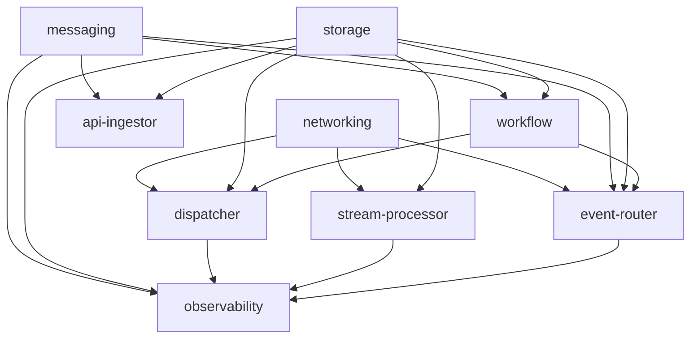
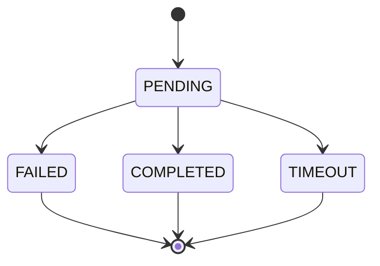
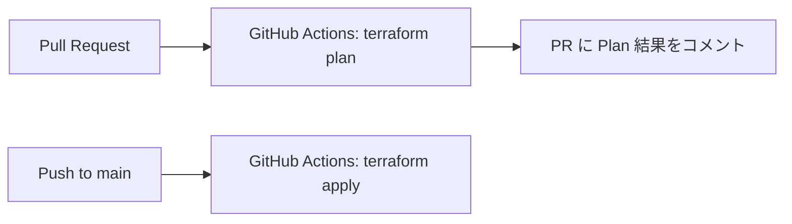

# ARCHITECTURE

## 1. このシステムは何を作っているか

このプロジェクトは、API で受け付けた AI ジョブを AWS のイベント駆動サービスで非同期処理するサンドボックスです。中心テーマは次の 2 点です。

- API Gateway から SQS へは Lambda を使わず直接統合する
- Step Functions から Bedrock / DynamoDB / SNS へは Lambda を使わず SDK 統合する

そのうえで、Lambda は「ロジックが必要な場所」にだけ限定して使っています。

- `dispatcher`: SQS メッセージの検証、DynamoDB 初期書き込み、Step Functions 起動
- `stream-processor`: DynamoDB Streams を集計用メトリクスへ反映
- `dlq-handler`: Step Functions 失敗時の保険処理と停滞ジョブの掃除

---

## 2. 全体像

### アーキテクチャの要点

- 同期 API と非同期処理を分離している
- ジョブ状態の真実のソースは `DynamoDB jobs` テーブル
- AI 推論の本体は Step Functions から Bedrock を直接呼ぶ
- 失敗時のセーフティネットを EventBridge + `dlq-handler` で二重化している
- 集計系は本線から分離し、DynamoDB Streams で後追い処理している

---

## 3. 正常系の実行フロー

### ここで Lambda を使っている理由

- `dispatcher` は入力検証、TTL 設定、SQS の部分失敗制御が必要
- `stream-processor` は Streams の変更内容を解釈して日次集計するロジックが必要

### ここで Lambda を使っていない理由

- `POST /jobs` は API Gateway の VTL だけで SQS へ流せる
- `GET /jobs/{jobId}` は API Gateway から DynamoDB `GetItem` を直接呼べる
- Step Functions は Bedrock / DynamoDB / SNS を SDK 統合で直接呼べる

---

## 4. 失敗系と復旧の考え方

### 失敗パターンごとの責務分担

| パターン | 主担当 | 振る舞い |
|---|---|---|
| 入力不正 | `dispatcher` | ログを残して破棄。再試行しない |
| Dispatcher 一時失敗 | SQS + event source mapping | 失敗メッセージだけ再試行 |
| 再試行上限超過 | SQS DLQ | DLQ に隔離 |
| Bedrock / DynamoDB / SNS 実行失敗 | Step Functions | `HandleFailure` で `FAILED` 更新 |
| Step Functions 実行全体の失敗 | EventBridge + `dlq-handler` | セーフティネットで `FAILED` 更新 |
| 長時間 `PENDING` のまま | EventBridge schedule + `dlq-handler` | `TIMEOUT` に更新し、アラート通知 |

---

## 5. モジュール構成

### `environments/dev`

環境の組み立て担当です。各モジュールの入出力を接続し、`provider`、`backend`、環境変数を定義します。

### モジュール一覧

| モジュール | 役割 | 主なリソース |
|---|---|---|
| `networking` | 実行基盤のネットワーク | VPC、public/private subnet、IGW、NAT、VPC endpoints |
| `messaging` | 非同期キューと通知 | SQS input/DLQ、SNS notifications/alerts |
| `storage` | 状態保存と集計保存 | DynamoDB jobs、DynamoDB metrics |
| `workflow` | AI 推論ワークフロー | Step Functions、実行ログ、SFN IAM |
| `dispatcher` | 受付ジョブの正規化と起動 | Lambda、SQS event source mapping、IAM、SG |
| `stream-processor` | 集計処理 | Lambda、DynamoDB Streams mapping、IAM、SG |
| `event-router` | 失敗イベントと定期掃除 | EventBridge rules、Lambda、IAM、SG |
| `api-ingestor` | エントリ API | API Gateway REST、API Key、Usage Plan、IAM |
| `observability` | 可観測性 | CloudWatch Dashboard、Alarms、X-Ray Group |

---

## 6. モジュール依存関係

### 依存の読み方

- `workflow` は `jobs` テーブル名と通知用 SNS ARN を必要とする
- `dispatcher` は SQS、DynamoDB、Step Functions の 3 つを横断する
- `event-router` は Step Functions の失敗イベントと DynamoDB の状態補正を担当する
- `observability` は各モジュールの名前や ARN を受け取り、監視対象を束ねる

---

## 7. 各モジュールの詳細

### 7.1 `networking`

VPC とサブネットに加え、Lambda がプライベートサブネットから AWS サービスへ到達するための VPC Endpoint 群を作ります。

#### 構成

- VPC CIDR: `10.1.0.0/16`
- Public subnet x2: NAT Gateway 配置用
- Private subnet x2: Lambda 実行用
- NAT Gateway: 1 台のみでコスト最適化
- Gateway endpoints: `S3`, `DynamoDB`
- Interface endpoints: `states`, `sns`, `logs`

#### 設計意図

- Step Functions 起動、SNS publish、CloudWatch Logs 書き込みを NAT 依存にしすぎない
- ただし NAT Gateway も残しており、完全閉域ではなく実験しやすさを優先している

### 7.2 `messaging`

パイプラインの入口と通知チャネルです。

#### SQS

- `input`: API から受け取る本線キュー
- `input_dlq`: 再試行上限超過時の隔離先
- Long polling: `receive_wait_time_seconds = 20`
- SSE: `sqs_managed_sse_enabled = true`

#### SNS

- `notifications`: ジョブ完了/失敗の業務通知
- `alerts`: DLQ 蓄積や停滞ジョブの運用通知

### 7.3 `storage`

状態の真実のソースです。

#### `jobs` テーブル

| 属性 | 用途 |
|---|---|
| `job_id` | パーティションキー。SQS `MessageId` を流用 |
| `tenant_id` | テナント識別 |
| `status` | `PENDING` / `COMPLETED` / `FAILED` / `TIMEOUT` |
| `prompt` | 入力テキスト |
| `result` | 推論結果 |
| `model_used` | `haiku` または `sonnet` |
| `input_tokens` / `output_tokens` | トークン使用量 |
| `error_message` | 障害内容 |
| `created_at` / `completed_at` | 追跡用タイムスタンプ |
| `expires_at` | TTL |

#### インデックス

- `status-created_at-index`: 停滞ジョブの検出
- `tenant_id-created_at-index`: テナント別履歴

#### `metrics` テーブル

- PK: `tenant_id`
- SK: `date`
- 日次単位で `completed_jobs`、`failed_jobs`、トークン数を集計

### 7.4 `dispatcher`

SQS から取り出したメッセージをジョブに昇格させるコンポーネントです。

#### 実処理

1. SQS レコードを JSON として読み込む
2. `tenant_id` と `prompt` を検証する
3. `complexity` を `light` / `complex` に正規化する
4. `jobs` テーブルに `status=PENDING` で書き込む
5. Step Functions を `job-<messageId>` 名で開始する

#### 重要な設計

- `job_id` に SQS `messageId` を使うので API レスポンスの ID と内部 ID が一致する
- `ReportBatchItemFailures` により、バッチ内の失敗レコードだけ再試行できる
- バリデーションエラーは「不正入力」とみなし、あえて再試行にも DLQ にも回さない

### 7.5 `workflow`

AI 推論の本体です。`state_machine.asl.json.tftpl` を Terraform `templatefile()` で注入しています。

#### ステート構成

| ステート | 役割 |
|---|---|
| `RouteByComplexity` | `complexity` による分岐 |
| `InvokeHaiku` | 軽量ジョブ向け Bedrock 呼び出し |
| `InvokeSonnet` | 複雑ジョブ向け Bedrock 呼び出し |
| `ParallelFinalize` | 保存と通知を並列実行 |
| `SaveResult` | DynamoDB `UpdateItem` |
| `NotifyCompletion` | SNS publish |
| `HandleFailure` | `FAILED` 更新 |
| `NotifyFailure` | 失敗通知 |

#### 特徴

- Lambda を介さず Bedrock を呼ぶ
- `Retry` と `JitterStrategy` で Bedrock スロットリングに備える
- 成功時は保存と通知を並列化している
- 失敗時は DynamoDB と SNS の両方に痕跡を残す

### 7.6 `stream-processor`

`jobs` テーブルの状態変化を集計系へ変換する非同期コンポーネントです。

#### 起動条件

- DynamoDB Streams の `MODIFY`
- `NewImage.status` が `COMPLETED` または `FAILED`

#### 処理内容

- `COMPLETED`: 完了件数とトークン数を日次メトリクスに加算
- `FAILED`: 失敗件数を日次メトリクスに加算

#### 設計意図

- 集計処理を本線から切り離し、ユーザー応答時間に影響させない
- `ADD` による atomic counter で簡潔に加算する

### 7.7 `event-router`

EventBridge と Lambda を使って「本線の外側の異常」を拾います。

#### 2 つのトリガー

- Step Functions 実行失敗イベント
- `rate(1 hour)` の定期イベント

#### 役割

- 実行レベル失敗を見つけ、まだ `COMPLETED` でないジョブだけ `FAILED` に補正
- 古い `PENDING` ジョブを `TIMEOUT` に変更し、SNS alerts へ通知

#### 設計意図

- Step Functions の Catch だけに頼らず、イベントベースの保険を用意している
- DynamoDB GSI を使って停滞ジョブ検索をテーブルスキャンなしで実施している

### 7.8 `api-ingestor`

このプロジェクトの「Lambda を使わない入口」の主役です。

#### エンドポイント

| メソッド | 統合先 | 役割 |
|---|---|---|
| `POST /jobs` | SQS `SendMessage` | ジョブ受付 |
| `GET /jobs/{jobId}` | DynamoDB `GetItem` | 状態参照 |

#### `POST /jobs`

- VTL で JSON ボディを `Action=SendMessage&MessageBody=...` に変換
- レスポンスでは SQS XML から `MessageId` を抜き、`job_id` として返す

#### `GET /jobs/{jobId}`

- DynamoDB の型付き JSON を VTL で通常の JSON に整形
- アイテムがなければ `404` を返す

#### 認証

- API Key 必須
- Usage Plan で API ステージと関連付け

### 7.9 `observability`

運用時に見る場所をまとめるモジュールです。

#### 含まれるもの

- X-Ray Group
- CloudWatch Alarms
- CloudWatch Dashboard

#### 監視対象

- SQS キュー深さ
- DLQ 蓄積
- Dispatcher エラー
- Step Functions 実行失敗
- Lambda invocation / error / throttle
- DynamoDB レイテンシ
- Step Functions 実行時間

---

## 8. データモデルの見方

### `jobs` テーブルの状態遷移

### 状態を更新する主体

| 状態 | 更新主体 |
|---|---|
| `PENDING` | `dispatcher` |
| `COMPLETED` | Step Functions `SaveResult` |
| `FAILED` | Step Functions `HandleFailure` または `dlq-handler` |
| `TIMEOUT` | `dlq-handler` の scheduled cleanup |

---

## 9. IAM とセキュリティ境界

### IAM の分離

- API Gateway 用 IAM ロール
  API 自体が SQS / DynamoDB を呼ぶ
- Dispatcher Lambda ロール
  SQS 受信、DynamoDB `PutItem`、Step Functions `StartExecution`
- Step Functions ロール
  Bedrock `InvokeModel`、DynamoDB `UpdateItem/PutItem`、SNS `Publish`
- Stream Processor ロール
  DynamoDB Streams 読み取り、metrics 更新
- DLQ Handler ロール
  `jobs` 更新、GSI クエリ、SNS alerts publish

### セキュリティ上の特徴

- API は API Key 必須
- Lambda は private subnet 内で実行
- CloudWatch Logs / SNS / Step Functions / DynamoDB には VPC endpoint で到達しやすくしている
- DynamoDB は TTL と PITR を使う
- SQS は SSE 有効

---

## 10. CI/CD の流れ

### ワークフローの特徴

- OIDC で AWS ロールを引き受ける
- PR では `init`, `fmt`, `validate`, `plan` を実施
- `main` push では `terraform apply -auto-approve tfplan`

注意: このリポジトリの運用方針としては `terraform apply` はユーザー実行が前提ですが、GitHub Actions では自動 apply 設定が入っています。実際の運用方針はチームで揃えて確認したほうがよいです。

---

## 11. 重要な実装上の注意点

この章は「理想像」ではなく、現時点のコードを読んで分かる注意点です。

### 1. SQS 可視性タイムアウトの値にズレがある

- 変数定義の推奨値は `180`
- ただし `environments/dev/terraform.tfvars` では `30`
- `dispatcher` の Lambda timeout は `25`

つまり現在値でも即破綻はしませんが、コメントで意図されている「6 倍確保」にはなっていません。

### 2. 停滞ジョブは `FAILED` ではなく `TIMEOUT` になる

README では停滞ジョブが `FAILED` になる説明がありますが、実装の `dlq_handler.py` では `TIMEOUT` に更新されます。運用確認時はこの実装値を見る必要があります。

### 3. `alert_email` は `messaging` モジュールへ渡されていない

`messaging` 側にはメール購読作成ロジックがありますが、`environments/dev/main.tf` の `module "messaging"` で `alert_email` を渡していません。つまり現状の Terraform ではメール購読は作られません。

### 4. X-Ray Group の対象は一部のみ

X-Ray Group は `dispatcher` と `stream-processor` を対象にしており、`dlq-handler` や API Gateway、Step Functions 全体を包括しているわけではありません。

### 5. `jobs` テーブルの `input_tokens` / `output_tokens` は文字列保存

Step Functions の `UpdateItem` では `States.Format` を使って `S` として保存しています。Streams 側では `N` も読めますが、現実装では文字列で扱われます。

---

## 12. このプロジェクトの学習価値

この構成から学べることはかなり明確です。

- Lambda を減らせる場所と、逆に必要な場所の切り分け
- API Gateway の VTL 直接統合
- Step Functions の SDK 統合と分岐・並列化
- DynamoDB を状態ストア兼イベントソースとして使う考え方
- EventBridge を「イベントの保険」として使う設計
- DLQ、TTL、PITR、CloudWatch、X-Ray を含む実運用寄りの構成

---

## 13. まず読む順番

初見で追うなら、この順番が理解しやすいです。

1. `environments/dev/main.tf`
2. `modules/api-ingestor/main.tf`
3. `modules/dispatcher/src/index.py`
4. `modules/workflow/state_machine.asl.json.tftpl`
5. `modules/storage/main.tf`
6. `modules/event-router/src/dlq_handler.py`
7. `modules/stream-processor/src/index.py`
8. `modules/observability/main.tf`

この順で読むと、「入口 → 本線 → 失敗処理 → 集計 → 監視」の順に頭の中でつながります。
