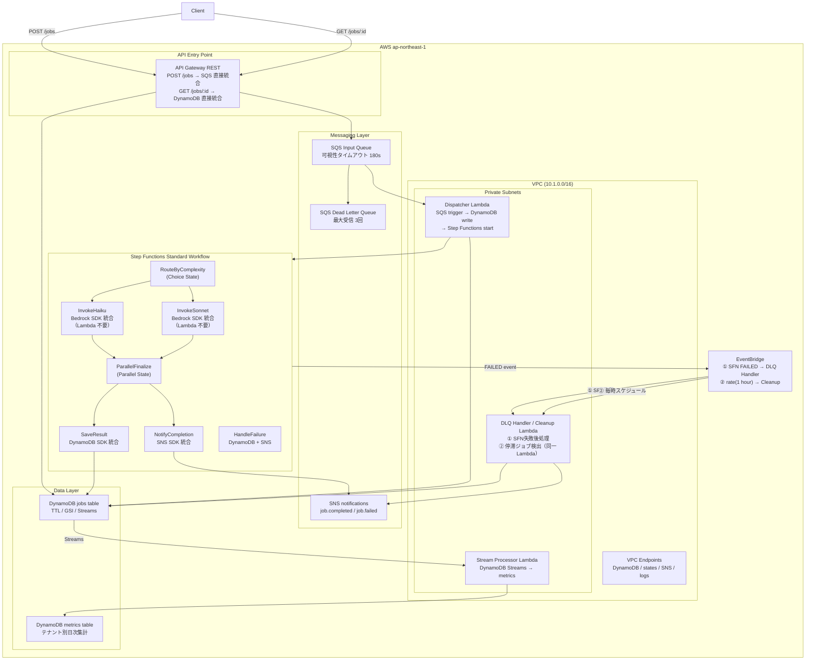

# AWS Event-Driven AI Pipeline Sandbox

## このプロジェクトの目的

**「Lambda を書けばなんとかなる」思考から抜け出す。**

AWS には Lambda を一切使わずにサービス間を繋げる仕組みが多数ある。
このプロジェクトでは、あえて「Lambda を書いてはいけないルール」を2箇所に設け、
サービス直接統合を実際に手を動かして体験する。

| 場所 | 通常のやり方 | このプロジェクトでのやり方 |
|------|------------|------------------------|
| API → キュー | API Gateway → Lambda → SQS | API Gateway → SQS **直接統合**（Lambda ゼロ） |
| ワークフロー → Bedrock / DB / SNS | Step Functions → Lambda → 各サービス | Step Functions **SDK 統合**（Lambda ゼロ） |

Lambda を書く場面を意図的に絞ることで、「どこに Lambda が本当に必要か」を判断できるようになる。

## 技術スタック

| カテゴリ | 採用技術 |
|---------|---------|
| IaC | Terraform >= 1.5.0 / AWS Provider ~> 5.0 |
| クラウド | AWS ap-northeast-1 |
| メッセージング | Amazon SQS（キュー + DLQ）/ Amazon SNS |
| ワークフロー | AWS Step Functions Standard Workflow |
| AI | Amazon Bedrock（Claude 3 Haiku / Sonnet — SDK 統合） |
| ストレージ | DynamoDB（TTL + GSI + Streams） |
| イベント | Amazon EventBridge（ルーティング + スケジュール） |
| API | API Gateway REST（SQS / DynamoDB 直接統合） |
| 認証 | OIDC（アクセスキー禁止） |
| CI/CD | GitHub Actions |
| 言語 | Python 3.12（Lambda） |

---

## アーキテクチャ



---

## 成功の定義

以下がすべて確認できたら、このプロジェクトは完了とみなす。

### インフラ
- [ ] `terraform apply` がエラーなく完了する
- [ ] `terraform output` で API エンドポイントと API Key ID が出力される

### パイプライン疎通（E2E）
- [ ] `POST /jobs` でジョブが投入でき、レスポンスに `job_id` が含まれる
- [ ] 数十秒後に `GET /jobs/{job_id}` を叩くと `"status": "COMPLETED"` と `result`（Bedrock の回答テキスト）が返ってくる
- [ ] `complexity: "light"` のジョブは `model_used: "claude-3-haiku"`、`"complex"` は `"claude-3-5-sonnet"` になっている
- [ ] API Key なしで叩くと `403 Forbidden` が返る（認証が機能している）

### 耐障害性
- [ ] Step Functions が失敗すると（例: Bedrock のスロットリング）、EventBridge 経由で DLQ Handler Lambda が起動し、DynamoDB の `status` が `FAILED` に更新される
- [ ] 停滞した `PENDING` ジョブは 1 時間ごとのスケジュールで自動的に `FAILED` に更新される
- [ ] DLQ にメッセージが溜まったとき、CloudWatch アラームが発火する

### 可観測性
- [ ] CloudWatch ダッシュボードに SQS / Lambda / Step Functions のメトリクスが表示される
- [ ] X-Ray で POST /jobs から Step Functions 完了までのトレースが追える
- [ ] Lambda のログが `/aws/lambda/<function-name>` に出力されている

### CI/CD（GitHub Actions を使う場合）
- [ ] PR を出すと Terraform Plan の結果がコメントに投稿される
- [ ] main にマージすると `terraform apply` が自動実行される

---

## このプロジェクトで何が身につくか

### 1. 「Lambda をいつ使うべきか」の判断軸

このプロジェクトを終えると、以下の問いに答えられるようになる:

> 「API Gateway から SQS にデータを流したいとき、Lambda は本当に必要か？」

**答え: 不要。** API Gateway の AWS 統合 + VTL マッピングテンプレートで直接 SQS に送れる。
Lambda が必要になるのは「リクエストの内容によって動的に処理を分岐させたい」など、**ロジックが発生する場合のみ**。

> 「Step Functions から DynamoDB に書き込みたいとき、Lambda は本当に必要か？」

**答え: 不要。** SDK 統合（`Resource: "arn:aws:states:::dynamodb:updateItem"`）で直接呼べる。
Lambda を介すと、コード管理・デプロイ・IAM ロール・コールドスタートのコストがすべて増える。

---

### 2. 習得できるサービスパターン

#### API Gateway の直接統合（VTL）
- `POST /jobs` のリクエスト JSON を SQS の `SendMessage` 形式に変換するマッピングテンプレート（VTL）を自分で書いた
- `GET /jobs/{jobId}` の結果として DynamoDB の型付き JSON（`{"S": "value"}`）をフラットな JSON に変換した
- Lambda を挟まないため、レイテンシが下がり、障害点も減る

#### Step Functions SDK 統合
- ASL（Amazon States Language）で Bedrock / DynamoDB / SNS を直接呼ぶステートを定義した
- Choice State で `complexity` フィールドを見て Haiku / Sonnet を使い分けた
- Parallel State で DynamoDB 書き込みと SNS 通知を同時に実行した
- Retry / Catch で Bedrock のスロットリングに対応した

#### SQS + DLQ による耐障害設計
- 可視性タイムアウトを Lambda タイムアウトの 6 倍に設定する理由を理解した
- `ReportBatchItemFailures` で、バッチ内の一部メッセージだけ再試行できるようにした
- `maxReceiveCount` を超えたメッセージのみ DLQ に移動する仕組みを理解した

#### DynamoDB Streams + Lambda フィルタリング
- Streams の `MODIFY` イベントかつ `status` が `COMPLETED` / `FAILED` の場合のみ Lambda を起動するフィルタを設定した
- 不要な Lambda 起動を減らすことでコストと処理量を削減できることを体験した

#### EventBridge によるイベントルーティング
- Step Functions の実行ステータス変化（`FAILED` / `TIMED_OUT`）を EventBridge で自動検知した
- `rate(1 hour)` のスケジュールルールで停滞ジョブを定期クリーンアップする仕組みを実装した

#### Terraform モジュール設計
- 8 つのモジュールを依存関係を考慮しながら設計し、モジュール間を output / variable で接続した
- `templatefile()` で Step Functions の ASL JSON に DynamoDB テーブル名・SNS ARN を注入した
- VPC エンドポイント（Gateway / Interface）を使い、Lambda が NAT Gateway を使わず AWS サービスにアクセスできるようにした

---

## モジュール構成

```
event-driven-pipeline-sandbox/
├── environments/dev/          ← 全モジュールの呼び出しと変数
└── modules/
    ├── networking/            ← VPC / サブネット / VPC エンドポイント
    ├── messaging/             ← SQS (input + DLQ) / SNS
    ├── storage/               ← DynamoDB (jobs + metrics, Streams 有効)
    ├── dispatcher/            ← SQS trigger Lambda → Step Functions 起動
    ├── workflow/              ← Step Functions + Bedrock / DynamoDB / SNS SDK 統合
    ├── stream-processor/      ← DynamoDB Streams → メトリクス集計
    ├── event-router/          ← EventBridge ルール + DLQ Handler / Cleanup Lambda
    ├── api-ingestor/          ← API Gateway REST (SQS / DynamoDB 直接統合)
    └── observability/         ← CloudWatch ダッシュボード / アラーム
```

---

## モジュール間依存関係

```
networking
  └──▶ messaging
  └──▶ storage
         └──▶ workflow
                └──▶ dispatcher (SFN ARN を env var で注入)
                └──▶ stream-processor (DynamoDB Streams)
         └──▶ event-router (SFN ARN をルールのフィルタに使用)
         └──▶ api-ingestor
全モジュール ──▶ observability
```

---

## 構築スケジュール

| Week | モジュール | 学ぶこと |
|------|-----------|---------|
| 1 | networking + messaging | SQS / DLQ / SNS の設計、可視性タイムアウト |
| 2 | storage | DynamoDB TTL / GSI / Streams 設定 |
| 3 | dispatcher | SQS event source mapping、Lambda から SFN 起動 |
| 4 | workflow | Step Functions ASL、Bedrock SDK 統合、Parallel State |
| 5 | stream-processor | DynamoDB Streams + Lambda フィルタリング |
| 6 | event-router + api-ingestor | EventBridge パターン、API GW 直接統合 |
| 7 | observability + GitHub Actions CI/CD | CloudWatch、OIDC |

---

## 前提条件

### ローカル環境

| ツール | バージョン | 確認コマンド |
|--------|-----------|------------|
| Terraform | >= 1.5.0 | `terraform -version` |
| AWS CLI | >= 2.x | `aws --version` |
| jq | any | `jq --version` |

### AWS 権限

デプロイに必要な IAM 権限（管理者権限または以下のサービスへの権限）:

- VPC / サブネット / セキュリティグループ / VPC エンドポイント
- SQS / SNS / DynamoDB / Lambda / Step Functions
- API Gateway / EventBridge / CloudWatch / X-Ray
- IAM ロール・ポリシーの作成
- S3（Terraform バックエンド用）

### Amazon Bedrock モデルアクセス

デプロイ前に、マネジメントコンソールで以下のモデルへのアクセスを有効化してください。

1. AWS コンソール → **Amazon Bedrock** → **モデルアクセス**
2. 以下を有効化:
   - `Anthropic / Claude 3 Haiku` （軽量タスク用）
   - `Anthropic / Claude 3.5 Sonnet` （複雑タスク用）
3. リクエスト承認は通常即時〜数分で完了する

```bash
# 有効化されているか確認
aws bedrock list-foundation-models \
  --region ap-northeast-1 \
  --query "modelSummaries[?contains(modelId,'claude-3')].{id:modelId,status:modelLifecycle.status}" \
  --output table
```

---

## 事前準備

### 1. Terraform バックエンド用リソースを作成

```bash
# S3 バケット（tfstate 保存先）
aws s3 mb s3://tfstate-event-driven-pipeline --region ap-northeast-1

# バージョニングを有効化（tfstate の誤削除対策）
aws s3api put-bucket-versioning \
  --bucket tfstate-event-driven-pipeline \
  --versioning-configuration Status=Enabled

# DynamoDB ロックテーブル
aws dynamodb create-table \
  --table-name tfstate-lock-event-pipeline \
  --attribute-definitions AttributeName=LockID,AttributeType=S \
  --key-schema AttributeName=LockID,KeyType=HASH \
  --billing-mode PAY_PER_REQUEST \
  --region ap-northeast-1
```

### 2. GitHub Actions 用 OIDC ロールを作成（CI/CD を使う場合）

```bash
# GitHub リポジトリ情報を設定
GITHUB_ORG="your-github-org"
GITHUB_REPO="your-repo-name"
AWS_ACCOUNT_ID=$(aws sts get-caller-identity --query Account --output text)

# OIDC プロバイダーを登録（アカウント内に未登録の場合のみ）
aws iam create-open-id-connect-provider \
  --url https://token.actions.githubusercontent.com \
  --client-id-list sts.amazonaws.com \
  --thumbprint-list 6938fd4d98bab03faadb97b34396831e3780aea1

# IAM ロール（trust policy）
cat > /tmp/trust-policy.json <<EOF
{
  "Version": "2012-10-17",
  "Statement": [
    {
      "Effect": "Allow",
      "Principal": {
        "Federated": "arn:aws:iam::${AWS_ACCOUNT_ID}:oidc-provider/token.actions.githubusercontent.com"
      },
      "Action": "sts:AssumeRoleWithWebIdentity",
      "Condition": {
        "StringEquals": {
          "token.actions.githubusercontent.com:aud": "sts.amazonaws.com"
        },
        "StringLike": {
          "token.actions.githubusercontent.com:sub": "repo:${GITHUB_ORG}/${GITHUB_REPO}:*"
        }
      }
    }
  ]
}
EOF

aws iam create-role \
  --role-name github-actions-terraform \
  --assume-role-policy-document file:///tmp/trust-policy.json

# 権限を付与（本番では最小権限に絞ること）
aws iam attach-role-policy \
  --role-name github-actions-terraform \
  --policy-arn arn:aws:iam::aws:policy/AdministratorAccess

echo "ARN: arn:aws:iam::${AWS_ACCOUNT_ID}:role/github-actions-terraform"
```

GitHub リポジトリの **Settings → Secrets and variables → Actions** に以下を登録:

| Secret 名 | 値 |
|-----------|---|
| `AWS_ROLE_ARN` | 上で作成したロールの ARN |
| `ALERT_EMAIL` | アラート通知先メールアドレス（省略可） |

---

## デプロイ手順

### ローカルから手動デプロイ

```bash
# リポジトリのルートから操作
cd event-driven-pipeline-sandbox/environments/dev

# 1. 初期化（バックエンド接続・プロバイダーダウンロード）
terraform init

# 2. フォーマット確認
terraform fmt -check -recursive

# 3. 構文チェック
terraform validate

# 4. 差分確認（owner は自分の名前に変更）
terraform plan -var="owner=your-name"

# アラートメールも設定する場合
terraform plan \
  -var="owner=your-name" \
  -var="alert_email=your@example.com"

# 5. 適用（確認プロンプトが表示される）
terraform apply -var="owner=your-name"

# 所要時間: 約 5〜10 分
```

### GitHub Actions による自動デプロイ

- **Pull Request 作成時**: `terraform plan` を実行し、結果を PR コメントに投稿
- **main ブランチへの push 時**: `terraform apply` を自動実行

対象パスが変更された場合のみワークフローが起動します:

```
event-driven-pipeline-sandbox/environments/**
event-driven-pipeline-sandbox/modules/**
event-driven-pipeline-sandbox/.github/workflows/terraform.yml
```

### デプロイ後の出力確認

```bash
# 主要な出力値を確認
terraform output

# 個別に取得
terraform output api_endpoint       # API Gateway URL
terraform output jobs_endpoint      # POST /jobs の完全 URL
terraform output api_key_id         # API Key ID
terraform output state_machine_arn  # Step Functions ARN
terraform output vpc_id             # VPC ID
```

---

## 動作確認

### Step 1: API Key を取得

```bash
cd event-driven-pipeline-sandbox/environments/dev

API_KEY_ID=$(terraform output -raw api_key_id)
API_KEY=$(aws apigateway get-api-key \
  --api-key "${API_KEY_ID}" \
  --include-value \
  --query value \
  --output text)
API_URL=$(terraform output -raw api_endpoint)

echo "API_URL : ${API_URL}"
echo "API_KEY : ${API_KEY}"
```

### Step 2: ジョブを投入（POST /jobs）

```bash
# 軽量タスク（Claude 3 Haiku で処理）
JOB_ID=$(curl -s -X POST "${API_URL}/jobs" \
  -H "Content-Type: application/json" \
  -H "x-api-key: ${API_KEY}" \
  -d '{
    "tenant_id": "tenant-a",
    "prompt": "AWSのStep Functionsについて3行で説明してください。",
    "complexity": "light"
  }' | jq -r '.job_id')

echo "job_id: ${JOB_ID}"
```

```bash
# 複雑タスク（Claude 3.5 Sonnet で処理）
JOB_ID_COMPLEX=$(curl -s -X POST "${API_URL}/jobs" \
  -H "Content-Type: application/json" \
  -H "x-api-key: ${API_KEY}" \
  -d '{
    "tenant_id": "tenant-b",
    "prompt": "イベント駆動アーキテクチャのメリット・デメリットを詳しく説明し、採用すべきユースケースを挙げてください。",
    "complexity": "complex"
  }' | jq -r '.job_id')
```

### Step 3: ジョブの状態を確認（GET /jobs/{jobId}）

```bash
# 処理完了まで数秒〜数十秒かかる（Step Functions + Bedrock の実行時間）
curl -s \
  -H "x-api-key: ${API_KEY}" \
  "${API_URL}/jobs/${JOB_ID}" | jq .

# 期待されるレスポンス例（status: COMPLETED）:
# {
#   "job_id":     "abc12345-...",
#   "tenant_id":  "tenant-a",
#   "status":     "COMPLETED",
#   "complexity": "light",
#   "model_used": "claude-3-haiku",
#   "result":     "Step Functionsは...",
#   "created_at": "2024-01-15T10:00:00+00:00"
# }
```

```bash
# ポーリングスクリプト（完了まで待機）
for i in $(seq 1 20); do
  STATUS=$(curl -s -H "x-api-key: ${API_KEY}" "${API_URL}/jobs/${JOB_ID}" | jq -r '.status')
  echo "[${i}] status: ${STATUS}"
  if [[ "${STATUS}" == "COMPLETED" || "${STATUS}" == "FAILED" ]]; then
    break
  fi
  sleep 5
done

# 完了後に結果を取得
curl -s -H "x-api-key: ${API_KEY}" "${API_URL}/jobs/${JOB_ID}" | jq -r '.result'
```

### Step 4: Step Functions の実行を確認

```bash
STATE_MACHINE_ARN=$(terraform output -raw state_machine_arn)

# 直近の実行一覧
aws stepfunctions list-executions \
  --state-machine-arn "${STATE_MACHINE_ARN}" \
  --max-results 5 \
  --query "executions[*].{name:name,status:status,start:startDate}" \
  --output table

# 特定の実行の詳細（execution_arn は上のコマンドで取得）
aws stepfunctions get-execution-history \
  --execution-arn "<execution_arn>" \
  --query "events[*].{type:type,time:timestamp}" \
  --output table
```

### Step 5: CloudWatch ダッシュボードで監視

```bash
# ダッシュボードの URL を表示
DASHBOARD=$(terraform output -raw dashboard_name)
REGION="ap-northeast-1"
echo "https://${REGION}.console.aws.amazon.com/cloudwatch/home?region=${REGION}#dashboards:name=${DASHBOARD}"
```

ダッシュボードで確認できる項目:
- SQS キューの深さ・スループット
- DLQ のメッセージ数（蓄積したら要調査）
- Step Functions の成功/失敗数と実行時間
- Lambda の呼び出し数・エラー数

### Step 6: DLQ の動作確認（意図的に失敗させる）

```bash
# 必須フィールドを欠いたリクエスト（Dispatcher Lambda がバリデーションエラー）
curl -s -X POST "${API_URL}/jobs" \
  -H "Content-Type: application/json" \
  -H "x-api-key: ${API_KEY}" \
  -d '{"tenant_id": "tenant-a"}' | jq .
# → メッセージは SQS に投入されるが、Dispatcher でバリデーションエラー後に静かに破棄される（DLQ には流れない設計）

# Step Functions の失敗は EventBridge → DLQ Handler Lambda でキャッチされ
# DynamoDB のステータスが FAILED に更新される
```

---

## クリーンアップ

```bash
cd event-driven-pipeline-sandbox/environments/dev

# 全リソースを削除（課金停止）
terraform destroy -var="owner=your-name"

# 確認プロンプトに "yes" と入力する
# 所要時間: 約 5〜10 分
```

> **注意**: `terraform destroy` は VPC・Lambda・DynamoDB テーブルを含む全リソースを削除します。
> Terraform バックエンドの S3 バケットと DynamoDB テーブルは手動で削除してください。

```bash
# バックエンドリソースの手動削除（最後に実行）
aws s3 rb s3://tfstate-event-driven-pipeline --force
aws dynamodb delete-table --table-name tfstate-lock-event-pipeline --region ap-northeast-1
```

---

## トラブルシューティング

### `terraform init` が失敗する

```
Error: Failed to get existing workspaces: S3 bucket does not exist
```

→ 事前準備の S3 バケット作成が完了しているか確認してください。

```bash
aws s3 ls s3://tfstate-event-driven-pipeline
```

### Bedrock の呼び出しが `AccessDeniedException` で失敗する

```
Error: AccessDeniedException: You don't have access to the model with the specified model ID.
```

→ マネジメントコンソールで Bedrock のモデルアクセスを有効化してください（「前提条件」参照）。
承認後、有効化まで数分かかる場合があります。

### API Key なしでリクエストすると 403 になる

```json
{"message": "Forbidden"}
```

→ 正常な動作です。`-H "x-api-key: ${API_KEY}"` ヘッダーを付与してください。

### POST /jobs のレスポンスが 500 になる

```json
{"message": "Internal server error"}
```

→ API Gateway → SQS 直接統合のマッピングテンプレートまたは IAM 権限を確認してください。

```bash
# API Gateway のアクセスログを確認
aws logs filter-log-events \
  --log-group-name "/aws/apigateway/event-driven-pipeline-sandbox-dev" \
  --start-time $(date -d '10 minutes ago' +%s000) \
  --query "events[*].message" \
  --output text
```

### Step Functions の実行が FAILED になる

```bash
# 失敗した実行の詳細を確認
STATE_MACHINE_ARN=$(terraform output -raw state_machine_arn)

FAILED_EXEC=$(aws stepfunctions list-executions \
  --state-machine-arn "${STATE_MACHINE_ARN}" \
  --status-filter FAILED \
  --max-results 1 \
  --query "executions[0].executionArn" \
  --output text)

aws stepfunctions get-execution-history \
  --execution-arn "${FAILED_EXEC}" \
  --query "events[?type=='ExecutionFailed']" \
  --output json
```

### Lambda が VPC 内から AWS サービスに繋がらない

VPC エンドポイントが正しく設定されているか確認してください。

```bash
# VPC エンドポイントの一覧を確認
aws ec2 describe-vpc-endpoints \
  --filters "Name=vpc-id,Values=$(terraform output -raw vpc_id)" \
  --query "VpcEndpoints[*].{Service:ServiceName,State:State}" \
  --output table
```

すべてのエンドポイントが `available` 状態であることを確認してください。

---

## コスト見積もり（月額目安）

| リソース | 概算 |
|---------|------|
| DynamoDB (on-demand) | ~$1 |
| SQS | ~$0.1 |
| Lambda | ~$0.1 |
| Step Functions | ~$1（Standard Workflow は $0.025/1000 状態遷移） |
| API Gateway REST | ~$0.5 |
| CloudWatch | ~$1 |
| NAT Gateway | ~$5 |
| **合計** | **~$10/月** |

> NAT Gateway は 1 台のみ（コスト最適化）。
> Step Functions の Standard Workflow は状態遷移ごとに課金されるため、実験後は削除推奨。
