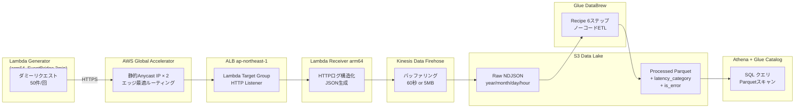

# global-accelerator-firehose-databrew-platform

> グローバルトラフィック最適化 × リアルタイムデータ取り込み × ノーコードETL Data Lake  
> AWS Global Accelerator × Kinesis Data Firehose × Glue DataBrew × Athena on Terraform

## アーキテクチャ図



## 主要コンポーネントの解説

### AWS Global Accelerator

- **静的Anycast IP**: グローバルに2つの固定IPを提供し、DNSに依存しない安定したエントリーポイントを実現
- **AWSバックボーンネットワーク**: パブリックインターネットを経由せず低レイテンシを実現
- **ヘルスチェック**: ALBが応答しなくなった場合の自動フェイルオーバー
- **フローログ**: エッジロケーション別のトラフィック分析が可能（S3に保存）

### Kinesis Data Firehose

- Lambda から直接S3に書くより**小ファイル問題を解消**（バッファリング60秒 or 5MB）
- 配信失敗時のエラーレコード自動保存
- 将来的なOpenSearch・Redshift連携への拡張性

### Glue DataBrew

- コード不要の240種以上の変換組み込み
- **TerraformでRecipeをIaC化** → 環境間の再現性を保証
- `latency_category`・`is_error` カラムを自動付与してAthena分析を簡素化

### CloudWatch オブザーバビリティ

- **統合ダッシュボード**: Global Accelerator / ALB / Lambda / Firehose / DataBrew を1画面で監視
- **Firehose配信アラーム**: 15分間S3配信が0件になると異常検知
- **ALB 5xxアラーム**: 1分間10件以上のエラーが2回連続で異常検知

## ハンズオン実行手順

このハンズオンは、次の順番で進めると迷いません。

1. ローカル準備
2. Lambda デプロイパッケージのビルド
3. Terraform 初期化と `plan`
4. Terraform `apply`
5. Global Accelerator / Firehose / Lambda の疎通確認
6. DataBrew の初回実行
7. Athena で分析確認
8. 終了後に `destroy`

### 事前準備

- Terraform `>= 1.6`
- AWS CLI v2
- Python `3.12`
- Docker（Apple Silicon / Linux 以外で arm64 向けに Lambda パッケージをビルドしたい場合）
- Terraform ステート保存用の S3 バケット 1 つ
- AWS 認証情報
  - `aws configure` 済み、または `AWS_PROFILE` / `AWS_ACCESS_KEY_ID` などが利用可能
  - 作業リージョンは `ap-northeast-1`

最初にプロジェクトルートで以下を確認します。

```bash
pwd
ls -la
```

### 1. Python venv を作成して有効化

このリポジトリでは、ローカル作業時に `venv` を使う前提です。

```bash
python3 -m venv .venv
source .venv/bin/activate
python --version
which python
```

`which python` が `.venv/bin/python` を指していればOKです。

### 2. Lambda デプロイパッケージをビルド

このプロジェクトの Lambda は `terraform/modules/lambda_receiver/receiver.zip` と `terraform/modules/lambda_generator/generator.zip` をデプロイします。先にビルドしてから Terraform を実行してください。

```bash
bash scripts/build_lambda.sh
```

ビルドが成功すると、次の 2 ファイルが生成されます。

- `terraform/modules/lambda_receiver/receiver.zip`
- `terraform/modules/lambda_generator/generator.zip`

`aws-lambda-powertools` を含むため、環境によっては arm64 でのビルドが安全です。`scripts/build_lambda.sh` に表示される Docker コマンド例をそのまま使えます。

### 3. 変数を決める

このハンズオンで最低限必要なのは次の 2 つです。

- `YOUR_ACCOUNT_ID`: デプロイ先 AWS アカウント ID
- `YOUR_STATE_BUCKET`: Terraform ステート保存用 S3 バケット名

取得例:

```bash
aws sts get-caller-identity --query Account --output text
```

以降の例では次を使います。

```bash
export AWS_REGION=ap-northeast-1
export TF_STATE_BUCKET=YOUR_STATE_BUCKET
export AWS_ACCOUNT_ID=YOUR_ACCOUNT_ID
```

### 4. Terraform を初期化する

```bash
cd terraform

terraform init \
  -backend-config="bucket=${TF_STATE_BUCKET}" \
  -backend-config="key=gaf/terraform.tfstate" \
  -backend-config="region=${AWS_REGION}"
```

### 5. `terraform plan` で確認する

`apply` の前に、作成される主なリソースを確認します。

```bash
terraform plan \
  -var="aws_account_id=${AWS_ACCOUNT_ID}" \
  -var="backend_bucket=${TF_STATE_BUCKET}"
```

ここで以下が見えていれば想定どおりです。

- VPC / Subnet / NAT Gateway
- ALB
- AWS Global Accelerator
- Lambda Receiver / Generator
- Kinesis Data Firehose
- S3 バケット 3 本
- Glue DataBrew / Glue Catalog / Athena Workgroup

### 6. `terraform apply` を実行する

以下はユーザー自身が実行してください。

```bash
terraform apply \
  -var="aws_account_id=${AWS_ACCOUNT_ID}" \
  -var="backend_bucket=${TF_STATE_BUCKET}"
```

デプロイ後、Global Accelerator が完全に反映されるまで数分かかることがあります。

### 7. まずは Terraform Output を確認する

```bash
terraform output accelerator_static_ips
terraform output accelerator_dns_name
terraform output raw_bucket_name
terraform output processed_bucket_name
terraform output databrew_job_name
terraform output athena_workgroup_name
terraform output cloudwatch_dashboard_url
```

確認ポイント:

- Global Accelerator の静的IPが 2 つ出力される
- Raw / Processed / Athena Results のバケット名が取得できる
- DataBrew Job 名と Athena Workgroup 名が取得できる

### 8. Lambda Generator の自動送信を待つ

Generator Lambda は EventBridge Scheduler により 3 分おきに 50 リクエスト送信します。すぐに確認したい場合は、AWS マネジメントコンソールから `gaf-dev-generator` を手動実行しても構いません。

この時点で期待する流れは次のとおりです。

1. Generator が Global Accelerator に HTTPS リクエストを送る
2. ALB 経由で Receiver Lambda が呼ばれる
3. Receiver が JSON ログを Firehose に送る
4. Firehose が 60 秒または 5 MB で Raw S3 にまとめて書き込む

### 9. Raw データが S3 に入ったことを確認する

Firehose は即時書き込みではないため、1 から 2 分ほど待ってから確認します。

```bash
aws s3 ls "s3://$(terraform output -raw raw_bucket_name)/logs/" --recursive | head -20
```

`logs/year=YYYY/month=MM/day=DD/hour=HH/` 配下にファイルが見えればOKです。

### 10. DataBrew を初回手動実行する

初回は Processed データをすぐ作るため、手動実行が分かりやすいです。デフォルトでは `gaf-dev-job` を使いますが、Terraform Output を渡すと確実です。

```bash
cd ..
bash scripts/run_databrew_job.sh "$(cd terraform && terraform output -raw databrew_job_name)"
```

このスクリプトは以下を自動で行います。

- DataBrew Job を開始
- 完了まで 30 秒ごとにポーリング
- 出力先 S3 パスを表示

### 11. Processed データを確認する

```bash
aws s3 ls "s3://$(cd terraform && terraform output -raw processed_bucket_name)/processed/" --recursive --human-readable
```

`.parquet` ファイルが出力されていれば、Raw NDJSON から Parquet への変換が成功しています。

### 12. Athena で分析する

まずデータベース名とワークグループ名を確認します。

```bash
cd terraform
terraform output glue_database_name
terraform output athena_workgroup_name
```

クエリ実行例:

```bash
aws athena start-query-execution \
  --region ap-northeast-1 \
  --work-group "$(terraform output -raw athena_workgroup_name)" \
  --query-string "SELECT path, COUNT(*) AS cnt FROM $(terraform output -raw glue_database_name).processed_logs GROUP BY path ORDER BY cnt DESC;"
```

追加で見ておくと理解しやすいクエリ例:

```sql
SELECT latency_category, COUNT(*) AS cnt
FROM gaf_dev_db.processed_logs
GROUP BY latency_category
ORDER BY cnt DESC;
```

```sql
SELECT is_error, COUNT(*) AS cnt
FROM gaf_dev_db.processed_logs
GROUP BY is_error;
```

### 13. CloudWatch ダッシュボードを確認する

```bash
terraform output cloudwatch_dashboard_url
```

ダッシュボードでは、少なくとも次を確認できます。

- ALB の RequestCount
- Lambda Receiver / Generator の Invocations と Errors
- Firehose の S3 配信メトリクス

### 14. つまずきやすいポイント

- `terraform plan` で zip ファイルが見つからない
  - `bash scripts/build_lambda.sh` を先に実行してください
- Raw S3 にすぐファイルが出ない
  - Firehose のバッファリング仕様です。1 から 2 分ほど待ちます
- Processed データが空
  - 先に Raw S3 にログが入っているか確認してから DataBrew Job を実行します
- Global Accelerator への疎通が不安定
  - デプロイ直後は反映待ちのことがあります。数分待って再確認します

### CI/CD

PRを作成すると GitHub Actions が自動的に以下を実行します:

1. `terraform fmt -check` — フォーマット検証
2. `terraform validate` — 構文検証
3. `terraform plan` — 変更内容をPRコメントに自動投稿

**必要なGitHub Secrets:**

| Secret名 | 説明 |
|---|---|
| `AWS_ROLE_ARN` | GitHub Actions OIDC用IAMロールARN |
| `TF_STATE_BUCKET` | Terraformステート用S3バケット名 |
| `AWS_ACCOUNT_ID` | AWSアカウントID |

## データスキーマ

### Raw ログ（S3 Raw、NDJSON形式）

```json
{
  "request_id": "uuid4",
  "timestamp": "2024-01-01T00:00:00Z",
  "source_ip": "203.0.113.1",
  "source_region": "us-east-1",
  "method": "GET",
  "path": "/api/users",
  "status_code": 200,
  "latency_ms": 145,
  "user_agent": "Mozilla/5.0...",
  "accelerator_ip": "75.2.57.134",
  "edge_location": "NRT"
}
```

### Processed データ（S3 Processed、Parquet形式）

上記に加えてDataBrewが付与するカラム:

| カラム名 | 型 | 説明 |
|---|---|---|
| `latency_category` | string | `fast`(<100ms) / `normal`(100-500ms) / `slow`(>500ms) |
| `is_error` | boolean | `status_code >= 400` の場合 true |
| `processed_at` | timestamp | DataBrew実行時刻 |

## Cost Estimate & Cleanup

| サービス | 月額概算 |
|---|---|
| Global Accelerator | ~$18（固定 + 転送量） |
| ALB | ~$16（最低料金） |
| Lambda × 2 | < $1 |
| Kinesis Firehose | < $1 |
| Glue DataBrew | < $2 |
| S3 × 3 | < $1 |
| **合計** | **~$38/月** |

> ⚠️ **Global AcceleratorとALBが固定コストとして高め。ハンズオン後は速やかにDestroyしてください。**

```bash
cd terraform
terraform destroy \
  -var="aws_account_id=${AWS_ACCOUNT_ID}" \
  -var="backend_bucket=${TF_STATE_BUCKET}"
```

## Architecture Decisions

### なぜ Global Accelerator を使うか

CloudFrontは静的コンテンツのキャッシュが目的だが、Global AcceleratorはTCP/UDP最適化が目的。  
ALBへのルーティングをAWSバックボーン経由にすることで、アジア・欧米からのAPIレイテンシを削減できる。

### なぜ Firehose を Lambda の間に挟むか

Lambda から直接 `s3:PutObject` すると1リクエスト=1ファイルになりS3の小ファイル問題が発生する。  
Firehoseのバッファリングにより複数レコードをまとめて書き込み、S3コストとAthenaスキャンコストを削減する。

### なぜ DataBrew を使うか（IaC との組み合わせ）

DataBrewはGUIベースのノーコードETLだが、RecipeをTerraformでコード化することで「ノーコードの使いやすさ」と「IaCの再現性」を両立させている。  
これにより開発環境で作ったレシピを本番環境に確実に適用できる。

## 学習ポイント

1. **Global Accelerator vs CloudFront**: 静的コンテンツキャッシュではなく TCP/UDP最適化が目的
2. **Firehose バッファ戦略**: 小ファイル問題・コスト・鮮度のトレードオフ
3. **DataBrew Recipe の IaC化**: ノーコードをコードで再現する価値
4. **Athena パーティション**: Hive形式プレフィックスでスキャンコスト削減
5. **OIDC認証**: GitHubシークレットにアクセスキーを置かないCI/CDのベストプラクティス

---

*Managed by Terraform | Region: ap-northeast-1 | Owner: takuya*
