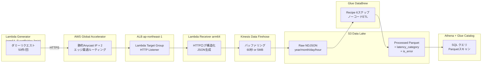

# global-accelerator-firehose-databrew-platform

> グローバルトラフィック最適化 × リアルタイムデータ取り込み × ノーコードETL Data Lake  
> AWS Global Accelerator × Kinesis Data Firehose × Glue DataBrew × Athena on Terraform

## アーキテクチャ図



## 主要コンポーネントの解説

### AWS Global Accelerator

- **静的Anycast IP**: グローバルに2つの固定IPを提供し、DNSに依存しない安定したエントリーポイントを実現
- **AWSバックボーンネットワーク**: パブリックインターネットを経由せず低レイテンシを実現
- **ヘルスチェック**: ALBが応答しなくなった場合の自動フェイルオーバー
- **フローログ**: エッジロケーション別のトラフィック分析が可能（S3に保存）

### Kinesis Data Firehose

- Lambda から直接S3に書くより**小ファイル問題を解消**（バッファリング60秒 or 5MB）
- 配信失敗時のエラーレコード自動保存
- 将来的なOpenSearch・Redshift連携への拡張性

### Glue DataBrew

- コード不要の240種以上の変換組み込み
- **TerraformでRecipeをIaC化** → 環境間の再現性を保証
- `latency_category`・`is_error` カラムを自動付与してAthena分析を簡素化

### CloudWatch オブザーバビリティ

- **統合ダッシュボード**: Global Accelerator / ALB / Lambda / Firehose / DataBrew を1画面で監視
- **Firehose配信アラーム**: 15分間S3配信が0件になると異常検知
- **ALB 5xxアラーム**: 1分間10件以上のエラーが2回連続で異常検知

## Getting Started

### Prerequisites

- Terraform >= 1.6
- AWS CLI v2
- Python 3.12（Lambdaビルド用）
- S3バケット（Terraformステート管理用）

### Deploy

```bash
# 1. Lambdaパッケージをビルド
bash scripts/build_lambda.sh

# 2. インフラをデプロイ
cd terraform
terraform init \
  -backend-config="bucket=YOUR_STATE_BUCKET" \
  -backend-config="key=gaf/terraform.tfstate" \
  -backend-config="region=ap-northeast-1"

terraform apply \
  -var="aws_account_id=YOUR_ACCOUNT_ID" \
  -var="backend_bucket=YOUR_STATE_BUCKET"

# 3. DataBrewジョブを手動実行（最初のデータ変換）
bash scripts/run_databrew_job.sh
```

### Verify

```bash
# Global Accelerator の静的IPを確認
terraform output accelerator_static_ips

# S3 Rawにデータが蓄積されているか確認（Firehoseバッファ後 = 約1〜2分）
aws s3 ls s3://$(terraform output -raw raw_bucket_name)/logs/ --recursive | head -20

# Athena でクエリ実行
aws athena start-query-execution \
  --query-string "SELECT path, COUNT(*) as cnt FROM gaf_db.processed_logs GROUP BY path ORDER BY cnt DESC" \
  --work-group gaf-dev-workgroup \
  --region ap-northeast-1
```

### CI/CD

PRを作成すると GitHub Actions が自動的に以下を実行します:

1. `terraform fmt -check` — フォーマット検証
2. `terraform validate` — 構文検証
3. `terraform plan` — 変更内容をPRコメントに自動投稿

**必要なGitHub Secrets:**

| Secret名 | 説明 |
|---|---|
| `AWS_ROLE_ARN` | GitHub Actions OIDC用IAMロールARN |
| `TF_STATE_BUCKET` | Terraformステート用S3バケット名 |
| `AWS_ACCOUNT_ID` | AWSアカウントID |

## データスキーマ

### Raw ログ（S3 Raw、NDJSON形式）

```json
{
  "request_id": "uuid4",
  "timestamp": "2024-01-01T00:00:00Z",
  "source_ip": "203.0.113.1",
  "source_region": "us-east-1",
  "method": "GET",
  "path": "/api/users",
  "status_code": 200,
  "latency_ms": 145,
  "user_agent": "Mozilla/5.0...",
  "accelerator_ip": "75.2.57.134",
  "edge_location": "NRT"
}
```

### Processed データ（S3 Processed、Parquet形式）

上記に加えてDataBrewが付与するカラム:

| カラム名 | 型 | 説明 |
|---|---|---|
| `latency_category` | string | `fast`(<100ms) / `normal`(100-500ms) / `slow`(>500ms) |
| `is_error` | boolean | `status_code >= 400` の場合 true |
| `processed_at` | timestamp | DataBrew実行時刻 |

## Cost Estimate & Cleanup

| サービス | 月額概算 |
|---|---|
| Global Accelerator | ~$18（固定 + 転送量） |
| ALB | ~$16（最低料金） |
| Lambda × 2 | < $1 |
| Kinesis Firehose | < $1 |
| Glue DataBrew | < $2 |
| S3 × 3 | < $1 |
| **合計** | **~$38/月** |

> ⚠️ **Global AcceleratorとALBが固定コストとして高め。ハンズオン後は速やかにDestroyしてください。**

```bash
cd terraform && terraform destroy \
  -var="aws_account_id=YOUR_ACCOUNT_ID" \
  -var="backend_bucket=YOUR_STATE_BUCKET"
```

## Architecture Decisions

### なぜ Global Accelerator を使うか

CloudFrontは静的コンテンツのキャッシュが目的だが、Global AcceleratorはTCP/UDP最適化が目的。  
ALBへのルーティングをAWSバックボーン経由にすることで、アジア・欧米からのAPIレイテンシを削減できる。

### なぜ Firehose を Lambda の間に挟むか

Lambda から直接 `s3:PutObject` すると1リクエスト=1ファイルになりS3の小ファイル問題が発生する。  
Firehoseのバッファリングにより複数レコードをまとめて書き込み、S3コストとAthenaスキャンコストを削減する。

### なぜ DataBrew を使うか（IaC との組み合わせ）

DataBrewはGUIベースのノーコードETLだが、RecipeをTerraformでコード化することで「ノーコードの使いやすさ」と「IaCの再現性」を両立させている。  
これにより開発環境で作ったレシピを本番環境に確実に適用できる。

## 学習ポイント

1. **Global Accelerator vs CloudFront**: 静的コンテンツキャッシュではなく TCP/UDP最適化が目的
2. **Firehose バッファ戦略**: 小ファイル問題・コスト・鮮度のトレードオフ
3. **DataBrew Recipe の IaC化**: ノーコードをコードで再現する価値
4. **Athena パーティション**: Hive形式プレフィックスでスキャンコスト削減
5. **OIDC認証**: GitHubシークレットにアクセスキーを置かないCI/CDのベストプラクティス

---

*Managed by Terraform | Region: ap-northeast-1 | Owner: takuya*
