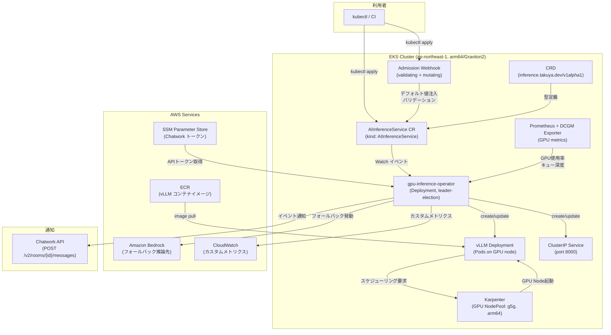
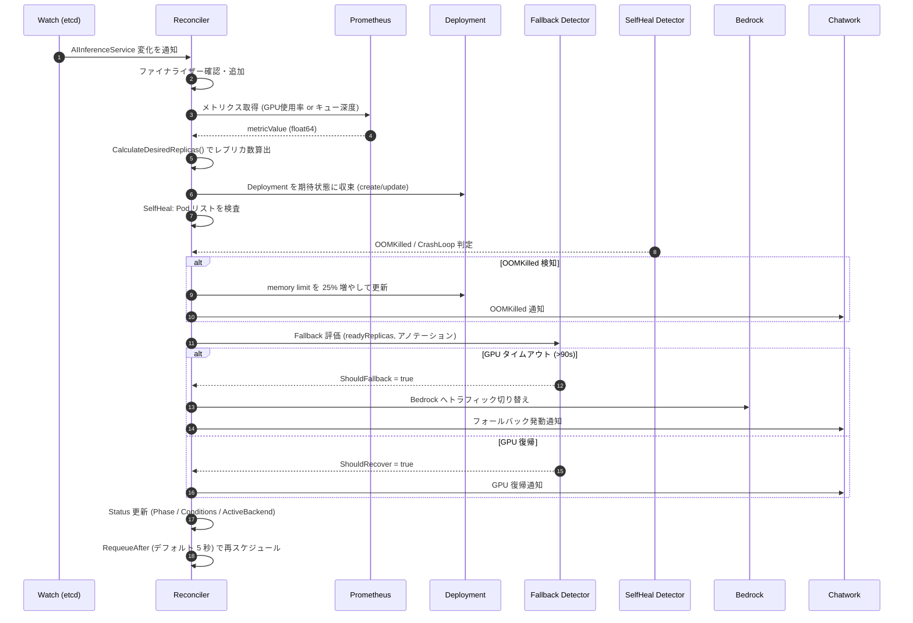
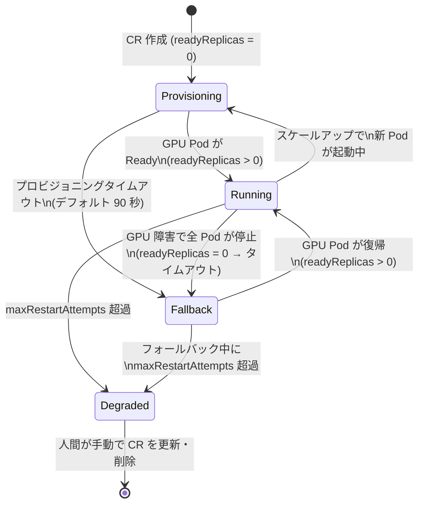
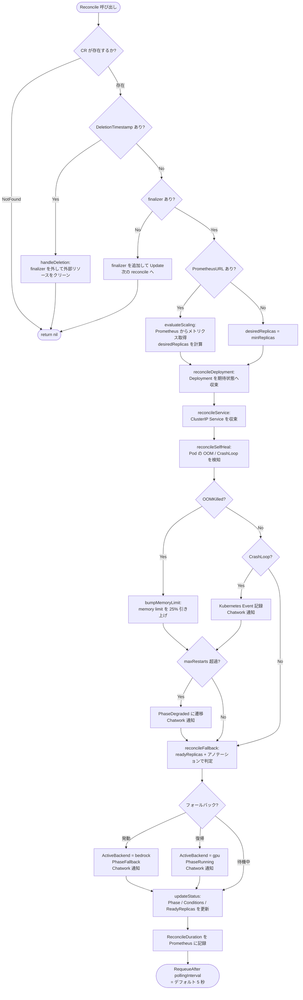
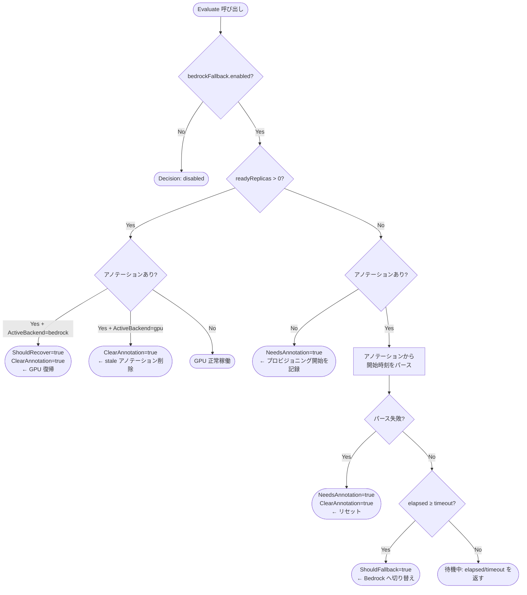
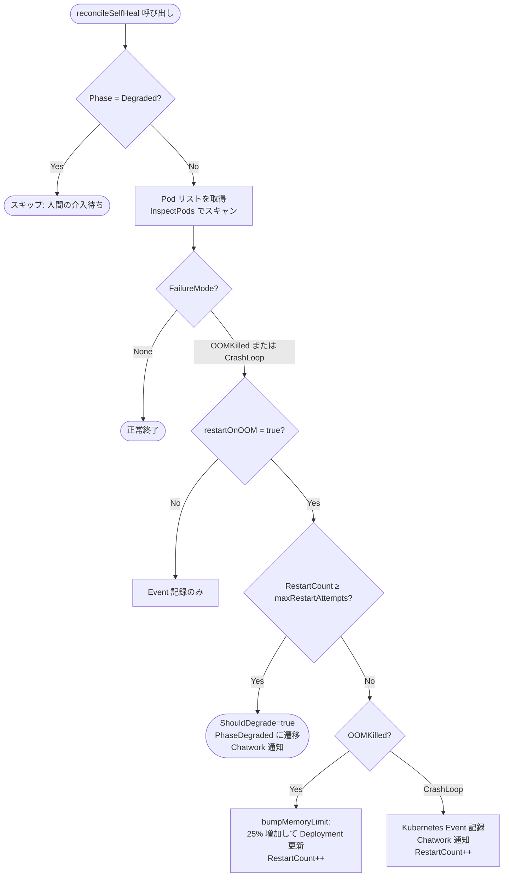
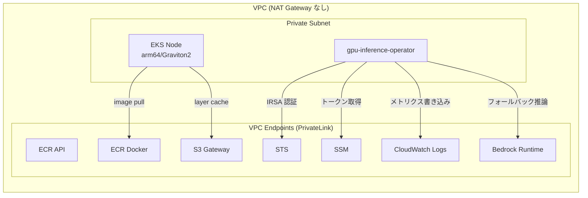
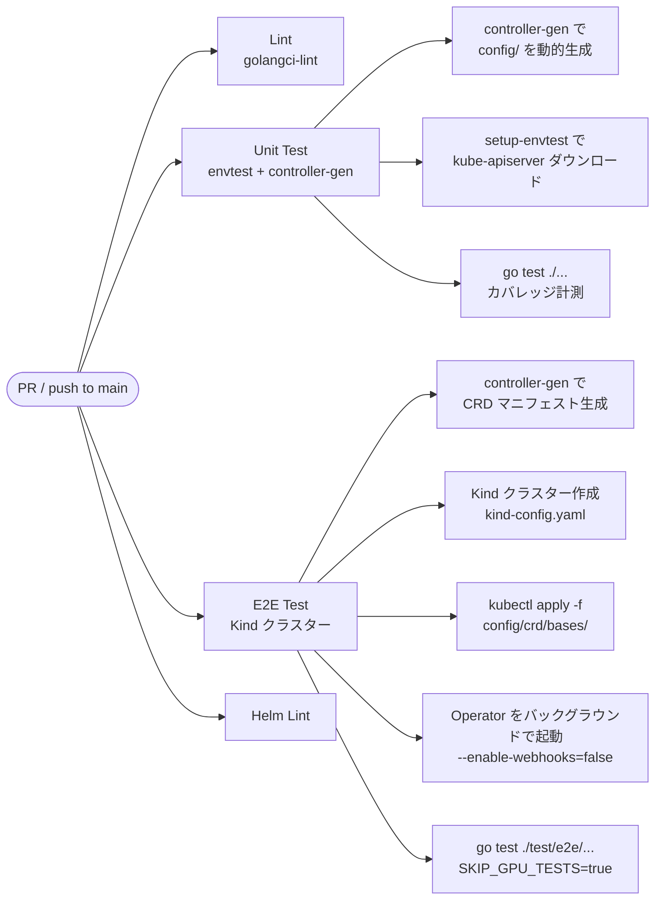
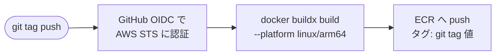

# ARCHITECTURE.md — gpu-inference-operator-lab

> **このドキュメントの目的**: コードを読まなくてもシステム全体を理解できる完全な技術リファレンス。
> 設計判断の「なぜ」と、各コンポーネントが「どうつながっているか」を中心に記述する。

---

## 目次

1. [プロジェクト概要](#1-プロジェクト概要)
2. [システム全体図](#2-システム全体図)
3. [CRD設計 — AIInferenceService](#3-crd設計--aiinferenceservice)
4. [Reconcileループ](#4-reconcileループ)
5. [カスタムオートスケーリング](#5-カスタムオートスケーリング)
6. [Bedrockフォールバック](#6-bedrockフォールバック)
7. [自己修復ロジック](#7-自己修復ロジック)
8. [Admission Webhook](#8-admission-webhook)
9. [オブザーバビリティ](#9-オブザーバビリティ)
10. [インフラ構成 (Terraform)](#10-インフラ構成-terraform)
11. [テスト戦略](#11-テスト戦略)
12. [CI/CDパイプライン](#12-cicdパイプライン)
13. [ディレクトリ構成](#13-ディレクトリ構成)
14. [設計判断まとめ (ADR早見表)](#14-設計判断まとめ-adr早見表)

---

## 1. プロジェクト概要

### 何を作るか

AI推論ワークロード (vLLM on EKS) のライフサイクル管理を担う **カスタム Kubernetes Operator** を Go でゼロから実装する。

既存ツール (KEDA / CloudWatch Alarm) を「使う」のではなく、その裏側にある仕組みを自分で実装して定量比較することが目的。

### 何を証明するか

| 仮説 | 測定指標 | 比較対象 |
|---|---|---|
| カスタムコントローラーは KEDA より速くスケーリングできる | スケーリング反応時間 (ms) | KEDA: ポーリング 15 秒 |
| GPU コールドスタート中に Bedrock へ自動フォールバックするとレイテンシが改善する | フォールバック継続時間、エンドユーザーレイテンシ | フォールバックなし |
| OOMKilled / CrashLoop を自動検知・修復すると MTTR が短縮する | 平均復旧時間 (MTTR) | 手動対応 |

### 隣接プロジェクトとの関係

```
eks-ai-inference-platform    ← ツールを組み合わせて動かすプロジェクト
                               (vLLM + Karpenter + KEDA + 観測基盤)

gpu-inference-operator-lab   ← コントローラー自体を書くプロジェクト (本リポジトリ)
                               カスタム CRD + Reconcile ループ + Webhook
```

---

## 2. システム全体図

### 2-1. コンポーネント全体



### 2-2. Reconcile ループのデータフロー



---

## 3. CRD設計 — AIInferenceService

**API グループ**: `inference.takuya.dev/v1alpha1`  
**Kind**: `AIInferenceService` (短縮形: `ais`)

### 3-1. Spec フィールド一覧

```yaml
apiVersion: inference.takuya.dev/v1alpha1
kind: AIInferenceService
metadata:
  name: llama-3-8b
  namespace: default
spec:
  # ─── 必須フィールド ───────────────────────────────────
  modelImage: "123456789012.dkr.ecr.ap-northeast-1.amazonaws.com/vllm:v0.4.0"
  # ECR 上の vLLM コンテナイメージ URI

  gpuNodePoolRef: "karpenter-gpu-g5g"
  # Karpenter NodePool 名。Deployment の nodeSelector に使われる

  minReplicas: 0     # scale-to-zero を許可する場合は 0 (≥0)
  maxReplicas: 4     # 上限レプリカ数 (≥1)

  scalingMetric:
    type: queueDepth          # queueDepth | gpuUtilization
    targetValue: 10           # 1レプリカあたりの目標値 (≥1)
    prometheusURL: "http://prometheus:9090"  # 空の場合はスケーリング無効
    pollingIntervalSeconds: 5               # デフォルト 5 秒 (KEDA の 15 秒より短い)
    queueName: "inference-queue"            # type=queueDepth の場合のみ必須

  # ─── オプションフィールド ──────────────────────────────
  bedrockFallback:
    enabled: true
    modelId: "anthropic.claude-3-haiku-20240307-v1:0"
    gpuProvisionTimeoutSeconds: 90   # デフォルト 90 秒 (30〜600)

  selfHealing:
    restartOnOOM: true
    maxRestartAttempts: 3    # 超過すると PhaseDegraded へ遷移 (1〜10)

  resources:
    requests:
      cpu: "4"
      memory: "16Gi"
      nvidia.com/gpu: "1"
    limits:
      cpu: "8"
      memory: "32Gi"
      nvidia.com/gpu: "1"
```

### 3-2. Status フィールド一覧

```yaml
status:
  phase: Running          # Running | Provisioning | Fallback | Degraded
  activeBackend: gpu      # gpu | bedrock
  readyReplicas: 2
  restartCount: 0         # 自己修復アクションの累計回数
  lastScaleTime: "2026-09-20T10:30:00Z"

  conditions:
    - type: Ready
      status: "True"
      reason: Running
      message: "vLLM inference is running on GPU"
      lastTransitionTime: "2026-09-20T10:00:00Z"

    - type: Provisioning
      status: "False"
      reason: Running
      message: "GPU node provisioning complete"

    - type: Fallback
      status: "False"
      reason: GPURecovered
      message: "GPU pods are ready, traffic returned from Bedrock to GPU"

    - type: Scaled
      status: "True"
      reason: MetricsBasedScaling
      message: "scaled to 3 replicas (metric=87.50, reason=proportional scaling)"

    - type: Degraded
      status: "False"
      reason: Healthy
```

### 3-3. Phase ステートマシン



---

## 4. Reconcileループ

### 4-1. 実装の場所

```
controllers/aiinferenceservice_controller.go  (719 行)
```

### 4-2. Reconcile 関数の処理順序



### 4-3. 冪等性の保証

Reconcile は何度呼ばれても同じ結果を返す必要がある。実装上の工夫:

| 操作 | 冪等性の実現方法 |
|---|---|
| Deployment 作成 | `Get → IsNotFound → Create` / 存在する場合は差分確認後 `Update` |
| Service 作成 | 同上 |
| ファイナライザー追加 | `ContainsFinalizer` で存在確認後に追加 |
| アノテーション設定 | コントローラーが唯一の書き込み者 (Detector は読み取りのみ) |
| Status 更新 | `Status().Update()` で Status Subresource のみ更新 (Spec を上書きしない) |

### 4-4. RequeueAfter によるポーリング

```
┌─────────────────────────────────────────────────────────────┐
│  Event-driven Watch (CRD/Deployment/Service 変化)           │
│  + RequeueAfter 5 秒 (メトリクスポーリング)                 │
│                                                              │
│  KEDA との違い:                                             │
│  KEDA は ScaledObject Controller が 15 秒ごとに外部から     │
│  HPA を操作する。本実装は AIS Reconciler が自律的に         │
│  メトリクス取得 → スケーリング → Status 更新まで担う。     │
└─────────────────────────────────────────────────────────────┘
```

---

## 5. カスタムオートスケーリング

### 5-1. 実装の場所

```
internal/scaling/calculator.go  — スケーリング計算ロジック
internal/scaling/metrics.go     — Prometheus メトリクス取得
```

### 5-2. スケーリング判定アルゴリズム

```
入力:
  metricValue    = Prometheus から取得した実測値 (float64)
  targetValue    = 1 レプリカあたりの目標値 (Spec.ScalingMetric.TargetValue)
  currentReplicas = 現在の Deployment.Spec.Replicas
  minReplicas    = Spec.MinReplicas
  maxReplicas    = Spec.MaxReplicas

アルゴリズム:

1. metricValue ≤ 0  →  desiredReplicas = minReplicas  (負荷ゼロ)

2. 通常スケールアップ:
   desiredReplicas = ceil(metricValue / targetValue)
   例: GPU使用率=85%, target=40 → ceil(85/40) = ceil(2.125) = 3 レプリカ

3. ヒステリシス (スケールダウン抑制):
   desired < current の場合のみ発動
   projectedLoad = metricValue / current × (current - 1)
   if projectedLoad > targetValue × 0.7:
       desired = current  (スケールダウン見送り)
   
   例: 3台でGPU使用率=75%, target=40
   → 2台なら 75/3×2 = 50 > 40×0.7=28  → ダウン見送り

4. クランプ: desired = clamp(desired, minReplicas, maxReplicas)
```

### 5-3. サポートするメトリクスタイプ

| type | Prometheus クエリ例 | 用途 |
|---|---|---|
| `gpuUtilization` | `DCGM_FI_DEV_GPU_UTIL{pod=~"<name>.*"}` | GPU 負荷に応じてスケール |
| `queueDepth` | `sqs_queue_approximate_number_of_messages_visible{queue="<name>"}` | SQS キュー積み残しに応じてスケール |

### 5-4. KEDA との比較

```
KEDA (ScaledObject):
  ┌──────────────┐  15秒ごとにポーリング  ┌────────────┐
  │ KEDA Operator│ ──────────────────────> │ Prometheus │
  └──────────────┘                         └────────────┘
         │ HPA を更新
         ▼
  ┌──────────────┐
  │     HPA      │ → Deployment のレプリカを変更
  └──────────────┘

本実装 (AIInferenceService Reconciler):
  ┌──────────────────────────┐  5秒ごとにポーリング   ┌────────────┐
  │ AIS Reconciler           │ ──────────────────────> │ Prometheus │
  │ (メトリクス取得 +         │                         └────────────┘
  │  スケーリング判定 +       │
  │  Deployment 更新 を一体化)│ → Deployment.Spec.Replicas を直接更新
  └──────────────────────────┘
```

---

## 6. Bedrockフォールバック

### 6-1. 実装の場所

```
internal/fallback/detector.go                — 判定ロジック (純粋関数)
controllers/aiinferenceservice_controller.go — reconcileFallback() でアノテーション管理
```

### 6-2. フォールバック判定ロジック



### 6-3. アノテーション設計

| アノテーションキー | 値の例 | 役割 |
|---|---|---|
| `inference.takuya.dev/provisioning-start-time` | `"2026-09-20T10:00:00Z"` | GPU プロビジョニング開始時刻 |

**なぜ etcd アノテーションに保存するか:**

- Kubernetes Events はデフォルト 1 時間で消える
- Operator が再起動しても etcd に永続化されているため正確な経過時間を計算できる
- Karpenter NodeClaim の status フィールドは API が安定していないため使わない

### 6-4. タイムライン例 (gpuProvisionTimeoutSeconds: 90)

```
t=0s    CR 作成 → Karpenter が g5g Node のプロビジョニング開始
        アノテーション: provisioning-start-time = t0
        Status: Phase=Provisioning

t=30s   Reconcile: elapsed=30s < 90s → 待機継続

t=60s   Reconcile: elapsed=60s < 90s → 待機継続

t=90s   Reconcile: elapsed=90s ≥ 90s
        → ShouldFallback=true
        → Status: Phase=Fallback, ActiveBackend=bedrock
        → Chatwork 通知: "フォールバック発動 (90秒経過)"

t=300s  Karpenter が GPU Node を起動完了
        readyReplicas > 0 になる

t=305s  Reconcile: readyReplicas=1, アノテーションあり, ActiveBackend=bedrock
        → ShouldRecover=true
        → アノテーション削除
        → Status: Phase=Running, ActiveBackend=gpu
        → Chatwork 通知: "GPU 復帰"
        → BedrockFallbackDuration.Observe(215s)
```

---

## 7. 自己修復ロジック

### 7-1. 実装の場所

```
internal/selfheal/detector.go                — 判定ロジック (純粋関数)
controllers/aiinferenceservice_controller.go — reconcileSelfHeal() で実行
```

### 7-2. 対象障害パターン

| 障害種別 | 検知シグナル | 自動アクション |
|---|---|---|
| `OOMKilled` | `cs.State.Terminated.Reason == "OOMKilled"` または `cs.LastTerminationState.Terminated.Reason == "OOMKilled"` | Deployment の memory limit を **25% 引き上げて** rolling update |
| `CrashLoopBackOff` | `cs.State.Waiting.Reason` に `"CrashLoopBackOff"` を含む | Kubernetes Event 記録 + Chatwork 通知 (再起動は行わない) |

### 7-3. 修復の意思決定フロー



### 7-4. OOMKilled 対応の詳細

```
現在の memory limit: X Mi
→ 新しい memory limit: X × 125 / 100 Mi

例:
  初期: Resources 未設定 → デフォルト 8192 Mi からスタート
  1回目 OOM: 8192 × 1.25 = 10240 Mi
  2回目 OOM: 10240 × 1.25 = 12800 Mi
  3回目 OOM: maxRestartAttempts(3) 超過 → PhaseDegraded
```

**なぜ単純再起動ではなく limit 変更をするか:**  
同じ memory limit で再起動しても即座に再度 OOM になる。limit を先に上げてから Deployment を rolling update することで根本対処できる。

---

## 8. Admission Webhook

### 8-1. 実装の場所

```
webhooks/aiinferenceservice_webhook.go
```

### 8-2. Mutating Webhook (デフォルト値注入)

CR に未設定のオプションフィールドへデフォルト値を注入する。Spec のデフォルト値をコントローラー側に分散させないためここで一元管理する。

| フィールド | デフォルト値 | 理由 |
|---|---|---|
| `scalingMetric.pollingIntervalSeconds` | `5` | KEDA の 15 秒より短い反応速度を実現するため |
| `bedrockFallback.gpuProvisionTimeoutSeconds` | `90` | g5g コールドスタート実測値 (3〜5 分) より短くユーザー体験を優先 |
| `selfHealing.maxRestartAttempts` | `3` | 1回=ノイズ / 2回=一過性 / 3回超=設定問題と判断できる |
| `resources` | GPU: `nvidia.com/gpu: "1"` | webhook で GPU resource を確実に指定させ Karpenter の NodeSelector と整合させる |

### 8-3. Validating Webhook

| 検証ルール | エラーメッセージ例 |
|---|---|
| `minReplicas ≤ maxReplicas` | `"minReplicas (3) must be ≤ maxReplicas (2)"` |
| `resources.limits` に `nvidia.com/gpu` が必須 | `"resources.limits must specify nvidia.com/gpu"` |
| `scalingMetric.type = queueDepth` のとき `queueName` が必須 | `"queueName must be set when type=queueDepth"` |

### 8-4. Webhook の有効化条件

| 環境 | Webhook | 理由 |
|---|---|---|
| EKS 本番 | 有効 (cert-manager で TLS) | セキュリティ・デフォルト値保証 |
| Kind / CI | 無効 (`--enable-webhooks=false`) | cert-manager なしで動作させるため |

---

## 9. オブザーバビリティ

### 9-1. 実装の場所

```
internal/metrics/metrics.go
```

### 9-2. カスタム Prometheus メトリクス一覧

| メトリクス名 | 種別 | ラベル | 用途 |
|---|---|---|---|
| `gpu_inference_operator_reconcile_duration_seconds` | Histogram | `namespace`, `name`, `phase` | reconcile レイテンシ (p50/p95/p99) |
| `gpu_inference_operator_reconcile_errors_total` | Counter | `namespace`, `name`, `reason` | エラー種別の発生頻度 |
| `gpu_inference_operator_selfheal_actions_total` | Counter | `namespace`, `name`, `action` | 自己修復アクション回数 |
| `gpu_inference_operator_bedrock_fallback_total` | Counter | `namespace`, `name`, `direction` | フォールバック切替回数 |
| `gpu_inference_operator_bedrock_fallback_duration_seconds` | Histogram | `namespace`, `name` | フォールバック継続時間 |

### 9-3. ダッシュボードで見るべき指標

```
1. 反応速度の証明:
   gpu_inference_operator_reconcile_duration_seconds{phase="Running"} のp99
   → KEDA の 15 秒と比較して何秒か

2. フォールバックの有効性:
   gpu_inference_operator_bedrock_fallback_duration_seconds のメディアン
   → SLO: 中央値 90 秒以下

3. 自己修復の効果:
   gpu_inference_operator_selfheal_actions_total{action="degraded"}
   → この値が増えると人間介入が必要なケースが多い

4. エラー傾向:
   gpu_inference_operator_reconcile_errors_total の reason ラベル別グラフ
   → MetricsFetchFailed が多い → Prometheus 接続問題
   → DeploymentReconcileFailed が多い → RBAC / リソース不足
```

### 9-4. Chatwork 通知イベント一覧

| イベント | 通知タイミング | 重要度 |
|---|---|---|
| フォールバック発動 | GPU タイムアウト検知時 | 警告 |
| GPU 復帰 | readyReplicas > 0 で Bedrock から切り戻し | 情報 |
| OOMKilled 検知 | OOM Pod 検知 → memory bump 実行時 | 警告 |
| CrashLoopBackOff 検知 | CrashLoop Pod 検知時 | 警告 |
| PhaseDegraded 遷移 | maxRestartAttempts 超過時 | **緊急** |

---

## 10. インフラ構成 (Terraform)

### 10-1. モジュール構成

```
terraform/
├── environments/dev/          # dev 環境の変数・backend 設定
└── modules/
    ├── vpc/                   # VPC (NAT Gateway なし、VPC Endpoint のみ)
    ├── eks/                   # EKS クラスター (arm64/Graviton2)
    ├── karpenter/             # GPU NodePool (g5g, spot, arm64)
    ├── iam/                   # IRSA ロール (Operator 用)
    └── github-oidc/           # GitHub Actions OIDC プロバイダー
```

### 10-2. ネットワーク設計



**NAT Gateway を使わない理由:** コスト削減 ($0.045/GB のデータ転送費を完全排除) かつ VPC Endpoint の方が低レイテンシ。

### 10-3. IAM 設計原則

```hcl
# Operator 用 IRSA ロールのポリシー (最小権限)
{
  "Statement": [
    // Bedrock 推論: 特定モデル ARN に限定
    { "Action": ["bedrock:InvokeModel"],
      "Resource": "arn:aws:bedrock:ap-northeast-1::foundation-model/<model-id>" },

    // SSM: Chatwork トークンのパスのみ
    { "Action": ["ssm:GetParameter"],
      "Resource": "arn:aws:ssm:ap-northeast-1:*:parameter/gpu-inference-operator-lab/*" },

    // CloudWatch: 自プロジェクトの Namespace のみ (Condition で制限)
    { "Action": ["cloudwatch:PutMetricData"],
      "Resource": "*",  // AWS 側の制約で * 必須
      "Condition": { "cloudwatch:namespace": "GPUInferenceOperator" } }
  ]
}
```

### 10-4. Karpenter GPU NodePool 設計

```yaml
# karpenter NodePool (g5g 系: arm64 + NVIDIA T4G GPU)
spec:
  template:
    spec:
      requirements:
        - key: karpenter.sh/capacity-type
          operator: In
          values: ["spot"]          # コスト最適化: スポットインスタンス優先
        - key: node.kubernetes.io/instance-type
          operator: In
          values: ["g5g.xlarge", "g5g.2xlarge"]  # arm64 GPU インスタンス
        - key: kubernetes.io/arch
          operator: In
          values: ["arm64"]
  disruption:
    consolidationPolicy: WhenEmpty  # 空き GPU ノードを自動削除
```

---

## 11. テスト戦略

### 11-1. テスト階層

```
┌──────────────────────────────────────────────────────────┐
│  E2E Test (Kind)                                         │
│  test/e2e/e2e_test.go                                    │
│  - CRD 適用 → CR 作成 → Deployment 生成を実クラスターで確認  │
│  - GPU 依存部分は SKIP_GPU_TESTS=true でモック             │
├──────────────────────────────────────────────────────────┤
│  Controller Unit Test (envtest)                          │
│  controllers/aiinferenceservice_controller_test.go       │
│  - インプロセス kube-apiserver に対して Reconcile を実行   │
│  - Deployment/Service の生成・更新を検証                   │
├──────────────────────────────────────────────────────────┤
│  Internal Package Unit Test                              │
│  internal/scaling/calculator_test.go                     │
│  internal/fallback/detector_test.go                      │
│  internal/selfheal/detector_test.go                      │
│  - 純粋関数のため fake client 不要、高速に実行できる         │
├──────────────────────────────────────────────────────────┤
│  Webhook Test                                            │
│  webhooks/aiinferenceservice_webhook_test.go             │
│  - デフォルト値注入・バリデーションルールを検証               │
└──────────────────────────────────────────────────────────┘
```

### 11-2. 純粋関数アーキテクチャの利点

Detector 系コンポーネント (fallback.Detector / selfheal.Detector) を **純粋関数** として設計した理由:

```go
// Kubernetes API への依存がないためテストがシンプル
func TestFallbackTimeout(t *testing.T) {
    ais := &v1alpha1.AIInferenceService{...}
    ais.Annotations = map[string]string{
        fallback.AnnotationProvisioningStart: time.Now().Add(-100*time.Second).Format(time.RFC3339),
    }
    d := fallback.NewDetector()
    decision := d.Evaluate(ais, 0)  // readyReplicas=0

    // fake client なしでタイムアウト判定を検証できる
    assert.True(t, decision.ShouldFallback)
}
```

### 11-3. envtest の設定

```go
// 実際の kube-apiserver + etcd をインプロセスで起動
testEnv = &envtest.Environment{
    CRDDirectoryPaths: []string{filepath.Join("..", "config", "crd", "bases")},
    ErrorIfCRDPathMissing: true,
    BinaryAssetsDirectory: "/tmp/k8s/1.31.0",
}
```

---

## 12. CI/CDパイプライン

### 12-1. ワークフロー構成

```
.github/workflows/
├── ci.yml       — PR/push 時に自動実行: lint → unit-test → e2e → helm-lint
└── release.yml  — タグ push 時に arm64 イメージをビルドして ECR へ push
```

### 12-2. ci.yml のジョブ構成



### 12-3. release.yml の処理



**OIDC 認証のフロー:**

```
GitHub Actions runner
  → OIDC トークン発行 (audience: sts.amazonaws.com)
  → aws sts assume-role-with-web-identity
  → 一時クレデンシャル取得
  → ECR へ push

IAM アクセスキーは一切使わない
```

---

## 13. ディレクトリ構成

```
gpu-inference-operator-lab/
│
├── main.go                            # Operator エントリポイント
│   └── Manager 起動 / Webhook 登録 / リーダー選出設定
│
├── api/v1alpha1/
│   ├── aiinferenceservice_types.go    # CRD Spec/Status 型定義
│   ├── groupversion_info.go           # API グループ: inference.takuya.dev
│   └── zz_generated.deepcopy.go      # controller-gen が自動生成 (編集禁止)
│
├── controllers/
│   ├── aiinferenceservice_controller.go   # Reconcile ループ本体 (719 行)
│   ├── aiinferenceservice_controller_test.go
│   └── suite_test.go                      # envtest セットアップ
│
├── webhooks/
│   ├── aiinferenceservice_webhook.go      # Mutating + Validating Webhook
│   └── aiinferenceservice_webhook_test.go
│
├── internal/
│   ├── scaling/
│   │   ├── calculator.go    # スケーリング計算 (純粋関数)
│   │   ├── calculator_test.go
│   │   └── metrics.go       # Prometheus クエリ実行
│   ├── fallback/
│   │   ├── detector.go      # フォールバック判定 (純粋関数)
│   │   └── detector_test.go
│   ├── selfheal/
│   │   ├── detector.go      # 自己修復判定 (純粋関数)
│   │   └── detector_test.go
│   ├── notify/
│   │   └── chatwork.go      # Chatwork API クライアント
│   └── metrics/
│       └── metrics.go       # カスタム Prometheus メトリクス定義
│
├── config/                            # controller-gen が CI で動的生成
│   ├── crd/bases/                     #   CRD マニフェスト
│   ├── rbac/                          #   ClusterRole / ClusterRoleBinding
│   └── webhook/                       #   Webhook 設定
│
├── helm/gpu-inference-operator/       # Helm Chart
│   ├── Chart.yaml
│   ├── values.yaml
│   └── templates/
│       ├── deployment.yaml
│       ├── serviceaccount.yaml
│       ├── clusterrole.yaml
│       ├── clusterrolebinding.yaml
│       └── service.yaml
│
├── terraform/
│   ├── environments/dev/
│   └── modules/
│       ├── vpc/          eks/          karpenter/
│       ├── iam/          github-oidc/
│
├── test/
│   ├── e2e/              # Kind を使った E2E テスト
│   └── load/             # スケーリングレイテンシ計測スクリプト
│
├── docs/
│   ├── adr/              # 設計判断記録 (0001〜0007)
│   ├── architecture.mmd  # Mermaid 構成図
│   ├── runbook.md        # 運用手順書
│   ├── star-interview-qa.md
│   └── benchmarks/       # 計測結果
│
├── .github/workflows/
│   ├── ci.yml
│   └── release.yml
│
└── phase1.md 〜 phase8.md  # 実装ロードマップ
```

---

## 14. 設計判断まとめ (ADR早見表)

| # | 決定事項 | 採用した選択肢 | 棄却した選択肢 | 主な理由 |
|---|---|---|---|---|
| 0001 | スケーリング基盤 | カスタム CRD + Reconciler | KEDA ScaledObject | ポーリング間隔 5s vs 15s の定量比較が目的 |
| 0002 | リソース削除時の安全性 | ファイナライザー + クリーンアップ | OwnerReference のみ | GPU 外部リソースの確実な解放が必要 |
| 0003 | スケーリングアルゴリズム | ceil + ヒステリシス 70% | HPA の比例スケーリング | flapping を防ぎつつ SLO 保証 |
| 0004 | フォールバックタイムアウト | アノテーション + elapsed 計算 | Karpenter NodeClaim status | NodeClaim API が安定していない / Operator 再起動後も継続できる |
| 0005 | 自己修復の上限 | maxRestartAttempts (デフォルト 3) | 無制限リトライ | GPU コスト暴走と根本原因見逃しを防ぐ |
| 0006 | Operator 観測性 | カスタム Prometheus メトリクス | CloudWatch のみ | Operator 自身の動作 (reconcile 遅延・fallback 回数) は DCGM Exporter では見えない |
| 0007 | CI/CD 認証 | GitHub OIDC → STS | IAM アクセスキー | 長期クレデンシャルをリポジトリに持ち込まない |

---

*最終更新: 2026-09-20*
