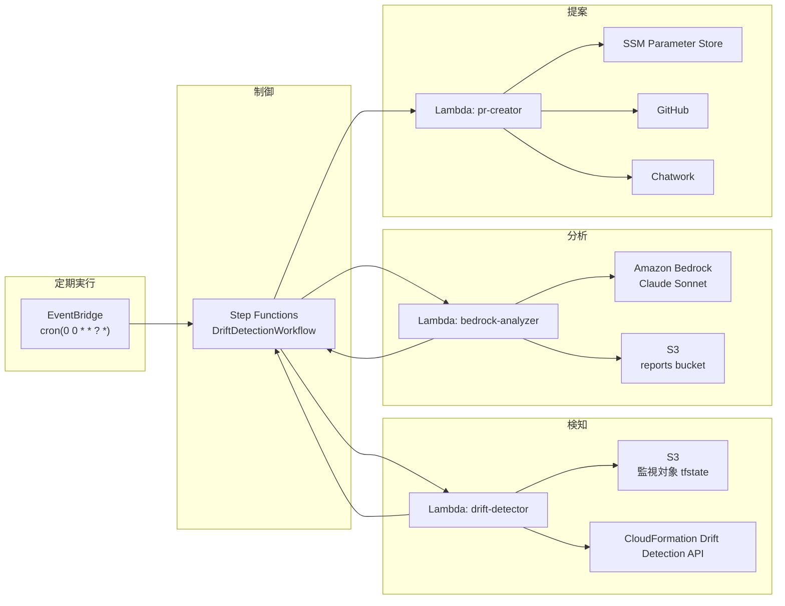
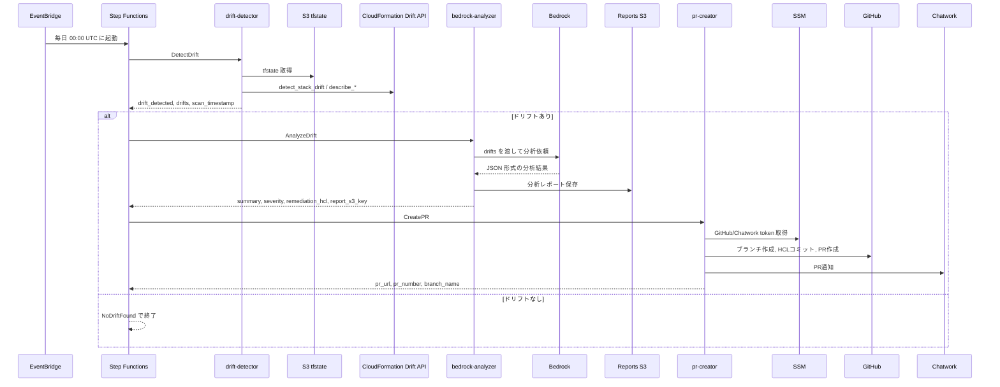
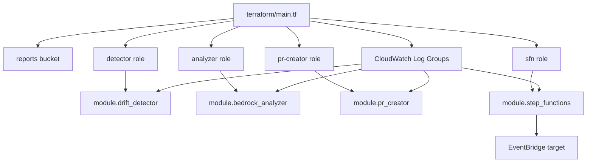
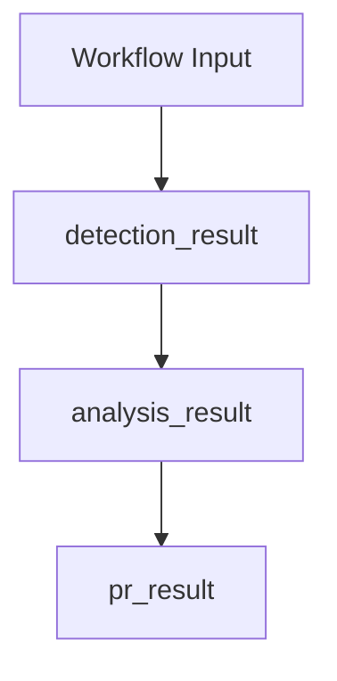
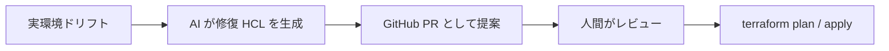

# IaC Drift Detective Architecture

このドキュメントは、`iac-drift-detective` リポジトリの実装をベースに、システム全体の責務・データフロー・Terraform構成・Lambda実装・運用上の注意点を一気に理解するための詳細ガイドです。

README の概要より一段深く、`terraform/`、`lambda/`、`step_functions/`、`.github/workflows/` の実コードを読み解いた結果を整理しています。設計意図だけでなく、現時点の実装に依存する前提やズレも明記しています。

## 1. このプロジェクトは何をするのか

IaC Drift Detective は、Terraform で管理している AWS リソースと、実際の AWS 上の状態の差分を定期的に検知し、その差分を Amazon Bedrock で分析して、修復用 Terraform HCL を GitHub Pull Request として提案する自動化システムです。

狙いは「自動適用」ではなく「自動発見 + 自動提案」です。  
つまり、AI が変更案を生成しても、そのまま本番反映はせず、最終判断は Pull Request レビューと `terraform plan` / `terraform apply` を行う人間に委ねます。

## 2. 全体像



## 3. エンドツーエンドの実行シーケンス



## 4. リポジトリ構成の見方

| パス | 役割 |
|---|---|
| `terraform/` | AWS インフラ定義の本体 |
| `terraform/modules/` | Lambda と Step Functions の個別モジュール |
| `terraform/environments/dev/` | dev 環境のエントリーポイント |
| `lambda/drift_detector/` | tfstate と実環境差分の抽出 |
| `lambda/bedrock_analyzer/` | Bedrock 分析とレポート保存 |
| `lambda/pr_creator/` | GitHub PR 作成と Chatwork 通知 |
| `step_functions/drift_workflow.asl.json` | ワークフロー定義 |
| `.github/workflows/` | Terraform / Lambda の CI/CD |
| `docs/` | 補助ドキュメント |

理解の入口としては、次の順で読むと追いやすいです。

1. `README.md`
2. `terraform/main.tf`
3. `step_functions/drift_workflow.asl.json`
4. `lambda/drift_detector/index.py`
5. `lambda/bedrock_analyzer/index.py`
6. `lambda/pr_creator/index.py`

## 5. Terraform アーキテクチャ

### 5.1 ルートモジュールの責務

`terraform/main.tf` は、このシステム全体の親スタックです。大きく分けると次の 5 領域を管理しています。

| 領域 | 主なリソース |
|---|---|
| 保存 | `aws_s3_bucket.reports` と関連設定 |
| IAM | 3つの Lambda ロール + Step Functions ロール |
| スケジュール | `aws_cloudwatch_event_rule.schedule` |
| シークレット配置 | `aws_ssm_parameter.github_token`, `chatwork_api_token` |
| 実行基盤 | 各 Lambda module と Step Functions module |

### 5.2 Terraform 依存関係



### 5.3 環境レイヤー

`terraform/environments/dev/main.tf` は、ルートモジュール `../../` を呼び出すだけの薄いエントリーポイントです。  
環境固有値は `terraform/environments/dev/terraform.tfvars` から注入されます。

この構成により、将来 `stg/` や `prod/` を追加するときも、同じルートモジュールを再利用できます。

### 5.4 各 Terraform module の役割

| Module | 作るもの | 補足 |
|---|---|---|
| `modules/drift_detector` | `drift-detective-detector` Lambda | tfstate / CloudFormation 比較 |
| `modules/bedrock_analyzer` | `drift-detective-analyzer` Lambda | Bedrock 呼び出しとレポート保存 |
| `modules/pr_creator` | `drift-detective-pr-creator` Lambda | GitHub PR と通知 |
| `modules/step_functions` | `DriftDetectionWorkflow` | Lambda 3段のオーケストレーション |

すべての Lambda モジュールは `archive_file` を使って `lambda/<name>/` ディレクトリを zip 化し、その成果物を `aws_lambda_function` に渡しています。

## 6. Lambda コンポーネント詳細

### 6.1 drift-detector

対象ファイル:

- `lambda/drift_detector/index.py`
- `lambda/drift_detector/drift_scanner.py`
- `lambda/drift_detector/state_comparator.py`

責務:

1. 監視対象 tfstate を S3 から取得
2. CloudFormation Drift Detection API を呼ぶ
3. tfstate と API 結果を突き合わせる
4. 差分を Step Functions に返す

入力:

```json
{}
```

主な環境変数:

| 変数名 | 意味 |
|---|---|
| `MONITORED_TFSTATE_BUCKET` | 監視対象 tfstate の S3 バケット |
| `MONITORED_TFSTATE_KEY` | 監視対象 tfstate のキー |
| `MONITORED_CFN_STACKS` | 監視対象 CloudFormation スタック名のカンマ区切り |

出力の実装形:

```json
{
  "drift_detected": true,
  "drift_count": 2,
  "drifts": [
    {
      "resource_address": "aws_security_group.example",
      "resource_type": "AWS::EC2::SecurityGroup",
      "physical_id": "sg-xxxx",
      "drift_type": "PROPERTY_CHANGE",
      "changed_properties": [
        {
          "property_path": "SecurityGroupIngress",
          "expected_value": [],
          "actual_value": [{"CidrIp": "0.0.0.0/0"}]
        }
      ],
      "severity": "HIGH"
    }
  ],
  "scan_timestamp": "2026-05-08T00:00:00+00:00",
  "monitored_stacks": ["stack-a", "stack-b"]
}
```

内部ロジックのポイント:

- `get_terraform_resources()` は tfstate の `resources` を走査し、`managed` なリソースだけを対象にします。
- `get_cloudformation_drifts()` は `detect_stack_drift` 実行後、最大 60 秒ポーリングします。
- `compare_states()` は `physical_id` を軸に tfstate 側のリソースを推定し、期待値と実値のキー差分を抽出します。
- `calculate_severity()` は変更プロパティ名のキーワードベースで `HIGH/MEDIUM/LOW` を判定します。

設計上の特徴:

- 例外は極力握りつぶさず、Step Functions のリトライに委ねる方針です。
- ただしスタック単位のドリフト取得失敗は `warning` に落としてスキップします。
- 検知ロジックは「Terraform state vs 実環境」の厳密な diff エンジンではなく、CloudFormation Drift API を利用した軽量実装です。

### 6.2 bedrock-analyzer

対象ファイル:

- `lambda/bedrock_analyzer/index.py`
- `lambda/bedrock_analyzer/analyzer.py`
- `lambda/bedrock_analyzer/prompt_builder.py`

責務:

1. drift-detector の出力を受け取る
2. Bedrock にプロンプトを送る
3. 構造化 JSON として返ってきた分析結果を検証する
4. レポートを S3 に保存する

入力:

```json
{
  "drifts": [
    {
      "resource_address": "aws_security_group.example",
      "severity": "HIGH"
    }
  ]
}
```

主な環境変数:

| 変数名 | 意味 |
|---|---|
| `REPORTS_BUCKET` | 分析レポート保存先 |
| `BEDROCK_REGION` | Bedrock 呼び出しリージョン。既定値は `us-east-1` |

Bedrock への依頼内容:

- システムプロンプトで JSON 以外を返さないよう強制
- 各ドリフトについて、リソース種別、物理 ID、変更プロパティ、期待値、実値、重要度を文章化
- 求める出力は `drift_summary`, `root_cause`, `severity`, `affected_resources`, `remediation_hcl`, `remediation_steps`, `risk_assessment`

バリデーション項目:

1. `drift_summary` が文字列
2. `root_cause` が存在
3. `remediation_hcl` が存在し `resource` を含む
4. `severity` が `HIGH` / `MEDIUM` / `LOW`
5. `affected_resources` がリスト

S3 レポート保存形式:

- キー: `reports/YYYY/MM/DD/drift-report-YYYYMMDDTHHMMSSZ.json`
- 内容: Bedrock 分析結果 + `original_drifts` + `analysis_timestamp`

モデル実装上の事実:

- README の説明文では Sonnet 3.5 と書かれていますが、実コードの `MODEL_ID` は `anthropic.claude-sonnet-4-20250514-v1:0` です。

### 6.3 pr-creator

対象ファイル:

- `lambda/pr_creator/index.py`
- `lambda/pr_creator/github_client.py`
- `lambda/pr_creator/hcl_formatter.py`

責務:

1. SSM から GitHub / Chatwork トークンを取得
2. HCL を整形・最低限バリデーション
3. GitHub ブランチ作成、HCL コミット、PR 作成
4. Chatwork 通知

入力:

```json
{
  "drift_summary": "Security Group が手動変更された",
  "root_cause": "AWS Console から直接更新された可能性が高い",
  "severity": "HIGH",
  "affected_resources": ["aws_security_group.example"],
  "remediation_hcl": "resource \"...\" { ... }",
  "risk_assessment": "公開範囲の拡大によるセキュリティリスク"
}
```

主な環境変数:

| 変数名 | 意味 |
|---|---|
| `GITHUB_OWNER` | PR 作成対象の GitHub owner |
| `GITHUB_REPO` | PR 作成対象 repo |
| `CHATWORK_ROOM_ID` | 通知先ルーム |

HCL 整形の内容:

- Markdown コードブロック除去
- 前後空白除去
- `resource` キーワード有無の確認
- `{` と `}` の個数一致チェック
- AI 生成物であることを示すコメントヘッダ付与

GitHub PR 作成の流れ:

1. `main` の SHA を取得
2. `fix/drift-YYYY-MM-DD-{severity}` ブランチ作成
3. `terraform/drift-fixes/fix-{timestamp}.tf` を追加
4. PR 本文に概要、原因、リスク、修復手順、HCL を埋め込む
5. `drift-fix` と重要度ラベルを付与

通知設計:

- Chatwork 通知失敗はワークフロー全体の失敗にしません。
- GitHub PR 作成失敗は例外を再送出し、Step Functions 失敗として扱います。

## 7. Step Functions ワークフロー

対象ファイル:

- `step_functions/drift_workflow.asl.json`
- `terraform/modules/step_functions/main.tf`

ステート構成:

| State | 種別 | 役割 |
|---|---|---|
| `DetectDrift` | Task | `drift-detector` 実行 |
| `CheckDriftExists` | Choice | `drift_detected` を判定 |
| `NoDriftFound` | Succeed | ドリフトなしで終了 |
| `AnalyzeDrift` | Task | `bedrock-analyzer` 実行 |
| `CreatePR` | Task | `pr-creator` 実行 |
| `WorkflowComplete` | Succeed | 正常終了 |

タイムアウトとリトライ:

| State | Timeout | Retry |
|---|---|---|
| `DetectDrift` | 120 秒 | 10 秒間隔, 最大 2 回, backoff 2 |
| `AnalyzeDrift` | 360 秒 | 30 秒間隔, 最大 2 回, backoff 1.5 |
| `CreatePR` | 60 秒 | 15 秒間隔, 最大 2 回, backoff 2 |

特徴:

- ドリフトがない場合は Bedrock を呼ばないため、不要な推論コストが発生しません。
- Step Functions のログ出力レベルは `ERROR` で、CloudWatch Logs への出力コストを抑えています。
- ASL は `templatefile()` により Lambda ARN を埋め込んでいます。

### 7.1 代表的な失敗モード

ワークフロー全体としては、失敗を完全に隠すよりも、Step Functions 上で明示的に失敗として見える設計が採られています。

| レイヤー | 代表的な失敗 | 想定される扱い |
|---|---|---|
| `DetectDrift` | tfstate 取得失敗、CloudFormation API エラー | 例外送出またはリトライ後に Task 失敗 |
| `DetectDrift` | 個別スタックのドリフト検知失敗 | warning を出して該当スタックをスキップ |
| `AnalyzeDrift` | Bedrock 呼び出し失敗 | Step Functions の Task 失敗 |
| `AnalyzeDrift` | AI 出力がスキーマ不正 | `ValueError` により Task 失敗 |
| `CreatePR` | GitHub API 認証・作成失敗 | Task 失敗 |
| `CreatePR` | Chatwork 通知失敗 | warning のみ。PR 作成成功を優先 |

## 8. データの流れ

### 8.1 制御データ

Step Functions 内では、各 Task の戻り値が `$.detection_result`、`$.analysis_result`、`$.pr_result` に格納されます。



### 8.2 永続化されるデータ

| 保存先 | 内容 |
|---|---|
| 監視対象 tfstate S3 | Terraform state |
| reports bucket | Bedrock の分析レポート JSON |
| GitHub repo | 修復 HCL ファイルと PR |
| CloudWatch Logs | 各 Lambda と Step Functions の実行ログ |
| SSM Parameter Store | GitHub / Chatwork の秘密情報 |

## 9. IAM とセキュリティ設計

### 9.1 実行ロール分離

このプロジェクトでは、責務単位で IAM ロールを分離しています。

| ロール | 主な権限 |
|---|---|
| detector role | `s3:GetObject`, CloudFormation Drift API, Logs |
| analyzer role | `bedrock:InvokeModel`, `s3:PutObject`, Logs |
| pr-creator role | `ssm:GetParameter`, `s3:GetObject`, Logs |
| sfn role | `lambda:InvokeFunction`, Step Functions のログ配信 |

### 9.2 セキュリティ上の強い設計ポイント

- Bedrock への権限は特定モデル ARN に絞られています。
- GitHub / Chatwork トークンは環境変数直書きではなく SSM SecureString です。
- レポート用 S3 バケットはパブリックアクセスを全面ブロックしています。
- ドリフト修復の本流では、Lambda が直接 `terraform apply` せず PR 提案で止まります。

### 9.3 人間レビュー前提の安全装置



この設計が重要なのは、AI が誤った修復案を生成したとしても、即座にインフラへ反映されないためです。

補足として、この「PR 止まり」はドリフト修復フローの話です。  
一方で、このリポジトリ自身の Terraform CI は `.github/workflows/terraform.yml` 上で `main` への push 時に `terraform apply -auto-approve` を実行する構成になっています。

## 10. 観測性と運用

ログ出力:

- 各 Lambda は `aws_lambda_powertools` の `Logger` と `Tracer` を使用
- Terraform の `logging_config` で Lambda ログ形式を JSON に指定
- Step Functions は `ERROR` のみ出力

ロググループ:

| ロググループ | 保持日数 |
|---|---|
| `/aws/lambda/drift-detective-detector` | 30日 |
| `/aws/lambda/drift-detective-analyzer` | 30日 |
| `/aws/lambda/drift-detective-pr-creator` | 30日 |
| `/aws/states/DriftDetectionWorkflow` | 30日 |

## 11. GitHub Actions とデプロイモデル

### 11.1 Terraform Workflow

`.github/workflows/terraform.yml` は次を行います。

1. OIDC で AWS 認証
2. `terraform fmt`
3. `terraform init`
4. `terraform validate`
5. PR 時は `terraform plan` をコメント投稿
6. `main` への push 時は `terraform apply -auto-approve`

### 11.2 Lambda Workflow

`.github/workflows/lambda_deploy.yml` は matrix で 3 Lambda を並列デプロイします。

1. 依存ライブラリを各 Lambda ディレクトリへインストール
2. zip パッケージ作成
3. デプロイ用 S3 バケットへアップロード
4. `aws lambda update-function-code`
5. 完了待ち
6. バージョン publish

## 12. 現在の実装で知っておきたいズレ・注意点

このドキュメントでは、設計理想ではなく「現物コード」を優先して読んでいます。その上で、把握しておくと安全なポイントをまとめます。

### 12.1 ドキュメントと実装のズレ

| 項目 | 実装上の事実 |
|---|---|
| Bedrock モデル説明 | README では Sonnet 3.5 表記だが、コードは Sonnet 4 系の model ID |
| Chatwork パラメータ名 | README の一部では `/drift-detective/chatwork-token`、実装は `/drift-detective/chatwork-api-token` |
| 既存 `docs/architecture.md` | 実装より設計案寄りで、返却フィールド名などに差異あり |

### 12.2 Step Functions と Lambda 出力の差異

`DetectDrift` の `ResultSelector` は次を参照しています。

- `$.Payload.stack_name`
- `$.Payload.detection_timestamp`

一方、`drift-detector` が返している実フィールドは次です。

- `monitored_stacks`
- `scan_timestamp`

そのため、Step Functions 上ではこれらの 2 項目は空になるか、意図通りに受け渡されない可能性があります。  
ドリフト判定自体は `drift_detected` を見ているため、主系統は動きますが、メタデータ整合性には改善余地があります。

### 12.3 検知方式の前提

このプロジェクトは「Terraform state を直接 AWS API 群と完全比較する」実装ではありません。  
CloudFormation Drift Detection API を併用しているため、監視対象が CloudFormation スタックとして追えることが前提になっています。

つまり、Terraform 管理対象すべてに対して万能ではなく、現在の検知品質は次に依存します。

- どの CloudFormation スタックを `MONITORED_CFN_STACKS` に入れるか
- `physical_id` と tfstate 内属性の照合がどれだけうまく一致するか

## 13. このプロジェクトの強み

- 完全サーバーレスで、構成が比較的追いやすい
- Bedrock 呼び出しをドリフト発生時だけに絞っており、コスト意識がある
- IAM が責務別に分かれていて読みやすい
- AI 提案を PR 止まりにしており、安全側の設計
- Terraform / Lambda / Step Functions / GitHub Actions が一つの教材としてまとまっている

## 14. 今後の拡張ポイント

| 方向性 | 具体例 |
|---|---|
| 検知精度向上 | Terraform plan JSON を使った比較に寄せる |
| 対象拡張 | 複数 tfstate / 複数環境の並列処理 |
| 通知拡張 | Slack / Teams / Email 対応 |
| 品質向上 | HCL を `terraform validate` 相当で追加検査 |
| 運用強化 | Dead-letter, Alarm, Dashboard, 監査ログ整備 |

## 15. まとめ

IaC Drift Detective は、Terraform 管理からこぼれた変更を検知し、AI によって修復案を生成し、その提案を GitHub PR に落とし込む「提案型ドリフト remediation」システムです。

理解の核は次の 3 点です。

1. 検知は `drift-detector`
2. 分析は `bedrock-analyzer`
3. 提案は `pr-creator`

その 3 つを `Step Functions` がつなぎ、`EventBridge` が毎日起動し、`Terraform` が全体を定義しています。  
この構造を押さえると、コード追加や改善ポイントの見通しがかなり立てやすくなります。
