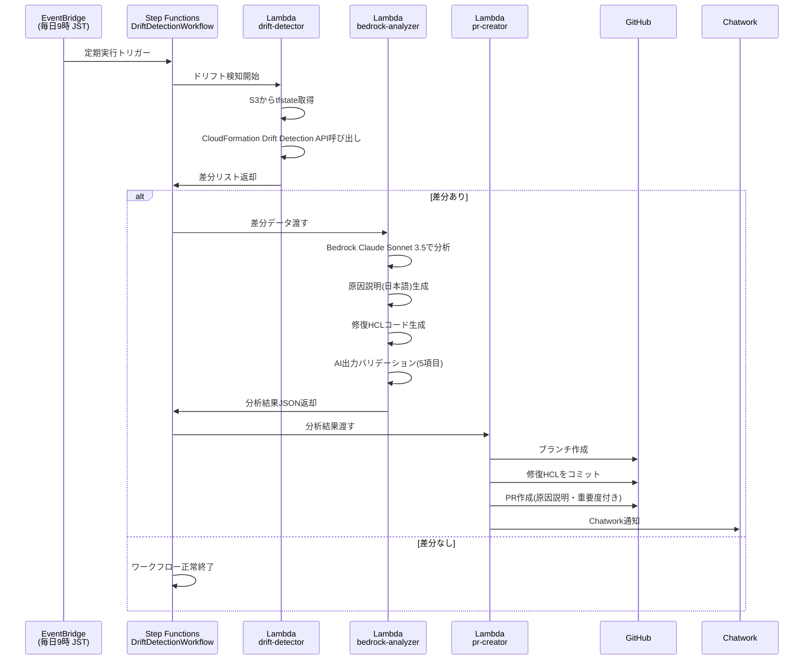

# IaC Drift Detective

> Terraform × Amazon Bedrock で実現する、インフラドリフトの自動検知・AI分析・修復PR自動作成

[](https://github.com/YOUR_GITHUB_USERNAME/iac-drift-detective/actions/workflows/terraform.yml)
[](https://github.com/YOUR_GITHUB_USERNAME/iac-drift-detective/actions/workflows/lambda_deploy.yml)

---

## 概要

IaC Drift Detective は、Terraform で管理するAWSインフラと実際のリソース状態の乖離（ドリフト）を毎日自動で検知し、Amazon Bedrock（Claude Sonnet 3.5）がドリフトの原因を日本語で分析して修復用HCLコードを生成、GitHub PRを自動作成するシステムです。

## このハンズオンで得られること

このハンズオンを通して、単に Terraform をデプロイするだけでなく、「IaC の運用をどう自動化するか」を一連の流れで体験できます。

- Terraform を使った AWS サーバーレス構成の組み立て方
- EventBridge、Step Functions、Lambda をつないだ定期実行ワークフローの作り方
- Amazon Bedrock を使って運用課題を分析し、修復案を生成する流れ
- GitHub PR を使って AI の提案を安全に人間レビューへつなぐ設計
- SSM Parameter Store、IAM 最小権限、OIDC などを含む実践的なセキュリティ設計
- 「検知 → 分析 → 提案 → レビュー」という IaC ドリフト対策の全体像

## アーキテクチャ図



## 機能

- Terraform stateと実AWSリソースの差分を自動検知（AWS CloudFormation Drift Detection API使用）
- Amazon Bedrock（Claude Sonnet 3.5）による原因分析と修復HCLコード生成
- GitHub PRの自動作成（修復コード付き・日本語説明付き）
- Chatworkへのリアルタイム通知（重要度・影響リソース情報付き）
- 重要度（HIGH / MEDIUM / LOW）による優先度付け
- AI出力の5項目バリデーション（不正出力によるPR誤作成を防止）

## 使用技術

| カテゴリ | 技術スタック |
|---|---|
| IaC | Terraform >= 1.9 |
| AI/ML | Amazon Bedrock（Claude Sonnet 3.5） |
| 言語 | Python 3.12（arm64） |
| オーケストレーション | AWS Step Functions |
| CI/CD | GitHub Actions（OIDC認証） |
| 観測性 | AWS Lambda Powertools、CloudWatch Logs |
| 通知 | Chatwork API |
| Secrets管理 | AWS SSM Parameter Store（SecureString） |

## セットアップ

この章は、AWS アカウントと GitHub リポジトリを用意した状態から、このプロジェクトを動かして Step Functions を手動実行するまでを、順番に試せるハンズオン手順です。

## ハンズオンのゴール

この手順を完了すると、次の状態になります。

- Terraform で IaC Drift Detective の AWS リソースが作成される
- Step Functions を手動起動できる
- `drift-detector`、`bedrock-analyzer`、`pr-creator` の 3 Lambda が AWS 上に配置される
- GitHub PR 作成と Chatwork 通知に必要なシークレットが SSM に保存される

## 事前に理解しておくこと

- このシステムは修復 HCL を自動適用しません。AI は GitHub PR までを作成し、最終反映は人間が行います。
- 現在の実装では Bedrock の実際のモデル ID として `anthropic.claude-sonnet-4-20250514-v1:0` を使っています。
- Step Functions を手動起動するときの Terraform output 名は `step_functions_arn` ではなく `state_machine_arn` です。
- Chatwork トークンの SSM パラメータ名は `/drift-detective/chatwork-api-token` です。
- GitHub Actions 用の OIDC ロールは README の旧説明どおり Terraform で自動作成されるわけではありません。必要なら別途用意してください。

## 1. 前提条件

### 必要なツール

- AWS CLI v2
- Terraform `>= 1.9`
- zip コマンド
- Git

### 必要な権限

- AWS 上で S3、IAM、Lambda、Step Functions、CloudWatch Logs、SSM Parameter Store を作成できる権限
- GitHub リポジトリに対して PR を作成できる権限
- Bedrock を `us-east-1` で利用できる権限

### 事前確認コマンド

```bash
aws --version
terraform version
git --version
aws sts get-caller-identity
```

`aws sts get-caller-identity` が成功しない場合は、この先の手順より先に AWS 認証設定を見直してください。

## 2. リポジトリを用意する

```bash
git clone https://github.com/YOUR_GITHUB_USERNAME/iac-drift-detective.git
cd iac-drift-detective
```

自分の fork で試す場合は、以降の `github_owner` と `github_repo` も fork 側の値に合わせてください。

## 3. Bedrock 利用可否を確認する

このプロジェクトは Bedrock を `us-east-1` で呼び出します。まずモデルアクセスが有効か確認します。

```bash
aws bedrock list-foundation-models \
  --region us-east-1 \
  --by-provider Anthropic \
  --query "modelSummaries[].modelId"
```

少なくとも Anthropic 系モデル一覧が取得できることを確認してください。

## 4. Terraform バックエンドを先に作る

このプロジェクトの Terraform は S3 バックエンドを使います。`terraform/environments/dev/backend.hcl` では DynamoDB ロックテーブルも前提になっているため、最初に両方を手動で作成します。

### 4-1. AWS アカウント ID を変数に入れる

```bash
ACCOUNT_ID=$(aws sts get-caller-identity --query Account --output text)
echo "$ACCOUNT_ID"
```

### 4-2. tfstate 用 S3 バケットを作成する

```bash
aws s3 mb "s3://drift-detective-tfstate-${ACCOUNT_ID}" \
  --region ap-northeast-1
```

### 4-3. DynamoDB ロックテーブルを作成する

```bash
aws dynamodb create-table \
  --table-name drift-detective-tfstate-lock \
  --attribute-definitions AttributeName=LockID,AttributeType=S \
  --key-schema AttributeName=LockID,KeyType=HASH \
  --billing-mode PAY_PER_REQUEST \
  --region ap-northeast-1
```

### 4-4. `backend.hcl` のプレースホルダを置き換える

`terraform/environments/dev/backend.hcl` の次の行を自分のアカウント ID に合わせて更新します。

```hcl
bucket = "drift-detective-tfstate-REPLACE_WITH_ACCOUNT_ID"
```

置き換え後の例:

```hcl
bucket = "drift-detective-tfstate-123456789012"
```

## 5. GitHub と Chatwork のトークンを準備する

### GitHub Personal Access Token

`pr-creator` Lambda がブランチ作成、コミット、PR 作成を行うために GitHub Token が必要です。

- 推奨スコープ: `repo`
- 対象: このリポジトリに対して書き込み可能なトークン

### Chatwork Token

通知を試したい場合は Chatwork API Token を用意します。通知不要ならダミー値でも Terraform デプロイ自体は進められますが、`pr-creator` 実行時に通知部分は失敗します。

## 6. SSM Parameter Store にシークレットを登録する

```bash
# GitHub Personal Access Token
aws ssm put-parameter \
  --name "/drift-detective/github-token" \
  --value "ghp_xxxxxxxxxxxxxxxxxxxx" \
  --type SecureString \
  --overwrite \
  --region ap-northeast-1

# Chatwork API Token
aws ssm put-parameter \
  --name "/drift-detective/chatwork-api-token" \
  --value "YOUR_CHATWORK_API_TOKEN" \
  --type SecureString \
  --overwrite \
  --region ap-northeast-1
```

登録できたか確認する場合:

```bash
aws ssm get-parameter \
  --name "/drift-detective/github-token" \
  --with-decryption \
  --region ap-northeast-1
```

## 7. `terraform.tfvars` を編集する

まず dev 環境ディレクトリへ移動します。

```bash
cd terraform/environments/dev
cp terraform.tfvars terraform.tfvars.local
```

`terraform.tfvars` を開いて、少なくとも次の値を実環境に合わせて変更します。

```hcl
environment              = "dev"
github_owner             = "YOUR_GITHUB_USERNAME"
github_repo              = "iac-drift-detective"
chatwork_room_id         = "123456789"
monitored_tfstate_bucket = "YOUR_TFSTATE_BUCKET"
monitored_tfstate_key    = "terraform.tfstate"
```

各項目の意味:

| 項目 | 説明 |
|---|---|
| `github_owner` | PR を作成する GitHub owner |
| `github_repo` | PR 作成先リポジトリ名 |
| `chatwork_room_id` | Chatwork 通知先ルーム ID |
| `monitored_tfstate_bucket` | 監視対象 Terraform state の S3 バケット |
| `monitored_tfstate_key` | 監視対象 Terraform state のキー |

### 監視対象 tfstate について

このシステムは別の Terraform state を監視対象として読む想定です。まずはハンズオンとして、同じ AWS アカウント内にある既存の tfstate バケットとキーを指定してください。

例:

```hcl
monitored_tfstate_bucket = "my-team-terraform-state"
monitored_tfstate_key    = "network/dev/terraform.tfstate"
```

## 8. Terraform を初期化してデプロイする

`terraform/environments/dev` にいる状態で実行します。

### 8-1. 初期化

```bash
terraform init -backend-config=backend.hcl
```

### 8-2. フォーマット確認

```bash
terraform fmt -recursive ../..
```

### 8-3. バリデーション

```bash
terraform validate
```

### 8-4. プラン確認

```bash
terraform plan
```

### 8-5. デプロイ

```bash
terraform apply
```

`apply` 実行後、以下を確認します。

```bash
terraform output
```

特に次の output が見えることを確認してください。

- `state_machine_arn`
- `drift_detector_function_name`
- `bedrock_analyzer_function_name`
- `pr_creator_function_name`
- `reports_bucket_name`

## 9. Lambda デプロイの考え方を理解する

このリポジトリでは Lambda コードは Terraform の `archive_file` でもパッケージされますが、継続運用では `.github/workflows/lambda_deploy.yml` による GitHub Actions デプロイも想定されています。

ハンズオンの最初の 1 回は、Terraform デプロイ後に Lambda 関数が存在することを確認してください。

```bash
aws lambda get-function \
  --function-name drift-detective-detector \
  --region ap-northeast-1
```

同様に次の 2 関数も確認できます。

- `drift-detective-analyzer`
- `drift-detective-pr-creator`

## 10. Step Functions を手動起動する

### 10-1. State Machine ARN を取得する

```bash
STATE_MACHINE_ARN=$(terraform output -raw state_machine_arn)
echo "$STATE_MACHINE_ARN"
```

### 10-2. 実行を開始する

```bash
aws stepfunctions start-execution \
  --state-machine-arn "$STATE_MACHINE_ARN" \
  --region ap-northeast-1
```

### 10-3. 実行一覧を確認する

```bash
aws stepfunctions list-executions \
  --state-machine-arn "$STATE_MACHINE_ARN" \
  --max-results 10 \
  --region ap-northeast-1
```

### 10-4. 特定実行の詳細を確認する

```bash
aws stepfunctions describe-execution \
  --execution-arn "YOUR_EXECUTION_ARN" \
  --region ap-northeast-1
```

## 11. ログを確認する

問題が起きたときは、まず CloudWatch Logs を確認するのが一番早いです。

主なロググループ:

- `/aws/lambda/drift-detective-detector`
- `/aws/lambda/drift-detective-analyzer`
- `/aws/lambda/drift-detective-pr-creator`
- `/aws/states/DriftDetectionWorkflow`

例:

```bash
aws logs tail /aws/lambda/drift-detective-detector \
  --since 30m \
  --follow \
  --region ap-northeast-1
```

## 12. GitHub Actions を使う場合の追加設定

GitHub Actions で `terraform.yml` と `lambda_deploy.yml` を動かしたい場合は、AWS へ AssumeRole できる OIDC ロールを別途準備し、リポジトリシークレット `AWS_ROLE_ARN` に登録します。

リポジトリの Settings > Secrets and variables > Actions に以下を設定します。

| Secret名 | 値 |
|---|---|
| `AWS_ROLE_ARN` | GitHub Actions が AssumeRole する IAM ロール ARN |

注意:

- 現在の Terraform コードには GitHub Actions 用 OIDC ロール作成が含まれていません
- そのため、このロールは既存の組織共通ロールを使うか、別途手動で作成してください

## 13. ハンズオンで詰まりやすいポイント

### `terraform init` で失敗する

よくある原因:

- `backend.hcl` のバケット名が `REPLACE_WITH_ACCOUNT_ID` のまま
- DynamoDB テーブル `drift-detective-tfstate-lock` が未作成
- AWS 認証先アカウントが想定と違う

### Step Functions は起動したがドリフトが出ない

よくある原因:

- `monitored_tfstate_bucket` / `monitored_tfstate_key` が間違っている
- 監視対象 tfstate 自体に対象リソースがない
- CloudFormation Drift API で追えない構成を見ている
- 現在の実装では `MONITORED_CFN_STACKS` の設定経路が弱く、監視対象スタック指定を追加調整した方がよい

### PR が作成されない

よくある原因:

- `/drift-detective/github-token` が無効
- `github_owner` / `github_repo` が誤っている
- GitHub Token に `repo` 権限がない

### Chatwork 通知だけ失敗する

よくある原因:

- `/drift-detective/chatwork-api-token` の値が誤っている
- `chatwork_room_id` が違う

この場合、実装上は PR 作成成功を優先し、Chatwork 通知失敗は warning 扱いです。

## 14. 運用時によく使う確認コマンド

### CloudWatch Logs Insights クエリ

AWS コンソールの CloudWatch Logs Insights で、次のクエリをそのまま使えます。

`drift-detector` のエラー確認:

```sql
fields @timestamp, @message, level, error
| filter @logGroup = "/aws/lambda/drift-detective-detector"
| filter level = "ERROR" or ispresent(error)
| sort @timestamp desc
| limit 50
```

`bedrock-analyzer` のバリデーション失敗確認:

```sql
fields @timestamp, @message, validation_errors
| filter @logGroup = "/aws/lambda/drift-detective-analyzer"
| filter @message like /validation/
| sort @timestamp desc
| limit 20
```

`pr-creator` の PR 作成成功確認:

```sql
fields @timestamp, pr_url, severity, affected_count
| filter @logGroup = "/aws/lambda/drift-detective-pr-creator"
| filter @message like /PR created/
| sort @timestamp desc
| limit 30
```

全 Lambda の実行時間とメモリ使用量確認:

```sql
fields @timestamp, @logStream, @duration, @billedDuration, @memorySize, @maxMemoryUsed
| filter @type = "REPORT"
| filter @logGroup in [
    "/aws/lambda/drift-detective-detector",
    "/aws/lambda/drift-detective-analyzer",
    "/aws/lambda/drift-detective-pr-creator"
  ]
| stats avg(@duration), max(@duration), sum(@billedDuration) by @logGroup
```

### Step Functions 実行履歴の確認

```bash
STATE_MACHINE_ARN=$(terraform output -raw state_machine_arn)

aws stepfunctions list-executions \
  --state-machine-arn "$STATE_MACHINE_ARN" \
  --max-results 10 \
  --region ap-northeast-1

aws stepfunctions get-execution-history \
  --execution-arn "YOUR_EXECUTION_ARN" \
  --region ap-northeast-1
```

## 15. 障害対応の入口

### `drift-detector` が失敗する場合

確認コマンド:

```bash
aws logs filter-log-events \
  --log-group-name "/aws/lambda/drift-detective-detector" \
  --start-time $(date -d '1 hour ago' +%s000) \
  --filter-pattern "ERROR" \
  --region ap-northeast-1

aws cloudformation list-stacks \
  --stack-status-filter CREATE_COMPLETE UPDATE_COMPLETE \
  --region ap-northeast-1
```

主な確認ポイント:

- `monitored_tfstate_bucket` と `monitored_tfstate_key` が正しいか
- Lambda ロールに tfstate バケットへの `s3:GetObject` があるか
- CloudFormation Drift Detection API の対象スタックが大きすぎないか

### `bedrock-analyzer` がバリデーションエラーになる場合

確認コマンド:

```bash
aws logs filter-log-events \
  --log-group-name "/aws/lambda/drift-detective-analyzer" \
  --start-time $(date -d '1 hour ago' +%s000) \
  --filter-pattern "validation" \
  --region ap-northeast-1
```

Bedrock 単体テスト:

```bash
aws bedrock-runtime invoke-model \
  --model-id anthropic.claude-sonnet-4-20250514-v1:0 \
  --body '{"anthropic_version":"bedrock-2023-05-31","max_tokens":100,"messages":[{"role":"user","content":"hello"}]}' \
  --region us-east-1 \
  /tmp/bedrock_test.json
```

主な確認ポイント:

- Bedrock が JSON の必須フィールドを返しているか
- `severity` が `HIGH` / `MEDIUM` / `LOW` のいずれかか
- `remediation_hcl` に `resource` が含まれているか

### `pr-creator` が失敗する場合

確認コマンド:

```bash
aws logs filter-log-events \
  --log-group-name "/aws/lambda/drift-detective-pr-creator" \
  --start-time $(date -d '1 hour ago' +%s000) \
  --filter-pattern "ERROR" \
  --region ap-northeast-1
```

主な確認ポイント:

- `/drift-detective/github-token` が有効か
- GitHub Token に `repo` 権限があるか
- `github_owner` と `github_repo` が正しいか
- 同名ブランチが既に存在していないか

## 16. メンテナンス

### GitHub Token の更新

```bash
aws ssm put-parameter \
  --name "/drift-detective/github-token" \
  --value "ghp_NEW_TOKEN" \
  --type SecureString \
  --overwrite \
  --region ap-northeast-1
```

### Chatwork Token の更新

```bash
aws ssm put-parameter \
  --name "/drift-detective/chatwork-api-token" \
  --value "NEW_CHATWORK_TOKEN" \
  --type SecureString \
  --overwrite \
  --region ap-northeast-1
```

### Bedrock モデル確認

```bash
aws bedrock list-foundation-models \
  --by-provider Anthropic \
  --region us-east-1 \
  --query "modelSummaries[].modelId"
```

### Lambda 依存ライブラリ更新時の流れ

```bash
pip-audit -r lambda/drift_detector/requirements.txt
pip-audit -r lambda/bedrock_analyzer/requirements.txt
pip-audit -r lambda/pr_creator/requirements.txt
```

依存を更新したら、`lambda_deploy.yml` により再デプロイする運用を想定しています。

## 17. コスト確認と最適化

### 月次コスト確認例

```bash
aws ce get-cost-and-usage \
  --time-period Start=$(date +%Y-%m-01),End=$(date +%Y-%m-%d) \
  --granularity MONTHLY \
  --filter '{"Tags":{"Key":"Project","Values":["iac-drift-detective"]}}' \
  --metrics "BlendedCost" \
  --region us-east-1
```

### コスト最適化の考え方

- 実行頻度を毎日から週次に落とす
- ドリフトなし時は Bedrock を呼ばない現行設計を維持する
- Lambda メモリサイズを実測で見直す
- S3 レポートのライフサイクルで古いデータを自動削除する

## ディレクトリ構造

```
iac-drift-detective/
├── .github/
│   └── workflows/
│       ├── terraform.yml          # Terraform CI/CD（OIDC認証）
│       └── lambda_deploy.yml      # Lambda並列デプロイ（matrix戦略）
├── terraform/
│   ├── main.tf                    # ルートモジュール
│   ├── variables.tf
│   ├── outputs.tf
│   ├── backend.tf
│   ├── modules/
│   │   ├── drift_detector/        # ドリフト検知Lambdaインフラ
│   │   ├── bedrock_analyzer/      # Bedrock分析Lambdaインフラ
│   │   ├── pr_creator/            # GitHub PR作成Lambdaインフラ
│   │   └── step_functions/        # Step Functionsオーケストレーション
│   └── environments/
│       └── dev/                   # dev環境エントリーポイント
├── lambda/
│   ├── drift_detector/            # ドリフト検知ロジック
│   ├── bedrock_analyzer/          # AI分析・HCL生成ロジック
│   └── pr_creator/                # GitHub操作・通知ロジック
├── step_functions/
│   └── drift_workflow.asl.json    # State Machine定義（ASL）
└── docs/
    ├── architecture.md            # 統合先への案内
    └── runbook.md                 # 統合先への案内
```

## コスト

| リソース | 想定コスト/月 |
|---|---|
| Lambda（3関数 × 毎日実行） | ~$0.10 |
| Step Functions | ~$0.01 |
| Bedrock Claude Sonnet 3.5 | ~$1.00 |
| EventBridge | 無料枠内 |
| S3（レポート保存） | ~$0.10 |
| **合計** | **~$1.50/月** |

## 設計の工夫・こだわり

### Lambda実行ロールに `terraform apply` 権限を与えない理由

修復HCLを自動適用せず、必ずGitHub PRを経由して人間がレビューする設計にしています。Bedrockが生成したHCLが意図しないリソースを変更・削除するリスクを排除し、「AIによる提案 → 人間によるレビュー → 適用」のサイクルを維持するためです。

### AI出力バリデーションを実装した理由

Bedrockの出力が構造的に不正（フィールド欠損・型違反）な場合、後続のPR作成処理が予期せぬ内容をコミットするリスクがあります。5項目のバリデーションを通過した出力のみPR作成に進み、失敗時はStep FunctionsのTaskFailedとして処理します。

### arm64（Graviton）を選択した理由

同等スペックのx86_64比で約20%のコスト削減と性能向上が見込めます。AWS Lambda Powertoolsがarm64対応済みのため、採用リスクは低い判断です。

### OIDC認証のみ使用する理由

GitHub SecretsにAWSアクセスキーを保存すると、Secretsが漏洩した際に長期的なAWSアクセスを許してしまいます。OIDCでは実行時のみ一時認証情報を発行するため、漏洩リスクを最小化できます。

## 詳細ドキュメント

- [アーキテクチャ詳細](ARCHITECTURE.md)
- `docs/architecture.md` と `docs/runbook.md` の内容は、それぞれ `ARCHITECTURE.md` と `README.md` に統合済みです
