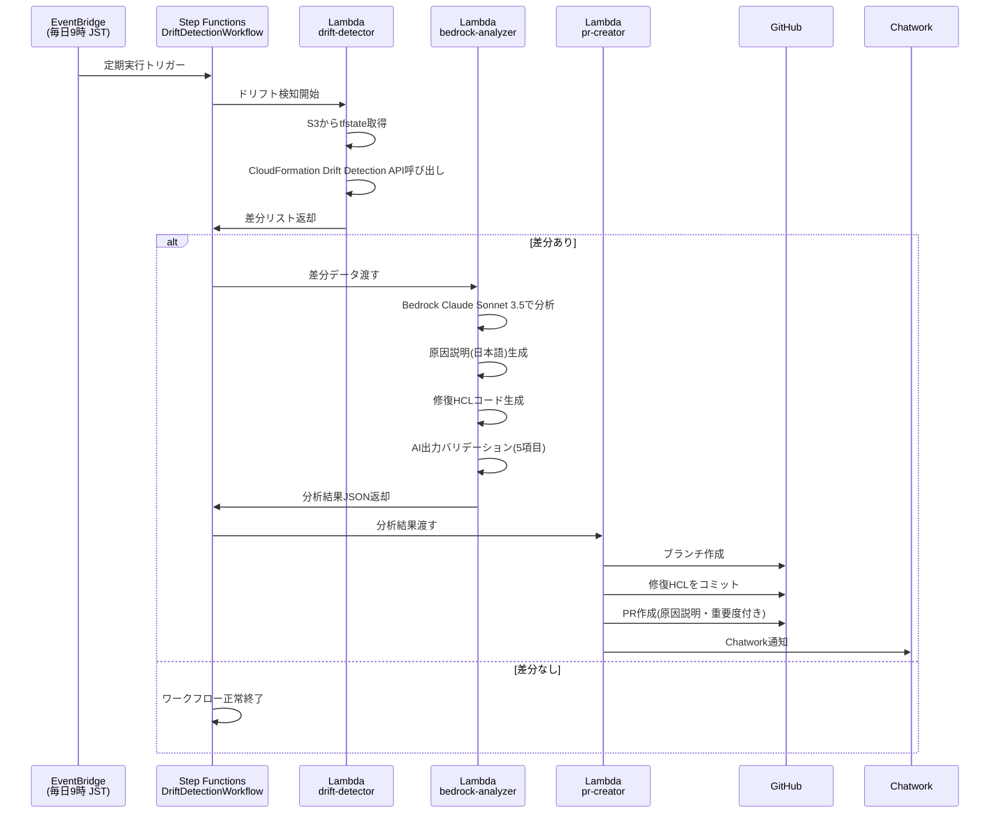

# IaC Drift Detective

> Terraform × Amazon Bedrock で実現する、インフラドリフトの自動検知・AI分析・修復PR自動作成

[](https://github.com/YOUR_GITHUB_USERNAME/iac-drift-detective/actions/workflows/terraform.yml)
[](https://github.com/YOUR_GITHUB_USERNAME/iac-drift-detective/actions/workflows/lambda_deploy.yml)

---

## 概要

IaC Drift Detective は、Terraform で管理するAWSインフラと実際のリソース状態の乖離（ドリフト）を毎日自動で検知し、Amazon Bedrock（Claude Sonnet 3.5）がドリフトの原因を日本語で分析して修復用HCLコードを生成、GitHub PRを自動作成するシステムです。

## アーキテクチャ図



## 機能

- Terraform stateと実AWSリソースの差分を自動検知（AWS CloudFormation Drift Detection API使用）
- Amazon Bedrock（Claude Sonnet 3.5）による原因分析と修復HCLコード生成
- GitHub PRの自動作成（修復コード付き・日本語説明付き）
- Chatworkへのリアルタイム通知（重要度・影響リソース情報付き）
- 重要度（HIGH / MEDIUM / LOW）による優先度付け
- AI出力の5項目バリデーション（不正出力によるPR誤作成を防止）

## 使用技術

| カテゴリ | 技術スタック |
|---|---|
| IaC | Terraform >= 1.9 |
| AI/ML | Amazon Bedrock（Claude Sonnet 3.5） |
| 言語 | Python 3.12（arm64） |
| オーケストレーション | AWS Step Functions |
| CI/CD | GitHub Actions（OIDC認証） |
| 観測性 | AWS Lambda Powertools、CloudWatch Logs |
| 通知 | Chatwork API |
| Secrets管理 | AWS SSM Parameter Store（SecureString） |

## セットアップ

### 1. Prerequisites

- AWS CLI v2 がインストール済みであること
- Terraform >= 1.9 がインストール済みであること
- GitHub リポジトリへの管理者権限があること
- Amazon Bedrock で Claude Sonnet 3.5 が有効化済みであること（us-east-1）

### 2. AWS OIDC プロバイダー設定

GitHub ActionsからAWSへアクセスキーなしでデプロイするため、OIDCプロバイダーを設定します。

```bash
# OIDCプロバイダー作成
aws iam create-open-id-connect-provider \
  --url https://token.actions.githubusercontent.com \
  --client-id-list sts.amazonaws.com \
  --thumbprint-list 6938fd4d98bab03faadb97b34396831e3780aea1

# GitHub Actions用IAMロール作成（信頼ポリシー）
# terraform/environments/dev/ を apply すると自動作成されます
```

### 3. GitHub Secrets の設定

リポジトリの Settings > Secrets and variables > Actions に以下を設定:

| Secret名 | 値 |
|---|---|
| `AWS_ROLE_ARN` | GitHub Actions用IAMロールのARN |

### 4. SSM Parameter Store にトークンを設定

```bash
# GitHub Personal Access Token（repo権限が必要）
aws ssm put-parameter \
  --name "/drift-detective/github-token" \
  --value "ghp_xxxxxxxxxxxx" \
  --type SecureString \
  --region ap-northeast-1

# Chatwork APIトークン
aws ssm put-parameter \
  --name "/drift-detective/chatwork-token" \
  --value "YOUR_CHATWORK_TOKEN" \
  --type SecureString \
  --region ap-northeast-1
```

### 5. terraform.tfvars を編集

```bash
cd terraform/environments/dev
cp terraform.tfvars terraform.tfvars.local  # バックアップ
vi terraform.tfvars
```

以下の値を実際の値に変更:

```hcl
github_owner             = "your-github-username"
github_repo              = "iac-drift-detective"
chatwork_room_id         = "123456789"
monitored_tfstate_bucket = "your-tfstate-bucket-name"
monitored_tfstate_key    = "terraform.tfstate"
```

### 6. Terraform 初期デプロイ

```bash
cd terraform/environments/dev

# S3バックエンドを手動作成（初回のみ）
aws s3 mb s3://drift-detective-tfstate-$(aws sts get-caller-identity --query Account --output text) \
  --region ap-northeast-1

# Terraform初期化
terraform init -backend-config=backend.hcl

# プランを確認
terraform plan

# デプロイ
terraform apply
```

### 7. 動作確認（手動実行）

```bash
# Step Functionsを手動起動
aws stepfunctions start-execution \
  --state-machine-arn $(terraform output -raw step_functions_arn) \
  --region ap-northeast-1

# 実行状態を確認
aws stepfunctions list-executions \
  --state-machine-arn $(terraform output -raw step_functions_arn) \
  --region ap-northeast-1
```

## ディレクトリ構造

```
iac-drift-detective/
├── .github/
│   └── workflows/
│       ├── terraform.yml          # Terraform CI/CD（OIDC認証）
│       └── lambda_deploy.yml      # Lambda並列デプロイ（matrix戦略）
├── terraform/
│   ├── main.tf                    # ルートモジュール
│   ├── variables.tf
│   ├── outputs.tf
│   ├── backend.tf
│   ├── modules/
│   │   ├── drift_detector/        # ドリフト検知Lambdaインフラ
│   │   ├── bedrock_analyzer/      # Bedrock分析Lambdaインフラ
│   │   ├── pr_creator/            # GitHub PR作成Lambdaインフラ
│   │   └── step_functions/        # Step Functionsオーケストレーション
│   └── environments/
│       └── dev/                   # dev環境エントリーポイント
├── lambda/
│   ├── drift_detector/            # ドリフト検知ロジック
│   ├── bedrock_analyzer/          # AI分析・HCL生成ロジック
│   └── pr_creator/                # GitHub操作・通知ロジック
├── step_functions/
│   └── drift_workflow.asl.json    # State Machine定義（ASL）
└── docs/
    ├── architecture.md            # アーキテクチャ詳細
    └── runbook.md                 # 運用手順書
```

## コスト

| リソース | 想定コスト/月 |
|---|---|
| Lambda（3関数 × 毎日実行） | ~$0.10 |
| Step Functions | ~$0.01 |
| Bedrock Claude Sonnet 3.5 | ~$1.00 |
| EventBridge | 無料枠内 |
| S3（レポート保存） | ~$0.10 |
| **合計** | **~$1.50/月** |

## 設計の工夫・こだわり

### Lambda実行ロールに `terraform apply` 権限を与えない理由

修復HCLを自動適用せず、必ずGitHub PRを経由して人間がレビューする設計にしています。Bedrockが生成したHCLが意図しないリソースを変更・削除するリスクを排除し、「AIによる提案 → 人間によるレビュー → 適用」のサイクルを維持するためです。

### AI出力バリデーションを実装した理由

Bedrockの出力が構造的に不正（フィールド欠損・型違反）な場合、後続のPR作成処理が予期せぬ内容をコミットするリスクがあります。5項目のバリデーションを通過した出力のみPR作成に進み、失敗時はStep FunctionsのTaskFailedとして処理します。

### arm64（Graviton）を選択した理由

同等スペックのx86_64比で約20%のコスト削減と性能向上が見込めます。AWS Lambda Powertoolsがarm64対応済みのため、採用リスクは低い判断です。

### OIDC認証のみ使用する理由

GitHub SecretsにAWSアクセスキーを保存すると、Secretsが漏洩した際に長期的なAWSアクセスを許してしまいます。OIDCでは実行時のみ一時認証情報を発行するため、漏洩リスクを最小化できます。

## 詳細ドキュメント

- [アーキテクチャ詳細](docs/architecture.md)
- [運用手順書](docs/runbook.md)
